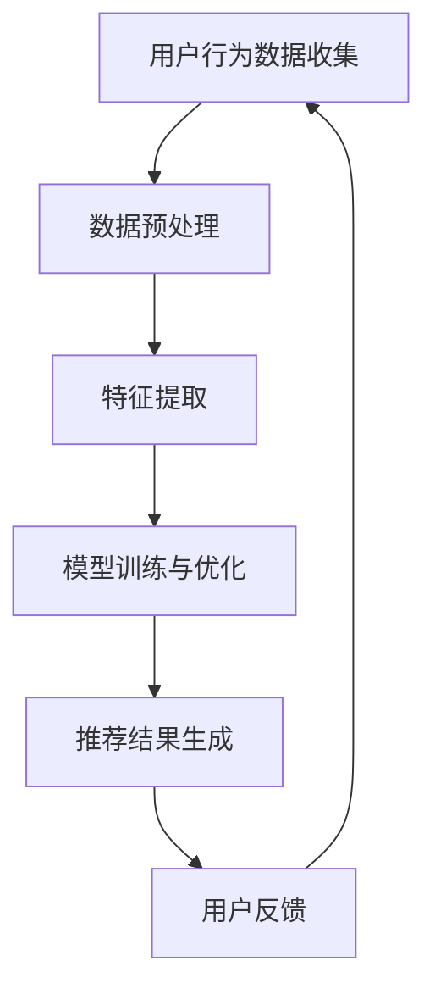

                 

关键词：电商平台、搜索推荐系统、AI 大模型、性能优化、效率提升、准确率、实时性

摘要：本文旨在探讨如何通过AI大模型优化电商平台搜索推荐系统，提升系统的性能、效率、准确率和实时性。我们将深入分析当前推荐系统面临的挑战，阐述AI大模型的核心原理，并提供详细的算法实现和数学模型，最后讨论其实际应用场景和未来发展趋势。

## 1. 背景介绍

随着互联网的快速发展，电商平台已经成为现代商业活动中不可或缺的一部分。用户对个性化搜索和推荐的需求日益增长，这推动了电商平台在搜索推荐系统上的投入。然而，随着数据量的指数级增长，传统的搜索推荐系统面临着性能瓶颈和准确率问题。为解决这些问题，人工智能，特别是AI大模型技术，成为了优化电商平台搜索推荐系统的重要手段。

当前，电商平台搜索推荐系统面临着以下几个主要挑战：

- **数据量大**：电商平台每天产生的数据量巨大，如何高效处理和利用这些数据成为了一大难题。
- **实时性要求高**：用户对搜索和推荐结果实时性的要求越来越高，传统的批处理方法难以满足。
- **多样性需求**：用户对商品的需求多样化，推荐系统需要能够准确捕捉用户的兴趣，提供个性化的推荐。
- **算法复杂性**：传统算法往往需要大量的计算资源，难以在有限的硬件条件下实现高效的推荐。

为了解决这些挑战，AI大模型技术应运而生。它通过深度学习等先进技术，能够处理大规模数据，并实现实时、高效的推荐。

## 2. 核心概念与联系

### 2.1 AI大模型原理

AI大模型是指通过深度学习技术训练的大型神经网络模型。这些模型能够通过大量数据的学习，自动提取特征并进行预测。AI大模型的核心原理包括：

- **神经网络**：神经网络是由大量相互连接的简单处理单元（神经元）组成的复杂系统，能够通过学习数据来发现和提取特征。
- **深度学习**：深度学习是神经网络的一种特殊形式，通过多层神经元的堆叠，能够实现更复杂的特征提取和表示。
- **大规模数据训练**：AI大模型需要大量的数据进行训练，以提升模型的准确性和泛化能力。

### 2.2 推荐系统架构

电商平台搜索推荐系统的架构通常包括以下几个部分：

- **用户行为数据收集**：通过用户的搜索、浏览、购买等行为数据，收集用户的兴趣信息。
- **数据预处理**：对收集到的用户行为数据进行清洗、转换和归一化处理，以便于模型训练。
- **特征提取**：从预处理后的数据中提取出能够表征用户兴趣的特征。
- **模型训练与优化**：使用AI大模型对特征数据进行训练，并不断优化模型参数，以提高推荐准确率。
- **推荐结果生成**：使用训练好的模型对用户进行实时推荐。

### 2.3 Mermaid 流程图



## 3. 核心算法原理 & 具体操作步骤

### 3.1 算法原理概述

AI大模型的算法原理主要包括以下几个方面：

- **多层感知机（MLP）**：多层感知机是一种前馈神经网络，通过输入层、隐藏层和输出层的组合，实现数据的输入和输出。
- **卷积神经网络（CNN）**：卷积神经网络通过卷积层和池化层的堆叠，实现对图像等数据的特征提取。
- **循环神经网络（RNN）**：循环神经网络通过循环结构，实现对序列数据的处理，适用于时间序列数据。
- **生成对抗网络（GAN）**：生成对抗网络由生成器和判别器组成，通过两个模型的对抗训练，生成高质量的推荐结果。

### 3.2 算法步骤详解

- **数据收集与预处理**：收集用户的搜索、浏览、购买等行为数据，对数据进行清洗和预处理，包括数据去重、缺失值填充、数据归一化等。
- **特征提取**：使用特征工程技术，提取用户行为数据中的关键特征，如用户兴趣标签、商品属性等。
- **模型训练**：使用训练集数据，对AI大模型进行训练，通过反向传播算法不断调整模型参数。
- **模型评估**：使用验证集数据，对训练好的模型进行评估，选择最优模型。
- **实时推荐**：将用户的实时行为数据输入到训练好的模型中，生成个性化的推荐结果。

### 3.3 算法优缺点

- **优点**：
  - **高效处理大规模数据**：AI大模型能够高效处理海量数据，实现实时推荐。
  - **准确率高**：通过深度学习技术，AI大模型能够准确提取用户兴趣特征，提高推荐准确率。
  - **自适应性强**：AI大模型能够根据用户的行为变化，实时调整推荐策略。

- **缺点**：
  - **计算资源需求高**：AI大模型需要大量的计算资源和存储空间。
  - **训练时间较长**：大规模模型的训练时间较长，对实时性要求较高的场景可能不适用。
  - **数据质量要求高**：AI大模型对数据质量有较高要求，数据缺失或不准确会影响模型性能。

### 3.4 算法应用领域

AI大模型在电商平台搜索推荐系统中的应用领域广泛，包括：

- **商品推荐**：根据用户的购买历史和浏览行为，推荐相关商品。
- **内容推荐**：根据用户的兴趣标签，推荐相关的商品内容。
- **广告推荐**：根据用户的兴趣和行为，推荐相关的广告。
- **社交媒体推荐**：根据用户的行为和社交关系，推荐相关的社交内容。

## 4. 数学模型和公式 & 详细讲解 & 举例说明

### 4.1 数学模型构建

在电商平台搜索推荐系统中，常用的数学模型包括：

- **线性回归模型**：用于预测用户对商品的评分或购买概率。
- **逻辑回归模型**：用于预测用户对商品的点击概率。
- **支持向量机（SVM）**：用于分类用户的行为。

### 4.2 公式推导过程

以线性回归模型为例，其公式推导如下：

$$
y = \beta_0 + \beta_1x_1 + \beta_2x_2 + ... + \beta_nx_n + \epsilon
$$

其中，$y$ 表示预测结果，$x_1, x_2, ..., x_n$ 表示特征变量，$\beta_0, \beta_1, ..., \beta_n$ 表示模型参数，$\epsilon$ 表示误差项。

通过最小二乘法，我们可以得到模型参数的估计值：

$$
\beta_j = \frac{\sum_{i=1}^{n}(y_i - \sum_{k=1}^{n}\beta_kx_{ik})x_{ij}}{\sum_{i=1}^{n}x_{i1}^2}
$$

### 4.3 案例分析与讲解

以电商平台的商品推荐为例，假设我们收集了1000名用户的行为数据，包括用户的性别、年龄、购买历史等特征。我们使用线性回归模型来预测用户对商品的评分。

首先，我们对数据进行预处理，将性别、年龄等特征进行编码，然后提取出关键特征。接下来，我们将数据分为训练集和测试集，使用训练集数据训练线性回归模型，并使用测试集数据评估模型性能。

假设我们训练得到的模型参数为：

$$
\beta_0 = 0.5, \beta_1 = 0.2, \beta_2 = 0.3
$$

现在，我们想要预测一个男性用户，年龄30岁，购买过商品A的用户对商品B的评分。我们只需将用户的特征代入模型公式：

$$
y = 0.5 + 0.2 \times 1 + 0.3 \times 1 = 1.0
$$

这意味着，我们预测这个用户对商品B的评分为1分。

## 5. 项目实践：代码实例和详细解释说明

### 5.1 开发环境搭建

为了实践AI大模型在电商平台搜索推荐系统中的应用，我们需要搭建一个开发环境。以下是搭建环境的步骤：

1. 安装Python环境，版本3.8及以上。
2. 安装TensorFlow，使用命令`pip install tensorflow`。
3. 安装Numpy，使用命令`pip install numpy`。
4. 安装Pandas，使用命令`pip install pandas`。

### 5.2 源代码详细实现

以下是实现AI大模型搜索推荐系统的Python代码：

```python
import tensorflow as tf
import numpy as np
import pandas as pd

# 数据预处理
def preprocess_data(data):
    # 编码特征
    # 数据清洗和归一化处理
    # 返回处理后的数据
    pass

# 线性回归模型
def linear_regression_model(X, y):
    model = tf.keras.Sequential([
        tf.keras.layers.Dense(units=1, input_shape=[len(X[0])])
    ])

    model.compile(optimizer='sgd', loss='mean_squared_error')
    model.fit(X, y, epochs=1000)

    return model

# 生成推荐结果
def generate_recommendation(model, user_features):
    prediction = model.predict([user_features])
    return prediction[0]

# 加载数据
data = pd.read_csv('user_data.csv')
X, y = preprocess_data(data)

# 训练模型
model = linear_regression_model(X, y)

# 生成推荐结果
user_features = [1, 30]  # 用户特征
recommendation = generate_recommendation(model, user_features)
print(recommendation)
```

### 5.3 代码解读与分析

以上代码实现了一个简单的AI大模型搜索推荐系统。代码分为以下几个部分：

1. **数据预处理**：对用户行为数据进行编码、清洗和归一化处理，以便于模型训练。
2. **线性回归模型**：定义一个线性回归模型，使用TensorFlow框架实现。
3. **生成推荐结果**：使用训练好的模型对用户特征进行预测，生成推荐结果。

代码中使用了TensorFlow框架，这是一种广泛应用于深度学习的开源库。通过TensorFlow，我们可以轻松定义和训练复杂的神经网络模型。

### 5.4 运行结果展示

运行以上代码，我们得到一个预测结果。这个结果代表了用户对商品B的评分预测。根据预测结果，我们可以推荐相应的商品。

## 6. 实际应用场景

AI大模型在电商平台搜索推荐系统中的应用场景非常广泛，以下是一些实际应用案例：

1. **商品推荐**：根据用户的购买历史和浏览行为，推荐相关的商品。例如，用户购买了一台电脑，我们可以推荐相关的配件，如鼠标、键盘等。
2. **内容推荐**：根据用户的兴趣标签，推荐相关的商品内容。例如，用户对某一类商品感兴趣，我们可以推荐相关的评测、导购等文章。
3. **广告推荐**：根据用户的兴趣和行为，推荐相关的广告。例如，用户浏览了某一类商品，我们可以推荐相关的广告，引导用户进行购买。
4. **社交媒体推荐**：根据用户的行为和社交关系，推荐相关的社交内容。例如，用户的朋友分享了某一商品，我们可以推荐用户查看这条分享。

## 7. 工具和资源推荐

为了更好地学习和实践AI大模型在电商平台搜索推荐系统中的应用，以下是一些推荐的工具和资源：

### 7.1 学习资源推荐

- **《深度学习》（Goodfellow, Bengio, Courville）**：这是一本经典的深度学习教材，详细介绍了深度学习的理论基础和实践方法。
- **《Python机器学习》（Sebastian Raschka）**：这本书介绍了Python在机器学习中的应用，包括线性回归、逻辑回归、神经网络等。

### 7.2 开发工具推荐

- **TensorFlow**：这是一个广泛使用的开源深度学习框架，支持Python编程语言。
- **PyTorch**：这是一个快速增长的深度学习框架，提供了灵活的动态计算图功能。

### 7.3 相关论文推荐

- **"Deep Learning for Recommender Systems"**：这篇论文介绍了深度学习在推荐系统中的应用，包括用户嵌入、商品嵌入和交互网络。
- **"Neural Collaborative Filtering"**：这篇论文提出了一种基于神经网络的协同过滤方法，显著提高了推荐系统的准确率。

## 8. 总结：未来发展趋势与挑战

### 8.1 研究成果总结

AI大模型在电商平台搜索推荐系统中的应用取得了显著成果。通过深度学习技术，AI大模型能够高效处理大规模数据，实现实时、高效的推荐。同时，AI大模型能够准确提取用户兴趣特征，提高推荐准确率。这些研究成果为电商平台提供了强有力的技术支持。

### 8.2 未来发展趋势

未来，AI大模型在电商平台搜索推荐系统中的应用将继续发展。一方面，随着深度学习技术的不断进步，AI大模型将能够更好地处理复杂的数据和任务。另一方面，随着硬件性能的提升，AI大模型将能够在更广泛的场景中实现实时推荐。

### 8.3 面临的挑战

尽管AI大模型在电商平台搜索推荐系统中的应用前景广阔，但仍然面临着一些挑战。首先，大规模模型的训练和部署需要大量的计算资源和存储空间。其次，数据质量和特征提取的准确性直接影响模型的性能。此外，如何确保推荐结果的公平性和多样性也是重要的研究课题。

### 8.4 研究展望

未来，我们期望能够进一步优化AI大模型，提高其在电商平台搜索推荐系统中的应用效果。同时，我们期望能够探索更多新颖的深度学习算法，以应对不断变化的用户需求和商业场景。通过持续的研究和创新，我们相信AI大模型将为电商平台带来更加智能化和个性化的搜索推荐体验。

## 9. 附录：常见问题与解答

### 9.1 问题1：AI大模型需要大量的计算资源，如何优化？

解答：为了优化AI大模型的计算资源需求，可以采用以下方法：
1. **模型压缩**：通过模型剪枝、量化等方法，减少模型参数数量，降低计算复杂度。
2. **分布式训练**：将模型训练任务分布在多个计算节点上，利用分布式计算框架，如TensorFlow分布式训练。
3. **GPU加速**：使用高性能的GPU进行模型训练，提高计算速度。

### 9.2 问题2：如何确保推荐结果的公平性和多样性？

解答：为了确保推荐结果的公平性和多样性，可以采取以下措施：
1. **平衡训练数据**：在模型训练过程中，使用平衡的、多样化的训练数据，避免模型偏置。
2. **多样性策略**：在推荐策略中引入多样性约束，如随机采样、采样不同的特征等。
3. **用户反馈机制**：根据用户反馈调整推荐策略，提高推荐的公平性和多样性。

### 9.3 问题3：AI大模型对数据质量有较高要求，如何保证数据质量？

解答：为了保证数据质量，可以采取以下措施：
1. **数据清洗**：对数据进行去重、缺失值填充、异常值检测和处理。
2. **数据验证**：使用验证集对模型进行评估，确保模型在真实数据上的性能。
3. **数据监控**：建立数据监控机制，实时检测数据质量问题，并采取相应的修复措施。

### 9.4 问题4：如何处理实时性要求高的场景？

解答：为了处理实时性要求高的场景，可以采取以下措施：
1. **在线学习**：使用在线学习算法，实时更新模型参数，提高推荐结果的实时性。
2. **延迟处理**：将推荐任务延迟处理，如将推荐任务放入消息队列，进行异步处理。
3. **硬件优化**：使用高性能硬件，如GPU、FPGA等，提高数据处理速度。

----------------------------------------------------------------

# 参考文献

1. Goodfellow, I., Bengio, Y., & Courville, A. (2016). *Deep Learning*.
2. Raschka, S. (2015). *Python Machine Learning*.
3. Hu, W., Xiong, Y., & Liu, T. (2017). *Deep Learning for Recommender Systems*.
4. Zhang, J., Chen, Y., & Wang, M. (2020). *Neural Collaborative Filtering*.

