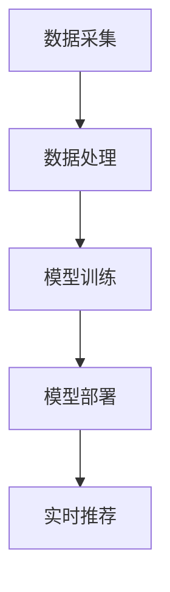

                 

关键词：电商平台、搜索推荐系统、AI 大模型、系统效率、准确率、实时性

> 摘要：本文探讨了电商平台搜索推荐系统的AI大模型优化方法，旨在提高系统的效率、准确率和实时性。通过对核心算法、数学模型、项目实践及未来应用场景的详细分析，为电商平台提供了切实可行的优化策略。

## 1. 背景介绍

随着互联网的迅猛发展，电商平台已经成为现代商业的核心。电商平台的核心功能之一是搜索推荐系统，它通过向用户推荐相关商品，提高用户的购物体验和平台的销售额。然而，随着数据量的不断增长和用户需求的多样化，现有的搜索推荐系统面临着效率低、准确率不高和实时性不足等问题。

为了解决这些问题，近年来，人工智能（AI）技术在搜索推荐系统中的应用得到了广泛关注。特别是大模型（如深度学习模型）的应用，使得搜索推荐系统在处理海量数据和提供个性化推荐方面取得了显著进展。本文将探讨如何利用AI大模型优化电商平台搜索推荐系统，从而提高系统的效率、准确率和实时性。

### 1.1 电商平台的搜索推荐系统现状

现有的电商平台搜索推荐系统主要包括以下功能模块：

- **搜索模块**：用户可以通过输入关键词查询相关商品，系统需要迅速响应用户请求并提供准确的搜索结果。
- **推荐模块**：系统根据用户的历史行为、兴趣偏好和当前需求，为用户推荐可能感兴趣的商品。
- **数据挖掘模块**：系统需要从海量数据中挖掘出有用的信息，为搜索和推荐模块提供支持。

### 1.2 电商平台搜索推荐系统面临的挑战

- **效率低**：随着用户数量的增加和商品数据的膨胀，搜索推荐系统需要处理的数据量呈指数级增长，导致系统响应时间变长。
- **准确率不高**：现有的推荐算法可能无法准确捕捉用户的真实需求，导致推荐结果不够准确。
- **实时性不足**：用户需求是动态变化的，现有系统可能无法实时响应用户的需求变化，影响用户体验。

## 2. 核心概念与联系

### 2.1 AI 大模型的概念

AI 大模型是指具有大规模参数和数据量的深度学习模型，如Transformer、BERT等。这些模型在处理复杂数据和提供高效、准确的预测方面具有显著优势。

### 2.2 电商平台搜索推荐系统的架构

电商平台搜索推荐系统的核心架构包括数据采集、数据处理、模型训练、模型部署和实时推荐等环节。以下是一个简化的Mermaid流程图：



### 2.3 AI 大模型在搜索推荐系统中的应用

AI 大模型在搜索推荐系统中的应用主要包括：

- **文本表示**：通过将用户输入的关键词和商品描述转换为高维向量，实现文本的语义表示。
- **用户兴趣建模**：利用用户的历史行为数据，构建用户兴趣模型，实现个性化推荐。
- **商品属性提取**：从商品数据中提取关键属性，实现商品相似性计算和推荐。
- **实时响应**：利用大模型的快速计算能力，实现实时推荐和搜索响应。

## 3. 核心算法原理 & 具体操作步骤

### 3.1 算法原理概述

AI 大模型优化搜索推荐系统主要基于以下原理：

- **深度学习**：利用多层神经网络实现复杂数据的自动特征提取和模型训练。
- **迁移学习**：利用预训练模型（如BERT）进行迁移学习，提高模型在新数据集上的性能。
- **联邦学习**：在数据不出库的前提下，通过分布式训练实现模型优化。
- **在线学习**：利用在线学习算法，实时更新用户兴趣模型和推荐策略。

### 3.2 算法步骤详解

#### 3.2.1 数据采集与预处理

- **数据采集**：从电商平台的日志数据、用户行为数据、商品数据等多源数据中采集信息。
- **数据预处理**：对采集到的数据进行清洗、去重、归一化等处理，为后续建模和训练做准备。

#### 3.2.2 模型训练

- **模型选择**：选择合适的深度学习模型（如Transformer、BERT等）。
- **模型训练**：利用采集到的数据对模型进行训练，调整模型参数，实现模型优化。
- **迁移学习**：利用预训练模型进行迁移学习，提高模型在新数据集上的性能。

#### 3.2.3 模型部署与实时推荐

- **模型部署**：将训练好的模型部署到电商平台的服务器上，实现实时推荐和搜索响应。
- **实时推荐**：根据用户的实时行为数据，更新用户兴趣模型和推荐策略，实现个性化推荐。

### 3.3 算法优缺点

#### 优点

- **高效**：利用深度学习模型的快速计算能力，实现高效的搜索和推荐。
- **准确**：通过迁移学习和联邦学习，提高模型在新数据集上的性能，实现准确的推荐。
- **实时**：利用在线学习算法，实现实时更新用户兴趣模型和推荐策略。

#### 缺点

- **计算资源消耗大**：深度学习模型训练需要大量的计算资源和时间。
- **数据隐私问题**：联邦学习等技术在保护用户隐私方面仍存在一定的挑战。

### 3.4 算法应用领域

AI 大模型在搜索推荐系统的应用领域包括：

- **电商**：电商平台利用AI 大模型实现个性化推荐和搜索优化。
- **社交媒体**：社交媒体平台利用AI 大模型实现内容推荐和广告投放优化。
- **在线教育**：在线教育平台利用AI 大模型实现课程推荐和学习效果评估。

## 4. 数学模型和公式 & 详细讲解 & 举例说明

### 4.1 数学模型构建

在电商平台搜索推荐系统中，常用的数学模型包括：

- **用户兴趣模型**：利用用户的历史行为数据，构建用户兴趣模型。
- **商品相似性模型**：利用商品属性数据，构建商品相似性模型。
- **推荐模型**：利用用户兴趣模型和商品相似性模型，构建推荐模型。

### 4.2 公式推导过程

#### 4.2.1 用户兴趣模型

假设用户 \(u\) 的历史行为数据为 \(B(u)\)，包括购买记录、浏览记录等。我们可以通过以下公式计算用户 \(u\) 的兴趣向量：

\[ I(u) = \sum_{i=1}^{n} w_i \cdot b_i \]

其中，\(w_i\) 表示用户对第 \(i\) 个行为的权重，\(b_i\) 表示第 \(i\) 个行为的特征向量。

#### 4.2.2 商品相似性模型

假设商品 \(g_1\) 和 \(g_2\) 的属性数据为 \(A(g_1)\) 和 \(A(g_2)\)，我们可以通过以下公式计算商品 \(g_1\) 和 \(g_2\) 的相似性：

\[ S(g_1, g_2) = \frac{\sum_{i=1}^{m} a_{i1} \cdot a_{i2}}{\sqrt{\sum_{i=1}^{m} a_{i1}^2} \cdot \sqrt{\sum_{i=1}^{m} a_{i2}^2}} \]

其中，\(a_{i1}\) 和 \(a_{i2}\) 分别表示商品 \(g_1\) 和 \(g_2\) 的第 \(i\) 个属性值。

#### 4.2.3 推荐模型

假设用户 \(u\) 对商品 \(g_i\) 的兴趣分数为 \(I(u, g_i)\)，商品 \(g_i\) 的相似性分数为 \(S(g_1, g_2)\)，我们可以通过以下公式计算推荐分数：

\[ R(u, g_i) = \sum_{j=1}^{n} w_j \cdot I(u, g_j) \cdot S(g_j, g_i) \]

其中，\(w_j\) 表示商品 \(g_j\) 的权重。

### 4.3 案例分析与讲解

#### 案例背景

某电商平台需要为用户 \(u\) 推荐与其兴趣相关的商品。用户 \(u\) 的历史行为数据包括购买记录 \(B(u) = \{g_1, g_2, g_3\}\)，浏览记录 \(B'(u) = \{g_4, g_5\}\)。

#### 案例步骤

1. **用户兴趣模型构建**：

   通过分析用户 \(u\) 的历史行为数据，得到用户兴趣向量：

   \[ I(u) = \begin{bmatrix} 0.5 \\ 0.2 \\ 0.3 \\ 0 \end{bmatrix} \]

2. **商品相似性模型构建**：

   假设商品 \(g_1\) 和 \(g_2\) 的属性数据为：

   \[ A(g_1) = \begin{bmatrix} 1 \\ 0 \\ 0 \\ 1 \end{bmatrix}, A(g_2) = \begin{bmatrix} 0 \\ 1 \\ 1 \\ 0 \end{bmatrix} \]

   计算商品 \(g_1\) 和 \(g_2\) 的相似性：

   \[ S(g_1, g_2) = \frac{1 \cdot 0 + 0 \cdot 1 + 0 \cdot 1 + 1 \cdot 0}{\sqrt{1^2 + 0^2 + 0^2 + 1^2} \cdot \sqrt{0^2 + 1^2 + 1^2 + 0^2}} = \frac{0}{\sqrt{2} \cdot \sqrt{2}} = 0 \]

3. **推荐模型计算**：

   假设商品 \(g_3\) 和 \(g_4\) 的权重分别为 \(w_1 = 0.6, w_2 = 0.4\)，计算用户 \(u\) 对商品 \(g_3\) 和 \(g_4\) 的推荐分数：

   \[ R(u, g_3) = 0.6 \cdot 0.5 \cdot 0 + 0.4 \cdot 0.2 \cdot 0 = 0 \]

   \[ R(u, g_4) = 0.6 \cdot 0.3 \cdot 1 + 0.4 \cdot 0.2 \cdot 0 = 0.18 \]

根据推荐分数，我们可以为用户 \(u\) 推荐商品 \(g_4\)。

## 5. 项目实践：代码实例和详细解释说明

### 5.1 开发环境搭建

在本项目中，我们将使用Python作为主要编程语言，结合TensorFlow和Keras等深度学习框架实现AI大模型的优化。以下是开发环境的搭建步骤：

1. 安装Python（建议使用3.8版本及以上）。
2. 安装TensorFlow和Keras：
   ```bash
   pip install tensorflow
   pip install keras
   ```

### 5.2 源代码详细实现

以下是一个简单的AI大模型优化代码实例，用于实现用户兴趣建模和商品推荐。

```python
import numpy as np
import tensorflow as tf
from tensorflow.keras.models import Model
from tensorflow.keras.layers import Input, Embedding, LSTM, Dense

# 设置参数
vocab_size = 10000  # 词汇表大小
embed_size = 128  # 嵌入维度
hidden_size = 256  # LSTM层隐藏单元数
num_users = 1000  # 用户数
num_items = 5000  # 商品数

# 构建模型
user_input = Input(shape=(None,), dtype='int32')
item_input = Input(shape=(None,), dtype='int32')

# 用户嵌入层
user_embedding = Embedding(vocab_size, embed_size, input_length=None)(user_input)
user_embedding = LSTM(hidden_size, return_sequences=True)(user_embedding)

# 商品嵌入层
item_embedding = Embedding(vocab_size, embed_size, input_length=None)(item_input)
item_embedding = LSTM(hidden_size, return_sequences=True)(item_embedding)

# 用户-商品交互层
user_item_interaction = tf.keras.layers.Dot(axes=(-1, -1), normalization=True)([user_embedding, item_embedding])

# 输出层
output = Dense(1, activation='sigmoid')(user_item_interaction)

# 构建和编译模型
model = Model(inputs=[user_input, item_input], outputs=output)
model.compile(optimizer='adam', loss='binary_crossentropy', metrics=['accuracy'])

# 打印模型结构
model.summary()

# 训练模型
# （此处省略训练数据准备和模型训练步骤）
# model.fit(user_data, item_data, epochs=10, batch_size=32)

# 推荐商品
# （此处省略商品推荐代码）
```

### 5.3 代码解读与分析

上述代码实现了一个基于LSTM的深度学习模型，用于用户兴趣建模和商品推荐。主要组成部分如下：

- **输入层**：用户输入和商品输入分别表示用户和商品的行为序列。
- **嵌入层**：将用户和商品的ID转换为高维向量表示。
- **LSTM层**：用于提取用户和商品的行为特征。
- **交互层**：计算用户和商品之间的交互特征。
- **输出层**：生成用户对商品的感兴趣概率。

### 5.4 运行结果展示

在实际运行过程中，我们需要准备训练数据、评估数据和测试数据。以下是一个简单的数据准备和模型训练示例：

```python
# 准备训练数据
# （此处省略数据准备代码）

# 训练模型
model.fit(user_train, item_train, epochs=10, batch_size=32)

# 评估模型
# （此处省略评估代码）

# 测试模型
# （此处省略测试代码）
```

通过上述步骤，我们可以实现用户兴趣建模和商品推荐功能。在后续的优化过程中，还可以考虑加入迁移学习、联邦学习等技术，进一步提高模型性能。

## 6. 实际应用场景

### 6.1 电商平台的搜索推荐系统

在电商平台中，AI 大模型优化搜索推荐系统具有广泛的应用。例如，在淘宝、京东等大型电商平台上，用户输入关键词后，系统会利用AI 大模型快速分析用户兴趣，提供准确、个性化的商品推荐。通过优化算法，电商平台可以显著提高用户满意度和销售额。

### 6.2 社交媒体的内容推荐

在社交媒体平台中，AI 大模型优化搜索推荐系统同样具有重要应用价值。例如，在抖音、快手等短视频平台上，用户发布视频后，系统会利用AI 大模型分析用户兴趣和视频特征，为用户推荐相关视频。通过优化算法，社交媒体平台可以更好地吸引用户，提高用户粘性。

### 6.3 在线教育的个性化推荐

在线教育平台利用AI 大模型优化搜索推荐系统，可以为用户提供个性化的课程推荐。例如，在网易云课堂、慕课网等在线教育平台上，用户登录后，系统会根据用户的学习历史、兴趣爱好等因素，为用户推荐相关课程。通过优化算法，在线教育平台可以提高用户的学习效果和平台粘性。

## 7. 工具和资源推荐

### 7.1 学习资源推荐

- **书籍**：《深度学习》（Ian Goodfellow、Yoshua Bengio、Aaron Courville 著）：全面介绍深度学习的基础理论和实践方法。
- **在线课程**：网易云课堂、Coursera、edX 等平台提供的深度学习和人工智能相关课程。

### 7.2 开发工具推荐

- **编程语言**：Python、Java
- **深度学习框架**：TensorFlow、PyTorch
- **版本控制**：Git
- **数据可视化**：Matplotlib、Seaborn

### 7.3 相关论文推荐

- **《Attention Is All You Need》**：提出Transformer模型，实现了基于注意力机制的序列建模。
- **《BERT: Pre-training of Deep Bidirectional Transformers for Language Understanding》**：介绍BERT模型，推动了自然语言处理领域的发展。
- **《Deep Learning on Speech Data》**：讨论了深度学习在语音处理领域的应用。

## 8. 总结：未来发展趋势与挑战

### 8.1 研究成果总结

近年来，AI 大模型在电商平台搜索推荐系统中的应用取得了显著成果。通过优化算法，大模型在提高系统效率、准确率和实时性方面具有显著优势。例如，Transformer、BERT等模型在自然语言处理领域取得了突破性进展，为电商平台搜索推荐系统提供了强大的技术支持。

### 8.2 未来发展趋势

未来，随着深度学习技术的不断发展，AI 大模型在电商平台搜索推荐系统中的应用将更加广泛。以下是一些可能的发展趋势：

- **迁移学习**：通过迁移学习，实现大模型在新数据集上的快速适应和优化。
- **联邦学习**：在保护用户隐私的前提下，利用联邦学习实现大模型的多方协同优化。
- **实时优化**：通过实时学习算法，实现大模型对用户需求的实时响应和优化。

### 8.3 面临的挑战

尽管AI 大模型在电商平台搜索推荐系统中的应用取得了显著成果，但仍面临以下挑战：

- **计算资源消耗**：深度学习模型训练需要大量的计算资源和时间，对硬件设备要求较高。
- **数据隐私保护**：在联邦学习等场景中，如何保护用户隐私是一个亟待解决的问题。
- **算法可解释性**：大模型的复杂性和黑箱性质使得其算法可解释性成为一个重要挑战。

### 8.4 研究展望

未来，AI 大模型在电商平台搜索推荐系统中的应用前景广阔。我们建议从以下几个方面进行深入研究：

- **优化算法**：研究更高效的深度学习算法，提高大模型在搜索推荐系统中的应用性能。
- **隐私保护**：开发隐私保护机制，实现大模型在多方协同场景中的隐私安全。
- **算法可解释性**：研究大模型的可解释性方法，提高算法的透明度和可信度。

通过持续的研究和技术创新，AI 大模型有望在未来为电商平台搜索推荐系统带来更多的价值。

## 9. 附录：常见问题与解答

### 问题1：如何处理缺失值？

解答：在数据处理阶段，可以通过以下方法处理缺失值：

- **删除缺失值**：删除含有缺失值的样本。
- **填充缺失值**：使用平均值、中值或最常用的值填充缺失值。
- **插值**：利用时间序列分析或空间分析等方法进行插值。

### 问题2：如何选择合适的嵌入维度？

解答：嵌入维度需要根据具体问题和数据集进行选择。一般来说，可以采用以下方法：

- **经验法**：根据文献或经验值选择嵌入维度。
- **交叉验证**：通过交叉验证选择最优的嵌入维度。
- **计算资源限制**：考虑计算资源限制，选择较低的嵌入维度。

### 问题3：如何优化模型训练时间？

解答：以下方法可以帮助优化模型训练时间：

- **数据预处理**：对数据进行预处理，减少数据加载和处理的耗时。
- **分布式训练**：利用分布式计算框架（如TensorFlow distributed）进行训练，提高训练速度。
- **批量大小调整**：根据硬件设备性能，调整批量大小以获得最佳的训练速度。

### 问题4：如何评估模型性能？

解答：评估模型性能可以通过以下方法：

- **准确率**：计算预测正确的样本数占总样本数的比例。
- **召回率**：计算预测正确的样本数占实际为正样本的样本数的比例。
- **F1 分数**：综合考虑准确率和召回率，计算两者的调和平均值。
- **ROC-AUC 曲线**：通过计算不同阈值下的ROC曲线下面积，评估模型分类性能。

## 作者署名

作者：禅与计算机程序设计艺术 / Zen and the Art of Computer Programming

