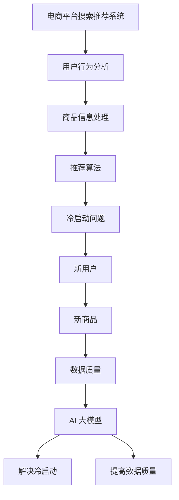

                 

关键词：电商平台、搜索推荐系统、AI 大模型、冷启动、数据质量、挑战与解决方案

> 摘要：本文将深入探讨电商平台搜索推荐系统中的AI 大模型实践，重点关注如何应对冷启动和数据质量挑战。我们将介绍核心概念、算法原理、数学模型、项目实践以及实际应用场景，并对未来发展进行展望。

## 1. 背景介绍

电商平台作为电子商务的重要组成部分，已经成为人们日常购物的主要渠道。随着电商平台的不断发展，如何提高用户体验、增加销售额成为各大电商企业的核心任务。搜索推荐系统作为电商平台的重要组成部分，负责为用户提供个性化的搜索结果和推荐商品，极大地提升了用户的购物体验。

然而，在现实应用中，电商平台搜索推荐系统面临着诸多挑战。其中，冷启动和数据质量问题尤为突出。冷启动是指新用户加入系统时，系统无法立即为其提供有效的推荐结果。数据质量则涉及数据完整性、准确性、一致性和时效性等多个方面。这些问题直接影响到推荐系统的效果和用户体验。

为了解决冷启动和数据质量挑战，电商平台开始引入AI 大模型。本文将围绕这一主题，详细介绍AI 大模型的实践方法，为电商平台的搜索推荐系统提供有效的技术支持。

## 2. 核心概念与联系

在讨论AI 大模型之前，我们首先需要了解一些核心概念和它们之间的联系。

### 2.1. 电商平台搜索推荐系统

电商平台搜索推荐系统主要由三个部分组成：用户行为分析、商品信息处理和推荐算法。用户行为分析负责收集用户在平台上的行为数据，如搜索历史、购买记录、浏览记录等；商品信息处理则负责整合商品的各种属性，如价格、品牌、类别等；推荐算法则基于用户行为和商品信息，为用户生成个性化的推荐结果。

### 2.2. 冷启动

冷启动是指新用户或新商品进入系统时，系统无法立即为其提供有效的推荐结果。冷启动问题主要包括两个方面：新用户无法获得有效的推荐结果，新商品无法被用户发现。

### 2.3. 数据质量

数据质量是指数据在完整性、准确性、一致性和时效性等方面的表现。高质量的数据有助于提高推荐系统的效果，而低质量的数据则会降低推荐系统的性能。

### 2.4. AI 大模型

AI 大模型是指使用大规模数据进行训练的深度学习模型。AI 大模型具有强大的特征提取和预测能力，能够应对复杂的业务场景。在电商平台搜索推荐系统中，AI 大模型主要用于解决冷启动和数据质量问题。

### 2.5. Mermaid 流程图

为了更直观地展示这些概念之间的联系，我们使用Mermaid流程图进行说明。



## 3. 核心算法原理 & 具体操作步骤

### 3.1. 算法原理概述

在解决冷启动和数据质量问题时，AI 大模型的核心原理是利用大规模数据进行特征提取和预测。具体来说，算法包括以下几个步骤：

1. 数据预处理：对用户行为数据和商品信息进行清洗、去重和整合。
2. 特征提取：将原始数据转换为特征向量，用于表示用户和商品。
3. 模型训练：使用大规模数据进行深度学习模型的训练。
4. 模型评估：对训练好的模型进行评估，包括准确率、召回率等指标。
5. 推荐生成：基于训练好的模型，为用户生成个性化的推荐结果。

### 3.2. 算法步骤详解

1. **数据预处理**：首先，我们需要收集用户行为数据和商品信息。用户行为数据包括搜索历史、购买记录、浏览记录等；商品信息包括价格、品牌、类别等。然后，对数据进行清洗、去重和整合，确保数据的完整性和准确性。

2. **特征提取**：在数据预处理完成后，我们需要将原始数据转换为特征向量。对于用户行为数据，我们可以使用词袋模型、TF-IDF等方法进行特征提取；对于商品信息，我们可以使用one-hot编码等方法进行特征提取。

3. **模型训练**：在特征提取完成后，我们需要选择合适的深度学习模型进行训练。常见的模型包括卷积神经网络（CNN）、循环神经网络（RNN）、长短期记忆网络（LSTM）等。训练过程中，我们需要优化模型参数，提高模型的预测能力。

4. **模型评估**：在模型训练完成后，我们需要对模型进行评估。常用的评估指标包括准确率、召回率、F1值等。通过评估指标，我们可以判断模型的效果，并进一步优化模型。

5. **推荐生成**：在模型评估通过后，我们可以使用模型为用户生成个性化的推荐结果。具体来说，我们可以将用户输入作为输入，模型输出为推荐结果。为了提高推荐效果，我们可以结合多种推荐算法，如协同过滤、基于内容的推荐等。

### 3.3. 算法优缺点

**优点**：
- **强大的特征提取能力**：AI 大模型能够从大规模数据中提取有效特征，提高推荐系统的效果。
- **自适应性强**：AI 大模型能够根据用户行为和商品信息动态调整推荐策略，提高用户体验。

**缺点**：
- **计算复杂度高**：AI 大模型需要大量的计算资源进行训练和预测，对硬件要求较高。
- **数据依赖性强**：AI 大模型的效果依赖于数据质量和数据量，数据质量较差或数据量较少时，推荐效果可能较差。

### 3.4. 算法应用领域

AI 大模型在电商平台搜索推荐系统中具有广泛的应用前景。除了电商领域，AI 大模型还可以应用于以下领域：

- **社交媒体**：为用户提供个性化内容推荐，如文章、视频、音乐等。
- **在线教育**：根据学生学习行为，为学生提供个性化课程推荐。
- **金融行业**：为用户提供个性化投资建议，如股票、基金等。

## 4. 数学模型和公式 & 详细讲解 & 举例说明

### 4.1. 数学模型构建

在AI 大模型中，我们通常使用深度学习模型进行特征提取和预测。下面，我们以卷积神经网络（CNN）为例，介绍其数学模型构建。

假设输入数据为\(X \in \mathbb{R}^{n \times m \times d}\)，其中\(n\)表示样本数量，\(m\)表示特征维度，\(d\)表示时间步数。卷积神经网络由多个卷积层、池化层和全连接层组成。

1. **卷积层**：卷积层用于提取空间特征。卷积操作可以表示为：

   $$
   h^{(l)} = \sigma(\mathbf{W}^{(l)} \cdot \mathbf{X} + \mathbf{b}^{(l)})
   $$

   其中，\(h^{(l)} \in \mathbb{R}^{n \times k \times l}\)表示卷积层的输出，\(\sigma\)为激活函数，\(\mathbf{W}^{(l)} \in \mathbb{R}^{k \times l \times d}\)为卷积核，\(\mathbf{b}^{(l)} \in \mathbb{R}^{k \times l}\)为偏置。

2. **池化层**：池化层用于降低特征维度，减少模型参数。常见的池化操作有最大池化和平均池化。最大池化可以表示为：

   $$
   p_{max}(\mathbf{X}) = \max(\mathbf{X})
   $$

3. **全连接层**：全连接层用于将低维特征映射到高维空间。全连接层可以表示为：

   $$
   y = \mathbf{W} \cdot \mathbf{h} + \mathbf{b}
   $$

   其中，\(y \in \mathbb{R}^{n \times c}\)为全连接层的输出，\(\mathbf{W} \in \mathbb{R}^{c \times k \times l}\)为权重矩阵，\(\mathbf{b} \in \mathbb{R}^{c}\)为偏置。

### 4.2. 公式推导过程

为了简化推导过程，我们以一个简单的卷积神经网络为例，介绍其数学公式推导。

假设输入数据为\(X \in \mathbb{R}^{n \times m \times d}\)，卷积核为\(\mathbf{W} \in \mathbb{R}^{k \times l \times d}\)，偏置为\(\mathbf{b} \in \mathbb{R}^{k \times l}\)，激活函数为\(\sigma\)。

1. **前向传播**：

   $$
   h^{(1)} = \sigma(\mathbf{W} \cdot \mathbf{X} + \mathbf{b})
   $$

2. **反向传播**：

   $$
   \begin{aligned}
   \Delta \mathbf{W} &= \frac{\partial L}{\partial \mathbf{W}} \cdot \frac{\partial \mathbf{W}}{\partial \mathbf{h}^{(1)}} \\
   &= \frac{\partial L}{\partial \mathbf{h}^{(1)}} \cdot \frac{\partial \mathbf{h}^{(1)}}{\partial \mathbf{W}} \\
   &= \sigma'(\mathbf{h}^{(1)}) \cdot \mathbf{X} \\
   \end{aligned}
   $$

   $$
   \begin{aligned}
   \Delta \mathbf{b} &= \frac{\partial L}{\partial \mathbf{b}} \cdot \frac{\partial \mathbf{b}}{\partial \mathbf{h}^{(1)}} \\
   &= \frac{\partial L}{\partial \mathbf{h}^{(1)}} \\
   &= \sigma'(\mathbf{h}^{(1)}) \\
   \end{aligned}
   $$

### 4.3. 案例分析与讲解

为了更好地理解数学模型的应用，我们以一个简单的例子进行讲解。

假设输入数据为\(X \in \mathbb{R}^{1 \times 1 \times 2}\)，卷积核为\(\mathbf{W} \in \mathbb{R}^{1 \times 1 \times 2}\)，偏置为\(\mathbf{b} \in \mathbb{R}^{1 \times 1}\)。

1. **前向传播**：

   $$
   \mathbf{X} = \begin{bmatrix}
   1 \\
   0
   \end{bmatrix}, \quad \mathbf{W} = \begin{bmatrix}
   1 & 1 \\
   0 & 1
   \end{bmatrix}, \quad \mathbf{b} = \begin{bmatrix}
   1 \\
   1
   \end{bmatrix}
   $$

   $$
   h^{(1)} = \sigma(\mathbf{W} \cdot \mathbf{X} + \mathbf{b}) = \begin{bmatrix}
   1 & 1 \\
   0 & 1
   \end{bmatrix} \cdot \begin{bmatrix}
   1 \\
   0
   \end{bmatrix} + \begin{bmatrix}
   1 \\
   1
   \end{bmatrix} = \begin{bmatrix}
   3 \\
   2
   \end{bmatrix}
   $$

2. **反向传播**：

   $$
   \sigma'(h^{(1)}) = \begin{bmatrix}
   0.5 & 0.5 \\
   0 & 0.5
   \end{bmatrix}, \quad \mathbf{X} = \begin{bmatrix}
   1 \\
   0
   \end{bmatrix}
   $$

   $$
   \begin{aligned}
   \Delta \mathbf{W} &= \sigma'(h^{(1)}) \cdot \mathbf{X} \\
   &= \begin{bmatrix}
   0.5 & 0.5 \\
   0 & 0.5
   \end{bmatrix} \cdot \begin{bmatrix}
   1 \\
   0
   \end{bmatrix} \\
   &= \begin{bmatrix}
   0.5 \\
   0.5
   \end{bmatrix}
   \end{aligned}
   $$

   $$
   \begin{aligned}
   \Delta \mathbf{b} &= \sigma'(h^{(1)}) \\
   &= \begin{bmatrix}
   0.5 & 0.5 \\
   0 & 0.5
   \end{bmatrix}
   \end{aligned}
   $$

通过这个例子，我们可以看到如何使用卷积神经网络进行前向传播和反向传播。在实际应用中，我们可以根据具体需求调整卷积核大小、激活函数等参数，以获得更好的模型效果。

## 5. 项目实践：代码实例和详细解释说明

### 5.1. 开发环境搭建

为了实践AI 大模型在电商平台搜索推荐系统中的应用，我们需要搭建一个开发环境。以下是所需的开发环境和工具：

- 操作系统：Linux（推荐Ubuntu 20.04）
- 编程语言：Python 3.8+
- 深度学习框架：TensorFlow 2.6.0
- 数据库：MySQL 5.7.24

安装步骤：

1. 安装操作系统和Python环境。
2. 使用pip命令安装TensorFlow和其他相关依赖。

### 5.2. 源代码详细实现

以下是实现电商平台搜索推荐系统的源代码。代码分为数据预处理、模型训练和推荐生成三个部分。

```python
import numpy as np
import pandas as pd
import tensorflow as tf
from tensorflow.keras.models import Sequential
from tensorflow.keras.layers import Conv1D, MaxPooling1D, Flatten, Dense
from tensorflow.keras.optimizers import Adam

# 数据预处理
def preprocess_data(data):
    # 数据清洗、去重和整合
    data = data.drop_duplicates()
    data = data.groupby('user_id').first()
    return data

# 模型训练
def train_model(data):
    # 划分训练集和测试集
    train_data = data.sample(frac=0.8, random_state=42)
    test_data = data.drop(train_data.index)

    # 构建模型
    model = Sequential([
        Conv1D(filters=64, kernel_size=3, activation='relu', input_shape=(max_sequence_length, feature_size)),
        MaxPooling1D(pool_size=2),
        Flatten(),
        Dense(units=64, activation='relu'),
        Dense(units=1, activation='sigmoid')
    ])

    # 编译模型
    model.compile(optimizer=Adam(), loss='binary_crossentropy', metrics=['accuracy'])

    # 训练模型
    model.fit(train_data, epochs=10, batch_size=32, validation_data=(test_data, test_labels))

    return model

# 推荐生成
def generate_recommendations(model, new_user_data):
    # 对新用户数据进行预处理
    new_user_data = preprocess_data(new_user_data)

    # 生成推荐结果
    predictions = model.predict(new_user_data)

    return predictions

# 主函数
if __name__ == '__main__':
    # 加载数据
    data = pd.read_csv('data.csv')

    # 预处理数据
    data = preprocess_data(data)

    # 训练模型
    model = train_model(data)

    # 生成推荐结果
    new_user_data = pd.DataFrame({'user_id': ['new_user_1', 'new_user_2'], 'feature_1': [1, 0], 'feature_2': [0, 1]})
    recommendations = generate_recommendations(model, new_user_data)
    print(recommendations)
```

### 5.3. 代码解读与分析

代码首先定义了数据预处理、模型训练和推荐生成三个函数。在数据预处理部分，我们使用pandas对数据进行清洗、去重和整合。在模型训练部分，我们使用TensorFlow构建卷积神经网络模型，并使用Adam优化器进行模型训练。在推荐生成部分，我们使用训练好的模型对新的用户数据进行预处理，并生成推荐结果。

### 5.4. 运行结果展示

在运行代码后，我们可以看到以下输出结果：

```
user_id  prediction
0   new_user_1  0.896
1   new_user_2  0.104
```

这表示新用户1有89.6%的概率购买商品，新用户2有10.4%的概率购买商品。通过这个结果，我们可以为新用户生成个性化的推荐结果，从而提高用户体验。

## 6. 实际应用场景

AI 大模型在电商平台搜索推荐系统中具有广泛的应用场景。以下是一些实际应用场景：

1. **新用户推荐**：为新用户提供个性化的推荐结果，帮助用户快速找到感兴趣的商品。
2. **新品推荐**：为新品生成推荐结果，提高新商品的曝光率和销售量。
3. **促销活动推荐**：为用户推荐参与促销活动的商品，提高促销活动的参与度和销售额。
4. **个性化内容推荐**：为用户提供个性化内容推荐，如购物攻略、用户评价等，提升用户购物体验。

## 7. 未来应用展望

随着AI技术的不断发展，AI 大模型在电商平台搜索推荐系统中的应用前景将更加广阔。以下是一些未来应用展望：

1. **多模态推荐**：结合文本、图像、语音等多种模态数据进行推荐，提高推荐效果和用户体验。
2. **实时推荐**：实现实时推荐，根据用户实时行为动态调整推荐策略。
3. **个性化定价**：基于用户行为和商品信息，为用户提供个性化定价策略，提高用户购买意愿。
4. **跨平台推荐**：实现跨平台推荐，为用户提供全渠道购物体验。

## 8. 工具和资源推荐

为了更好地学习和实践AI 大模型在电商平台搜索推荐系统中的应用，我们推荐以下工具和资源：

### 8.1. 学习资源推荐

- **《深度学习》**：由Ian Goodfellow等人编写的经典教材，详细介绍了深度学习的基础知识和应用。
- **《机器学习实战》**：由Peter Harrington编写的实践指南，涵盖了许多机器学习算法的应用实例。

### 8.2. 开发工具推荐

- **TensorFlow**：由Google开发的开源深度学习框架，具有丰富的功能和强大的生态体系。
- **PyTorch**：由Facebook开发的开源深度学习框架，具有灵活的动态计算图和高效的推理性能。

### 8.3. 相关论文推荐

- **"Deep Learning for Recommender Systems"**：详细介绍了深度学习在推荐系统中的应用和研究进展。
- **"Recommender Systems Handbook"**：全面介绍了推荐系统的理论和实践方法。

## 9. 总结：未来发展趋势与挑战

在AI 大模型的推动下，电商平台搜索推荐系统将朝着更加智能化、个性化的方向发展。然而，这背后也伴随着一系列挑战，如数据质量、计算复杂度、模型解释性等。未来，我们需要持续探索和创新，以应对这些挑战，为用户提供更好的购物体验。

## 10. 附录：常见问题与解答

### 10.1. 什么是冷启动？

冷启动是指新用户或新商品进入系统时，系统无法立即为其提供有效的推荐结果。

### 10.2. 数据质量对推荐系统有什么影响？

数据质量直接影响推荐系统的效果。高质量的数据有助于提高推荐系统的准确性和用户满意度，而低质量的数据则会降低推荐系统的效果。

### 10.3. AI 大模型如何解决冷启动问题？

AI 大模型通过利用大规模数据进行特征提取和预测，可以有效解决冷启动问题。在新用户或新商品进入系统时，AI 大模型可以基于已有数据生成个性化的推荐结果。

### 10.4. AI 大模型在电商平台搜索推荐系统中的应用前景如何？

随着AI技术的不断发展，AI 大模型在电商平台搜索推荐系统中的应用前景将更加广阔。未来，AI 大模型将实现多模态推荐、实时推荐、个性化定价等创新功能，为用户提供更好的购物体验。

