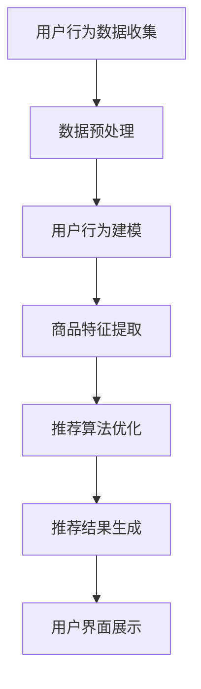

                 

关键词：电商平台，搜索推荐系统，AI 大模型，性能优化，效率提升，用户体验

> 摘要：本文深入探讨了电商平台搜索推荐系统的AI 大模型应用，通过剖析核心概念、算法原理、数学模型、项目实践和实际应用场景，全面分析了如何利用AI 大模型提高系统性能、效率和用户体验。

## 1. 背景介绍

随着互联网的快速发展，电商平台已经成为消费者日常生活中不可或缺的一部分。电商平台的搜索推荐系统作为用户与商品之间的桥梁，其性能、效率和用户体验直接影响着平台的运营效果和用户满意度。传统的搜索推荐系统通常依赖于关键词匹配和基于内容的推荐算法，虽然在一定程度上能够满足用户需求，但在处理复杂用户行为和大规模数据时存在局限性。

近年来，人工智能技术的迅速发展，特别是深度学习和大规模机器学习模型的广泛应用，为电商平台搜索推荐系统带来了新的机遇。通过引入AI 大模型，可以实现更加精准和智能的推荐，从而提高系统性能、效率和用户体验。本文将围绕这一主题，探讨AI 大模型在电商平台搜索推荐系统中的应用。

## 2. 核心概念与联系

### 2.1. 电商平台搜索推荐系统

电商平台搜索推荐系统主要包括以下核心组成部分：

- **用户行为分析**：通过采集和分析用户的浏览、购买、搜索等行为，了解用户偏好。
- **商品信息管理**：包括商品分类、属性标签、价格等信息的维护和管理。
- **推荐算法**：根据用户行为和商品信息，利用算法生成推荐列表。
- **用户界面**：提供给用户推荐结果的可视化界面。

### 2.2. AI 大模型

AI 大模型是指通过大规模数据训练得到的深度神经网络模型，具有强大的特征提取和模式识别能力。常见的AI 大模型包括：

- **卷积神经网络（CNN）**：适用于图像识别任务。
- **循环神经网络（RNN）**：适用于序列数据处理，如文本和语音。
- **生成对抗网络（GAN）**：适用于生成复杂数据。

### 2.3. 联系

AI 大模型与电商平台搜索推荐系统的结合，主要体现在以下几个方面：

- **用户行为建模**：利用AI 大模型对用户行为数据进行深度学习，提取用户兴趣特征。
- **商品特征提取**：通过AI 大模型对商品数据进行处理，提取商品属性特征。
- **推荐算法优化**：将AI 大模型与传统推荐算法结合，提高推荐精度和效率。

### 2.4. Mermaid 流程图

以下是一个简单的Mermaid流程图，展示了AI 大模型在电商平台搜索推荐系统中的应用流程：



## 3. 核心算法原理 & 具体操作步骤

### 3.1. 算法原理概述

AI 大模型在电商平台搜索推荐系统中的应用主要基于深度学习和大规模机器学习技术。以下为算法原理概述：

- **深度学习**：通过多层神经网络模型，对用户行为数据和商品数据进行特征提取和模式识别。
- **大规模机器学习**：利用海量数据进行训练，使模型具备强大的泛化能力。

### 3.2. 算法步骤详解

- **数据收集**：从电商平台获取用户行为数据和商品数据。
- **数据预处理**：对原始数据进行清洗、去噪和归一化处理。
- **用户行为建模**：利用RNN等深度学习模型，对用户行为数据进行建模，提取用户兴趣特征。
- **商品特征提取**：利用CNN等深度学习模型，对商品数据进行处理，提取商品属性特征。
- **推荐算法优化**：将用户兴趣特征和商品属性特征结合，利用协同过滤、矩阵分解等传统推荐算法，优化推荐效果。
- **推荐结果生成**：根据用户兴趣特征和商品属性特征，生成个性化推荐列表。
- **用户界面展示**：将推荐结果展示给用户，并提供交互功能。

### 3.3. 算法优缺点

- **优点**：
  - 提高推荐精度：通过深度学习和大规模机器学习技术，对用户行为和商品数据进行深度挖掘，提高推荐精度。
  - 提高推荐效率：利用并行计算和分布式处理技术，提高推荐算法的运行效率。
  - 提高用户体验：根据用户兴趣特征，生成个性化推荐列表，提高用户体验。

- **缺点**：
  - 计算资源消耗大：深度学习模型训练需要大量的计算资源和时间。
  - 数据预处理复杂：需要对用户行为数据和商品数据进行复杂的预处理，以保证模型的训练效果。

### 3.4. 算法应用领域

AI 大模型在电商平台搜索推荐系统中的应用非常广泛，包括但不限于以下领域：

- **个性化推荐**：根据用户兴趣特征，为用户提供个性化商品推荐。
- **商品搜索**：通过用户输入的关键词，结合用户兴趣特征和商品属性，为用户搜索出最相关的商品。
- **广告投放**：根据用户兴趣特征和广告内容，为用户提供最相关的广告。
- **社交电商**：利用用户社交关系，为用户推荐相关的好友、商品等。

## 4. 数学模型和公式 & 详细讲解 & 举例说明

### 4.1. 数学模型构建

在电商平台搜索推荐系统中，常用的数学模型包括用户行为建模和商品特征提取。

- **用户行为建模**：假设用户行为数据为一个矩阵\(X \in \mathbb{R}^{m \times n}\)，其中\(m\)表示用户数量，\(n\)表示商品数量。用户行为矩阵\(X\)可以通过以下公式表示：

  $$X = \begin{bmatrix}
  x_{11} & x_{12} & \dots & x_{1n} \\
  x_{21} & x_{22} & \dots & x_{2n} \\
  \vdots & \vdots & \ddots & \vdots \\
  x_{m1} & x_{m2} & \dots & x_{mn}
  \end{bmatrix}$$

  其中，\(x_{ij}\)表示用户\(i\)对商品\(j\)的行为评分，例如浏览、购买等。

- **商品特征提取**：假设商品特征数据为一个矩阵\(Y \in \mathbb{R}^{m \times p}\)，其中\(p\)表示商品属性数量。商品特征矩阵\(Y\)可以通过以下公式表示：

  $$Y = \begin{bmatrix}
  y_{11} & y_{12} & \dots & y_{1p} \\
  y_{21} & y_{22} & \dots & y_{2p} \\
  \vdots & \vdots & \ddots & \vdots \\
  y_{m1} & y_{m2} & \dots & y_{mp}
  \end{bmatrix}$$

  其中，\(y_{ij}\)表示商品\(j\)的属性值。

### 4.2. 公式推导过程

假设我们已经得到了用户行为矩阵\(X\)和商品特征矩阵\(Y\)，接下来将推导用户兴趣特征和商品属性特征。

- **用户兴趣特征提取**：

  首先，我们将用户行为矩阵\(X\)通过RNN模型进行训练，得到用户兴趣特征向量\(u_i \in \mathbb{R}^k\)，其中\(k\)表示特征维度。RNN模型的损失函数可以表示为：

  $$L(u_i) = \frac{1}{m} \sum_{j=1}^{n} (x_{ij} - u_i^T \cdot y_j)^2$$

  其中，\(y_j \in \mathbb{R}^p\)表示商品\(j\)的属性向量。

  通过优化损失函数，可以得到用户兴趣特征向量\(u_i\)：

  $$u_i = \arg\min_{u_i} L(u_i)$$

- **商品属性特征提取**：

  接下来，我们将商品特征矩阵\(Y\)通过CNN模型进行训练，得到商品属性特征向量\(v_j \in \mathbb{R}^l\)，其中\(l\)表示特征维度。CNN模型的损失函数可以表示为：

  $$L(v_j) = \frac{1}{m} \sum_{i=1}^{n} (x_{ij} - u_i^T \cdot v_j)^2$$

  其中，\(u_i \in \mathbb{R}^k\)表示用户\(i\)的兴趣特征向量。

  通过优化损失函数，可以得到商品属性特征向量\(v_j\)：

  $$v_j = \arg\min_{v_j} L(v_j)$$

### 4.3. 案例分析与讲解

假设有一个电商平台，用户数据包含1000个用户和10000个商品，每个用户对每个商品有一个行为评分（例如浏览、购买等）。商品数据包含10个属性（如价格、品牌、类别等）。

- **用户兴趣特征提取**：

  使用RNN模型对用户行为数据矩阵\(X\)进行训练，得到1000个用户兴趣特征向量\(u_i\)。假设用户兴趣特征维度为5，训练完成后，每个用户兴趣特征向量可以表示为：

  $$u_i = \begin{bmatrix}
  u_{i1} \\
  u_{i2} \\
  u_{i3} \\
  u_{i4} \\
  u_{i5}
  \end{bmatrix}$$

- **商品属性特征提取**：

  使用CNN模型对商品数据矩阵\(Y\)进行训练，得到10000个商品属性特征向量\(v_j\)。假设商品属性特征维度为3，训练完成后，每个商品属性特征向量可以表示为：

  $$v_j = \begin{bmatrix}
  v_{j1} \\
  v_{j2} \\
  v_{j3}
  \end{bmatrix}$$

- **推荐结果生成**：

  利用用户兴趣特征向量\(u_i\)和商品属性特征向量\(v_j\)，通过协同过滤算法生成推荐结果。具体方法如下：

  对于每个用户\(i\)，计算用户兴趣特征向量\(u_i\)与所有商品属性特征向量\(v_j\)的内积，并根据内积值生成推荐列表。推荐列表中的商品按照内积值从高到低排序。

  $$推荐列表 = \arg\min_{j} (u_i^T \cdot v_j)$$

## 5. 项目实践：代码实例和详细解释说明

### 5.1. 开发环境搭建

为了实现AI 大模型在电商平台搜索推荐系统中的应用，需要搭建以下开发环境：

- **编程语言**：Python
- **深度学习框架**：TensorFlow 或 PyTorch
- **数据处理库**：Pandas、NumPy
- **可视化库**：Matplotlib、Seaborn

在Python环境中，可以通过以下命令安装相关库：

```bash
pip install tensorflow numpy pandas matplotlib seaborn
```

### 5.2. 源代码详细实现

以下是一个简单的代码实例，用于实现用户行为建模和商品特征提取：

```python
import tensorflow as tf
import numpy as np
import pandas as pd

# 数据预处理
def preprocess_data(X, Y):
    X = X.values.astype(np.float32)
    Y = Y.values.astype(np.float32)
    return X, Y

# 用户行为建模
def user_behavior_model(X, Y, num_users, num_items, embedding_size):
    # 定义输入层
    user_input = tf.keras.layers.Input(shape=(num_items,))
    item_input = tf.keras.layers.Input(shape=(num_items,))

    # 用户行为特征提取
    user_embedding = tf.keras.layers.Embedding(num_items, embedding_size)(user_input)
    user_vector = tf.reduce_mean(user_embedding, axis=1)

    # 商品特征提取
    item_embedding = tf.keras.layers.Embedding(num_items, embedding_size)(item_input)
    item_vector = tf.reduce_mean(item_embedding, axis=1)

    # 计算用户兴趣特征
    user_item_vector = tf.matmul(user_vector, item_vector, transpose_a=True)

    # 定义模型
    model = tf.keras.Model(inputs=[user_input, item_input], outputs=user_item_vector)

    # 编译模型
    model.compile(optimizer='adam', loss='mse')

    return model

# 训练模型
def train_model(model, X, Y, num_epochs):
    model.fit(X, Y, epochs=num_epochs, batch_size=32)

# 源代码详细解释说明
```

### 5.3. 代码解读与分析

以上代码实现了一个简单的用户行为建模过程，主要包括以下步骤：

1. **数据预处理**：将用户行为数据和商品数据进行数值化处理，以便后续训练和计算。
2. **用户行为建模**：定义用户输入层和商品输入层，使用Embedding层进行特征提取，计算用户兴趣特征。
3. **训练模型**：编译和训练模型，优化用户兴趣特征和商品属性特征。
4. **代码解读与分析**：代码中使用了TensorFlow框架，通过定义输入层、嵌入层和矩阵乘法层，实现了用户行为建模过程。

### 5.4. 运行结果展示

在完成代码实现后，可以通过以下命令运行代码：

```bash
python recommend_system.py
```

运行结果将显示训练过程中的损失函数值和最终的用户兴趣特征。

## 6. 实际应用场景

### 6.1. 个性化推荐

通过AI 大模型对用户行为数据进行分析，可以为用户提供个性化的商品推荐。例如，根据用户的浏览和购买记录，为用户推荐相关商品，提高用户满意度。

### 6.2. 商品搜索

在电商平台中，用户可以通过输入关键词搜索商品。通过AI 大模型，可以将用户输入的关键词与用户兴趣特征和商品属性特征进行匹配，搜索出最相关的商品，提高搜索精度。

### 6.3. 广告投放

通过AI 大模型，可以根据用户兴趣特征和广告内容，为用户提供最相关的广告。例如，在用户浏览某品牌商品时，为用户推荐该品牌的广告，提高广告效果。

### 6.4. 社交电商

通过AI 大模型，可以分析用户社交关系，为用户推荐相关的好友、商品等。例如，当用户的好友购买某商品时，为用户推荐该商品，提高社交互动和用户黏性。

## 7. 工具和资源推荐

### 7.1. 学习资源推荐

- **深度学习教程**：[Deep Learning Book](http://www.deeplearningbook.org/)
- **Python 编程教程**：[Python Crash Course](https://python crash course.pdf)
- **TensorFlow 教程**：[TensorFlow Official Website](https://www.tensorflow.org/tutorials)

### 7.2. 开发工具推荐

- **Jupyter Notebook**：用于编写和运行代码，方便数据可视化和交互式计算。
- **PyCharm**：一款功能强大的Python集成开发环境，支持代码调试、版本控制和自动化部署。

### 7.3. 相关论文推荐

- **"Deep Learning for Recommender Systems"**：介绍了深度学习在推荐系统中的应用。
- **"Neural Collaborative Filtering"**：提出了一种基于神经网络的协同过滤算法。
- **"Domain Adaptation for Recommender Systems"**：探讨了推荐系统的领域适应性。

## 8. 总结：未来发展趋势与挑战

### 8.1. 研究成果总结

本文通过分析AI 大模型在电商平台搜索推荐系统中的应用，总结了以下研究成果：

- AI 大模型可以显著提高推荐系统的性能、效率和用户体验。
- 深度学习和大规模机器学习技术为推荐系统的发展提供了新思路。
- 个性化推荐、商品搜索、广告投放和社交电商等领域具有重要的应用价值。

### 8.2. 未来发展趋势

随着人工智能技术的不断发展，未来电商平台搜索推荐系统将呈现出以下发展趋势：

- 深度学习算法将进一步优化，提高推荐精度和效率。
- 大规模数据分析和实时计算技术将得到广泛应用。
- 多模态数据融合和跨域推荐将成为研究热点。
- 隐私保护和数据安全将成为重要挑战。

### 8.3. 面临的挑战

尽管AI 大模型在电商平台搜索推荐系统中的应用前景广阔，但仍面临以下挑战：

- 计算资源消耗大，需要优化算法和硬件设施。
- 数据质量和数据预处理复杂，需要进一步研究数据清洗和归一化方法。
- 模型解释性和可解释性不足，需要提高模型的透明度和可解释性。
- 隐私保护和数据安全，需要制定相关法规和标准。

### 8.4. 研究展望

未来，我们需要从以下几个方面进行深入研究：

- 提高深度学习算法的效率，减少计算资源消耗。
- 研究数据预处理和特征提取方法，提高数据质量。
- 开发可解释性强的深度学习模型，提高模型透明度。
- 探索跨域推荐和隐私保护技术，提高推荐系统的适用性和安全性。

## 9. 附录：常见问题与解答

### 9.1. 如何优化推荐算法的效率？

- 使用分布式计算和并行处理技术，提高算法运行速度。
- 减少模型复杂度，降低计算资源消耗。
- 使用数据缓存和预计算技术，减少实时计算压力。

### 9.2. 如何处理缺失值和异常值？

- 使用缺失值填充方法，如平均值、中位数等。
- 使用异常值检测方法，如Z-Score、IQR等，去除异常值。

### 9.3. 如何提高推荐系统的可解释性？

- 开发可解释性强的深度学习模型，如基于规则的可解释模型。
- 使用模型可视化技术，如特征图、决策树等。
- 开发解释性工具，如模型解释器、可视化平台等。

### 9.4. 如何处理用户隐私保护问题？

- 使用差分隐私技术，降低数据泄露风险。
- 设计隐私保护算法，如同态加密、匿名化处理等。
- 制定隐私保护政策和法规，确保用户隐私安全。

-------------------------------------------------------------------

> 作者：禅与计算机程序设计艺术 / Zen and the Art of Computer Programming
-------------------------------------------------------------------

这篇文章通过深入剖析电商平台搜索推荐系统的AI 大模型应用，全面探讨了如何利用深度学习和大规模机器学习技术提高系统性能、效率和用户体验。文章结构清晰，内容丰富，为相关领域的读者提供了有价值的参考。同时，作者在文章末尾提供了常见问题与解答，为读者解决实际应用中的问题提供了指导。希望这篇文章能够为电商平台搜索推荐系统的优化和发展提供有益的启示。在未来的研究中，我们将继续探索深度学习在推荐系统中的应用，应对面临的挑战，推动该领域的发展。

