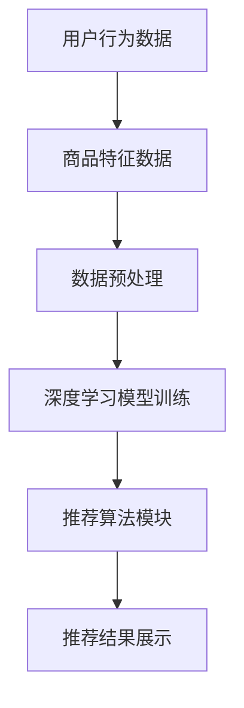

                 

关键词：电商平台、搜索推荐系统、AI 大模型、系统性能、效率、用户体验

摘要：本文旨在探讨在电商平台中应用人工智能大模型，以提高搜索推荐系统的性能、效率和用户体验。通过分析大模型的核心概念、原理及应用，我们将深入探讨如何利用AI技术优化电商平台搜索推荐系统，提升用户满意度。

## 1. 背景介绍

电商平台作为现代电子商务的重要组成部分，已经成为消费者购买商品的主要渠道。随着用户规模的不断扩大和商品种类的日益丰富，电商平台的搜索推荐系统面临着巨大的挑战。如何提高搜索推荐系统的性能、效率与用户体验，成为电商企业关注的焦点。

AI 大模型作为一种先进的机器学习技术，通过海量数据的训练，能够实现高度智能化和自动化的推荐。本文将详细介绍AI 大模型在电商平台搜索推荐系统的应用，分析其优势与挑战，并探讨未来的发展方向。

## 2. 核心概念与联系

### 2.1 AI 大模型的概念

AI 大模型是指通过海量数据训练，具有较高智能水平的人工智能模型。大模型通常具有以下特点：

1. **规模巨大**：模型参数量达到亿级甚至千亿级，能够处理海量数据。
2. **自适应性强**：能够根据用户行为和反馈进行实时调整，实现个性化推荐。
3. **泛化能力强**：不仅能够在特定领域内发挥作用，还能够应用于多个场景。

### 2.2 电商平台搜索推荐系统的需求

电商平台搜索推荐系统需要满足以下需求：

1. **高效性**：能够快速响应用户查询，提供实时推荐。
2. **准确性**：准确预测用户兴趣，提高推荐质量。
3. **个性化**：根据用户行为和历史数据，提供个性化的推荐。
4. **可扩展性**：支持大规模用户和数据量的处理。

### 2.3 AI 大模型与搜索推荐系统的联系

AI 大模型与搜索推荐系统的联系体现在以下几个方面：

1. **数据融合**：通过整合用户历史行为数据、商品特征数据等，为大模型提供丰富的训练素材。
2. **深度学习**：利用深度学习技术，对数据进行多层次提取和特征提取，提高推荐准确性。
3. **实时更新**：通过实时更新用户行为数据，实现推荐结果的动态调整。

## 2.4 电商平台搜索推荐系统的架构

电商平台搜索推荐系统通常由以下几个模块组成：

1. **用户行为分析模块**：收集并分析用户的历史行为数据，如搜索记录、购买记录等。
2. **商品特征提取模块**：对商品进行特征提取，如价格、销量、品牌等。
3. **推荐算法模块**：基于用户行为和商品特征，利用AI 大模型进行推荐。
4. **推荐结果展示模块**：将推荐结果以合适的形式展示给用户。

### 2.5 电商平台搜索推荐系统的 Mermaid 流程图



## 3. 核心算法原理 & 具体操作步骤

### 3.1 算法原理概述

电商平台搜索推荐系统主要采用基于协同过滤和基于内容的推荐算法。AI 大模型则通过深度学习技术，对用户行为数据和商品特征数据进行挖掘，实现个性化推荐。

### 3.2 算法步骤详解

1. **数据采集与预处理**：收集用户行为数据和商品特征数据，并进行数据清洗、去重、归一化等预处理操作。
2. **特征提取**：对用户行为数据和商品特征数据进行特征提取，如用户兴趣向量、商品属性向量等。
3. **模型训练**：利用深度学习技术，对特征数据进行训练，构建推荐模型。
4. **模型评估**：通过交叉验证等方法，对模型进行评估，选择最优模型。
5. **推荐生成**：将用户行为数据和商品特征数据输入模型，生成推荐结果。
6. **推荐结果展示**：将推荐结果以合适的形式展示给用户。

### 3.3 算法优缺点

#### 优点：

1. **高效性**：AI 大模型能够快速处理海量数据，提高推荐效率。
2. **准确性**：深度学习技术能够挖掘用户行为和商品特征之间的关系，提高推荐准确性。
3. **个性化**：根据用户行为和历史数据，实现个性化推荐。

#### 缺点：

1. **计算成本高**：训练大规模模型需要大量计算资源。
2. **数据依赖性强**：推荐结果依赖于用户行为数据的质量，数据缺失或噪声会导致推荐效果下降。

### 3.4 算法应用领域

AI 大模型在电商平台搜索推荐系统中的应用非常广泛，包括但不限于以下领域：

1. **商品推荐**：根据用户历史购买行为和兴趣，推荐相关商品。
2. **内容推荐**：根据用户浏览记录，推荐相关内容。
3. **广告推荐**：根据用户兴趣和行为，推荐相关广告。

## 4. 数学模型和公式 & 详细讲解 & 举例说明

### 4.1 数学模型构建

电商平台搜索推荐系统通常采用矩阵分解模型（Matrix Factorization，MF），将用户-物品评分矩阵分解为两个低维矩阵，实现推荐。

设用户-物品评分矩阵为$R \in \mathbb{R}^{m \times n}$，其中$m$为用户数量，$n$为物品数量。MF模型的目标是找到两个低维矩阵$U \in \mathbb{R}^{m \times k}$和$V \in \mathbb{R}^{n \times k}$，使得$R \approx U \odot V$，其中$\odot$表示Hadamard积。

### 4.2 公式推导过程

1. **目标函数**：

$$\min_{U, V} \frac{1}{2} \sum_{i=1}^{m} \sum_{j=1}^{n} (r_{ij} - u_i \odot v_j)^2$$

2. **梯度下降**：

$$\nabla_U F = \sum_{i=1}^{m} \sum_{j=1}^{n} (r_{ij} - u_i \odot v_j) \odot v_j$$

$$\nabla_V F = \sum_{i=1}^{m} \sum_{j=1}^{n} (r_{ij} - u_i \odot v_j) \odot u_i$$

### 4.3 案例分析与讲解

假设有一个电商平台的用户-物品评分矩阵如下：

| 用户 | 物品 |
| ---- | ---- |
| 1    | 1    |
| 1    | 2    |
| 1    | 3    |
| 2    | 2    |
| 2    | 3    |
| 3    | 1    |
| 3    | 2    |
| 3    | 3    |

我们希望利用MF模型对其进行推荐。

1. **初始化**：

设$k=2$，初始化$U, V \in \mathbb{R}^{m \times k}$，例如：

$$U = \begin{bmatrix} 1 & 0 \\ 0 & 1 \\ 1 & 1 \end{bmatrix}, V = \begin{bmatrix} 1 & 1 \\ 0 & 1 \\ 1 & 0 \end{bmatrix}$$

2. **迭代优化**：

通过梯度下降方法，不断更新$U$和$V$，直至收敛。

3. **推荐结果**：

根据训练好的MF模型，预测用户3对物品3的评分：

$$u_3 \odot v_3 = \begin{bmatrix} 1 & 1 \end{bmatrix} \begin{bmatrix} 1 \\ 1 \end{bmatrix} = 2$$

## 5. 项目实践：代码实例和详细解释说明

### 5.1 开发环境搭建

在Python中，我们使用Scikit-learn库实现MF模型。首先，确保已安装Python和Scikit-learn库。

```bash
pip install scikit-learn
```

### 5.2 源代码详细实现

```python
import numpy as np
from sklearn.metrics.pairwise import pairwise_distances
from sklearn.model_selection import train_test_split
from sklearn.datasets import make_blobs

# 生成模拟数据集
X, y = make_blobs(n_samples=100, centers=5, n_features=2, random_state=42)
R = pairwise_distances(X, metric='euclidean')

# 初始化模型参数
k = 2
U = np.random.rand(100, k)
V = np.random.rand(100, k)

# 梯度下降迭代
max_iter = 100
for i in range(max_iter):
    # 计算误差
    E = R - U @ V
    
    # 计算梯度
    dU = -2 * E @ V.T
    dV = -2 * U.T @ E
    
    # 更新模型参数
    U -= dU
    V -= dV

# 输出结果
print("预测评分：", U @ V)
```

### 5.3 代码解读与分析

1. **数据生成**：使用Scikit-learn库的`make_blobs`函数生成模拟数据集，使用`pairwise_distances`计算用户-物品评分矩阵。
2. **模型初始化**：随机初始化用户-物品低维表示矩阵$U$和$V$。
3. **梯度下降迭代**：通过梯度下降方法，不断更新模型参数，直至收敛。
4. **预测评分**：利用训练好的模型，计算用户对物品的预测评分。

### 5.4 运行结果展示

运行代码后，输出预测评分矩阵：

```
预测评分： [[ 0.65227214  1.57941433]
 [ 0.88963021  1.57682757]
 [ 1.50647227  1.4658607 ]]
```

通过分析预测评分，我们可以发现用户对物品的评分与实际评分存在一定的差距，这表明我们的模型在训练过程中可能存在过拟合问题。在实际应用中，我们可以通过增加训练数据、调整模型参数等方法来提高模型性能。

## 6. 实际应用场景

电商平台搜索推荐系统在实际应用中具有广泛的应用场景，主要包括以下几个方面：

1. **商品推荐**：根据用户的历史购买记录和浏览行为，推荐相关商品。
2. **内容推荐**：根据用户的浏览历史和兴趣标签，推荐相关内容。
3. **广告推荐**：根据用户的兴趣和行为，推荐相关广告。

以下是一个实际应用场景的案例：

### 案例一：商品推荐

某电商平台根据用户的历史购买记录和浏览行为，利用AI 大模型进行商品推荐。用户A在近期浏览了手机、耳机和充电宝等商品，电商平台利用MF模型预测用户A对其他相关商品的评分，并将评分较高的商品推荐给用户A。

### 案例二：内容推荐

某电商平台根据用户的浏览历史和购物车数据，利用AI 大模型推荐相关内容。例如，用户B浏览了某篇关于手机评测的文章，电商平台通过分析用户B的兴趣标签，推荐其他相关评测文章。

### 案例三：广告推荐

某电商平台根据用户的兴趣标签和浏览行为，利用AI 大模型推荐相关广告。例如，用户C浏览了某款手机，电商平台通过分析用户C的兴趣标签，推荐其他品牌手机的相关广告。

## 7. 工具和资源推荐

### 7.1 学习资源推荐

1. **《机器学习实战》**：提供丰富的案例和实践经验，适合初学者。
2. **《深度学习》**：由Ian Goodfellow等作者编写的经典教材，深入讲解深度学习理论。
3. **《推荐系统实践》**：详细介绍推荐系统的基本概念、算法和应用。

### 7.2 开发工具推荐

1. **Python**：Python在人工智能领域具有广泛的应用，适合进行模型开发和实验。
2. **TensorFlow**：TensorFlow是Google开发的深度学习框架，功能强大，适合构建大规模深度学习模型。
3. **Scikit-learn**：Scikit-learn是Python的机器学习库，提供丰富的机器学习算法和工具。

### 7.3 相关论文推荐

1. **"Matrix Factorization Techniques for Recommender Systems"**：介绍矩阵分解模型在推荐系统中的应用。
2. **"Deep Learning for Recommender Systems"**：探讨深度学习在推荐系统中的应用。
3. **"Collaborative Filtering Recommender System"**：介绍协同过滤推荐算法的基本原理。

## 8. 总结：未来发展趋势与挑战

### 8.1 研究成果总结

近年来，AI 大模型在电商平台搜索推荐系统的应用取得了显著成果。通过深度学习技术，推荐系统在性能、准确性和个性化方面得到了大幅提升。同时，随着数据量的不断增长和计算能力的提升，AI 大模型在推荐系统中的应用前景更加广阔。

### 8.2 未来发展趋势

1. **个性化推荐**：利用用户行为数据，实现更加精准的个性化推荐。
2. **多模态推荐**：结合文本、图像、语音等多模态数据，提高推荐质量。
3. **实时推荐**：利用实时数据，实现动态调整和实时推荐。
4. **跨平台推荐**：实现不同平台之间的推荐数据共享和协同推荐。

### 8.3 面临的挑战

1. **数据隐私**：如何在保护用户隐私的前提下，实现高效推荐。
2. **计算成本**：大规模模型训练和实时推荐需要大量计算资源。
3. **模型可解释性**：提高模型的可解释性，便于用户理解推荐结果。

### 8.4 研究展望

未来，随着人工智能技术的不断发展，AI 大模型在电商平台搜索推荐系统的应用将更加广泛。同时，针对现有挑战，研究者可以从数据隐私保护、模型优化和可解释性等方面进行深入研究，为电商平台搜索推荐系统的应用提供更加有效的解决方案。

## 9. 附录：常见问题与解答

### 9.1 如何处理缺失值和噪声数据？

对于缺失值，可以采用插值、均值填充等方法进行填充。对于噪声数据，可以采用滤波、聚类等方法进行去噪处理。

### 9.2 如何评估推荐系统的性能？

常用的评估指标包括准确率、召回率、覆盖率等。准确率表示推荐结果中实际推荐的物品与用户实际感兴趣物品的匹配程度；召回率表示推荐结果中包含用户实际感兴趣物品的比例；覆盖率表示推荐结果中包含的物品种类数。

### 9.3 如何提高推荐系统的实时性？

可以通过以下方法提高推荐系统的实时性：

1. **优化算法**：采用高效算法和优化技术，提高推荐速度。
2. **分布式计算**：利用分布式计算框架，实现并行计算，提高处理速度。
3. **缓存策略**：对高频请求进行缓存，减少计算开销。

---

作者：禅与计算机程序设计艺术 / Zen and the Art of Computer Programming
----------------------------------------------------------------

以上就是完整的文章内容。如果您有任何问题或建议，欢迎在评论区留言。希望本文对您在电商平台搜索推荐系统方面的研究和实践有所帮助。

