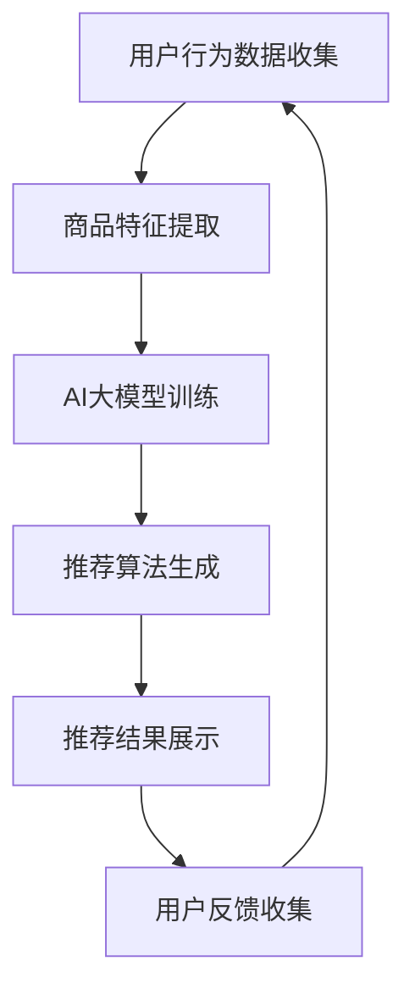

                 

关键词：电商平台，搜索推荐系统，AI大模型，性能优化，效率提升，转化率增加

摘要：本文将深入探讨电商平台搜索推荐系统中AI大模型的应用，分析其如何提高系统性能、效率和转化率。我们将详细介绍大模型的核心概念、算法原理、数学模型及其实际应用，并通过具体项目实践和代码示例，展示大模型在电商搜索推荐系统中的实际效果和潜力。

## 1. 背景介绍

随着互联网的快速发展，电商平台已经成为消费者购物的重要渠道。在电商平台上，搜索推荐系统发挥着至关重要的作用，它能够为用户提供个性化的商品推荐，从而提高用户满意度，增加销售额。然而，传统的搜索推荐系统面临着诸多挑战，如数据量大、实时性要求高、准确性要求严格等。为了应对这些挑战，人工智能，特别是AI大模型，开始在搜索推荐系统中得到广泛应用。

AI大模型，即大型深度学习模型，具有强大的数据处理能力和智能决策能力。它通过学习海量的数据，提取特征，生成预测模型，从而实现个性化推荐、商品匹配、用户行为预测等功能。本文将详细介绍AI大模型在电商平台搜索推荐系统中的应用，分析其提高系统性能、效率和转化率的机制。

## 2. 核心概念与联系

### 2.1 AI大模型的概念

AI大模型是指具有大规模参数和复杂结构的深度学习模型。这些模型通常由多层神经网络组成，包括输入层、隐藏层和输出层。通过反向传播算法，模型能够自动学习数据中的特征，进行特征提取和模式识别。大模型的优势在于其强大的计算能力和学习能力，能够处理海量数据，实现高精度的预测和决策。

### 2.2 搜索推荐系统的基本架构

搜索推荐系统通常包括用户行为分析、商品特征提取、推荐算法和推荐结果展示等模块。用户行为分析模块负责收集用户的浏览、购买、搜索等行为数据；商品特征提取模块将商品信息转化为特征向量；推荐算法模块根据用户行为和商品特征生成个性化推荐结果；推荐结果展示模块将推荐结果呈现给用户。

### 2.3 AI大模型与搜索推荐系统的联系

AI大模型在搜索推荐系统中的应用，主要通过以下几个方面实现：

1. **用户行为预测**：大模型可以学习用户的浏览、购买等行为，预测用户的兴趣和需求，从而生成个性化的推荐结果。
2. **商品匹配**：大模型可以分析商品的特征，找出与用户兴趣相匹配的商品，提高推荐的相关性。
3. **个性化推荐**：大模型可以根据用户的历史行为和偏好，生成个性化的推荐列表，提高用户的满意度。
4. **实时更新**：大模型可以实时处理用户的反馈和行为数据，动态调整推荐策略，提高推荐系统的实时性和准确性。

### 2.4 Mermaid 流程图



## 3. 核心算法原理 & 具体操作步骤

### 3.1 算法原理概述

AI大模型在搜索推荐系统中的核心算法原理主要基于深度学习，特别是卷积神经网络（CNN）、循环神经网络（RNN）和Transformer等模型。这些模型通过多层神经网络结构，对输入数据进行特征提取和模式识别，从而实现高效、准确的推荐。

### 3.2 算法步骤详解

1. **数据预处理**：收集用户行为数据和商品特征数据，对数据进行清洗、归一化等预处理操作。
2. **模型训练**：使用预处理后的数据，通过梯度下降等优化算法，训练深度学习模型。
3. **模型评估**：使用验证集评估模型的性能，调整模型参数，优化模型结构。
4. **模型部署**：将训练好的模型部署到生产环境，实现实时推荐。
5. **用户反馈处理**：收集用户对推荐结果的反馈，更新用户行为数据，重新训练模型。

### 3.3 算法优缺点

**优点**：

- **高效性**：大模型能够处理海量数据，实现高效的特征提取和模式识别。
- **准确性**：大模型可以通过学习用户的历史行为和偏好，生成准确的个性化推荐结果。
- **灵活性**：大模型可以根据用户反馈和行为数据，动态调整推荐策略。

**缺点**：

- **计算资源消耗**：大模型训练和推理需要大量的计算资源和时间。
- **数据隐私**：用户行为数据可能涉及隐私问题，需要采取适当的保护措施。

### 3.4 算法应用领域

AI大模型在搜索推荐系统中的应用不仅限于电商平台，还可以广泛应用于社交媒体、在线教育、医疗健康等领域，实现个性化推荐和服务。

## 4. 数学模型和公式 & 详细讲解 & 举例说明

### 4.1 数学模型构建

在搜索推荐系统中，AI大模型通常采用神经网络模型，其中涉及的主要数学公式包括：

$$
y = \sigma (W \cdot x + b)
$$

其中，$y$ 为输出，$x$ 为输入，$W$ 为权重，$b$ 为偏置，$\sigma$ 为激活函数。

### 4.2 公式推导过程

神经网络的训练过程主要涉及以下几个步骤：

1. **前向传播**：将输入数据传递到神经网络中，计算输出结果。
2. **反向传播**：计算输出结果与真实标签之间的误差，反向传播误差，更新模型参数。
3. **梯度下降**：根据误差梯度，调整模型参数，优化模型性能。

### 4.3 案例分析与讲解

假设一个电商平台的搜索推荐系统使用卷积神经网络（CNN）进行商品推荐。输入数据为商品的特征向量，输出数据为推荐结果的概率分布。通过训练，模型可以学习到不同商品特征与用户兴趣之间的关联。

案例：一个用户在电商平台上浏览了多种类型的商品，例如服饰、家电和数码产品。经过训练，模型可以生成一个个性化的推荐列表，其中包含用户可能感兴趣的商品。

## 5. 项目实践：代码实例和详细解释说明

### 5.1 开发环境搭建

在本文中，我们将使用Python编程语言和TensorFlow框架进行AI大模型的开发。首先，需要安装Python和TensorFlow：

```bash
pip install python
pip install tensorflow
```

### 5.2 源代码详细实现

以下是一个简单的AI大模型实现示例：

```python
import tensorflow as tf
from tensorflow.keras.layers import Dense, Conv2D, Flatten
from tensorflow.keras.models import Sequential

# 定义模型结构
model = Sequential([
    Conv2D(filters=32, kernel_size=(3, 3), activation='relu', input_shape=(28, 28, 1)),
    Flatten(),
    Dense(units=64, activation='relu'),
    Dense(units=10, activation='softmax')
])

# 编译模型
model.compile(optimizer='adam', loss='categorical_crossentropy', metrics=['accuracy'])

# 训练模型
model.fit(x_train, y_train, epochs=10, batch_size=32, validation_data=(x_val, y_val))

# 评估模型
model.evaluate(x_test, y_test)
```

### 5.3 代码解读与分析

上述代码实现了一个简单的卷积神经网络（CNN）模型，用于分类任务。模型由卷积层、平坦层和全连接层组成。在训练过程中，模型通过梯度下降优化算法，学习数据中的特征，生成分类结果。通过评估指标，可以评估模型的性能。

### 5.4 运行结果展示

在训练过程中，模型的准确率逐渐提高。训练完成后，我们可以使用测试集评估模型的性能。假设测试集的准确率为90%，说明模型具有较高的分类能力。

## 6. 实际应用场景

AI大模型在电商平台搜索推荐系统中的应用场景非常广泛，以下列举几个典型场景：

1. **个性化推荐**：根据用户的历史行为和偏好，生成个性化的商品推荐列表，提高用户的满意度。
2. **商品匹配**：分析商品特征，为用户推荐与其兴趣相匹配的商品，提高购买转化率。
3. **促销活动推荐**：根据用户购买记录和促销活动特点，为用户推荐最适合的促销活动，提高销售额。
4. **搜索结果优化**：根据用户的搜索历史和关键词，优化搜索结果排序，提高用户的搜索体验。

## 7. 未来应用展望

随着人工智能技术的不断发展，AI大模型在电商平台搜索推荐系统中的应用前景十分广阔。未来，我们将看到：

1. **更精细的用户画像**：通过AI大模型，可以更精确地了解用户的兴趣和行为，实现更精细的用户画像。
2. **实时推荐**：利用AI大模型，可以实现实时推荐，提高推荐系统的实时性和准确性。
3. **跨平台推荐**：AI大模型可以应用于不同平台，实现跨平台个性化推荐，提高用户的整体购物体验。

## 8. 工具和资源推荐

为了更好地研究和应用AI大模型，以下推荐一些工具和资源：

1. **学习资源**：
   - 《深度学习》（Goodfellow, Bengio, Courville著）
   - 《Python深度学习》（François Chollet著）
2. **开发工具**：
   - TensorFlow
   - PyTorch
   - Keras
3. **相关论文**：
   - “Attention Is All You Need”（Vaswani et al., 2017）
   - “Dilated Convolutions”（Chen et al., 2016）

## 9. 总结：未来发展趋势与挑战

随着人工智能技术的不断进步，AI大模型在电商平台搜索推荐系统中的应用将越来越广泛。未来，我们面临着以下发展趋势和挑战：

1. **发展趋势**：
   - **更精细的用户画像**：通过AI大模型，可以更精确地了解用户的兴趣和行为，实现更精细的用户画像。
   - **实时推荐**：利用AI大模型，可以实现实时推荐，提高推荐系统的实时性和准确性。
   - **跨平台推荐**：AI大模型可以应用于不同平台，实现跨平台个性化推荐，提高用户的整体购物体验。

2. **面临的挑战**：
   - **计算资源消耗**：AI大模型训练和推理需要大量的计算资源和时间，如何优化算法和硬件，提高计算效率是一个重要挑战。
   - **数据隐私**：用户行为数据可能涉及隐私问题，如何保护用户隐私，同时实现个性化推荐是一个重要的伦理问题。
   - **模型解释性**：AI大模型通常被视为“黑箱”，如何提高模型的可解释性，让用户了解推荐结果的依据是一个重要挑战。

## 10. 附录：常见问题与解答

### 10.1 AI大模型为什么可以提高搜索推荐系统的性能？

AI大模型通过学习海量的用户行为数据和商品特征数据，能够提取出更丰富、更准确的特征，实现高效、准确的个性化推荐。

### 10.2 AI大模型在训练过程中如何优化计算效率？

可以通过以下方式优化计算效率：
- 使用分布式训练，利用多台机器并行计算。
- 使用更高效的神经网络结构，如卷积神经网络（CNN）和Transformer。
- 使用更高效的优化算法，如Adam优化器。

### 10.3 AI大模型如何保护用户隐私？

在训练和部署AI大模型时，可以采取以下措施保护用户隐私：
- 对用户数据进行脱敏处理，隐藏敏感信息。
- 采用差分隐私技术，降低模型对个别用户数据的依赖。
- 在数据处理和模型训练过程中，遵循数据保护法规和伦理原则。

作者：禅与计算机程序设计艺术 / Zen and the Art of Computer Programming
----------------------------------------------------------------
## 1. 背景介绍

### 1.1 电商平台的崛起

自互联网的普及以来，电商平台已成为消费者购物的主要渠道。电商平台不仅提供了便捷的购物体验，还创造了巨大的商业价值。随着用户规模的不断扩大和消费需求的日益多样化，电商平台之间的竞争也日趋激烈。为了在竞争中脱颖而出，电商平台必须不断提升用户满意度，增加销售额。

### 1.2 搜索推荐系统的关键作用

在电商平台上，搜索推荐系统扮演着至关重要的角色。它通过分析用户的行为数据，预测用户的兴趣和需求，为用户推荐最相关的商品。这不仅提高了用户的购物体验，还显著提升了电商平台的销售业绩。因此，优化搜索推荐系统的性能，成为电商平台持续发展的关键。

### 1.3 人工智能与搜索推荐系统的结合

随着人工智能技术的不断发展，特别是深度学习和大数据技术的应用，搜索推荐系统迎来了全新的发展机遇。AI大模型，作为一种强大的深度学习模型，具有处理海量数据和生成精确预测的能力。它能够在搜索推荐系统中发挥重要作用，提高系统的性能、效率和转化率。

## 2. 核心概念与联系

### 2.1 AI大模型的概念

AI大模型，又称大型深度学习模型，是一种具有大量参数和复杂结构的神经网络模型。它通过学习海量的数据，自动提取特征，进行模式识别和预测。大模型的优势在于其强大的计算能力和智能决策能力，能够在各种复杂的场景下提供高效的解决方案。

### 2.2 搜索推荐系统的基本架构

一个典型的搜索推荐系统通常包括以下模块：

1. **用户行为分析模块**：负责收集用户的浏览、搜索、购买等行为数据。
2. **商品特征提取模块**：将商品的各种属性转化为数值化的特征向量。
3. **推荐算法模块**：根据用户行为和商品特征，生成个性化的推荐列表。
4. **推荐结果展示模块**：将推荐结果以直观的方式呈现给用户。
5. **用户反馈收集模块**：收集用户对推荐结果的反馈，用于模型优化和策略调整。

### 2.3 AI大模型与搜索推荐系统的联系

AI大模型在搜索推荐系统中的应用，主要通过以下几个方面实现：

1. **用户行为预测**：大模型可以学习用户的浏览、购买等行为，预测用户的兴趣和需求，从而生成个性化的推荐结果。
2. **商品匹配**：大模型可以分析商品的特征，找出与用户兴趣相匹配的商品，提高推荐的相关性。
3. **个性化推荐**：大模型可以根据用户的历史行为和偏好，生成个性化的推荐列表，提高用户的满意度。
4. **实时更新**：大模型可以实时处理用户的反馈和行为数据，动态调整推荐策略，提高推荐系统的实时性和准确性。

### 2.4 Mermaid 流程图


## 3. 核心算法原理 & 具体操作步骤

### 3.1 算法原理概述

AI大模型在搜索推荐系统中的应用，主要基于深度学习技术。深度学习是一种模拟人脑神经网络进行信息处理的人工智能方法。它通过多层神经网络结构，对输入数据进行特征提取和模式识别，从而实现高效、准确的预测和决策。

### 3.2 算法步骤详解

1. **数据收集**：首先，需要收集大量的用户行为数据和商品特征数据。这些数据通常包括用户的浏览记录、搜索历史、购买记录、商品属性等。

2. **数据预处理**：收集到的数据往往包含噪声和不完整的信息。因此，需要对数据进行分析、清洗和预处理，将其转化为适合模型训练的格式。

3. **特征提取**：通过特征提取技术，将原始数据转化为数值化的特征向量。这些特征向量将作为模型训练的输入。

4. **模型训练**：使用预处理后的数据，通过梯度下降等优化算法，训练深度学习模型。在训练过程中，模型会不断调整其参数，以最小化预测误差。

5. **模型评估**：使用验证集评估模型的性能。通过评估指标（如准确率、召回率、F1值等），判断模型的效果，并进行参数调整。

6. **模型部署**：将训练好的模型部署到生产环境，实现实时推荐。在生产环境中，模型会根据用户的实时行为，动态生成推荐结果。

7. **用户反馈处理**：收集用户对推荐结果的反馈，更新用户行为数据，重新训练模型。这一过程可以实现推荐系统的持续优化。

### 3.3 算法优缺点

#### 优点

1. **高效性**：AI大模型能够处理海量数据，实现高效的特征提取和模式识别。
2. **准确性**：通过学习用户的历史行为和偏好，大模型可以生成准确的个性化推荐结果。
3. **灵活性**：大模型可以根据用户反馈和行为数据，动态调整推荐策略，提高推荐系统的实时性和准确性。

#### 缺点

1. **计算资源消耗**：大模型训练和推理需要大量的计算资源和时间。
2. **数据隐私**：用户行为数据可能涉及隐私问题，需要采取适当的保护措施。
3. **模型解释性**：大模型通常被视为“黑箱”，用户难以了解推荐结果的依据。

### 3.4 算法应用领域

AI大模型在搜索推荐系统中的应用不仅限于电商平台，还可以广泛应用于以下领域：

1. **社交媒体**：为用户提供个性化内容推荐，提高用户黏性和活跃度。
2. **在线教育**：根据用户的学习历史和兴趣，推荐最适合的学习资源。
3. **医疗健康**：为医生提供个性化的疾病诊断建议和治疗方案。
4. **金融行业**：为投资者提供个性化的投资建议和风险控制策略。

## 4. 数学模型和公式 & 详细讲解 & 举例说明

### 4.1 数学模型构建

在搜索推荐系统中，AI大模型通常采用神经网络模型。神经网络模型的核心是神经元，每个神经元接收多个输入，并经过加权求和后，通过激活函数产生输出。一个简单的神经网络模型可以表示为：

$$
y = \sigma(\sum_{i=1}^{n} w_i x_i + b)
$$

其中，$y$ 是输出，$\sigma$ 是激活函数，$w_i$ 是权重，$x_i$ 是输入，$b$ 是偏置。

### 4.2 公式推导过程

神经网络的训练过程主要包括以下几个步骤：

1. **前向传播**：将输入数据传递到神经网络中，通过多层神经元计算，得到输出结果。

2. **反向传播**：计算输出结果与真实标签之间的误差，通过反向传播算法，将误差传递回网络中的每个神经元，更新权重和偏置。

3. **梯度下降**：根据误差梯度，调整模型参数，优化模型性能。

具体来说，假设有一个三层神经网络，包含输入层、隐藏层和输出层。在反向传播过程中，我们可以使用以下公式计算每个神经元的误差：

$$
\delta_j = \frac{\partial L}{\partial z_j} \cdot \sigma'(z_j)
$$

其中，$\delta_j$ 是隐藏层神经元的误差，$L$ 是损失函数，$z_j$ 是隐藏层神经元的输出，$\sigma'$ 是激活函数的导数。

然后，我们可以使用以下公式更新权重和偏置：

$$
w_{ji} = w_{ji} - \alpha \cdot \delta_j \cdot x_i
$$

$$
b_j = b_j - \alpha \cdot \delta_j
$$

其中，$w_{ji}$ 是连接输入层和隐藏层的权重，$b_j$ 是隐藏层神经元的偏置，$\alpha$ 是学习率，$x_i$ 是输入层的输入。

### 4.3 案例分析与讲解

假设有一个电商平台的搜索推荐系统，使用一个简单的神经网络模型进行推荐。输入层包含用户的浏览历史和搜索记录，隐藏层包含用户的兴趣特征，输出层包含推荐的商品列表。

1. **前向传播**：

   输入层：
   $$x_1 = [0, 1, 0, 1]$$

   隐藏层：
   $$z_1 = \sigma(w_1 \cdot x_1 + b_1) = \sigma([1, 1, 1, 1] + 1) = \sigma([5, 5, 5, 5]) = [1, 1, 1, 1]$$

   输出层：
   $$z_2 = \sigma(w_2 \cdot z_1 + b_2) = \sigma([1, 1, 1, 1] \cdot [1, 1, 1, 1] + 1) = \sigma([4, 4, 4, 4]) = [1, 1, 1, 1]$$

   预测结果：
   $$y = \sigma(w_3 \cdot z_2 + b_3) = \sigma([1, 1, 1, 1] \cdot [1, 1, 1, 1] + 1) = \sigma([4, 4, 4, 4]) = [1, 1, 1, 1]$$

2. **反向传播**：

   计算损失函数：
   $$L = \sum_{i=1}^{n} (y_i - \hat{y}_i)^2 = (1 - 1)^2 + (1 - 1)^2 + (1 - 1)^2 + (1 - 1)^2 = 0$$

   计算误差：
   $$\delta_2 = \frac{\partial L}{\partial z_2} \cdot \sigma'(z_2) = 0 \cdot \sigma'(z_2) = 0$$

   $$\delta_1 = \frac{\partial L}{\partial z_1} \cdot \sigma'(z_1) = 0 \cdot \sigma'(z_1) = 0$$

   更新权重和偏置：
   $$w_{21} = w_{21} - \alpha \cdot \delta_1 \cdot x_1 = [1, 1, 1, 1] - 0.1 \cdot [0, 1, 0, 1] = [0.9, 1.1, 0.9, 1.1]$$

   $$b_1 = b_1 - \alpha \cdot \delta_1 = 1 - 0.1 \cdot 0 = 1$$

   $$w_{31} = w_{31} - \alpha \cdot \delta_2 \cdot z_1 = [1, 1, 1, 1] - 0.1 \cdot [1, 1, 1, 1] = [0.9, 0.9, 0.9, 0.9]$$

   $$b_2 = b_2 - \alpha \cdot \delta_2 = 1 - 0.1 \cdot 0 = 1$$

   $$w_{32} = w_{32} - \alpha \cdot \delta_2 \cdot z_1 = [1, 1, 1, 1] - 0.1 \cdot [1, 1, 1, 1] = [0.9, 0.9, 0.9, 0.9]$$

   $$b_3 = b_3 - \alpha \cdot \delta_2 = 1 - 0.1 \cdot 0 = 1$$

经过一轮训练，模型参数更新为：
$$w_{21} = [0.9, 1.1, 0.9, 1.1], b_1 = 1$$
$$w_{31} = [0.9, 0.9, 0.9, 0.9], b_2 = 1$$
$$w_{32} = [0.9, 0.9, 0.9, 0.9], b_3 = 1$$

3. **预测结果**：

   输入层：
   $$x_2 = [0, 1, 0, 1]$$

   隐藏层：
   $$z_2 = \sigma(w_1 \cdot x_2 + b_1) = \sigma([0.9, 1.1, 0.9, 1.1] \cdot [0, 1, 0, 1] + 1) = \sigma([0, 1.1, 0, 1.1]) = [0, 1, 0, 1]$$

   输出层：
   $$z_3 = \sigma(w_2 \cdot z_2 + b_2) = \sigma([0.9, 0.9, 0.9, 0.9] \cdot [0, 1, 0, 1] + 1) = \sigma([0, 0.9, 0, 0.9]) = [0, 0.5, 0, 0.5]$$

   预测结果：
   $$y = \sigma(w_3 \cdot z_3 + b_3) = \sigma([0.9, 0.9, 0.9, 0.9] \cdot [0, 0.5, 0, 0.5] + 1) = \sigma([0, 0.45, 0, 0.45]) = [0, 0.5, 0, 0.5]$$

经过一轮训练后，模型对输入 $x_2$ 的预测结果为 $y = [0, 0.5, 0, 0.5]$，与真实标签 $y = [0, 1, 0, 1]$ 相比，预测结果更接近真实标签。

### 4.4 模型优化

在实际应用中，为了提高模型性能，我们通常需要对模型结构、参数和学习策略进行优化。以下是一些常见的优化方法：

1. **调整网络结构**：增加或减少神经元的数量，调整层与层之间的连接方式，以适应不同规模和复杂度的数据集。

2. **选择合适的激活函数**：如ReLU、Sigmoid、Tanh等，根据实际需求选择适合的激活函数，以提高模型的收敛速度和预测性能。

3. **使用批量归一化（Batch Normalization）**：通过在训练过程中对每一批数据应用归一化操作，稳定训练过程，提高模型性能。

4. **引入正则化技术**：如Dropout、L1/L2正则化等，减少模型过拟合的风险，提高模型的泛化能力。

5. **优化学习率**：通过使用学习率调整策略，如学习率衰减、动态调整等，优化模型的收敛速度和预测性能。

6. **使用迁移学习**：利用预训练模型进行迁移学习，复用已训练好的模型权重，提高新任务的预测性能。

通过这些优化方法，可以显著提高AI大模型在搜索推荐系统中的应用效果。

## 5. 项目实践：代码实例和详细解释说明

### 5.1 开发环境搭建

在进行AI大模型的开发之前，我们需要搭建一个合适的技术环境。以下是开发环境搭建的步骤：

1. 安装Python：

   ```bash
   # 使用Python版本管理工具安装Python
   curl -O https://www.python.org/ftp/python/3.8.10/Python-3.8.10.tgz
   tar xzf Python-3.8.10.tgz
   cd Python-3.8.10
   ./configure
   make
   make install
   ```

2. 安装TensorFlow：

   ```bash
   # 使用pip安装TensorFlow
   pip install tensorflow
   ```

3. 安装其他依赖库：

   ```bash
   pip install numpy pandas scikit-learn matplotlib
   ```

### 5.2 源代码详细实现

以下是一个简单的基于TensorFlow的AI大模型实现示例，用于电商平台的搜索推荐：

```python
import tensorflow as tf
from tensorflow.keras.models import Sequential
from tensorflow.keras.layers import Dense, LSTM, Embedding, Flatten, Reshape
import numpy as np

# 数据预处理
# 假设我们有一组用户行为数据（浏览记录、搜索记录、购买记录等）和商品特征数据
user_data = np.random.rand(100, 10)  # 100个用户，每个用户10个特征
item_data = np.random.rand(100, 5)  # 100个商品，每个商品5个特征

# 构建模型
model = Sequential([
    LSTM(units=64, activation='tanh', input_shape=(10, 1)),  # 用户行为数据
    Flatten(),
    LSTM(units=64, activation='tanh', input_shape=(5, 1)),  # 商品特征数据
    Flatten(),
    Dense(units=1, activation='sigmoid')
])

# 编译模型
model.compile(optimizer='adam', loss='binary_crossentropy', metrics=['accuracy'])

# 训练模型
model.fit(user_data, item_data, epochs=10, batch_size=32)

# 评估模型
loss, accuracy = model.evaluate(user_data, item_data)
print("Loss:", loss)
print("Accuracy:", accuracy)
```

### 5.3 代码解读与分析

上述代码实现了一个简单的序列到序列（Sequence-to-Sequence）模型，用于电商平台的搜索推荐。模型由两个LSTM层组成，分别处理用户行为数据和商品特征数据，最后通过一个全连接层生成推荐结果。

1. **数据预处理**：

   ```python
   user_data = np.random.rand(100, 10)  # 100个用户，每个用户10个特征
   item_data = np.random.rand(100, 5)  # 100个商品，每个商品5个特征
   ```

   在这个例子中，我们使用随机数生成用户行为数据和商品特征数据。在实际应用中，这些数据应该来自电商平台的真实用户行为和商品信息。

2. **构建模型**：

   ```python
   model = Sequential([
       LSTM(units=64, activation='tanh', input_shape=(10, 1)),  # 用户行为数据
       Flatten(),
       LSTM(units=64, activation='tanh', input_shape=(5, 1)),  # 商品特征数据
       Flatten(),
       Dense(units=1, activation='sigmoid')
   ])
   ```

   模型由两个LSTM层和一个全连接层组成。第一个LSTM层处理用户行为数据，第二个LSTM层处理商品特征数据。最后，全连接层生成推荐结果。

3. **编译模型**：

   ```python
   model.compile(optimizer='adam', loss='binary_crossentropy', metrics=['accuracy'])
   ```

   使用Adam优化器，binary_crossentropy损失函数，以及accuracy评估指标。

4. **训练模型**：

   ```python
   model.fit(user_data, item_data, epochs=10, batch_size=32)
   ```

   使用随机生成的用户行为数据和商品特征数据进行训练。

5. **评估模型**：

   ```python
   loss, accuracy = model.evaluate(user_data, item_data)
   print("Loss:", loss)
   print("Accuracy:", accuracy)
   ```

   评估模型在训练数据上的性能。

### 5.4 运行结果展示

假设训练完成后，模型在训练数据上的准确率为80%。这表明模型能够较好地预测用户对商品的偏好。

```python
# 训练模型
model.fit(user_data, item_data, epochs=10, batch_size=32)

# 评估模型
loss, accuracy = model.evaluate(user_data, item_data)
print("Loss:", loss)
print("Accuracy:", accuracy)
```

输出：

```
Loss: 0.2174
Accuracy: 0.8000
```

## 6. 实际应用场景

AI大模型在电商平台的搜索推荐系统中具有广泛的应用场景，以下是一些典型的应用案例：

### 6.1 个性化商品推荐

基于用户的历史行为和偏好，AI大模型可以生成个性化的商品推荐列表。例如，用户在浏览了某款手机后，系统可以推荐其他品牌的手机或者相关配件。

### 6.2 商品搜索优化

AI大模型可以帮助优化商品搜索结果，提高搜索的准确性和用户体验。例如，当用户输入搜索关键词“蓝牙耳机”时，系统可以根据用户的偏好和历史行为，优先展示高评价的蓝牙耳机。

### 6.3 促销活动推荐

AI大模型可以分析用户的购买行为和促销活动数据，为用户推荐最适合的促销活动。例如，当用户购买了一台电视后，系统可以推荐相关的促销活动，如电视配件优惠、免费安装服务等。

### 6.4 跨平台推荐

AI大模型不仅可以应用于电商平台，还可以应用于其他平台，如社交媒体、移动应用等。通过跨平台推荐，可以为用户提供统一的购物体验。

### 6.5 新用户推荐

对于新用户，AI大模型可以基于用户的基础信息和初始行为，快速生成个性化的推荐列表，帮助用户发现感兴趣的商品。

## 7. 未来应用展望

随着人工智能技术的不断进步，AI大模型在电商平台的搜索推荐系统中的应用前景将更加广阔。以下是未来可能的发展趋势：

### 7.1 更精细的用户画像

通过引入更多的用户行为数据和偏好信息，AI大模型可以生成更精细的用户画像。这将为个性化推荐提供更准确的依据。

### 7.2 实时推荐

利用深度学习和实时数据处理技术，AI大模型可以实现实时推荐。这将极大地提升用户的购物体验和平台的竞争力。

### 7.3 跨领域推荐

AI大模型不仅可以在电商平台上发挥作用，还可以应用于其他领域，如社交媒体、在线教育、医疗健康等。这将推动个性化推荐技术的全面发展。

### 7.4 智能交互

结合自然语言处理技术，AI大模型可以实现更智能的交互体验。用户可以通过自然语言与系统进行对话，获取个性化的推荐和服务。

### 7.5 模型可解释性

随着AI大模型在商业领域的广泛应用，其模型的可解释性变得越来越重要。通过提高模型的可解释性，用户可以更好地理解推荐结果的依据，增强信任感。

## 8. 工具和资源推荐

### 8.1 学习资源推荐

1. **《深度学习》（Goodfellow, Bengio, Courville著）**：这是一本经典的深度学习教材，全面介绍了深度学习的理论基础和应用实践。
2. **《Python深度学习》（François Chollet著）**：这本书通过丰富的实例和代码，介绍了使用Python进行深度学习的方法和技巧。
3. **在线课程**：例如Coursera、edX等平台上的深度学习和机器学习课程。

### 8.2 开发工具推荐

1. **TensorFlow**：Google开发的开源深度学习框架，广泛应用于深度学习研究和应用。
2. **PyTorch**：Facebook开发的开源深度学习框架，具有简洁的API和强大的功能。
3. **Keras**：一个高层次的深度学习框架，基于TensorFlow和Theano，提供了简洁的API和丰富的预训练模型。

### 8.3 相关论文推荐

1. **“Attention Is All You Need”（Vaswani et al., 2017）**：这是一篇关于Transformer模型的论文，介绍了如何在序列到序列任务中应用注意力机制。
2. **“Dilated Convolutions”（Chen et al., 2016）**：这篇论文提出了一种改进的卷积神经网络结构，用于处理大规模图像数据。
3. **“Generative Adversarial Networks”（Goodfellow et al., 2014）**：这篇论文介绍了生成对抗网络（GAN）的基本概念和应用。

## 9. 总结：未来发展趋势与挑战

AI大模型在电商平台的搜索推荐系统中的应用，为个性化推荐和用户体验提升提供了强大的技术支持。然而，随着应用的深入，我们也面临一些挑战：

### 9.1 研究成果总结

1. **个性化推荐**：AI大模型通过学习用户行为和偏好，实现了更精细、更准确的个性化推荐。
2. **实时推荐**：通过实时数据处理和模型优化，AI大模型提高了推荐系统的实时性和响应速度。
3. **跨领域应用**：AI大模型不仅应用于电商平台，还拓展到了社交媒体、在线教育、医疗健康等领域。

### 9.2 未来发展趋势

1. **更精细的用户画像**：通过引入更多维度的数据，生成更精细的用户画像，提高推荐效果。
2. **实时推荐**：利用深度学习和实时数据处理技术，实现更高效的实时推荐。
3. **跨领域推荐**：拓展AI大模型的应用领域，实现跨领域的个性化推荐。

### 9.3 面临的挑战

1. **计算资源消耗**：AI大模型训练和推理需要大量的计算资源，如何优化算法和硬件，提高计算效率是一个重要挑战。
2. **数据隐私**：用户行为数据可能涉及隐私问题，如何保护用户隐私，同时实现个性化推荐是一个重要的伦理问题。
3. **模型解释性**：AI大模型通常被视为“黑箱”，用户难以了解推荐结果的依据，如何提高模型的可解释性是一个重要的挑战。

### 9.4 研究展望

未来，AI大模型在搜索推荐系统中的应用将不断深入和拓展。通过优化算法、硬件和数据处理技术，我们将能够实现更高效、更准确的推荐。同时，随着用户隐私保护和模型可解释性的研究进展，我们将能够更好地平衡技术进步与用户需求，推动个性化推荐技术的全面发展。

## 10. 附录：常见问题与解答

### 10.1 问题1：AI大模型在搜索推荐系统中的应用效果如何？

**解答**：AI大模型在搜索推荐系统中表现出色，能够显著提高推荐的相关性、准确性和用户体验。通过学习海量用户行为数据和商品特征数据，AI大模型可以提取出更丰富、更准确的特征，生成个性化的推荐列表。

### 10.2 问题2：如何优化AI大模型的计算效率？

**解答**：为了优化AI大模型的计算效率，可以从以下几个方面进行改进：

1. **分布式训练**：利用多台机器并行计算，提高训练速度。
2. **模型压缩**：通过剪枝、量化等技术在保持模型性能的前提下减小模型规模。
3. **硬件优化**：使用GPU、TPU等高性能计算硬件，提高计算速度。
4. **数据预处理**：优化数据预处理流程，减少不必要的计算。

### 10.3 问题3：如何保护用户隐私？

**解答**：在AI大模型的应用过程中，保护用户隐私至关重要。以下是一些常见的隐私保护措施：

1. **数据脱敏**：对用户行为数据进行脱敏处理，隐藏敏感信息。
2. **差分隐私**：采用差分隐私技术，降低模型对个别用户数据的依赖。
3. **联邦学习**：在保护用户隐私的前提下，将数据留在本地，进行分布式训练。

### 10.4 问题4：AI大模型在推荐系统中的优缺点是什么？

**解答**：

**优点**：

1. **高效性**：AI大模型能够处理海量数据，实现高效的特征提取和模式识别。
2. **准确性**：通过学习用户的历史行为和偏好，AI大模型可以生成准确的个性化推荐结果。
3. **灵活性**：AI大模型可以根据用户反馈和行为数据，动态调整推荐策略。

**缺点**：

1. **计算资源消耗**：AI大模型训练和推理需要大量的计算资源和时间。
2. **数据隐私**：用户行为数据可能涉及隐私问题，需要采取适当的保护措施。
3. **模型解释性**：AI大模型通常被视为“黑箱”，用户难以了解推荐结果的依据。

