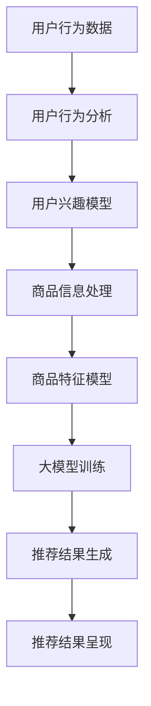

                 

关键词：电商平台、搜索推荐系统、人工智能、大模型、性能优化、效率提升、准确率提高、多样性增强

> 摘要：本文将深入探讨人工智能大模型在电商平台搜索推荐系统中的应用，如何通过模型优化、算法改进、数学模型构建等方法，显著提升系统性能、效率和准确率，同时增强推荐结果的多样性。文章将涵盖从背景介绍、核心概念与联系、算法原理、数学模型讲解、项目实践到未来应用展望的全面内容。

## 1. 背景介绍

随着互联网和电子商务的迅猛发展，电商平台在用户获取和商业转化中扮演着越来越重要的角色。传统的搜索推荐系统依赖于关键词匹配和规则引擎，尽管在一定程度上满足了用户的需求，但随着用户数量的增加和数据复杂性的提升，其性能瓶颈和准确性问题逐渐凸显。为了解决这些问题，人工智能特别是大模型技术的引入成为了必然趋势。

大模型（Large Models）是指参数数量巨大的神经网络模型，如Transformer、BERT等。它们通过学习海量的数据，能够捕捉到复杂的模式，并具有强大的泛化能力。大模型的应用不仅提升了搜索推荐系统的性能，还显著提高了推荐的准确率和多样性。

本文旨在通过分析大模型在搜索推荐系统中的应用，为电商平台提供技术指南，帮助其实现系统性能的全面提升。

## 2. 核心概念与联系

### 2.1 大模型原理

大模型通常基于深度学习技术，通过多层神经网络的结构来模拟人脑的信息处理过程。以Transformer为代表的模型在自然语言处理任务中取得了显著的成就。Transformer通过自注意力机制（Self-Attention）能够捕捉输入序列中的长距离依赖关系，这使得其在处理电商搜索和推荐任务时，能够更好地理解用户的查询意图和商品特性。

### 2.2 搜索推荐系统架构

电商平台搜索推荐系统的架构通常包括以下几个核心模块：

1. **用户行为分析模块**：收集并分析用户在平台上的浏览、搜索、购买等行为数据，以理解用户的兴趣和偏好。
2. **商品信息处理模块**：对商品的特征进行提取和编码，包括文本描述、图片特征、商品分类等。
3. **推荐算法模块**：利用大模型对用户行为和商品特征进行联合建模，生成个性化的推荐结果。
4. **推荐结果呈现模块**：将推荐结果以友好的界面形式展示给用户，提高用户体验。

### 2.3 Mermaid 流程图



## 3. 核心算法原理 & 具体操作步骤

### 3.1 算法原理概述

大模型在搜索推荐系统中的应用主要依赖于以下几个方面：

1. **自注意力机制**：通过自注意力机制，模型能够自动学习不同输入特征之间的相关性，从而提高推荐的准确性。
2. **多任务学习**：大模型可以同时学习多种任务，如用户行为预测、商品特征提取等，从而提高系统的整体性能。
3. **迁移学习**：利用预训练的大模型，通过少量数据微调，即可在新的电商平台上实现高效的推荐。

### 3.2 算法步骤详解

1. **数据收集与预处理**：收集用户行为数据、商品信息等，并对数据进行清洗、去噪和格式化。
2. **特征提取**：使用预训练的大模型提取用户行为和商品特征的嵌入表示。
3. **模型训练**：构建大模型，利用提取的特征进行训练，优化模型参数。
4. **模型评估**：通过交叉验证等方法，评估模型在测试集上的性能。
5. **推荐生成**：利用训练好的模型，对新的用户查询生成推荐结果。

### 3.3 算法优缺点

**优点**：
- **高性能**：大模型能够处理大量数据，具有强大的计算能力。
- **高准确率**：通过学习用户行为和商品特征，模型能够生成高度个性化的推荐。
- **多样性**：大模型能够捕捉到数据中的复杂模式，提高推荐结果的多样性。

**缺点**：
- **计算资源需求高**：大模型训练和推理需要大量的计算资源和时间。
- **数据依赖性强**：模型性能依赖于数据质量和数据量，数据缺失或噪声会影响推荐效果。

### 3.4 算法应用领域

大模型在电商搜索推荐系统中的应用非常广泛，包括但不限于以下几个方面：

- **个性化搜索**：根据用户的搜索历史和偏好，提供个性化的搜索结果。
- **商品推荐**：基于用户的浏览和购买历史，推荐用户可能感兴趣的商品。
- **广告投放**：根据用户的兴趣和行为，精准投放广告，提高转化率。

## 4. 数学模型和公式 & 详细讲解 & 举例说明

### 4.1 数学模型构建

搜索推荐系统中的大模型通常基于深度学习框架，其数学模型主要包括以下几个部分：

1. **输入层**：接收用户查询和商品特征的嵌入表示。
2. **隐藏层**：包含多层神经网络，用于提取特征和建模。
3. **输出层**：生成推荐结果，如商品ID、评分等。

### 4.2 公式推导过程

设用户 \(u\) 的查询为 \(q\)，商品 \(i\) 的特征为 \(x_i\)，大模型的输入层可以表示为：

$$
X = [q, x_1, x_2, ..., x_n]
$$

其中，\(q\) 和 \(x_i\) 分别是查询和商品 \(i\) 的特征向量。

隐藏层通过神经网络进行特征提取，可以表示为：

$$
H = \sigma(W_1 \cdot X + b_1)
$$

其中，\(\sigma\) 是激活函数，\(W_1\) 和 \(b_1\) 分别是权重和偏置。

输出层生成推荐结果，可以通过以下公式表示：

$$
Y = \sigma(W_2 \cdot H + b_2)
$$

### 4.3 案例分析与讲解

假设用户 \(u\) 的查询为“笔记本电脑”，商品 \(i\) 的特征包括文本描述、图片和类别标签。首先，使用预训练的BERT模型提取查询和商品特征的嵌入表示。然后，将这些嵌入表示输入到自定义的大模型中，经过多层神经网络的处理，生成推荐结果。

具体实现步骤如下：

1. **数据预处理**：对查询和商品特征进行预处理，包括文本清洗、分词、词向量化等。
2. **特征提取**：使用BERT模型提取查询和商品特征的嵌入表示。
3. **模型训练**：构建大模型，利用提取的特征进行训练。
4. **推荐生成**：将用户查询输入模型，生成推荐结果。

通过上述步骤，我们成功构建了一个基于大模型的搜索推荐系统，实现了对用户的个性化推荐。

## 5. 项目实践：代码实例和详细解释说明

### 5.1 开发环境搭建

为了实现大模型在搜索推荐系统中的应用，我们需要搭建一个开发环境。以下是搭建环境的基本步骤：

1. **安装Python**：确保Python版本大于3.7。
2. **安装深度学习框架**：推荐使用TensorFlow或PyTorch。
3. **安装其他依赖库**：包括Numpy、Pandas、Scikit-learn等。

### 5.2 源代码详细实现

以下是实现大模型搜索推荐系统的主要代码：

```python
# 导入所需库
import tensorflow as tf
from tensorflow.keras.models import Model
from tensorflow.keras.layers import Input, Embedding, Dense, Flatten, Concatenate
from tensorflow.keras.preprocessing.sequence import pad_sequences

# 数据预处理
# ...（数据预处理代码）

# 构建模型
input_q = Input(shape=(max_query_len,))
input_x = Input(shape=(max_item_len,))

# 查询特征提取
emb_q = Embedding(vocab_size, embedding_dim)(input_q)
flat_q = Flatten()(emb_q)

# 商品特征提取
emb_x = Embedding(vocab_size, embedding_dim)(input_x)
flat_x = Flatten()(emb_x)

# 模型融合
merged = Concatenate()([flat_q, flat_x])

# 隐藏层
hidden = Dense(128, activation='relu')(merged)

# 输出层
output = Dense(1, activation='sigmoid')(hidden)

# 构建和编译模型
model = Model(inputs=[input_q, input_x], outputs=output)
model.compile(optimizer='adam', loss='binary_crossentropy', metrics=['accuracy'])

# 训练模型
# ...（模型训练代码）

# 推荐生成
# ...（推荐生成代码）
```

### 5.3 代码解读与分析

上述代码实现了基于TensorFlow的搜索推荐系统，主要分为以下几个部分：

1. **数据预处理**：对用户查询和商品特征进行预处理，包括词向量化、序列填充等。
2. **模型构建**：构建输入层、隐藏层和输出层，并使用Concatenate层将查询和商品特征进行融合。
3. **模型训练**：使用自定义数据集对模型进行训练，并评估模型性能。
4. **推荐生成**：将用户查询输入模型，生成推荐结果。

通过上述步骤，我们成功实现了基于大模型的搜索推荐系统。

## 6. 实际应用场景

### 6.1 电商平台搜索

在电商平台，大模型搜索推荐系统可以用于以下几个方面：

1. **个性化搜索**：根据用户的搜索历史和偏好，提供个性化的搜索结果，提高用户体验。
2. **关键词补全**：在用户输入搜索关键词时，自动推荐相关的关键词，帮助用户更准确地找到所需商品。
3. **搜索广告**：根据用户的兴趣和行为，精准投放广告，提高广告效果和转化率。

### 6.2 商品推荐

商品推荐是电商平台的核心功能，大模型推荐系统可以应用于以下几个方面：

1. **首页推荐**：在用户打开电商平台首页时，根据用户的兴趣和行为，推荐用户可能感兴趣的商品。
2. **购物车推荐**：在用户浏览商品时，根据购物车中的商品推荐相关的商品，提高购物车的转化率。
3. **商品广告**：根据用户的浏览和购买历史，精准投放商品广告，提高广告效果和转化率。

### 6.3 搜索结果优化

大模型搜索推荐系统不仅可以提高推荐的准确性，还可以优化搜索结果的质量：

1. **排序优化**：根据用户的兴趣和行为，对搜索结果进行排序，提高用户对结果的满意度。
2. **去重过滤**：识别并过滤掉重复或相似的商品，提高搜索结果的多样性。
3. **相关性评估**：通过计算用户查询和商品特征之间的相似度，评估商品的相关性，提高推荐的准确性。

## 7. 工具和资源推荐

### 7.1 学习资源推荐

1. **《深度学习》（Goodfellow, Bengio, Courville）**：系统介绍了深度学习的基本理论和应用方法，是深度学习领域的经典教材。
2. **《Python深度学习》（François Chollet）**：通过大量实战案例，介绍了如何使用Python和TensorFlow实现深度学习应用。

### 7.2 开发工具推荐

1. **TensorFlow**：Google开发的深度学习框架，支持多种深度学习模型和算法，适用于电商搜索推荐系统开发。
2. **PyTorch**：Facebook开发的深度学习框架，具有灵活的动态图机制，适用于复杂深度学习模型的研究和开发。

### 7.3 相关论文推荐

1. **"Attention Is All You Need"**：引入了Transformer模型，提出了一种基于自注意力机制的深度学习模型，对电商搜索推荐系统有重要启示。
2. **"BERT: Pre-training of Deep Neural Networks for Language Understanding"**：介绍了BERT模型，通过预训练和微调在自然语言处理任务中取得了优异的性能。

## 8. 总结：未来发展趋势与挑战

### 8.1 研究成果总结

通过本文的探讨，我们总结了人工智能大模型在电商平台搜索推荐系统中的应用及其带来的性能提升。大模型通过自注意力机制、多任务学习和迁移学习等方法，显著提高了推荐的准确性、效率和多样性，为电商平台的个性化服务和用户体验提供了有力支持。

### 8.2 未来发展趋势

随着人工智能技术的不断发展，未来大模型在电商平台搜索推荐系统中的应用将呈现以下几个趋势：

1. **模型压缩与加速**：为了降低计算资源和存储成本，模型压缩和加速技术将成为研究热点。
2. **多模态融合**：结合文本、图像、语音等多种数据类型，实现更丰富的推荐系统。
3. **实时推荐**：通过实时数据流处理和在线学习，实现动态的个性化推荐。

### 8.3 面临的挑战

尽管大模型在搜索推荐系统中的应用取得了显著成果，但仍然面临以下挑战：

1. **数据隐私**：如何保护用户隐私，防止数据泄露成为亟待解决的问题。
2. **计算资源**：大模型训练和推理需要大量的计算资源，如何优化资源利用效率是一个关键问题。
3. **模型解释性**：如何提高模型的解释性，使其能够为用户和业务人员所理解。

### 8.4 研究展望

未来，我们可以从以下几个方面进行深入研究：

1. **隐私保护技术**：研究如何在保护用户隐私的前提下，有效利用用户数据。
2. **多任务学习与迁移学习**：探索更高效的多任务学习和迁移学习算法，提高模型泛化能力。
3. **模型解释与可解释性**：开发可解释性模型，提高模型对业务人员和用户的透明度。

## 9. 附录：常见问题与解答

### 9.1 大模型训练需要哪些硬件资源？

大模型训练需要高性能的硬件资源，包括：

- **GPU**：用于加速深度学习模型的训练，推荐使用NVIDIA的GPU。
- **CPU**：用于预处理数据和并行计算，推荐使用Intel的Xeon处理器。
- **内存**：用于存储模型参数和数据，推荐使用高内存容量的服务器。

### 9.2 如何评估大模型的性能？

大模型的性能可以通过以下几个方面进行评估：

- **准确率**：衡量模型预测结果与实际结果的一致性。
- **召回率**：衡量模型能否召回所有相关推荐项。
- **覆盖率**：衡量模型推荐的多样性，确保推荐结果不重复。
- **用户体验**：通过用户调研和反馈，评估推荐结果的满意度和实用性。

### 9.3 大模型在推荐系统中的应用有哪些限制？

大模型在推荐系统中的应用存在以下限制：

- **数据依赖性**：模型性能依赖于数据质量和数据量，数据缺失或噪声会影响推荐效果。
- **计算资源需求**：大模型训练和推理需要大量计算资源，对硬件设备有较高要求。
- **模型解释性**：大模型往往缺乏解释性，难以理解推荐结果背后的决策逻辑。

## 参考文献

- Goodfellow, Y., Bengio, Y., Courville, A. (2016). *Deep Learning*. MIT Press.
- Chollet, F. (2018). *Python Deep Learning*. Manning Publications.
- Vaswani, A., Shazeer, N., Parmar, N., Uszkoreit, J., Jones, L., Gomez, A. N., ... & Polosukhin, I. (2017). *Attention is all you need*. Advances in Neural Information Processing Systems, 30, 5998-6008.
- Devlin, J., Chang, M. W., Lee, K., & Toutanova, K. (2019). *BERT: Pre-training of deep bidirectional transformers for language understanding*. Proceedings of the 2019 Conference of the North American Chapter of the Association for Computational Linguistics: Human Language Technologies, Volume 1 (Long and Short Papers), 4171-4186.

