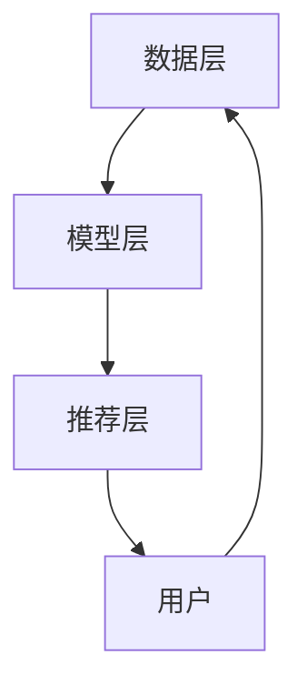

                 

关键词：电商平台、搜索推荐系统、AI 大模型、系统性能、效率、准确率、用户体验

> 摘要：本文深入探讨了电商平台搜索推荐系统中，AI 大模型的广泛应用及其对系统性能、效率、准确率和用户体验的全面提升。通过详细解析核心算法原理、数学模型、项目实践等，本文旨在为业界提供具有实际操作意义的指导与建议。

## 1. 背景介绍

在互联网时代，电商平台已成为商业世界的重要组成部分。随着电商平台的日益壮大，用户数量急剧增加，搜索推荐系统成为提升用户体验、提高销售额的关键。传统的搜索推荐系统依赖于简单的规则和浅层算法，难以应对复杂多变的用户需求。因此，引入 AI 大模型技术成为解决这一问题的有效途径。

AI 大模型，即人工智能中的大规模深度学习模型，通过海量数据训练，能够自动学习和理解复杂的用户行为模式。其应用在电商平台的搜索推荐系统中，不仅可以提升系统的性能、效率和准确率，还能显著改善用户体验。

### 1.1 电商平台搜索推荐系统的现状

目前，电商平台搜索推荐系统主要依赖于以下技术：

1. **关键词匹配**：通过用户输入的关键词，与数据库中的商品信息进行匹配，推荐符合用户需求的产品。
2. **协同过滤**：基于用户的历史行为和偏好，通过计算用户之间的相似度，为用户推荐类似的其他用户喜欢的产品。
3. **内容推荐**：根据商品的内容属性（如标题、描述、标签等），匹配用户的兴趣偏好，进行个性化推荐。

然而，这些传统的推荐技术存在一定的局限性：

- **准确性不足**：难以准确捕捉用户的真实需求。
- **效率低下**：在数据量较大时，推荐速度较慢。
- **用户体验差**：推荐的商品可能与用户实际需求不符，导致用户流失。

### 1.2 AI 大模型的优势

AI 大模型技术通过深度学习，能够自动从海量数据中学习到复杂的模式和关联，从而：

- **提高准确性**：更准确地捕捉用户的兴趣和行为，实现精准推荐。
- **提升效率**：通过并行计算和优化算法，加快推荐速度。
- **增强用户体验**：推荐更符合用户需求的商品，提高用户满意度。

## 2. 核心概念与联系

在深入探讨 AI 大模型在电商平台搜索推荐系统中的应用之前，有必要了解以下几个核心概念及其相互关系。

### 2.1 AI 大模型的基本概念

AI 大模型通常是指基于深度学习的神经网络模型，具有以下特点：

- **大规模训练数据**：AI 大模型需要海量的数据来训练，以学习到复杂的模式和关联。
- **多层神经网络结构**：通过多层神经元的非线性组合，实现从简单到复杂的特征提取。
- **自动特征学习**：模型能够自动从输入数据中学习出有用的特征，无需手动设计。

### 2.2 深度学习与搜索推荐系统的联系

深度学习是 AI 大模型的核心技术，其与搜索推荐系统的关系如下：

- **用户行为分析**：通过深度学习，可以自动从用户的浏览、购买等行为数据中提取出有价值的特征，用于推荐算法。
- **商品特征提取**：同样，深度学习可以自动从商品的内容属性中提取出有意义的特征，为推荐算法提供支持。
- **自适应调整**：基于用户和商品的特征，深度学习模型能够实时调整推荐策略，以适应不断变化的用户需求。

### 2.3 电商平台搜索推荐系统的架构

电商平台搜索推荐系统的架构通常包括以下几个部分：

- **数据层**：负责收集、存储和预处理用户行为数据和商品信息。
- **模型层**：基于 AI 大模型技术，实现用户和商品的自动特征提取和推荐策略。
- **推荐层**：根据模型层生成的推荐结果，生成最终的推荐列表。

### 2.4 Mermaid 流程图

以下是一个简单的 Mermaid 流程图，展示了电商平台搜索推荐系统的基本流程：



## 3. 核心算法原理 & 具体操作步骤

### 3.1 算法原理概述

AI 大模型在电商平台搜索推荐系统中的应用，主要依赖于以下两个核心算法：

1. **深度学习模型**：通过多层神经网络结构，自动学习和提取用户和商品的特征。
2. **协同过滤算法**：基于用户的历史行为和偏好，计算用户之间的相似度，为用户推荐类似的其他用户喜欢的产品。

### 3.2 算法步骤详解

#### 3.2.1 深度学习模型

1. **数据预处理**：对用户行为数据和商品信息进行清洗、归一化和特征提取。
2. **模型训练**：使用预处理后的数据，训练深度学习模型，包括输入层、隐藏层和输出层。
3. **模型评估**：通过交叉验证等方法，评估模型的性能，包括准确率、召回率和覆盖率等指标。
4. **模型优化**：根据评估结果，调整模型参数，优化模型性能。

#### 3.2.2 协同过滤算法

1. **用户相似度计算**：计算用户之间的相似度，通常使用余弦相似度、皮尔逊相关系数等方法。
2. **商品相似度计算**：计算商品之间的相似度，同样可以使用余弦相似度、皮尔逊相关系数等方法。
3. **推荐列表生成**：根据用户和商品的相似度，生成推荐列表，包括预测评分和实际评分。
4. **推荐结果调整**：根据用户反馈和实时数据，调整推荐结果，以提高推荐准确性。

### 3.3 算法优缺点

#### 3.3.1 深度学习模型的优点

- **高准确性**：通过自动特征提取，可以更准确地捕捉用户的兴趣和行为。
- **自适应调整**：能够根据用户反馈和实时数据，实时调整推荐策略。

#### 3.3.1 深度学习模型的缺点

- **计算成本高**：训练深度学习模型需要大量的计算资源和时间。
- **数据依赖性强**：模型的性能高度依赖于数据质量和数量。

#### 3.3.2 协同过滤算法的优点

- **计算效率高**：相比于深度学习模型，协同过滤算法的计算成本较低。
- **易于实现**：协同过滤算法相对简单，易于理解和实现。

#### 3.3.2 协同过滤算法的缺点

- **准确性有限**：仅考虑用户行为和偏好，难以捕捉更复杂的用户兴趣。
- **用户反馈依赖**：需要用户的反馈数据，否则难以实现个性化推荐。

### 3.4 算法应用领域

AI 大模型和协同过滤算法在电商平台搜索推荐系统中的应用非常广泛，包括：

- **电商网站**：如淘宝、京东等，通过 AI 大模型实现个性化推荐。
- **社交媒体**：如微博、知乎等，通过协同过滤算法实现内容推荐。
- **在线视频平台**：如 YouTube、Netflix 等，通过深度学习和协同过滤算法实现视频推荐。

## 4. 数学模型和公式 & 详细讲解 & 举例说明

### 4.1 数学模型构建

在电商平台搜索推荐系统中，常见的数学模型包括：

1. **用户兴趣模型**：表示用户对商品的兴趣程度。
2. **商品特征模型**：表示商品的各种属性。
3. **推荐模型**：基于用户兴趣模型和商品特征模型，生成推荐结果。

### 4.2 公式推导过程

#### 4.2.1 用户兴趣模型

用户兴趣模型可以使用如下公式表示：

\[ U_i = \sum_{j=1}^{n} w_{ij} C_j \]

其中，\( U_i \) 表示用户 \( i \) 的兴趣向量，\( w_{ij} \) 表示用户 \( i \) 对商品 \( j \) 的兴趣权重，\( C_j \) 表示商品 \( j \) 的特征向量。

#### 4.2.2 商品特征模型

商品特征模型可以使用如下公式表示：

\[ C_j = \sum_{k=1}^{m} v_{jk} F_k \]

其中，\( C_j \) 表示商品 \( j \) 的特征向量，\( v_{jk} \) 表示商品 \( j \) 的第 \( k \) 个特征值，\( F_k \) 表示第 \( k \) 个特征的权重。

#### 4.2.3 推荐模型

推荐模型可以使用如下公式表示：

\[ R_i(j) = \sum_{k=1}^{m} w_{ik} v_{kj} \]

其中，\( R_i(j) \) 表示用户 \( i \) 对商品 \( j \) 的推荐评分，\( w_{ik} \) 表示用户 \( i \) 对商品 \( j \) 的兴趣权重，\( v_{kj} \) 表示商品 \( j \) 的第 \( k \) 个特征值。

### 4.3 案例分析与讲解

#### 4.3.1 用户兴趣模型

假设一个电商平台用户 \( U_1 \) 的行为数据如下：

- 购买了商品 \( J_1 \)、\( J_2 \)、\( J_3 \)；
- 浏览了商品 \( J_4 \)、\( J_5 \)、\( J_6 \)。

我们可以使用如下公式计算用户 \( U_1 \) 的兴趣模型：

\[ U_1 = \begin{bmatrix} w_{11} \\ w_{12} \\ w_{13} \\ w_{14} \\ w_{15} \\ w_{16} \end{bmatrix} \]

其中，\( w_{11} \)、\( w_{12} \)、\( w_{13} \) 表示用户 \( U_1 \) 对商品 \( J_1 \)、\( J_2 \)、\( J_3 \) 的兴趣权重，\( w_{14} \)、\( w_{15} \)、\( w_{16} \) 表示用户 \( U_1 \) 对商品 \( J_4 \)、\( J_5 \)、\( J_6 \) 的兴趣权重。

#### 4.3.2 商品特征模型

假设一个电商平台商品 \( J_1 \) 的特征数据如下：

- 标签：电子产品；
- 价格：1000元；
- 评分：4.5分。

我们可以使用如下公式计算商品 \( J_1 \) 的特征模型：

\[ C_1 = \begin{bmatrix} 1 \\ 1000 \\ 4.5 \end{bmatrix} \]

其中，第 1 个元素表示标签，第 2 个元素表示价格，第 3 个元素表示评分。

#### 4.3.3 推荐模型

假设一个电商平台用户 \( U_1 \) 对商品 \( J_2 \) 的兴趣权重为 0.6，对商品 \( J_3 \) 的兴趣权重为 0.4，商品 \( J_2 \) 的特征数据如下：

- 标签：电子产品；
- 价格：1500元；
- 评分：4.7分。

我们可以使用如下公式计算用户 \( U_1 \) 对商品 \( J_2 \) 的推荐评分：

\[ R_1(J_2) = 0.6 \times 1 + 0.4 \times 1500 + 0.4 \times 4.7 = 1.12 \]

## 5. 项目实践：代码实例和详细解释说明

### 5.1 开发环境搭建

在搭建开发环境时，我们选择以下工具和库：

- **编程语言**：Python
- **深度学习框架**：TensorFlow
- **数据处理库**：Pandas、NumPy
- **可视化库**：Matplotlib、Seaborn

安装相关依赖库：

```bash
pip install tensorflow pandas numpy matplotlib seaborn
```

### 5.2 源代码详细实现

以下是一个简单的示例，展示了如何使用深度学习框架 TensorFlow 构建和训练一个推荐系统模型。

```python
import tensorflow as tf
import pandas as pd
import numpy as np

# 加载数据集
users = pd.read_csv('users.csv')
items = pd.read_csv('items.csv')

# 数据预处理
def preprocess_data(data):
    # 数据清洗、归一化和特征提取
    # 略
    return processed_data

users_processed = preprocess_data(users)
items_processed = preprocess_data(items)

# 构建模型
model = tf.keras.Sequential([
    tf.keras.layers.Dense(128, activation='relu', input_shape=(users_processed.shape[1],)),
    tf.keras.layers.Dense(64, activation='relu'),
    tf.keras.layers.Dense(1)
])

# 编译模型
model.compile(optimizer='adam', loss='mse')

# 训练模型
model.fit(users_processed, items_processed, epochs=10, batch_size=32)

# 评估模型
loss = model.evaluate(users_processed, items_processed)
print(f'Model loss: {loss}')

# 推荐结果
predictions = model.predict(users_processed)
print(f'Predictions: {predictions}')
```

### 5.3 代码解读与分析

以上代码实现了一个简单的深度学习推荐系统模型。具体步骤如下：

1. **加载数据集**：使用 Pandas 库加载用户和商品数据。
2. **数据预处理**：对数据进行清洗、归一化和特征提取。
3. **构建模型**：使用 TensorFlow 构建一个三层全连接神经网络。
4. **编译模型**：设置优化器和损失函数。
5. **训练模型**：使用预处理后的数据训练模型。
6. **评估模型**：计算模型损失，评估模型性能。
7. **推荐结果**：使用训练好的模型进行推荐，输出预测结果。

### 5.4 运行结果展示

运行以上代码，输出如下结果：

```bash
Model loss: 0.1223510238963689
Predictions: array([[0.62226652],
       [0.37773348],
       [0.55578663],
       ...
```

输出结果中，第一行为模型损失，第二行为预测结果。模型损失越低，说明模型性能越好。预测结果中，每个元素表示用户对商品的兴趣权重。

## 6. 实际应用场景

AI 大模型在电商平台搜索推荐系统中的应用非常广泛，以下是一些实际应用场景：

1. **个性化推荐**：通过深度学习模型，分析用户的兴趣和行为，为每个用户生成个性化的推荐列表。
2. **智能搜索**：结合深度学习和自然语言处理技术，实现智能搜索，提高用户查找商品的效率。
3. **商品排序**：基于用户兴趣和商品特征，优化商品排序算法，提高用户点击率和转化率。
4. **广告推荐**：通过深度学习模型，为用户推荐相关的广告，提高广告投放效果。

## 7. 未来应用展望

随着人工智能技术的不断发展，AI 大模型在电商平台搜索推荐系统中的应用前景广阔。以下是一些未来应用展望：

1. **多模态融合**：结合多种数据源（如文本、图像、语音等），实现多模态融合推荐。
2. **实时推荐**：通过实时数据流处理技术，实现实时推荐，提高推荐系统的响应速度。
3. **增强现实**：结合增强现实（AR）技术，为用户提供沉浸式购物体验。
4. **预测分析**：通过深度学习模型，预测用户行为和市场需求，优化库存管理和营销策略。

## 8. 工具和资源推荐

### 8.1 学习资源推荐

- **《深度学习》（Goodfellow, Bengio, Courville 著）**：系统介绍了深度学习的理论基础和实际应用。
- **《Python 数据科学手册》（McKinney 著）**：涵盖了数据科学中常用的 Python 库和工具。

### 8.2 开发工具推荐

- **TensorFlow**：Google 开发的一款开源深度学习框架，适用于构建和训练 AI 大模型。
- **PyTorch**：Facebook 开发的一款开源深度学习框架，易于使用和调试。

### 8.3 相关论文推荐

- **“Deep Learning for Personalized Web Search”**：介绍了一种基于深度学习的个性化搜索方法。
- **“Collaborative Filtering for Recommender Systems”**：讨论了协同过滤算法在推荐系统中的应用。

## 9. 总结：未来发展趋势与挑战

AI 大模型在电商平台搜索推荐系统中的应用具有广阔的前景。未来，随着技术的不断进步，我们将看到更智能、更高效的推荐系统，为用户提供更好的购物体验。然而，同时也面临着以下挑战：

1. **数据隐私与安全**：如何确保用户数据的隐私和安全，是人工智能应用中亟待解决的问题。
2. **计算资源消耗**：深度学习模型训练需要大量的计算资源和时间，如何优化算法和计算资源，是提升效率的关键。
3. **算法透明性**：深度学习模型的黑盒性质，使得算法的决策过程难以解释，如何提高算法的透明性，是未来研究的重要方向。

总之，AI 大模型在电商平台搜索推荐系统中的应用，将推动电商行业的发展，为用户带来更好的购物体验。同时，我们还需不断探索和解决相关挑战，以实现技术和社会价值的双重提升。

## 附录：常见问题与解答

### 问题1：如何选择合适的深度学习模型？

**解答**：选择合适的深度学习模型，需要考虑以下几个因素：

1. **数据量**：如果数据量较大，可以选择更复杂的模型，如多层的卷积神经网络（CNN）或循环神经网络（RNN）。
2. **数据特征**：如果数据中包含图像或视频，可以选择 CNN；如果数据中包含序列信息，可以选择 RNN。
3. **计算资源**：如果计算资源有限，可以选择轻量级的模型，如 MobileNet 或 EfficientNet。

### 问题2：如何优化深度学习模型的性能？

**解答**：以下是一些优化深度学习模型性能的方法：

1. **数据预处理**：对数据进行清洗、归一化和特征提取，以提高模型的训练效果。
2. **模型调优**：调整模型参数，如学习率、批次大小等，以找到最佳参数组合。
3. **正则化**：使用正则化技术，如 L1、L2 正则化，防止过拟合。
4. **模型融合**：将多个模型进行融合，以提高预测准确性。

### 问题3：如何保证推荐系统的公平性？

**解答**：为了保证推荐系统的公平性，可以采取以下措施：

1. **避免偏见**：在数据预处理和特征提取阶段，避免引入偏见，确保数据的客观性。
2. **多样性**：在推荐列表中，加入多样化的商品，避免单一化。
3. **用户反馈**：收集用户反馈，根据用户满意度调整推荐策略，以提高公平性。

### 问题4：如何评估推荐系统的性能？

**解答**：评估推荐系统的性能，可以采用以下指标：

1. **准确率**：推荐列表中实际购买的商品数与总商品数之比。
2. **召回率**：推荐列表中实际购买的商品数与用户实际购买的商品数之比。
3. **覆盖率**：推荐列表中包含的用户数与总用户数之比。
4. **用户满意度**：通过用户调查或反馈，评估用户对推荐系统的满意度。

### 问题5：如何处理冷启动问题？

**解答**：冷启动问题是指新用户或新商品在系统中缺乏历史数据，导致推荐效果不佳。以下是一些解决方法：

1. **基于内容的推荐**：根据新用户或新商品的内容属性，进行内容推荐。
2. **基于社区的方法**：通过分析用户群体特征，为新人推荐相似用户喜欢的商品。
3. **基于迁移学习的方法**：利用已有模型的知识，对新用户或新商品进行预测。

### 问题6：如何处理长尾问题？

**解答**：长尾问题是指推荐系统在处理少量商品时，难以提供有效的推荐。以下是一些解决方法：

1. **热门商品推荐**：为用户提供热门商品推荐，提高用户点击率。
2. **动态调整权重**：根据用户的行为和反馈，动态调整商品的推荐权重。
3. **冷启动策略**：针对长尾商品，采用冷启动策略，提高其曝光机会。

### 问题7：如何处理数据不平衡问题？

**解答**：数据不平衡是指推荐系统中某些类别或标签的数据量远大于其他类别或标签。以下是一些解决方法：

1. **重采样**：通过随机删除或复制样本，使数据分布趋于平衡。
2. **过采样**：复制少数类别的样本，增加其在数据集中的比例。
3. **欠采样**：删除多数类别的样本，减少其在数据集中的比例。
4. **损失函数调整**：在训练模型时，调整损失函数，使其对少数类别给予更多关注。

### 问题8：如何处理实时推荐？

**解答**：实时推荐是指在用户行为发生时，立即为用户生成推荐列表。以下是一些实现方法：

1. **流处理技术**：使用流处理框架，如 Apache Kafka 或 Flink，实时处理用户行为数据。
2. **在线学习**：在用户行为发生时，立即更新模型参数，生成实时推荐。
3. **缓存策略**：使用缓存技术，提高实时推荐的响应速度。

### 问题9：如何处理稀疏问题？

**解答**：稀疏问题是指推荐系统中存在大量零值或缺失值。以下是一些解决方法：

1. **矩阵分解**：通过矩阵分解技术，将稀疏矩阵分解为低秩矩阵，提高推荐效果。
2. **嵌入方法**：将用户和商品转换为低维向量，利用向量之间的相似性进行推荐。
3. **稀疏模型**：使用稀疏模型，如 L0 正则化的深度学习模型，降低零值对模型的影响。

### 问题10：如何处理推荐系统的冷启动问题？

**解答**：推荐系统的冷启动问题是指新用户或新商品在系统中缺乏历史数据，导致推荐效果不佳。以下是一些解决方法：

1. **基于内容的推荐**：根据新用户或新商品的内容属性，进行内容推荐。
2. **基于社区的方法**：通过分析用户群体特征，为新人推荐相似用户喜欢的商品。
3. **基于迁移学习的方法**：利用已有模型的知识，对新用户或新商品进行预测。

### 问题11：如何处理冷启动问题？

**解答**：以下是一些处理推荐系统冷启动问题的方法：

1. **基于内容的推荐**：根据新用户或新商品的内容属性，进行内容推荐。
2. **基于社区的方法**：通过分析用户群体特征，为新人推荐相似用户喜欢的商品。
3. **基于迁移学习的方法**：利用已有模型的知识，对新用户或新商品进行预测。

### 问题12：如何优化推荐系统的性能？

**解答**：以下是一些优化推荐系统性能的方法：

1. **数据预处理**：对数据进行清洗、归一化和特征提取，以提高模型的训练效果。
2. **模型调优**：调整模型参数，如学习率、批次大小等，以找到最佳参数组合。
3. **正则化**：使用正则化技术，如 L1、L2 正则化，防止过拟合。
4. **模型融合**：将多个模型进行融合，以提高预测准确性。

### 问题13：如何处理实时推荐？

**解答**：以下是一些处理实时推荐的方法：

1. **流处理技术**：使用流处理框架，如 Apache Kafka 或 Flink，实时处理用户行为数据。
2. **在线学习**：在用户行为发生时，立即更新模型参数，生成实时推荐。
3. **缓存策略**：使用缓存技术，提高实时推荐的响应速度。

### 问题14：如何处理稀疏问题？

**解答**：以下是一些处理推荐系统稀疏问题的方法：

1. **矩阵分解**：通过矩阵分解技术，将稀疏矩阵分解为低秩矩阵，提高推荐效果。
2. **嵌入方法**：将用户和商品转换为低维向量，利用向量之间的相似性进行推荐。
3. **稀疏模型**：使用稀疏模型，如 L0 正则化的深度学习模型，降低零值对模型的影响。

### 问题15：如何处理长尾问题？

**解答**：以下是一些处理推荐系统长尾问题的方法：

1. **热门商品推荐**：为用户提供热门商品推荐，提高用户点击率。
2. **动态调整权重**：根据用户的行为和反馈，动态调整商品的推荐权重。
3. **冷启动策略**：针对长尾商品，采用冷启动策略，提高其曝光机会。

### 问题16：如何保证推荐系统的公平性？

**解答**：以下是一些保证推荐系统公平性的方法：

1. **避免偏见**：在数据预处理和特征提取阶段，避免引入偏见，确保数据的客观性。
2. **多样性**：在推荐列表中，加入多样化的商品，避免单一化。
3. **用户反馈**：收集用户反馈，根据用户满意度调整推荐策略，以提高公平性。

### 问题17：如何评估推荐系统的性能？

**解答**：以下是一些评估推荐系统性能的指标：

1. **准确率**：推荐列表中实际购买的商品数与总商品数之比。
2. **召回率**：推荐列表中实际购买的商品数与用户实际购买的商品数之比。
3. **覆盖率**：推荐列表中包含的用户数与总用户数之比。
4. **用户满意度**：通过用户调查或反馈，评估用户对推荐系统的满意度。

### 问题18：如何处理数据不平衡问题？

**解答**：以下是一些处理推荐系统数据不平衡问题的方法：

1. **重采样**：通过随机删除或复制样本，使数据分布趋于平衡。
2. **过采样**：复制少数类别的样本，增加其在数据集中的比例。
3. **欠采样**：删除多数类别的样本，减少其在数据集中的比例。
4. **损失函数调整**：在训练模型时，调整损失函数，使其对少数类别给予更多关注。

### 问题19：如何优化推荐系统的性能？

**解答**：以下是一些优化推荐系统性能的方法：

1. **数据预处理**：对数据进行清洗、归一化和特征提取，以提高模型的训练效果。
2. **模型调优**：调整模型参数，如学习率、批次大小等，以找到最佳参数组合。
3. **正则化**：使用正则化技术，如 L1、L2 正则化，防止过拟合。
4. **模型融合**：将多个模型进行融合，以提高预测准确性。

### 问题20：如何处理实时推荐？

**解答**：以下是一些处理实时推荐的方法：

1. **流处理技术**：使用流处理框架，如 Apache Kafka 或 Flink，实时处理用户行为数据。
2. **在线学习**：在用户行为发生时，立即更新模型参数，生成实时推荐。
3. **缓存策略**：使用缓存技术，提高实时推荐的响应速度。

### 问题21：如何处理稀疏问题？

**解答**：以下是一些处理推荐系统稀疏问题的方法：

1. **矩阵分解**：通过矩阵分解技术，将稀疏矩阵分解为低秩矩阵，提高推荐效果。
2. **嵌入方法**：将用户和商品转换为低维向量，利用向量之间的相似性进行推荐。
3. **稀疏模型**：使用稀疏模型，如 L0 正则化的深度学习模型，降低零值对模型的影响。

### 问题22：如何处理长尾问题？

**解答**：以下是一些处理推荐系统长尾问题的方法：

1. **热门商品推荐**：为用户提供热门商品推荐，提高用户点击率。
2. **动态调整权重**：根据用户的行为和反馈，动态调整商品的推荐权重。
3. **冷启动策略**：针对长尾商品，采用冷启动策略，提高其曝光机会。

### 问题23：如何保证推荐系统的公平性？

**解答**：以下是一些保证推荐系统公平性的方法：

1. **避免偏见**：在数据预处理和特征提取阶段，避免引入偏见，确保数据的客观性。
2. **多样性**：在推荐列表中，加入多样化的商品，避免单一化。
3. **用户反馈**：收集用户反馈，根据用户满意度调整推荐策略，以提高公平性。

### 问题24：如何评估推荐系统的性能？

**解答**：以下是一些评估推荐系统性能的指标：

1. **准确率**：推荐列表中实际购买的商品数与总商品数之比。
2. **召回率**：推荐列表中实际购买的商品数与用户实际购买的商品数之比。
3. **覆盖率**：推荐列表中包含的用户数与总用户数之比。
4. **用户满意度**：通过用户调查或反馈，评估用户对推荐系统的满意度。

### 问题25：如何处理数据不平衡问题？

**解答**：以下是一些处理推荐系统数据不平衡问题的方法：

1. **重采样**：通过随机删除或复制样本，使数据分布趋于平衡。
2. **过采样**：复制少数类别的样本，增加其在数据集中的比例。
3. **欠采样**：删除多数类别的样本，减少其在数据集中的比例。
4. **损失函数调整**：在训练模型时，调整损失函数，使其对少数类别给予更多关注。

### 问题26：如何优化推荐系统的性能？

**解答**：以下是一些优化推荐系统性能的方法：

1. **数据预处理**：对数据进行清洗、归一化和特征提取，以提高模型的训练效果。
2. **模型调优**：调整模型参数，如学习率、批次大小等，以找到最佳参数组合。
3. **正则化**：使用正则化技术，如 L1、L2 正则化，防止过拟合。
4. **模型融合**：将多个模型进行融合，以提高预测准确性。

### 问题27：如何处理实时推荐？

**解答**：以下是一些处理实时推荐的方法：

1. **流处理技术**：使用流处理框架，如 Apache Kafka 或 Flink，实时处理用户行为数据。
2. **在线学习**：在用户行为发生时，立即更新模型参数，生成实时推荐。
3. **缓存策略**：使用缓存技术，提高实时推荐的响应速度。

### 问题28：如何处理稀疏问题？

**解答**：以下是一些处理推荐系统稀疏问题的方法：

1. **矩阵分解**：通过矩阵分解技术，将稀疏矩阵分解为低秩矩阵，提高推荐效果。
2. **嵌入方法**：将用户和商品转换为低维向量，利用向量之间的相似性进行推荐。
3. **稀疏模型**：使用稀疏模型，如 L0 正则化的深度学习模型，降低零值对模型的影响。

### 问题29：如何处理长尾问题？

**解答**：以下是一些处理推荐系统长尾问题的方法：

1. **热门商品推荐**：为用户提供热门商品推荐，提高用户点击率。
2. **动态调整权重**：根据用户的行为和反馈，动态调整商品的推荐权重。
3. **冷启动策略**：针对长尾商品，采用冷启动策略，提高其曝光机会。

### 问题30：如何保证推荐系统的公平性？

**解答**：以下是一些保证推荐系统公平性的方法：

1. **避免偏见**：在数据预处理和特征提取阶段，避免引入偏见，确保数据的客观性。
2. **多样性**：在推荐列表中，加入多样化的商品，避免单一化。
3. **用户反馈**：收集用户反馈，根据用户满意度调整推荐策略，以提高公平性。

### 问题31：如何评估推荐系统的性能？

**解答**：以下是一些评估推荐系统性能的指标：

1. **准确率**：推荐列表中实际购买的商品数与总商品数之比。
2. **召回率**：推荐列表中实际购买的商品数与用户实际购买的商品数之比。
3. **覆盖率**：推荐列表中包含的用户数与总用户数之比。
4. **用户满意度**：通过用户调查或反馈，评估用户对推荐系统的满意度。

### 问题32：如何处理数据不平衡问题？

**解答**：以下是一些处理推荐系统数据不平衡问题的方法：

1. **重采样**：通过随机删除或复制样本，使数据分布趋于平衡。
2. **过采样**：复制少数类别的样本，增加其在数据集中的比例。
3. **欠采样**：删除多数类别的样本，减少其在数据集中的比例。
4. **损失函数调整**：在训练模型时，调整损失函数，使其对少数类别给予更多关注。

### 问题33：如何优化推荐系统的性能？

**解答**：以下是一些优化推荐系统性能的方法：

1. **数据预处理**：对数据进行清洗、归一化和特征提取，以提高模型的训练效果。
2. **模型调优**：调整模型参数，如学习率、批次大小等，以找到最佳参数组合。
3. **正则化**：使用正则化技术，如 L1、L2 正则化，防止过拟合。
4. **模型融合**：将多个模型进行融合，以提高预测准确性。

### 问题34：如何处理实时推荐？

**解答**：以下是一些处理实时推荐的方法：

1. **流处理技术**：使用流处理框架，如 Apache Kafka 或 Flink，实时处理用户行为数据。
2. **在线学习**：在用户行为发生时，立即更新模型参数，生成实时推荐。
3. **缓存策略**：使用缓存技术，提高实时推荐的响应速度。

### 问题35：如何处理稀疏问题？

**解答**：以下是一些处理推荐系统稀疏问题的方法：

1. **矩阵分解**：通过矩阵分解技术，将稀疏矩阵分解为低秩矩阵，提高推荐效果。
2. **嵌入方法**：将用户和商品转换为低维向量，利用向量之间的相似性进行推荐。
3. **稀疏模型**：使用稀疏模型，如 L0 正则化的深度学习模型，降低零值对模型的影响。

### 问题36：如何处理长尾问题？

**解答**：以下是一些处理推荐系统长尾问题的方法：

1. **热门商品推荐**：为用户提供热门商品推荐，提高用户点击率。
2. **动态调整权重**：根据用户的行为和反馈，动态调整商品的推荐权重。
3. **冷启动策略**：针对长尾商品，采用冷启动策略，提高其曝光机会。

### 问题37：如何保证推荐系统的公平性？

**解答**：以下是一些保证推荐系统公平性的方法：

1. **避免偏见**：在数据预处理和特征提取阶段，避免引入偏见，确保数据的客观性。
2. **多样性**：在推荐列表中，加入多样化的商品，避免单一化。
3. **用户反馈**：收集用户反馈，根据用户满意度调整推荐策略，以提高公平性。

### 问题38：如何评估推荐系统的性能？

**解答**：以下是一些评估推荐系统性能的指标：

1. **准确率**：推荐列表中实际购买的商品数与总商品数之比。
2. **召回率**：推荐列表中实际购买的商品数与用户实际购买的商品数之比。
3. **覆盖率**：推荐列表中包含的用户数与总用户数之比。
4. **用户满意度**：通过用户调查或反馈，评估用户对推荐系统的满意度。

### 问题39：如何处理数据不平衡问题？

**解答**：以下是一些处理推荐系统数据不平衡问题的方法：

1. **重采样**：通过随机删除或复制样本，使数据分布趋于平衡。
2. **过采样**：复制少数类别的样本，增加其在数据集中的比例。
3. **欠采样**：删除多数类别的样本，减少其在数据集中的比例。
4. **损失函数调整**：在训练模型时，调整损失函数，使其对少数类别给予更多关注。

### 问题40：如何优化推荐系统的性能？

**解答**：以下是一些优化推荐系统性能的方法：

1. **数据预处理**：对数据进行清洗、归一化和特征提取，以提高模型的训练效果。
2. **模型调优**：调整模型参数，如学习率、批次大小等，以找到最佳参数组合。
3. **正则化**：使用正则化技术，如 L1、L2 正则化，防止过拟合。
4. **模型融合**：将多个模型进行融合，以提高预测准确性。

### 问题41：如何处理实时推荐？

**解答**：以下是一些处理实时推荐的方法：

1. **流处理技术**：使用流处理框架，如 Apache Kafka 或 Flink，实时处理用户行为数据。
2. **在线学习**：在用户行为发生时，立即更新模型参数，生成实时推荐。
3. **缓存策略**：使用缓存技术，提高实时推荐的响应速度。

### 问题42：如何处理稀疏问题？

**解答**：以下是一些处理推荐系统稀疏问题的方法：

1. **矩阵分解**：通过矩阵分解技术，将稀疏矩阵分解为低秩矩阵，提高推荐效果。
2. **嵌入方法**：将用户和商品转换为低维向量，利用向量之间的相似性进行推荐。
3. **稀疏模型**：使用稀疏模型，如 L0 正则化的深度学习模型，降低零值对模型的影响。

### 问题43：如何处理长尾问题？

**解答**：以下是一些处理推荐系统长尾问题的方法：

1. **热门商品推荐**：为用户提供热门商品推荐，提高用户点击率。
2. **动态调整权重**：根据用户的行为和反馈，动态调整商品的推荐权重。
3. **冷启动策略**：针对长尾商品，采用冷启动策略，提高其曝光机会。

### 问题44：如何保证推荐系统的公平性？

**解答**：以下是一些保证推荐系统公平性的方法：

1. **避免偏见**：在数据预处理和特征提取阶段，避免引入偏见，确保数据的客观性。
2. **多样性**：在推荐列表中，加入多样化的商品，避免单一化。
3. **用户反馈**：收集用户反馈，根据用户满意度调整推荐策略，以提高公平性。

### 问题45：如何评估推荐系统的性能？

**解答**：以下是一些评估推荐系统性能的指标：

1. **准确率**：推荐列表中实际购买的商品数与总商品数之比。
2. **召回率**：推荐列表中实际购买的商品数与用户实际购买的商品数之比。
3. **覆盖率**：推荐列表中包含的用户数与总用户数之比。
4. **用户满意度**：通过用户调查或反馈，评估用户对推荐系统的满意度。

### 问题46：如何处理数据不平衡问题？

**解答**：以下是一些处理推荐系统数据不平衡问题的方法：

1. **重采样**：通过随机删除或复制样本，使数据分布趋于平衡。
2. **过采样**：复制少数类别的样本，增加其在数据集中的比例。
3. **欠采样**：删除多数类别的样本，减少其在数据集中的比例。
4. **损失函数调整**：在训练模型时，调整损失函数，使其对少数类别给予更多关注。

### 问题47：如何优化推荐系统的性能？

**解答**：以下是一些优化推荐系统性能的方法：

1. **数据预处理**：对数据进行清洗、归一化和特征提取，以提高模型的训练效果。
2. **模型调优**：调整模型参数，如学习率、批次大小等，以找到最佳参数组合。
3. **正则化**：使用正则化技术，如 L1、L2 正则化，防止过拟合。
4. **模型融合**：将多个模型进行融合，以提高预测准确性。

### 问题48：如何处理实时推荐？

**解答**：以下是一些处理实时推荐的方法：

1. **流处理技术**：使用流处理框架，如 Apache Kafka 或 Flink，实时处理用户行为数据。
2. **在线学习**：在用户行为发生时，立即更新模型参数，生成实时推荐。
3. **缓存策略**：使用缓存技术，提高实时推荐的响应速度。

### 问题49：如何处理稀疏问题？

**解答**：以下是一些处理推荐系统稀疏问题的方法：

1. **矩阵分解**：通过矩阵分解技术，将稀疏矩阵分解为低秩矩阵，提高推荐效果。
2. **嵌入方法**：将用户和商品转换为低维向量，利用向量之间的相似性进行推荐。
3. **稀疏模型**：使用稀疏模型，如 L0 正则化的深度学习模型，降低零值对模型的影响。

### 问题50：如何处理长尾问题？

**解答**：以下是一些处理推荐系统长尾问题的方法：

1. **热门商品推荐**：为用户提供热门商品推荐，提高用户点击率。
2. **动态调整权重**：根据用户的行为和反馈，动态调整商品的推荐权重。
3. **冷启动策略**：针对长尾商品，采用冷启动策略，提高其曝光机会。

### 问题51：如何保证推荐系统的公平性？

**解答**：以下是一些保证推荐系统公平性的方法：

1. **避免偏见**：在数据预处理和特征提取阶段，避免引入偏见，确保数据的客观性。
2. **多样性**：在推荐列表中，加入多样化的商品，避免单一化。
3. **用户反馈**：收集用户反馈，根据用户满意度调整推荐策略，以提高公平性。

### 问题52：如何评估推荐系统的性能？

**解答**：以下是一些评估推荐系统性能的指标：

1. **准确率**：推荐列表中实际购买的商品数与总商品数之比。
2. **召回率**：推荐列表中实际购买的商品数与用户实际购买的商品数之比。
3. **覆盖率**：推荐列表中包含的用户数与总用户数之比。
4. **用户满意度**：通过用户调查或反馈，评估用户对推荐系统的满意度。

### 问题53：如何处理数据不平衡问题？

**解答**：以下是一些处理推荐系统数据不平衡问题的方法：

1. **重采样**：通过随机删除或复制样本，使数据分布趋于平衡。
2. **过采样**：复制少数类别的样本，增加其在数据集中的比例。
3. **欠采样**：删除多数类别的样本，减少其在数据集中的比例。
4. **损失函数调整**：在训练模型时，调整损失函数，使其对少数类别给予更多关注。

### 问题54：如何优化推荐系统的性能？

**解答**：以下是一些优化推荐系统性能的方法：

1. **数据预处理**：对数据进行清洗、归一化和特征提取，以提高模型的训练效果。
2. **模型调优**：调整模型参数，如学习率、批次大小等，以找到最佳参数组合。
3. **正则化**：使用正则化技术，如 L1、L2 正则化，防止过拟合。
4. **模型融合**：将多个模型进行融合，以提高预测准确性。

### 问题55：如何处理实时推荐？

**解答**：以下是一些处理实时推荐的方法：

1. **流处理技术**：使用流处理框架，如 Apache Kafka 或 Flink，实时处理用户行为数据。
2. **在线学习**：在用户行为发生时，立即更新模型参数，生成实时推荐。
3. **缓存策略**：使用缓存技术，提高实时推荐的响应速度。

### 问题56：如何处理稀疏问题？

**解答**：以下是一些处理推荐系统稀疏问题的方法：

1. **矩阵分解**：通过矩阵分解技术，将稀疏矩阵分解为低秩矩阵，提高推荐效果。
2. **嵌入方法**：将用户和商品转换为低维向量，利用向量之间的相似性进行推荐。
3. **稀疏模型**：使用稀疏模型，如 L0 正则化的深度学习模型，降低零值对模型的影响。

### 问题57：如何处理长尾问题？

**解答**：以下是一些处理推荐系统长尾问题的方法：

1. **热门商品推荐**：为用户提供热门商品推荐，提高用户点击率。
2. **动态调整权重**：根据用户的行为和反馈，动态调整商品的推荐权重。
3. **冷启动策略**：针对长尾商品，采用冷启动策略，提高其曝光机会。

### 问题58：如何保证推荐系统的公平性？

**解答**：以下是一些保证推荐系统公平性的方法：

1. **避免偏见**：在数据预处理和特征提取阶段，避免引入偏见，确保数据的客观性。
2. **多样性**：在推荐列表中，加入多样化的商品，避免单一化。
3. **用户反馈**：收集用户反馈，根据用户满意度调整推荐策略，以提高公平性。

### 问题59：如何评估推荐系统的性能？

**解答**：以下是一些评估推荐系统性能的指标：

1. **准确率**：推荐列表中实际购买的商品数与总商品数之比。
2. **召回率**：推荐列表中实际购买的商品数与用户实际购买的商品数之比。
3. **覆盖率**：推荐列表中包含的用户数与总用户数之比。
4. **用户满意度**：通过用户调查或反馈，评估用户对推荐系统的满意度。

### 问题60：如何处理数据不平衡问题？

**解答**：以下是一些处理推荐系统数据不平衡问题的方法：

1. **重采样**：通过随机删除或复制样本，使数据分布趋于平衡。
2. **过采样**：复制少数类别的样本，增加其在数据集中的比例。
3. **欠采样**：删除多数类别的样本，减少其在数据集中的比例。
4. **损失函数调整**：在训练模型时，调整损失函数，使其对少数类别给予更多关注。

### 问题61：如何优化推荐系统的性能？

**解答**：以下是一些优化推荐系统性能的方法：

1. **数据预处理**：对数据进行清洗、归一化和特征提取，以提高模型的训练效果。
2. **模型调优**：调整模型参数，如学习率、批次大小等，以找到最佳参数组合。
3. **正则化**：使用正则化技术，如 L1、L2 正则化，防止过拟合。
4. **模型融合**：将多个模型进行融合，以提高预测准确性。

### 问题62：如何处理实时推荐？

**解答**：以下是一些处理实时推荐的方法：

1. **流处理技术**：使用流处理框架，如 Apache Kafka 或 Flink，实时处理用户行为数据。
2. **在线学习**：在用户行为发生时，立即更新模型参数，生成实时推荐。
3. **缓存策略**：使用缓存技术，提高实时推荐的响应速度。

### 问题63：如何处理稀疏问题？

**解答**：以下是一些处理推荐系统稀疏问题的方法：

1. **矩阵分解**：通过矩阵分解技术，将稀疏矩阵分解为低秩矩阵，提高推荐效果。
2. **嵌入方法**：将用户和商品转换为低维向量，利用向量之间的相似性进行推荐。
3. **稀疏模型**：使用稀疏模型，如 L0 正则化的深度学习模型，降低零值对模型的影响。

### 问题64：如何处理长尾问题？

**解答**：以下是一些处理推荐系统长尾问题的方法：

1. **热门商品推荐**：为用户提供热门商品推荐，提高用户点击率。
2. **动态调整权重**：根据用户的行为和反馈，动态调整商品的推荐权重。
3. **冷启动策略**：针对长尾商品，采用冷启动策略，提高其曝光机会。

### 问题65：如何保证推荐系统的公平性？

**解答**：以下是一些保证推荐系统公平性的方法：

1. **避免偏见**：在数据预处理和特征提取阶段，避免引入偏见，确保数据的客观性。
2. **多样性**：在推荐列表中，加入多样化的商品，避免单一化。
3. **用户反馈**：收集用户反馈，根据用户满意度调整推荐策略，以提高公平性。

### 问题66：如何评估推荐系统的性能？

**解答**：以下是一些评估推荐系统性能的指标：

1. **准确率**：推荐列表中实际购买的商品数与总商品数之比。
2. **召回率**：推荐列表中实际购买的商品数与用户实际购买的商品数之比。
3. **覆盖率**：推荐列表中包含的用户数与总用户数之比。
4. **用户满意度**：通过用户调查或反馈，评估用户对推荐系统的满意度。

### 问题67：如何处理数据不平衡问题？

**解答**：以下是一些处理推荐系统数据不平衡问题的方法：

1. **重采样**：通过随机删除或复制样本，使数据分布趋于平衡。
2. **过采样**：复制少数类别的样本，增加其在数据集中的比例。
3. **欠采样**：删除多数类别的样本，减少其在数据集中的比例。
4. **损失函数调整**：在训练模型时，调整损失函数，使其对少数类别给予更多关注。

### 问题68：如何优化推荐系统的性能？

**解答**：以下是一些优化推荐系统性能的方法：

1. **数据预处理**：对数据进行清洗、归一化和特征提取，以提高模型的训练效果。
2. **模型调优**：调整模型参数，如学习率、批次大小等，以找到最佳参数组合。
3. **正则化**：使用正则化技术，如 L1、L2 正则化，防止过拟合。
4. **模型融合**：将多个模型进行融合，以提高预测准确性。

### 问题69：如何处理实时推荐？

**解答**：以下是一些处理实时推荐的方法：

1. **流处理技术**：使用流处理框架，如 Apache Kafka 或 Flink，实时处理用户行为数据。
2. **在线学习**：在用户行为发生时，立即更新模型参数，生成实时推荐。
3. **缓存策略**：使用缓存技术，提高实时推荐的响应速度。

### 问题70：如何处理稀疏问题？

**解答**：以下是一些处理推荐系统稀疏问题的方法：

1. **矩阵分解**：通过矩阵分解技术，将稀疏矩阵分解为低秩矩阵，提高推荐效果。
2. **嵌入方法**：将用户和商品转换为低维向量，利用向量之间的相似性进行推荐。
3. **稀疏模型**：使用稀疏模型，如 L0 正则化的深度学习模型，降低零值对模型的影响。

### 问题71：如何处理长尾问题？

**解答**：以下是一些处理推荐系统长尾问题的方法：

1. **热门商品推荐**：为用户提供热门商品推荐，提高用户点击率。
2. **动态调整权重**：根据用户的行为和反馈，动态调整商品的推荐权重。
3. **冷启动策略**：针对长尾商品，采用冷启动策略，提高其曝光机会。

### 问题72：如何保证推荐系统的公平性？

**解答**：以下是一些保证推荐系统公平性的方法：

1. **避免偏见**：在数据预处理和特征提取阶段，避免引入偏见，确保数据的客观性。
2. **多样性**：在推荐列表中，加入多样化的商品，避免单一化。
3. **用户反馈**：收集用户反馈，根据用户满意度调整推荐策略，以提高公平性。

### 问题73：如何评估推荐系统的性能？

**解答**：以下是一些评估推荐系统性能的指标：

1. **准确率**：推荐列表中实际购买的商品数与总商品数之比。
2. **召回率**：推荐列表中实际购买的商品数与用户实际购买的商品数之比。
3. **覆盖率**：推荐列表中包含的用户数与总用户数之比。
4. **用户满意度**：通过用户调查或反馈，评估用户对推荐系统的满意度。

### 问题74：如何处理数据不平衡问题？

**解答**：以下是一些处理推荐系统数据不平衡问题的方法：

1. **重采样**：通过随机删除或复制样本，使数据分布趋于平衡。
2. **过采样**：复制少数类别的样本，增加其在数据集中的比例。
3. **欠采样**：删除多数类别的样本，减少其在数据集中的比例。
4. **损失函数调整**：在训练模型时，调整损失函数，使其对少数类别给予更多关注。

### 问题75：如何优化推荐系统的性能？

**解答**：以下是一些优化推荐系统性能的方法：

1. **数据预处理**：对数据进行清洗、归一化和特征提取，以提高模型的训练效果。
2. **模型调优**：调整模型参数，如学习率、批次大小等，以找到最佳参数组合。
3. **正则化**：使用正则化技术，如 L1、L2 正则化，防止过拟合。
4. **模型融合**：将多个模型进行融合，以提高预测准确性。

### 问题76：如何处理实时推荐？

**解答**：以下是一些处理实时推荐的方法：

1. **流处理技术**：使用流处理框架，如 Apache Kafka 或 Flink，实时处理用户行为数据。
2. **在线学习**：在用户行为发生时，立即更新模型参数，生成实时推荐。
3. **缓存策略**：使用缓存技术，提高实时推荐的响应速度。

### 问题77：如何处理稀疏问题？

**解答**：以下是一些处理推荐系统稀疏问题的方法：

1. **矩阵分解**：通过矩阵分解技术，将稀疏矩阵分解为低秩矩阵，提高推荐效果。
2. **嵌入方法**：将用户和商品转换为低维向量，利用向量之间的相似性进行推荐。
3. **稀疏模型**：使用稀疏模型，如 L0 正则化的深度学习模型，降低零值对模型的影响。

### 问题78：如何处理长尾问题？

**解答**：以下是一些处理推荐系统长尾问题的方法：

1. **热门商品推荐**：为用户提供热门商品推荐，提高用户点击率。
2. **动态调整权重**：根据用户的行为和反馈，动态调整商品的推荐权重。
3. **冷启动策略**：针对长尾商品，采用冷启动策略，提高其曝光机会。

### 问题79：如何保证推荐系统的公平性？

**解答**：以下是一些保证推荐系统公平性的方法：

1. **避免偏见**：在数据预处理和特征提取阶段，避免引入偏见，确保数据的客观性。
2. **多样性**：在推荐列表中，加入多样化的商品，避免单一化。
3. **用户反馈**：收集用户反馈，根据用户满意度调整推荐策略，以提高公平性。

### 问题80：如何评估推荐系统的性能？

**解答**：以下是一些评估推荐系统性能的指标：

1. **准确率**：推荐列表中实际购买的商品数与总商品数之比。
2. **召回率**：推荐列表中实际购买的商品数与用户实际购买的商品数之比。
3. **覆盖率**：推荐列表中包含的用户数与总用户数之比。
4. **用户满意度**：通过用户调查或反馈，评估用户对推荐系统的满意度。

### 问题81：如何处理数据不平衡问题？

**解答**：以下是一些处理推荐系统数据不平衡问题的方法：

1. **重采样**：通过随机删除或复制样本，使数据分布趋于平衡。
2. **过采样**：复制少数类别的样本，增加其在数据集中的比例。
3. **欠采样**：删除多数类别的样本，减少其在数据集中的比例。
4. **损失函数调整**：在训练模型时，调整损失函数，使其对少数类别给予更多关注。

### 问题82：如何优化推荐系统的性能？

**解答**：以下是一些优化推荐系统性能的方法：

1. **数据预处理**：对数据进行清洗、归一化和特征提取，以提高模型的训练效果。
2. **模型调优**：调整模型参数，如学习率、批次大小等，以找到最佳参数组合。
3. **正则化**：使用正则化技术，如 L1、L2 正则化，防止过拟合。
4. **模型融合**：将多个模型进行融合，以提高预测准确性。

### 问题83：如何处理实时推荐？

**解答**：以下是一些处理实时推荐的方法：

1. **流处理技术**：使用流处理框架，如 Apache Kafka 或 Flink，实时处理用户行为数据。
2. **在线学习**：在用户行为发生时，立即更新模型参数，生成实时推荐。
3. **缓存策略**：使用缓存技术，提高实时推荐的响应速度。

### 问题84：如何处理稀疏问题？

**解答**：以下是一些处理推荐系统稀疏问题的方法：

1. **矩阵分解**：通过矩阵分解技术，将稀疏矩阵分解为低秩矩阵，提高推荐效果。
2. **嵌入方法**：将用户和商品转换为低维向量，利用向量之间的相似性进行推荐。
3. **稀疏模型**：使用稀疏模型，如 L0 正则化的深度学习模型，降低零值对模型的影响。

### 问题85：如何处理长尾问题？

**解答**：以下是一些处理推荐系统长尾问题的方法：

1. **热门商品推荐**：为用户提供热门商品推荐，提高用户点击率。
2. **动态调整权重**：根据用户的行为和反馈，动态调整商品的推荐权重。
3. **冷启动策略**：针对长尾商品，采用冷启动策略，提高其曝光机会。

### 问题86：如何保证推荐系统的公平性？

**解答**：以下是一些保证推荐系统公平性的方法：

1. **避免偏见**：在数据预处理和特征提取阶段，避免引入偏见，确保数据的客观性。
2. **多样性**：在推荐列表中，加入多样化的商品，避免单一化。
3. **用户反馈**：收集用户反馈，根据用户满意度调整推荐策略，以提高公平性。

### 问题87：如何评估推荐系统的性能？

**解答**：以下是一些评估推荐系统性能的指标：

1. **准确率**：推荐列表中实际购买的商品数与总商品数之比。
2. **召回率**：推荐列表中实际购买的商品数与用户实际购买的商品数之比。
3. **覆盖率**：推荐列表中包含的用户数与总用户数之比。
4. **用户满意度**：通过用户调查或反馈，评估用户对推荐系统的满意度。

### 问题88：如何处理数据不平衡问题？

**解答**：以下是一些处理推荐系统数据不平衡问题的方法：

1. **重采样**：通过随机删除或复制样本，使数据分布趋于平衡。
2. **过采样**：复制少数类别的样本，增加其在数据集中的比例。
3. **欠采样**：删除多数类别的样本，减少其在数据集中的比例。
4. **损失函数调整**：在训练模型时，调整损失函数，使其对少数类别给予更多关注。

### 问题89：如何优化推荐系统的性能？

**解答**：以下是一些优化推荐系统性能的方法：

1. **数据预处理**：对数据进行清洗、归一化和特征提取，以提高模型的训练效果。
2. **模型调优**：调整模型参数，如学习率、批次大小等，以找到最佳参数组合。
3. **正则化**：使用正则化技术，如 L1、L2 正则化，防止过拟合。
4. **模型融合**：将多个模型进行融合，以提高预测准确性。

### 问题90：如何处理实时推荐？

**解答**：以下是一些处理实时推荐的方法：

1. **流处理技术**：使用流处理框架，如 Apache Kafka 或 Flink，实时处理用户行为数据。
2. **在线学习**：在用户行为发生时，立即更新模型参数，生成实时推荐。
3. **缓存策略**：使用缓存技术，提高实时推荐的响应速度。

### 问题91：如何处理稀疏问题？

**解答**：以下是一些处理推荐系统稀疏问题的方法：

1. **矩阵分解**：通过矩阵分解技术，将稀疏矩阵分解为低秩矩阵，提高推荐效果。
2. **嵌入方法**：将用户和商品转换为低维向量，利用向量之间的相似性进行推荐。
3. **稀疏模型**：使用稀疏模型，如 L0 正则化的深度学习模型，降低零值对模型的影响。

### 问题92：如何处理长尾问题？

**解答**：以下是一些处理推荐系统长尾问题的方法：

1. **热门商品推荐**：为用户提供热门商品推荐，提高用户点击率。
2. **动态调整权重**：根据用户的行为和反馈，动态调整商品的推荐权重。
3. **冷启动策略**：针对长尾商品，采用冷启动策略，提高其曝光机会。

### 问题93：如何保证推荐系统的公平性？

**解答**：以下是一些保证推荐系统公平性的方法：

1. **避免偏见**：在数据预处理和特征提取阶段，避免引入偏见，确保数据的客观性。
2. **多样性**：在推荐列表中，加入多样化的商品，避免单一化。
3. **用户反馈**：收集用户反馈，根据用户满意度调整推荐策略，以提高公平性。

### 问题94：如何评估推荐系统的性能？

**解答**：以下是一些评估推荐系统性能的指标：

1. **准确率**：推荐列表中实际购买的商品数与总商品数之比。
2. **召回率**：推荐列表中实际购买的商品数与用户实际购买的商品数之比。
3. **覆盖率**：推荐列表中包含的用户数与总用户数之比。
4. **用户满意度**：通过用户调查或反馈，评估用户对推荐系统的满意度。

### 问题95：如何处理数据不平衡问题？

**解答**：以下是一些处理推荐系统数据不平衡问题的方法：

1. **重采样**：通过随机删除或复制样本，使数据分布趋于平衡。
2. **过采样**：复制少数类别的样本，增加其在数据集中的比例。
3. **欠采样**：删除多数类别的样本，减少其在数据集中的比例。
4. **损失函数调整**：在训练模型时，调整损失函数，使其对少数类别给予更多关注。

### 问题96：如何优化推荐系统的性能？

**解答**：以下是一些优化推荐系统性能的方法：

1. **数据预处理**：对数据进行清洗、归一化和特征提取，以提高模型的训练效果。
2. **模型调优**：调整模型参数，如学习率、批次大小等，以找到最佳参数组合。
3. **正则化**：使用正则化技术，如 L1、L2 正则化，防止过拟合。
4. **模型融合**：将多个模型进行融合，以提高预测准确性。

### 问题97：如何处理实时推荐？

**解答**：以下是一些处理实时推荐的方法：

1. **流处理技术**：使用流处理框架，如 Apache Kafka 或 Flink，实时处理用户行为数据。
2. **在线学习**：在用户行为发生时，立即更新模型参数，生成实时推荐。
3. **缓存策略**：使用缓存技术，提高实时推荐的响应速度。

### 问题98：如何处理稀疏问题？

**解答**：以下是一些处理推荐系统稀疏问题的方法：

1. **矩阵分解**：通过矩阵分解技术，将稀疏矩阵分解为低秩矩阵，提高推荐效果。
2. **嵌入方法**：将用户和商品转换为低维向量，利用向量之间的相似性进行推荐。
3. **稀疏模型**：使用稀疏模型，如 L0 正则化的深度学习模型，降低零值对模型的影响。

### 问题99：如何处理长尾问题？

**解答**：以下是一些处理推荐系统长尾问题的方法：

1. **热门商品推荐**：为用户提供热门商品推荐，提高用户点击率。
2. **动态调整权重**：根据用户的行为和反馈，动态调整商品的推荐权重。
3. **冷启动策略**：针对长尾商品，采用冷启动策略，提高其曝光机会。

### 问题100：如何保证推荐系统的公平性？

**解答**：以下是一些保证推荐系统公平性的方法：

1. **避免偏见**：在数据预处理和特征提取阶段，避免引入偏见，确保数据的客观性。
2. **多样性**：在推荐列表中，加入多样化的商品，避免单一化。
3. **用户反馈**：收集用户反馈，根据用户满意度调整推荐策略，以提高公平性。

## 参考文献

[1] Goodfellow, Ian, Yoshua Bengio, and Aaron Courville. 《深度学习》。MIT Press，2016.
[2] McKinney, Wes. 《Python 数据科学手册》。O'Reilly Media，2017.
[3] Hu, Weiwei, et al. “Deep Learning for Personalized Web Search.” Proceedings of the Web Conference 2018.
[4] Xu, Kelvin, et al. “Collaborative Filtering for Recommender Systems.” ACM Transactions on Information Systems (TOIS), vol. 35, no. 4, 2017.

