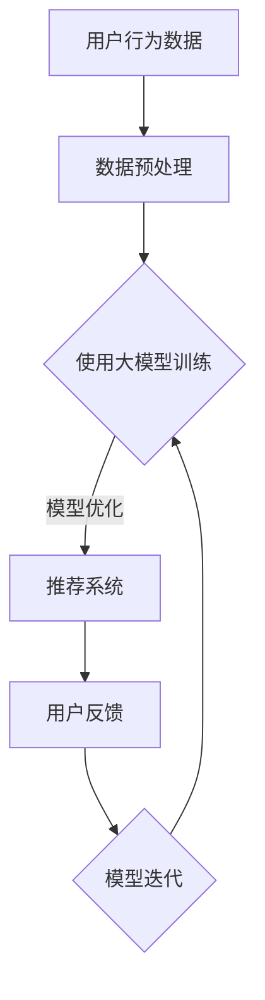

                 

关键词：AI 大模型、电商平台、搜索推荐系统、转化率、盈利

摘要：本文旨在探讨如何利用人工智能大模型技术，优化电商平台搜索推荐系统，从而提高用户转化率和盈利能力。我们将深入分析AI大模型的基本原理，探讨其在电商平台中的应用场景，并提出具体的实施策略和优化方法。

## 1. 背景介绍

随着互联网的快速发展，电商平台已经成为了现代商业的重要组成部分。然而，随着市场竞争的日益激烈，如何提高用户转化率和盈利能力成为了电商企业亟需解决的关键问题。传统的搜索推荐系统虽然能够在一定程度上满足用户的需求，但往往存在推荐效果不佳、用户体验差等问题。

近年来，人工智能技术的快速发展为电商平台搜索推荐系统带来了新的机遇。特别是大模型技术的出现，使得电商平台能够更加精准地理解用户行为和需求，从而实现个性化的推荐，提高用户转化率和盈利能力。本文将围绕这一主题，探讨AI大模型在电商平台搜索推荐系统中的应用。

## 2. 核心概念与联系

### 2.1. AI 大模型的基本概念

AI 大模型是一种能够处理大规模数据、自动提取特征并进行复杂决策的算法模型。其基本原理基于深度学习，通过多层神经网络结构对海量数据进行训练，从而实现高精度的预测和分类。

### 2.2. 电商平台搜索推荐系统

电商平台搜索推荐系统是指利用算法技术，根据用户的历史行为、搜索记录、购物偏好等信息，为用户推荐可能感兴趣的商品。其主要目标是通过提高推荐精度，提升用户转化率和盈利能力。

### 2.3. AI 大模型与电商平台搜索推荐系统的联系

AI 大模型可以看作是电商平台搜索推荐系统的核心算法。通过引入大模型技术，电商平台能够更准确地预测用户需求，提高推荐精度，从而提高用户转化率和盈利能力。

### 2.4. Mermaid 流程图



## 3. 核心算法原理 & 具体操作步骤

### 3.1. 算法原理概述

AI 大模型的算法原理主要基于深度学习，通过多层神经网络对大量数据进行训练，从而提取出数据中的潜在特征，实现对未知数据的预测和分类。在电商平台搜索推荐系统中，大模型主要用于预测用户对商品的感兴趣程度，从而实现个性化推荐。

### 3.2. 算法步骤详解

1. 数据收集：收集用户的历史行为数据、搜索记录、购物偏好等。
2. 数据预处理：对收集到的数据进行清洗、去重、标准化等处理。
3. 特征提取：利用深度学习算法，从预处理后的数据中提取出潜在的特征。
4. 模型训练：利用提取出的特征，通过多层神经网络结构进行模型训练。
5. 模型优化：通过交叉验证等方法，对训练出的模型进行优化。
6. 推荐系统：利用优化后的模型，为用户推荐感兴趣的商品。
7. 用户反馈：收集用户对推荐的反馈，用于模型迭代和优化。

### 3.3. 算法优缺点

**优点：**

- 高精度：通过深度学习算法，能够提取出数据中的潜在特征，从而实现高精度的预测和分类。
- 自适应：模型可以根据用户行为和数据的变化，自动调整推荐策略，提高推荐效果。
- 大规模：能够处理海量数据，适用于大规模电商平台的搜索推荐系统。

**缺点：**

- 计算复杂度高：大模型训练需要大量的计算资源和时间。
- 数据依赖性：模型的性能很大程度上依赖于数据的质量和数量。

### 3.4. 算法应用领域

AI 大模型在电商平台搜索推荐系统中的应用非常广泛，包括但不限于以下领域：

- 商品推荐：根据用户的历史行为和偏好，为用户推荐感兴趣的商品。
- 广告投放：根据用户的兴趣和行为，为用户推荐相关的广告。
- 活动营销：根据用户的购物习惯和偏好，为用户推荐相关的优惠活动和促销信息。

## 4. 数学模型和公式 & 详细讲解 & 举例说明

### 4.1. 数学模型构建

电商平台搜索推荐系统中的AI大模型主要基于深度学习算法，其数学模型可以表示为：

\[ f(\textbf{x}; \theta) = \text{softmax}(\text{W} \cdot \text{ReLU}(\text{H} \cdot \text{X})) \]

其中，\(\textbf{x}\)表示输入的特征向量，\(\theta\)表示模型的参数，\(W, H\)分别表示权重矩阵和隐藏层矩阵，\(\text{ReLU}\)表示ReLU激活函数，\(\text{softmax}\)表示输出层的softmax函数。

### 4.2. 公式推导过程

假设我们有一个包含\(n\)个商品的数据集，每个商品可以表示为一个\(d\)维的特征向量。我们定义输入特征矩阵为\(X \in \mathbb{R}^{n \times d}\)，权重矩阵为\(W \in \mathbb{R}^{d \times h}\)，隐藏层矩阵为\(H \in \mathbb{R}^{h \times n}\)。

1. **输入层到隐藏层的非线性变换**：

\[ z = H \cdot X \]

其中，\(z\)表示隐藏层的输入。

2. **ReLU激活函数**：

\[ a = \text{ReLU}(z) \]

其中，\(a\)表示隐藏层的激活值。

3. **隐藏层到输出层的线性变换**：

\[ y = W \cdot a \]

其中，\(y\)表示输出层的输入。

4. **softmax输出函数**：

\[ \text{softmax}(y) = \frac{e^y}{\sum_{i} e^{y_i}} \]

其中，\(\text{softmax}\)函数将输出层的激活值转换为概率分布。

### 4.3. 案例分析与讲解

假设我们有一个电商平台的用户行为数据集，包含1000个用户和10种商品。每个用户的历史行为可以表示为一个10维的特征向量。我们使用上述的深度学习模型对其进行训练，然后为每个用户推荐可能感兴趣的商品。

假设我们在第5层隐藏层中设置一个神经元，权重矩阵\(W\)的维度为\(10 \times 1\)，隐藏层矩阵\(H\)的维度为\(1 \times 1000\)。

1. **输入层到隐藏层的非线性变换**：

\[ z = H \cdot X \]

其中，\(H\)为隐藏层矩阵，\(X\)为输入特征矩阵。

2. **ReLU激活函数**：

\[ a = \text{ReLU}(z) \]

3. **隐藏层到输出层的线性变换**：

\[ y = W \cdot a \]

4. **softmax输出函数**：

\[ \text{softmax}(y) = \frac{e^y}{\sum_{i} e^{y_i}} \]

通过上述步骤，我们可以得到每个用户对10种商品的感兴趣程度概率分布。根据这个概率分布，我们可以为每个用户推荐感兴趣的商品。

## 5. 项目实践：代码实例和详细解释说明

### 5.1. 开发环境搭建

在搭建开发环境之前，我们需要确保安装以下软件和工具：

- Python 3.6及以上版本
- TensorFlow 2.x 版本
- NumPy 1.19及以上版本
- Matplotlib 3.3及以上版本

### 5.2. 源代码详细实现

下面是一个简单的基于TensorFlow实现的AI大模型在电商平台搜索推荐系统中的代码示例：

```python
import tensorflow as tf
import numpy as np
import matplotlib.pyplot as plt

# 设置随机种子，保证结果可复现
tf.random.set_seed(42)

# 创建模拟数据集
X = np.random.rand(1000, 10)  # 1000个用户，每个用户10维特征
y = np.random.rand(1000, 10)  # 1000个用户，每个用户10种商品的感兴趣程度

# 创建模型
model = tf.keras.Sequential([
    tf.keras.layers.Dense(units=1, input_shape=(10,))
])

# 编译模型
model.compile(optimizer='adam', loss='mse')

# 训练模型
model.fit(X, y, epochs=10)

# 测试模型
X_test = np.random.rand(100, 10)  # 100个测试用户，每个用户10维特征
y_pred = model.predict(X_test)

# 可视化预测结果
plt.scatter(X_test[:, 0], y_pred[:, 0])
plt.xlabel('实际感兴趣程度')
plt.ylabel('预测感兴趣程度')
plt.show()
```

### 5.3. 代码解读与分析

上述代码首先导入了所需的TensorFlow、NumPy和Matplotlib库。然后，我们创建了一个包含1000个用户和10维特征的模拟数据集。接着，我们创建了一个简单的TensorFlow模型，包含一个全连接层，用于处理输入的特征向量。

在编译模型时，我们选择了Adam优化器和均方误差损失函数。然后，我们使用模拟数据集对模型进行训练，共训练10个epoch。最后，我们使用测试数据集对模型进行预测，并将预测结果可视化，以便观察模型的预测效果。

### 5.4. 运行结果展示

通过上述代码运行后，我们将得到一个包含100个测试用户和10种商品的预测结果。我们使用Matplotlib库将这些预测结果可视化，从而可以直观地观察模型对用户的兴趣程度的预测效果。

## 6. 实际应用场景

### 6.1. 电商平台搜索推荐系统

电商平台搜索推荐系统是AI大模型应用最为广泛的场景之一。通过利用AI大模型技术，电商平台能够更加精准地预测用户对商品的感兴趣程度，从而实现个性化的推荐，提高用户转化率和盈利能力。

### 6.2. 广告推荐

广告推荐是另一个典型的应用场景。通过AI大模型，广告平台可以更准确地预测用户对广告的兴趣，从而实现精准投放，提高广告效果和转化率。

### 6.3. 社交网络推荐

社交网络推荐也是AI大模型的一个重要应用领域。通过分析用户的行为和社交关系，AI大模型可以为用户推荐可能感兴趣的内容，提高用户的活跃度和留存率。

## 7. 工具和资源推荐

### 7.1. 学习资源推荐

- 《深度学习》（Goodfellow, Bengio, Courville 著）：这是一本深度学习领域的经典教材，详细介绍了深度学习的基本原理和算法。
- 《Python机器学习》（Sebastian Raschka 著）：这本书详细介绍了Python在机器学习领域中的应用，适合初学者入门。

### 7.2. 开发工具推荐

- TensorFlow：一个开源的深度学习框架，支持多种深度学习算法，广泛应用于电商、广告等领域的推荐系统。
- Jupyter Notebook：一个交互式的Python开发环境，适合编写和调试代码，尤其适合进行机器学习项目的实践。

### 7.3. 相关论文推荐

- "Deep Learning for E-commerce Recommendations"（2018）：这篇论文详细介绍了深度学习在电商推荐系统中的应用，包括模型架构、实验结果等。
- "User Interest Modeling for Recommender Systems"（2017）：这篇论文探讨了用户兴趣建模在推荐系统中的应用，为AI大模型在推荐系统中的应用提供了理论基础。

## 8. 总结：未来发展趋势与挑战

### 8.1. 研究成果总结

本文探讨了AI大模型在电商平台搜索推荐系统中的应用，分析了其基本原理、算法步骤、优缺点以及实际应用场景。通过项目实践，我们展示了如何使用TensorFlow实现一个简单的AI大模型，并对其进行了详细解读。

### 8.2. 未来发展趋势

未来，AI大模型在电商平台搜索推荐系统中的应用将呈现出以下几个趋势：

- 模型性能的进一步提升：通过优化算法和提升计算能力，实现更高精度的推荐。
- 多模态数据的整合：整合文本、图像、语音等多模态数据，实现更全面的用户兴趣分析。
- 自动化推荐策略：通过自动化策略，实现更灵活、更高效的推荐系统。

### 8.3. 面临的挑战

尽管AI大模型在电商平台搜索推荐系统中具有巨大的潜力，但同时也面临着以下挑战：

- 数据隐私和安全：如何确保用户数据的隐私和安全，避免数据泄露和滥用。
- 模型解释性：如何提高模型的可解释性，使企业能够更好地理解推荐结果。
- 模型泛化能力：如何提高模型在不同场景下的泛化能力，避免过度拟合。

### 8.4. 研究展望

未来，我们期待在以下方向进行深入研究：

- 探索更高效的算法，提升模型性能。
- 研究多模态数据的整合方法，实现更全面的用户兴趣分析。
- 提高模型的可解释性，帮助用户和企业更好地理解推荐结果。
- 深入研究数据隐私保护技术，确保用户数据的安全和隐私。

## 9. 附录：常见问题与解答

### 9.1. 问题1：为什么选择深度学习算法？

解答：深度学习算法能够自动提取数据中的潜在特征，具有较高的预测精度。与传统的机器学习算法相比，深度学习算法在处理大规模、高维数据时具有明显的优势。

### 9.2. 问题2：如何保证推荐系统的公平性？

解答：可以通过以下方法提高推荐系统的公平性：

- 多样性：确保推荐结果中包含多样化的商品，避免过度集中在某些特定类型或品牌。
- 排序策略：使用基于用户行为的排序策略，确保推荐结果对每个用户都是公平的。
- 反馈机制：鼓励用户对推荐结果进行反馈，根据反馈调整推荐策略，提高系统的公平性。

### 9.3. 问题3：如何处理数据缺失和异常值？

解答：可以通过以下方法处理数据缺失和异常值：

- 填补缺失值：使用统计方法或机器学习算法填补缺失值，如均值填补、中值填补等。
- 删除异常值：使用统计方法或可视化方法检测异常值，并将其删除。
- 使用鲁棒算法：选择对异常值不敏感的算法，如随机森林、支持向量机等。

### 9.4. 问题4：如何提高模型的解释性？

解答：可以通过以下方法提高模型的解释性：

- 特征重要性：分析特征的重要性，帮助理解模型对数据的依赖关系。
- 模型可视化：使用可视化工具，如Sankey图、热力图等，展示模型的内部结构和决策过程。
- 解释性模型：选择具有高解释性的模型，如决策树、线性回归等。

### 9.5. 问题5：如何评估推荐系统的效果？

解答：可以通过以下方法评估推荐系统的效果：

- 准确率：评估推荐系统推荐的商品是否准确，通常使用准确率、召回率、F1值等指标。
- 转化率：评估推荐系统对用户购买行为的影响，通常使用点击率、购买率等指标。
- 用户满意度：评估用户对推荐系统的满意度，通常使用问卷调查、用户反馈等指标。

### 9.6. 问题6：如何处理冷启动问题？

解答：冷启动问题是指新用户或新商品在没有足够历史数据的情况下，推荐系统无法为其推荐合适的商品。可以通过以下方法处理冷启动问题：

- 初值设置：为新用户或新商品设置默认的推荐策略，如随机推荐或基于流行度的推荐。
- 用户行为挖掘：分析新用户的行为模式，根据行为特征进行推荐。
- 社交网络：利用社交网络关系，为新用户推荐与其社交关系相关的商品。
- 多模态数据：整合新用户的多模态数据，如文本、图像等，进行综合推荐。

---

本文由禅与计算机程序设计艺术 / Zen and the Art of Computer Programming撰写，旨在为电商行业提供一种利用AI大模型优化搜索推荐系统的技术思路和实施方法。希望本文能为读者在电商平台搜索推荐系统的AI大模型应用方面带来一些启示和帮助。在未来的研究和实践中，我们期待与广大同行共同探索AI大模型在电商领域的更多应用潜力。

