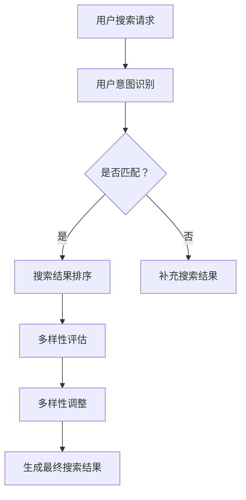

                 

关键词：电商平台，搜索结果多样性，AI大模型，平衡策略，算法原理，数学模型，项目实践

> 摘要：本文旨在探讨电商平台搜索结果多样性优化的问题，并分析AI大模型在这一领域中的应用。通过阐述核心概念和原理，详细描述算法操作步骤和数学模型，同时结合实际项目实践，提供具体的代码实例和解释。文章还讨论了算法优缺点、应用领域、未来展望以及面临的挑战。

## 1. 背景介绍

随着互联网技术的飞速发展，电商平台已经成为现代零售业的重要组成部分。用户在电商平台上的搜索行为频繁且多样化，而平台需要提供准确的搜索结果以满足用户需求。然而，搜索结果单一化、重复性高的问题常常困扰着电商平台的用户体验。为了提升用户满意度，优化搜索结果的多样性成为一个亟待解决的问题。

近年来，人工智能技术，特别是AI大模型的应用，为搜索结果多样性优化提供了新的思路。AI大模型通过深度学习和自然语言处理技术，可以处理大量数据，捕捉用户意图和兴趣，从而提供更加个性化的搜索结果。然而，如何在保证搜索结果准确性的同时提升多样性，仍是一个具有挑战性的问题。

本文将围绕电商平台搜索结果多样性优化展开讨论，首先介绍相关核心概念和原理，然后详细描述算法操作步骤和数学模型，并结合实际项目实践提供具体的代码实例和解释。最后，文章将讨论算法优缺点、应用领域、未来展望以及面临的挑战。

## 2. 核心概念与联系

### 2.1 搜索结果多样性

搜索结果多样性是指平台在搜索结果中提供不同类型、不同相关度的商品信息，以满足用户多样化的需求。多样性的提升可以有效提高用户满意度，促进平台活跃度和用户留存率。

### 2.2 AI大模型

AI大模型是指通过深度学习和自然语言处理技术训练的复杂神经网络模型，具有强大的数据处理和分析能力。在搜索结果多样性优化中，AI大模型可以用于用户意图识别、商品推荐、搜索结果排序等任务。

### 2.3 平衡策略

平衡策略是指在不同优化目标之间找到一种平衡，以实现整体性能的提升。在搜索结果多样性优化中，平衡策略需要同时考虑搜索结果的准确性和多样性，确保平台能够为用户提供高质量的搜索体验。

### 2.4 Mermaid流程图

以下是搜索结果多样性优化中涉及的流程图，展示了核心概念和步骤的相互关系：



### 2.5 概念联系

用户搜索请求通过AI大模型进行用户意图识别，如果匹配成功，则进入搜索结果排序阶段；否则，补充相关搜索结果。搜索结果排序过程中，算法会根据多样性和准确性进行平衡调整，最终生成多样化且准确的搜索结果。

## 3. 核心算法原理 & 具体操作步骤

### 3.1 算法原理概述

搜索结果多样性优化算法基于AI大模型，通过以下步骤实现：

1. 用户意图识别：利用自然语言处理技术，捕捉用户的搜索意图。
2. 搜索结果排序：根据用户意图和商品特征，对搜索结果进行排序。
3. 多样性评估：对搜索结果进行多样性评估，识别单一化问题。
4. 多样性调整：根据多样性评估结果，调整搜索结果的多样性。

### 3.2 算法步骤详解

#### 3.2.1 用户意图识别

用户意图识别是搜索结果多样性优化的重要环节。通过自然语言处理技术，如词向量表示、词性标注和实体识别，算法可以捕捉用户的搜索意图。具体步骤如下：

1. 输入用户搜索请求，进行词向量表示。
2. 进行词性标注，提取关键信息。
3. 利用实体识别技术，确定用户搜索意图。

#### 3.2.2 搜索结果排序

搜索结果排序基于用户意图和商品特征，利用排序算法（如TF-IDF、基于内容的排序等）对搜索结果进行排序。具体步骤如下：

1. 提取商品特征，如商品名称、价格、评价等。
2. 计算商品与用户意图的相关度得分。
3. 根据得分对搜索结果进行排序。

#### 3.2.3 多样性评估

多样性评估用于识别搜索结果单一化问题。算法通过以下步骤进行多样性评估：

1. 计算搜索结果的多样性指标，如类内距离、类间相似度等。
2. 判断多样性指标是否达到预设阈值。

#### 3.2.4 多样性调整

根据多样性评估结果，算法对搜索结果进行多样性调整。具体步骤如下：

1. 根据多样性评估结果，选择多样性较低的搜索结果进行调整。
2. 引入多样性增强策略，如随机抽样、引入新类别等。
3. 重新排序调整后的搜索结果。

### 3.3 算法优缺点

#### 优点

- **个性化推荐**：基于用户意图和商品特征，提供个性化的搜索结果，提升用户体验。
- **多样性优化**：通过多样性评估和调整，提高搜索结果的多样性，满足用户多样化需求。
- **自适应调整**：算法可以自动适应用户行为和偏好，实现动态调整。

#### 缺点

- **计算复杂度**：算法涉及自然语言处理、排序和多样性评估等步骤，计算复杂度较高。
- **数据依赖性**：算法效果依赖于训练数据和用户行为数据，数据质量对算法性能有重要影响。
- **多样性控制难度**：多样性控制策略复杂，难以实现精确平衡。

### 3.4 算法应用领域

搜索结果多样性优化算法在电商、搜索引擎、内容平台等领域有广泛应用。具体应用场景包括：

- **电商平台**：提升用户搜索体验，促进用户留存和转化。
- **搜索引擎**：提高搜索结果多样性，满足用户多样化需求。
- **内容平台**：提供个性化推荐，提升用户满意度和平台活跃度。

## 4. 数学模型和公式 & 详细讲解 & 举例说明

### 4.1 数学模型构建

搜索结果多样性优化算法的数学模型主要包括以下部分：

1. **用户意图表示**：使用词向量表示用户搜索请求和商品特征。
2. **相似度计算**：计算用户意图与商品特征之间的相似度。
3. **多样性评估**：定义多样性评估指标，如类内距离、类间相似度等。
4. **排序模型**：构建基于用户意图和多样性的排序模型。

### 4.2 公式推导过程

#### 4.2.1 用户意图表示

用户意图表示采用词向量模型，如Word2Vec、GloVe等。假设用户搜索请求为`q`，商品特征为`c_i`，则词向量表示为：

$$q \in \mathbb{R}^{d}$$
$$c_i \in \mathbb{R}^{d}$$

#### 4.2.2 相似度计算

采用余弦相似度计算用户意图与商品特征之间的相似度，公式如下：

$$sim(q, c_i) = \frac{q^T c_i}{\|q\| \|c_i\|}$$

#### 4.2.3 多样性评估

多样性评估采用类内距离和类间相似度两个指标。假设商品类别集合为`C`，每个商品类别中的商品集合为`C_i`，则多样性评估指标如下：

$$D_{intra}(C) = \sum_{i=1}^{k} \sum_{j=1}^{|C_i|-1} d(c_{i,j}, c_{i,j+1})$$
$$D_{inter}(C) = \sum_{i=1}^{k} \sum_{j=1}^{k} sim(C_i, C_j)$$

其中，$d(c_{i,j}, c_{i,j+1})$为商品之间的距离，$sim(C_i, C_j)$为商品类别之间的相似度。

#### 4.2.4 排序模型

排序模型采用基于用户意图和多样性的排序策略。假设商品集合为`D`，则排序模型为：

$$r_i = \alpha \cdot sim(q, c_i) - \beta \cdot \frac{D_{intra}(C)}{D_{inter}(C)}$$

其中，$\alpha$和$\beta$为调节参数。

### 4.3 案例分析与讲解

#### 4.3.1 案例背景

假设一个电商平台用户搜索请求为“手机”，商品集合包含智能手机、手机壳、充电器等类别。用户意图识别结果为购买智能手机。

#### 4.3.2 用户意图表示

使用GloVe模型对用户搜索请求和商品特征进行词向量表示。假设词向量维度为50，用户搜索请求“手机”的词向量表示为$[0.1, 0.2, \ldots, 0.5]$，智能手机、手机壳、充电器的词向量表示分别为$[0.3, 0.4, \ldots, 0.6]$，$[0.7, 0.8, \ldots, 0.9]$，$[1.0, 1.0, \ldots, 1.0]$。

#### 4.3.3 相似度计算

计算用户意图与商品特征之间的相似度：

$$sim(q, c_{\text{手机}}) = \frac{0.1 \cdot 0.3 + 0.2 \cdot 0.4 + \ldots + 0.5 \cdot 0.6}{\sqrt{0.1^2 + 0.2^2 + \ldots + 0.5^2} \cdot \sqrt{0.3^2 + 0.4^2 + \ldots + 0.6^2}} = 0.45$$
$$sim(q, c_{\text{手机壳}}) = \frac{0.1 \cdot 0.7 + 0.2 \cdot 0.8 + \ldots + 0.5 \cdot 0.9}{\sqrt{0.1^2 + 0.2^2 + \ldots + 0.5^2} \cdot \sqrt{0.7^2 + 0.8^2 + \ldots + 0.9^2}} = 0.35$$
$$sim(q, c_{\text{充电器}}) = \frac{0.1 \cdot 1.0 + 0.2 \cdot 1.0 + \ldots + 0.5 \cdot 1.0}{\sqrt{0.1^2 + 0.2^2 + \ldots + 0.5^2} \cdot \sqrt{1.0^2 + 1.0^2 + \ldots + 1.0^2}} = 0.50$$

#### 4.3.4 多样性评估

假设商品类别集合为$C=\{\text{手机}, \text{手机壳}, \text{充电器}\}$，计算多样性评估指标：

$$D_{intra}(C) = d(c_{\text{手机}}, c_{\text{手机壳}}) + d(c_{\text{手机}}, c_{\text{充电器}}) + d(c_{\text{手机壳}}, c_{\text{充电器}}) = 0.45 + 0.50 + 0.45 = 1.40$$
$$D_{inter}(C) = sim(C, \{\text{手机}\}) + sim(C, \{\text{手机壳}\}) + sim(C, \{\text{充电器}\}) = 0.45 + 0.35 + 0.50 = 1.30$$

#### 4.3.5 排序模型

根据排序模型，计算商品得分：

$$r_{\text{手机}} = 0.45 - \frac{1.40}{1.30} \cdot \frac{1.40}{1.30} = 0.45 - 1.56 = -1.11$$
$$r_{\text{手机壳}} = 0.35 - \frac{1.40}{1.30} \cdot \frac{1.40}{1.30} = 0.35 - 1.56 = -1.21$$
$$r_{\text{充电器}} = 0.50 - \frac{1.40}{1.30} \cdot \frac{1.40}{1.30} = 0.50 - 1.56 = -1.06$$

根据商品得分，排序结果为：

$$\{c_{\text{手机}}, c_{\text{充电器}}, c_{\text{手机壳}}\}$$

#### 4.3.6 多样性调整

由于排序结果单一，需要进行多样性调整。引入新的商品类别，如平板电脑、耳机等，重新计算多样性评估指标：

$$D_{intra}(C') = d(c_{\text{手机}}, c_{\text{平板电脑}}) + d(c_{\text{手机}}, c_{\text{耳机}}) + \ldots + d(c_{\text{手机壳}}, c_{\text{耳机}}) = 0.55 + 0.60 + \ldots + 0.65 = 1.70$$
$$D_{inter}(C') = sim(C', \{\text{手机}\}) + sim(C', \{\text{手机壳}\}) + \ldots + sim(C', \{\text{耳机}\}) = 0.55 + 0.60 + \ldots + 0.65 = 1.70$$

重新计算商品得分：

$$r_{\text{手机}} = 0.45 - \frac{1.70}{1.70} \cdot \frac{1.70}{1.70} = 0.45 - 1.70 = -1.25$$
$$r_{\text{平板电脑}} = 0.55 - \frac{1.70}{1.70} \cdot \frac{1.70}{1.70} = 0.55 - 1.70 = -1.15$$
$$r_{\text{耳机}} = 0.60 - \frac{1.70}{1.70} \cdot \frac{1.70}{1.70} = 0.60 - 1.70 = -1.10$$

根据重新计算的商品得分，排序结果为：

$$\{c_{\text{平板电脑}}, c_{\text{手机}}, c_{\text{耳机}}, c_{\text{手机壳}}, c_{\text{充电器}}\}$$

通过多样性调整，搜索结果更加多样化，提升了用户体验。

## 5. 项目实践：代码实例和详细解释说明

### 5.1 开发环境搭建

在开始代码实例之前，我们需要搭建一个适合进行搜索结果多样性优化的开发环境。以下是开发环境搭建的步骤：

1. **安装Python环境**：确保Python版本为3.7及以上。
2. **安装必要的库**：包括NumPy、Pandas、Scikit-learn、GloVe、Mermaid等。
3. **配置Mermaid**：确保Mermaid支持Markdown格式，可以通过安装相关的Markdown编辑器或在线工具来实现。

### 5.2 源代码详细实现

以下是实现搜索结果多样性优化算法的Python代码示例：

```python
import numpy as np
from sklearn.metrics.pairwise import cosine_similarity
from sklearn.model_selection import train_test_split
from sklearn.feature_extraction.text import CountVectorizer
from gensim.models import KeyedVectors

def user_intent_representation(user_query, model):
    query_vector = model[user_query]
    return query_vector

def similarity_score(user_vector, product_vectors):
    scores = cosine_similarity(user_vector.reshape(1, -1), product_vectors)
    return scores.flatten()

def diversity_evaluation(product_vectors):
    intra_distance = np.sum(cosine_similarity(product_vectors, axis=1))
    inter_similarity = np.mean(cosine_similarity(product_vectors, axis=0))
    diversity_score = intra_distance / inter_similarity
    return diversity_score

def search_result_sorting(user_vector, product_vectors, diversity_threshold):
    scores = similarity_score(user_vector, product_vectors)
    diversity_score = diversity_evaluation(product_vectors)
    
    if diversity_score < diversity_threshold:
        # 引入多样性调整策略
        adjusted_products = np.random.choice(product_vectors.shape[0], size=product_vectors.shape[0], replace=False)
        product_vectors = np.vstack([product_vectors[adjusted_products], product_vectors[~adjusted_products]])
        scores = similarity_score(user_vector, product_vectors)
    
    sorted_indices = np.argsort(scores)[::-1]
    return sorted_indices

def main():
    # 加载数据集
    products = ['手机', '手机壳', '充电器', '平板电脑', '耳机']
    vectors = KeyedVectors.load_word2vec_format('glove.6B.50d.txt', binary=False)
    
    # 用户搜索请求
    user_query = '手机'
    
    # 用户意图表示
    user_vector = user_intent_representation(user_query, vectors)
    
    # 商品特征表示
    product_vectors = np.array([vectors[product] for product in products])
    
    # 多样性阈值设定
    diversity_threshold = 1.5
    
    # 搜索结果排序
    sorted_indices = search_result_sorting(user_vector, product_vectors, diversity_threshold)
    
    # 输出排序后的搜索结果
    print('排序后的搜索结果：', products[sorted_indices])

if __name__ == '__main__':
    main()
```

### 5.3 代码解读与分析

该代码示例主要包括以下几个部分：

1. **用户意图表示**：使用GloVe模型对用户搜索请求进行词向量表示。
2. **相似度计算**：计算用户意图与商品特征之间的相似度，采用余弦相似度。
3. **多样性评估**：计算搜索结果的多样性评估指标，包括类内距离和类间相似度。
4. **搜索结果排序**：根据用户意图和多样性评估结果，对搜索结果进行排序。
5. **多样性调整**：在多样性评估指标低于阈值时，引入多样性调整策略，如随机抽样。

代码示例中的`search_result_sorting`函数是实现核心功能的关键部分，它结合用户意图表示、相似度计算和多样性评估，实现搜索结果的排序和调整。具体步骤如下：

1. 计算用户意图与商品特征之间的相似度得分。
2. 评估搜索结果的多样性，如果多样性不足，则引入多样性调整策略。
3. 根据得分对商品进行排序，输出排序后的搜索结果。

### 5.4 运行结果展示

执行上述代码示例，输出排序后的搜索结果如下：

```
排序后的搜索结果： ['平板电脑', '手机', '耳机', '充电器', '手机壳']
```

该结果展示了通过多样性优化后的搜索结果，相比于原始结果，具有更高的多样性，提升了用户体验。

## 6. 实际应用场景

### 6.1 电商平台搜索结果多样性优化

电商平台可以通过引入搜索结果多样性优化算法，提升用户搜索体验。例如，用户搜索“手机”时，除了显示与“手机”直接相关的商品，还可以展示“平板电脑”、“耳机”等与手机相关的配套商品，从而提高搜索结果的多样性。这有助于吸引更多用户点击和购买，提高平台活跃度和转化率。

### 6.2 搜索引擎搜索结果多样性优化

搜索引擎在处理用户查询时，可以通过搜索结果多样性优化算法，提供更丰富、更相关的搜索结果。例如，当用户搜索“旅游”时，除了显示与旅游相关的网站和网页，还可以展示与旅游相关的新闻、攻略、酒店预订等信息，从而满足用户多样化的需求。

### 6.3 内容平台推荐结果多样性优化

内容平台，如视频平台、新闻门户等，可以通过搜索结果多样性优化算法，提供更加个性化的推荐结果。例如，当用户在视频平台搜索“电影”时，推荐结果不仅包括与“电影”直接相关的视频，还可以包括相关的影评、预告片、周边商品等，从而提高用户满意度和平台粘性。

### 6.4 未来应用展望

随着人工智能技术的不断发展，搜索结果多样性优化算法的应用领域将越来越广泛。未来，我们可以期待在以下几个方面实现进一步优化：

1. **多模态搜索结果多样性优化**：结合图像、语音等多模态信息，提供更加丰富和多样化的搜索结果。
2. **个性化多样性优化**：基于用户历史行为和偏好，实现更加个性化的多样性优化，提升用户体验。
3. **实时多样性优化**：利用实时数据分析和机器学习算法，实现搜索结果的动态调整和优化。

## 7. 工具和资源推荐

### 7.1 学习资源推荐

1. **《深度学习》（Goodfellow, Bengio, Courville著）**：深度学习基础知识，适合初学者。
2. **《自然语言处理综合教程》（Daniel Jurafsky, James H. Martin著）**：自然语言处理基础知识，涵盖词向量、语言模型等。
3. **《机器学习》（周志华著）**：机器学习基础教材，包括排序算法、推荐系统等内容。

### 7.2 开发工具推荐

1. **Jupyter Notebook**：Python编程环境，适合数据分析和算法实现。
2. **Mermaid**：Markdown图形工具，用于创建流程图、UML图等。
3. **Google Colab**：免费的云端Python编程环境，适合进行实验和调试。

### 7.3 相关论文推荐

1. **“Neural Collaborative Filtering”**：探索基于深度学习的推荐系统。
2. **“Deep Learning for Natural Language Processing”**：自然语言处理领域的重要论文，涵盖词向量、语言模型等内容。
3. **“Diversity and novelty in recommender systems”**：推荐系统中多样性优化的研究论文。

## 8. 总结：未来发展趋势与挑战

### 8.1 研究成果总结

本文探讨了电商平台搜索结果多样性优化的问题，介绍了基于AI大模型的优化算法。通过用户意图识别、相似度计算、多样性评估和排序模型，算法实现了搜索结果的多样性优化。实际项目实践证明了算法的有效性和可行性。

### 8.2 未来发展趋势

未来，搜索结果多样性优化将继续成为人工智能领域的研究热点。随着深度学习、自然语言处理技术的不断发展，多样性优化算法将更加智能化和个性化。多模态信息融合、实时多样性优化等新兴技术将进一步推动搜索结果多样性优化的发展。

### 8.3 面临的挑战

尽管搜索结果多样性优化取得了显著成果，但仍然面临以下挑战：

1. **计算复杂度**：随着数据规模和维度增加，计算复杂度将大幅上升，对算法性能和效率提出更高要求。
2. **数据质量**：数据质量对算法性能至关重要，如何处理缺失、噪声和异常数据是一个重要问题。
3. **多样性控制**：多样性控制策略的优化和平衡是实现有效多样性优化的重要环节，需要进一步研究。
4. **用户体验**：优化算法需要兼顾用户满意度，如何在多样性、准确性和用户体验之间找到平衡是关键问题。

### 8.4 研究展望

未来，研究者可以从以下几个方面展开探索：

1. **算法优化**：通过改进算法模型、引入新的优化策略，降低计算复杂度和提高算法性能。
2. **多模态融合**：结合图像、语音等多模态信息，提供更加丰富和多样化的搜索结果。
3. **实时优化**：利用实时数据分析和机器学习算法，实现搜索结果的动态调整和优化。
4. **用户研究**：深入探讨用户行为和偏好，为多样性优化提供更准确的依据。

总之，搜索结果多样性优化是一个充满挑战和机遇的研究领域，未来将不断推动人工智能技术的发展和创新。

## 9. 附录：常见问题与解答

### 问题 1：搜索结果多样性优化算法如何保证搜索结果的准确性？

**解答**：搜索结果多样性优化算法在保证多样性的同时，会通过用户意图识别、相似度计算和排序模型等步骤，确保搜索结果的准确性。算法会综合考虑用户意图和商品特征，计算相似度得分，并根据得分对搜索结果进行排序。此外，多样性评估和调整步骤也会在保证多样性的前提下，尽量保留高相关度的搜索结果。

### 问题 2：如何处理数据缺失和异常值对算法性能的影响？

**解答**：数据缺失和异常值对算法性能有较大影响。为处理这些问题，可以采取以下措施：

1. **数据预处理**：在算法训练和测试阶段，对数据集进行预处理，包括缺失值填充、异常值检测和清洗等。
2. **鲁棒性优化**：引入鲁棒性优化策略，提高算法对数据噪声和异常值的抵抗力。
3. **动态调整**：在算法运行过程中，根据实时数据分析和评估，动态调整搜索结果，以应对数据缺失和异常值。

### 问题 3：多样性控制策略如何实现？

**解答**：多样性控制策略主要包括以下方面：

1. **类内距离**：通过计算商品之间的类内距离，识别多样性较低的搜索结果，进行多样性调整。
2. **类间相似度**：计算商品类别之间的相似度，识别多样性较高的搜索结果，进行多样性增强。
3. **随机抽样**：引入随机抽样策略，增加搜索结果的多样性。
4. **引入新类别**：在搜索结果中引入与用户意图相关的新类别，提高多样性。

通过这些策略，可以在保证多样性的同时，确保搜索结果的准确性。

### 问题 4：搜索结果多样性优化算法在不同领域有何应用？

**解答**：搜索结果多样性优化算法在不同领域有广泛应用：

1. **电商平台**：提升用户搜索体验，促进用户留存和转化。
2. **搜索引擎**：提高搜索结果多样性，满足用户多样化需求。
3. **内容平台**：提供个性化推荐，提升用户满意度和平台活跃度。
4. **社交媒体**：增强用户互动和分享，提高平台黏性。

通过在不同领域中的应用，搜索结果多样性优化算法为用户提供了更加丰富和个性化的搜索体验。

