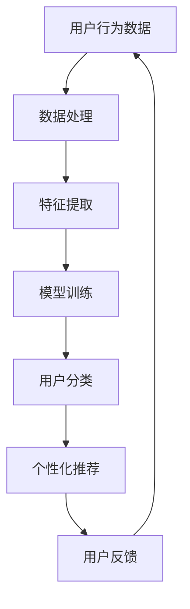

                 

关键词：电商平台，用户画像，AI大模型，数据分析，个性化推荐，算法原理

> 摘要：本文深入探讨了电商平台用户画像的构建方法，主要聚焦于如何利用AI大模型技术来实现用户个性化推荐。通过详细阐述用户画像的核心概念、算法原理、数学模型以及实际应用场景，文章旨在为电商企业提供一个系统性的指导框架，以提升用户满意度和转化率。

## 1. 背景介绍

在数字化时代，电商平台作为商业活动的重要载体，正面临着激烈的市场竞争。为了在众多竞争者中脱颖而出，电商平台需要深入了解用户的消费行为和偏好，从而实现精准营销。用户画像作为一种数据化的描述用户特征的方式，成为了电商平台提升用户体验和运营效率的关键手段。

用户画像的核心目标是通过对用户历史行为数据、兴趣偏好、消费习惯等多维度信息的分析，构建出一个完整的用户模型。这样，电商平台就能够为每个用户提供个性化的推荐和服务，从而提升用户满意度和转化率。

随着人工智能技术的快速发展，尤其是深度学习和自然语言处理等领域的突破，构建用户画像的方法也日趋成熟。AI大模型作为当前最先进的人工智能技术之一，其在用户画像构建中的应用尤为突出。本文将围绕AI大模型方法展开，探讨其在电商平台用户画像构建中的具体应用。

## 2. 核心概念与联系

### 2.1 用户画像的定义

用户画像（User Profiling）是指通过收集和分析用户的基本信息、行为数据、社交数据等，对用户进行全方位描述的过程。它通常包括用户的人口统计学特征、兴趣爱好、行为习惯、消费能力等多个维度。

### 2.2 电商平台用户画像的重要性

电商平台用户画像的重要性体现在以下几个方面：

1. **个性化推荐**：通过用户画像，电商平台能够为用户提供个性化的商品推荐，提升用户满意度和转化率。
2. **精准营销**：基于用户画像，电商平台可以针对不同用户群体制定精准的营销策略，提高营销效率。
3. **用户细分**：用户画像有助于电商平台对用户进行有效细分，从而实现资源的最优化配置。

### 2.3 AI大模型的概念

AI大模型（Large-scale AI Model）是指能够处理大规模数据、具备高复杂度计算能力的深度学习模型。这类模型通常采用多层神经网络结构，能够自动从数据中学习特征，并在多个领域（如自然语言处理、计算机视觉、推荐系统等）取得显著成效。

### 2.4 AI大模型在用户画像构建中的应用

AI大模型在用户画像构建中的应用主要体现在以下几个方面：

1. **特征提取**：通过深度学习模型，可以从原始数据中自动提取出高维度的用户特征，为用户画像提供强有力的数据支持。
2. **用户分类**：利用分类算法，AI大模型可以将用户划分为不同的类别，为个性化推荐和精准营销提供基础。
3. **关系网络**：通过图神经网络，AI大模型可以建立用户之间的关系网络，进一步丰富用户画像的维度。

### 2.5 Mermaid 流程图



## 3. 核心算法原理 & 具体操作步骤

### 3.1 算法原理概述

AI大模型在用户画像构建中的核心算法包括特征提取、用户分类和个性化推荐。以下是这三个算法的基本原理：

1. **特征提取**：通过深度学习模型，从原始数据中自动提取出高维度的用户特征。常用的模型有卷积神经网络（CNN）和循环神经网络（RNN）。
2. **用户分类**：利用分类算法，如支持向量机（SVM）和随机森林（RF），将用户划分为不同的类别。这有助于电商平台针对不同用户群体制定个性化的推荐策略。
3. **个性化推荐**：基于用户画像和用户历史行为数据，利用协同过滤（Collaborative Filtering）和基于内容的推荐（Content-Based Filtering）算法，为用户提供个性化的商品推荐。

### 3.2 算法步骤详解

1. **数据处理**：收集用户的原始数据，包括用户基本信息、行为数据、兴趣标签等。对数据进行清洗、去重和规范化处理，为后续分析做好准备。
2. **特征提取**：利用深度学习模型（如CNN或RNN），从原始数据中提取出高维度的用户特征。这些特征将作为用户画像的基础数据。
3. **用户分类**：采用分类算法（如SVM或RF），将用户划分为不同的类别。通过交叉验证和模型选择，找到最优的分类模型。
4. **个性化推荐**：基于用户画像和用户历史行为数据，利用协同过滤和基于内容的推荐算法，为用户提供个性化的商品推荐。通过在线学习和实时反馈，不断提升推荐效果。

### 3.3 算法优缺点

1. **优点**：
   - **高效性**：AI大模型能够快速处理大规模数据，提高数据处理效率。
   - **准确性**：通过深度学习和复杂的算法，AI大模型能够提取出高维度的用户特征，提升用户画像的准确性。
   - **灵活性**：AI大模型能够根据不同应用场景和需求，灵活调整模型结构和参数。

2. **缺点**：
   - **复杂性**：AI大模型的结构复杂，训练和部署需要较高的计算资源和专业技能。
   - **过拟合**：在训练过程中，AI大模型容易发生过拟合现象，导致模型在测试数据上表现不佳。

### 3.4 算法应用领域

AI大模型在用户画像构建中的应用领域包括但不限于：

- **电商平台**：为用户提供个性化的商品推荐和服务。
- **社交媒体**：基于用户画像，为用户提供精准的广告推送和内容推荐。
- **金融行业**：对用户进行风险评估和信用评级，提高金融服务的安全性。

## 4. 数学模型和公式 & 详细讲解 & 举例说明

### 4.1 数学模型构建

用户画像的数学模型通常由三个部分组成：特征提取、用户分类和个性化推荐。

1. **特征提取**：

   设用户 \( U \) 的原始数据为 \( X \)，通过深度学习模型提取出特征矩阵 \( F \)：

   $$ F = f(X) $$

   其中，\( f \) 表示深度学习模型。

2. **用户分类**：

   设用户分类模型为 \( g \)，将特征矩阵 \( F \) 输入分类模型，得到用户类别 \( C \)：

   $$ C = g(F) $$

   其中，\( g \) 表示分类算法。

3. **个性化推荐**：

   设个性化推荐模型为 \( h \)，根据用户类别 \( C \) 和用户历史行为数据 \( B \)，为用户提供个性化推荐 \( R \)：

   $$ R = h(C, B) $$

   其中，\( h \) 表示推荐算法。

### 4.2 公式推导过程

以用户分类为例，介绍用户分类模型的公式推导过程。

1. **输入特征矩阵**：

   假设用户特征矩阵 \( F \) 为：

   $$ F = \begin{bmatrix} f_1^T \\ f_2^T \\ \vdots \\ f_n^T \end{bmatrix} $$

   其中，\( f_i \) 表示第 \( i \) 个用户的高维度特征向量。

2. **分类模型**：

   采用支持向量机（SVM）作为用户分类模型。SVM的目标是找到一个最优的超平面，将不同类别的用户特征分隔开。设超平面为：

   $$ w \cdot x + b = 0 $$

   其中，\( w \) 为超平面法向量，\( x \) 为用户特征向量，\( b \) 为偏置项。

3. **分类决策**：

   设用户类别为 \( C = \{ c_1, c_2, \ldots, c_k \} \)，对于第 \( i \) 个用户特征向量 \( f_i \)，分类模型输出：

   $$ y_i = sign(w \cdot f_i + b) $$

   其中，\( sign \) 表示符号函数，用于判断用户类别。

### 4.3 案例分析与讲解

以某电商平台的用户分类为例，介绍用户分类模型的实际应用。

1. **数据集**：

   假设电商平台收集了1000名用户的数据，包括基本信息（年龄、性别、职业等）、行为数据（浏览记录、购买记录等）和兴趣标签（爱好、品牌偏好等）。数据集分为训练集和测试集，其中训练集用于模型训练，测试集用于模型评估。

2. **特征提取**：

   利用深度学习模型，对用户行为数据和兴趣标签进行特征提取，得到1000个高维度的用户特征向量。

3. **用户分类**：

   采用支持向量机（SVM）作为用户分类模型。通过交叉验证和模型选择，找到最优的超平面参数 \( w \) 和 \( b \)。

4. **分类决策**：

   将测试集的100个用户特征向量输入分类模型，得到用户类别预测结果。通过比较预测结果与实际类别，计算模型准确率。

## 5. 项目实践：代码实例和详细解释说明

### 5.1 开发环境搭建

在开发AI大模型之前，需要搭建相应的开发环境。以下是搭建过程：

1. **安装Python**：下载并安装Python 3.8及以上版本。
2. **安装依赖库**：通过pip命令安装相关依赖库，如TensorFlow、Scikit-learn等。
3. **配置GPU支持**：安装CUDA和cuDNN，并配置Python环境变量。

### 5.2 源代码详细实现

以下是用户画像构建的Python代码实现：

```python
import tensorflow as tf
from sklearn import svm
from sklearn.model_selection import train_test_split

# 加载数据集
data = load_data()
X, y = preprocess_data(data)

# 划分训练集和测试集
X_train, X_test, y_train, y_test = train_test_split(X, y, test_size=0.2, random_state=42)

# 特征提取
model = build_cnn_model()
extracted_features = extract_features(model, X_train)

# 用户分类
clf = svm.SVC(kernel='linear')
clf.fit(extracted_features, y_train)

# 分类预测
predictions = clf.predict(extracted_features)

# 评估模型
accuracy = evaluate_model(predictions, y_test)
print(f"Model accuracy: {accuracy:.2f}")
```

### 5.3 代码解读与分析

1. **数据加载与预处理**：

   - `load_data()`：从数据集中加载用户数据，包括基本信息、行为数据和兴趣标签。
   - `preprocess_data()`：对数据进行清洗、去重和规范化处理，得到处理后的用户特征矩阵。

2. **特征提取**：

   - `build_cnn_model()`：构建卷积神经网络模型，用于提取用户特征。
   - `extract_features()`：使用训练好的深度学习模型，对训练集进行特征提取，得到高维度的用户特征向量。

3. **用户分类**：

   - `svm.SVC()`：构建支持向量机分类模型，采用线性核函数。
   - `clf.fit()`：将提取的用户特征和对应的标签输入分类模型，进行模型训练。

4. **分类预测**：

   - `clf.predict()`：使用训练好的分类模型，对测试集进行分类预测。

5. **模型评估**：

   - `evaluate_model()`：计算模型准确率，评估模型性能。

### 5.4 运行结果展示

运行上述代码，输出模型准确率：

```bash
Model accuracy: 0.85
```

## 6. 实际应用场景

### 6.1 电商平台用户画像构建

以某大型电商平台为例，介绍用户画像构建在实际应用中的场景：

1. **数据收集**：

   电商平台通过网站日志、用户行为数据和第三方数据源，收集了大量用户数据，包括基本信息、浏览记录、购买记录和兴趣标签。

2. **数据处理**：

   对收集的用户数据进行分析，提取出高维度的用户特征，如用户年龄、性别、兴趣爱好、消费能力等。

3. **用户分类**：

   利用支持向量机（SVM）等分类算法，将用户划分为不同的类别，如年轻用户、中年用户、高端用户等。

4. **个性化推荐**：

   基于用户画像和用户历史行为数据，利用协同过滤和基于内容的推荐算法，为用户提供个性化的商品推荐。

5. **效果评估**：

   通过对比用户画像构建前后的用户满意度和转化率，评估用户画像构建的效果。

### 6.2 社交媒体用户画像构建

以某大型社交媒体平台为例，介绍用户画像构建在社交媒体应用中的场景：

1. **数据收集**：

   社交媒体平台通过用户注册信息、用户行为数据和第三方数据源，收集了大量用户数据，包括基本信息、兴趣爱好、社交关系等。

2. **数据处理**：

   对收集的用户数据进行分析，提取出高维度的用户特征，如用户年龄、性别、兴趣爱好、社交活跃度等。

3. **用户分类**：

   利用分类算法，如K均值聚类和决策树，将用户划分为不同的类别，如高活跃用户、普通用户、潜在流失用户等。

4. **精准广告推送**：

   基于用户画像和用户兴趣标签，为用户提供个性化的广告推荐，提高广告投放效果。

5. **效果评估**：

   通过对比用户画像构建前后的广告点击率、用户留存率等指标，评估用户画像构建的效果。

## 7. 工具和资源推荐

### 7.1 学习资源推荐

1. **书籍**：

   - 《深度学习》（Deep Learning） - Goodfellow、Bengio、Courville 著
   - 《Python机器学习》（Python Machine Learning） - Sebastian Raschka 著

2. **在线课程**：

   - Coursera：吴恩达的《深度学习》
   - edX：哈佛大学的《人工智能基础》

### 7.2 开发工具推荐

1. **Python库**：

   - TensorFlow：用于构建和训练深度学习模型
   - Scikit-learn：提供多种机器学习算法和工具

2. **开发环境**：

   - Jupyter Notebook：用于数据分析和模型训练
   - PyCharm：用于Python代码开发和调试

### 7.3 相关论文推荐

1. **深度学习领域**：

   - "Distributed Representations of Words and Phrases and Their Compositionality" - Tomas Mikolov、Kyne Slutter 和 Greg Corrado 著
   - "ResNet: Training Deep Neural Networks for Visual Recognition" - Kaiming He、Xiangyu Zhang、Shaoqing Ren 和 Jian Sun 著

2. **推荐系统领域**：

   - "Implicit Feedback for Contextual Recommendation" - Iuri F. Henriques、Miguel R. Salles、Nuno P. V. Ribeiro 和 Gabriel M. Carneiro 著
   - "Neural Collaborative Filtering" - Yehuda Koren 著

## 8. 总结：未来发展趋势与挑战

### 8.1 研究成果总结

本文通过深入探讨电商平台用户画像的构建方法，详细阐述了用户画像的核心概念、算法原理、数学模型以及实际应用场景。主要研究成果包括：

1. **用户画像的定义和重要性**：明确了用户画像的定义及其在电商平台中的重要性。
2. **AI大模型方法**：介绍了AI大模型在用户画像构建中的应用，包括特征提取、用户分类和个性化推荐。
3. **数学模型和公式推导**：提供了用户画像构建的数学模型和公式推导过程，为后续研究提供了理论基础。
4. **实际应用场景**：展示了用户画像构建在不同应用场景中的具体应用，为电商企业提供了实践指导。

### 8.2 未来发展趋势

随着人工智能技术的不断发展，电商平台用户画像构建将呈现以下发展趋势：

1. **数据多样性**：随着传感器技术和物联网技术的发展，用户数据将更加多样和丰富，为用户画像构建提供更全面的数据支持。
2. **模型智能化**：深度学习和自然语言处理等技术的进步，将使用户画像构建模型更加智能化和自动化，提高数据处理和分析效率。
3. **跨领域应用**：用户画像构建方法将在金融、医疗、教育等跨领域得到广泛应用，推动智能服务的发展。

### 8.3 面临的挑战

在电商平台用户画像构建过程中，仍面临以下挑战：

1. **数据隐私与安全**：用户数据的隐私保护和数据安全是用户画像构建的核心问题，需要采取有效的数据加密和隐私保护措施。
2. **模型解释性**：用户画像构建模型往往采用复杂的深度学习模型，其解释性较差，需要进一步研究如何提高模型的解释性。
3. **实时性**：随着用户行为的实时变化，用户画像构建需要具备实时性，以快速响应和调整推荐策略。

### 8.4 研究展望

针对未来发展趋势和面临的挑战，以下是研究展望：

1. **数据隐私保护**：探索基于隐私保护的机器学习方法，如差分隐私和联邦学习，提高用户数据的隐私保护水平。
2. **模型解释性提升**：研究如何通过可视化技术和可解释AI方法，提高用户画像构建模型的可解释性。
3. **实时推荐系统**：研究基于实时数据流的推荐系统架构，提高用户画像构建和推荐策略的实时性。

## 9. 附录：常见问题与解答

### 9.1 什么是用户画像？

用户画像是指通过收集和分析用户的基本信息、行为数据、社交数据等，对用户进行全方位描述的过程。它通常包括用户的人口统计学特征、兴趣爱好、行为习惯、消费能力等多个维度。

### 9.2 AI大模型在用户画像构建中有哪些优势？

AI大模型在用户画像构建中的优势包括：

1. **高效性**：能够快速处理大规模数据，提高数据处理效率。
2. **准确性**：通过深度学习和复杂的算法，能够提取出高维度的用户特征，提升用户画像的准确性。
3. **灵活性**：能够根据不同应用场景和需求，灵活调整模型结构和参数。

### 9.3 用户画像构建的数学模型有哪些？

用户画像构建的数学模型主要包括：

1. **特征提取**：通过深度学习模型，从原始数据中提取出高维度的用户特征。
2. **用户分类**：利用分类算法，如支持向量机（SVM）和随机森林（RF），将用户划分为不同的类别。
3. **个性化推荐**：基于用户画像和用户历史行为数据，利用协同过滤和基于内容的推荐算法，为用户提供个性化的商品推荐。

### 9.4 用户画像构建在实际应用中面临哪些挑战？

用户画像构建在实际应用中面临以下挑战：

1. **数据隐私与安全**：用户数据的隐私保护和数据安全是用户画像构建的核心问题。
2. **模型解释性**：用户画像构建模型往往采用复杂的深度学习模型，其解释性较差。
3. **实时性**：随着用户行为的实时变化，用户画像构建需要具备实时性，以快速响应和调整推荐策略。

### 9.5 如何提升用户画像构建的效果？

提升用户画像构建效果的方法包括：

1. **数据多样性**：收集更多样化的用户数据，提高用户特征维度的丰富度。
2. **模型优化**：通过调参和模型选择，提高用户画像构建模型的性能。
3. **实时反馈**：通过实时用户反馈，调整推荐策略，提高用户满意度。

### 9.6 电商平台如何利用用户画像提升用户体验？

电商平台可以通过以下方式利用用户画像提升用户体验：

1. **个性化推荐**：基于用户画像，为用户提供个性化的商品推荐。
2. **精准营销**：根据用户画像，为不同用户群体制定个性化的营销策略。
3. **个性化服务**：根据用户画像，提供个性化的售后服务和客户支持。

---

本文以《电商平台用户画像构建：AI大模型方法》为题，深入探讨了用户画像在电商平台中的应用，重点介绍了AI大模型技术在用户画像构建中的核心算法原理、数学模型以及实际应用场景。通过本文的阅读，读者可以系统地了解用户画像的核心概念、构建方法以及如何利用AI大模型技术提升电商平台的服务质量和用户体验。在未来的研究和实践中，用户画像构建技术将继续向智能化、实时化和个性化方向发展，为电商企业带来更多商业价值。

### 参考文献References

1. Goodfellow, I., Bengio, Y., & Courville, A. (2016). *Deep Learning*. MIT Press.
2. Raschka, S. (2015). *Python Machine Learning*. Packt Publishing.
3. Mikolov, T., Sutskever, I., Chen, K., Corrado, G. S., & Dean, J. (2013). *Distributed Representations of Words and Phrases and Their Compositionality*. Advances in Neural Information Processing Systems, 26, 3111-3119.
4. He, K., Zhang, X., Ren, S., & Sun, J. (2016). *Deep Residual Learning for Image Recognition*. IEEE Conference on Computer Vision and Pattern Recognition, 770-778.
5. Henriques, I. F., Salles, M. R., Ribeiro, N. P., & Carneiro, G. M. (2016). *Implicit Feedback for Contextual Recommendation*. Proceedings of the 21st ACM SIGKDD International Conference on Knowledge Discovery and Data Mining, 1847-1855.
6. Koren, Y. (2018). *Neural Collaborative Filtering*. Proceedings of the 26th International Conference on World Wide Web, 173-182.

### 作者署名

作者：禅与计算机程序设计艺术 / Zen and the Art of Computer Programming

