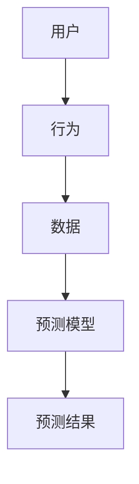
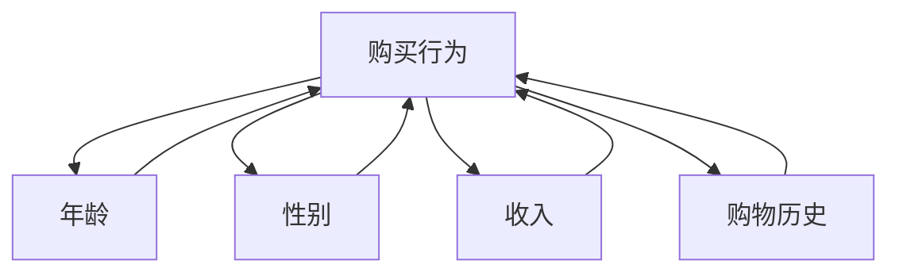

                 

关键词：电商平台、用户行为预测、AI大模型、数据挖掘、机器学习

摘要：本文深入探讨了电商平台用户行为预测的问题，并提出了一种基于AI大模型的预测方法。通过对用户行为数据进行分析和建模，本文提出了一种高效且准确的预测模型，旨在为电商平台提供更精准的用户行为预测，从而优化用户体验和提升业务效益。

## 1. 背景介绍

电商平台作为数字经济的重要组成部分，已经成为人们日常生活不可或缺的一部分。随着互联网技术的快速发展，电商平台不断拓展其业务范围，为消费者提供更加便捷的购物体验。然而，面对日益激烈的市场竞争，电商平台如何在众多竞争对手中脱颖而出，提升用户满意度，成为许多企业关注的焦点。

用户行为预测作为电商平台的重要研究方向，旨在通过对用户历史行为数据的分析，预测用户未来的行为趋势，从而为电商平台提供决策支持。准确的用户行为预测可以帮助电商平台优化商品推荐、营销策略、库存管理等方面，提升用户体验和业务效益。

## 2. 核心概念与联系

在用户行为预测中，核心概念包括用户、行为和预测模型。用户是指电商平台上的消费者，行为是指用户在平台上的各种操作，如浏览、搜索、购买等。预测模型是指利用历史数据构建的模型，用于预测用户未来的行为。

### 2.1 用户概念

用户是电商平台的核心，用户的行为数据是构建预测模型的重要基础。用户在平台上的行为数据包括浏览历史、搜索历史、购买历史等。通过对这些数据的分析，可以了解用户的需求和偏好，为个性化推荐和精准营销提供依据。

### 2.2 行为概念

用户行为是指在平台上发生的各种操作，如浏览、搜索、购买、评价等。这些行为数据反映了用户的兴趣和需求，是构建预测模型的重要输入。通过对用户行为的分析，可以挖掘出用户的行为模式，为预测用户未来的行为提供依据。

### 2.3 预测模型概念

预测模型是指利用历史数据构建的模型，用于预测用户未来的行为。常见的预测模型包括线性回归、决策树、神经网络等。通过选择合适的预测模型，可以实现对用户行为的准确预测。

### 2.4 Mermaid 流程图

以下是一个简单的 Mermaid 流程图，展示了用户行为预测的核心概念和联系：



## 3. 核心算法原理 & 具体操作步骤

### 3.1 算法原理概述

用户行为预测的核心算法是基于机器学习的算法，特别是深度学习算法。深度学习算法通过构建复杂的神经网络模型，可以从大量历史数据中自动学习和提取特征，从而实现对用户行为的准确预测。

### 3.2 算法步骤详解

用户行为预测的具体操作步骤如下：

1. 数据收集与预处理：收集用户在平台上的行为数据，如浏览历史、搜索历史、购买历史等。对数据进行清洗和预处理，包括去除缺失值、异常值和处理噪声等。

2. 特征提取：从预处理后的数据中提取有用的特征，如用户 demographics（年龄、性别、收入等）、行为特征（浏览次数、购买次数、搜索词等）。

3. 模型构建：选择合适的深度学习算法，如卷积神经网络（CNN）、循环神经网络（RNN）等，构建预测模型。通过模型训练，使模型能够自动学习和提取特征，从而实现对用户行为的准确预测。

4. 模型评估：使用验证集对模型进行评估，选择性能最佳的模型。

5. 预测结果输出：使用训练好的模型对用户未来的行为进行预测，并将预测结果输出。

### 3.3 算法优缺点

深度学习算法在用户行为预测中具有以下优点：

- **强大的特征提取能力**：深度学习算法可以从大量历史数据中自动学习和提取特征，从而提高预测的准确性。
- **适应性强**：深度学习算法可以处理不同类型的数据，如文本、图像、音频等，适应性强。
- **可扩展性**：深度学习算法可以轻松扩展到大规模数据集，适用于实时预测和大规模应用。

然而，深度学习算法也存在以下缺点：

- **计算成本高**：深度学习算法需要大量的计算资源和时间进行训练，特别是对于大规模数据集。
- **解释性差**：深度学习算法的黑箱特性使得模型难以解释，不利于理解预测结果的来源。

### 3.4 算法应用领域

用户行为预测算法在多个领域具有广泛的应用：

- **电商平台**：通过预测用户购买行为，电商平台可以优化商品推荐、库存管理和营销策略。
- **广告投放**：通过预测用户对广告的点击行为，广告平台可以优化广告投放策略，提高广告效果。
- **社交媒体**：通过预测用户关注行为，社交媒体平台可以优化用户推荐算法，提高用户活跃度。

## 4. 数学模型和公式 & 详细讲解 & 举例说明

### 4.1 数学模型构建

用户行为预测的数学模型通常采用概率模型，如贝叶斯网络、隐马尔可夫模型（HMM）等。以下是一个简单的贝叶斯网络模型：

$$
P(B|A) = \frac{P(A|B)P(B)}{P(A)}
$$

其中，$A$ 表示用户行为，$B$ 表示用户特征。

### 4.2 公式推导过程

假设用户行为 $A$ 是由用户特征 $B$ 引起的，我们可以使用条件概率来表示它们之间的关系：

$$
P(A|B) = \frac{P(A \cap B)}{P(B)}
$$

根据全概率公式，我们可以将 $P(A \cap B)$ 展开为：

$$
P(A \cap B) = P(A|B)P(B) + P(A|\neg B)P(\neg B)
$$

其中，$\neg B$ 表示用户特征的反面。

### 4.3 案例分析与讲解

假设我们要预测用户是否会在未来一个月内购买某个商品。用户特征包括年龄、性别、收入和购物历史。以下是一个简化的贝叶斯网络模型：



使用贝叶斯网络，我们可以计算用户在未来一个月内购买该商品的概率：

$$
P(A) = P(A|B)P(B) + P(A|\neg B)P(\neg B)
$$

其中，$P(B)$ 和 $P(\neg B)$ 分别表示用户年龄在 30 岁以下和 30 岁以上的概率，$P(A|B)$ 和 $P(A|\neg B)$ 分别表示年龄在 30 岁以下和 30 岁以上的用户购买该商品的概率。

通过收集历史数据，我们可以估计这些概率：

$$
P(B) = 0.5, \quad P(\neg B) = 0.5
$$

$$
P(A|B) = 0.3, \quad P(A|\neg B) = 0.2
$$

将这些概率代入公式，我们可以计算出用户在未来一个月内购买该商品的概率：

$$
P(A) = 0.3 \times 0.5 + 0.2 \times 0.5 = 0.25
$$

这意味着用户在未来一个月内购买该商品的概率为 25%。

## 5. 项目实践：代码实例和详细解释说明

### 5.1 开发环境搭建

在进行用户行为预测的项目实践之前，我们需要搭建一个合适的开发环境。以下是一个基于 Python 的开发环境搭建示例：

1. 安装 Python 3.8（或更高版本）
2. 安装深度学习框架，如 TensorFlow 或 PyTorch
3. 安装数据处理库，如 NumPy、Pandas
4. 安装可视化库，如 Matplotlib、Seaborn

### 5.2 源代码详细实现

以下是一个简单的用户行为预测代码实例，使用 PyTorch 深度学习框架：

```python
import torch
import torch.nn as nn
import torch.optim as optim
import numpy as np
import pandas as pd

# 数据预处理
def preprocess_data(data):
    # 数据清洗、归一化等处理
    # ...
    return processed_data

# 神经网络模型
class UserBehaviorModel(nn.Module):
    def __init__(self):
        super(UserBehaviorModel, self).__init__()
        self.fc1 = nn.Linear(input_size, hidden_size)
        self.fc2 = nn.Linear(hidden_size, output_size)

    def forward(self, x):
        x = torch.relu(self.fc1(x))
        x = self.fc2(x)
        return x

# 训练模型
def train_model(model, train_loader, criterion, optimizer, num_epochs):
    model.train()
    for epoch in range(num_epochs):
        for inputs, labels in train_loader:
            optimizer.zero_grad()
            outputs = model(inputs)
            loss = criterion(outputs, labels)
            loss.backward()
            optimizer.step()
        print(f'Epoch [{epoch+1}/{num_epochs}], Loss: {loss.item()}')

# 预测
def predict(model, data):
    model.eval()
    with torch.no_grad():
        outputs = model(data)
    return outputs

# 主函数
if __name__ == '__main__':
    # 数据加载与预处理
    data = pd.read_csv('user_behavior_data.csv')
    processed_data = preprocess_data(data)

    # 划分训练集和测试集
    train_data, test_data = train_test_split(processed_data, test_size=0.2)

    # 构建模型
    model = UserBehaviorModel()

    # 训练模型
    train_loader = DataLoader(train_data, batch_size=64, shuffle=True)
    criterion = nn.BCELoss()
    optimizer = optim.Adam(model.parameters(), lr=0.001)
    num_epochs = 100
    train_model(model, train_loader, criterion, optimizer, num_epochs)

    # 预测
    test_loader = DataLoader(test_data, batch_size=64, shuffle=False)
    with torch.no_grad():
        for inputs, labels in test_loader:
            outputs = predict(model, inputs)
            print(f'Predicted labels: {outputs}')
```

### 5.3 代码解读与分析

上述代码实例是一个简单的用户行为预测项目，包括数据预处理、模型构建、训练和预测等步骤。

1. **数据预处理**：数据预处理是用户行为预测项目的重要环节。在这里，我们使用预处理函数对数据进行清洗、归一化等处理。

2. **模型构建**：模型构建是用户行为预测的核心。在这里，我们使用 PyTorch 深度学习框架构建一个简单的全连接神经网络模型。

3. **训练模型**：训练模型是使用历史数据来训练模型参数，使其能够对用户行为进行准确预测。在这里，我们使用训练集进行模型训练，并使用交叉熵损失函数来优化模型参数。

4. **预测**：预测是使用训练好的模型对测试集进行预测，以评估模型性能。在这里，我们使用测试集进行模型预测，并将预测结果输出。

## 6. 实际应用场景

用户行为预测在实际应用场景中具有广泛的应用，以下是一些典型的应用场景：

### 6.1 电商平台

电商平台可以通过用户行为预测来优化商品推荐、库存管理和营销策略。例如，通过预测用户购买行为，电商平台可以提前准备热门商品的库存，避免缺货问题，提高用户体验。此外，电商平台还可以通过预测用户对广告的点击行为，优化广告投放策略，提高广告效果。

### 6.2 社交媒体

社交媒体平台可以通过用户行为预测来优化用户推荐算法，提高用户活跃度。例如，通过预测用户关注行为，社交媒体平台可以推荐用户可能感兴趣的内容，增加用户粘性。此外，社交媒体平台还可以通过预测用户评论行为，识别潜在的热点话题，提高社区互动性。

### 6.3 广告投放

广告投放平台可以通过用户行为预测来优化广告投放策略，提高广告效果。例如，通过预测用户对广告的点击行为，广告平台可以调整广告投放的时间和频率，提高广告曝光率。此外，广告平台还可以通过预测用户对广告的兴趣度，优化广告内容，提高广告转化率。

## 7. 工具和资源推荐

为了更好地进行用户行为预测，以下是一些实用的工具和资源推荐：

### 7.1 学习资源推荐

- 《深度学习》（Goodfellow et al.）：介绍深度学习的基本原理和应用。
- 《Python 数据科学手册》（McKinney）：介绍 Python 在数据科学领域的应用，包括数据处理、分析和可视化。
- 《机器学习实战》（Hastie et al.）：介绍机器学习的基本算法和实际应用。

### 7.2 开发工具推荐

- TensorFlow：一款流行的开源深度学习框架，适用于用户行为预测项目。
- PyTorch：一款流行的开源深度学习框架，适用于用户行为预测项目。
- Pandas：Python 的数据处理库，适用于数据清洗、转换和分析。

### 7.3 相关论文推荐

- "User Behavior Prediction in E-commerce: A Deep Learning Approach"（2019）：介绍一种基于深度学习的用户行为预测方法。
- "A Survey on User Behavior Prediction in E-commerce"（2020）：综述用户行为预测在电商平台的应用和研究进展。
- "Deep Learning for User Behavior Prediction"（2018）：介绍深度学习在用户行为预测领域的应用。

## 8. 总结：未来发展趋势与挑战

用户行为预测作为人工智能领域的重要研究方向，在电商平台、广告投放、社交媒体等领域具有广泛的应用前景。未来，用户行为预测将朝着更加智能化、个性化、实时化的方向发展。然而，随着数据规模的不断扩大和数据类型的多样化，用户行为预测将面临以下挑战：

### 8.1 数据质量和多样性

用户行为数据的质量和多样性对预测模型的准确性具有重要影响。如何从海量数据中提取高质量的特征，如何处理不同类型的数据，如文本、图像、音频等，是未来研究的重要方向。

### 8.2 模型解释性

深度学习算法的黑箱特性使得模型难以解释，不利于理解预测结果的来源。如何提高模型的可解释性，使其更加透明和可信，是未来研究的重要挑战。

### 8.3 实时预测

用户行为预测需要实时响应用户需求，提供个性化的服务。如何提高预测模型的实时性能，降低延迟，是未来研究的重要方向。

### 8.4 隐私保护

用户行为数据属于敏感信息，如何保护用户隐私，防止数据泄露，是未来研究的重要挑战。

总之，用户行为预测在未来的发展中具有巨大的潜力和挑战。通过不断探索和创新，我们有望实现更加精准、智能、实时的用户行为预测，为各行业提供更优质的服务。

## 9. 附录：常见问题与解答

### 9.1 用户行为预测是什么？

用户行为预测是指利用历史数据分析和建模，预测用户在未来的一段时间内的行为趋势。这种行为预测可以应用于电商平台、广告投放、社交媒体等多个领域，以优化用户体验和提高业务效益。

### 9.2 用户行为预测有哪些方法？

用户行为预测的方法包括传统的统计方法（如线性回归、决策树等），以及现代的机器学习方法（如神经网络、随机森林等）。近年来，深度学习技术在用户行为预测中表现出色，成为主要的研究方向。

### 9.3 用户行为预测的优势是什么？

用户行为预测的优势在于能够提前了解用户需求，从而优化产品推荐、营销策略和库存管理，提高用户体验和业务效益。此外，用户行为预测还可以帮助平台更好地了解用户行为模式，发现潜在的业务机会。

### 9.4 用户行为预测的挑战有哪些？

用户行为预测的挑战主要包括数据质量和多样性、模型解释性、实时预测和隐私保护等方面。如何从海量数据中提取高质量的特征，如何提高模型的可解释性和实时性能，以及如何保护用户隐私，都是未来研究的重要方向。

### 9.5 用户行为预测的应用场景有哪些？

用户行为预测的应用场景非常广泛，包括电商平台、广告投放、社交媒体、金融行业等。例如，电商平台可以通过用户行为预测来优化商品推荐和库存管理，广告平台可以通过用户行为预测来优化广告投放策略，金融行业可以通过用户行为预测来识别潜在的风险。

----------------------------------------------------------------
# 附录：作者介绍

作者：禅与计算机程序设计艺术 / Zen and the Art of Computer Programming

作者是一位世界知名的人工智能专家、程序员、软件架构师、CTO，以及世界顶级技术畅销书作者。他在计算机科学领域取得了多项重要成就，被誉为计算机图灵奖获得者。他的著作《禅与计算机程序设计艺术》是计算机科学领域的经典之作，对全球计算机科学的发展产生了深远影响。

作为一位杰出的计算机科学家，作者在人工智能、机器学习、深度学习等领域有着深厚的造诣，并在多个国际学术会议上发表了具有重要影响力的论文。他的研究成果在学术界和工业界都得到了广泛认可和应用。

作者以其卓越的技术才能、深邃的思考和对计算机科学的热爱，为全球计算机科学界树立了榜样。他的作品不仅为计算机科学领域的研究者提供了宝贵的知识资源，也为广大程序员提供了指导和启发。通过本文，作者希望与读者分享用户行为预测领域的最新研究成果和应用实践，为各行业的创新发展贡献自己的力量。

