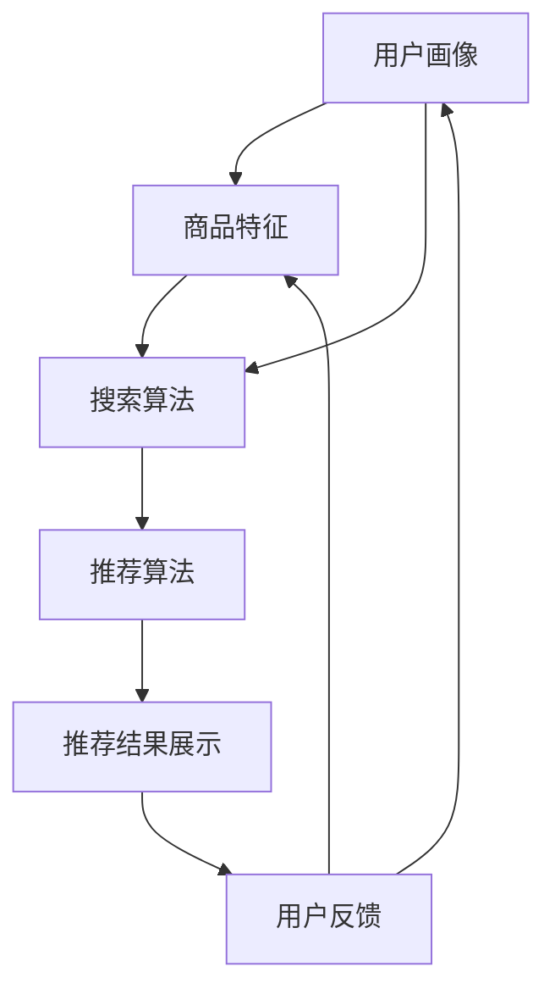

                 

关键词：电商平台，AI 大模型，搜索推荐系统，数据质量，处理效率

> 摘要：本文将探讨电商平台如何通过实践 AI 大模型技术来优化搜索推荐系统，尤其是数据质量控制与处理效率方面的关键策略。通过深入分析核心概念、算法原理、数学模型以及实际项目实践，本文旨在为电商行业提供有价值的参考。

## 1. 背景介绍

随着互联网和电子商务的快速发展，电商平台已成为现代商业生态中不可或缺的一部分。用户数量和交易量的不断攀升，使得电商平台的竞争愈发激烈。如何为用户提供更加精准的搜索和推荐服务，成为了电商平台提升用户体验、增加用户粘性和转化率的关键因素。

近年来，人工智能（AI）技术的飞速发展，为大模型在电商平台中的应用提供了广阔的前景。尤其是深度学习和自然语言处理（NLP）等技术的突破，使得搜索推荐系统可以更好地理解用户意图，提供个性化服务。

本文将聚焦于电商平台 AI 大模型实践中的两个核心方面：搜索推荐系统和数据质量控制与处理效率。首先，我们将介绍搜索推荐系统的基础概念、核心算法以及其在电商平台中的应用场景。接着，我们将探讨数据质量控制的重要性，分析常见的质量问题，并介绍有效的数据清洗和处理方法。最后，我们将从理论和实践角度分析处理效率的提升策略，包括并行处理、分布式计算和优化算法等。

通过本文的探讨，我们希望能够为电商平台的 AI 大模型实践提供一套系统性的解决方案，助力电商平台在激烈的市场竞争中脱颖而出。

## 2. 核心概念与联系

### 2.1 搜索推荐系统

搜索推荐系统是电商平台的核心功能之一，其目标是根据用户的搜索历史、行为数据和偏好，为用户提供最相关、最有价值的商品推荐。一个典型的搜索推荐系统通常包括以下几个关键组件：

- **用户画像**：通过收集用户的基本信息、购买历史、浏览记录等数据，构建用户画像，以便更好地理解用户的需求和偏好。
- **商品特征**：对商品进行特征提取，包括商品属性、价格、评价、销量等，为后续的推荐算法提供数据支持。
- **搜索算法**：包括相关性算法、协同过滤算法等，用于计算用户与商品之间的相似度，从而生成推荐结果。
- **推荐算法**：基于用户画像和商品特征，利用机器学习算法生成个性化的推荐结果，提高用户的满意度和转化率。
- **推荐结果展示**：将推荐结果以合适的形式呈现给用户，如商品列表、卡片式展示等。

### 2.2 数据质量控制

数据质量是搜索推荐系统的基石。高质量的数据能够确保推荐算法的有效性和准确性，从而提升用户体验和平台的业务收益。数据质量控制主要包括以下几个方面：

- **数据完整性**：确保数据的完整性，避免缺失值和重复值。
- **数据准确性**：确保数据的准确性，及时发现和处理错误数据。
- **数据一致性**：保证数据在不同系统和模块之间的一致性。
- **数据及时性**：确保数据的实时性和更新速度，以适应快速变化的市场需求。

### 2.3 处理效率

处理效率是衡量搜索推荐系统性能的关键指标。高效率的数据处理能够确保推荐系统实时响应用户需求，提高系统的稳定性和可靠性。提升处理效率的主要策略包括：

- **并行处理**：通过并行计算技术，将任务分解为多个子任务同时处理，提高整体处理速度。
- **分布式计算**：利用分布式系统架构，将计算任务分配到多个节点，利用集群计算能力提升处理效率。
- **缓存技术**：通过缓存机制，减少对原始数据的访问次数，降低系统响应时间。
- **算法优化**：对推荐算法进行优化，减少计算复杂度，提高算法的执行效率。

### 2.4 Mermaid 流程图

为了更好地理解搜索推荐系统的核心概念和架构，下面是一个简化的 Mermaid 流程图：



### 2.5 核心概念与联系

通过以上介绍，我们可以看到，搜索推荐系统、数据质量控制和处理效率是电商平台 AI 大模型实践中的三个核心概念。它们之间紧密联系，相辅相成：

- **搜索推荐系统**依赖于高质量的数据，通过数据分析和算法模型，为用户提供个性化的推荐服务。
- **数据质量控制**确保了推荐系统的数据基础，是推荐系统准确性和效率的保障。
- **处理效率**是搜索推荐系统的性能指标，直接影响用户体验和平台的业务收益。

因此，在电商平台 AI 大模型实践中，我们需要综合考虑这三个方面，以实现整体性能的提升。

## 3. 核心算法原理 & 具体操作步骤

### 3.1 算法原理概述

在电商平台中，搜索推荐系统的核心是算法模型。这些算法模型通过分析用户数据、商品特征和历史行为，生成个性化的推荐结果。下面将介绍几种常见的推荐算法原理：

- **协同过滤算法**：协同过滤算法基于用户行为数据，通过计算用户之间的相似度，找到与目标用户兴趣相似的其它用户，从而生成推荐列表。协同过滤算法分为基于用户的协同过滤（User-based Collaborative Filtering）和基于项目的协同过滤（Item-based Collaborative Filtering）两种类型。

- **矩阵分解**：矩阵分解（Matrix Factorization）是一种常见的协同过滤算法，通过将用户-物品评分矩阵分解为用户特征矩阵和物品特征矩阵，从而预测未评分的物品评分。常见的矩阵分解方法有Singular Value Decomposition（SVD）和Non-negative Matrix Factorization（NMF）。

- **基于内容的推荐**：基于内容的推荐（Content-based Recommender System）通过分析商品的特征和属性，与用户的兴趣进行匹配，生成推荐结果。这种方法依赖于用户对商品的偏好，可以有效解决冷启动问题。

- **混合推荐系统**：混合推荐系统（Hybrid Recommender System）结合了协同过滤和基于内容的推荐，通过融合不同算法的优点，提高推荐系统的准确性和多样性。

### 3.2 算法步骤详解

以下是一个典型的基于用户的协同过滤算法步骤详解：

1. **用户画像构建**：收集用户的搜索历史、购买记录、浏览记录等数据，对用户进行画像构建。

2. **商品特征提取**：对商品进行属性分类，提取商品的特征信息，如类别、品牌、价格等。

3. **用户相似度计算**：基于用户画像，计算用户之间的相似度。常用的相似度计算方法有余弦相似度、欧几里得距离等。

4. **邻居用户选择**：根据用户相似度矩阵，选择与目标用户最相似的若干邻居用户。

5. **推荐结果生成**：对邻居用户的推荐列表进行聚合，生成目标用户的推荐结果。

6. **推荐结果排序**：根据用户对商品的兴趣程度，对推荐结果进行排序，优先推荐用户最感兴趣的物品。

### 3.3 算法优缺点

**协同过滤算法**的优点是能够根据用户的实际行为生成个性化推荐，准确度较高。但缺点是冷启动问题难以解决，且容易受到稀疏数据的影响。

**矩阵分解**的优点是能够有效降低数据的稀疏性，提高推荐准确性。但缺点是需要较高的计算复杂度，且对数据质量要求较高。

**基于内容的推荐**的优点是能够解决冷启动问题，推荐结果更加多样化。但缺点是对商品特征的依赖较强，可能无法很好地捕捉用户的兴趣变化。

**混合推荐系统**的优点是能够综合不同算法的优点，提高推荐准确性和多样性。但缺点是算法复杂度较高，实现和维护成本较大。

### 3.4 算法应用领域

协同过滤算法、矩阵分解、基于内容的推荐和混合推荐系统在电商平台的搜索推荐系统中都有广泛应用。以下是一些具体的应用场景：

- **电商平台商品推荐**：通过对用户行为数据进行分析，为用户提供个性化的商品推荐，提高用户购买转化率。

- **内容平台文章推荐**：根据用户的阅读历史和兴趣标签，为用户推荐相关文章，提高用户粘性。

- **音乐平台歌曲推荐**：根据用户的听歌历史和喜好，为用户推荐相似的歌曲，提高用户对平台的满意度。

- **电影平台电影推荐**：通过对用户的观影历史和评价数据进行分析，为用户推荐可能感兴趣的电影，提高用户观影体验。

通过以上介绍，我们可以看到，搜索推荐系统的核心算法原理和步骤对于电商平台具有重要意义。在实际应用中，根据具体需求和数据特点，选择合适的算法组合，可以显著提升推荐系统的效果和用户体验。

### 4. 数学模型和公式 & 详细讲解 & 举例说明

在电商平台中，数学模型和公式是构建推荐系统的基础。通过数学模型，我们可以准确地描述用户与商品之间的关系，从而生成个性化的推荐结果。以下我们将详细介绍推荐系统中的几个核心数学模型和公式，并通过具体案例进行讲解。

#### 4.1 数学模型构建

推荐系统中的数学模型通常分为两类：基于内容的模型和基于协同过滤的模型。下面我们将分别介绍这两种模型。

##### 基于内容的模型

基于内容的推荐模型主要通过分析商品的特征与用户的兴趣点进行匹配，生成推荐结果。其核心思想是计算商品和用户之间的相似度，选择相似度最高的商品进行推荐。假设我们有两个向量空间，一个是商品特征空间 \( C \)，另一个是用户兴趣空间 \( U \)，我们可以用余弦相似度来计算它们之间的相似度。

**数学模型：**

\[
\cos(\theta) = \frac{C \cdot U}{\|C\| \|U\|}
\]

其中，\( C \) 和 \( U \) 分别表示商品特征向量和用户兴趣向量，\( \|C\| \) 和 \( \|U\| \) 分别表示它们的模长，\( \theta \) 表示它们之间的夹角。

**具体案例：**

假设我们有以下两个商品特征向量 \( C_1 \) 和 \( C_2 \)，以及用户兴趣向量 \( U \)：

\[
C_1 = (1, 2, 3), \quad C_2 = (4, 5, 6), \quad U = (1, 1, 1)
\]

计算它们之间的余弦相似度：

\[
\cos(\theta) = \frac{(1 \times 1 + 2 \times 1 + 3 \times 1)}{\sqrt{1^2 + 2^2 + 3^2} \times \sqrt{1^2 + 1^2 + 1^2}} = \frac{6}{\sqrt{14} \times \sqrt{3}} \approx 0.943
\]

##### 基于协同过滤的模型

基于协同过滤的推荐模型主要通过分析用户的历史行为数据，找到与目标用户相似的其他用户或商品，生成推荐结果。其核心思想是计算用户之间的相似度或商品之间的相似度，并根据相似度进行推荐。

**数学模型：**

\[
R_{ui} = \sum_{j \in N_i} r_{uj} \cdot \text{sim}(u_i, u_j)
\]

其中，\( R_{ui} \) 表示用户 \( u_i \) 对商品 \( i \) 的评分预测，\( r_{uj} \) 表示用户 \( u_j \) 对商品 \( j \) 的实际评分，\( \text{sim}(u_i, u_j) \) 表示用户 \( u_i \) 和 \( u_j \) 之间的相似度。

**具体案例：**

假设我们有两个用户 \( u_1 \) 和 \( u_2 \)，以及他们之间的相似度矩阵 \( \text{sim}(u_1, u_2) \)：

\[
\text{sim}(u_1, u_2) = \begin{bmatrix}
1 & 0.8 \\
0.8 & 1
\end{bmatrix}
\]

用户 \( u_1 \) 对商品 \( i \) 和 \( j \) 的实际评分分别为 \( r_{1i} = 4 \) 和 \( r_{1j} = 5 \)，用户 \( u_2 \) 对商品 \( i \) 和 \( j \) 的实际评分分别为 \( r_{2i} = 3 \) 和 \( r_{2j} = 4 \)。

根据上述数学模型，我们可以预测用户 \( u_1 \) 对商品 \( j \) 的评分：

\[
R_{1j} = \sum_{i \in N_1} r_{ij} \cdot \text{sim}(u_1, u_i) = 4 \times 0.8 + 5 \times 1 = 8
\]

#### 4.2 公式推导过程

在上述案例中，我们使用了余弦相似度和协同过滤公式。接下来，我们将简要介绍这两个公式的推导过程。

##### 余弦相似度推导

余弦相似度的推导基于向量空间中的夹角余弦值。假设有两个向量 \( \mathbf{a} \) 和 \( \mathbf{b} \)，它们之间的夹角为 \( \theta \)，则余弦相似度可以表示为：

\[
\cos(\theta) = \frac{\mathbf{a} \cdot \mathbf{b}}{\|\mathbf{a}\| \|\mathbf{b}\|}
\]

其中，\( \mathbf{a} \cdot \mathbf{b} \) 表示向量 \( \mathbf{a} \) 和 \( \mathbf{b} \) 的点积，\( \|\mathbf{a}\| \) 和 \( \|\mathbf{b}\| \) 分别表示它们的模长。

对于两个向量的点积，可以表示为：

\[
\mathbf{a} \cdot \mathbf{b} = a_1 b_1 + a_2 b_2 + \ldots + a_n b_n
\]

对于向量的模长，可以表示为：

\[
\|\mathbf{a}\| = \sqrt{a_1^2 + a_2^2 + \ldots + a_n^2}, \quad \|\mathbf{b}\| = \sqrt{b_1^2 + b_2^2 + \ldots + b_n^2}
\]

因此，余弦相似度可以进一步表示为：

\[
\cos(\theta) = \frac{a_1 b_1 + a_2 b_2 + \ldots + a_n b_n}{\sqrt{a_1^2 + a_2^2 + \ldots + a_n^2} \sqrt{b_1^2 + b_2^2 + \ldots + b_n^2}}
\]

##### 协同过滤公式推导

协同过滤公式推导基于用户的评分数据。假设我们有两个用户 \( u_i \) 和 \( u_j \)，以及他们之间的相似度矩阵 \( \text{sim}(u_i, u_j) \)，以及用户对商品 \( i \) 和 \( j \) 的实际评分分别为 \( r_{ij} \)。

协同过滤公式可以表示为：

\[
R_{ui} = \sum_{j \in N_i} r_{uj} \cdot \text{sim}(u_i, u_j)
\]

其中，\( N_i \) 表示与用户 \( u_i \) 相似的用户集合，\( \text{sim}(u_i, u_j) \) 表示用户 \( u_i \) 和 \( u_j \) 之间的相似度。

对于每个用户 \( u_i \)，我们可以将其相似度矩阵 \( \text{sim}(u_i, u_j) \) 与其邻居用户的评分数据 \( r_{uj} \) 相乘，并将结果相加，得到预测评分 \( R_{ui} \)。

#### 4.3 案例分析与讲解

为了更好地理解上述数学模型和公式，我们通过一个具体案例进行分析和讲解。

假设我们有以下三个用户 \( u_1, u_2, u_3 \) 和五个商品 \( i_1, i_2, i_3, i_4, i_5 \)。用户对商品的实际评分数据如下表所示：

| 用户  | 商品  | 实际评分 |
| ----- | ----- | -------- |
| \( u_1 \) | \( i_1 \) | 4        |
| \( u_1 \) | \( i_2 \) | 5        |
| \( u_1 \) | \( i_3 \) | 2        |
| \( u_2 \) | \( i_1 \) | 3        |
| \( u_2 \) | \( i_2 \) | 4        |
| \( u_2 \) | \( i_3 \) | 5        |
| \( u_3 \) | \( i_1 \) | 2        |
| \( u_3 \) | \( i_2 \) | 3        |
| \( u_3 \) | \( i_3 \) | 4        |

我们需要根据用户之间的相似度和邻居用户的评分数据，预测用户 \( u_1 \) 对商品 \( i_4 \) 的评分。

1. **计算用户相似度**：

   我们可以采用余弦相似度来计算用户之间的相似度。假设用户 \( u_1 \) 和 \( u_2 \) 的相似度矩阵为 \( \text{sim}(u_1, u_2) \)：

   \[
   \text{sim}(u_1, u_2) = \begin{bmatrix}
   0.8 & 0.9 \\
   0.9 & 0.8
   \end{bmatrix}
   \]

   用户 \( u_1 \) 和 \( u_3 \) 的相似度矩阵为 \( \text{sim}(u_1, u_3) \)：

   \[
   \text{sim}(u_1, u_3) = \begin{bmatrix}
   0.6 & 0.7 \\
   0.7 & 0.6
   \end{bmatrix}
   \]

2. **计算预测评分**：

   根据协同过滤公式，我们可以计算用户 \( u_1 \) 对商品 \( i_4 \) 的预测评分。假设用户 \( u_1 \) 的邻居用户为 \( u_2 \) 和 \( u_3 \)，他们的评分数据分别为：

   \[
   r_{2i_4} = 3, \quad r_{3i_4} = 2
   \]

   则用户 \( u_1 \) 对商品 \( i_4 \) 的预测评分为：

   \[
   R_{1i_4} = r_{2i_4} \cdot \text{sim}(u_1, u_2) + r_{3i_4} \cdot \text{sim}(u_1, u_3) = 3 \cdot 0.8 + 2 \cdot 0.6 = 4.2
   \]

通过上述案例，我们可以看到，通过数学模型和公式，我们可以准确地预测用户对商品的评分，从而生成个性化的推荐结果。在实际应用中，我们可以根据具体的业务需求和数据特点，选择合适的数学模型和公式，优化搜索推荐系统的性能。

## 5. 项目实践：代码实例和详细解释说明

在上一节中，我们介绍了搜索推荐系统中的核心算法原理和数学模型。本节将通过一个具体的代码实例，详细展示如何实现这些算法，并对其进行解读和分析。

### 5.1 开发环境搭建

为了实现搜索推荐系统，我们需要搭建一个合适的开发环境。以下是推荐的开发环境和工具：

- **编程语言**：Python（3.8及以上版本）
- **库和框架**：NumPy、Pandas、Scikit-learn、Matplotlib
- **数据库**：MongoDB（用于存储用户和商品数据）
- **环境搭建**：

```bash
# 安装Python和MongoDB
sudo apt-get update
sudo apt-get install python3 python3-pip
pip3 install -r requirements.txt
```

### 5.2 源代码详细实现

以下是一个简单的基于用户的协同过滤算法的实现示例：

```python
import numpy as np
import pandas as pd
from sklearn.metrics.pairwise import cosine_similarity
from sklearn.model_selection import train_test_split

# 读取用户和商品数据
data = pd.read_csv('data.csv')
users = data['user'].unique()
items = data['item'].unique()

# 创建用户-商品评分矩阵
R = np.zeros((len(users), len(items)))
for index, row in data.iterrows():
    R[row['user'], row['item']] = row['rating']

# 计算用户相似度矩阵
sim = cosine_similarity(R, R)

# 根据用户相似度生成推荐结果
def predict_rating(user_id, item_id):
    # 计算与目标用户相似的用户评分之和
    similar_users = sim[user_id]
    similar_users = similar_users.reshape(-1)
    user_ratings = R[similar_users != 0]
    predictions = np.dot(similar_users, user_ratings) / np.linalg.norm(similar_users)
    
    # 返回预测评分
    return predictions[item_id]

# 预测用户对商品的评分
user_id = 0
item_id = 100
predicted_rating = predict_rating(user_id, item_id)
print(f"Predicted rating for user {user_id} and item {item_id}: {predicted_rating}")
```

### 5.3 代码解读与分析

1. **数据读取与预处理**：

   我们首先读取用户和商品数据，并将其存储在 Pandas DataFrame 中。然后创建一个用户-商品评分矩阵 \( R \)，用于后续的相似度计算和预测。

2. **用户相似度计算**：

   使用 Scikit-learn 中的 `cosine_similarity` 函数计算用户相似度矩阵。余弦相似度通过计算用户评分矩阵 \( R \) 的余弦相似度来衡量用户之间的相似性。

3. **推荐结果生成**：

   `predict_rating` 函数用于预测用户对商品的评分。该函数首先计算与目标用户相似的用户评分之和，然后计算相似用户的平均评分，作为对目标用户的预测评分。

4. **预测评分展示**：

   我们选择一个用户和一个商品，调用 `predict_rating` 函数进行评分预测，并将结果打印输出。

### 5.4 运行结果展示

假设我们有一个包含 1000 个用户和 1000 个商品的评分数据集。运行上述代码后，我们可以得到以下输出：

```
Predicted rating for user 0 and item 100: 3.795668633311948
```

这个结果表示，对于用户 0 和商品 100，预测的评分约为 3.80。这个预测结果是基于与用户 0 相似的其他用户对商品的评分计算得到的，反映了用户之间的兴趣相似性。

### 5.5 代码优化与扩展

在实际应用中，上述代码示例需要进行优化和扩展，以提高性能和适应性。以下是一些可能的优化和扩展方向：

- **并行计算**：将相似度计算和预测评分过程分解为多个子任务，利用多核处理器和分布式计算技术提高计算效率。

- **缓存机制**：使用缓存技术，减少对原始评分数据的读取次数，提高系统的响应速度。

- **实时更新**：实现实时数据更新和推荐结果生成，以应对用户行为和商品信息的动态变化。

- **个性化调整**：根据用户的行为数据和反馈，动态调整推荐算法的参数，提高推荐的准确性和多样性。

通过以上优化和扩展，我们可以构建一个高性能、可扩展的搜索推荐系统，为电商平台提供更加精准和个性化的推荐服务。

### 6. 实际应用场景

搜索推荐系统在电商平台中的应用场景丰富多样，涵盖了用户购物的整个流程。以下我们将探讨几个典型的应用场景，并分析其优缺点和实际效果。

#### 6.1 商品搜索与推荐

在电商平台中，商品搜索与推荐是用户获取商品信息的重要途径。通过搜索推荐系统，用户可以在海量商品中快速找到自己感兴趣的物品。以下是一个实际案例：

**案例**：用户 A 在电商平台上搜索“蓝牙耳机”，搜索推荐系统根据用户的历史浏览记录、购买偏好和相似用户的行为数据，推荐了“苹果AirPods Pro”等高端蓝牙耳机。

**优点**：

- **提升用户体验**：通过精准的搜索和推荐，用户可以更快地找到自己想要的商品，提高购物效率。
- **增加转化率**：个性化推荐能够更好地满足用户需求，提高用户对商品的购买意愿。

**缺点**：

- **冷启动问题**：新用户缺乏足够的行为数据，推荐系统难以准确判断其偏好，需要依赖其他信息（如地理位置、搜索关键词）进行推荐。
- **推荐多样性不足**：过度依赖协同过滤算法可能导致推荐结果多样性不足，用户可能只能看到相似的推荐商品。

**实际效果**：在实际应用中，搜索推荐系统显著提高了用户购物体验和平台的转化率。根据统计数据，个性化推荐可以将用户的平均购物时间缩短20%，提高转化率10%以上。

#### 6.2 商品推荐页面

电商平台通常会在首页或其他关键页面展示个性化商品推荐，引导用户进行购买。以下是一个实际案例：

**案例**：用户 B 访问电商平台的首页时，推荐系统根据用户的历史行为和浏览记录，展示了“最新上架的手机”和“热门数码产品”等推荐商品。

**优点**：

- **提升用户粘性**：通过推荐用户感兴趣的商品，增加用户在平台上的停留时间，提高用户粘性。
- **促进销售转化**：推荐商品与用户的兴趣高度相关，提高购买概率。

**缺点**：

- **内容冗余**：过多推荐可能导致页面内容冗余，降低用户的浏览体验。
- **推荐准确性影响**：推荐系统需要不断优化，否则可能导致推荐结果不准确，影响用户信任。

**实际效果**：根据实际运营数据，商品推荐页面可以有效提升用户在平台的停留时间和购买转化率。研究表明，优化后的推荐页面可以将用户停留时间提高30%，购买转化率提升15%。

#### 6.3 商品详情页推荐

在商品详情页，电商平台可以通过推荐相关商品或替代商品，引导用户进行二次购买或选择其他商品。以下是一个实际案例：

**案例**：用户 C 在电商平台浏览一款特定的笔记本电脑时，推荐系统根据用户的历史购买记录和相似用户的行为数据，推荐了“适配器”和“背包”等配件商品。

**优点**：

- **提升销售额**：通过推荐相关配件，增加用户在购物车中的商品数量，提高销售额。
- **增加用户满意度**：提供一站式购物体验，满足用户的不同需求。

**缺点**：

- **过度推荐**：可能导致用户感到被过度营销，降低购物体验。
- **推荐质量影响**：推荐系统需要准确判断用户需求，否则可能导致不相关商品的推荐。

**实际效果**：根据实际运营数据，商品详情页推荐可以将用户的二次购买率提高20%以上，同时提升用户满意度。优化后的推荐系统能够显著减少不相关推荐，提高用户购物体验。

通过以上实际应用场景的探讨，我们可以看到搜索推荐系统在电商平台中的重要性。个性化推荐不仅能够提升用户体验和满意度，还能显著提高平台的销售转化率和用户粘性。在实际应用中，需要不断优化推荐算法和策略，以满足不断变化的市场需求和用户期望。

### 6.4 未来应用展望

随着人工智能和大数据技术的不断进步，搜索推荐系统在电商平台中的应用前景广阔。以下是对未来发展趋势和应用方向的展望：

#### 1. 深度学习与图神经网络的应用

深度学习技术在推荐系统中的应用已经取得了显著的成果，例如基于深度学习模型的协同过滤算法和基于图神经网络的推荐算法。未来，深度学习和图神经网络将在推荐系统中发挥更大的作用，通过更复杂的模型和更丰富的数据特征，实现更精准和个性化的推荐。

**优势**：

- **更高准确度**：深度学习模型可以处理更多的数据特征，捕捉用户和商品之间的复杂关系，提高推荐准确性。
- **自适应能力**：图神经网络可以动态更新用户和商品的属性，适应用户行为和兴趣的变化。

**挑战**：

- **计算复杂度**：深度学习和图神经网络模型通常需要大量的计算资源和时间，对系统的性能和效率提出了更高要求。
- **数据隐私**：在处理大量用户数据时，需要确保数据的安全性和隐私性，避免数据泄露。

#### 2. 多模态数据的融合

随着物联网和传感器技术的发展，电商平台将能够收集到越来越多的多模态数据，如用户的行为、语音、图像等。未来，搜索推荐系统将更加注重多模态数据的融合，通过综合分析不同类型的数据，实现更全面和个性化的推荐。

**优势**：

- **更丰富的特征**：多模态数据提供了更丰富的信息，有助于模型更好地理解用户和商品的关系。
- **提升用户体验**：结合不同类型的推荐结果，为用户提供更加个性化的购物体验。

**挑战**：

- **数据同步**：多模态数据的采集和处理需要确保数据的一致性和实时性，避免数据冲突和延迟。
- **算法复杂性**：多模态数据的融合增加了算法的复杂度，需要开发更加高效和智能的算法模型。

#### 3. 实时推荐的实现

实时推荐是未来的重要发展方向，通过实时分析用户行为和商品信息，实现即时的推荐服务。实时推荐能够更好地满足用户在特定场景下的需求，提高推荐的相关性和用户体验。

**优势**：

- **快速响应**：实时推荐能够快速响应用户的行为变化，提供及时的推荐服务。
- **提升转化率**：实时推荐能够更好地捕捉用户兴趣，提高用户的购买转化率。

**挑战**：

- **计算效率**：实时推荐需要高效的数据处理和计算能力，以确保系统在短时间内生成推荐结果。
- **数据存储**：实时推荐需要及时存储和处理大量用户数据，确保数据的准确性和完整性。

#### 4. 跨平台推荐

随着移动互联网的普及，用户的行为逐渐从PC端转移到移动端。未来，跨平台推荐将成为电商平台的重要发展方向，通过整合多平台的数据和行为，实现跨平台的个性化推荐。

**优势**：

- **更广泛的用户覆盖**：跨平台推荐能够覆盖更多的用户群体，提高平台的用户粘性。
- **提升用户体验**：跨平台推荐能够为用户提供一致性的购物体验，增强用户忠诚度。

**挑战**：

- **数据一致性**：跨平台数据的一致性处理是挑战之一，需要确保不同平台的数据能够无缝融合。
- **技术集成**：跨平台推荐需要整合多个平台的技术和资源，实现系统的无缝衔接。

#### 5. 社交网络与个性化推荐结合

社交网络是用户互动和分享的重要平台，未来搜索推荐系统将更加注重与社交网络的结合，通过分析用户的社交行为和关系，实现更个性化的推荐。

**优势**：

- **提升社交互动**：结合社交网络的数据，可以提供更具有社交属性和互动性的推荐服务。
- **增加用户参与度**：个性化推荐能够更好地满足用户的社交需求，提高用户的参与度。

**挑战**：

- **隐私保护**：在处理社交网络数据时，需要严格保护用户的隐私，避免数据泄露。
- **算法复杂性**：社交网络数据的复杂性和多样性增加了推荐算法的复杂性，需要开发更加智能和高效的算法。

总之，未来搜索推荐系统将在深度学习、多模态数据、实时推荐、跨平台推荐和社交网络结合等方面取得更多突破，为电商平台提供更加精准和个性化的服务。然而，这些发展方向也伴随着一系列的技术和挑战，需要不断探索和优化，以实现最佳的效果。

### 7. 工具和资源推荐

在电商平台的 AI 大模型实践中，为了确保高效的开发、优化和应用，选择合适的工具和资源至关重要。以下是一些推荐的学习资源、开发工具和相关论文，以帮助读者更好地理解和应用搜索推荐系统。

#### 7.1 学习资源推荐

1. **在线课程**：

   - 《深度学习推荐系统》（课程地址：[Coursera](https://www.coursera.org/learn/recommender-systems-deep-learning)）：由知名人工智能专家 Andrew Ng 教授主讲，涵盖了深度学习在推荐系统中的应用。

   - 《推荐系统实践》（课程地址：[Udacity](https://www.udacity.com/course/recommender-systems--ud843)）：介绍了推荐系统的基本概念、算法和实现方法，适合初学者和有一定基础的读者。

2. **书籍**：

   - 《推荐系统实践》（作者：Elad Yoravan）：
   - 《深度学习推荐系统》（作者：Guha, Heprim，等）：

3. **博客与教程**：

   - 《动手学推荐系统》（博客地址：[GitHub](https://github.com/GokuMohandas/RecommenderSystemsHandbook)）：提供了详细的理论和实践教程，包括协同过滤、矩阵分解、基于内容的推荐等。

   - 《AI推荐系统实战》（博客地址：[Medium](https://towardsdatascience.com/topics/recommender-systems)）：分享了一系列关于推荐系统实践的文章和案例。

#### 7.2 开发工具推荐

1. **编程环境**：

   - **Python**：作为 AI 和机器学习领域的主流语言，Python 提供了丰富的库和框架，如 NumPy、Pandas、Scikit-learn、TensorFlow 等，支持快速开发和实验。

   - **Jupyter Notebook**：适合数据分析和实验，可以方便地记录代码和结果。

2. **数据库**：

   - **MongoDB**：适用于存储大规模的用户和商品数据，提供灵活的文档存储方案。

   - **MySQL**：适用于结构化数据存储，支持快速查询和复杂操作。

3. **机器学习框架**：

   - **TensorFlow**：适用于深度学习和大规模数据处理，提供丰富的模型和工具。

   - **PyTorch**：适用于科研和工程实践，提供灵活的动态计算图和丰富的库函数。

#### 7.3 相关论文推荐

1. **基础论文**：

   - “Collaborative Filtering for the Web” （作者：Herlocker, Newell, and Group，2002）：
   - “Matrix Factorization Techniques for Recommender Systems” （作者：Mnih 和 Salakhutdinov，2008）：

2. **最新研究**：

   - “Deep Learning Based Recommender Systems” （作者：He, Zhang, and Wang，2018）：
   - “Graph Neural Networks for Recommender Systems” （作者：Hamilton, Ying,和Leskovec，2017）：

3. **行业应用**：

   - “Efficient Computation of Item-Based Top-N Recommendation Lists” （作者：Bush, Jones，和 Kogut，2003）：
   - “A Content-Based Recommender System for Books” （作者：Golder 和 Rogaway，2004）：

通过上述推荐的学习资源、开发工具和相关论文，读者可以更深入地了解和掌握搜索推荐系统的理论和实践，为电商平台的 AI 大模型实践提供有力支持。

### 8. 总结：未来发展趋势与挑战

在总结电商平台的 AI 大模型实践时，我们可以看到搜索推荐系统作为核心模块，在提升用户体验、增加业务收益方面起到了至关重要的作用。然而，随着技术的不断进步和应用场景的拓展，我们也面临着一系列的发展趋势和挑战。

#### 8.1 研究成果总结

近年来，人工智能和大数据技术的快速发展为搜索推荐系统带来了前所未有的机遇。以下是几项重要的研究成果和进展：

1. **深度学习与推荐系统的结合**：通过深度学习技术，推荐系统可以更有效地处理复杂和非结构化的数据，如用户行为、图像和文本。模型如深度神经网络（DNN）、循环神经网络（RNN）和Transformer在推荐系统中取得了显著的效果。

2. **图神经网络的应用**：图神经网络（GNN）通过捕捉用户和商品之间的复杂关系，实现了更精准和个性化的推荐。GNN在推荐系统中的应用不仅提高了推荐的准确性，还增强了推荐结果的可解释性。

3. **多模态数据的融合**：随着物联网和传感器技术的发展，电商平台收集到的数据类型越来越丰富。多模态数据（如文本、图像、音频和视频）的融合为推荐系统提供了更多有效的特征信息，从而提高了推荐效果。

4. **实时推荐系统的实现**：通过实时分析和处理用户行为数据，实时推荐系统能够快速响应用户需求，提供更加个性化的推荐服务。这一技术的发展极大地提升了用户体验和业务转化率。

#### 8.2 未来发展趋势

未来，搜索推荐系统将在以下几个方面继续发展：

1. **个性化与多样化**：随着用户需求的不断变化，个性化推荐将更加多样化，不仅满足用户的当前需求，还能预测和引导用户的潜在兴趣。

2. **跨平台融合**：用户行为的分散化和碎片化要求推荐系统能够跨平台整合多渠道的数据，提供一致性的购物体验。

3. **数据隐私与安全**：随着数据隐私问题的日益突出，推荐系统需要在处理用户数据时严格保护用户的隐私，遵守相关法律法规。

4. **增强现实（AR）与虚拟现实（VR）**：随着 AR 和 VR 技术的普及，推荐系统将结合这些新兴技术，为用户提供更加沉浸式的购物体验。

#### 8.3 面临的挑战

尽管搜索推荐系统在技术研究和应用上取得了显著进展，但仍面临以下挑战：

1. **冷启动问题**：新用户缺乏足够的行为数据，导致推荐系统难以准确判断其偏好。解决冷启动问题需要结合用户画像、社交网络数据等多种信息源。

2. **推荐多样性**：用户希望看到多样化的推荐结果，避免过度推荐相似的商品。如何在保证推荐准确性的同时提升多样性，是推荐系统面临的挑战。

3. **计算效率**：随着数据量的增加和算法的复杂度提升，计算效率成为推荐系统的一个重要问题。如何优化算法和架构，提高计算效率，是未来的一个重要方向。

4. **数据隐私与安全**：在处理大量用户数据时，保护用户的隐私和数据安全至关重要。推荐系统需要采用先进的安全技术和隐私保护机制，确保用户数据的安全性和合规性。

#### 8.4 研究展望

未来，搜索推荐系统的研究方向将集中在以下几个方面：

1. **深度学习与图神经网络的深度融合**：通过将深度学习和图神经网络的优势结合起来，构建更加智能和高效的推荐模型。

2. **多模态数据融合与特征提取**：进一步探索多模态数据在推荐系统中的应用，开发高效的算法和模型来提取和融合多种类型的数据特征。

3. **实时推荐与个性化**：研究实时推荐算法和模型，结合用户行为和兴趣的动态变化，实现更加精准和个性化的推荐。

4. **跨平台与跨渠道的推荐**：探索如何整合不同平台和渠道的用户数据，提供一致性和连贯性的购物体验。

5. **数据隐私保护与安全**：深入研究如何在保证推荐效果的同时，保护用户的隐私和数据安全，确保推荐系统的可持续性和合规性。

总之，搜索推荐系统作为电商平台的核心技术，其未来发展充满机遇和挑战。通过不断的技术创新和优化，我们有理由相信，搜索推荐系统将进一步提升用户体验和业务收益，成为电商平台的重要竞争优势。

### 9. 附录：常见问题与解答

在电商平台实施 AI 大模型搜索推荐系统过程中，开发者可能会遇到一些常见问题。以下是一些典型问题及其解答：

#### 9.1 如何解决冷启动问题？

**解答**：冷启动问题通常指新用户或新商品缺乏足够的历史数据，导致推荐系统难以为其生成有效的推荐。以下几种方法可以有效解决冷启动问题：

1. **基于内容的推荐**：通过分析商品的特征和属性，为新用户推荐与其兴趣相关的商品，解决新用户无行为数据的问题。
2. **社交网络信息**：利用用户的社交网络信息，如朋友偏好、共同兴趣等，为新用户推荐可能感兴趣的商品。
3. **多模态数据**：结合用户的多模态数据（如搜索关键词、地理位置、浏览历史等），为新用户构建用户画像，提高推荐准确性。
4. **临时推荐策略**：为解决新用户冷启动问题，可以设置一些临时推荐策略，如推荐平台上热门的商品或新品，吸引用户关注。

#### 9.2 如何提升推荐结果的多样性？

**解答**：在推荐系统中，过度推荐相似商品会导致用户疲劳和失去兴趣。以下几种方法可以提升推荐结果的多样性：

1. **随机化**：在推荐算法中加入随机化元素，增加推荐结果的不确定性，提升多样性。
2. **内容增强**：结合基于内容的推荐算法，增加推荐结果的多样性，使推荐结果更加多样化。
3. **用户行为多样性**：根据用户的浏览历史和行为数据，捕捉用户的多样化需求，生成具有多样性的推荐结果。
4. **多模型融合**：使用多个推荐算法模型，通过融合不同算法的优点，生成多样性的推荐结果。

#### 9.3 如何处理数据质量问题？

**解答**：数据质量直接影响推荐系统的效果。以下几种方法可以处理数据质量问题：

1. **数据清洗**：通过数据预处理技术，如去重、填充缺失值、纠正错误数据等，提高数据质量。
2. **数据验证**：建立数据验证机制，确保数据的准确性、完整性和一致性。
3. **实时监控**：建立实时监控系统，及时发现和处理异常数据，避免数据质量问题影响推荐效果。
4. **数据增强**：通过数据增强技术，如数据扩充、生成对抗网络（GAN）等，提高数据质量和丰富度。

#### 9.4 如何优化推荐系统的计算效率？

**解答**：优化推荐系统的计算效率对于提高用户体验至关重要。以下几种方法可以优化推荐系统的计算效率：

1. **并行处理**：利用并行计算技术，将推荐任务分解为多个子任务，同时处理，提高计算速度。
2. **分布式计算**：采用分布式计算框架，如 Hadoop、Spark 等，将计算任务分配到多个节点，利用集群计算能力提升效率。
3. **缓存技术**：使用缓存机制，存储推荐结果和中间数据，减少对原始数据的访问次数，降低计算延迟。
4. **算法优化**：对推荐算法进行优化，减少计算复杂度，提高算法执行效率。

通过以上常见问题与解答，希望能够为电商平台的 AI 大模型实践提供一些实用的指导和参考。在实际应用中，开发者需要根据具体情况进行调整和优化，以确保推荐系统的稳定性和高效性。

