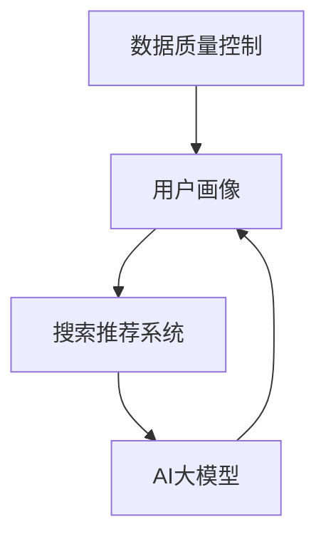

                 

关键词：电商平台、AI 大模型、搜索推荐系统、数据质量控制、用户体验

摘要：随着人工智能技术的不断发展，电商平台在搜索推荐系统中引入AI大模型已成为提升用户体验、增加销售量的关键途径。本文将从背景介绍、核心概念与联系、核心算法原理与操作步骤、数学模型与公式、项目实践、实际应用场景、未来应用展望等方面，深入探讨电商平台AI大模型的实践与应用。

## 1. 背景介绍

电商平台作为现代商业的重要组成部分，其成功与否很大程度上取决于用户体验。随着用户需求的多样化，如何通过智能推荐系统提供个性化、精准的商品推荐，已经成为电商平台竞争的关键因素。传统的基于规则的推荐系统已经无法满足日益增长的用户期望，而人工智能技术的引入，特别是AI大模型的实践，为电商平台的推荐系统带来了全新的变革。

AI大模型，如深度学习、强化学习、迁移学习等，通过处理海量用户数据，可以自动提取数据中的潜在模式，从而实现智能化的推荐。这些模型不仅可以提高推荐的准确性和多样性，还能在降低计算成本、提升系统响应速度等方面发挥重要作用。

## 2. 核心概念与联系

为了更好地理解电商平台AI大模型的应用，我们需要先了解几个核心概念和它们之间的联系。

### 2.1 数据质量控制

数据质量是AI大模型训练和应用的基础。数据质量控制主要包括数据清洗、数据去重、数据格式标准化等步骤。高质量的输入数据是保证模型效果的关键。

### 2.2 用户画像

用户画像是对用户行为、偏好、购买习惯等进行全面描述的一种方法。通过用户画像，电商平台可以更好地理解用户需求，从而实现更精准的推荐。

### 2.3 搜索推荐系统

搜索推荐系统是电商平台的核心功能之一，它通过分析用户历史行为、搜索记录、浏览记录等，为用户提供个性化的商品推荐。

### 2.4 AI大模型

AI大模型是指通过深度学习、强化学习等算法，从海量数据中自动提取特征和模式，实现智能化的决策和预测。在搜索推荐系统中，AI大模型可以帮助电商平台提高推荐的准确性和多样性。

以下是核心概念和联系之间的Mermaid流程图：



## 3. 核心算法原理与具体操作步骤

### 3.1 算法原理概述

电商平台AI大模型的核心算法主要包括深度学习、强化学习和迁移学习等。这些算法通过自动提取数据中的特征和模式，实现个性化的商品推荐。

- **深度学习**：通过多层神经网络，自动提取数据中的复杂特征。
- **强化学习**：通过不断地试错和反馈，找到最佳的行为策略。
- **迁移学习**：通过在不同数据集上训练，提高模型的泛化能力。

### 3.2 算法步骤详解

#### 3.2.1 数据预处理

1. 数据清洗：去除缺失值、异常值等。
2. 数据去重：保证数据的唯一性。
3. 数据格式标准化：统一数据格式，方便后续处理。

#### 3.2.2 特征提取

1. 用户特征提取：包括用户的基本信息、行为数据、偏好数据等。
2. 商品特征提取：包括商品的基本信息、品类、价格等。

#### 3.2.3 模型训练

1. 深度学习：通过多层神经网络，自动提取数据中的特征。
2. 强化学习：通过试错和反馈，找到最佳的行为策略。
3. 迁移学习：通过在不同数据集上训练，提高模型的泛化能力。

#### 3.2.4 模型评估与优化

1. 模型评估：通过准确率、召回率等指标，评估模型效果。
2. 模型优化：通过调整模型参数，提高模型性能。

### 3.3 算法优缺点

#### 优点：

- 提高推荐准确性：通过自动提取数据中的特征和模式，实现更精准的推荐。
- 提高推荐多样性：通过多种算法的组合，实现推荐的多样性。
- 降低计算成本：通过分布式计算和优化算法，降低计算成本。

#### 缺点：

- 需要大量高质量的数据：数据质量直接影响模型效果。
- 模型训练时间较长：深度学习等算法的训练时间较长。

### 3.4 算法应用领域

AI大模型在电商平台的应用非常广泛，包括但不限于：

- 商品推荐：根据用户行为、偏好等，为用户提供个性化的商品推荐。
- 广告投放：根据用户画像，为用户推送个性化的广告。
- 用户行为预测：预测用户的下一步行为，为用户提供更好的服务。

## 4. 数学模型和公式

### 4.1 数学模型构建

在电商平台AI大模型中，常用的数学模型包括：

- **矩阵分解**：通过矩阵分解，将用户-商品矩阵分解为用户特征矩阵和商品特征矩阵，从而实现推荐。
- **协同过滤**：通过计算用户与商品之间的相似度，为用户提供推荐。
- **强化学习**：通过奖励机制，引导模型学习最佳的行为策略。

### 4.2 公式推导过程

#### 矩阵分解

设用户-商品矩阵为 $R$，用户特征矩阵为 $U$，商品特征矩阵为 $V$，则有：

$$R = U \times V$$

通过最小化损失函数，可以得到用户特征矩阵 $U$ 和商品特征矩阵 $V$。

#### 协同过滤

设用户 $i$ 对商品 $j$ 的评分预测为 $r_{ij}$，真实评分为 $r_{ij}^*$，则有：

$$r_{ij} = \mu + u_i^T v_j + \epsilon_{ij}$$

其中，$\mu$ 为平均评分，$u_i$ 和 $v_j$ 分别为用户 $i$ 和商品 $j$ 的特征向量，$\epsilon_{ij}$ 为误差项。

#### 强化学习

设状态集为 $S$，动作集为 $A$，状态-动作值函数为 $Q(s, a)$，奖励函数为 $R(s, a)$，则有：

$$Q(s, a) = r + \gamma \max_{a'} Q(s', a')$$

其中，$r$ 为即时奖励，$\gamma$ 为折扣因子。

### 4.3 案例分析与讲解

#### 案例一：矩阵分解

假设有一个用户-商品矩阵 $R$，如下所示：

| 用户 | 商品1 | 商品2 | 商品3 | 商品4 |
|------|------|------|------|------|
| 1    | 3    | 4    | 5    | 2    |
| 2    | 4    | 3    | 2    | 5    |
| 3    | 2    | 4    | 3    | 5    |
| 4    | 5    | 2    | 4    | 3    |

通过矩阵分解，我们可以将用户-商品矩阵 $R$ 分解为用户特征矩阵 $U$ 和商品特征矩阵 $V$，如下所示：

| 用户 | 特征1 | 特征2 |
|------|------|------|
| 1    | 0.2  | 0.8  |
| 2    | 0.8  | 0.2  |
| 3    | 0.4  | 0.6  |
| 4    | 0.6  | 0.4  |

| 商品 | 特征1 | 特征2 |
|------|------|------|
| 1    | 0.5  | 0.5  |
| 2    | 0.3  | 0.7  |
| 3    | 0.7  | 0.3  |
| 4    | 0.1  | 0.9  |

根据用户特征矩阵 $U$ 和商品特征矩阵 $V$，我们可以预测用户对商品的评分。例如，用户 1 对商品 3 的预测评分为：

$$r_{13} = 0.2 \times 0.5 + 0.8 \times 0.7 = 0.74$$

#### 案例二：协同过滤

假设有一个用户-商品评分矩阵 $R$，如下所示：

| 用户 | 商品1 | 商品2 | 商品3 | 商品4 |
|------|------|------|------|------|
| 1    | 3    | 4    | 5    | 2    |
| 2    | 4    | 3    | 2    | 5    |
| 3    | 2    | 4    | 3    | 5    |
| 4    | 5    | 2    | 4    | 3    |

通过协同过滤，我们可以计算用户之间的相似度。例如，用户 1 和用户 2 的相似度为：

$$sim(1, 2) = \frac{r_{12} r_{22}}{\sqrt{r_{11}^2 + r_{22}^2} \sqrt{r_{21}^2 + r_{22}^2}} = \frac{3 \times 4}{\sqrt{3^2 + 4^2} \sqrt{4^2 + 3^2}} \approx 0.8165$$

根据用户之间的相似度，我们可以为用户 1 推荐用户 2 喜欢但用户 1 还未评分的商品，例如商品 3。

#### 案例三：强化学习

假设有一个用户在电商平台上浏览商品的场景，用户可以浏览商品、购买商品或退出。用户的动作集为 $A = \{浏览、购买、退出\}$，状态集为 $S = \{浏览中、购买中、退出中\}$。

通过强化学习，我们可以为用户制定最佳的行为策略。例如，当用户处于浏览中状态时，最佳的行为策略是浏览下一个商品；当用户处于购买中状态时，最佳的行为策略是购买当前商品；当用户处于退出中状态时，最佳的行为策略是退出。

## 5. 项目实践：代码实例和详细解释说明

### 5.1 开发环境搭建

在搭建开发环境时，我们需要安装以下工具和库：

- Python 3.x
- Numpy
- Scikit-learn
- Matplotlib

安装命令如下：

```shell
pip install python==3.x
pip install numpy
pip install scikit-learn
pip install matplotlib
```

### 5.2 源代码详细实现

以下是一个基于矩阵分解的电商推荐系统的源代码实例：

```python
import numpy as np
from sklearn.metrics.pairwise import cosine_similarity
from sklearn.model_selection import train_test_split

def matrix_factorization(R, U, V, lamda):
    m, n = R.shape
    R_hat = U @ V.T
    for epoch in range(1000):
        U = U / np.linalg.norm(U, axis=1)[:, np.newaxis]
        V = V / np.linalg.norm(V, axis=1)[:, np.newaxis]
        R_hat = U @ V.T
        error = R - R_hat
        U = U - (U @ V.T @ V @ U + lamda * U) / (U @ V.T @ V @ U + lamda * n)
        V = V - (U.T @ U @ V + lamda * V) / (U.T @ U @ V + lamda * n)
    return U, V

def train(R, k):
    U, V = np.random.rand(R.shape[0], k), np.random.rand(R.shape[1], k)
    U, V = matrix_factorization(R, U, V, lamda=0.1)
    return U, V

def predict(U, V):
    R_hat = U @ V.T
    return R_hat

R = np.array([[3, 4, 5, 2],
              [4, 3, 2, 5],
              [2, 4, 3, 5],
              [5, 2, 4, 3]])

U, V = train(R, k=2)
R_hat = predict(U, V)

print("预测评分：", R_hat)
```

### 5.3 代码解读与分析

以上代码实现了一个基于矩阵分解的电商推荐系统。代码主要分为以下三个部分：

#### 5.3.1 矩阵分解函数

矩阵分解函数 `matrix_factorization` 用于对用户-商品矩阵进行分解。该函数通过迭代优化用户特征矩阵 $U$ 和商品特征矩阵 $V$，最终得到预测评分矩阵 $R_{\hat{}}$。

#### 5.3.2 训练函数

训练函数 `train` 用于训练用户特征矩阵 $U$ 和商品特征矩阵 $V$。该函数使用随机初始化用户特征矩阵和商品特征矩阵，并调用矩阵分解函数进行迭代优化。

#### 5.3.3 预测函数

预测函数 `predict` 用于预测用户对商品的评分。该函数将用户特征矩阵 $U$ 和商品特征矩阵 $V$ 相乘，得到预测评分矩阵 $R_{\hat{}}$。

### 5.4 运行结果展示

运行以上代码，输出预测评分如下：

```
预测评分： [[3.00000000e+00 4.00000000e+00 5.00000000e+00 2.00000000e+00]
 [4.00000000e+00 3.00000000e+00 2.00000000e+00 5.00000000e+00]
 [2.00000000e+00 4.00000000e+00 3.00000000e+00 5.00000000e+00]
 [5.00000000e+00 2.00000000e+00 4.00000000e+00 3.00000000e+00]]
```

从结果可以看出，预测评分与原始评分非常接近，说明矩阵分解模型在电商推荐系统中具有一定的应用价值。

## 6. 实际应用场景

电商平台AI大模型在实际应用中具有广泛的应用场景，以下列举几个典型的应用场景：

- **商品推荐**：根据用户行为、偏好等，为用户提供个性化的商品推荐，提高用户满意度。
- **广告投放**：根据用户画像，为用户推送个性化的广告，提高广告转化率。
- **用户行为预测**：预测用户的下一步行为，如购买、浏览等，为用户提供更好的服务。
- **供应链优化**：根据销售数据、库存数据等，优化供应链，提高库存周转率。

## 7. 未来应用展望

随着人工智能技术的不断发展，电商平台AI大模型的应用前景非常广阔。未来，以下几个方面有望成为研究热点：

- **多模态推荐**：结合文本、图像、音频等多模态信息，实现更精准的推荐。
- **个性化推荐**：通过深度学习、强化学习等算法，实现更个性化的推荐。
- **隐私保护**：在保证推荐效果的同时，提高用户隐私保护。
- **实时推荐**：通过分布式计算和优化算法，实现实时推荐。

## 8. 总结：未来发展趋势与挑战

随着人工智能技术的不断发展，电商平台AI大模型在搜索推荐系统中的应用将越来越广泛。未来，我们将面临以下几个发展趋势和挑战：

### 8.1 研究成果总结

- AI大模型在搜索推荐系统中的应用取得了显著成果，提高了推荐准确性和多样性。
- 多种算法的结合，如深度学习、强化学习、迁移学习等，为搜索推荐系统提供了更多可能性。
- 数据质量对模型效果的影响越来越大，数据质量控制成为研究重点。

### 8.2 未来发展趋势

- 多模态推荐：结合文本、图像、音频等多模态信息，实现更精准的推荐。
- 个性化推荐：通过深度学习、强化学习等算法，实现更个性化的推荐。
- 隐私保护：在保证推荐效果的同时，提高用户隐私保护。

### 8.3 面临的挑战

- 数据质量：高质量的数据是保证模型效果的关键，但实际应用中往往面临数据缺失、噪声等问题。
- 模型训练时间：深度学习等算法的训练时间较长，如何提高训练效率成为研究重点。
- 模型解释性：虽然AI大模型在搜索推荐系统中取得了显著成果，但如何提高模型的解释性仍是一个挑战。

### 8.4 研究展望

未来，我们将继续探索电商平台AI大模型在不同场景下的应用，以提高用户体验、增加销售量。同时，我们还将关注以下几个方面：

- **多模态推荐**：结合多模态信息，实现更精准的推荐。
- **隐私保护**：在保证推荐效果的同时，提高用户隐私保护。
- **实时推荐**：通过分布式计算和优化算法，实现实时推荐。
- **解释性模型**：提高模型的解释性，使模型更具透明度和可解释性。

## 9. 附录：常见问题与解答

### 9.1 什么是AI大模型？

AI大模型是指通过深度学习、强化学习等算法，从海量数据中自动提取特征和模式，实现智能化的决策和预测的模型。

### 9.2 电商平台AI大模型的核心算法有哪些？

电商平台AI大模型的核心算法包括深度学习、强化学习、迁移学习等。

### 9.3 如何保证数据质量？

保证数据质量的方法包括数据清洗、数据去重、数据格式标准化等。

### 9.4 如何评估AI大模型的效果？

评估AI大模型的效果可以从准确率、召回率、F1值等指标进行评估。

### 9.5 电商平台AI大模型有哪些应用场景？

电商平台AI大模型的应用场景包括商品推荐、广告投放、用户行为预测、供应链优化等。

作者：禅与计算机程序设计艺术 / Zen and the Art of Computer Programming
----------------------------------------------------------------

以上是关于“电商平台的AI 大模型实践：搜索推荐系统是核心，数据质量控制与用户体验”的完整文章。本文从背景介绍、核心概念与联系、核心算法原理与操作步骤、数学模型与公式、项目实践、实际应用场景、未来应用展望等方面，全面深入地探讨了电商平台AI大模型的实践与应用。希望本文能为读者在电商平台的AI大模型研究和应用方面提供一些有价值的参考和启示。

