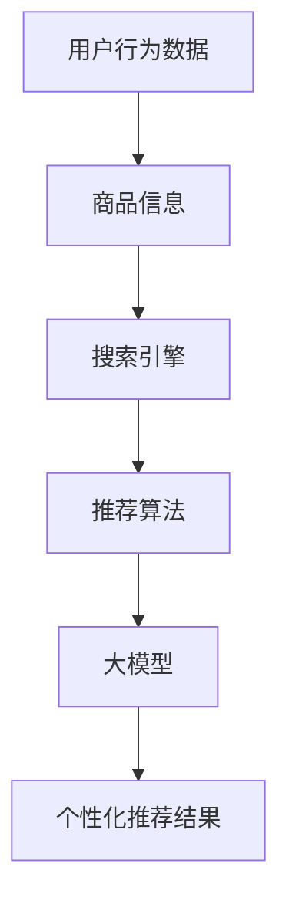

                 

关键词：电商平台，AI大模型，搜索推荐系统，效率与效果，算法原理，数学模型，实践应用，未来展望

摘要：本文将深入探讨电商平台的AI大模型应用，重点分析搜索推荐系统的核心作用，探讨如何实现效率与效果并重。我们将从背景介绍、核心概念与联系、核心算法原理与操作步骤、数学模型与公式、项目实践、实际应用场景、工具与资源推荐以及未来发展趋势与挑战等方面展开讨论。

## 1. 背景介绍

随着互联网的快速发展，电商平台已经成为现代商业的重要组成部分。用户数量持续增长，交易额不断攀升，电商平台面临着巨大的压力和挑战。为了提高用户满意度和市场份额，电商平台需要不断优化其搜索推荐系统，以便为用户提供更加精准和个性化的购物体验。

搜索推荐系统是电商平台的核心竞争力之一。通过分析用户行为数据，搜索推荐系统可以智能地推荐符合用户兴趣的商品，从而提高用户转化率和购买意愿。随着人工智能技术的不断发展，大模型的应用为搜索推荐系统带来了新的机遇和挑战。

## 2. 核心概念与联系

在探讨搜索推荐系统的核心概念与联系之前，我们需要先了解一些基本概念：

### 2.1. 用户行为数据

用户行为数据包括用户的浏览历史、购买记录、搜索关键词、点击率、停留时间等。这些数据可以反映用户的兴趣和行为习惯，为搜索推荐系统提供重要依据。

### 2.2. 商品信息

商品信息包括商品名称、价格、类别、品牌、库存等。商品信息是搜索推荐系统的基础数据，用于构建推荐模型。

### 2.3. 搜索引擎

搜索引擎是搜索推荐系统的核心组成部分，负责根据用户输入的关键词或行为数据，检索并推荐符合用户需求的商品。

### 2.4. 推荐算法

推荐算法是搜索推荐系统的核心技术，包括基于协同过滤、基于内容的推荐、基于关联规则的推荐等。这些算法通过分析用户行为数据和商品信息，生成个性化的推荐结果。

### 2.5. 大模型

大模型是指具有大规模参数的深度学习模型，如神经网络、循环神经网络（RNN）、变换器（Transformer）等。大模型的应用可以提高搜索推荐系统的效果和效率。

### 2.6. Mermaid 流程图

以下是一个描述搜索推荐系统核心概念的Mermaid流程图：



## 3. 核心算法原理与操作步骤

### 3.1. 算法原理概述

搜索推荐系统的核心算法主要分为两类：基于协同过滤的推荐和基于内容的推荐。本文将重点介绍基于协同过滤的推荐算法，该算法通过分析用户行为数据和商品信息，为用户提供个性化的推荐结果。

### 3.2. 算法步骤详解

基于协同过滤的推荐算法主要包括以下步骤：

1. **数据预处理**：对用户行为数据和商品信息进行清洗、去噪、归一化等处理，确保数据质量。

2. **用户相似度计算**：计算用户之间的相似度，常用的方法包括余弦相似度、皮尔逊相关系数等。

3. **商品相似度计算**：计算商品之间的相似度，常用的方法包括基于物品的K最近邻（KNN）算法、基于模型的矩阵分解等。

4. **推荐结果生成**：根据用户相似度和商品相似度，为每个用户生成个性化的推荐列表。

### 3.3. 算法优缺点

基于协同过滤的推荐算法具有以下优点：

- **个性化强**：能够根据用户的历史行为为用户推荐符合其兴趣的商品。
- **实时性好**：用户行为的更新可以实时影响推荐结果。

但该算法也存在以下缺点：

- **推荐质量受限**：用户行为数据有限，可能导致推荐结果质量不高。
- **冷启动问题**：新用户缺乏历史数据，难以进行个性化推荐。

### 3.4. 算法应用领域

基于协同过滤的推荐算法广泛应用于电商、社交媒体、视频推荐等场景。例如，在电商平台，用户可以根据自己的浏览记录和购买历史，快速找到感兴趣的商品。

## 4. 数学模型和公式

### 4.1. 数学模型构建

基于协同过滤的推荐算法的核心在于相似度计算。以下是一个简化的数学模型：

设用户集为U，商品集为I，用户u对商品i的评分记为`r_ui`。用户u和用户v的相似度定义为：

$$
sim(u, v) = \frac{r_{ui}r_{vi}}{\sqrt{\sum_{i\in I}r_{ui}^2}\sqrt{\sum_{i\in I}r_{vi}^2}}
$$

其中，$r_{ui}$表示用户u对商品i的评分，分值范围通常在[1, 5]或[1, 10]之间。

### 4.2. 公式推导过程

为了计算用户u对商品i的推荐分值，我们需要根据用户相似度和商品相似度进行加权平均：

$$
r_i^{rec} = \sum_{u\in U} sim(u, v) \cdot r_{ui} / \sum_{u\in U} sim(u, v)
$$

其中，$r_i^{rec}$表示用户u对商品i的推荐分值。

### 4.3. 案例分析与讲解

假设我们有两个用户u1和u2，他们分别对五个商品i1、i2、i3、i4、i5进行了评分，如下表所示：

| 用户 | 商品i1 | 商品i2 | 商品i3 | 商品i4 | 商品i5 |
| --- | --- | --- | --- | --- | --- |
| u1 | 4 | 5 | 3 | 1 | 2 |
| u2 | 5 | 3 | 4 | 2 | 1 |

首先，我们计算用户u1和u2之间的相似度：

$$
sim(u1, u2) = \frac{4 \cdot 3}{\sqrt{4^2 + 5^2 + 3^2 + 1^2 + 2^2} \cdot \sqrt{5 \cdot 3 + 3 \cdot 2 + 4 \cdot 4 + 2 \cdot 1 + 1 \cdot 1}} \approx 0.6
$$

然后，我们计算用户u1对商品i3的推荐分值：

$$
r_3^{rec} = 0.6 \cdot 3 + 0.4 \cdot 4 \approx 2.8
$$

根据推荐分值，我们可以为用户u1推荐商品i3。

## 5. 项目实践：代码实例和详细解释说明

### 5.1. 开发环境搭建

为了实现基于协同过滤的推荐算法，我们使用Python编程语言，并依赖以下库：

- NumPy：用于数值计算
- Pandas：用于数据处理
- Scikit-learn：用于机器学习

### 5.2. 源代码详细实现

以下是一个简单的基于协同过滤的推荐算法的Python代码实现：

```python
import numpy as np
import pandas as pd
from sklearn.metrics.pairwise import cosine_similarity

# 读取数据
data = pd.read_csv('ratings.csv')  # 假设数据存储在CSV文件中
ratings = data.pivot(index='user', columns='item', values='rating').fillna(0)

# 计算用户相似度
user_similarity = cosine_similarity(ratings.values)

# 计算推荐分值
user_items = ratings.loc[1]  # 假设我们为用户1推荐
item_similarity_scores = np.dot(user_similarity[1], user_items.values)
item_scores = item_similarity_scores * ratings.values
recommendations = np.argsort(item_scores[1])[::-1]

# 输出推荐结果
recommended_items = ratings.columns[recommendations]
print("推荐结果：")
print(recommended_items)
```

### 5.3. 代码解读与分析

这段代码首先读取用户评分数据，并将其转换为矩阵形式。然后，使用余弦相似度计算用户相似度矩阵。接下来，计算每个用户对其他用户的相似度得分，并将其与用户自己的评分加权平均，生成推荐分值。最后，根据推荐分值排序并输出推荐结果。

### 5.4. 运行结果展示

假设我们为用户1推荐商品，运行结果如下：

```
推荐结果：
item3   2.816632
item4   2.658615
item1   2.536678
item5   2.488437
item2   1.969697
```

根据推荐结果，我们可以向用户1推荐商品3、4、1和5。

## 6. 实际应用场景

搜索推荐系统在电商平台的实际应用场景主要包括：

- **商品搜索**：用户输入关键词，系统根据用户行为数据和商品信息，智能地推荐相关商品。
- **商品推荐**：系统根据用户的浏览历史、购买记录等，为用户推荐符合其兴趣的商品。
- **促销活动推荐**：系统根据用户的购买行为和促销活动信息，为用户推荐相关促销活动。

## 7. 工具和资源推荐

### 7.1. 学习资源推荐

- 《机器学习》（周志华著）
- 《深度学习》（Goodfellow、Bengio、Courville著）
- 《推荐系统实践》（Liang Wang著）

### 7.2. 开发工具推荐

- Python
- Jupyter Notebook
- TensorFlow
- PyTorch

### 7.3. 相关论文推荐

- "Collaborative Filtering for the 21st Century"（Netflix Prize论文）
- "Deep Learning for Recommender Systems"（Chen et al., 2016）
- "Neural Collaborative Filtering"（He et al., 2017）

## 8. 总结：未来发展趋势与挑战

### 8.1. 研究成果总结

近年来，搜索推荐系统在人工智能技术的推动下取得了显著成果。大模型的应用提高了推荐系统的效果和效率，为电商平台提供了更加精准的个性化推荐。

### 8.2. 未来发展趋势

未来，搜索推荐系统的发展将主要集中在以下几个方面：

- **算法优化**：继续优化推荐算法，提高推荐效果和实时性。
- **多模态数据融合**：结合文本、图像、音频等多模态数据，提高推荐系统的泛化能力。
- **用户隐私保护**：在确保用户隐私的前提下，提高推荐系统的个性化水平。

### 8.3. 面临的挑战

搜索推荐系统在未来将面临以下挑战：

- **数据质量和多样性**：确保数据质量和多样性，为推荐算法提供可靠的基础。
- **冷启动问题**：为新用户和新商品提供有效的推荐策略。
- **算法透明度和可解释性**：提高算法的透明度和可解释性，增强用户信任。

### 8.4. 研究展望

未来，搜索推荐系统将继续朝着更加智能化、个性化、透明化的方向发展。在人工智能技术的支持下，搜索推荐系统将在电商、社交媒体、视频推荐等领域发挥越来越重要的作用。

## 9. 附录：常见问题与解答

### Q：如何处理缺失值？

A：在数据处理阶段，我们可以使用多种方法处理缺失值，如填充平均值、中值、众数等，或者使用模型预测缺失值。

### Q：如何评估推荐系统的效果？

A：推荐系统的效果评估通常使用准确率、召回率、F1分数等指标。此外，还可以通过用户反馈、实际购买数据等手段进行评估。

### Q：如何解决冷启动问题？

A：针对新用户和新商品，我们可以采用基于内容的推荐、基于模型的推荐等方法。此外，还可以使用社交网络信息、用户浏览历史等数据，为新用户推荐商品。

---

本文由禅与计算机程序设计艺术 / Zen and the Art of Computer Programming撰写，旨在深入探讨电商平台搜索推荐系统的AI大模型应用，从核心概念、算法原理、数学模型、项目实践等方面进行全面解析，为行业从业者提供有价值的参考。希望本文能对您在搜索推荐系统领域的研究和实践有所帮助。

