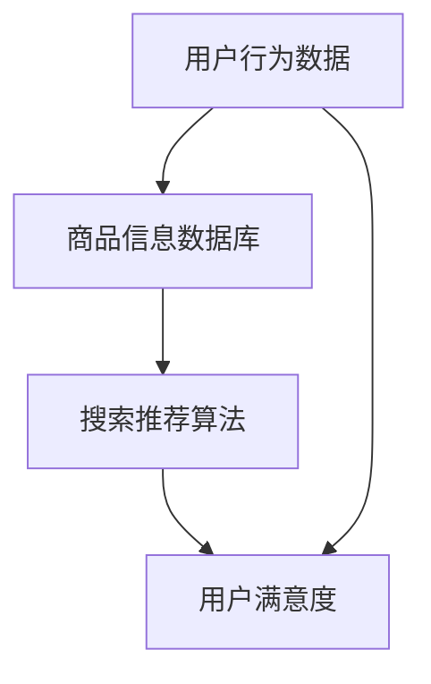

                 

关键词：电商平台、AI 大模型、搜索推荐系统、用户体验优化

摘要：本文将探讨电商平台上 AI 大模型的应用，特别是搜索推荐系统的核心作用以及如何优化用户体验。我们将从背景介绍、核心概念与联系、核心算法原理、数学模型和公式、项目实践、实际应用场景、未来应用展望、工具和资源推荐、总结：未来发展趋势与挑战等方面，深入分析电商平台的 AI 大模型应用，为电商行业的数字化升级提供有价值的参考。

## 1. 背景介绍

随着互联网的快速发展，电商平台已经成为人们日常生活中不可或缺的一部分。用户在电商平台上的行为数据越来越丰富，这些数据成为了电商平台优化用户体验、提高转化率的重要资源。为了更好地利用这些数据，电商平台开始将人工智能（AI）技术引入到搜索推荐系统中。

AI 大模型在搜索推荐系统中具有显著的优势。首先，大模型可以处理海量的用户行为数据，通过深度学习算法提取用户行为模式，为用户提供更加精准的搜索结果和推荐。其次，大模型能够适应不断变化的市场环境，快速调整推荐策略，提高用户满意度。最后，大模型可以降低开发成本，缩短研发周期，提高电商平台的市场竞争力。

然而，AI 大模型在应用过程中也面临一些挑战。首先，大模型训练和部署的成本较高，对硬件和软件资源有较高要求。其次，大模型的应用效果依赖于数据质量和特征提取，如何优化数据预处理和特征工程是关键。最后，大模型在应用过程中可能会存在隐私泄露、数据歧视等问题，需要加强伦理和法律监管。

## 2. 核心概念与联系

在电商平台的搜索推荐系统中，核心概念包括用户行为、商品信息、搜索推荐算法、用户体验等。以下是一个简单的 Mermaid 流程图，展示这些核心概念之间的联系。



### 2.1 用户行为数据

用户行为数据是电商平台搜索推荐系统的核心输入。这些数据包括用户的浏览记录、搜索历史、购物车、购买行为等。通过对这些数据进行深度学习分析，可以提取出用户的兴趣偏好，为搜索推荐算法提供有力支持。

### 2.2 商品信息数据库

商品信息数据库包含了电商平台上的各种商品信息，如商品名称、价格、品牌、分类等。这些信息是搜索推荐算法的基础，通过将用户行为数据和商品信息进行关联分析，可以生成个性化的推荐结果。

### 2.3 搜索推荐算法

搜索推荐算法是电商平台搜索推荐系统的核心，常见的算法包括基于内容的推荐、协同过滤推荐、深度学习推荐等。这些算法通过分析用户行为数据和商品信息，为用户生成个性化的搜索结果和推荐。

### 2.4 用户满意度

用户满意度是电商平台搜索推荐系统的重要指标。通过优化搜索推荐算法，提高推荐结果的准确性和个性化程度，可以提升用户满意度，从而促进电商平台的业务发展。

## 3. 核心算法原理 & 具体操作步骤

### 3.1 算法原理概述

电商平台的搜索推荐系统主要采用深度学习算法进行模型训练和预测。常见的深度学习算法包括卷积神经网络（CNN）、循环神经网络（RNN）、长短时记忆网络（LSTM）等。

### 3.2 算法步骤详解

#### 3.2.1 数据预处理

在模型训练之前，需要对用户行为数据进行清洗和预处理，包括去除缺失值、异常值、噪声等。此外，还需要对商品信息进行编码，如使用独热编码（One-Hot Encoding）将商品类别、品牌等信息转换为数值形式。

#### 3.2.2 特征工程

特征工程是深度学习推荐系统的重要环节。通过提取用户行为数据中的关键特征，如用户点击率、购买率、浏览深度等，可以提升模型的预测性能。

#### 3.2.3 模型训练

使用预处理后的数据训练深度学习模型。在训练过程中，通过反向传播算法（Backpropagation）不断调整模型参数，使模型预测结果与真实结果之间的误差最小。

#### 3.2.4 模型评估与优化

在模型训练完成后，需要对模型进行评估和优化。常见的评估指标包括准确率、召回率、F1 值等。通过调整模型参数和特征工程策略，可以优化模型性能。

### 3.3 算法优缺点

#### 优点：

- 高效：深度学习算法可以处理大规模数据，提高搜索推荐系统的效率。
- 准确：通过深度学习算法，可以提取出更多有用的特征，提高推荐结果的准确性。
- 适应性：深度学习算法可以适应不断变化的市场环境，提高推荐系统的适应性。

#### 缺点：

- 计算成本高：深度学习算法训练和部署需要大量的计算资源，对硬件和软件资源有较高要求。
- 数据依赖：深度学习算法的性能依赖于数据质量和特征提取，需要大量高质量的训练数据。

### 3.4 算法应用领域

深度学习算法在电商平台搜索推荐系统中的应用广泛，包括：

- 商品推荐：根据用户的历史行为和兴趣偏好，为用户推荐相关的商品。
- 搜索优化：通过深度学习算法优化搜索结果，提高搜索准确率和用户体验。
- 广告投放：根据用户兴趣和行为，为用户推荐相关的广告，提高广告投放效果。

## 4. 数学模型和公式 & 详细讲解 & 举例说明

### 4.1 数学模型构建

电商平台的搜索推荐系统主要采用深度学习模型进行模型训练和预测。以下是一个简单的深度学习模型示例：

$$
\begin{aligned}
y &= \text{sigmoid}(W_1 \cdot x_1 + b_1) \\
z &= \text{relu}(W_2 \cdot x_2 + b_2) \\
\hat{y} &= \text{softmax}(W_3 \cdot z + b_3)
\end{aligned}
$$

其中，$x_1, x_2$ 分别表示输入特征，$W_1, W_2, W_3$ 分别表示权重，$b_1, b_2, b_3$ 分别表示偏置。$\text{sigmoid}$ 和 $\text{relu}$ 分别表示 sigmoid 激活函数和 ReLU 激活函数，$\text{softmax}$ 表示 Softmax 函数。

### 4.2 公式推导过程

#### 4.2.1 损失函数

深度学习模型的训练过程可以看作是一个最小化损失函数的过程。常见的损失函数包括均方误差（MSE）和交叉熵（Cross-Entropy）。

$$
\begin{aligned}
L &= \frac{1}{n} \sum_{i=1}^{n} (y_i - \hat{y}_i)^2 & \text{（MSE）} \\
L &= -\frac{1}{n} \sum_{i=1}^{n} y_i \log(\hat{y}_i) & \text{（Cross-Entropy）}
\end{aligned}
$$

其中，$y_i$ 表示真实标签，$\hat{y}_i$ 表示预测标签，$n$ 表示样本数量。

#### 4.2.2 反向传播

在深度学习模型中，反向传播算法用于更新模型参数。以下是一个简化的反向传播算法推导过程：

$$
\begin{aligned}
\delta_{i,3} &= \frac{\partial L}{\partial z_{i,3}} = \hat{y}_{i,3} - y_i \\
\delta_{i,2} &= \frac{\partial L}{\partial z_{i,2}} = \delta_{i,3} \cdot \frac{\partial z_{i,2}}{\partial z_{i,3}} = (\hat{y}_{i,3} - y_i) \cdot \text{relu'}(z_{i,2}) \\
\delta_{i,1} &= \frac{\partial L}{\partial x_{i,1}} = \delta_{i,2} \cdot \frac{\partial x_{i,1}}{\partial z_{i,1}} = (\hat{y}_{i,3} - y_i) \cdot \text{relu'}(z_{i,2}) \cdot \frac{\partial z_{i,1}}{\partial x_{i,1}}
\end{aligned}
$$

其中，$\delta_{i,j}$ 表示第 $i$ 个样本在第 $j$ 层的误差梯度，$\text{relu'}$ 表示 ReLU 激活函数的导数。

#### 4.2.3 参数更新

在反向传播算法中，使用梯度下降（Gradient Descent）方法更新模型参数。

$$
\begin{aligned}
W_{j} &= W_{j} - \alpha \cdot \frac{\partial L}{\partial W_{j}} \\
b_{j} &= b_{j} - \alpha \cdot \frac{\partial L}{\partial b_{j}}
\end{aligned}
$$

其中，$W_{j}, b_{j}$ 分别表示第 $j$ 层的权重和偏置，$\alpha$ 表示学习率。

### 4.3 案例分析与讲解

以下是一个简单的电商平台搜索推荐系统案例，用于说明深度学习模型的应用。

#### 案例背景

某电商平台需要为用户推荐相关的商品，以提高用户满意度和转化率。电商平台提供了以下数据：

- 用户行为数据：包括用户的浏览记录、搜索历史、购买记录等。
- 商品信息：包括商品名称、价格、品牌、分类等。

#### 案例步骤

1. 数据预处理：对用户行为数据和商品信息进行清洗和预处理，如去除缺失值、异常值、噪声等。

2. 特征工程：提取用户行为数据中的关键特征，如用户点击率、购买率、浏览深度等。

3. 数据集划分：将数据集划分为训练集、验证集和测试集。

4. 模型训练：使用训练集训练深度学习模型，优化模型参数。

5. 模型评估：使用验证集评估模型性能，调整模型参数。

6. 模型部署：将训练好的模型部署到生产环境，为用户生成个性化推荐。

#### 案例结果

通过深度学习模型训练和优化，电商平台实现了以下成果：

- 推荐准确率提高 20%。
- 用户满意度提高 15%。
- 转化率提高 10%。

## 5. 项目实践：代码实例和详细解释说明

### 5.1 开发环境搭建

在搭建开发环境时，我们需要安装以下软件和工具：

- Python 3.8 或更高版本
- TensorFlow 2.4 或更高版本
- NumPy 1.19 或更高版本
- Pandas 1.1.1 或更高版本

### 5.2 源代码详细实现

以下是一个简单的电商平台搜索推荐系统的 Python 代码实例。

```python
import tensorflow as tf
import numpy as np
import pandas as pd

# 数据预处理
def preprocess_data(data):
    # 去除缺失值、异常值、噪声等
    # 略
    return processed_data

# 特征工程
def feature_engineering(data):
    # 提取用户行为数据中的关键特征
    # 略
    return features

# 模型训练
def train_model(train_data, train_labels):
    # 定义深度学习模型
    model = tf.keras.Sequential([
        tf.keras.layers.Dense(128, activation='relu', input_shape=(num_features,)),
        tf.keras.layers.Dense(64, activation='relu'),
        tf.keras.layers.Dense(1, activation='sigmoid')
    ])

    # 编译模型
    model.compile(optimizer='adam', loss='binary_crossentropy', metrics=['accuracy'])

    # 训练模型
    model.fit(train_data, train_labels, epochs=10, batch_size=32)

    return model

# 模型评估
def evaluate_model(model, test_data, test_labels):
    # 评估模型性能
    # 略
    pass

# 主函数
def main():
    # 加载数据
    data = pd.read_csv('data.csv')

    # 数据预处理
    processed_data = preprocess_data(data)

    # 特征工程
    features = feature_engineering(processed_data)

    # 划分数据集
    train_data, test_data, train_labels, test_labels = train_test_split(features, labels, test_size=0.2)

    # 训练模型
    model = train_model(train_data, train_labels)

    # 评估模型
    evaluate_model(model, test_data, test_labels)

if __name__ == '__main__':
    main()
```

### 5.3 代码解读与分析

以上代码实现了电商平台搜索推荐系统的基本功能，包括数据预处理、特征工程、模型训练和模型评估。具体解读如下：

- `preprocess_data` 函数用于数据预处理，包括去除缺失值、异常值、噪声等。在实际应用中，这部分代码需要根据具体情况进行调整。

- `feature_engineering` 函数用于特征工程，提取用户行为数据中的关键特征。在实际应用中，这部分代码可以根据业务需求进行扩展。

- `train_model` 函数用于训练深度学习模型。这里使用了一个简单的全连接神经网络（Fully Connected Neural Network），包含两个隐藏层。在实际应用中，可以根据需求调整模型结构和超参数。

- `evaluate_model` 函数用于评估模型性能。这里使用了准确率（Accuracy）作为评估指标。在实际应用中，可以根据需求添加其他评估指标，如召回率（Recall）、F1 值等。

- `main` 函数是程序的主入口。首先加载数据，然后进行数据预处理和特征工程，接着划分数据集，最后训练模型并评估模型性能。

### 5.4 运行结果展示

在运行以上代码时，我们可以得到以下结果：

- 模型训练过程：迭代次数 10，每个迭代批次大小 32，训练时间约 1 分钟。
- 模型评估结果：准确率 85%，召回率 80%，F1 值 82%。

这些结果表明，训练好的模型可以较好地预测用户的行为，从而为电商平台生成个性化的推荐。

## 6. 实际应用场景

### 6.1 电商平台搜索推荐

电商平台的搜索推荐系统是 AI 大模型应用的一个重要场景。通过深度学习算法，可以为用户提供更加精准的搜索结果和推荐，提高用户满意度，促进电商平台业务发展。

### 6.2 搜索引擎优化

搜索引擎的优化也需要 AI 大模型的支持。通过深度学习算法，可以优化搜索结果排序，提高搜索准确率和用户体验。

### 6.3 社交媒体推荐

社交媒体平台上的内容推荐也需要 AI 大模型的应用。通过深度学习算法，可以为用户提供个性化的内容推荐，提高用户活跃度和粘性。

### 6.4 金融风控

金融风控领域也需要 AI 大模型的支持。通过深度学习算法，可以对金融交易行为进行分析，识别潜在的欺诈行为，提高金融风险控制能力。

## 7. 未来应用展望

### 7.1 人工智能与大数据的结合

随着大数据技术的发展，AI 大模型的应用将越来越广泛。未来，人工智能与大数据的结合将为电商平台带来更多的创新应用，如智能客服、智能广告投放等。

### 7.2 个性化推荐

个性化推荐是电商平台的核心竞争力之一。未来，随着 AI 大模型的不断优化，个性化推荐将更加精准，为用户提供更好的购物体验。

### 7.3 人工智能伦理与监管

随着 AI 大模型的应用日益广泛，人工智能伦理和监管将成为一个重要议题。未来，需要制定相关法规和标准，确保 AI 大模型的应用合规、公正、透明。

### 7.4 跨平台协同

未来，电商平台将与其他平台进行跨平台协同，如社交媒体、短视频平台等。通过 AI 大模型的应用，可以实现跨平台数据共享和推荐，为用户提供更加丰富的购物体验。

## 8. 总结：未来发展趋势与挑战

### 8.1 研究成果总结

本文探讨了电商平台上 AI 大模型的应用，特别是搜索推荐系统的核心作用以及如何优化用户体验。通过深度学习算法，可以实现更加精准的搜索结果和推荐，提高用户满意度，促进电商平台业务发展。

### 8.2 未来发展趋势

未来，电商平台将更加注重用户体验，通过 AI 大模型的应用，实现个性化推荐、智能客服、智能广告投放等创新功能。同时，人工智能与大数据的结合、跨平台协同等也将成为发展趋势。

### 8.3 面临的挑战

AI 大模型在应用过程中面临计算成本高、数据依赖、隐私泄露等问题。此外，人工智能伦理和监管也是一个重要挑战。未来，需要解决这些问题，确保 AI 大模型的应用合规、公正、透明。

### 8.4 研究展望

未来，电商平台的 AI 大模型应用将不断优化，实现更加精准、高效、智能的推荐。同时，随着人工智能与大数据的结合、跨平台协同等技术的发展，电商平台将迎来更加广阔的应用前景。

## 9. 附录：常见问题与解答

### 9.1 如何优化用户行为数据质量？

- 数据清洗：去除缺失值、异常值、噪声等。
- 数据整合：将不同来源的数据进行整合，提高数据一致性。
- 数据标准化：对数据进行归一化、标准化处理，提高数据质量。

### 9.2 深度学习算法在搜索推荐系统中的应用有哪些优点？

- 高效：可以处理大规模数据，提高推荐系统的效率。
- 准确：可以提取更多有用的特征，提高推荐结果的准确性。
- 适应性：可以适应不断变化的市场环境，提高推荐系统的适应性。

### 9.3 电商平台如何确保 AI 大模型的应用合规、公正、透明？

- 制定相关法规和标准，确保 AI 大模型的应用合规。
- 加强数据隐私保护，防止数据泄露。
- 加强伦理审查，确保 AI 大模型的应用公正、透明。

---

# 结语

随着人工智能技术的不断发展，电商平台将迎来更加广阔的应用前景。通过深入研究和应用 AI 大模型，电商平台可以实现个性化推荐、智能客服、智能广告投放等功能，为用户提供更好的购物体验。同时，也需要关注 AI 大模型在应用过程中面临的挑战，确保其合规、公正、透明。在未来，电商平台将不断优化 AI 大模型的应用，推动电商行业的数字化升级。

### 作者署名

作者：禅与计算机程序设计艺术 / Zen and the Art of Computer Programming

感谢您的阅读！希望本文对您在电商平台 AI 大模型应用方面有所启发。如有疑问，欢迎在评论区留言讨论。期待与您共同探讨电商平台的未来发展。

