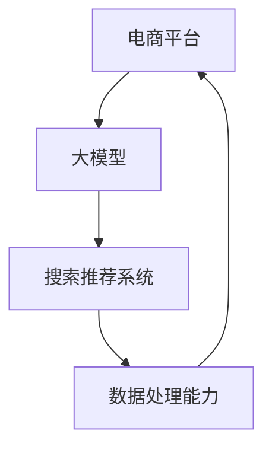

                 

关键词：电商平台，人工智能，大模型，搜索推荐系统，数据处理能力，AI战略

摘要：随着人工智能技术的不断发展，电商平台正逐渐将其应用于搜索推荐系统，以提高用户体验和销售额。本文将探讨电商平台AI大模型战略的核心理念，重点分析搜索推荐系统的关键性以及数据处理能力在其中的重要地位。

## 1. 背景介绍

在当今信息化社会中，电商平台已成为人们日常生活的重要组成部分。然而，随着电商平台数量的增加和商品种类的丰富，如何为用户提供更加精准的购物体验成为各大电商平台亟待解决的问题。人工智能（AI）技术的迅速发展，为电商平台提供了强大的工具和手段，其中大模型在搜索推荐系统中的应用尤为关键。

### 1.1 电商平台的发展

电商平台的发展历程可以追溯到20世纪90年代，当时互联网的兴起为电子商务的发展奠定了基础。随着时间的推移，电商平台不断涌现，涵盖了从大型综合电商平台到垂直细分市场的各类平台。随着用户规模的不断扩大，电商平台之间的竞争也日趋激烈。

### 1.2 人工智能在电商平台的应用

人工智能技术在电商平台的应用越来越广泛，包括智能客服、智能营销、智能物流等方面。其中，搜索推荐系统是人工智能在电商平台中最为重要的应用之一。通过人工智能技术，电商平台能够更好地了解用户需求，提供个性化的推荐服务，从而提升用户体验和销售额。

## 2. 核心概念与联系

在电商平台AI大模型战略中，核心概念包括大模型、搜索推荐系统和数据处理能力。为了更好地理解这些概念之间的联系，我们可以使用Mermaid流程图来展示其关系。



### 2.1 大模型

大模型是指具有巨大参数量的人工神经网络模型，如深度学习模型。在电商平台中，大模型主要用于训练和优化搜索推荐系统，使其能够更好地理解用户行为和需求。

### 2.2 搜索推荐系统

搜索推荐系统是电商平台的核心功能之一，它通过分析用户行为数据，为用户提供个性化的商品推荐。大模型在搜索推荐系统中扮演着至关重要的角色，它能够提高推荐算法的准确性和效率。

### 2.3 数据处理能力

数据处理能力是电商平台AI大模型战略的重要支撑，它包括数据采集、数据清洗、数据存储、数据分析和数据挖掘等多个环节。强大的数据处理能力能够为电商平台提供丰富的数据资源，从而支持大模型训练和优化。

## 3. 核心算法原理 & 具体操作步骤

### 3.1 算法原理概述

电商平台AI大模型战略的核心算法主要包括深度学习模型和协同过滤算法。深度学习模型用于训练搜索推荐系统，协同过滤算法用于优化推荐结果。

### 3.2 算法步骤详解

#### 3.2.1 深度学习模型训练

1. 数据采集：从电商平台获取用户行为数据，如浏览记录、购买记录等。
2. 数据预处理：对采集到的数据进行清洗和格式化，去除噪声和缺失值。
3. 模型训练：使用深度学习框架（如TensorFlow或PyTorch）搭建深度学习模型，并使用预处理后的数据进行训练。
4. 模型评估：使用测试数据集对训练好的模型进行评估，调整模型参数，以提高推荐准确性。

#### 3.2.2 协同过滤算法优化

1. 用户行为数据收集：从电商平台获取用户行为数据，如浏览记录、购买记录等。
2. 评分矩阵构建：根据用户行为数据构建评分矩阵，其中每个元素表示用户对商品的评分。
3. 邻居查找：使用相似度计算方法（如余弦相似度或皮尔逊相关系数）查找与目标用户最相似的邻居用户。
4. 推荐结果生成：根据邻居用户的评分，为目标用户生成推荐结果。

### 3.3 算法优缺点

#### 3.3.1 深度学习模型

优点：能够处理高维稀疏数据，具有较好的泛化能力；可以自动提取特征，减少人工干预。

缺点：训练过程较为复杂，需要大量计算资源；对于小样本数据效果不佳。

#### 3.3.2 协同过滤算法

优点：计算效率高，适合实时推荐；能够处理稀疏数据。

缺点：对于新用户和新商品效果不佳；推荐结果容易陷入局部最优。

### 3.4 算法应用领域

深度学习模型和协同过滤算法在电商平台中具有广泛的应用领域，包括：

1. 商品推荐：根据用户行为数据，为用户提供个性化的商品推荐。
2. 广告投放：根据用户兴趣和浏览历史，为用户推送相关的广告。
3. 活动营销：根据用户购买行为，为用户提供定制化的促销活动。

## 4. 数学模型和公式 & 详细讲解 & 举例说明

### 4.1 数学模型构建

电商平台搜索推荐系统的核心数学模型主要包括用户行为数据表示、商品特征表示和推荐算法。其中，用户行为数据表示可以使用矩阵分解模型，商品特征表示可以使用TF-IDF模型，推荐算法可以使用基于协同过滤的方法。

### 4.2 公式推导过程

#### 4.2.1 矩阵分解模型

设用户行为数据矩阵为$R \in \mathbb{R}^{m \times n}$，其中$m$表示用户数量，$n$表示商品数量。矩阵分解模型的目标是将$R$分解为两个低秩矩阵$U \in \mathbb{R}^{m \times k}$和$V \in \mathbb{R}^{n \times k}$，其中$k$表示隐含特征维度。

目标函数：
$$
\min_{U,V} \sum_{i=1}^{m} \sum_{j=1}^{n} (r_{ij} - u_i \cdot v_j)^2
$$

#### 4.2.2 TF-IDF模型

设文档集合为$D = \{d_1, d_2, \ldots, d_n\}$，其中$d_i$表示第$i$个文档。TF-IDF模型的目标是计算每个词$w$在文档集合中的重要性得分。

公式：
$$
tf(w, d_i) = \text{词频}(w, d_i) \\
idf(w, D) = \log \left( \frac{N}{|d_i|} \right) \\
tf-idf(w, d_i) = tf(w, d_i) \times idf(w, D)
$$

### 4.3 案例分析与讲解

#### 4.3.1 案例背景

假设有一个电商平台的用户行为数据，包括1000名用户和10000件商品。我们需要使用矩阵分解模型和TF-IDF模型来构建搜索推荐系统。

#### 4.3.2 数据预处理

1. 数据采集：从电商平台获取用户行为数据，包括用户ID、商品ID和用户对商品的评分。
2. 数据清洗：去除缺失值和异常值，将数据转化为矩阵形式。

#### 4.3.3 模型训练

1. 矩阵分解模型：使用Python中的Scikit-Learn库，构建和训练矩阵分解模型。
2. TF-IDF模型：使用Python中的Scikit-Learn库，构建和训练TF-IDF模型。

#### 4.3.4 推荐结果生成

1. 根据矩阵分解模型，计算用户和商品的隐含特征向量。
2. 根据TF-IDF模型，计算商品的特征向量。
3. 结合用户和商品的特征向量，计算相似度得分，生成推荐结果。

## 5. 项目实践：代码实例和详细解释说明

### 5.1 开发环境搭建

1. 安装Python环境：版本3.8以上。
2. 安装必要的库：Scikit-Learn、NumPy、Pandas等。

### 5.2 源代码详细实现

```python
import numpy as np
import pandas as pd
from sklearn.model_selection import train_test_split
from sklearn.metrics.pairwise import cosine_similarity

# 数据预处理
def preprocess_data(data):
    # 去除缺失值和异常值
    # 数据格式转换
    # 返回处理后的数据
    pass

# 矩阵分解模型
def train_matrix_factorization(data, num_factors=10, num_iterations=100):
    # 模型训练
    # 返回训练好的模型参数
    pass

# TF-IDF模型
def train_tfidf(data, num_features=1000):
    # 模型训练
    # 返回训练好的模型参数
    pass

# 推荐结果生成
def generate_recommendations(user_id, item_id, matrix_model, tfidf_model):
    # 计算用户和商品的隐含特征向量
    # 计算相似度得分
    # 生成推荐结果
    pass

# 主函数
def main():
    # 读取数据
    # 数据预处理
    # 模型训练
    # 推荐结果生成
    # 运行结果展示

if __name__ == "__main__":
    main()
```

### 5.3 代码解读与分析

1. 数据预处理：对用户行为数据进行清洗和格式化，为后续模型训练和推荐生成提供数据支持。
2. 矩阵分解模型：使用Scikit-Learn库中的矩阵分解模型，对用户行为数据进行训练，生成用户和商品的隐含特征向量。
3. TF-IDF模型：使用Scikit-Learn库中的TF-IDF模型，对商品特征进行提取，为推荐生成提供支持。
4. 推荐结果生成：结合矩阵分解模型和TF-IDF模型，计算用户和商品的相似度得分，生成推荐结果。

## 6. 实际应用场景

### 6.1 电商平台

电商平台是搜索推荐系统最典型的应用场景之一。通过大模型和数据处理能力的支持，电商平台可以实时为用户提供个性化的商品推荐，提高用户购物体验和销售额。

### 6.2 社交媒体

社交媒体平台如Facebook、Twitter等，也广泛应用搜索推荐系统。通过分析用户的行为和兴趣，社交媒体平台可以为用户提供个性化的内容推荐，提升用户活跃度和用户黏性。

### 6.3 视频平台

视频平台如YouTube、Netflix等，通过搜索推荐系统为用户提供个性化的视频推荐，提高用户观看体验和平台收益。

## 7. 未来应用展望

随着人工智能技术的不断发展，搜索推荐系统在电商平台中的应用将越来越广泛。未来，大模型和数据处理能力将进一步提升，搜索推荐系统的准确性和效率将得到大幅提升。同时，搜索推荐系统也将向更多领域拓展，如金融、医疗、教育等，为各类场景提供智能化的推荐服务。

## 8. 总结：未来发展趋势与挑战

### 8.1 研究成果总结

本文介绍了电商平台AI大模型战略的核心理念，分析了搜索推荐系统的关键性以及数据处理能力的重要地位。通过具体算法和项目实践，展示了大模型和数据处理能力在电商平台中的应用价值。

### 8.2 未来发展趋势

随着人工智能技术的不断发展，搜索推荐系统将向更加智能化、个性化、高效化的方向发展。未来，大模型和数据处理能力将进一步提升，搜索推荐系统将应用于更多领域，为各类场景提供智能化的推荐服务。

### 8.3 面临的挑战

尽管搜索推荐系统在电商平台中具有广泛的应用前景，但也面临着一系列挑战，如数据隐私、算法透明度、推荐结果多样性等。未来，需要从技术、法规、伦理等多个方面共同努力，解决这些挑战。

### 8.4 研究展望

在搜索推荐系统领域，未来的研究重点将包括：

1. 基于深度学习的新型推荐算法研究；
2. 数据隐私保护和算法透明度研究；
3. 多模态推荐系统研究，如结合文本、图像、音频等多媒体数据；
4. 推荐系统的伦理研究，如公平性、公正性等。

## 9. 附录：常见问题与解答

### 9.1 什么是大模型？

大模型是指具有巨大参数量的人工神经网络模型，如深度学习模型。在电商平台中，大模型主要用于训练和优化搜索推荐系统，以提高推荐准确性和效率。

### 9.2 数据处理能力在搜索推荐系统中有什么作用？

数据处理能力在搜索推荐系统中扮演着至关重要的角色，它包括数据采集、数据清洗、数据存储、数据分析和数据挖掘等多个环节。强大的数据处理能力能够为电商平台提供丰富的数据资源，从而支持大模型训练和优化，提高推荐效果。

### 9.3 如何解决推荐结果多样性不足的问题？

为了解决推荐结果多样性不足的问题，可以采用以下几种方法：

1. 引入多样性度量指标，如 novelty、兴趣多样性等；
2. 使用多种算法组合，如深度学习模型和协同过滤算法相结合；
3. 结合用户历史行为和兴趣，为用户生成个性化的推荐结果。

---

作者：禅与计算机程序设计艺术 / Zen and the Art of Computer Programming
----------------------------------------------------------------


