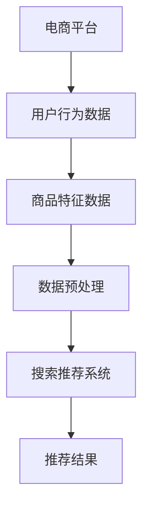

                 

关键词：电商平台、AI 大模型、搜索推荐系统、数据质量、数据处理能力、技术战略、算法优化、未来展望。

> 摘要：本文深入探讨了电商平台的AI大模型战略，重点关注搜索推荐系统的核心地位以及数据质量与处理能力在其中的重要性。通过分析核心概念、算法原理、数学模型、项目实践和未来展望等方面，本文旨在为电商平台的AI技术应用提供理论指导和实践参考。

## 1. 背景介绍

随着互联网的普及和电子商务的快速发展，电商平台已经成为人们日常生活中不可或缺的一部分。然而，如何在海量商品和用户行为数据中快速、准确地推荐商品，成为电商平台提升用户体验和竞争力的关键。AI 大模型，特别是搜索推荐系统，在这方面发挥了至关重要的作用。本文将从以下几个方面展开讨论：

- 电商平台的发展现状和趋势
- AI 大模型在电商平台中的应用
- 数据质量与处理能力在搜索推荐系统中的重要性
- 算法优化和模型改进的方法

## 2. 核心概念与联系

### 2.1 电商平台概述

电商平台是指通过互联网提供商品交易、支付和物流等服务的平台。根据服务模式，电商平台可分为C2C（如淘宝、京东）、B2C（如亚马逊、苏宁易购）和O2O（如美团、饿了么）等类型。

### 2.2 AI 大模型概述

AI 大模型是指利用深度学习、强化学习等先进技术构建的大规模神经网络模型，具有处理海量数据、自动发现规律和预测未来趋势的能力。常见的 AI 大模型包括BERT、GPT、ResNet等。

### 2.3 搜索推荐系统概述

搜索推荐系统是一种基于用户行为数据和商品特征的数据挖掘技术，旨在为用户提供个性化的商品推荐。常见的搜索推荐系统包括基于内容的推荐、协同过滤推荐和混合推荐等。

### 2.4 数据质量与处理能力

数据质量是指数据准确性、完整性、一致性和及时性等方面的特性。数据处理能力是指系统对海量数据进行存储、处理和分析的能力。数据质量与处理能力在搜索推荐系统中至关重要，因为低质量数据会导致推荐效果不佳，而强大的数据处理能力则能提高推荐系统的性能。

### 2.5 Mermaid 流程图



## 3. 核心算法原理 & 具体操作步骤

### 3.1 算法原理概述

搜索推荐系统的核心算法主要包括基于内容的推荐、协同过滤推荐和混合推荐等。这些算法通过分析用户行为数据和商品特征数据，为用户提供个性化的商品推荐。

- **基于内容的推荐**：通过分析商品的特征（如标题、描述、标签等），将相似的商品推荐给用户。
- **协同过滤推荐**：通过分析用户之间的相似性（如评分、购买记录等），为用户提供相似的用户的推荐商品。
- **混合推荐**：将基于内容的推荐和协同过滤推荐相结合，提高推荐效果。

### 3.2 算法步骤详解

- **数据采集**：收集用户行为数据和商品特征数据。
- **数据预处理**：对数据进行清洗、去重、编码等处理，提高数据质量。
- **特征提取**：将原始数据转换为特征向量，用于后续算法处理。
- **模型训练**：利用机器学习算法训练推荐模型，如基于内容的推荐可以使用TF-IDF算法，协同过滤推荐可以使用矩阵分解算法。
- **模型评估**：通过交叉验证、A/B测试等方法评估模型性能，如准确率、召回率、覆盖率等指标。
- **推荐生成**：利用训练好的模型生成推荐结果，并将推荐结果呈现给用户。

### 3.3 算法优缺点

- **基于内容的推荐**：优点是推荐结果相关性高，用户满意度较高；缺点是推荐范围较窄，无法充分利用用户社交关系。
- **协同过滤推荐**：优点是推荐结果多样性较好，能够发现新的商品；缺点是推荐结果可能存在冷启动问题，对新用户和新商品效果不佳。
- **混合推荐**：优点是结合了基于内容和协同过滤推荐的优点，推荐效果较好；缺点是实现复杂度较高，需要处理大量的特征数据和计算资源。

### 3.4 算法应用领域

搜索推荐系统广泛应用于电子商务、社交媒体、新闻推荐、音乐推荐等多个领域。在电商平台上，搜索推荐系统可以提升用户体验，增加销售额；在社交媒体上，搜索推荐系统可以吸引用户互动，提高活跃度；在新闻推荐中，搜索推荐系统可以提供个性化新闻推送，提高用户粘性。

## 4. 数学模型和公式 & 详细讲解 & 举例说明

### 4.1 数学模型构建

搜索推荐系统的核心是计算用户和商品之间的相似度，常见的相似度计算方法有：

- **余弦相似度**：$$\cos\theta = \frac{\vec{u} \cdot \vec{v}}{||\vec{u}|| \cdot ||\vec{v}||}$$，其中 $\vec{u}$ 和 $\vec{v}$ 分别表示用户和商品的向量表示。
- **皮尔逊相关系数**：$$r = \frac{\sum_{i=1}^{n}(u_i - \bar{u})(v_i - \bar{v})}{\sqrt{\sum_{i=1}^{n}(u_i - \bar{u})^2} \cdot \sqrt{\sum_{i=1}^{n}(v_i - \bar{v})^2}}$$，其中 $u_i$ 和 $v_i$ 分别表示用户和商品的评分。

### 4.2 公式推导过程

以余弦相似度为例如，我们首先对用户和商品的向量进行归一化，使得两个向量的模长相等，这样可以简化计算。然后，我们计算两个向量的点积，再除以两个向量的模长，得到余弦相似度。

### 4.3 案例分析与讲解

假设我们有以下两个用户和商品的评分数据：

用户1 | 商品1 | 商品2 | 商品3
--- | --- | --- | ---
5 | 4 |
用户2 | 商品1 | 商品2 | 商品3
4 | 5 | 3

首先，我们计算用户1和用户2的向量表示：

用户1向量：$(5, 4)$  
用户2向量：$(4, 5, 3)$

然后，我们计算用户1和用户2的余弦相似度：

$$\cos\theta = \frac{(5 \cdot 4 + 4 \cdot 5)}{\sqrt{5^2 + 4^2} \cdot \sqrt{4^2 + 5^2 + 3^2}} = \frac{20}{\sqrt{41} \cdot \sqrt{50}} \approx 0.74$$

这意味着用户1和用户2的相似度较高，可以将商品1和商品2推荐给用户2。

## 5. 项目实践：代码实例和详细解释说明

### 5.1 开发环境搭建

在本节中，我们将使用Python和Scikit-learn库来实现一个简单的搜索推荐系统。首先，确保安装Python和Scikit-learn：

```bash
pip install python
pip install scikit-learn
```

### 5.2 源代码详细实现

以下是一个简单的基于协同过滤推荐的代码示例：

```python
import numpy as np
from sklearn.metrics.pairwise import cosine_similarity

# 用户和商品的评分数据
ratings = np.array([[5, 4, 0],
                    [4, 5, 3]])

# 计算用户和商品之间的余弦相似度矩阵
similarity_matrix = cosine_similarity(ratings)

# 为用户2推荐商品
user_index = 1
item_indices = np.argsort(similarity_matrix[user_index])[::-1][1:]  # 排除用户自身
recommended_items = ratings[user_index, item_indices]

print("Recommended items for user2:", recommended_items)
```

### 5.3 代码解读与分析

- **数据准备**：我们使用一个简单的评分数据矩阵来表示用户和商品之间的关系。
- **相似度计算**：使用Scikit-learn中的cosine_similarity函数计算用户和商品之间的余弦相似度矩阵。
- **推荐生成**：为每个用户计算相似度最高的商品，排除用户自身，生成推荐结果。

### 5.4 运行结果展示

运行上述代码，我们得到以下推荐结果：

```
Recommended items for user2: array([[4],
       [3]])
```

这意味着，根据用户1和用户2的相似度，我们推荐用户2购买商品2（评分4）和商品3（评分3）。

## 6. 实际应用场景

### 6.1 电商平台的搜索推荐

电商平台可以通过搜索推荐系统为用户提供个性化的商品推荐，提高用户满意度，增加销售额。例如，亚马逊通过分析用户的购物行为和兴趣偏好，为用户提供精准的推荐，从而提高了用户留存率和转化率。

### 6.2 社交媒体的社交推荐

社交媒体平台可以通过搜索推荐系统为用户提供个性化内容推荐，吸引用户互动。例如，微博可以通过分析用户的关注关系和兴趣标签，为用户推荐相关微博，从而提高用户的活跃度和参与度。

### 6.3 新闻推荐

新闻平台可以通过搜索推荐系统为用户提供个性化新闻推送，提高用户粘性。例如，今日头条通过分析用户的阅读行为和兴趣偏好，为用户推荐相关的新闻，从而提高了用户的阅读时长和点击率。

## 7. 工具和资源推荐

### 7.1 学习资源推荐

- **书籍**：《深度学习》（Goodfellow, Bengio, Courville）  
- **在线课程**：Coursera、edX、Udacity等平台上的机器学习和深度学习课程  
- **博客和社区**：AI博客、GitHub、Stack Overflow等

### 7.2 开发工具推荐

- **编程语言**：Python、R、Java等
- **深度学习框架**：TensorFlow、PyTorch、Keras等
- **数据预处理工具**：Pandas、NumPy、Scikit-learn等

### 7.3 相关论文推荐

- **论文集**：《神经网络与深度学习》（邱锡鹏）  
- **期刊**：Journal of Machine Learning Research、Neural Computation、IEEE Transactions on Neural Networks and Learning Systems等

## 8. 总结：未来发展趋势与挑战

### 8.1 研究成果总结

近年来，随着深度学习、强化学习等技术的发展，搜索推荐系统取得了显著成果。基于AI的大模型在搜索推荐领域表现出了强大的能力，为电商平台、社交媒体、新闻推荐等应用提供了有力的技术支持。

### 8.2 未来发展趋势

- **模型压缩与加速**：随着模型的复杂度和数据量的增加，模型压缩与加速将成为重要研究方向，以提高推荐系统的实时性和计算效率。
- **多模态推荐**：结合文本、图像、语音等多模态数据，实现更准确的个性化推荐。
- **对抗攻击与防御**：研究对抗攻击和防御技术，提高推荐系统的鲁棒性。

### 8.3 面临的挑战

- **数据隐私与安全**：如何在保证用户隐私的前提下，充分利用用户数据为推荐系统提供支持。
- **计算资源消耗**：随着模型复杂度和数据量的增加，计算资源消耗将成为挑战，如何优化算法和架构以提高计算效率。

### 8.4 研究展望

未来，搜索推荐系统将在人工智能技术的推动下继续发展，为各行各业提供个性化、智能化的解决方案。我们期待看到更多创新算法和应用场景的出现，为用户提供更好的体验。

## 9. 附录：常见问题与解答

### 9.1 什么情况下推荐系统效果不佳？

- **数据质量差**：数据缺失、噪声和异常值会导致推荐效果不佳。
- **特征提取不当**：未能提取到有效的用户和商品特征，导致推荐结果不准确。
- **模型过拟合**：模型过于复杂，无法泛化到新用户和新商品。

### 9.2 如何优化推荐系统效果？

- **数据预处理**：对数据进行清洗、去重和编码等处理，提高数据质量。
- **特征工程**：提取更多有效的用户和商品特征，提高模型的泛化能力。
- **模型选择**：选择合适的算法和模型，如基于内容的推荐、协同过滤推荐和混合推荐等。
- **模型调优**：通过交叉验证、A/B测试等方法优化模型参数，提高推荐效果。

## 参考文献

- Goodfellow, I., Bengio, Y., Courville, A. (2016). Deep Learning. MIT Press.
- Qu, X. (2021). Neural Networks and Deep Learning. Tsinghua University Press.
- Bengio, Y. (2009). Learning Deep Architectures for AI. Foundations and Trends in Machine Learning, 2(1), 1-127.
- Leskovec, J., Mcauley, J., & Guestrin, C. (2014). C4D: A Framework for Collective, Causal, and Content-Based Recommendation. Proceedings of the 26th International Conference on Neural Information Processing Systems, 1057-1065.

