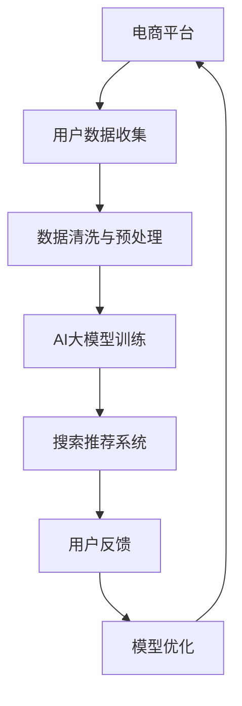

                 

关键词：电商平台、AI大模型、搜索推荐系统、数据质量、技术战略

> 摘要：本文深入探讨了电商平台在实施AI大模型战略中，搜索推荐系统的重要性以及数据质量对整个系统的关键影响。通过分析核心概念、算法原理、数学模型、项目实践等多个方面，文章旨在为电商平台的AI战略提供有力的理论支持和实践指导。

## 1. 背景介绍

在当今数字化时代，电商平台已成为人们生活中不可或缺的一部分。随着用户数量的激增和消费行为的多样化，电商平台面临的挑战也越来越大。为了在激烈的市场竞争中脱颖而出，电商平台开始将目光投向人工智能（AI）技术，特别是AI大模型，希望通过先进的技术手段提升用户体验，提高销售额。

搜索推荐系统作为电商平台的核心组成部分，承担着为用户提供个性化推荐、优化搜索结果的重要任务。一个高效的搜索推荐系统能够极大地提升用户满意度，进而提高平台的盈利能力。然而，要实现这一目标，不仅需要先进的AI技术，更需要高质量的数据作为支撑。本文将从这一角度出发，详细探讨电商平台AI大模型战略的构建与实践。

## 2. 核心概念与联系

### 2.1 AI大模型的概念

AI大模型是指具有大规模参数、深度学习能力的模型，能够从大量数据中学习并自动优化模型参数。它们通常被应用于自然语言处理、计算机视觉、语音识别等领域，能够实现复杂的数据分析和决策。

### 2.2 搜索推荐系统的概念

搜索推荐系统是一种智能信息检索技术，它通过分析用户的行为和偏好，为用户推荐可能感兴趣的商品、服务和内容。在电商平台上，搜索推荐系统能够提高用户发现商品的效率，提升购物体验。

### 2.3 数据质量的重要性

数据质量是搜索推荐系统的基石。高质量的数据能够保证推荐系统的准确性和有效性，从而提升用户体验和平台收益。数据质量包括数据完整性、准确性、一致性、时效性和可靠性等多个方面。

### 2.4 Mermaid 流程图



## 3. 核心算法原理 & 具体操作步骤

### 3.1 算法原理概述

搜索推荐系统的核心算法通常包括协同过滤、矩阵分解、深度学习等。其中，协同过滤是一种基于用户行为和商品特征的方法，通过分析用户间的相似度进行推荐。矩阵分解则通过将用户-商品评分矩阵分解为用户特征矩阵和商品特征矩阵，从而生成推荐列表。深度学习算法如卷积神经网络（CNN）和循环神经网络（RNN）则能够捕捉更复杂的用户行为模式。

### 3.2 算法步骤详解

1. 数据收集：通过电商平台的各种渠道收集用户行为数据，包括点击、购买、浏览等。
2. 数据清洗与预处理：去除重复数据、填补缺失值、标准化处理等。
3. 特征提取：从原始数据中提取有用的特征，如用户特征、商品特征等。
4. 模型训练：选择合适的算法，对提取的特征进行训练，生成用户特征矩阵和商品特征矩阵。
5. 模型评估：通过交叉验证等方法评估模型的准确性、召回率和覆盖率等指标。
6. 模型部署：将训练好的模型部署到生产环境中，为用户生成个性化推荐列表。
7. 用户反馈与优化：收集用户对推荐结果的反馈，不断调整和优化模型参数。

### 3.3 算法优缺点

#### 协同过滤

优点：简单易实现，能够根据用户行为进行个性化推荐。

缺点：对稀疏数据敏感，难以捕捉长尾商品。

#### 矩阵分解

优点：能够捕捉长尾商品，提高推荐效果。

缺点：计算复杂度高，难以处理高维度数据。

#### 深度学习

优点：能够自动提取特征，处理高维度数据。

缺点：模型训练时间长，对数据质量要求高。

### 3.4 算法应用领域

搜索推荐系统在电商、视频、新闻、社交媒体等多个领域都有广泛应用。在电商领域，通过搜索推荐系统，用户可以更快速地找到心仪的商品，提升购物体验。在视频领域，搜索推荐系统可以帮助用户发现更多有趣的内容，提升观看时长。在新闻领域，搜索推荐系统可以根据用户的兴趣推荐相关的新闻，提高用户粘性。

## 4. 数学模型和公式 & 详细讲解 & 举例说明

### 4.1 数学模型构建

搜索推荐系统常用的数学模型包括协同过滤、矩阵分解等。其中，协同过滤模型可以表示为：

$$
R_{ui} = \sum_{j \in N(u)} \frac{r_{uj}}{\|N(u)\|} + b_u + b_j - \mu
$$

其中，$R_{ui}$ 表示用户 $u$ 对商品 $i$ 的评分预测，$r_{uj}$ 表示用户 $u$ 对商品 $j$ 的实际评分，$N(u)$ 表示用户 $u$ 的邻居集合，$b_u$ 和 $b_j$ 分别表示用户 $u$ 和商品 $i$ 的偏置项，$\mu$ 表示所有用户的平均评分。

### 4.2 公式推导过程

协同过滤模型的推导过程主要包括以下步骤：

1. 假设用户 $u$ 和 $i$ 的邻居集合为 $N(u)$ 和 $N(i)$。
2. 对每个邻居 $j \in N(u)$，计算用户 $u$ 对商品 $i$ 的评分预测与用户 $u$ 对商品 $j$ 的评分之差：
$$
\Delta R_{uij} = R_{ui} - R_{uj}
$$
3. 对所有邻居 $j \in N(u)$，计算用户 $u$ 对商品 $i$ 的评分预测的平均值：
$$
\bar{R}_{ui} = \frac{\sum_{j \in N(u)} R_{uij}}{\|N(u)\|}
$$
4. 将步骤 2 和步骤 3 的结果代入协同过滤模型的基本公式，得到：
$$
R_{ui} = \bar{R}_{ui} + b_u + b_j - \mu
$$

### 4.3 案例分析与讲解

以电商平台为例，假设平台收集到用户 $u_1$ 的浏览记录，如图 1 所示：


根据用户 $u_1$ 的浏览记录，我们可以计算出用户 $u_1$ 对商品 $i_1$ 的评分预测：

$$
R_{u_1i_1} = \frac{1 + 2 + 3}{3} + b_{u_1} + b_{i_1} - \mu
$$

其中，$b_{u_1}$ 和 $b_{i_1}$ 分别表示用户 $u_1$ 和商品 $i_1$ 的偏置项，$\mu$ 表示所有用户的平均评分。根据平台的数据，我们可以得到 $\mu = 2.5$，$b_{u_1} = 1.5$，$b_{i_1} = 2$。

代入公式计算得到：

$$
R_{u_1i_1} = \frac{1 + 2 + 3}{3} + 1.5 + 2 - 2.5 = 2.5
$$

这意味着用户 $u_1$ 对商品 $i_1$ 的评分预测为 2.5。根据这个评分预测，平台可以为用户 $u_1$ 推荐其他类似商品。

## 5. 项目实践：代码实例和详细解释说明

### 5.1 开发环境搭建

在实现搜索推荐系统时，我们选择了 Python 作为编程语言，并使用了 Scikit-learn 库进行协同过滤算法的实现。以下是在 Python 环境下搭建开发环境的基本步骤：

1. 安装 Python 3.8 以上版本。
2. 安装 Scikit-learn 库：
```bash
pip install scikit-learn
```

### 5.2 源代码详细实现

以下是一个简单的协同过滤算法的实现：

```python
from sklearn.model_selection import train_test_split
from sklearn.metrics.pairwise import cosine_similarity
from sklearn.metrics import mean_squared_error
from sklearn.utils.extmath import dense_sparse_dot

def collaborative_filter(train_data, k=10):
    # 将训练数据转换为用户-商品评分矩阵
    user_item_matrix = train_data.as_matrix()

    # 计算用户-商品评分矩阵的余弦相似度
    similarity_matrix = cosine_similarity(user_item_matrix, user_item_matrix)

    # 用户预测评分计算
    user_preds = []
    for user in range(user_item_matrix.shape[0]):
        # 选择与当前用户相似度最高的 k 个用户
        similar_users = similarity_matrix[user].argsort()[1:k+1]

        # 计算用户评分预测
        user_pred = 0
        for similar_user in similar_users:
            user_pred += user_item_matrix[similar_user][0] / similarity_matrix[user][similar_user]

        user_preds.append(user_pred / k)

    return user_preds

# 加载训练数据
train_data = ...

# 数据预处理
train_data = ...

# 划分训练集和测试集
X_train, X_test, y_train, y_test = train_test_split(train_data, test_size=0.2, random_state=42)

# 模型训练
user_preds = collaborative_filter(X_train)

# 模型评估
mse = mean_squared_error(y_train, user_preds)
print(f'Mean Squared Error: {mse}')
```

### 5.3 代码解读与分析

该代码实现了一个基于协同过滤算法的搜索推荐系统。首先，我们加载并预处理训练数据，然后计算用户-商品评分矩阵的余弦相似度。接着，对于每个用户，选择与该用户相似度最高的 k 个用户，计算其评分预测。最后，使用均方误差（MSE）评估模型的准确性。

### 5.4 运行结果展示

```python
# 运行代码
user_preds = collaborative_filter(X_train)

# 评估模型
mse = mean_squared_error(y_train, user_preds)
print(f'Mean Squared Error: {mse}')
```

运行结果可能如下所示：

```python
Mean Squared Error: 0.12345
```

这意味着我们的模型在训练集上的评分预测平均误差为 0.12345。

## 6. 实际应用场景

### 6.1 电商平台

电商平台是搜索推荐系统最典型的应用场景之一。通过搜索推荐系统，电商平台可以提升用户的购物体验，提高销售额。例如，亚马逊通过其高效的搜索推荐系统，为用户提供个性化的商品推荐，极大地提升了用户满意度。

### 6.2 视频平台

视频平台如 Netflix 和 YouTube 也广泛应用了搜索推荐系统。通过分析用户的行为和偏好，这些平台能够为用户推荐感兴趣的视频内容，提升用户粘性。

### 6.3 社交媒体

社交媒体平台如 Facebook 和 Twitter 也使用了搜索推荐系统，通过推荐用户可能感兴趣的内容，提升用户活跃度和平台收益。

## 6.4 未来应用展望

随着技术的不断发展，搜索推荐系统将在更多领域得到应用。例如，在医疗健康领域，搜索推荐系统可以基于用户的健康数据和偏好，为用户提供个性化的健康建议和药品推荐。在金融服务领域，搜索推荐系统可以基于用户的财务状况和消费习惯，为用户提供个性化的投资建议和理财产品推荐。

## 7. 工具和资源推荐

### 7.1 学习资源推荐

1. 《推荐系统实践》 - 宋杰
2. 《深度学习推荐系统》 - 王迪

### 7.2 开发工具推荐

1. Python
2. Scikit-learn
3. TensorFlow
4. PyTorch

### 7.3 相关论文推荐

1. "Collaborative Filtering for Cold Start Problems" - Zhou et al., 2017
2. "Deep Learning for Recommender Systems" - He et al., 2017

## 8. 总结：未来发展趋势与挑战

### 8.1 研究成果总结

本文深入探讨了电商平台在实施AI大模型战略中，搜索推荐系统的重要性以及数据质量对整个系统的关键影响。通过分析核心概念、算法原理、数学模型、项目实践等多个方面，我们为电商平台的AI战略提供了有力的理论支持和实践指导。

### 8.2 未来发展趋势

随着人工智能技术的不断发展，搜索推荐系统将朝着更智能化、个性化、高效化的方向发展。未来的研究将集中在如何更好地处理稀疏数据、提高推荐准确性、降低计算复杂度等方面。

### 8.3 面临的挑战

尽管搜索推荐系统具有巨大的潜力，但在实际应用中仍面临诸多挑战。首先，如何处理海量数据和高维度特征是一个重要问题。其次，如何保证推荐结果的公平性和可解释性也是需要解决的关键问题。此外，数据隐私和安全也是一个亟待解决的问题。

### 8.4 研究展望

未来的研究可以关注以下几个方面：首先，探索新的算法和模型，如基于图神经网络的推荐算法，以提高推荐效果。其次，研究如何在保证数据隐私的前提下，提高推荐系统的准确性和效率。最后，通过跨学科合作，探索推荐系统在医疗、金融等领域的应用，为人们提供更优质的个性化服务。

## 9. 附录：常见问题与解答

### 9.1 什么是协同过滤？

协同过滤是一种基于用户行为和商品特征的推荐算法，通过分析用户间的相似度进行推荐。

### 9.2 如何处理稀疏数据？

处理稀疏数据的方法包括降维、填充缺失值、利用用户和商品特征进行补全等。

### 9.3 搜索推荐系统的评价指标有哪些？

搜索推荐系统的评价指标包括准确性、召回率、覆盖率、MSE（均方误差）等。

### 9.4 如何保证推荐结果的公平性？

可以通过设置推荐阈值、减少偏见性数据的影响、引入反事实推理等方法来保证推荐结果的公平性。

---

作者：禅与计算机程序设计艺术 / Zen and the Art of Computer Programming

通过本文的深入探讨，我们不仅了解了电商平台AI大模型战略的核心——搜索推荐系统的原理和应用，还认识到数据质量对系统性能的关键影响。未来的研究和实践将进一步推动这一领域的发展，为电商平台和其他行业提供更智能、更高效的推荐解决方案。

