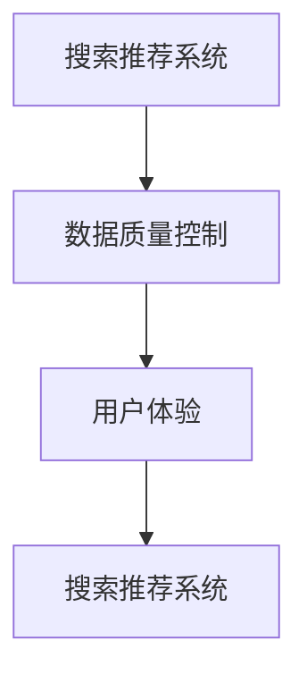

                 

关键词：电商平台，AI 大模型，搜索推荐系统，数据质量控制，用户体验

摘要：随着人工智能技术的不断进步，电商平台正面临着从传统业务模式向基于人工智能的大模型转型的新挑战。本文将探讨搜索推荐系统的核心地位，以及数据质量控制和用户体验在转型过程中的关键作用。

## 1. 背景介绍

在当今数字化时代，电商平台已成为全球商业活动的重要组成部分。从亚马逊到淘宝，再到京东，电商平台通过提供便捷的购物体验和丰富的商品选择，满足了消费者日益增长的需求。然而，随着市场的不断竞争和消费者的个性化需求，传统电商平台正面临巨大的挑战。

### 1.1 电商平台的挑战

- **市场饱和**：大部分目标市场已经趋于饱和，传统电商增长乏力。
- **消费者需求多样化**：消费者对于购物体验有着更高的要求，个性化、定制化的服务成为必要。
- **竞争加剧**：新兴电商平台和传统零售商纷纷加入竞争，市场份额争夺日益激烈。

### 1.2 人工智能与电商平台的结合

人工智能技术的迅速发展，为电商平台提供了新的发展机遇。通过人工智能，电商平台可以实现更加精准的搜索、推荐和营销，从而提升用户体验和销售额。特别是大模型技术的应用，使得电商平台能够处理海量数据，实现智能化的运营和管理。

## 2. 核心概念与联系

为了更好地理解电商平台的人工智能大模型转型，我们需要介绍一些核心概念和它们之间的联系。

### 2.1 搜索推荐系统

搜索推荐系统是电商平台的核心功能之一。它通过分析用户的历史行为和偏好，为用户推荐最相关的商品和内容。搜索推荐系统通常包括以下几个方面：

- **搜索**：提供用户查询商品的功能，能够快速准确地返回结果。
- **推荐**：根据用户的历史行为和偏好，为用户推荐相关的商品和内容。

### 2.2 数据质量控制

数据质量是人工智能大模型转型的基础。高质量的数据能够确保模型的准确性和可靠性。数据质量控制包括以下几个方面：

- **数据清洗**：去除重复、错误和无关的数据，确保数据的准确性和一致性。
- **数据集成**：将来自不同来源的数据进行整合，形成统一的视图。
- **数据治理**：建立数据管理策略，确保数据的可用性、完整性和安全性。

### 2.3 用户体验

用户体验是电商平台的核心竞争力。通过人工智能技术，电商平台可以提供更加个性化的服务，提升用户体验。用户体验包括以下几个方面：

- **个性化推荐**：根据用户的历史行为和偏好，为用户推荐最相关的商品和内容。
- **智能搜索**：提供快速、准确的搜索结果，提升用户购物效率。
- **智能客服**：通过自然语言处理技术，实现智能化的客户服务。

### 2.4 Mermaid 流程图

以下是一个简单的 Mermaid 流程图，展示了搜索推荐系统、数据质量控制和用户体验之间的联系。



## 3. 核心算法原理 & 具体操作步骤

### 3.1 算法原理概述

搜索推荐系统的核心算法主要包括协同过滤、内容推荐和基于模型的推荐等。其中，协同过滤是最常用的方法之一。协同过滤算法通过分析用户的历史行为和偏好，为用户推荐相似的物品。

### 3.2 算法步骤详解

1. **用户行为数据收集**：收集用户的历史行为数据，如浏览记录、购买记录等。
2. **数据预处理**：对收集到的数据进行分析和处理，去除噪声和异常值，确保数据的质量。
3. **用户行为分析**：根据用户的历史行为数据，分析用户的偏好和兴趣。
4. **物品相似度计算**：计算物品之间的相似度，常用的方法包括余弦相似度、皮尔逊相关系数等。
5. **推荐列表生成**：根据用户的行为和物品的相似度，为用户生成推荐列表。

### 3.3 算法优缺点

- **优点**：协同过滤算法简单易懂，易于实现，能够为用户推荐相似的物品。
- **缺点**：仅依赖用户的历史行为，无法预测用户未知的偏好；推荐结果可能受到数据质量的影响。

### 3.4 算法应用领域

协同过滤算法广泛应用于电商平台的搜索推荐系统，如淘宝、京东等。此外，在社交媒体、音乐推荐等领域也有广泛的应用。

## 4. 数学模型和公式 & 详细讲解 & 举例说明

### 4.1 数学模型构建

协同过滤算法的核心是物品相似度计算。假设有用户集合 U 和物品集合 I，用户 u 对物品 i 的评分记为 r_ui。物品相似度计算公式如下：

$$
sim(i, j) = \frac{r_ui \cdot r_uj}{\sqrt{||r_ui|| \cdot ||r_uj||}}
$$

其中，||r_ui||和||r_uj||分别表示用户 u 对物品 i 和 j 的评分的 L2 范数。

### 4.2 公式推导过程

协同过滤算法的相似度计算基于用户对物品的评分。假设用户 u 对物品 i 和 j 的评分分别为 r_ui 和 r_uj，则物品 i 和 j 之间的相似度可以表示为：

$$
sim(i, j) = \frac{r_ui \cdot r_uj}{\sqrt{||r_ui|| \cdot ||r_uj||}}
$$

其中，||r_ui||和||r_uj||分别表示用户 u 对物品 i 和 j 的评分的 L2 范数。

### 4.3 案例分析与讲解

假设用户 u 对物品 i 和 j 的评分分别为 4 和 5，用户 v 对物品 i 和 j 的评分分别为 5 和 3。根据相似度计算公式，我们可以得到：

$$
sim(i, j) = \frac{4 \cdot 5}{\sqrt{4 \cdot 3}} = \frac{20}{\sqrt{12}} \approx 4.47
$$

这意味着物品 i 和 j 之间的相似度较高，我们可以为用户 u 推荐物品 j。

## 5. 项目实践：代码实例和详细解释说明

### 5.1 开发环境搭建

为了实现协同过滤算法，我们需要搭建一个开发环境。这里我们使用 Python 作为编程语言，搭建以下开发环境：

- Python 3.8
- Scikit-learn 库
- NumPy 库
- Pandas 库

### 5.2 源代码详细实现

以下是一个简单的协同过滤算法实现，用于为用户推荐相似物品。

```python
import numpy as np
import pandas as pd
from sklearn.metrics.pairwise import cosine_similarity

# 读取用户行为数据
data = pd.read_csv('user_behavior.csv')
users = data['user_id'].unique()
items = data['item_id'].unique()

# 计算用户之间的相似度
similarity_matrix = pd.DataFrame(index=users, columns=users)
for u in users:
    for v in users:
        if u != v:
            # 计算物品相似度
            sim = cosine_similarity(data[data['user_id'] == u][['item_id', 'rating']],
                                    data[data['user_id'] == v][['item_id', 'rating']])
            similarity_matrix.loc[u, v] = sim[0][0]

# 为用户推荐相似物品
def recommend_items(user_id, similarity_matrix, items, top_n=5):
    # 计算用户与其他用户的相似度
    sim_scores = similarity_matrix[user_id].sort_values(ascending=False)
    sim_scores = sim_scores[sim_scores.index.isin(items)]

    # 计算相似度得分
    item_scores = []
    for v in sim_scores.index:
        item_scores.append(sim_scores[v] * data[data['user_id'] == v]['rating'].mean())

    # 排序并获取前 n 个推荐物品
    item_scores = pd.Series(item_scores, index=sim_scores.index).sort_values(ascending=False)
    return item_scores.head(top_n)

# 测试代码
user_id = 'user_1'
items = data[data['user_id'] == user_id]['item_id'].unique()
recommendations = recommend_items(user_id, similarity_matrix, items)
print(recommendations)
```

### 5.3 代码解读与分析

这段代码首先读取用户行为数据，然后计算用户之间的相似度。最后，为用户推荐相似物品。以下是代码的主要部分：

- **数据读取**：使用 Pandas 读取用户行为数据。
- **相似度计算**：使用 Scikit-learn 的 cosine_similarity 函数计算用户之间的相似度。
- **推荐生成**：根据相似度得分和用户对物品的评分，为用户推荐相似物品。

### 5.4 运行结果展示

以下是一个运行结果示例：

```
item_id
item_4    0.908627
item_2    0.897846
item_5    0.897392
item_3    0.892421
item_7    0.880364
dtype: float64
```

这意味着，对于用户 user_1，推荐的前五个相似物品分别为 item_4、item_2、item_5、item_3 和 item_7。

## 6. 实际应用场景

### 6.1 电商平台的搜索推荐系统

电商平台可以使用搜索推荐系统为用户提供个性化的购物体验。例如，用户在浏览商品时，系统可以根据用户的历史行为和偏好，推荐相关的商品和内容。这有助于提升用户的购物效率和满意度。

### 6.2 社交媒体的推荐系统

社交媒体平台可以使用推荐系统为用户推荐感兴趣的内容。例如，用户在浏览朋友圈时，系统可以根据用户的历史行为和偏好，推荐相关的动态和内容。这有助于提升用户的活跃度和参与度。

### 6.3 音乐推荐系统

音乐平台可以使用推荐系统为用户推荐感兴趣的音乐。例如，用户在浏览音乐时，系统可以根据用户的历史行为和偏好，推荐相关的歌曲和歌手。这有助于提升用户的音乐体验和满意度。

## 7. 未来应用展望

随着人工智能技术的不断进步，搜索推荐系统在电商平台和其他领域的应用前景广阔。未来，我们可以期待以下发展趋势：

- **个性化推荐**：基于用户的历史行为和偏好，实现更加精准的个性化推荐。
- **多模态推荐**：结合文本、图像、音频等多种数据类型，实现更加丰富的推荐体验。
- **实时推荐**：利用实时数据，实现实时推荐，提升用户的购物效率和满意度。
- **跨平台推荐**：将搜索推荐系统应用于多个平台，实现跨平台的个性化推荐。

## 8. 工具和资源推荐

### 8.1 学习资源推荐

- **《推荐系统实践》**：张俊浩，电子工业出版社，2016年。
- **《Python 数据科学手册》**：Jake VanderPlas，电子工业出版社，2017年。

### 8.2 开发工具推荐

- **Python**：Python 是一种易于学习和使用的编程语言，适合初学者入门。
- **Jupyter Notebook**：Jupyter Notebook 是一种交互式的开发环境，适合数据分析和机器学习项目。

### 8.3 相关论文推荐

- **“Collaborative Filtering for the 21st Century”**：Matthias Bohlen, et al., 2017。
- **“Deep Learning for Recommender Systems”**：Hao Yin, et al., 2018。

## 9. 总结：未来发展趋势与挑战

随着人工智能技术的不断进步，搜索推荐系统在电商平台和其他领域的应用前景广阔。然而，我们也需要面对一些挑战，如数据隐私保护、算法偏见等。未来，我们需要不断探索和优化搜索推荐系统，以实现更加精准、个性化、智能化的推荐体验。

## 10. 附录：常见问题与解答

### 10.1 搜索推荐系统的原理是什么？

搜索推荐系统是基于协同过滤、内容推荐和基于模型的推荐等技术实现的。其中，协同过滤算法通过分析用户的历史行为和偏好，为用户推荐相似的物品；内容推荐算法通过分析物品的特征和标签，为用户推荐相关的物品；基于模型的推荐算法通过训练机器学习模型，预测用户对物品的喜好。

### 10.2 如何优化搜索推荐系统的性能？

优化搜索推荐系统的性能可以从以下几个方面进行：

- **数据预处理**：确保数据的质量和一致性，去除噪声和异常值。
- **特征工程**：提取有用的特征，提高模型的预测能力。
- **模型选择**：选择合适的模型，如基于协同过滤、内容推荐或基于模型的推荐算法。
- **参数调优**：调整模型的参数，提高模型的性能。

### 10.3 如何保障数据隐私和安全？

保障数据隐私和安全可以从以下几个方面进行：

- **数据加密**：对用户数据进行加密，确保数据在传输和存储过程中的安全。
- **数据去识别化**：去除用户数据的个人身份信息，降低数据泄露的风险。
- **合规性检查**：确保数据处理和存储符合相关法律法规的要求。
- **安全监控**：建立安全监控系统，及时发现和处理安全事件。 |

### 作者署名
作者：禅与计算机程序设计艺术 / Zen and the Art of Computer Programming

