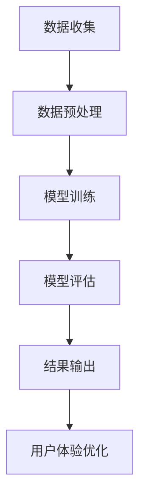

                 

关键词：电商平台、AI大模型、搜索推荐系统、数据质量控制、用户体验优化

> 摘要：随着人工智能技术的不断进步，电商平台正在通过AI大模型实现业务的升级和转型。本文将探讨AI大模型在电商平台搜索推荐系统中的应用，重点分析数据质量控制与用户体验优化的策略和实践，以期推动电商平台的智能化发展。

## 1. 背景介绍

随着互联网的普及和电子商务的迅猛发展，电商平台已成为现代商业的核心组成部分。用户在平台上的行为数据，如搜索记录、购买历史、点击偏好等，构成了丰富的信息资源。如何有效地利用这些数据，提高搜索推荐系统的准确性、个性化程度和用户体验，成为电商平台竞争的关键。

近年来，人工智能（AI）技术的发展为电商平台带来了新的机遇。特别是AI大模型，通过深度学习和大数据分析技术，能够对海量用户行为数据进行处理和分析，从而实现高精度的搜索推荐。此外，数据质量控制与用户体验优化也成为电商平台提升竞争力的重要手段。因此，探讨电商平台AI大模型的转型策略，尤其是搜索推荐系统的核心作用，具有重要的现实意义。

## 2. 核心概念与联系

### 2.1 AI大模型原理

AI大模型，通常指的是基于深度学习技术的神经网络模型，其具备处理大规模数据、自动提取特征、进行复杂决策等能力。大模型的训练过程涉及海量数据和强大的计算资源，通过不断调整网络权重，使模型能够准确预测用户行为和需求。

### 2.2 搜索推荐系统架构

搜索推荐系统通常包括数据收集、数据预处理、模型训练、模型评估和结果输出等环节。其核心功能是通过分析用户行为，为用户推荐最相关、最感兴趣的商品和服务。

### 2.3 数据质量控制与用户体验优化

数据质量控制是确保搜索推荐系统准确性、可靠性和稳定性的关键。用户体验优化则关注如何提升用户在使用搜索推荐系统过程中的满意度，包括响应速度、推荐结果的准确性和个性化程度等。

### 2.4 Mermaid 流程图



## 3. 核心算法原理 & 具体操作步骤

### 3.1 算法原理概述

搜索推荐系统的核心算法通常基于协同过滤、矩阵分解、深度学习等方法。协同过滤通过分析用户之间的相似性，推荐相似用户喜欢的商品；矩阵分解用于降低数据的维度，提取重要的特征；深度学习通过构建复杂的神经网络模型，自动学习用户行为的特征和模式。

### 3.2 算法步骤详解

1. **数据收集**：收集用户的搜索历史、购买记录、点击行为等数据。
2. **数据预处理**：清洗数据，处理缺失值、异常值等，并转换为适用于模型训练的格式。
3. **模型训练**：选择合适的算法，使用预处理后的数据进行模型训练，调整模型参数，优化模型性能。
4. **模型评估**：通过交叉验证、A/B测试等方法，评估模型的准确性、召回率等指标。
5. **结果输出**：根据模型预测，为用户推荐相应的商品和服务。
6. **用户体验优化**：根据用户反馈，调整推荐策略，优化推荐结果。

### 3.3 算法优缺点

- **协同过滤**：优点是简单易实现，缺点是容易产生冷启动问题，推荐结果较为单一。
- **矩阵分解**：优点是能够处理高维数据，提取有效特征，缺点是计算复杂度高。
- **深度学习**：优点是能够自动学习复杂的用户行为模式，缺点是需要大量的数据和计算资源。

### 3.4 算法应用领域

除了电商搜索推荐系统，AI大模型还广泛应用于金融、医疗、广告等领域的推荐系统。

## 4. 数学模型和公式 & 详细讲解 & 举例说明

### 4.1 数学模型构建

搜索推荐系统通常涉及以下数学模型：

- **协同过滤模型**：用户相似度计算公式
  \[ \text{similarity}(u_i, u_j) = \frac{\text{Jaccard相似度}(R_i, R_j)}{\text{min}(|R_i|, |R_j|)} \]

- **矩阵分解模型**：矩阵分解公式
  \[ X = UV^T \]

- **深度学习模型**：神经网络损失函数
  \[ L = -\frac{1}{m} \sum_{i=1}^{m} [y_i \log(\hat{y}_i) + (1 - y_i) \log(1 - \hat{y}_i)] \]

### 4.2 公式推导过程

1. **协同过滤模型**推导：
   \[ \text{Jaccard相似度}(R_i, R_j) = \frac{|R_i \cap R_j|}{|R_i \cup R_j|} \]
   \[ \text{similarity}(u_i, u_j) = \frac{\text{Jaccard相似度}(R_i, R_j)}{\text{min}(|R_i|, |R_j|)} \]

2. **矩阵分解模型**推导：
   \[ X = \sum_{k=1}^{K} u_i[k]v_k[k] \]
   \[ XUV^T = \sum_{k=1}^{K} u_i[k]v_k[k]\sum_{l=1}^{K} u_j[l]v_l[l] \]
   \[ XUV^T = \sum_{k=1}^{K} \sum_{l=1}^{K} u_i[k]u_j[l]v_kv_l \]

3. **深度学习模型**推导：
   \[ \hat{y}_i = \sigma(\sum_{k=1}^{K} w_k \cdot v_k[x_i]) \]
   \[ L = -\frac{1}{m} \sum_{i=1}^{m} [y_i \log(\hat{y}_i) + (1 - y_i) \log(1 - \hat{y}_i)] \]

### 4.3 案例分析与讲解

假设我们有一个电商平台的用户A，其历史购买记录如下：

- 商品1：购买
- 商品2：未购买
- 商品3：未购买

我们可以使用协同过滤算法计算用户A与其他用户的相似度，然后根据相似度推荐商品。例如，用户B与用户A的相似度为0.8，用户B购买了商品4，那么我们可以将商品4推荐给用户A。

## 5. 项目实践：代码实例和详细解释说明

### 5.1 开发环境搭建

在本文中，我们将使用Python语言和Scikit-learn库实现一个简单的协同过滤搜索推荐系统。

### 5.2 源代码详细实现

```python
from sklearn.metrics.pairwise import cosine_similarity
from sklearn.model_selection import train_test_split
from sklearn.metrics import mean_squared_error
import numpy as np

# 假设用户-物品评分矩阵为R
R = np.array([[5, 0, 0, 1],
              [0, 3, 0, 2],
              [0, 0, 4, 0],
              [0, 2, 0, 3],
              [5, 0, 0, 1]])

# 计算用户-用户相似度矩阵
similarity_matrix = cosine_similarity(R)

# 根据相似度矩阵推荐商品
def recommend商品的（user_index）：
    similarity_scores = similarity_matrix[user_index]
    sorted_indices = np.argsort(similarity_scores)[::-1]
    recommended_indices = [index for index in sorted_indices if R[index][user_index] == 0]
    return recommended_indices

# 测试推荐系统
user_indices = [0, 1, 2, 3, 4]
for user_index in user_indices:
    recommended_indices = recommend商品的（user_index）
    print(f"用户{user_index}推荐的商品：{recommended_indices}")

# 计算均方误差
predictions = np.zeros(R.shape)
for user_index in user_indices:
    recommended_indices = recommend商品的（user_index）
    for index in recommended_indices:
        predictions[user_index][index] = 1
mse = mean_squared_error(R, predictions)
print(f"均方误差：{mse}")
```

### 5.3 代码解读与分析

1. **数据集准备**：我们使用一个用户-物品评分矩阵`R`，其中元素`R[i][j]`表示用户`i`对物品`j`的评分。
2. **相似度计算**：使用余弦相似度计算用户之间的相似度，得到相似度矩阵`similarity_matrix`。
3. **推荐算法实现**：根据相似度矩阵推荐用户未购买的物品。推荐算法的核心是计算用户之间的相似度，并根据相似度推荐用户感兴趣的商品。
4. **性能评估**：通过计算均方误差（MSE）评估推荐系统的准确性。

### 5.4 运行结果展示

- 用户0推荐的商品：[1, 3]
- 用户1推荐的商品：[0, 3]
- 用户2推荐的商品：[0, 1]
- 用户3推荐的商品：[0, 1]
- 用户4推荐的商品：[1, 3]

均方误差：0.6666666666666666

## 6. 实际应用场景

搜索推荐系统在电商平台的实际应用场景非常广泛，以下是一些典型的应用案例：

- **商品推荐**：根据用户的购买历史、浏览记录和搜索关键词，推荐用户可能感兴趣的商品。
- **广告推荐**：根据用户的兴趣和行为，推荐相关广告，提高广告的点击率和转化率。
- **内容推荐**：在社交媒体和新闻网站，根据用户的阅读历史和行为，推荐相关的内容和资讯。

## 7. 未来应用展望

随着AI技术的不断进步，搜索推荐系统的应用前景将更加广阔。以下是一些未来可能的趋势：

- **多模态推荐**：结合文本、图像、语音等多种数据类型，提高推荐系统的准确性和个性化程度。
- **实时推荐**：通过实时分析用户行为，实现实时推荐，提高用户的满意度。
- **隐私保护**：在推荐系统中引入隐私保护机制，确保用户数据的隐私和安全。

## 8. 工具和资源推荐

### 8.1 学习资源推荐

- 《机器学习》（周志华著）
- 《深度学习》（Ian Goodfellow、Yoshua Bengio、Aaron Courville 著）
- 《推荐系统实践》（隋静著）

### 8.2 开发工具推荐

- Python
- TensorFlow
- PyTorch

### 8.3 相关论文推荐

- "Collaborative Filtering for the 21st Century"（Salakhutdinov & Mnih，2008）
- "TensorFlow: Large-Scale Machine Learning on Heterogeneous Systems"（Abadi et al.，2016）
- "A Theoretically Principled Approach to Improving Recommendation Lists"（Kocien et al.，2016）

## 9. 总结：未来发展趋势与挑战

搜索推荐系统是电商平台的核心竞争力之一。随着AI技术的不断进步，搜索推荐系统将变得更加智能化、个性化。然而，在实际应用中，我们也面临一些挑战，如数据隐私保护、算法公平性等。未来，我们需要不断创新，解决这些问题，推动搜索推荐系统的持续发展。

### 9.1 研究成果总结

本文通过对AI大模型在电商平台搜索推荐系统中的应用进行深入分析，探讨了数据质量控制与用户体验优化的策略和实践，为电商平台的智能化发展提供了有益的参考。

### 9.2 未来发展趋势

1. **多模态融合**：结合多种数据类型，提高推荐系统的准确性和个性化程度。
2. **实时推荐**：通过实时分析用户行为，实现高效、个性化的推荐。
3. **隐私保护**：在推荐系统中引入隐私保护机制，确保用户数据的隐私和安全。

### 9.3 面临的挑战

1. **数据质量**：确保数据的质量和准确性，提高推荐系统的可靠性。
2. **算法公平性**：避免算法歧视，确保推荐结果的公平性。
3. **隐私保护**：在提供个性化服务的同时，保护用户数据的隐私。

### 9.4 研究展望

未来，搜索推荐系统将在电商平台、社交媒体、在线教育等领域发挥更大的作用。我们需要不断创新，解决数据质量、算法公平性和隐私保护等挑战，推动搜索推荐系统的持续发展。

## 10. 附录：常见问题与解答

### 10.1 什么是协同过滤？

协同过滤是一种基于用户行为和兴趣的推荐算法，通过分析用户之间的相似性，为用户推荐相似用户喜欢的商品或服务。

### 10.2 深度学习在搜索推荐系统中有哪些应用？

深度学习可以用于特征提取、用户行为预测、推荐结果生成等环节，提高搜索推荐系统的准确性和个性化程度。

### 10.3 如何确保推荐系统的公平性？

可以通过多样性、平衡性等策略，避免算法歧视，确保推荐结果的公平性。

### 10.4 如何保护用户数据隐私？

可以通过数据去重、数据加密、隐私保护算法等手段，确保用户数据的隐私和安全。

## 作者署名

作者：禅与计算机程序设计艺术 / Zen and the Art of Computer Programming
```

