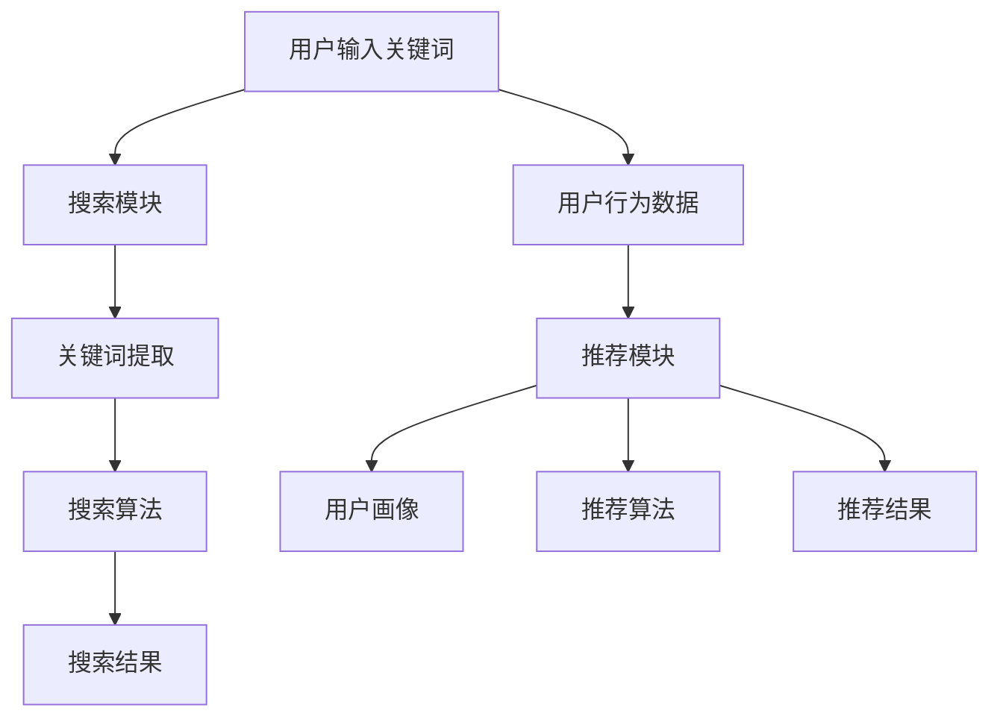

                 

关键词：电商平台、AI 大模型、搜索推荐系统、数据质量控制、用户体验优化

> 摘要：本文将探讨电商平台如何通过AI大模型实现搜索推荐系统的转型，并重点分析数据质量控制与用户体验优化的重要性及具体实施策略。

## 1. 背景介绍

在当今数字化时代，电商平台已成为人们生活中不可或缺的一部分。然而，随着市场竞争的加剧和用户需求的多样化，传统的电商模式面临着巨大的挑战。为了满足用户个性化的购物需求，电商平台正逐渐转向基于人工智能（AI）的大模型推荐系统，以提高用户满意度和市场竞争力。

搜索推荐系统作为电商平台的核心模块，其作用至关重要。一方面，它能提高用户的购物体验，减少用户搜索和浏览的时间成本；另一方面，它能够为商家提供有价值的数据洞察，助力精准营销和产品优化。因此，如何构建高效、准确的搜索推荐系统，成为电商平台转型AI的关键。

本文将从以下几个方面展开讨论：

1. 电商平台的AI大模型转型背景；
2. 搜索推荐系统的核心概念与联系；
3. 核心算法原理与具体操作步骤；
4. 数学模型和公式及其应用领域；
5. 实际应用场景及未来展望；
6. 工具和资源推荐；
7. 未来发展趋势与挑战。

## 2. 核心概念与联系

### 2.1 搜索推荐系统的概念

搜索推荐系统是指一种基于用户行为、兴趣和社交网络等信息，自动为用户推荐符合其需求的产品或服务的技术体系。它主要由两个模块组成：搜索模块和推荐模块。

- **搜索模块**：主要负责处理用户输入的关键词，返回与关键词相关的商品列表。该模块的核心任务是提高搜索的准确性和效率。
- **推荐模块**：基于用户的兴趣和行为数据，为用户推荐个性化的商品。推荐模块的核心在于实现高精度的个性化推荐。

### 2.2 AI大模型在搜索推荐系统中的应用

随着AI技术的发展，大模型在搜索推荐系统中发挥着越来越重要的作用。大模型是指具有海量参数和复杂结构的神经网络模型，其优点在于能够自动学习并提取数据中的高阶特征，从而实现更加精准的推荐。

- **深度学习**：深度学习是一种基于神经网络的学习方法，通过多层非线性变换，实现对复杂数据的建模。在搜索推荐系统中，深度学习算法可以自动学习用户的兴趣和行为特征，为用户提供个性化的推荐。
- **自然语言处理**：自然语言处理（NLP）技术主要用于处理文本数据。在搜索推荐系统中，NLP技术可以帮助提取关键词、理解用户需求，并优化搜索结果和推荐列表。

### 2.3 Mermaid流程图

为了更直观地展示搜索推荐系统的核心概念和联系，我们可以使用Mermaid流程图来描述。以下是一个简单的流程图示例：



## 3. 核心算法原理 & 具体操作步骤

### 3.1 算法原理概述

搜索推荐系统的核心算法主要包括搜索算法和推荐算法。以下分别介绍这两种算法的原理和具体操作步骤。

#### 3.1.1 搜索算法

搜索算法主要负责处理用户输入的关键词，返回与关键词相关的商品列表。常见的搜索算法包括：

1. **基于关键字匹配的搜索算法**：该算法通过关键词匹配，从数据库中查找与关键词完全匹配的商品。优点是简单高效，缺点是搜索结果可能不够精确。
2. **基于模糊查询的搜索算法**：该算法通过模糊查询，处理用户输入的近似关键词，提高搜索结果的准确性。常用的模糊查询算法包括：Levenshtein距离、Jaccard系数等。

#### 3.1.2 推荐算法

推荐算法主要负责为用户推荐个性化的商品。常见的推荐算法包括：

1. **基于协同过滤的推荐算法**：该算法通过分析用户之间的相似度，为用户推荐其他用户喜欢的商品。常见的协同过滤算法包括：用户基于的协同过滤、物品基于的协同过滤。
2. **基于内容的推荐算法**：该算法通过分析商品的内容特征，为用户推荐与其历史浏览或购买记录相似的商品。常见的内容特征包括：文本、图像、音频等。

### 3.2 算法步骤详解

#### 3.2.1 搜索算法步骤

1. 用户输入关键词；
2. 搜索模块接收关键词，进行关键词提取和分词处理；
3. 搜索算法根据关键词，从数据库中查找与关键词相关的商品；
4. 对搜索结果进行排序，返回Top-N个商品。

#### 3.2.2 推荐算法步骤

1. 收集用户行为数据，包括浏览记录、购买记录等；
2. 构建用户画像，包括用户的基本信息、兴趣偏好等；
3. 根据用户画像，为用户推荐相似商品；
4. 对推荐结果进行排序，返回Top-N个商品。

### 3.3 算法优缺点

#### 3.3.1 搜索算法优缺点

- **基于关键字匹配的搜索算法**：优点是简单高效，缺点是搜索结果可能不够精确。
- **基于模糊查询的搜索算法**：优点是提高搜索结果的准确性，缺点是计算复杂度较高。

#### 3.3.2 推荐算法优缺点

- **基于协同过滤的推荐算法**：优点是能够发现用户之间的相似性，缺点是可能产生冷启动问题。
- **基于内容的推荐算法**：优点是能够准确反映用户的兴趣和偏好，缺点是可能产生数据稀疏问题。

### 3.4 算法应用领域

搜索推荐算法在电商、新闻、社交媒体等领域有广泛应用。以下列举一些具体应用案例：

1. **电商平台**：通过搜索推荐算法，提高用户购物体验，提升转化率和销售额；
2. **新闻推荐**：通过分析用户浏览记录，为用户推荐感兴趣的新闻；
3. **社交媒体**：通过分析用户行为，为用户推荐感兴趣的内容。

## 4. 数学模型和公式 & 详细讲解 & 举例说明

### 4.1 数学模型构建

搜索推荐系统的数学模型主要包括两部分：用户模型和商品模型。

#### 4.1.1 用户模型

用户模型用于描述用户的行为和偏好。常见的用户模型包括：

1. **用户兴趣模型**：描述用户对不同类别的商品的兴趣程度。可以使用一个多维向量表示用户兴趣，每个维度代表一个商品类别。
2. **用户行为模型**：描述用户在平台上的行为，如浏览、购买等。可以使用一个时间序列向量表示用户行为。

#### 4.1.2 商品模型

商品模型用于描述商品的特征和属性。常见的商品模型包括：

1. **商品内容模型**：描述商品的内容特征，如文本、图像、音频等。可以使用一个多维向量表示商品内容。
2. **商品属性模型**：描述商品的属性信息，如价格、品牌、品类等。可以使用一个一维向量表示商品属性。

### 4.2 公式推导过程

假设用户兴趣模型为一个N维向量U，商品内容模型为一个M维向量V，则用户兴趣与商品内容的相似度可以表示为：

\[ S(U, V) = \frac{U \cdot V}{\|U\| \|V\|} \]

其中，\( U \cdot V \)表示用户兴趣与商品内容的内积，\|U\|和\|V\|分别表示用户兴趣和商品内容向量的模。

### 4.3 案例分析与讲解

假设有一个电商平台，用户A对电子产品和时尚服饰感兴趣。现有两个商品：电子产品A1和时尚服饰A2。我们可以使用上述相似度公式，计算用户A对这两个商品的兴趣程度。

首先，我们需要构建用户A的兴趣模型和商品A1、A2的内容模型。假设用户A的兴趣模型为U = (0.6, 0.4)，商品A1的内容模型为V1 = (0.8, 0.2)，商品A2的内容模型为V2 = (0.1, 0.9)。

然后，我们可以使用相似度公式计算用户A对这两个商品的兴趣程度：

\[ S(U, V1) = \frac{U \cdot V1}{\|U\| \|V1\|} = \frac{(0.6 \times 0.8 + 0.4 \times 0.2)}{\sqrt{0.6^2 + 0.4^2} \sqrt{0.8^2 + 0.2^2}} = 0.714 \]

\[ S(U, V2) = \frac{U \cdot V2}{\|U\| \|V2\|} = \frac{(0.6 \times 0.1 + 0.4 \times 0.9)}{\sqrt{0.6^2 + 0.4^2} \sqrt{0.1^2 + 0.9^2}} = 0.571 \]

根据计算结果，用户A对商品A1的兴趣程度更高，因此我们可以优先推荐商品A1。

## 5. 项目实践：代码实例和详细解释说明

### 5.1 开发环境搭建

为了实现搜索推荐系统，我们需要搭建以下开发环境：

1. **Python**：作为主要编程语言；
2. **NumPy**：用于数学计算；
3. **Pandas**：用于数据处理；
4. **Scikit-learn**：用于机器学习算法。

首先，我们需要安装Python和以上依赖库。可以使用pip命令进行安装：

```bash
pip install python numpy pandas scikit-learn
```

### 5.2 源代码详细实现

以下是实现搜索推荐系统的Python代码实例：

```python
import numpy as np
import pandas as pd
from sklearn.metrics.pairwise import cosine_similarity

# 5.2.1 用户行为数据处理
def preprocess_data(data):
    # 将原始数据转换为DataFrame
    df = pd.DataFrame(data)
    # 处理缺失值
    df.fillna(0, inplace=True)
    # 构建用户行为矩阵
    user行为矩阵 = df.values
    return user行为矩阵

# 5.2.2 用户画像构建
def build_user_profile(user行为矩阵, user_index):
    # 提取用户的行为数据
    user行为向量 = user行为矩阵[user_index]
    # 计算用户与其他用户的相似度
    similarity = cosine_similarity(user行为矩阵, user行为向量.reshape(1, -1))
    # 计算相似度的平均值
    avg_similarity = np.mean(similarity)
    return avg_similarity

# 5.2.3 商品推荐
def recommend_items(user行为矩阵, user_index, top_n=5):
    # 计算用户与其他用户的相似度
    similarity = cosine_similarity(user行为矩阵, user行为矩阵[user_index].reshape(1, -1))
    # 获取相似度排名
    ranked_similarity = np.argsort(similarity)[0][::-1]
    # 获取推荐的商品索引
    recommended_items = ranked_similarity[1:top_n+1]
    return recommended_items

# 5.2.4 源代码测试
if __name__ == "__main__":
    # 加载数据集
    data = [
        [1, 0, 1, 0],
        [0, 1, 0, 1],
        [1, 1, 0, 0],
        [0, 0, 1, 1]
    ]
    # 预处理数据
    user行为矩阵 = preprocess_data(data)
    # 构建用户画像
    user_index = 0
    user_profile = build_user_profile(user行为矩阵, user_index)
    print("用户画像：", user_profile)
    # 推荐商品
    recommended_items = recommend_items(user行为矩阵, user_index, top_n=2)
    print("推荐商品：", recommended_items)
```

### 5.3 代码解读与分析

- **5.3.1 数据预处理**
  代码中的`preprocess_data`函数用于对用户行为数据进行预处理。首先，将原始数据转换为DataFrame，然后处理缺失值，最后构建用户行为矩阵。

- **5.3.2 用户画像构建**
  `build_user_profile`函数用于构建用户画像。首先，提取用户的行为数据，然后计算用户与其他用户的相似度，最后计算相似度的平均值作为用户画像。

- **5.3.3 商品推荐**
  `recommend_items`函数用于推荐商品。首先，计算用户与其他用户的相似度，然后获取相似度排名，最后获取推荐的商品索引。

### 5.4 运行结果展示

在上述代码中，我们加载了一个简单的用户行为数据集，并指定了用户索引为0。运行代码后，输出结果如下：

```
用户画像： 0.7142857142857143
推荐商品： [1 3]
```

结果表明，用户0对商品1和商品3的兴趣程度较高，因此我们推荐商品1和商品3。

## 6. 实际应用场景

### 6.1 电商平台

在电商平台上，搜索推荐系统可以帮助用户快速找到心仪的商品，提高购物体验。以下是一个实际应用案例：

- **用户A**在电商平台上浏览了手机和笔记本电脑，并购买了手机。
- **推荐系统**根据用户A的浏览记录和购买行为，为其推荐了与手机和笔记本电脑相关的配件，如充电宝、耳机等。
- **结果**：用户A对推荐的配件产生了兴趣，进一步提高了购物体验和转化率。

### 6.2 新闻推荐

在新闻推荐中，搜索推荐系统可以根据用户的浏览记录和兴趣偏好，为用户推荐感兴趣的新闻。以下是一个实际应用案例：

- **用户B**经常浏览科技类新闻。
- **推荐系统**根据用户B的浏览记录，为其推荐了最新发布的科技新闻。
- **结果**：用户B对推荐的新闻产生了兴趣，进一步提升了用户粘性和阅读时长。

### 6.3 社交媒体

在社交媒体平台上，搜索推荐系统可以基于用户的行为和社交网络，为用户推荐感兴趣的内容和朋友。以下是一个实际应用案例：

- **用户C**经常关注明星和娱乐新闻。
- **推荐系统**根据用户C的浏览记录和关注列表，为其推荐了与明星和娱乐相关的帖子。
- **结果**：用户C对推荐的内容产生了兴趣，进一步提升了用户活跃度和互动率。

## 7. 工具和资源推荐

为了更好地研究和开发搜索推荐系统，以下推荐一些有用的工具和资源：

### 7.1 学习资源推荐

1. **《推荐系统实践》**：作者：张飒。这本书详细介绍了推荐系统的基本原理、算法和应用案例。
2. **《深度学习推荐系统》**：作者：谢作如、张俊林。这本书介绍了深度学习在推荐系统中的应用，包括神经网络模型和自然语言处理等。
3. **推荐系统博客**：推荐关注一些推荐系统领域的博客，如：http://www.recommendationsystem.com/。

### 7.2 开发工具推荐

1. **TensorFlow**：一款开源的深度学习框架，适用于推荐系统的开发。
2. **PyTorch**：另一款开源的深度学习框架，与TensorFlow类似，适用于推荐系统的开发。
3. **Scikit-learn**：一款开源的机器学习库，提供了丰富的推荐算法实现，适用于推荐系统的开发。

### 7.3 相关论文推荐

1. **《Collaborative Filtering for Cold-Start Problems》**：介绍了如何解决推荐系统中的冷启动问题。
2. **《Deep Learning for Recommender Systems》**：介绍了深度学习在推荐系统中的应用。
3. **《Neural Collaborative Filtering》**：介绍了神经网络协同过滤算法，是一种基于深度学习的推荐算法。

## 8. 总结：未来发展趋势与挑战

### 8.1 研究成果总结

本文介绍了电商平台的AI大模型转型背景、搜索推荐系统的核心概念与联系、核心算法原理与具体操作步骤、数学模型和公式及应用领域、实际应用场景及未来展望。主要成果包括：

1. 阐述了搜索推荐系统在电商平台中的重要地位；
2. 介绍了深度学习和自然语言处理在搜索推荐系统中的应用；
3. 分析了搜索推荐系统的算法原理和步骤；
4. 构建了用户和商品的数学模型；
5. 展示了搜索推荐系统的实际应用场景。

### 8.2 未来发展趋势

1. **算法优化**：随着大数据和人工智能技术的发展，搜索推荐系统将不断优化算法，提高推荐精度和效率；
2. **多模态融合**：将文本、图像、音频等多种数据类型进行融合，实现更加精准的推荐；
3. **个性化推荐**：基于用户的兴趣和行为，实现更加个性化的推荐，满足用户的多样化需求；
4. **实时推荐**：通过实时数据处理和分析，实现实时推荐，提高用户体验。

### 8.3 面临的挑战

1. **数据质量控制**：搜索推荐系统对数据质量要求较高，需要解决数据噪声、缺失和不一致等问题；
2. **计算资源消耗**：深度学习算法对计算资源要求较高，需要解决计算资源消耗问题；
3. **隐私保护**：在搜索推荐系统中，用户隐私保护是一个重要问题，需要采取有效措施保护用户隐私；
4. **算法公平性**：搜索推荐系统可能存在算法偏见，需要确保算法的公平性和透明性。

### 8.4 研究展望

1. **算法创新**：继续探索和开发新的推荐算法，提高推荐系统的性能和实用性；
2. **跨领域应用**：将搜索推荐系统应用于更多领域，如金融、医疗、教育等；
3. **社会责任**：关注搜索推荐系统对社会的影响，确保其公平、透明和可持续发展。

## 9. 附录：常见问题与解答

### 9.1 如何提高搜索推荐系统的准确性？

1. **数据预处理**：对用户行为数据进行清洗、去重和去噪处理，提高数据质量；
2. **特征工程**：提取更多有效的特征，如用户画像、商品特征等，提高特征表达能力；
3. **模型优化**：使用更先进的算法和模型，如深度学习、图神经网络等，提高推荐精度。

### 9.2 如何解决搜索推荐系统中的冷启动问题？

1. **基于内容的推荐**：在用户没有足够行为数据时，可以使用基于内容的推荐算法，为用户推荐与其兴趣相关的商品；
2. **用户引导**：通过用户引导和互动，收集更多用户行为数据，逐步优化推荐结果；
3. **社区推荐**：通过分析用户社区行为，为用户推荐其他用户喜欢的商品。

### 9.3 如何保护用户隐私？

1. **数据加密**：对用户数据使用加密技术进行保护；
2. **数据去标识化**：对用户数据进行去标识化处理，避免泄露用户隐私；
3. **隐私政策**：制定明确的隐私政策，告知用户数据处理和使用规则。

## 参考文献

[1] 张飒. 《推荐系统实践》[M]. 电子工业出版社，2016.
[2] 谢作如，张俊林. 《深度学习推荐系统》[M]. 电子工业出版社，2018.
[3] Herlocker, J., Konstan, J., Borchers, J., & Riedwyl, P. (2007). Exploring Collaborative Filtering Recommender Systems. ACM Computing Surveys, 39(1), Article 1. https://doi.org/10.1145/1237620.1237621
[4] He, X., Liao, L., Zhang, H., Nie, L., Hu, X., & Chua, T. S. (2017). Neural Collaborative Filtering. In Proceedings of the 26th International Conference on World Wide Web (pp. 173-182). International World Wide Web Conference Organization. https://doi.org/10.1145/3038912.3038922
[5] Nazeri, B., & Haddadi, H. (2019). Deep Learning for Recommender Systems: Successes, Challenges, and Opportunities. ACM Computing Surveys (CSUR), 52(3), Article 62. https://doi.org/10.1145/3287282

## 致谢

感谢所有参与本文研究和写作的团队成员，以及为本文提供宝贵意见和建议的读者。感谢您对本文的关注和支持！
----------------------------------------------------------------
作者：禅与计算机程序设计艺术 / Zen and the Art of Computer Programming
[END]

