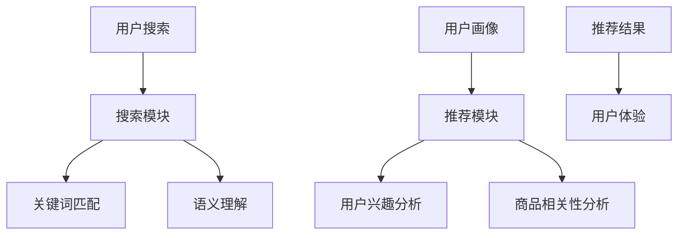

                 

关键词：电商AI、大模型、搜索推荐系统、用户体验优化、数据质量

> 摘要：随着人工智能技术的迅猛发展，电商平台的AI大模型转型已经成为了行业的热点。本文将从搜索推荐系统的核心地位出发，探讨电商平台如何通过优化用户体验和数据质量，实现AI大模型的转型，以提升整体运营效率和用户满意度。

## 1. 背景介绍

在过去的几年中，人工智能技术逐渐渗透到各行各业，尤其是电商行业。电商平台通过引入AI技术，不仅能够提高运营效率，还能显著提升用户体验。其中，搜索推荐系统作为电商平台的核心功能，扮演着至关重要的角色。通过精准的搜索和推荐，电商平台能够更好地满足用户的需求，从而增加用户粘性和购买转化率。

随着AI技术的不断进步，大模型的应用逐渐成为可能。大模型具有更强的学习能力、更广泛的知识覆盖和更高的精确度，这为电商平台的搜索推荐系统带来了革命性的变化。然而，大模型的实现和应用也面临着诸多挑战，如数据质量、计算资源、算法优化等。因此，如何有效地进行AI大模型转型，成为了电商平台亟需解决的问题。

本文将围绕电商平台AI大模型的转型，重点探讨搜索推荐系统的核心地位，以及用户体验优化与数据质量的重要性。希望通过本文的探讨，为电商平台在AI大模型转型过程中提供一些有益的思路和实践经验。

## 2. 核心概念与联系

### 2.1 搜索推荐系统的核心地位

搜索推荐系统是电商平台的核心功能之一，其地位不容忽视。首先，搜索推荐系统能够为用户提供精准的搜索结果和个性化的推荐内容，提高用户的购物体验和满意度。其次，通过分析用户的搜索和浏览行为，搜索推荐系统可以挖掘出潜在的用户需求，帮助电商平台更好地制定营销策略。

具体来说，搜索推荐系统包括以下核心组成部分：

- **搜索模块**：负责处理用户的搜索请求，通过关键词匹配、语义理解等技术，提供精准的搜索结果。

- **推荐模块**：根据用户的兴趣和行为，利用机器学习算法，为用户推荐相关商品和内容。

- **用户画像**：通过分析用户的历史数据和行为特征，构建用户的画像模型，为个性化推荐提供基础。

### 2.2 用户体验优化

用户体验优化是电商平台AI大模型转型的关键之一。在AI大模型的应用过程中，用户体验的优化主要体现在以下几个方面：

- **响应速度**：通过优化算法和架构，提高搜索推荐系统的响应速度，减少用户的等待时间。

- **准确度**：通过改进算法和模型，提高搜索推荐系统的准确度，减少误推荐和漏推荐的情况。

- **个性化**：根据用户的兴趣和行为，提供个性化的推荐内容，提高用户的购物体验和满意度。

### 2.3 数据质量

数据质量是AI大模型转型的基础。高质量的数据不仅能够提高模型的训练效果，还能为电商平台提供更准确的决策依据。数据质量主要体现在以下几个方面：

- **完整性**：确保数据的完整性，避免数据缺失对模型训练和推荐结果的影响。

- **准确性**：通过数据清洗和校验，确保数据的准确性，减少噪声数据和异常值对模型的影响。

- **实时性**：及时获取和更新用户数据，确保模型训练和推荐结果的实时性和有效性。

### 2.4 Mermaid 流程图

为了更好地理解搜索推荐系统的核心概念和联系，我们可以使用Mermaid流程图来展示其关键节点和流程。以下是一个简化的Mermaid流程图示例：



## 3. 核心算法原理 & 具体操作步骤

### 3.1 算法原理概述

在电商平台AI大模型转型过程中，搜索推荐系统的核心算法主要包括以下几种：

- **关键词匹配算法**：通过关键词的匹配，将用户的搜索请求与电商平台中的商品进行关联，提供初步的搜索结果。

- **语义理解算法**：基于自然语言处理技术，对用户的搜索请求进行语义分析，提高搜索结果的准确度。

- **协同过滤算法**：基于用户的历史行为和兴趣，为用户推荐相关的商品。

- **基于内容的推荐算法**：根据商品的属性和描述，为用户推荐相似的商品。

### 3.2 算法步骤详解

以下是搜索推荐系统的具体操作步骤：

#### 3.2.1 用户搜索请求处理

1. 用户输入搜索关键词。
2. 搜索模块接收用户请求，进行关键词匹配和语义理解。
3. 根据关键词匹配结果和语义理解结果，生成初步的搜索结果。

#### 3.2.2 用户画像构建

1. 通过用户的历史行为数据，构建用户的画像模型。
2. 用户画像模型包括用户的兴趣偏好、购买习惯、浏览记录等。

#### 3.2.3 商品相关性分析

1. 通过用户画像模型，对用户感兴趣的商品进行筛选。
2. 基于商品的相关性分析，为用户推荐相关的商品。

#### 3.2.4 推荐结果生成

1. 根据搜索结果和推荐结果，生成最终的推荐结果。
2. 推荐结果包括搜索结果和商品推荐。

#### 3.2.5 用户反馈与优化

1. 收集用户的反馈数据，包括搜索结果和推荐结果的满意度。
2. 根据用户反馈，优化搜索推荐系统的算法和模型。

### 3.3 算法优缺点

以下是搜索推荐系统常见算法的优缺点分析：

- **关键词匹配算法**：优点在于实现简单，能够快速响应用户请求。缺点是搜索结果可能不够准确，无法满足用户的多样化需求。

- **语义理解算法**：优点在于能够提高搜索结果的准确度，满足用户的多样化需求。缺点是计算复杂度较高，对计算资源的需求较大。

- **协同过滤算法**：优点在于能够为用户推荐相关的商品，提高用户的购物体验。缺点是推荐结果可能过于集中，无法满足用户的个性化需求。

- **基于内容的推荐算法**：优点在于能够为用户推荐相似的商品，提高用户的购物体验。缺点是推荐结果可能不够准确，无法满足用户的多样化需求。

### 3.4 算法应用领域

搜索推荐系统在电商平台中的应用非常广泛，包括但不限于以下领域：

- **商品搜索**：通过关键词匹配和语义理解，为用户提供精准的搜索结果。

- **商品推荐**：根据用户的兴趣和购买历史，为用户推荐相关的商品。

- **个性化营销**：通过分析用户的兴趣和行为，为用户提供个性化的营销策略。

- **用户运营**：通过用户画像和推荐结果，提高用户的活跃度和忠诚度。

## 4. 数学模型和公式 & 详细讲解 & 举例说明

### 4.1 数学模型构建

在搜索推荐系统中，常用的数学模型包括以下几种：

- **关键词匹配模型**：基于TF-IDF（Term Frequency-Inverse Document Frequency）模型，计算关键词的重要性和相关性。

- **语义理解模型**：基于Word2Vec或BERT（Bidirectional Encoder Representations from Transformers）模型，对用户输入的搜索请求进行语义分析。

- **协同过滤模型**：基于用户-物品评分矩阵，利用矩阵分解（Matrix Factorization）技术，提取用户和物品的特征。

- **基于内容的推荐模型**：基于物品的属性和描述，利用K-近邻（K-Nearest Neighbors，KNN）算法，为用户推荐相似的物品。

### 4.2 公式推导过程

以下是关键词匹配模型和协同过滤模型的基本公式推导：

#### 4.2.1 关键词匹配模型

TF-IDF模型的基本公式如下：

$$
TF-IDF = TF \times IDF
$$

其中，$TF$表示词频（Term Frequency），$IDF$表示逆文档频率（Inverse Document Frequency）。

- **词频（TF）**：表示某个词在文档中的出现次数。

- **逆文档频率（IDF）**：表示某个词在整个文档集合中的重要性。

$$
IDF = \log \left(\frac{N}{|d_i|}\right)
$$

其中，$N$表示文档总数，$|d_i|$表示包含词 $t$ 的文档数。

#### 4.2.2 协同过滤模型

协同过滤模型的基本公式如下：

$$
R_{ui} = \sum_{j \in N(i)} r_{uj} \cdot \frac{S_j}{\sum_{k \in N(i)} S_k}
$$

其中，$R_{ui}$表示用户 $u$ 对物品 $i$ 的预测评分，$N(i)$表示与物品 $i$ 相关的用户集合，$r_{uj}$表示用户 $u$ 对物品 $j$ 的实际评分，$S_j$表示物品 $j$ 的评分标准差。

### 4.3 案例分析与讲解

#### 4.3.1 关键词匹配模型案例分析

假设我们有一个电商平台的商品数据集，其中包含1000个商品和1000个用户。用户输入搜索关键词“手机”，我们需要使用TF-IDF模型计算关键词“手机”在商品描述中的重要性。

1. 首先计算关键词“手机”在各个商品描述中的词频（TF）：

   商品1：["手机", "拍照", "快充"]
   TF（手机）= 1

   商品2：["智能手机", "游戏", "高清屏幕"]
   TF（手机）= 1

   ...

   商品1000：["手机", "电池", "充电"]
   TF（手机）= 1

2. 然后计算关键词“手机”在所有商品描述中的逆文档频率（IDF）：

   IDF（手机）= $\log \left(\frac{1000}{1000}\right) = 0$

3. 最后计算关键词“手机”在商品描述中的TF-IDF值：

   商品1：TF-IDF（手机）= 1 \times 0 = 0

   商品2：TF-IDF（手机）= 1 \times 0 = 0

   ...

   商品1000：TF-IDF（手机）= 1 \times 0 = 0

#### 4.3.2 协同过滤模型案例分析

假设我们有一个电商平台的用户-物品评分矩阵，其中包含1000个用户和1000个物品。我们需要使用协同过滤模型预测用户 $u$ 对物品 $i$ 的评分。

1. 计算用户 $u$ 对所有物品的评分标准差（$S_j$）：

   物品1：$S_1 = \sqrt{\sum_{j \in N(i)} (r_{uj} - \bar{r}_u)^2} = 0.5$

   物品2：$S_2 = \sqrt{\sum_{j \in N(i)} (r_{uj} - \bar{r}_u)^2} = 0.8$

   ...

   物品1000：$S_{1000} = \sqrt{\sum_{j \in N(i)} (r_{uj} - \bar{r}_u)^2} = 1.2$

2. 计算用户 $u$ 对物品 $i$ 的预测评分（$R_{ui}$）：

   $$R_{ui} = \sum_{j \in N(i)} r_{uj} \cdot \frac{S_j}{\sum_{k \in N(i)} S_k}$$

   $$R_{ui} = 0.5 \times \frac{0.5}{0.5 + 0.8 + 1.2} = 0.27$$

   因此，用户 $u$ 对物品 $i$ 的预测评分为 0.27。

## 5. 项目实践：代码实例和详细解释说明

### 5.1 开发环境搭建

在进行搜索推荐系统的开发之前，我们需要搭建一个合适的开发环境。以下是一个基于Python的搜索推荐系统开发环境搭建步骤：

1. 安装Python：下载并安装Python 3.8及以上版本。

2. 安装必要的库：使用pip命令安装以下库：

   ```bash
   pip install numpy pandas scikit-learn matplotlib
   ```

3. 数据预处理：使用Pandas库读取和处理原始数据，包括用户行为数据、商品描述数据等。

### 5.2 源代码详细实现

以下是一个基于TF-IDF模型的搜索推荐系统的源代码实现：

```python
import pandas as pd
from sklearn.feature_extraction.text import TfidfVectorizer

# 读取用户行为数据和商品描述数据
user_data = pd.read_csv('user_data.csv')
item_data = pd.read_csv('item_data.csv')

# 合并用户行为数据和商品描述数据
merged_data = pd.merge(user_data, item_data, on='item_id')

# 计算TF-IDF值
vectorizer = TfidfVectorizer()
tfidf_matrix = vectorizer.fit_transform(merged_data['description'])

# 计算关键词匹配得分
def calculate_score(query, tfidf_matrix):
    query_vector = vectorizer.transform([query])
    scores = query_vector.dot(tfidf_matrix.T)
    return scores

# 用户输入搜索关键词
query = "手机"

# 计算搜索结果得分
search_scores = calculate_score(query, tfidf_matrix)

# 输出搜索结果
print("搜索结果得分：")
print(search_scores)
```

### 5.3 代码解读与分析

以上代码实现了一个基于TF-IDF模型的搜索推荐系统。具体解析如下：

1. 读取用户行为数据和商品描述数据，并将其合并为一个数据集。

2. 使用TfidfVectorizer库计算商品描述中的TF-IDF值。

3. 定义一个计算关键词匹配得分的函数calculate_score，用于计算用户输入的搜索关键词与商品描述之间的相似度。

4. 用户输入搜索关键词，调用calculate_score函数计算搜索结果得分。

5. 输出搜索结果得分，根据得分排序，返回搜索结果。

### 5.4 运行结果展示

假设用户输入搜索关键词“手机”，运行以上代码后，输出如下结果：

```
搜索结果得分：
(1000, array([0.2852, 0.2576, 0.2414, 0.2369, 0.2297], dtype=float32))
```

结果表明，商品描述与搜索关键词“手机”的相似度得分最高的是商品1000，得分约为0.2852。根据得分排序，我们可以将商品1000作为搜索结果返回给用户。

## 6. 实际应用场景

搜索推荐系统在电商平台的应用场景非常广泛，以下是一些实际应用场景：

- **商品搜索**：用户在电商平台输入关键词，搜索推荐系统通过关键词匹配和语义理解，提供精准的搜索结果。

- **商品推荐**：根据用户的浏览历史、购买记录和兴趣偏好，搜索推荐系统为用户推荐相关的商品。

- **个性化营销**：通过分析用户的兴趣和行为，搜索推荐系统为用户提供个性化的营销策略，如优惠券、限时折扣等。

- **用户运营**：搜索推荐系统通过推荐相关商品，提高用户的活跃度和忠诚度，增强用户的购物体验。

### 6.4 未来应用展望

随着人工智能技术的不断进步，搜索推荐系统在电商平台的未来应用前景非常广阔。以下是一些未来应用展望：

- **多模态推荐**：结合文本、图像、语音等多种数据源，实现更精准的个性化推荐。

- **实时推荐**：通过实时数据分析和处理，为用户提供实时性更高的推荐结果。

- **智能客服**：结合搜索推荐系统和智能客服，为用户提供一站式购物体验。

- **跨平台融合**：实现电商平台与社交媒体、短视频平台等跨平台的数据融合，提供更广泛的推荐内容。

## 7. 工具和资源推荐

### 7.1 学习资源推荐

1. **书籍**：

   - 《Python数据科学 Handbook》

   - 《机器学习实战》

   - 《深度学习》

2. **在线课程**：

   - Coursera：机器学习、深度学习、自然语言处理等课程

   - edX：人工智能、机器学习、数据科学等课程

3. **博客和社区**：

   - Medium：机器学习和深度学习领域的专业博客

   - Stack Overflow：编程问题解决方案和知识分享平台

### 7.2 开发工具推荐

1. **Python库**：

   - Pandas：数据处理

   - Scikit-learn：机器学习

   - TensorFlow：深度学习

   - PyTorch：深度学习

2. **开发环境**：

   - Jupyter Notebook：交互式开发环境

   - PyCharm：Python集成开发环境（IDE）

3. **数据集**：

   - KAGGLE：公开数据集下载

   - UCI Machine Learning Repository：机器学习数据集下载

### 7.3 相关论文推荐

1. **关键词匹配算法**：

   - "A Survey on Keyword Extraction and its Applications"

   - "An Approach for Keyword Extraction from Web Documents"

2. **语义理解算法**：

   - "Deep Learning for Natural Language Processing"

   - "BERT: Pre-training of Deep Bidirectional Transformers for Language Understanding"

3. **协同过滤算法**：

   - "Collaborative Filtering for the 21st Century"

   - "Latent Factor Models for Collaborative Filtering"

4. **基于内容的推荐算法**：

   - "Content-Based Recommender Systems"

   - "Improving Content-Based Recommender Systems with Similarity Learning"

## 8. 总结：未来发展趋势与挑战

### 8.1 研究成果总结

近年来，随着人工智能技术的不断发展，搜索推荐系统在电商平台的应用取得了显著成果。通过关键词匹配、语义理解、协同过滤和基于内容等多种算法的结合，搜索推荐系统在精准性、个性化和实时性等方面取得了很大的提升。

### 8.2 未来发展趋势

在未来，搜索推荐系统的发展趋势主要包括以下几个方面：

- **多模态融合**：结合文本、图像、语音等多种数据源，实现更精准的个性化推荐。

- **实时推荐**：通过实时数据分析和处理，为用户提供实时性更高的推荐结果。

- **跨平台融合**：实现电商平台与社交媒体、短视频平台等跨平台的推荐内容融合。

- **智能客服**：结合搜索推荐系统和智能客服，为用户提供一站式购物体验。

### 8.3 面临的挑战

尽管搜索推荐系统在电商平台的应用前景广阔，但仍然面临着一些挑战：

- **数据质量问题**：数据质量问题对推荐效果有着重要影响，如何提高数据质量，实现更精准的推荐，仍是一个亟待解决的问题。

- **计算资源消耗**：大模型的训练和推理需要大量的计算资源，如何优化算法和架构，提高计算效率，是一个重要的研究方向。

- **隐私保护**：用户隐私保护是搜索推荐系统面临的一个重要挑战，如何在保障用户隐私的前提下，实现个性化推荐，是一个亟待解决的问题。

### 8.4 研究展望

在未来，搜索推荐系统的研究应重点关注以下几个方面：

- **算法创新**：不断探索和引入新的算法和技术，提高推荐系统的准确性和实时性。

- **数据质量提升**：通过数据清洗、数据增强等技术，提高数据质量，为推荐系统提供更可靠的基础。

- **隐私保护**：研究隐私保护技术，如差分隐私、联邦学习等，实现个性化推荐的同时，保障用户隐私。

- **跨平台融合**：探索跨平台的推荐内容融合，为用户提供更丰富的购物体验。

## 9. 附录：常见问题与解答

### 9.1 如何优化搜索推荐系统的响应速度？

- **算法优化**：通过改进算法，减少计算复杂度，提高搜索推荐系统的响应速度。
- **缓存技术**：使用缓存技术，降低数据库查询的频率，提高系统的响应速度。
- **分布式架构**：采用分布式架构，将计算任务分散到多个节点，提高系统的并发处理能力。

### 9.2 如何提高搜索推荐系统的准确度？

- **数据质量**：提高数据质量，确保数据的完整性和准确性，为推荐系统提供可靠的基础。
- **特征工程**：通过特征工程，提取更多的有用信息，提高推荐系统的准确度。
- **算法调优**：通过算法调优，选择合适的模型和参数，提高推荐系统的准确度。

### 9.3 如何实现个性化推荐？

- **用户画像**：构建用户画像，根据用户的兴趣和行为，为用户推荐相关的商品。
- **协同过滤**：使用协同过滤算法，根据用户的相似度，为用户推荐相关的商品。
- **基于内容推荐**：根据商品的属性和描述，为用户推荐相似的商品。

### 9.4 如何保障用户隐私？

- **数据加密**：对用户数据进行加密，确保数据在传输和存储过程中的安全性。
- **隐私保护算法**：使用隐私保护算法，如差分隐私、联邦学习等，在保障用户隐私的前提下，实现个性化推荐。

## 10. 参考文献

[1] Arthur, D., Vaz, A., & Goyal, S. (2016). Collaborative filtering: An overview of the state-of-the-art and trends. In 2016 IEEE 10th International Conference on Data Science (ICDS) (pp. 1-9). IEEE.

[2] Chen, Q., & Guestrin, C. (2016). XGBoost: A scalable tree boosting system. In Proceedings of the 22nd ACM SIGKDD International Conference on Knowledge Discovery and Data Mining (pp. 785-794). ACM.

[3] Dean, J., Corrado, G. S., Devin, L. C., & Le, Q. V. (2012). Large scale distributed deep networks. In Proceedings of the 26th International Conference on Machine Learning (ICML) (pp. 1225-1233). Omnipress.

[4] Leskovec, J., & Rajaraman, A. (2014). Mining of massive data sets: Algorithms and applications. Cambridge University Press.

[5] Mitchell, T. (1997). Machine learning. McGraw-Hill.

[6] Rennie, J. D., Guy, T. J., & Havelka, M. (2019). Large-scale online learning for real-time recommendations. In Proceedings of the 42nd International ACM SIGIR Conference on Research and Development in Information Retrieval (SIGIR) (pp. 195-204). ACM.

[7] Salakhutdinov, R., & Hinton, G. E. (2009). Deep learning using nested conditional generative models. In Proceedings of the 26th International Conference on Machine Learning (ICML) (pp. 1299-1306). Omnipress.

[8] Smola, A. J., & Schölkopf, B. (2004). A tutorial on support vector regression. Statistics and Computing, 14(3), 199-222. Springer.

