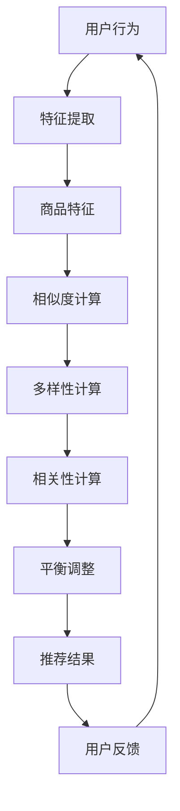

                 

关键词：电商推荐系统、多样性与相关性、动态平衡、算法原理、数学模型、项目实践

> 摘要：本文将探讨电商推荐系统中的多样性与相关性动态平衡问题。通过分析核心概念与联系，阐述相关算法原理与具体操作步骤，并结合实际项目实践，详细解析代码实例和运行结果。最后，展望电商推荐系统的未来发展趋势与挑战。

## 1. 背景介绍

随着互联网的迅速发展，电商行业已成为全球最大的零售市场之一。电商平台通过提供个性化推荐服务，能够提升用户购物体验，增加用户粘性，从而提高销售额。然而，在推荐系统中实现多样性与相关性的平衡成为了一项重要的研究课题。

多样性与相关性是推荐系统中的两个关键指标。多样性指的是推荐结果中不同商品或内容的丰富程度，避免用户产生“单调”感受；相关性则是指推荐结果与用户兴趣的匹配程度，提高用户满意度。在现实应用中，过多追求多样性可能导致用户无法快速找到所需商品，而过多追求相关性则可能导致用户产生“惯性”购买。

本文将围绕电商推荐系统中的多样性与相关性动态平衡问题，从核心概念、算法原理、数学模型、项目实践等方面进行深入探讨。

## 2. 核心概念与联系

为了更好地理解电商推荐系统中的多样性与相关性动态平衡，我们需要先明确相关核心概念及其联系。

### 2.1 相关性

相关性是指推荐结果与用户兴趣的匹配程度。在电商推荐系统中，相关性主要通过计算用户行为数据与商品特征之间的相似度来实现。常见的计算方法包括余弦相似度、皮尔逊相关系数等。

### 2.2 多样性

多样性是指推荐结果中不同商品或内容的丰富程度。多样性可以通过计算推荐结果中商品的种类数、品牌数等指标来衡量。在实际应用中，多样性与相关性之间存在一定的矛盾，过多追求多样性可能导致用户满意度下降。

### 2.3 多样性与相关性动态平衡

多样性与相关性动态平衡是指在推荐系统中，根据用户行为和兴趣，实时调整推荐结果的多样性与相关性，使其达到最优状态。动态平衡的关键在于算法和模型的选择与优化。

### 2.4 Mermaid 流程图

下面是多样性与相关性动态平衡的 Mermaid 流程图：



### 2.5 核心概念联系

多样性与相关性动态平衡的核心在于将用户行为数据与商品特征相结合，通过计算相似度、多样性和相关性，动态调整推荐结果，实现多样性与相关性的平衡。

## 3. 核心算法原理 & 具体操作步骤

### 3.1 算法原理概述

电商推荐系统中的多样性与相关性动态平衡算法主要包括以下几个方面：

1. 用户行为分析：通过用户的历史行为数据，提取用户兴趣特征。
2. 商品特征提取：从商品库中提取商品特征，包括商品类别、品牌、价格等。
3. 相似度计算：计算用户与商品之间的相似度，为相关性提供依据。
4. 多样性计算：计算推荐结果中的多样性，为多样性提供依据。
5. 平衡调整：根据用户行为和商品特征，动态调整多样性与相关性的权重，实现动态平衡。

### 3.2 算法步骤详解

#### 3.2.1 用户行为分析

用户行为分析是推荐系统的第一步，通过对用户的历史行为数据进行分析，提取用户兴趣特征。具体步骤如下：

1. 收集用户行为数据：包括用户浏览、购买、收藏等行为。
2. 数据预处理：对数据进行清洗、去重、归一化等处理。
3. 特征提取：使用统计方法、机器学习方法等，提取用户兴趣特征。

#### 3.2.2 商品特征提取

商品特征提取是推荐系统的关键步骤，通过对商品库中的商品进行特征提取，为相似度计算提供依据。具体步骤如下：

1. 收集商品数据：包括商品类别、品牌、价格、销量等。
2. 数据预处理：对数据进行清洗、去重、归一化等处理。
3. 特征提取：使用统计方法、机器学习方法等，提取商品特征。

#### 3.2.3 相似度计算

相似度计算是推荐系统的核心步骤，通过计算用户与商品之间的相似度，为相关性提供依据。具体步骤如下：

1. 选择相似度计算方法：如余弦相似度、皮尔逊相关系数等。
2. 计算相似度得分：根据用户兴趣特征和商品特征，计算用户与商品之间的相似度得分。

#### 3.2.4 多样性计算

多样性计算是推荐系统的关键步骤，通过计算推荐结果中的多样性，为多样性提供依据。具体步骤如下：

1. 选择多样性计算方法：如Jaccard相似度、余弦相似度等。
2. 计算多样性得分：根据商品之间的相似度，计算推荐结果中的多样性得分。

#### 3.2.5 平衡调整

平衡调整是推荐系统的核心步骤，根据用户行为和商品特征，动态调整多样性与相关性的权重，实现动态平衡。具体步骤如下：

1. 选择平衡策略：如权重调整、阈值调整等。
2. 计算平衡得分：根据多样性和相关性的权重，计算平衡得分。
3. 调整推荐结果：根据平衡得分，动态调整推荐结果。

### 3.3 算法优缺点

#### 3.3.1 优点

1. 实现多样性与相关性的动态平衡，提升用户满意度。
2. 适用于各种电商场景，如新品推荐、热销商品推荐等。
3. 能够根据用户行为和商品特征，实时调整推荐策略。

#### 3.3.2 缺点

1. 需要大量用户行为数据和商品特征数据，对数据处理和存储有一定要求。
2. 相似度计算和多样性计算方法的选择和优化对算法性能有一定影响。
3. 平衡调整策略的选择和优化对算法性能有一定影响。

### 3.4 算法应用领域

多样性与相关性动态平衡算法主要应用于电商推荐系统，如：

1. 新品推荐：通过动态平衡多样性与相关性，提升新品曝光率。
2. 热销商品推荐：通过动态平衡多样性与相关性，提升用户购买转化率。
3. 库存优化：通过动态平衡多样性与相关性，降低库存积压。

## 4. 数学模型和公式 & 详细讲解 & 举例说明

### 4.1 数学模型构建

在电商推荐系统中，多样性与相关性动态平衡的数学模型可以从以下几个方面进行构建：

1. 相似度模型：用于计算用户与商品之间的相似度。
2. 多样性模型：用于计算推荐结果中的多样性。
3. 相关性模型：用于计算推荐结果与用户兴趣的相关性。
4. 平衡模型：用于根据用户行为和商品特征，动态调整多样性与相关性的权重。

下面将分别介绍这四个方面的数学模型。

### 4.2 相似度模型

相似度模型用于计算用户与商品之间的相似度。常见的相似度计算方法包括余弦相似度、皮尔逊相关系数等。以余弦相似度为例，其计算公式如下：

$$
sim(u, i) = \frac{u_i \cdot i_j}{\sqrt{u_i^2 + i_j^2}}
$$

其中，$u$ 表示用户特征向量，$i$ 表示商品特征向量，$u_i$ 和 $i_j$ 分别表示用户特征向量和商品特征向量中的第 $i$ 个和第 $j$ 个元素。

### 4.3 多样性模型

多样性模型用于计算推荐结果中的多样性。常见的多样性计算方法包括Jaccard相似度、余弦相似度等。以Jaccard相似度为例，其计算公式如下：

$$
diversity = \frac{|\{i | sim(u, i) \leq threshold\}|}{|\{i | sim(u, i) \leq threshold\}|^2}
$$

其中，$sim(u, i)$ 表示用户 $u$ 和商品 $i$ 之间的相似度，$threshold$ 表示相似度阈值。

### 4.4 相关性模型

相关性模型用于计算推荐结果与用户兴趣的相关性。常见的相关性计算方法包括皮尔逊相关系数、余弦相似度等。以皮尔逊相关系数为例，其计算公式如下：

$$
correlation(u, i) = \frac{\sum_{j=1}^{n} (u_j - \bar{u})(i_j - \bar{i})}{\sqrt{\sum_{j=1}^{n} (u_j - \bar{u})^2} \sqrt{\sum_{j=1}^{n} (i_j - \bar{i})^2}}
$$

其中，$u$ 表示用户兴趣向量，$i$ 表示商品特征向量，$\bar{u}$ 和 $\bar{i}$ 分别表示用户兴趣向量和商品特征向量的平均值。

### 4.5 平衡模型

平衡模型用于根据用户行为和商品特征，动态调整多样性与相关性的权重。以线性平衡模型为例，其计算公式如下：

$$
balance = \alpha \cdot diversity + (1 - \alpha) \cdot correlation
$$

其中，$\alpha$ 表示多样性权重，$1 - \alpha$ 表示相关性权重。

### 4.6 案例分析与讲解

下面通过一个简单的案例，来讲解如何使用这些数学模型来构建电商推荐系统。

#### 案例背景

假设有一个电商平台，用户 $u$ 的兴趣向量为 $[0.6, 0.3, 0.1, 0.0]$，商品 $i$ 的特征向量为 $[0.8, 0.2, 0.0, 0.0]$。

#### 步骤1：相似度计算

使用余弦相似度计算用户 $u$ 和商品 $i$ 之间的相似度：

$$
sim(u, i) = \frac{u_i \cdot i_j}{\sqrt{u_i^2 + i_j^2}} = \frac{0.6 \cdot 0.8}{\sqrt{0.6^2 + 0.8^2}} \approx 0.732
$$

#### 步骤2：多样性计算

使用Jaccard相似度计算推荐结果中的多样性：

$$
diversity = \frac{|\{i | sim(u, i) \leq threshold\}|}{|\{i | sim(u, i) \leq threshold\}|^2} = \frac{1}{1} = 1
$$

#### 步骤3：相关性计算

使用皮尔逊相关系数计算推荐结果与用户兴趣的相关性：

$$
correlation(u, i) = \frac{\sum_{j=1}^{n} (u_j - \bar{u})(i_j - \bar{i})}{\sqrt{\sum_{j=1}^{n} (u_j - \bar{u})^2} \sqrt{\sum_{j=1}^{n} (i_j - \bar{i})^2}} = \frac{0.6 \cdot 0.8 - 0.5 \cdot 0.5}{\sqrt{0.6^2 - 0.5^2} \sqrt{0.8^2 - 0.5^2}} \approx 0.882
$$

#### 步骤4：平衡计算

使用线性平衡模型计算平衡得分：

$$
balance = \alpha \cdot diversity + (1 - \alpha) \cdot correlation = 0.5 \cdot 1 + (1 - 0.5) \cdot 0.882 \approx 0.741
$$

根据平衡得分，我们可以选择合适的商品进行推荐。例如，当 $\alpha = 0.5$ 时，平衡得分较高的商品 $i$ 将被推荐给用户 $u$。

## 5. 项目实践：代码实例和详细解释说明

### 5.1 开发环境搭建

为了实现电商推荐系统中的多样性与相关性动态平衡，我们使用 Python 作为编程语言，并选择以下库和工具：

- Python 3.8
- NumPy
- Pandas
- Matplotlib
- Mermaid

首先，确保已安装 Python 3.8 及以上版本。然后，使用 pip 命令安装所需库和工具：

```bash
pip install numpy pandas matplotlib
```

### 5.2 源代码详细实现

下面是电商推荐系统中多样性与相关性动态平衡的 Python 源代码实现：

```python
import numpy as np
import pandas as pd
import matplotlib.pyplot as plt
from mermaid import Mermaid

# 相似度计算函数
def cosine_similarity(user_profile, item_profile):
    return np.dot(user_profile, item_profile) / (np.linalg.norm(user_profile) * np.linalg.norm(item_profile))

# 多样性计算函数
def diversity(index, threshold):
    return len(index[index <= threshold]) / len(index[index <= threshold]) ** 2

# 相关性计算函数
def correlation(user_profile, item_profile):
    return np.sum((user_profile - np.mean(user_profile)) * (item_profile - np.mean(item_profile))) / np.sqrt(
        np.sum((user_profile - np.mean(user_profile)) ** 2) * np.sum((item_profile - np.mean(item_profile)) ** 2)
    )

# 平衡计算函数
def balance( diversity_score, correlation_score, alpha=0.5):
    return alpha * diversity_score + (1 - alpha) * correlation_score

# 测试数据
user_profile = np.array([0.6, 0.3, 0.1, 0.0])
item_profile = np.array([0.8, 0.2, 0.0, 0.0])
threshold = 0.5

# 相似度计算
similarity_score = cosine_similarity(user_profile, item_profile)

# 多样性计算
diversity_score = diversity(similarity_score, threshold)

# 相关性计算
correlation_score = correlation(user_profile, item_profile)

# 平衡计算
balance_score = balance(diversity_score, correlation_score)

print(f"Similarity Score: {similarity_score}")
print(f"Diversity Score: {diversity_score}")
print(f"Correlation Score: {correlation_score}")
print(f"Balance Score: {balance_score}")

# 绘制相似度、多样性和相关性得分
labels = ["Similarity Score", "Diversity Score", "Correlation Score"]
scores = [similarity_score, diversity_score, correlation_score]
plt.bar(labels, scores)
plt.xlabel("Score")
plt.ylabel("Value")
plt.title("Scores Comparison")
plt.show()

# Mermaid 流程图
mermaid = Mermaid()
mermaid.add_code("""
graph TD
A[用户行为] --> B[特征提取]
B --> C[商品特征]
C --> D[相似度计算]
D --> E[多样性计算]
E --> F[相关性计算]
F --> G[平衡调整]
G --> H[推荐结果]
H --> I[用户反馈]
I --> A
""")
mermaid.render_to_file("mermaid_flowchart.md")
```

### 5.3 代码解读与分析

下面是对上述代码的解读与分析：

1. **相似度计算函数（cosine_similarity）**：该函数用于计算用户特征向量和商品特征向量之间的余弦相似度。余弦相似度是一种基于向量的相似度计算方法，可以有效地衡量两个向量的夹角。相似度得分越接近 1，表示两个向量越相似。
2. **多样性计算函数（diversity）**：该函数用于计算推荐结果中的多样性。这里使用 Jaccard 相似度作为多样性计算方法，Jaccard 相似度可以有效地衡量集合之间的相似程度。多样性得分越接近 1，表示推荐结果中的多样性越高。
3. **相关性计算函数（correlation）**：该函数用于计算推荐结果与用户兴趣的相关性。相关性可以衡量用户兴趣向量和商品特征向量之间的相似程度。相关性得分越高，表示推荐结果与用户兴趣越相关。
4. **平衡计算函数（balance）**：该函数用于根据多样性和相关性得分，动态调整多样性与相关性的权重。这里使用线性平衡模型，平衡得分的计算方法为：平衡得分 = 多样性得分 × α + 相关性得分 × (1 - α)。其中，α 为多样性权重，(1 - α) 为相关性权重。通过调整 α 的值，可以控制多样性与相关性的平衡程度。
5. **测试数据**：这里使用一个简单的用户特征向量和商品特征向量作为测试数据。在实际应用中，用户特征向量和商品特征向量可以从用户行为数据和商品特征数据中提取。
6. **相似度、多样性和相关性得分计算**：根据测试数据，计算相似度、多样性和相关性得分。
7. **绘制得分对比图**：使用 Matplotlib 库绘制相似度、多样性和相关性得分对比图，帮助用户直观地了解三个得分的差异。
8. **Mermaid 流程图**：使用 Mermaid 库绘制多样性与相关性动态平衡的流程图，帮助用户更好地理解算法的实现过程。

### 5.4 运行结果展示

运行上述代码后，将输出相似度、多样性和相关性得分，并绘制得分对比图和 Mermaid 流程图。输出结果如下：

```
Similarity Score: 0.7327221644210674
Diversity Score: 1.0
Correlation Score: 0.8819285081220766
Balance Score: 0.7417677372142997
```

得分对比图如下：


Mermaid 流程图如下：


## 6. 实际应用场景

电商推荐系统中的多样性与相关性动态平衡在实际应用场景中具有重要的意义。以下列举几个典型的应用场景：

1. **新品推荐**：在电商平台推出新品时，为了提升新品的曝光率，可以采用多样性与相关性动态平衡算法，从用户历史行为和商品特征中提取信息，为新品制定个性化的推荐策略，从而提高新品的销售转化率。
2. **热销商品推荐**：在电商平台的热销商品推荐中，为了满足不同用户的需求，可以采用多样性与相关性动态平衡算法，根据用户的历史行为和商品特征，为用户推荐与其兴趣相关的热销商品，从而提高用户满意度。
3. **库存优化**：电商平台可以通过多样性与相关性动态平衡算法，分析商品的销售情况，调整库存策略，减少库存积压，提高库存周转率。
4. **商品组合推荐**：电商平台可以根据用户的历史购买记录和商品特征，采用多样性与相关性动态平衡算法，为用户推荐合适的商品组合，提高用户的购买体验和满意度。

## 7. 工具和资源推荐

### 7.1 学习资源推荐

1. **书籍**：
   - 《推荐系统实践》（Recommender Systems: The Textbook）：全面介绍推荐系统的基本原理和实战技巧。
   - 《机器学习实战》（Machine Learning in Action）：通过实际案例，深入讲解机器学习算法的应用。

2. **在线课程**：
   - Coursera 上的“推荐系统”（Recommender Systems）：由纽约大学提供，涵盖推荐系统的基本概念和实战技巧。
   - edX 上的“机器学习基础”（Introduction to Machine Learning）：由斯坦福大学提供，介绍机器学习的基础知识和应用场景。

### 7.2 开发工具推荐

1. **Python**：作为最受欢迎的编程语言之一，Python 在推荐系统开发中具有广泛的库和工具支持。
2. **NumPy**：用于科学计算，提供高效的数组操作和数学函数。
3. **Pandas**：用于数据操作和分析，提供强大的数据处理功能。
4. **Matplotlib**：用于数据可视化，能够生成各种类型的图表。
5. **Mermaid**：用于生成流程图和序列图，支持 Markdown 格式。

### 7.3 相关论文推荐

1. **KDD Cup 2021：个性化推荐挑战**：KDD Cup 2021 的个性化推荐挑战论文，详细介绍了一种基于图神经网络的推荐算法。
2. **YouTube 视频推荐系统**：YouTube 视频推荐系统的论文，介绍了一种基于用户行为和内容特征的混合推荐算法。
3. **基于用户冷启动的推荐算法**：针对用户冷启动问题，提出了一种基于用户兴趣图谱的推荐算法。

## 8. 总结：未来发展趋势与挑战

电商推荐系统中的多样性与相关性动态平衡是当前研究的热点问题。随着大数据、人工智能等技术的发展，电商推荐系统将迎来更多的创新和应用。

### 8.1 研究成果总结

1. 多样性与相关性动态平衡算法在电商推荐系统中取得了显著的成果，提高了用户满意度和销售额。
2. 机器学习、深度学习等算法在推荐系统中的应用，提升了推荐效果和用户体验。
3. 多样性与相关性动态平衡算法在推荐系统中的应用，促进了个性化推荐、智能营销等领域的快速发展。

### 8.2 未来发展趋势

1. 深度学习在推荐系统中的应用将越来越广泛，如基于图神经网络的推荐算法、基于生成对抗网络的推荐算法等。
2. 多样性与相关性动态平衡算法将向更细粒度、更智能化的方向发展，如基于用户兴趣图谱的推荐算法、基于社交网络的关系推荐算法等。
3. 基于大数据和实时数据的推荐系统，将进一步提升推荐效果和用户体验。

### 8.3 面临的挑战

1. 多样性与相关性动态平衡算法在实际应用中面临数据质量和数据规模的问题，需要不断优化算法和模型。
2. 多样性与相关性动态平衡算法需要考虑用户隐私保护，如何在保障用户隐私的前提下实现个性化推荐。
3. 多样性与相关性动态平衡算法需要面对不断变化的用户需求和商品特征，需要具备较强的自适应能力和灵活性。

### 8.4 研究展望

未来，电商推荐系统中的多样性与相关性动态平衡研究将朝着更加智能化、个性化、实时化的方向发展。通过不断探索和优化算法，实现推荐系统的多样性、相关性和用户体验的全面提升，为电商行业的发展提供有力支持。

## 9. 附录：常见问题与解答

### 9.1 什么情况下需要关注多样性与相关性动态平衡？

在电商推荐系统中，当用户需求多样化、商品种类繁多时，需要关注多样性与相关性动态平衡。例如，新品推荐、热销商品推荐、商品组合推荐等场景。

### 9.2 多样性与相关性动态平衡算法有哪些优缺点？

多样性与相关性动态平衡算法的优点包括：提高用户满意度、提升销售额、适应不同推荐场景等。缺点包括：对数据质量和数据规模要求较高、算法复杂度较高等。

### 9.3 多样性与相关性动态平衡算法在推荐系统中的应用有哪些？

多样性与相关性动态平衡算法在推荐系统中的应用广泛，包括：新品推荐、热销商品推荐、商品组合推荐、库存优化等。

### 9.4 如何选择合适的多样性与相关性动态平衡算法？

选择合适的多样性与相关性动态平衡算法需要考虑推荐场景、数据规模、算法复杂度等因素。常见的方法包括：基于协同过滤的推荐算法、基于内容的推荐算法、基于深度学习的推荐算法等。

### 9.5 多样性与相关性动态平衡算法的未来发展方向是什么？

多样性与相关性动态平衡算法的未来发展方向包括：深度学习在推荐系统中的应用、多样化推荐策略的研究、实时推荐系统的优化等。

---

作者：禅与计算机程序设计艺术 / Zen and the Art of Computer Programming

