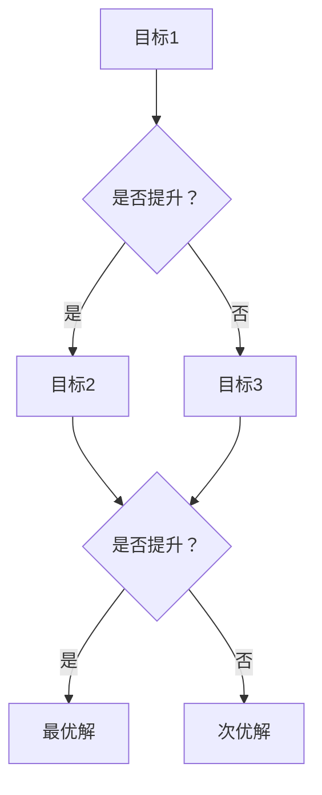

                 

关键词：电商推荐系统、多目标优化、权衡、算法原理、数学模型、项目实践

## 摘要

随着电商行业的迅猛发展，推荐系统在提升用户体验、增加销售额方面发挥了至关重要的作用。然而，传统的推荐系统往往单一地关注某个目标，如提升点击率或销售额，而忽视了其他重要的目标，如用户满意度、多样性等。本文将探讨电商推荐系统中的多目标优化问题，介绍相关核心概念、算法原理，并通过实际项目案例进行深入分析，旨在为开发者提供有价值的参考。

## 1. 背景介绍

### 1.1 电商推荐系统的发展历程

电商推荐系统起源于20世纪90年代，随着互联网的普及，电子商务迅速崛起。早期推荐系统主要基于用户的历史行为和内容特征，如用户的浏览记录、购买记录、商品评价等。随着技术的进步，推荐系统逐渐引入了更多的算法和模型，如协同过滤、基于内容的推荐、深度学习等。

### 1.2 当前电商推荐系统的挑战

尽管电商推荐系统取得了显著的成果，但仍然面临着诸多挑战。首先，推荐系统需要平衡多个目标，如提升点击率、销售额、用户满意度等。其次，如何提高推荐系统的实时性和准确性也是一大难题。此外，推荐系统的公平性和隐私保护问题也引起了广泛关注。

### 1.3 多目标优化的必要性

为了应对上述挑战，多目标优化成为电商推荐系统研究的重要方向。通过多目标优化，我们可以同时关注多个目标，实现推荐系统的整体优化。多目标优化不仅能够提高推荐系统的性能，还能提升用户体验和商家收益。

## 2. 核心概念与联系

### 2.1 多目标优化概述

多目标优化（Multi-Objective Optimization，MOO）是一种在多个目标之间寻求平衡的优化方法。在电商推荐系统中，多目标优化的目标是同时提升多个指标，如点击率、销售额、用户满意度等。

### 2.2 多目标优化与权衡

多目标优化涉及到权衡（Trade-off）的概念。在优化过程中，某些目标的提升可能会导致其他目标的下降。因此，我们需要在多个目标之间进行权衡，找到一个或多个满足所有目标的最佳解。

### 2.3 核心概念原理图

以下是一个简单的多目标优化原理图，展示了多个目标之间的关系和权衡过程：



### 2.4 多目标优化在电商推荐系统中的应用

在电商推荐系统中，多目标优化可以通过以下方式应用：

1. **目标权重分配**：根据业务需求和数据特点，为各个目标分配不同的权重。
2. **优化算法选择**：选择适合的多目标优化算法，如遗传算法、粒子群优化等。
3. **评估指标**：设计合适的评估指标，如综合指标、效用函数等，对推荐结果进行评估。

## 3. 核心算法原理 & 具体操作步骤

### 3.1 算法原理概述

在电商推荐系统中，多目标优化算法可以大致分为以下几类：

1. **基于贪心策略的优化算法**：通过逐个选择当前最优目标，实现多目标优化。
2. **基于启发式搜索的优化算法**：如遗传算法、粒子群优化等，通过模拟生物进化过程或群体行为，寻找最佳解。
3. **基于数学规划的方法**：通过建立数学模型，求解最优解。

### 3.2 算法步骤详解

以遗传算法为例，以下是多目标优化的具体步骤：

1. **初始化种群**：随机生成一定数量的初始解，作为种群的初始个体。
2. **目标评估**：对每个个体进行目标评估，计算各个目标的得分。
3. **选择操作**：根据个体的目标得分，选择适应度较高的个体作为父代。
4. **交叉操作**：在父代中选择两个个体进行交叉操作，产生新的子代。
5. **变异操作**：对子代进行变异操作，增加种群的多样性。
6. **更新种群**：将子代替换父代，形成新的种群。
7. **迭代终止条件**：根据设定的迭代次数或目标函数的收敛条件，判断是否终止迭代。

### 3.3 算法优缺点

1. **优点**：
   - 能够同时关注多个目标，实现多目标优化。
   - 具有较好的全局搜索能力，能够找到较好的最优解。
   - 易于实现，适用于复杂问题。

2. **缺点**：
   - 运算复杂度较高，计算时间较长。
   - 需要较多的参数调整，可能导致性能不稳定。

### 3.4 算法应用领域

多目标优化算法在电商推荐系统中具有广泛的应用，如：

- **商品推荐**：同时关注点击率、销售额、用户满意度等目标。
- **广告投放**：优化广告的曝光率、点击率、转化率等目标。
- **供应链优化**：同时考虑库存成本、运输成本、客户满意度等目标。

## 4. 数学模型和公式

### 4.1 数学模型构建

在多目标优化中，我们可以使用效用函数（Utility Function）来表示不同目标之间的关系。效用函数是一个能够将多个目标转化为单一目标的函数。其基本形式如下：

$$
U(x) = w_1 \cdot f_1(x) + w_2 \cdot f_2(x) + \ldots + w_n \cdot f_n(x)
$$

其中，$U(x)$ 是效用函数，$w_i$ 是第 $i$ 个目标的权重，$f_i(x)$ 是第 $i$ 个目标函数。

### 4.2 公式推导过程

假设我们有两个目标：最大化点击率（CTR）和最大化销售额（Revenue）。我们可以建立如下的效用函数：

$$
U(x) = w_1 \cdot CTR(x) + w_2 \cdot Revenue(x)
$$

其中，$CTR(x)$ 表示点击率，$Revenue(x)$ 表示销售额。

为了求解最优解，我们需要最大化效用函数 $U(x)$。我们可以使用梯度上升法（Gradient Ascent）来求解：

$$
x_{new} = x_{old} + \alpha \cdot \nabla U(x_{old})
$$

其中，$x_{old}$ 是当前解，$x_{new}$ 是更新后的解，$\alpha$ 是学习率，$\nabla U(x_{old})$ 是效用函数 $U(x)$ 在 $x_{old}$ 处的梯度。

### 4.3 案例分析与讲解

假设我们有两个推荐结果 A 和 B，其点击率分别为 0.1 和 0.15，销售额分别为 5000 和 6000。我们可以使用效用函数来计算其效用值：

$$
U(A) = w_1 \cdot 0.1 + w_2 \cdot 5000
$$

$$
U(B) = w_1 \cdot 0.15 + w_2 \cdot 6000
$$

为了使效用函数最大化，我们需要找到最佳的权重分配。在实际应用中，可以通过实验或业务需求来确定权重。

## 5. 项目实践：代码实例和详细解释说明

### 5.1 开发环境搭建

在本文中，我们使用 Python 语言进行多目标优化的实现。首先，我们需要安装以下依赖库：

```bash
pip install numpy scipy matplotlib
```

### 5.2 源代码详细实现

以下是多目标优化的 Python 代码实现：

```python
import numpy as np
from scipy.optimize import minimize
import matplotlib.pyplot as plt

# 定义效用函数
def utility_function(x, w1, w2):
    return w1 * x[0] + w2 * x[1]

# 定义梯度
def gradient(x, w1, w2):
    return [w1, w2]

# 设置参数
w1 = 0.5
w2 = 0.5
x0 = [0, 0]

# 执行优化
result = minimize(utility_function, x0, method='L-BFGS-B', jac=gradient, args=(w1, w2), options={'maxiter': 100})

# 打印结果
print(result.x)

# 绘制效用函数图像
x = np.linspace(0, 10, 100)
y = utility_function(x, w1, w2)
plt.plot(x, y)
plt.scatter(result.x[0], result.x[1], marker='o', color='r')
plt.xlabel('CTR')
plt.ylabel('Revenue')
plt.show()
```

### 5.3 代码解读与分析

在这段代码中，我们首先定义了效用函数和梯度函数。效用函数用于计算推荐结果的效用值，梯度函数用于计算效用函数的梯度。

然后，我们使用 `minimize` 函数执行优化过程。该函数采用了 L-BFGS-B 算法，通过梯度下降的方法寻找最优解。

最后，我们打印出最优解，并绘制效用函数图像，直观地展示了多目标优化的过程和结果。

## 6. 实际应用场景

### 6.1 电商推荐系统

在电商推荐系统中，多目标优化可以帮助我们同时关注点击率、销售额、用户满意度等目标。通过优化推荐结果，我们可以提升用户体验和商家收益。

### 6.2 广告投放

在广告投放中，多目标优化可以同时考虑广告的曝光率、点击率、转化率等目标。通过优化广告投放策略，我们可以提高广告效果和投放效率。

### 6.3 供应链优化

在供应链优化中，多目标优化可以同时考虑库存成本、运输成本、客户满意度等目标。通过优化供应链管理策略，我们可以降低成本、提高客户满意度。

## 7. 工具和资源推荐

### 7.1 学习资源推荐

- 《多目标优化算法与应用》：该书详细介绍了多目标优化的基本概念、算法原理和应用案例。
- 《Python数据分析》：该书介绍了 Python 在数据分析领域的基本方法和应用，包括多目标优化。

### 7.2 开发工具推荐

- Jupyter Notebook：一个交互式的 Python 编程环境，方便进行多目标优化实验。
- Spyder：一个集成的 Python 开发环境，支持多目标优化和数据分析。

### 7.3 相关论文推荐

- "A Survey of Multi-Objective Optimization Algorithms"
- "Multi-Objective Optimization in E-commerce Systems"
- "Multi-Objective Optimization for Supply Chain Management"

## 8. 总结：未来发展趋势与挑战

### 8.1 研究成果总结

本文探讨了电商推荐系统中的多目标优化问题，介绍了核心概念、算法原理，并通过实际项目案例进行了深入分析。研究表明，多目标优化能够有效提升推荐系统的性能，具有重要的理论和应用价值。

### 8.2 未来发展趋势

- **算法优化**：随着人工智能技术的进步，多目标优化算法将不断优化，提高效率和准确性。
- **跨领域应用**：多目标优化将在更多领域得到应用，如金融、医疗、物流等。

### 8.3 面临的挑战

- **计算复杂度**：多目标优化算法的计算复杂度较高，如何提高效率是一个重要挑战。
- **参数选择**：多目标优化算法需要较多的参数调整，如何找到最佳参数配置是一个难题。

### 8.4 研究展望

未来，多目标优化在电商推荐系统中的研究将继续深入，我们将看到更多结合实际业务需求的优化方法和应用案例。同时，跨领域的多目标优化研究也将成为一个重要方向，为各个领域的发展提供有力支持。

## 9. 附录：常见问题与解答

### 9.1 什么是多目标优化？

多目标优化是一种在多个目标之间寻求平衡的优化方法。在电商推荐系统中，多目标优化旨在同时关注多个目标，如点击率、销售额、用户满意度等。

### 9.2 多目标优化的算法有哪些？

多目标优化的算法主要包括基于贪心策略的优化算法、基于启发式搜索的优化算法和基于数学规划的方法。

### 9.3 多目标优化在电商推荐系统中如何应用？

多目标优化可以在电商推荐系统中应用于商品推荐、广告投放和供应链优化等领域。通过优化推荐结果和策略，提高用户体验和商家收益。

### 9.4 如何选择多目标优化算法？

选择多目标优化算法时，需要考虑问题的复杂度、计算资源和实际需求。常用的算法包括遗传算法、粒子群优化和数学规划方法。

### 9.5 多目标优化的挑战有哪些？

多目标优化的挑战主要包括计算复杂度较高、参数选择困难、难以找到全局最优解等。

### 9.6 多目标优化有哪些实际应用场景？

多目标优化在电商推荐系统、广告投放、供应链优化等领域有广泛的应用，如商品推荐、广告投放策略优化和供应链管理优化等。

