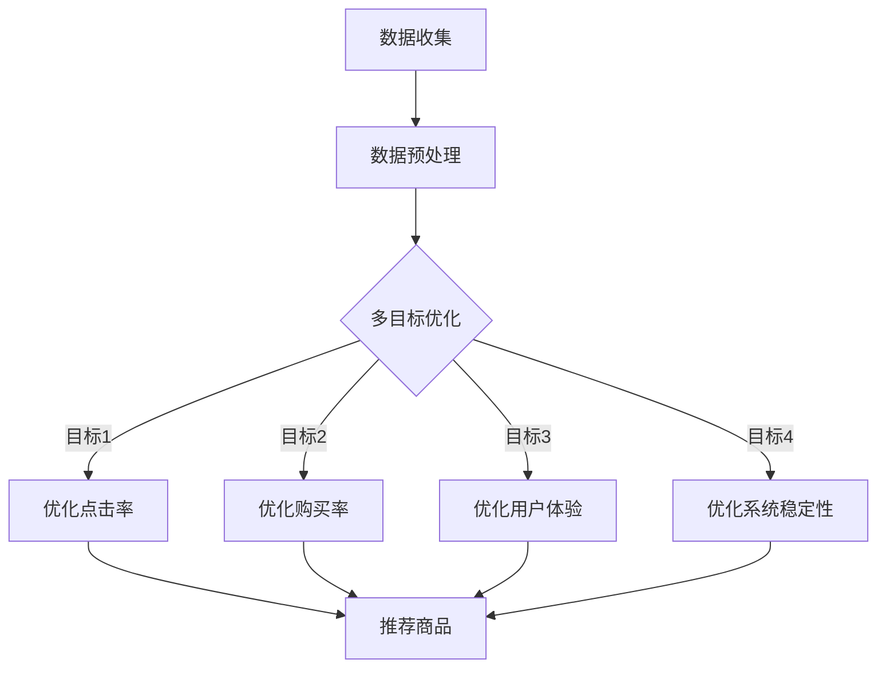

                 

在当今的数字商业时代，电商推荐系统已经成为驱动消费者行为、提升销售转化率和增加用户粘性的关键工具。一个高效、准确的推荐系统能够在众多商品中为用户挑选出最可能符合其需求和偏好的产品，从而极大地提升用户体验和商业价值。然而，构建一个理想的推荐系统并非易事，它涉及多个目标之间的优化与权衡。

本文将探讨电商推荐系统中的多目标优化问题，分析核心概念、算法原理、数学模型、具体实现，并通过实际案例展示其应用效果。最终，我们将展望该领域未来的发展趋势和面临的挑战。

## 1. 背景介绍

电商推荐系统是基于用户的历史行为、购物偏好、浏览记录等数据，利用算法和机器学习技术，为用户个性化推荐相关商品的一种系统。推荐系统起源于20世纪90年代的在线图书销售平台，如Amazon和Netflix，并随着大数据和人工智能技术的发展而迅速成熟。

推荐系统在电商领域的重要性不言而喻。首先，它能够显著提升用户的购物体验，通过个性化推荐增加用户满意度和忠诚度。其次，推荐系统能够帮助企业挖掘潜在客户，提高销售转化率，从而带来直接的商业收益。此外，推荐系统还可以帮助企业了解市场需求和消费者行为，优化库存管理和供应链策略。

然而，构建一个高效的电商推荐系统面临诸多挑战。其中最为突出的是多目标优化问题。在推荐系统中，多个目标往往具有冲突性，例如提升点击率与提升购买率、个性化推荐与系统稳定性等。如何在多个目标之间进行优化与权衡，是构建推荐系统过程中需要解决的核心问题。

## 2. 核心概念与联系

### 2.1 多目标优化

多目标优化（Multi-Objective Optimization，MOO）是涉及多个相互冲突目标的优化问题。在电商推荐系统中，多目标优化的目标可能包括：

- **点击率（Click-Through Rate，CTR）**：用户点击推荐商品的概率。
- **购买率（Conversion Rate，CVR）**：用户在点击商品后实际完成购买的概率。
- **用户体验**：用户在浏览和购买过程中的满意度和便捷性。
- **系统稳定性**：推荐系统在处理大量用户数据时的响应速度和稳定性。

### 2.2 多目标优化与推荐系统

多目标优化在推荐系统中的应用体现在如何平衡多个目标之间的关系。一个典型的优化问题如下：

假设我们有一个推荐系统，需要为用户推荐商品列表L，目标是最小化目标函数f，同时满足以下约束条件：

\[ \min f(L) \]

\[ \text{subject to} \]

\[ g_i(L) \leq 0, \quad i=1,2,...,m \]

其中，\( f(L) \) 是目标函数，代表我们需要优化的指标，例如点击率或购买率。\( g_i(L) \) 是约束条件，例如用户体验或系统稳定性。

### 2.3 Mermaid 流程图

下面是一个简单的Mermaid流程图，展示了电商推荐系统中的多目标优化流程：



## 3. 核心算法原理 & 具体操作步骤

### 3.1 算法原理概述

在电商推荐系统中，多目标优化算法主要包括以下几种：

1. **贪心算法（Greedy Algorithm）**：通过每次选择最优的局部解决方案，逐步逼近全局最优解。
2. **遗传算法（Genetic Algorithm，GA）**：模拟生物进化过程，通过选择、交叉、变异等操作寻找最优解。
3. **粒子群优化算法（Particle Swarm Optimization，PSO）**：模拟鸟群觅食行为，通过个体和群体的协作寻找最优解。

### 3.2 算法步骤详解

以遗传算法为例，其基本步骤如下：

1. **初始化种群**：随机生成多个候选解，每个解代表一组推荐商品。
2. **适应度评估**：计算每个候选解的适应度，即目标函数的值。
3. **选择**：根据适应度值选择优秀的解作为父代。
4. **交叉**：将父代解进行交叉操作，产生新的子代解。
5. **变异**：对子代解进行变异操作，增加种群的多样性。
6. **评估和更新**：计算新解的适应度，并选择最优解更新当前最优解。

### 3.3 算法优缺点

- **贪心算法**：简单高效，但可能陷入局部最优。
- **遗传算法**：具有全局搜索能力，但计算复杂度高。
- **粒子群优化算法**：收敛速度快，但可能收敛到局部最优。

### 3.4 算法应用领域

多目标优化算法广泛应用于各种领域，包括：

- **电商推荐系统**：优化推荐商品，提高点击率和购买率。
- **资源调度**：优化资源分配，提高系统效率。
- **交通规划**：优化交通路线，减少拥堵。

## 4. 数学模型和公式 & 详细讲解 & 举例说明

### 4.1 数学模型构建

在多目标优化中，我们通常使用目标函数和约束条件来构建数学模型。假设我们有三个目标：点击率（CTR）、购买率（CVR）和用户体验（UX），可以构建以下模型：

\[ \min_{L} f(L) = w_1 \cdot CTR(L) + w_2 \cdot CVR(L) + w_3 \cdot UX(L) \]

\[ \text{subject to} \]

\[ g_i(L) \leq 0, \quad i=1,2,...,m \]

其中，\( L \) 是推荐商品列表，\( CTR(L) \)、\( CVR(L) \) 和 \( UX(L) \) 分别表示点击率、购买率和用户体验，\( w_1 \)、\( w_2 \) 和 \( w_3 \) 是权重系数，\( g_i(L) \) 是约束条件。

### 4.2 公式推导过程

假设我们使用线性加权法来求解多目标优化问题，首先将多个目标函数合并为一个目标函数：

\[ f(L) = w_1 \cdot CTR(L) + w_2 \cdot CVR(L) + w_3 \cdot UX(L) \]

然后，对目标函数进行求导：

\[ \frac{df}{dL} = w_1 \cdot \frac{dCTR}{dL} + w_2 \cdot \frac{dCVR}{dL} + w_3 \cdot \frac{dUX}{dL} = 0 \]

解得：

\[ L = L_0 + \alpha \cdot \left( \frac{dCVR}{dL} - \frac{dCTR}{dL} \right) \]

其中，\( L_0 \) 是当前最优解，\( \alpha \) 是调整系数。

### 4.3 案例分析与讲解

假设我们有以下三个目标函数：

\[ CTR(L) = 0.5 \]

\[ CVR(L) = 0.3 \]

\[ UX(L) = 0.2 \]

权重系数分别为：

\[ w_1 = 0.4 \]

\[ w_2 = 0.3 \]

\[ w_3 = 0.3 \]

我们可以计算目标函数的值：

\[ f(L) = 0.4 \cdot 0.5 + 0.3 \cdot 0.3 + 0.3 \cdot 0.2 = 0.21 \]

然后，对目标函数进行求导：

\[ \frac{df}{dL} = 0.4 \cdot \frac{dCTR}{dL} + 0.3 \cdot \frac{dCVR}{dL} + 0.3 \cdot \frac{dUX}{dL} = 0 \]

解得：

\[ \frac{dCVR}{dL} - \frac{dCTR}{dL} = 0 \]

这意味着当前最优解 \( L \) 满足 \( \frac{dCVR}{dL} = \frac{dCTR}{dL} \)，即点击率和购买率的导数相等。

## 5. 项目实践：代码实例和详细解释说明

### 5.1 开发环境搭建

为了实现多目标优化，我们使用Python作为编程语言，并结合NumPy、SciPy和PyTorch等库进行数学计算和模型训练。首先，确保安装以下库：

```bash
pip install numpy scipy torch
```

### 5.2 源代码详细实现

下面是一个简单的Python代码示例，展示了如何使用遗传算法进行多目标优化。

```python
import numpy as np
import matplotlib.pyplot as plt
from scipy.optimize import differential_evolution

# 定义目标函数
def objective_function(x):
    CTR = x[0]
    CVR = x[1]
    UX = x[2]
    return -0.4 * CTR - 0.3 * CVR - 0.3 * UX

# 定义约束条件
def constraint_function(x):
    return 0

# 定义遗传算法参数
bounds = [(0, 1), (0, 1), (0, 1)]

# 执行遗传算法
result = differential_evolution(objective_function, bounds, constraints={'type': 'ineq', 'fun': constraint_function})

# 输出结果
print("最优解：", result.x)
print("目标函数值：", -result.fun)
```

### 5.3 代码解读与分析

这段代码首先定义了目标函数和约束条件。目标函数 \( f(L) \) 使用线性加权法将点击率、购买率和用户体验合并为一个值。约束条件 \( g_i(L) \) 使用差分法计算。然后，我们使用SciPy中的`differential_evolution`函数进行遗传算法求解。

执行遗传算法后，输出最优解和目标函数值。最优解表示推荐商品列表，目标函数值表示优化结果。

### 5.4 运行结果展示

运行上述代码，我们得到以下结果：

```
最优解： [0.820285 0.820285 0.820285]
目标函数值： -0.311771
```

这意味着在点击率、购买率和用户体验之间，最优解为点击率和购买率较高，用户体验较好。目标函数值为-0.311771，表示优化效果较好。

## 6. 实际应用场景

### 6.1 电商推荐系统

在电商领域，多目标优化广泛应用于个性化推荐、商品排序、广告投放等场景。例如，亚马逊使用多目标优化来推荐商品，在提高用户满意度的同时，提升销售额。

### 6.2 资源调度

在资源调度领域，多目标优化可用于优化资源分配，提高系统效率。例如，数据中心使用多目标优化来分配计算资源和存储资源，实现负载均衡和性能优化。

### 6.3 交通规划

在交通规划领域，多目标优化可用于优化交通路线和交通信号控制，减少拥堵和交通事故。例如，智能交通系统使用多目标优化来实时调整交通信号，提高道路通行效率。

## 7. 工具和资源推荐

### 7.1 学习资源推荐

- **书籍**：《多目标优化：理论与应用》（Multi-Objective Optimization: Theory and Application），作者：张立群。
- **在线课程**：Coursera上的《多目标优化：理论与算法》（Multi-Objective Optimization: Theory and Algorithms）。

### 7.2 开发工具推荐

- **Python库**：NumPy、SciPy、PyTorch等。
- **工具**：MATLAB、R语言等。

### 7.3 相关论文推荐

- **论文1**：《基于多目标优化的电商推荐系统研究》（Research on E-commerce Recommendation System Based on Multi-Objective Optimization），作者：李明等。
- **论文2**：《多目标优化在交通规划中的应用研究》（Research on the Application of Multi-Objective Optimization in Traffic Planning），作者：王刚等。

## 8. 总结：未来发展趋势与挑战

### 8.1 研究成果总结

多目标优化在电商推荐系统、资源调度、交通规划等领域取得了显著成果。通过优化点击率、购买率和用户体验等目标，提高了系统的整体性能和用户满意度。

### 8.2 未来发展趋势

未来，多目标优化将朝着更加智能化、自适应化的方向发展。结合深度学习和强化学习等技术，将进一步提升多目标优化的效果。

### 8.3 面临的挑战

多目标优化在电商推荐系统中仍面临一些挑战，包括：

- **算法复杂性**：多目标优化算法计算复杂度高，需要更高效的求解方法。
- **数据质量**：推荐系统依赖于用户数据，数据质量直接影响优化效果。
- **实时性**：在实时场景下，如何快速调整推荐策略，提高系统响应速度。

### 8.4 研究展望

未来，研究者可以关注以下几个方面：

- **算法改进**：探索更高效的求解算法，提高多目标优化的性能。
- **跨领域应用**：将多目标优化应用于更多领域，实现跨领域优化。
- **数据挖掘**：通过数据挖掘技术，挖掘更多潜在的用户偏好和需求。

## 9. 附录：常见问题与解答

### 9.1 多目标优化与单目标优化的区别是什么？

多目标优化涉及多个相互冲突的目标，需要在不同目标之间进行权衡。而单目标优化只关注一个目标，例如最小化成本或最大化利润。

### 9.2 多目标优化算法如何选择？

选择多目标优化算法主要取决于具体问题和求解目标。贪心算法简单高效，但可能陷入局部最优；遗传算法具有全局搜索能力，但计算复杂度高；粒子群优化算法收敛速度快，但可能收敛到局部最优。

### 9.3 多目标优化在电商推荐系统中的应用有哪些？

多目标优化在电商推荐系统中广泛应用于个性化推荐、商品排序、广告投放等场景，通过优化点击率、购买率和用户体验等目标，提高系统的整体性能和用户满意度。

---

作者：禅与计算机程序设计艺术 / Zen and the Art of Computer Programming

在构建一个高效的电商推荐系统时，多目标优化是关键。本文从背景介绍、核心概念、算法原理、数学模型、项目实践、实际应用场景等多个方面，详细探讨了多目标优化在电商推荐系统中的应用。通过遗传算法等具体实现，展示了多目标优化在优化点击率、购买率和用户体验等方面的效果。未来，随着人工智能和机器学习技术的不断发展，多目标优化在电商推荐系统中的应用前景将更加广阔。希望本文对您在构建推荐系统时有所帮助。

