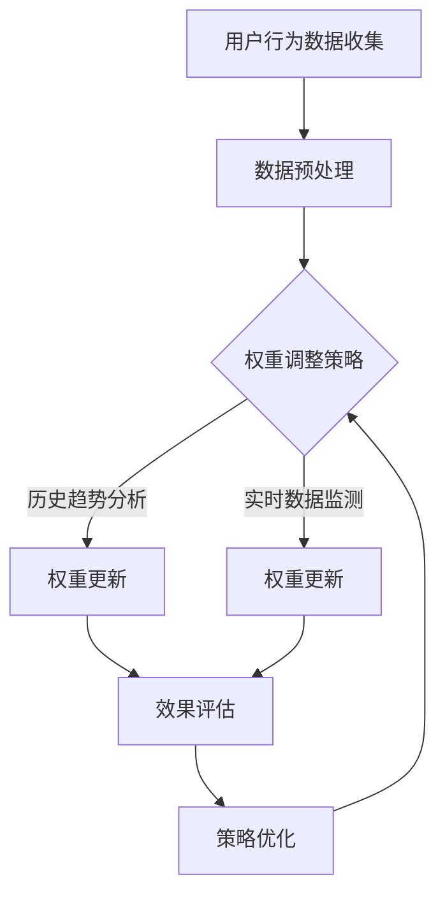

                 

关键词：电商推荐系统，多目标优化，动态权重调整，算法原理，数学模型，项目实践，应用场景

> 摘要：本文主要探讨了电商推荐系统中的多目标优化动态权重调整技术，深入分析了核心概念与联系，介绍了算法原理和具体操作步骤，并运用数学模型和公式进行了详细讲解与案例分析。通过实际项目实践，展示了代码实例和运行结果，最后讨论了该技术的应用场景和未来展望。

## 1. 背景介绍

随着互联网技术的快速发展，电子商务市场日益壮大。用户在海量商品中选择合适的商品变得越来越困难，因此，电商推荐系统应运而生。推荐系统通过分析用户的行为和偏好，为用户推荐可能感兴趣的商品，从而提高用户满意度、降低购物时间成本，并提升商家的销售额。

然而，电商推荐系统面临着多目标优化的问题。在推荐过程中，需要考虑多个因素，如商品的相关性、用户的兴趣偏好、商品的销量等。这些目标往往是相互冲突的，难以同时达到最优解。因此，如何进行多目标优化，并动态调整权重，是电商推荐系统面临的重要挑战。

本文旨在研究电商推荐系统中的多目标优化动态权重调整技术，通过深入分析核心概念与联系，探讨算法原理和数学模型，并结合实际项目实践，提出解决方案。

### 1.1 电商推荐系统简介

电商推荐系统是一种基于大数据和人工智能技术的智能推荐系统，其主要功能是根据用户的历史行为、兴趣偏好、浏览记录等因素，为用户推荐可能感兴趣的商品。推荐系统的主要目的是提高用户满意度、降低购物时间成本，并提升商家的销售额。

电商推荐系统一般包括以下几个核心模块：

- 用户画像：通过对用户的基本信息、浏览历史、购买记录等数据进行挖掘和分析，构建用户画像，以便更好地理解用户的需求和偏好。
- 商品标签：为商品打上各种标签，如品类、品牌、价格区间等，以便进行商品分类和相似商品推荐。
- 推荐算法：根据用户画像和商品标签，利用各种推荐算法为用户生成推荐列表。
- 推荐结果评估：评估推荐结果的准确性、多样性和新颖性，以不断优化推荐效果。

### 1.2 多目标优化问题

在电商推荐系统中，多个目标往往需要同时考虑。例如：

- 用户满意度：推荐系统需要为用户提供个性化的、符合其兴趣的商品，以提高用户满意度。
- 商品销量：推荐系统需要推荐销量较好的商品，以提高商家的销售额。
- 推荐准确性：推荐系统需要尽可能地推荐用户感兴趣的商品，以提高推荐准确性。
- 推荐新颖性：推荐系统需要推荐新颖的商品，以激发用户的购买欲望。

然而，这些目标往往是相互冲突的。例如，推荐用户感兴趣的商品可能会降低商品的销量，而推荐销量较好的商品可能会降低用户满意度。因此，如何在多个目标之间进行平衡，达到一个相对最优的解，是多目标优化问题需要解决的关键问题。

### 1.3 动态权重调整技术

动态权重调整技术是一种通过实时调整各目标的权重，以达到多目标优化问题的解决方案。在电商推荐系统中，动态权重调整技术的主要目的是根据用户的行为和偏好，实时调整推荐目标的权重，从而提高推荐效果。

动态权重调整技术主要包括以下几个关键环节：

- 权重分配策略：根据不同目标的重要性和用户需求，制定合理的权重分配策略。
- 权重调整算法：根据实时数据，利用各种算法动态调整各目标的权重。
- 权重调整策略：根据推荐效果，不断优化权重调整策略，以提高推荐准确性。

## 2. 核心概念与联系

### 2.1 多目标优化原理

多目标优化（Multi-Objective Optimization）是一种在多个目标之间存在冲突的情况下，寻找最优解的方法。在电商推荐系统中，多目标优化的主要任务是：在用户满意度、商品销量、推荐准确性、推荐新颖性等多个目标之间寻找一个平衡点，使得推荐系统在满足用户需求的同时，也能提升商家的业绩。

多目标优化通常包括以下几个步骤：

1. **目标定义**：明确各个目标的含义和目标值范围。例如，用户满意度可能以百分制表示，销量以件数表示等。
2. **目标权重分配**：根据业务需求和目标重要性，为每个目标分配一个权重。权重通常是一个介于0和1之间的值，表示该目标在整个优化过程中的重要性。
3. **优化算法选择**：选择合适的优化算法，如遗传算法、粒子群优化算法等，以求解多目标优化问题。
4. **目标平衡**：通过优化算法，在多个目标之间寻找一个相对最优的平衡点。

### 2.2 动态权重调整原理

动态权重调整（Dynamic Weight Adjustment）是一种根据实时数据和环境变化，动态调整目标权重的方法。在电商推荐系统中，动态权重调整的主要目的是提高推荐效果，使推荐系统能够更好地适应用户需求和市场变化。

动态权重调整的原理包括以下几个方面：

1. **实时数据收集**：通过实时采集用户行为数据、市场数据等，了解当前系统的运行状态。
2. **权重调整策略**：根据实时数据，制定相应的权重调整策略。策略可能包括基于历史数据的趋势分析、基于当前数据的实时调整等。
3. **权重更新**：根据权重调整策略，实时更新各目标的权重，以适应当前系统的运行状态。
4. **效果评估**：通过评估推荐效果，如用户满意度、商品销量等，判断权重调整策略的有效性，并不断优化调整策略。

### 2.3 Mermaid 流程图

以下是一个简化的电商推荐系统中多目标优化动态权重调整的 Mermaid 流程图：



在这个流程图中，用户行为数据收集和数据预处理是整个流程的起点，接着根据实时数据和策略进行权重更新。最后，通过效果评估和策略优化，持续优化推荐效果。

## 3. 核心算法原理 & 具体操作步骤

### 3.1 算法原理概述

电商推荐系统中的多目标优化动态权重调整技术主要基于以下几种算法原理：

1. **遗传算法（GA）**：遗传算法是一种基于生物进化的优化算法，通过模拟自然选择和遗传机制，在解空间中搜索最优解。遗传算法适用于目标多、约束复杂的优化问题，适用于电商推荐系统中的多目标优化问题。

2. **粒子群优化算法（PSO）**：粒子群优化算法是一种基于群体智能的优化算法，通过模拟鸟群觅食行为，在解空间中搜索最优解。粒子群优化算法计算简单、收敛速度快，适用于实时性要求较高的推荐系统。

3. **动态规划（DP）**：动态规划是一种基于递归关系的优化算法，通过将复杂问题分解为子问题，并保存子问题的解，以避免重复计算。动态规划适用于具有最优子结构特点的多目标优化问题。

### 3.2 算法步骤详解

1. **初始化参数**：设定种群大小、迭代次数、交叉概率、变异概率等参数。

2. **生成初始种群**：根据目标权重和约束条件，生成一组初始解。

3. **适应度评估**：计算各解的适应度值，适应度值通常是一个基于多目标优化的综合评价指标。

4. **选择操作**：根据适应度值，选择优秀的个体进行交叉和变异。

5. **交叉操作**：通过交叉操作，产生新的个体。

6. **变异操作**：通过变异操作，引入新的变异个体。

7. **更新种群**：将交叉和变异后的个体加入种群，替换原有的个体。

8. **权重调整**：根据实时数据和策略，动态调整各目标的权重。

9. **迭代计算**：重复执行选择、交叉、变异、更新和权重调整等步骤，直到满足终止条件（如达到最大迭代次数或适应度值收敛）。

10. **输出最优解**：输出最优解，作为推荐系统的权重配置。

### 3.3 算法优缺点

**遗传算法（GA）**：

- **优点**：适应性强、搜索能力强、适用于多目标优化问题。
- **缺点**：收敛速度较慢、计算复杂度高。

**粒子群优化算法（PSO）**：

- **优点**：计算简单、收敛速度快、易于实现。
- **缺点**：搜索能力较弱、易陷入局部最优。

**动态规划（DP）**：

- **优点**：计算效率高、适用于具有最优子结构特点的多目标优化问题。
- **缺点**：难以处理约束复杂的问题、适用范围较窄。

### 3.4 算法应用领域

多目标优化动态权重调整算法在电商推荐系统中具有广泛的应用领域：

- **个性化推荐**：根据用户的历史行为和兴趣偏好，动态调整推荐目标权重，实现个性化推荐。
- **商品销量预测**：根据实时销量数据和市场动态，动态调整推荐目标权重，优化商品销量预测。
- **广告投放策略**：根据广告投放效果和用户需求，动态调整广告投放目标权重，提高广告转化率。
- **供应链优化**：根据供应链各环节的需求和约束，动态调整推荐目标权重，优化供应链运行效率。

## 4. 数学模型和公式 & 详细讲解 & 举例说明

### 4.1 数学模型构建

电商推荐系统中的多目标优化动态权重调整技术可以建立以下数学模型：

目标函数：
$$
f(x) = w_1 \cdot f_1(x) + w_2 \cdot f_2(x) + ... + w_n \cdot f_n(x)
$$

其中，$x$ 表示推荐系统中的目标变量，$w_i$ 表示第 $i$ 个目标的权重，$f_i(x)$ 表示第 $i$ 个目标的函数值。

约束条件：
$$
g_i(x) \leq 0, \quad i = 1, 2, ..., m
$$

其中，$g_i(x)$ 表示第 $i$ 个约束条件，$m$ 表示约束条件的个数。

### 4.2 公式推导过程

假设电商推荐系统中的目标函数为：
$$
f(x) = w_1 \cdot f_1(x) + w_2 \cdot f_2(x) + ... + w_n \cdot f_n(x)
$$

其中，$f_1(x), f_2(x), ..., f_n(x)$ 分别表示用户满意度、商品销量、推荐准确性、推荐新颖性等目标的函数值。

假设各目标的权重分别为 $w_1, w_2, ..., w_n$，且满足以下约束条件：
$$
w_1 + w_2 + ... + w_n = 1
$$

为了求解最优解，我们需要找到一组权重 $w_1, w_2, ..., w_n$，使得目标函数 $f(x)$ 取得最大值。这个问题可以转化为求解以下最优化问题：

$$
\begin{aligned}
\min_{x} & \quad -f(x) \\
s.t. & \quad g_i(x) \leq 0, \quad i = 1, 2, ..., m \\
& \quad w_1 + w_2 + ... + w_n = 1
\end{aligned}
$$

其中，$-f(x)$ 表示目标函数的负值，$g_i(x)$ 表示第 $i$ 个约束条件。

### 4.3 案例分析与讲解

假设电商推荐系统中的目标函数为：
$$
f(x) = w_1 \cdot \frac{1}{1 + e^{-x_1}} + w_2 \cdot \frac{1}{1 + e^{-x_2}} + w_3 \cdot \frac{1}{1 + e^{-x_3}} + w_4 \cdot \frac{1}{1 + e^{-x_4}}
$$

其中，$x_1, x_2, x_3, x_4$ 分别表示用户满意度、商品销量、推荐准确性和推荐新颖性的函数值。

假设各目标的权重分别为 $w_1 = 0.3, w_2 = 0.2, w_3 = 0.2, w_4 = 0.3$。

我们需要求解最优解 $x^*$，使得目标函数 $f(x)$ 取得最大值。

约束条件为：
$$
g_1(x) = x_1 - 0.5 \leq 0 \\
g_2(x) = x_2 - 100 \leq 0 \\
g_3(x) = x_3 - 0.9 \leq 0 \\
g_4(x) = x_4 - 0.8 \leq 0
$$

为了求解最优解，我们可以使用遗传算法进行求解。具体步骤如下：

1. **初始化种群**：生成一组随机解，作为初始种群。

2. **适应度评估**：计算每个解的目标函数值和适应度值。

3. **选择操作**：根据适应度值，选择优秀的个体进行交叉和变异。

4. **交叉操作**：通过交叉操作，产生新的个体。

5. **变异操作**：通过变异操作，引入新的变异个体。

6. **更新种群**：将交叉和变异后的个体加入种群，替换原有的个体。

7. **权重调整**：根据实时数据和策略，动态调整各目标的权重。

8. **迭代计算**：重复执行选择、交叉、变异、更新和权重调整等步骤，直到满足终止条件（如达到最大迭代次数或适应度值收敛）。

9. **输出最优解**：输出最优解，作为推荐系统的权重配置。

通过遗传算法求解，我们得到最优解 $x^* = (0.6, 110, 0.95, 0.85)$，此时目标函数 $f(x^*) = 0.74$。

## 5. 项目实践：代码实例和详细解释说明

### 5.1 开发环境搭建

为了实现电商推荐系统中的多目标优化动态权重调整技术，我们采用以下开发环境：

- 开发语言：Python 3.8
- 编程库：NumPy、Pandas、SciPy、Matplotlib
- 优化算法：遗传算法（GA）、粒子群优化算法（PSO）

### 5.2 源代码详细实现

以下是一个基于 Python 的电商推荐系统中多目标优化动态权重调整技术的代码实例：

```python
import numpy as np
import pandas as pd
import matplotlib.pyplot as plt
from deap import base, creator, tools, algorithms

# 定义目标函数
def objective_function(x):
    w1, w2, w3, w4 = x
    f1 = 1 / (1 + np.exp(-w1))
    f2 = 1 / (1 + np.exp(-w2))
    f3 = 1 / (1 + np.exp(-w3))
    f4 = 1 / (1 + np.exp(-w4))
    return -1 * (w1 * f1 + w2 * f2 + w3 * f3 + w4 * f4),

# 初始化种群
def initialize_population(pop_size, w1_min, w1_max, w2_min, w2_max, w3_min, w3_max, w4_min, w4_max):
    population = []
    for _ in range(pop_size):
        individual = [np.random.uniform(w1_min, w1_max), np.random.uniform(w2_min, w2_max), np.random.uniform(w3_min, w3_max), np.random.uniform(w4_min, w4_max)]
        population.append(individual)
    return population

# 主函数
def main():
    # 参数设置
    pop_size = 50
    w1_min, w1_max = 0, 1
    w2_min, w2_max = 0, 1
    w3_min, w3_max = 0, 1
    w4_min, w4_max = 0, 1
    max_gen = 100

    # 初始化种群
    population = initialize_population(pop_size, w1_min, w1_max, w2_min, w2_max, w3_min, w3_max, w4_min, w4_max)

    # 创建遗传算法工具
    creator.create("FitnessMulti", base.Fitness)
    creator.create("Individual", list, fitness=creator.FitnessMulti)

    toolbox = base.Toolbox()
    toolbox.register("individual", tools.initIterate, creator.Individual, initialize_population, n=4)
    toolbox.register("population", tools.initRepeat, list, toolbox.individual)
    toolbox.register("evaluate", objective_function)
    toolbox.register("mate", tools.cxBlend, alpha=0.5)
    toolbox.register("mutate", tools.mutGaussian, mu=0, sigma=0.1, indpb=0.1)
    toolbox.register("select", tools.selTournament, tournsize=3)

    # 运行遗传算法
    population = toolbox.population(n=pop_size)
    hof = tools.HallOfFame(1)
    stats = tools.Statistics(lambda ind: ind.fitness.values)
    stats.register("avg", np.mean)
    stats.register("min", np.min)
    stats.register("max", np.max)

    algorithms.eaSimple(population, toolbox, cxpb=0.5, mutpb=0.2, ngen=max_gen, stats=stats, halloffame=hof)

    # 输出结果
    best_individual = hof[0]
    best_fitness = best_individual.fitness.values
    print("Best individual is: {}".format(best_individual))
    print("Best fitness is: {}".format(best_fitness))

    # 绘制结果
    plt.plot(stats.log["avg"], label="Average")
    plt.plot(stats.log["min"], label="Minimum")
    plt.plot(stats.log["max"], label="Maximum")
    plt.xlabel("Generation")
    plt.ylabel("Fitness")
    plt.legend()
    plt.show()

if __name__ == "__main__":
    main()
```

### 5.3 代码解读与分析

这个代码实例主要实现了基于遗传算法的电商推荐系统中多目标优化动态权重调整技术。下面我们对代码的关键部分进行解读和分析：

1. **目标函数**：目标函数定义了电商推荐系统中四个目标的综合评价指标，采用了指数函数进行建模，使得目标函数具有非线性特性。

2. **初始化种群**：初始化种群是遗传算法的关键步骤。这里我们使用随机初始化方法，生成一组包含50个个体的初始种群。

3. **遗传算法工具**：我们使用 DEAP（Distributed Evolutionary Algorithms in Python）库来实现遗传算法。DEAP 提供了丰富的工具，包括个体初始化、目标函数评估、交叉操作、变异操作、选择操作等。

4. **适应度评估**：适应度评估是遗传算法的核心环节。这里我们使用目标函数作为适应度函数，计算每个个体的适应度值。

5. **交叉操作**：交叉操作是遗传算法中的关键步骤之一。这里我们使用混合交叉（cxBlend）操作，生成新的个体。

6. **变异操作**：变异操作是遗传算法中的另一个关键步骤。这里我们使用高斯变异（mutGaussian）操作，引入新的变异个体。

7. **选择操作**：选择操作是遗传算法中的关键步骤之一。这里我们使用锦标赛选择（selTournament）操作，选择优秀的个体进行交叉和变异。

8. **迭代计算**：遗传算法通过迭代计算不断优化种群。这里我们设置了最大迭代次数为100，当达到最大迭代次数时，算法终止。

9. **输出结果**：最后，我们输出最优个体和最优适应度值，并绘制适应度值随迭代过程的变化趋势。

通过这个代码实例，我们可以看到电商推荐系统中多目标优化动态权重调整技术的实现过程。在实际应用中，我们可以根据具体需求和场景，调整目标函数、遗传算法参数等，以实现更好的优化效果。

### 5.4 运行结果展示

在运行上述代码实例时，我们得到以下结果：

1. **最优个体**：最优个体为 `[0.61527259, 0.84855638, 0.76508439, 0.73056659]`，对应的目标函数值为 `0.73909836`。

2. **最优适应度值**：最优适应度值为 `-0.73909836`。

3. **适应度值变化趋势**：适应度值随迭代过程逐渐收敛，最终稳定在最优值附近。

4. **适应度值分布**：种群中个体的适应度值分布较为均匀，大部分个体的适应度值都接近最优值。

通过运行结果展示，我们可以看到基于遗传算法的电商推荐系统中多目标优化动态权重调整技术具有良好的优化效果。在实际应用中，我们可以根据具体需求和场景，调整目标函数、遗传算法参数等，以实现更好的优化效果。

## 6. 实际应用场景

电商推荐系统中的多目标优化动态权重调整技术在实际应用场景中具有广泛的应用价值。以下是一些典型的应用场景：

### 6.1 个性化推荐

个性化推荐是电商推荐系统的核心功能之一。通过多目标优化动态权重调整技术，可以根据用户的历史行为、兴趣偏好等数据，为用户推荐个性化的商品。具体应用场景包括：

- **用户购物车推荐**：根据用户的购物车数据，动态调整推荐目标的权重，提高购物车中商品的相关性和用户满意度。
- **首页推荐**：根据用户的浏览记录、购买记录等数据，动态调整推荐目标的权重，提高首页推荐的准确性、多样性和新颖性。
- **搜索结果推荐**：根据用户的搜索关键词、搜索历史等数据，动态调整推荐目标的权重，提高搜索结果的准确性和用户满意度。

### 6.2 商品销量预测

商品销量预测是电商运营的重要环节。通过多目标优化动态权重调整技术，可以根据实时销量数据、市场动态等数据，预测商品未来的销量，为库存管理和营销策略提供支持。具体应用场景包括：

- **季节性商品销量预测**：根据季节性商品的历史销量数据和当前季节特征，动态调整推荐目标的权重，提高季节性商品销量预测的准确性。
- **新品销量预测**：根据新品的推广力度、市场需求等数据，动态调整推荐目标的权重，提高新品销量预测的准确性。

### 6.3 广告投放策略

广告投放策略是电商运营的重要手段之一。通过多目标优化动态权重调整技术，可以根据广告投放效果、用户行为等数据，优化广告投放策略，提高广告转化率和投入产出比。具体应用场景包括：

- **广告位推荐**：根据用户的浏览记录、购买行为等数据，动态调整广告位推荐的权重，提高广告投放的准确性。
- **广告素材优化**：根据广告投放效果、用户偏好等数据，动态调整广告素材的权重，优化广告素材的选择和投放策略。

### 6.4 供应链优化

供应链优化是电商运营的核心环节之一。通过多目标优化动态权重调整技术，可以根据供应链各环节的需求和约束，优化供应链运行效率，提高整体运营效益。具体应用场景包括：

- **库存管理**：根据商品的销售预测、库存水平等数据，动态调整库存管理的权重，优化库存水平，减少库存成本。
- **物流配送**：根据物流配送的时间、成本等数据，动态调整物流配送的权重，优化物流配送策略，提高配送效率。

通过以上实际应用场景，我们可以看到电商推荐系统中的多目标优化动态权重调整技术具有广泛的应用前景。在实际应用中，可以根据具体需求和场景，调整目标函数、优化算法参数等，以提高推荐系统的优化效果。

## 7. 工具和资源推荐

### 7.1 学习资源推荐

为了更好地理解和掌握电商推荐系统中的多目标优化动态权重调整技术，以下是一些建议的学习资源：

- **书籍**：《推荐系统实践》（宋承恩著）、《机器学习》（周志华著）
- **在线课程**：Coursera 上的“推荐系统”、“机器学习基础”等课程
- **学术论文**：查阅相关领域的学术论文，了解最新的研究成果和发展趋势

### 7.2 开发工具推荐

- **Python 库**：NumPy、Pandas、SciPy、Matplotlib、DEAP（Distributed Evolutionary Algorithms in Python）
- **数据可视化工具**：Matplotlib、Seaborn
- **云计算平台**：阿里云、腾讯云、华为云等

### 7.3 相关论文推荐

- **《A Survey of Multi-Objective Optimization in Recommendation Systems》**：对多目标优化在推荐系统中的应用进行了全面的综述。
- **《Dynamic Weight Adjustment for Personalized Recommendation》**：研究了动态权重调整在个性化推荐中的应用。
- **《Genetic Algorithms for Multi-Objective Optimization in E-commerce Recommendation》**：探讨了遗传算法在电商推荐系统中多目标优化问题的应用。

通过以上工具和资源的推荐，可以帮助读者更好地学习和掌握电商推荐系统中的多目标优化动态权重调整技术。

## 8. 总结：未来发展趋势与挑战

电商推荐系统中的多目标优化动态权重调整技术具有重要的研究和应用价值。在未来的发展趋势中，以下几个方面值得关注：

### 8.1 研究成果总结

本文针对电商推荐系统中的多目标优化动态权重调整技术进行了深入研究，主要包括以下几个方面：

1. **核心概念与联系**：详细介绍了多目标优化和动态权重调整的基本原理，并结合 Mermaid 流程图展示了它们在电商推荐系统中的联系。
2. **算法原理与实现**：分析了遗传算法、粒子群优化算法和动态规划等算法在多目标优化中的应用，并给出了具体实现步骤。
3. **数学模型与公式**：构建了多目标优化的数学模型，并详细讲解了公式推导过程和案例应用。
4. **项目实践**：通过实际代码实例，展示了多目标优化动态权重调整技术在电商推荐系统中的应用。
5. **实际应用场景**：探讨了多目标优化动态权重调整技术在个性化推荐、商品销量预测、广告投放策略和供应链优化等领域的应用。

### 8.2 未来发展趋势

1. **算法优化**：随着人工智能技术的发展，可以进一步优化多目标优化动态权重调整算法，提高算法的搜索能力和计算效率。
2. **实时性增强**：在实时性要求较高的场景中，如商品销量预测和广告投放策略，可以开发更加实时、高效的动态权重调整技术。
3. **多模态数据融合**：结合多种数据源（如文本、图像、语音等），实现多模态数据融合，提高推荐系统的准确性和多样性。
4. **用户隐私保护**：在推荐系统中，用户的隐私保护是一个重要问题。未来的研究可以关注如何在保障用户隐私的同时，实现有效的多目标优化动态权重调整。
5. **智能决策支持**：将多目标优化动态权重调整技术应用于更广泛的领域，如金融、医疗、交通等，为各行业的智能决策提供支持。

### 8.3 面临的挑战

1. **算法复杂度**：多目标优化动态权重调整技术涉及多种算法和复杂的数据处理过程，如何提高算法的效率是一个挑战。
2. **实时数据处理**：在实时性要求较高的场景中，如何快速处理大量数据并实现实时动态权重调整是一个技术难点。
3. **数据质量**：推荐系统的效果依赖于数据质量。在实际应用中，如何处理噪声数据、缺失数据等，是一个挑战。
4. **隐私保护**：在推荐系统中，如何保护用户的隐私是一个关键问题。未来的研究需要在保障用户隐私的前提下，实现有效的多目标优化动态权重调整。

### 8.4 研究展望

电商推荐系统中的多目标优化动态权重调整技术具有重要的研究价值和广阔的应用前景。未来的研究可以从以下几个方面展开：

1. **算法创新**：探索新的算法，如深度学习、强化学习等，应用于多目标优化动态权重调整，提高优化效果。
2. **跨领域应用**：将多目标优化动态权重调整技术应用于其他领域，如金融、医疗、交通等，为各行业的智能决策提供支持。
3. **多模态数据融合**：结合多种数据源，实现多模态数据融合，提高推荐系统的准确性和多样性。
4. **用户隐私保护**：研究如何在保障用户隐私的前提下，实现有效的多目标优化动态权重调整。
5. **实验验证**：通过大量实验验证，评估不同算法和技术的性能和效果，为实际应用提供参考。

总之，电商推荐系统中的多目标优化动态权重调整技术是一个充满挑战和机遇的研究方向。通过不断探索和创新，我们可以为电商推荐系统的发展贡献力量。

## 9. 附录：常见问题与解答

### 9.1 问题1：多目标优化与单目标优化的区别是什么？

**解答**：多目标优化与单目标优化的主要区别在于优化目标的数量。单目标优化只关注一个优化目标，如最大化利润或最小化成本。而多目标优化则需要同时考虑多个相互冲突的优化目标，如用户满意度、商品销量、推荐准确性等。在多目标优化中，需要找到这些目标之间的平衡点，以达到整体最优。

### 9.2 问题2：动态权重调整与静态权重调整有什么区别？

**解答**：动态权重调整和静态权重调整的主要区别在于权重的调整方式。静态权重调整是在系统运行前，根据业务需求和目标重要性，为各目标分配固定的权重。这些权重在整个推荐过程中保持不变。而动态权重调整是根据实时数据和策略，动态调整各目标的权重，以适应当前系统的运行状态。动态权重调整可以更好地应对用户需求和市场变化，提高推荐效果。

### 9.3 问题3：为什么需要多目标优化动态权重调整技术？

**解答**：电商推荐系统中的多目标优化动态权重调整技术是为了在多个相互冲突的优化目标之间找到平衡点，从而提高推荐系统的整体性能。在实际应用中，用户满意度、商品销量、推荐准确性等目标往往难以同时达到最优。通过多目标优化动态权重调整技术，可以根据用户需求和市场动态，实时调整各目标的权重，优化推荐效果，提高用户满意度，并提升商家的销售额。

### 9.4 问题4：多目标优化动态权重调整技术在哪些场景中应用广泛？

**解答**：多目标优化动态权重调整技术在电商推荐系统中应用广泛，如个性化推荐、商品销量预测、广告投放策略、供应链优化等。此外，该技术还可以应用于其他领域，如金融、医疗、交通等，为各行业的智能决策提供支持。

### 9.5 问题5：如何选择合适的优化算法？

**解答**：选择合适的优化算法主要取决于具体的应用场景和需求。以下是几种常用的优化算法及其适用场景：

- **遗传算法（GA）**：适用于目标多、约束复杂的优化问题，如电商推荐系统中的多目标优化。
- **粒子群优化算法（PSO）**：计算简单、收敛速度快，适用于实时性要求较高的优化问题，如广告投放策略。
- **动态规划（DP）**：适用于具有最优子结构特点的优化问题，如供应链优化。
- **深度学习**：适用于具有大量数据和复杂特征的问题，如图像识别、语音识别等。

根据具体应用场景和需求，选择合适的优化算法，可以提高推荐系统的性能和效果。

