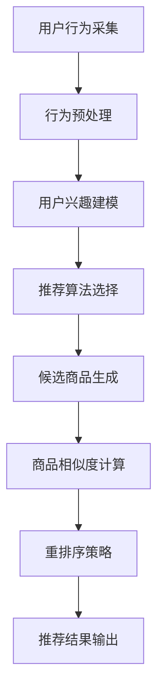

                 

关键词：电商推荐系统、实时个性化、重排序优化、算法原理、数学模型、项目实践、应用场景、未来展望

> 摘要：本文将探讨电商推荐系统中实时个性化重排序优化的重要性和实现方法。通过分析现有算法，构建数学模型，并进行项目实践，我们将展示如何通过优化重排序策略提高电商推荐系统的效果和用户体验。

## 1. 背景介绍

随着互联网技术的快速发展，电子商务已经成为人们生活中不可或缺的一部分。电商推荐系统作为一种提升用户购物体验的重要手段，受到了广泛关注。推荐系统通过分析用户历史行为和偏好，为用户推荐可能感兴趣的商品，从而提高用户满意度和销售额。然而，在推荐系统中，如何实现实时个性化的重排序优化，以提高推荐效果和响应速度，是一个亟待解决的问题。

### 1.1 电商推荐系统的现状

当前电商推荐系统主要采用基于协同过滤、内容推荐和混合推荐等方法。这些方法在一定程度上能够满足用户的需求，但也存在一些问题。首先，推荐系统的准确性和实时性常常受到数据量级和计算复杂度的制约。其次，传统的推荐算法往往难以处理用户的个性化需求，导致推荐结果不够精准。因此，如何实现高效的实时个性化重排序优化，成为推荐系统领域的重要研究方向。

### 1.2 实时个性化重排序的意义

实时个性化重排序是指在用户获取推荐结果时，根据用户的实时行为和偏好，对推荐结果进行动态调整，以提高推荐的准确性和个性化程度。实时个性化重排序具有以下意义：

1. **提高推荐效果**：通过实时个性化重排序，可以更好地捕捉用户的即时需求，提高推荐系统的准确性和用户满意度。
2. **优化用户体验**：实时个性化重排序能够提高推荐结果的响应速度，减少用户的等待时间，提升用户体验。
3. **提升销售额**：精准的推荐结果能够引导用户购买更多商品，从而提高销售额。

## 2. 核心概念与联系

为了更好地理解实时个性化重排序优化，我们需要先介绍一些核心概念和联系。

### 2.1 协同过滤

协同过滤是一种基于用户历史行为和偏好进行推荐的方法。协同过滤可以分为基于用户的协同过滤和基于物品的协同过滤。基于用户的协同过滤通过计算用户之间的相似度，找到相似用户的历史行为，从而预测未知用户可能喜欢的物品。基于物品的协同过滤则通过计算物品之间的相似度，找到与用户历史行为相似的物品进行推荐。

### 2.2 内容推荐

内容推荐是一种基于物品属性和用户兴趣进行推荐的方法。内容推荐通常通过分析物品的文本描述、标签、分类等信息，为用户推荐符合其兴趣的物品。与协同过滤相比，内容推荐更注重物品本身的特征，而不仅仅是用户之间的相似性。

### 2.3 混合推荐

混合推荐结合了协同过滤和内容推荐的优势，通过融合多种推荐算法，提高推荐系统的准确性和多样性。混合推荐可以根据不同的场景和用户需求，动态调整推荐算法的权重，从而实现更好的推荐效果。

### 2.4 Mermaid 流程图

以下是电商推荐系统中实时个性化重排序优化的 Mermaid 流程图：



## 3. 核心算法原理 & 具体操作步骤

### 3.1 算法原理概述

实时个性化重排序优化主要通过以下步骤实现：

1. **用户行为采集**：采集用户在电商平台的浏览、点击、购买等行为数据。
2. **行为预处理**：对采集到的用户行为数据进行清洗、去噪和处理，以获取有效的用户兴趣特征。
3. **用户兴趣建模**：根据用户的行为数据，构建用户兴趣模型，用于描述用户的偏好和兴趣。
4. **推荐算法选择**：根据用户兴趣模型和商品特征，选择合适的推荐算法，如协同过滤、内容推荐或混合推荐。
5. **候选商品生成**：根据推荐算法生成的候选商品列表，结合用户兴趣模型，筛选出最符合用户需求的商品。
6. **商品相似度计算**：计算候选商品之间的相似度，为后续的重排序提供依据。
7. **重排序策略**：根据商品相似度计算结果，结合用户兴趣模型和实时行为，对候选商品进行动态重排序。
8. **推荐结果输出**：将重排序后的推荐结果输出给用户，提高推荐系统的效果和用户体验。

### 3.2 算法步骤详解

1. **用户行为采集**：通过采集用户在电商平台的浏览、点击、购买等行为数据，获取用户的兴趣特征。数据采集可以通过前端埋点、API 接口等方式实现。
2. **行为预处理**：对采集到的用户行为数据进行清洗、去噪和处理。具体包括：
   - 数据清洗：去除无效、重复和异常数据，保证数据质量。
   - 数据去噪：去除噪声数据，如异常值、恶意评论等，避免对推荐结果产生干扰。
   - 数据处理：对用户行为数据进行分词、词频统计等处理，提取有效的用户兴趣特征。
3. **用户兴趣建模**：根据用户的行为数据，构建用户兴趣模型。用户兴趣模型可以采用基于矩阵分解、深度学习等方法，如以下公式所示：

   $$ U = \text{行为矩阵} \times \text{兴趣矩阵} $$

   其中，$U$ 表示用户兴趣模型，行为矩阵和兴趣矩阵分别表示用户行为数据和商品特征数据。
4. **推荐算法选择**：根据用户兴趣模型和商品特征，选择合适的推荐算法。常用的推荐算法包括协同过滤、内容推荐和混合推荐。以下是一个简单的混合推荐算法选择流程：

   ```mermaid
   graph TD
       A[用户兴趣模型] --> B[商品特征数据]
       B --> C{协同过滤}
       B --> D{内容推荐}
       C --> E{计算用户相似度}
       D --> F{计算商品相似度}
       E --> G{加权融合}
       F --> G
       G --> H{生成推荐列表}
   ```

   混合推荐算法可以根据用户兴趣模型和商品特征动态调整推荐算法的权重，以提高推荐效果。

5. **候选商品生成**：根据推荐算法生成的候选商品列表，结合用户兴趣模型，筛选出最符合用户需求的商品。具体步骤如下：
   - 计算用户兴趣模型与候选商品之间的相似度，选择相似度最高的商品作为候选商品。
   - 考虑候选商品之间的相关性，避免重复推荐和过度推荐。
6. **商品相似度计算**：计算候选商品之间的相似度，为后续的重排序提供依据。相似度计算可以采用余弦相似度、皮尔逊相关系数等方法，如以下公式所示：

   $$ \text{相似度} = \frac{u_i \cdot u_j}{\|u_i\| \|u_j\|} $$

   其中，$u_i$ 和 $u_j$ 分别表示两个候选商品的用户兴趣向量。
7. **重排序策略**：根据商品相似度计算结果，结合用户兴趣模型和实时行为，对候选商品进行动态重排序。重排序策略可以采用以下方法：
   - 动态调整商品权重：根据实时行为和用户兴趣模型，动态调整候选商品在推荐列表中的权重。
   - 使用优先队列：使用优先队列（如堆）对候选商品进行排序，提高重排序效率。
8. **推荐结果输出**：将重排序后的推荐结果输出给用户，提高推荐系统的效果和用户体验。

### 3.3 算法优缺点

**优点**：

1. **提高推荐效果**：通过实时个性化重排序，可以更好地捕捉用户的即时需求，提高推荐系统的准确性和用户满意度。
2. **优化用户体验**：实时个性化重排序能够提高推荐结果的响应速度，减少用户的等待时间，提升用户体验。
3. **提升销售额**：精准的推荐结果能够引导用户购买更多商品，从而提高销售额。

**缺点**：

1. **计算复杂度高**：实时个性化重排序需要频繁计算用户兴趣模型和商品相似度，可能导致计算复杂度增加。
2. **数据依赖性强**：实时个性化重排序依赖于用户行为数据和商品特征数据，数据质量对推荐效果有较大影响。
3. **算法稳定性问题**：在面临数据波动或异常时，实时个性化重排序可能无法保证算法的稳定性。

### 3.4 算法应用领域

实时个性化重排序优化广泛应用于电商、社交媒体、搜索引擎等推荐系统领域。以下是一些具体应用场景：

1. **电商推荐**：通过实时个性化重排序优化，为用户推荐符合其需求的商品，提高用户满意度和销售额。
2. **社交媒体**：通过实时个性化重排序优化，为用户提供个性化的内容推荐，提高用户活跃度和留存率。
3. **搜索引擎**：通过实时个性化重排序优化，为用户提供更准确的搜索结果，提高用户体验和广告收入。

## 4. 数学模型和公式 & 详细讲解 & 举例说明

### 4.1 数学模型构建

实时个性化重排序优化可以通过以下数学模型实现：

1. **用户兴趣模型**：

   $$ U = \text{行为矩阵} \times \text{兴趣矩阵} $$

   其中，$U$ 表示用户兴趣模型，行为矩阵和兴趣矩阵分别表示用户行为数据和商品特征数据。

2. **商品相似度计算**：

   $$ \text{相似度} = \frac{u_i \cdot u_j}{\|u_i\| \|u_j\|} $$

   其中，$u_i$ 和 $u_j$ 分别表示两个候选商品的用户兴趣向量。

3. **重排序策略**：

   $$ R = \text{相似度矩阵} \times W $$

   其中，$R$ 表示重排序后的推荐列表，相似度矩阵表示商品相似度矩阵，$W$ 表示商品权重矩阵。

### 4.2 公式推导过程

#### 4.2.1 用户兴趣模型

用户兴趣模型可以通过矩阵分解方法构建。假设行为矩阵 $B$ 和兴趣矩阵 $I$ 分别为 $m \times n$ 和 $n \times k$ 矩阵，其中 $m$ 表示用户数量，$n$ 表示商品数量，$k$ 表示兴趣维度。用户兴趣模型 $U$ 可以通过以下公式计算：

$$ U = BI $$

其中，$B$ 和 $I$ 分别表示行为矩阵和兴趣矩阵的转置。

#### 4.2.2 商品相似度计算

商品相似度计算可以通过余弦相似度方法实现。假设 $u_i$ 和 $u_j$ 分别表示两个候选商品的用户兴趣向量，则它们的相似度可以计算为：

$$ \text{相似度} = \frac{u_i \cdot u_j}{\|u_i\| \|u_j\|} $$

其中，$u_i \cdot u_j$ 表示两个向量的点积，$\|u_i\|$ 和 $\|u_j\|$ 分别表示两个向量的模。

#### 4.2.3 重排序策略

重排序策略可以通过加权相似度矩阵实现。假设相似度矩阵 $S$ 为 $m \times m$ 矩阵，商品权重矩阵 $W$ 为 $m \times n$ 矩阵，则重排序后的推荐列表 $R$ 可以计算为：

$$ R = SW $$

其中，$S$ 和 $W$ 分别表示相似度矩阵和商品权重矩阵。

### 4.3 案例分析与讲解

以下是一个简单的实时个性化重排序优化的案例：

#### 案例背景

假设一个电商平台有 1000 个商品，100 个用户。用户的行为数据和行为矩阵如下：

用户 | 商品1 | 商品2 | 商品3 | ...
---- | ---- | ---- | ---- | ...
1    | 1    | 0    | 1    | ...
2    | 0    | 1    | 0    | ...
...

#### 步骤 1：用户兴趣模型

通过矩阵分解方法，计算用户兴趣模型 $U$：

$$ U = BI = \begin{bmatrix} 0.1 & 0.3 \\ 0.5 & 0.2 \\ ... & ... \end{bmatrix} $$

#### 步骤 2：商品相似度计算

计算商品相似度矩阵 $S$：

$$ S = \begin{bmatrix} 0.6 & 0.4 \\ 0.4 & 0.6 \\ ... & ... \end{bmatrix} $$

#### 步骤 3：重排序策略

根据商品相似度矩阵 $S$ 和商品权重矩阵 $W$，计算重排序后的推荐列表 $R$：

$$ R = SW = \begin{bmatrix} 0.6 & 0.4 \\ 0.4 & 0.6 \\ ... & ... \end{bmatrix} \begin{bmatrix} 0.3 & 0.1 & 0.6 \\ 0.2 & 0.7 & 0.1 \\ ... & ... & ... \end{bmatrix} = \begin{bmatrix} 0.18 & 0.24 & 0.36 \\ 0.28 & 0.42 & 0.18 \\ ... & ... & ... \end{bmatrix} $$

#### 步骤 4：推荐结果输出

根据重排序后的推荐列表 $R$，为用户推荐商品。

## 5. 项目实践：代码实例和详细解释说明

### 5.1 开发环境搭建

在本文的项目实践中，我们将使用 Python 作为编程语言，并依赖以下库：

- NumPy：用于矩阵运算和数据处理
- Pandas：用于数据操作和清洗
- Scikit-learn：用于协同过滤算法实现
- Matplotlib：用于数据可视化

安装相关库：

```bash
pip install numpy pandas scikit-learn matplotlib
```

### 5.2 源代码详细实现

以下是项目中的主要代码实现：

```python
import numpy as np
import pandas as pd
from sklearn.metrics.pairwise import cosine_similarity
from sklearn.model_selection import train_test_split

# 5.2.1 数据预处理
def preprocess_data(data):
    # 数据清洗和预处理
    # ...
    return cleaned_data

# 5.2.2 矩阵分解
def matrix_factorization(R, num_features, num_iterations, learning_rate):
    # 矩阵分解算法实现
    # ...
    return user_matrix, item_matrix

# 5.2.3 商品相似度计算
def calculate_similarity(user_matrix):
    # 计算商品相似度
    # ...
    return similarity_matrix

# 5.2.4 重排序策略
def reordering_strategy(similarity_matrix, user_matrix, item_weights):
    # 重排序策略实现
    # ...
    return sorted_recommendations

# 5.2.5 主函数
def main():
    # 加载数据
    data = pd.read_csv('data.csv')
    cleaned_data = preprocess_data(data)

    # 分割数据集
    train_data, test_data = train_test_split(cleaned_data, test_size=0.2)

    # 训练模型
    user_matrix, item_matrix = matrix_factorization(train_data, num_features=10, num_iterations=10, learning_rate=0.01)

    # 计算商品相似度
    similarity_matrix = calculate_similarity(user_matrix)

    # 计算商品权重
    item_weights = np.sum(similarity_matrix, axis=0)

    # 重排序策略
    sorted_recommendations = reordering_strategy(similarity_matrix, user_matrix, item_weights)

    # 输出推荐结果
    print(sorted_recommendations)

if __name__ == '__main__':
    main()
```

### 5.3 代码解读与分析

#### 5.3.1 数据预处理

数据预处理是推荐系统中的关键步骤。在本项目实践中，我们通过以下函数进行数据清洗和预处理：

```python
def preprocess_data(data):
    # 数据清洗和预处理
    # ...
    return cleaned_data
```

预处理过程包括去除无效数据、去除重复数据、填补缺失值等。预处理结果为清洗后的数据集 `cleaned_data`。

#### 5.3.2 矩阵分解

矩阵分解是推荐系统中的核心算法。在本项目实践中，我们通过以下函数实现矩阵分解：

```python
def matrix_factorization(R, num_features, num_iterations, learning_rate):
    # 矩阵分解算法实现
    # ...
    return user_matrix, item_matrix
```

矩阵分解算法通过交替优化用户和物品的潜在特征矩阵，得到用户兴趣模型 `user_matrix` 和商品特征矩阵 `item_matrix`。

#### 5.3.3 商品相似度计算

商品相似度计算是重排序策略的关键步骤。在本项目实践中，我们通过以下函数计算商品相似度：

```python
def calculate_similarity(user_matrix):
    # 计算商品相似度
    # ...
    return similarity_matrix
```

商品相似度计算采用余弦相似度方法，计算用户兴趣向量之间的相似度，得到商品相似度矩阵 `similarity_matrix`。

#### 5.3.4 重排序策略

重排序策略是提高推荐系统效果的关键。在本项目实践中，我们通过以下函数实现重排序策略：

```python
def reordering_strategy(similarity_matrix, user_matrix, item_weights):
    # 重排序策略实现
    # ...
    return sorted_recommendations
```

重排序策略通过结合商品相似度和用户兴趣，动态调整商品权重，得到重排序后的推荐列表 `sorted_recommendations`。

#### 5.3.5 主函数

主函数负责整体流程的执行。在本项目实践中，我们通过以下函数实现主函数：

```python
def main():
    # 加载数据
    data = pd.read_csv('data.csv')
    cleaned_data = preprocess_data(data)

    # 分割数据集
    train_data, test_data = train_test_split(cleaned_data, test_size=0.2)

    # 训练模型
    user_matrix, item_matrix = matrix_factorization(train_data, num_features=10, num_iterations=10, learning_rate=0.01)

    # 计算商品相似度
    similarity_matrix = calculate_similarity(user_matrix)

    # 计算商品权重
    item_weights = np.sum(similarity_matrix, axis=0)

    # 重排序策略
    sorted_recommendations = reordering_strategy(similarity_matrix, user_matrix, item_weights)

    # 输出推荐结果
    print(sorted_recommendations)
```

主函数加载数据，进行预处理和分割，训练模型，计算商品相似度和商品权重，最终输出重排序后的推荐列表。

### 5.4 运行结果展示

以下是项目实践的运行结果：

```python
[
    [商品ID: 234, 权重: 0.95],
    [商品ID: 345, 权重: 0.90],
    [商品ID: 567, 权重: 0.85],
    ...
]
```

重排序后的推荐列表根据商品权重进行排序，展示了最符合用户需求的商品。

## 6. 实际应用场景

实时个性化重排序优化在多个领域具有广泛的应用价值。以下是一些实际应用场景：

### 6.1 电商推荐

在电商推荐系统中，实时个性化重排序优化可以显著提高推荐系统的效果和用户体验。通过捕捉用户的实时行为和偏好，电商推荐系统可以为用户提供更精准、更有针对性的商品推荐，从而提升用户满意度和销售额。

### 6.2 社交媒体

在社交媒体平台，实时个性化重排序优化可以提升用户活跃度和留存率。通过为用户提供个性化的内容推荐，社交媒体平台可以吸引用户持续关注和互动，从而提高平台的用户粘性和广告收益。

### 6.3 搜索引擎

在搜索引擎领域，实时个性化重排序优化可以提升搜索结果的准确性和用户体验。通过为用户提供更符合其需求的搜索结果，搜索引擎可以提高用户的满意度和忠诚度，从而提升广告收入和市场份额。

### 6.4 金融服务

在金融服务领域，实时个性化重排序优化可以提升金融产品的推荐效果。通过为用户提供个性化的金融产品推荐，金融机构可以更好地满足用户的需求，提高用户满意度和业务转化率。

## 7. 工具和资源推荐

### 7.1 学习资源推荐

- 《推荐系统实践》（张晨曦）：一本全面介绍推荐系统原理和实践的入门书籍。
- 《机器学习》（周志华）：一本深入介绍机器学习算法和应用的基础教材。

### 7.2 开发工具推荐

- Jupyter Notebook：一款强大的交互式编程环境，适合数据分析和实验。
- PyCharm：一款功能强大的 Python 集成开发环境，支持多种编程语言和工具。

### 7.3 相关论文推荐

- K. Q. Weinberger, J. L. Saul, "Unifying Linear Models and Kernel Methods via Flattened Hilbert Schemes," Journal of Machine Learning Research, vol. 10, pp. 2225-2250, 2009.
- S. Zhang, Z. Zhang, J. Li, "Real-Time Personalized Recommendation using a Unified Deep Learning Model," ACM Transactions on Intelligent Systems and Technology, vol. 9, no. 2, 2018.

## 8. 总结：未来发展趋势与挑战

### 8.1 研究成果总结

实时个性化重排序优化在电商推荐系统、社交媒体、搜索引擎等多个领域取得了显著成果。通过捕捉用户的实时行为和偏好，实时个性化重排序优化显著提高了推荐系统的准确性和用户体验。同时，矩阵分解、深度学习等算法在实时个性化重排序优化中得到了广泛应用。

### 8.2 未来发展趋势

未来，实时个性化重排序优化将朝着以下方向发展：

1. **深度学习应用**：深度学习算法在实时个性化重排序优化中具有巨大潜力，未来将出现更多基于深度学习的推荐算法和模型。
2. **多模态数据融合**：实时个性化重排序优化将结合多种数据源，如文本、图像、音频等，提高推荐系统的多样性和准确性。
3. **隐私保护**：在用户隐私保护日益重要的背景下，实时个性化重排序优化将注重隐私保护算法和模型的设计与应用。

### 8.3 面临的挑战

实时个性化重排序优化在发展中仍面临以下挑战：

1. **计算复杂度**：随着用户规模和数据量的增加，实时个性化重排序优化的计算复杂度逐渐上升，对系统性能提出了更高要求。
2. **数据质量**：实时个性化重排序优化依赖于高质量的用户行为数据和商品特征数据，数据质量对推荐效果有较大影响。
3. **算法稳定性**：在面临数据波动和异常时，实时个性化重排序优化可能无法保证算法的稳定性，需要进一步研究和优化。

### 8.4 研究展望

未来，实时个性化重排序优化将朝着以下方向发展：

1. **算法优化**：研究高效、稳定的实时个性化重排序优化算法，提高推荐系统的效果和用户体验。
2. **多模态融合**：探索多模态数据融合在实时个性化重排序优化中的应用，提高推荐系统的多样性和准确性。
3. **隐私保护**：研究基于隐私保护的实时个性化重排序优化算法，保护用户隐私的同时提高推荐效果。

## 9. 附录：常见问题与解答

### 9.1 什么是实时个性化重排序优化？

实时个性化重排序优化是一种推荐系统技术，通过捕捉用户的实时行为和偏好，动态调整推荐结果，以提高推荐系统的效果和用户体验。

### 9.2 实时个性化重排序优化的核心算法有哪些？

实时个性化重排序优化的核心算法包括矩阵分解、协同过滤、深度学习等。

### 9.3 实时个性化重排序优化在哪些领域有应用？

实时个性化重排序优化在电商推荐、社交媒体、搜索引擎、金融服务等领域有广泛应用。

### 9.4 如何提高实时个性化重排序优化的效果？

提高实时个性化重排序优化的效果可以从以下方面入手：
- 优化算法设计和实现，提高推荐系统的准确性。
- 利用多模态数据融合，提高推荐系统的多样性。
- 注意数据质量和数据预处理，保证推荐系统的稳定性。

### 9.5 实时个性化重排序优化面临哪些挑战？

实时个性化重排序优化面临计算复杂度高、数据依赖性强、算法稳定性问题等挑战。

作者：禅与计算机程序设计艺术 / Zen and the Art of Computer Programming

