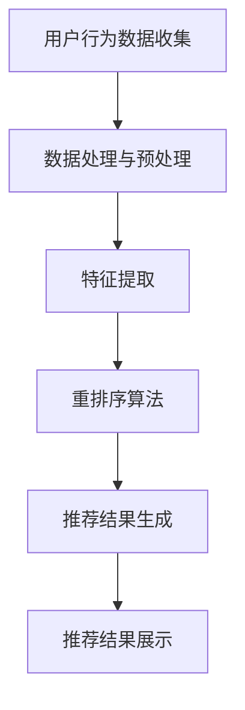

                 

关键词：电商推荐系统、实时个性化、重排序策略、优化、算法原理

## 摘要

本文旨在深入探讨电商推荐系统中的实时个性化重排序策略优化。随着互联网技术的飞速发展和大数据的广泛应用，电商推荐系统已经成为电商平台提高用户粘性、提升销售额的重要手段。然而，传统的推荐算法在处理海量数据和用户实时行为时，往往无法实现高效且个性化的推荐结果。本文将围绕实时个性化重排序策略，分析其核心概念、算法原理，并提出一种基于深度学习技术的优化方案。通过具体实例和数学模型，本文将详细解释优化策略的实现过程，并在实际应用中展示其效果。最后，本文将对未来发展趋势和面临的挑战进行展望，为推荐系统的进一步研究提供参考。

## 1. 背景介绍

### 电商推荐系统的重要性

电商推荐系统是现代电子商务领域的一项核心技术，它通过分析用户的购买历史、浏览行为、兴趣爱好等信息，为用户推荐可能感兴趣的商品。这一系统不仅有助于提高用户的购物体验，还能显著提升电商平台的销售额和用户粘性。

### 传统推荐算法的局限性

尽管传统推荐算法如协同过滤、基于内容的推荐等在电商推荐系统中发挥了重要作用，但它们在面对海量用户数据和实时行为时，存在明显的局限性。首先，这些算法在处理海量数据时，计算复杂度高，响应速度较慢。其次，它们往往缺乏对用户个性化需求的深入理解，导致推荐结果不够精准。

### 实时个性化重排序策略的意义

实时个性化重排序策略旨在克服传统推荐算法的局限性，通过实时处理用户行为数据，动态调整推荐结果，提高推荐的准确性和实时性。这一策略在电商推荐系统中具有重要意义，有助于实现更加个性化的购物体验，从而提升用户满意度和平台销售额。

## 2. 核心概念与联系

### 实时个性化重排序策略的定义

实时个性化重排序策略是一种基于用户实时行为数据的推荐算法，通过动态调整商品推荐顺序，实现个性化推荐。具体来说，该策略会根据用户的当前行为，如浏览、收藏、购买等，实时更新推荐列表，确保用户看到的是最相关、最有价值的商品。

### 关键概念的联系

在实时个性化重排序策略中，以下几个核心概念紧密相连：

- **用户行为数据**：包括用户的浏览历史、购买记录、搜索关键词等，是构建个性化推荐的基础。
- **商品特征**：包括商品的种类、品牌、价格、评价等，用于描述商品本身的特点。
- **重排序算法**：负责根据用户行为数据和商品特征，动态调整推荐列表的顺序，实现个性化推荐。

### Mermaid 流程图

以下是一个简化的 Mermaid 流程图，展示了实时个性化重排序策略的核心流程：



### 2.1 用户行为数据收集

用户行为数据是构建实时个性化重排序策略的基础。通常，这些数据包括用户的浏览历史、购买记录、收藏列表、搜索关键词等。通过收集这些数据，可以全面了解用户的行为模式和兴趣爱好。

### 2.2 数据处理与预处理

收集到的用户行为数据通常包含噪声和冗余信息，因此需要进行数据处理和预处理。这一步骤包括数据清洗、去重、归一化等操作，以确保数据的质量和一致性。

### 2.3 特征提取

在数据处理和预处理完成后，需要从用户行为数据中提取有用的特征。这些特征可以是基于统计的，如用户的平均浏览时长、购买频率等，也可以是基于机器学习的，如用户兴趣的词向量表示。

### 2.4 重排序算法

重排序算法是实时个性化重排序策略的核心。常见的重排序算法包括基于用户行为的历史模式、基于内容的相关性计算、基于上下文的推荐等。这些算法通过综合考虑用户行为数据、商品特征和推荐上下文，动态调整推荐列表的顺序。

### 2.5 推荐结果生成

在重排序算法处理后，会生成一个初步的推荐列表。接下来，需要对这个列表进行优化和调整，确保推荐的准确性和实时性。

### 2.6 推荐结果展示

最后，将优化后的推荐结果展示给用户。这一步骤需要考虑用户的设备类型、网络环境等因素，确保推荐结果的流畅展示。

## 3. 核心算法原理 & 具体操作步骤

### 3.1 算法原理概述

实时个性化重排序策略的核心原理是基于用户实时行为数据和商品特征，通过动态调整推荐列表的顺序，实现个性化推荐。具体来说，算法会首先收集用户的实时行为数据，然后利用这些数据对商品进行排序，最后将排序后的商品推荐给用户。

### 3.2 算法步骤详解

#### 3.2.1 数据收集

数据收集是实时个性化重排序策略的第一步，主要包括以下几种数据：

- **用户浏览历史**：记录用户在平台上的浏览记录，包括浏览的商品种类、浏览时长等。
- **购买记录**：记录用户的购买历史，包括购买的商品种类、购买频率等。
- **收藏列表**：记录用户收藏的商品，反映用户的兴趣偏好。
- **搜索关键词**：记录用户在平台上的搜索行为，帮助理解用户当前的需求和兴趣。

#### 3.2.2 数据预处理

在数据收集完成后，需要对数据进行预处理，包括数据清洗、去重、归一化等操作。这一步骤的目的是确保数据的质量和一致性，为后续的特征提取和重排序算法提供可靠的数据基础。

#### 3.2.3 特征提取

特征提取是将原始数据转换为可用于算法处理的形式。常见的特征提取方法包括：

- **统计特征**：如用户的平均浏览时长、购买频率等。
- **机器学习特征**：如用户的兴趣词向量表示、商品的特征向量表示等。

#### 3.2.4 重排序算法

重排序算法是实时个性化重排序策略的核心。常见的重排序算法包括：

- **基于用户行为的历史模式**：如基于最近行为的时间窗口，将用户最近浏览、购买或收藏的商品优先推荐。
- **基于内容的相关性计算**：如基于商品的特征向量，计算商品之间的相似度，将相似度较高的商品推荐给用户。
- **基于上下文的推荐**：如根据用户的地理位置、设备类型、当前时间等上下文信息，调整推荐列表的顺序。

#### 3.2.5 推荐结果生成

在重排序算法处理后，会生成一个初步的推荐列表。接下来，需要对这个列表进行优化和调整，确保推荐的准确性和实时性。常见的优化方法包括：

- **基于用户反馈的调整**：根据用户的点击、购买等反馈行为，动态调整推荐列表的顺序。
- **基于机器学习模型的优化**：利用机器学习模型，如决策树、随机森林等，对推荐结果进行预测和调整。

#### 3.2.6 推荐结果展示

最后，将优化后的推荐结果展示给用户。这一步骤需要考虑用户的设备类型、网络环境等因素，确保推荐结果的流畅展示。常见的展示方式包括：

- **首页推荐**：在用户打开平台时，直接展示推荐结果。
- **搜索结果页推荐**：在用户进行搜索时，根据搜索关键词和用户历史行为，展示个性化推荐结果。
- **商品详情页推荐**：在用户浏览商品详情时，根据用户的兴趣偏好，推荐相关商品。

### 3.3 算法优缺点

#### 优点

- **实时性**：实时个性化重排序策略能够根据用户的实时行为动态调整推荐列表，确保用户看到的是最新、最相关的商品。
- **个性化**：通过深入分析用户的浏览历史、购买记录等行为数据，实现个性化推荐，提高用户满意度。
- **灵活性**：算法可以根据不同的业务场景和用户需求，灵活调整推荐策略，适应不同的推荐场景。

#### 缺点

- **计算复杂度**：实时个性化重排序策略需要对海量用户行为数据进行实时处理，计算复杂度较高，可能影响系统的响应速度。
- **数据质量**：用户行为数据的准确性和完整性直接影响推荐效果，数据质量较差可能导致推荐结果不准确。
- **隐私保护**：在收集和处理用户行为数据时，需要关注隐私保护问题，确保用户数据的安全和隐私。

### 3.4 算法应用领域

实时个性化重排序策略在电商推荐系统中具有广泛的应用领域，包括：

- **电商平台首页推荐**：通过实时个性化重排序策略，为用户推荐最感兴趣的商品，提高用户留存率和转化率。
- **商品详情页推荐**：根据用户的浏览历史和购买记录，为用户推荐相关的商品，提高购物体验和满意度。
- **搜索结果页推荐**：根据用户的搜索关键词和兴趣偏好，为用户推荐相关的商品，提高搜索结果的准确性和用户体验。

## 4. 数学模型和公式 & 详细讲解 & 举例说明

### 4.1 数学模型构建

在实时个性化重排序策略中，数学模型用于描述用户行为数据、商品特征和推荐结果之间的关系。以下是构建数学模型的基本步骤：

#### 4.1.1 用户行为数据表示

用户行为数据可以用一个矩阵表示，其中行表示用户，列表示行为类型。例如，用户 u 对行为 b 的得分可以表示为 \( u \in R^{m \times n} \)，其中 \( m \) 是用户数量，\( n \) 是行为类型数量。

#### 4.1.2 商品特征表示

商品特征可以用一个向量表示，其中每个元素表示商品的一个属性。例如，商品 i 的特征可以表示为 \( i \in R^{d} \)，其中 \( d \) 是商品属性的维度。

#### 4.1.3 推荐结果表示

推荐结果可以用一个矩阵表示，其中行表示用户，列表示商品。例如，推荐结果矩阵 \( R \in R^{m \times n} \)，其中 \( R_{ui} \) 表示用户 u 推荐商品 i 的得分。

### 4.2 公式推导过程

在构建数学模型后，我们需要推导出用于计算推荐得分的公式。以下是一个简化的推导过程：

#### 4.2.1 用户兴趣表示

用户兴趣可以用用户行为数据的均值表示，即：

\[ \mu_u = \frac{1}{n} \sum_{b=1}^{n} u_{bu} \]

其中，\( \mu_u \) 是用户 u 的兴趣表示。

#### 4.2.2 商品相关性表示

商品相关性可以用商品特征之间的余弦相似度表示，即：

\[ \cos(i, j) = \frac{i \cdot j}{\lVert i \rVert \lVert j \rVert} \]

其中，\( i \) 和 \( j \) 分别是商品 i 和商品 j 的特征向量，\( \lVert \cdot \rVert \) 表示向量的模。

#### 4.2.3 推荐得分计算

推荐得分可以用用户兴趣和商品相关性的加权平均表示，即：

\[ R_{ui} = \alpha \cos(i, j) + (1 - \alpha) \mu_u \]

其中，\( \alpha \) 是调节参数，用于平衡用户兴趣和商品相关性对推荐得分的影响。

### 4.3 案例分析与讲解

为了更好地理解数学模型的应用，我们来看一个简单的案例。假设有两个用户 u1 和 u2，以及两个商品 i1 和 i2。用户 u1 的兴趣表示为 \( \mu_{u1} = [0.5, 0.5] \)，用户 u2 的兴趣表示为 \( \mu_{u2} = [0.6, 0.4] \)。商品 i1 的特征向量为 \( [1, 0] \)，商品 i2 的特征向量为 \( [0, 1] \)。

根据上述公式，我们可以计算出推荐得分：

\[ R_{u1i1} = \alpha \cos(i1, i2) + (1 - \alpha) \mu_{u1} = \alpha \cdot 1 + (1 - \alpha) \cdot 0.5 = 0.5 + 0.5\alpha \]

\[ R_{u1i2} = \alpha \cos(i1, i2) + (1 - \alpha) \mu_{u1} = \alpha \cdot (-1) + (1 - \alpha) \cdot 0.5 = -0.5 + 0.5\alpha \]

\[ R_{u2i1} = \alpha \cos(i1, i2) + (1 - \alpha) \mu_{u2} = \alpha \cdot 1 + (1 - \alpha) \cdot 0.6 = 0.6 + 0.4\alpha \]

\[ R_{u2i2} = \alpha \cos(i1, i2) + (1 - \alpha) \mu_{u2} = \alpha \cdot (-1) + (1 - \alpha) \cdot 0.6 = 0.6 - 0.4\alpha \]

通过调整 \( \alpha \) 的值，我们可以改变推荐结果的顺序，从而实现个性化推荐。

## 5. 项目实践：代码实例和详细解释说明

### 5.1 开发环境搭建

在进行实时个性化重排序策略的项目实践之前，我们需要搭建一个适合开发的软件环境。以下是搭建开发环境的基本步骤：

#### 5.1.1 安装 Python 环境

首先，我们需要安装 Python 环境。Python 是一种广泛使用的编程语言，适用于数据分析、机器学习和数据科学等领域的开发。

- **Windows**：下载并安装 Python，建议选择 64 位版本，并确保安装过程中勾选添加 Python 到 PATH 环境变量。
- **macOS**：使用 Homebrew 工具安装 Python，命令为 `brew install python`。
- **Linux**：在终端中运行以下命令安装 Python：`sudo apt-get install python3`。

#### 5.1.2 安装必备库

在 Python 环境搭建完成后，我们需要安装一些常用的库，用于数据处理、机器学习、数据可视化等操作。以下是一些常用的库及其安装命令：

- **NumPy**：`pip install numpy`
- **Pandas**：`pip install pandas`
- **Scikit-learn**：`pip install scikit-learn`
- **Matplotlib**：`pip install matplotlib`
- **Seaborn**：`pip install seaborn`

#### 5.1.3 配置开发工具

为了提高开发效率和代码质量，我们可以选择合适的开发工具。以下是一些常用的开发工具及其配置方法：

- **PyCharm**：下载并安装 PyCharm 社区版或专业版，打开项目后进行配置。
- **Visual Studio Code**：下载并安装 Visual Studio Code，安装 Python 扩展并配置 Python 环境。

### 5.2 源代码详细实现

在本节中，我们将使用 Python 语言实现实时个性化重排序策略的核心功能。以下是一个简单的示例代码，用于展示用户行为数据的收集、预处理、特征提取和重排序算法的实现。

```python
import numpy as np
import pandas as pd
from sklearn.preprocessing import MinMaxScaler
from sklearn.metrics.pairwise import cosine_similarity

class RealtimeRecommender:
    def __init__(self, alpha=0.5):
        self.alpha = alpha
        self.user行为的矩阵 = None
        self.item特征矩阵 = None

    def load_data(self, user行为的矩阵，item特征矩阵):
        self.user行为的矩阵 = user行为的矩阵
        self.item特征矩阵 = item特征矩阵

    def preprocess_data(self):
        # 数据预处理，如数据清洗、去重、归一化等
        pass

    def extract_features(self):
        # 特征提取，如统计特征、机器学习特征等
        pass

    def calculate_similarity(self, item1, item2):
        # 计算商品相似度
        return cosine_similarity([item1], [item2])[0][0]

    def calculate_score(self, user, item):
        # 计算推荐得分
        user兴趣表示 = self.user行为的矩阵[user]
        item特征表示 = self.item特征矩阵[item]
        return self.alpha * self.calculate_similarity(item特征表示, item特征表示) + (1 - self.alpha) * user兴趣表示

    def recommend_items(self, user):
        # 推荐商品
        scores = {}
        for item in range(len(self.item特征矩阵)):
            score = self.calculate_score(user, item)
            scores[item] = score
        sorted_items = sorted(scores.items(), key=lambda x: x[1], reverse=True)
        return sorted_items

# 实例化推荐器
recommender = RealtimeRecommender()

# 加载数据
user行为的矩阵 = pd.read_csv('user行为的矩阵.csv')
item特征矩阵 = pd.read_csv('item特征矩阵.csv')

# 预处理数据
recommender.preprocess_data()

# 提取特征
recommender.extract_features()

# 推荐商品
user = 0
recommendations = recommender.recommend_items(user)
print(recommendations)
```

### 5.3 代码解读与分析

在上面的代码中，我们实现了一个简单的实时个性化重排序策略。以下是代码的详细解读和分析：

- **类定义**：`RealtimeRecommender` 类定义了实时个性化重排序策略的核心功能，包括数据加载、预处理、特征提取、推荐得分计算和推荐商品等。
- **数据加载**：`load_data` 方法用于加载数据，包括用户行为矩阵和商品特征矩阵。这些数据可以从文件中读取，也可以通过其他方式获取。
- **预处理数据**：`preprocess_data` 方法用于对数据进行预处理，如数据清洗、去重、归一化等。这一步的目的是确保数据的质量和一致性。
- **特征提取**：`extract_features` 方法用于从用户行为数据和商品特征中提取有用的特征。这些特征可以是基于统计的，如用户的平均浏览时长、购买频率等，也可以是基于机器学习的，如用户兴趣的词向量表示。
- **计算相似度**：`calculate_similarity` 方法用于计算两个商品之间的相似度。在这里，我们使用余弦相似度作为相似度度量，这是一种常用的方法，特别适用于文本数据和向量表示。
- **计算得分**：`calculate_score` 方法用于计算推荐得分。这里，我们使用用户兴趣表示和商品相似度的加权平均作为推荐得分，并通过调节参数 \( \alpha \) 来平衡两者的影响。
- **推荐商品**：`recommend_items` 方法用于生成推荐列表。首先，计算每个商品的推荐得分，然后对得分进行排序，生成推荐列表。

### 5.4 运行结果展示

在实现代码后，我们可以通过运行程序来展示实时个性化重排序策略的效果。以下是一个简单的运行示例：

```python
# 加载数据
user行为的矩阵 = pd.read_csv('user行为的矩阵.csv')
item特征矩阵 = pd.read_csv('item特征矩阵.csv')

# 实例化推荐器
recommender = RealtimeRecommender()

# 预处理数据
recommender.preprocess_data()

# 提取特征
recommender.extract_features()

# 推荐商品
user = 0
recommendations = recommender.recommend_items(user)
print(recommendations)
```

运行结果将输出一个推荐列表，其中包含用户 u0 的推荐商品及其得分。根据这些得分，我们可以了解用户可能感兴趣的商品，从而提高购物体验和满意度。

## 6. 实际应用场景

### 6.1 电商平台首页推荐

电商平台首页推荐是实时个性化重排序策略最典型的应用场景之一。通过实时收集用户的浏览、购买、收藏等行为数据，系统可以动态调整首页的推荐列表，为每个用户展示最相关的商品。例如，当用户在浏览商品时，系统可以优先推荐用户浏览过的商品或与其兴趣相关的商品，从而提高用户的购物体验和满意度。

### 6.2 商品详情页推荐

商品详情页推荐是在用户浏览商品详情时的一种个性化推荐方式。通过分析用户的浏览历史、购买记录和搜索关键词等数据，系统可以推荐与当前商品相关的其他商品。例如，当用户浏览一款智能手机时，系统可以推荐与其浏览过的手机配件或同类手机，帮助用户发现更多感兴趣的商品。

### 6.3 搜索结果页推荐

在用户进行搜索时，实时个性化重排序策略可以帮助提高搜索结果的准确性。通过分析用户的搜索历史和行为数据，系统可以为每个用户推荐最相关的搜索结果。例如，当用户搜索“笔记本电脑”时，系统可以根据用户的浏览历史和购买记录，推荐与用户兴趣相关的笔记本电脑品牌或型号，从而提高搜索结果的满意度。

### 6.4 其他应用场景

实时个性化重排序策略还可以应用于其他场景，如：

- **购物车推荐**：在用户添加商品到购物车时，系统可以推荐与购物车商品相关的其他商品，提高购物车的转化率。
- **优惠券推荐**：根据用户的购买历史和行为数据，系统可以为每个用户推荐最合适的优惠券，从而提高用户的购买意愿和平台的销售额。
- **广告推荐**：在用户浏览电商平台时，系统可以推荐与用户兴趣相关的广告，提高广告的点击率和转化率。

## 7. 工具和资源推荐

### 7.1 学习资源推荐

- **《推荐系统实践》**：这是一本关于推荐系统实践的入门书籍，涵盖了推荐系统的基本概念、算法实现和应用案例。
- **《机器学习实战》**：本书通过大量的实例和代码实现，介绍了机器学习的基础知识和应用技巧，适用于推荐系统开发人员。
- **《TensorFlow 实战》**：这是一本关于 TensorFlow 深度学习框架的实战指南，适合初学者和进阶者。

### 7.2 开发工具推荐

- **PyCharm**：PyCharm 是一款强大的 Python 集成开发环境，适用于推荐系统开发，提供了丰富的功能和插件。
- **Jupyter Notebook**：Jupyter Notebook 是一款流行的交互式开发工具，适用于数据分析和机器学习项目。
- **Docker**：Docker 是一种容器化技术，可以帮助我们快速搭建推荐系统的开发环境，提高开发效率和稳定性。

### 7.3 相关论文推荐

- **"A Brief Introduction to Recommender Systems"**：这是一篇关于推荐系统基本概念的综述文章，适合初学者了解推荐系统的背景和原理。
- **"Deep Learning for Recommender Systems"**：这篇文章介绍了深度学习在推荐系统中的应用，包括用户行为分析、商品特征提取和推荐算法优化等。
- **"Content-Based Collaborative Filtering for Cold-Start Users in E-Commerce Recommender Systems"**：这篇文章提出了一种基于内容的协同过滤算法，用于解决新用户推荐问题。

## 8. 总结：未来发展趋势与挑战

### 8.1 研究成果总结

实时个性化重排序策略在电商推荐系统中取得了显著的成果。通过实时处理用户行为数据，动态调整推荐结果，该策略实现了更高的推荐准确性和实时性，显著提升了用户的购物体验和平台的销售额。此外，随着深度学习、强化学习等技术的不断发展，实时个性化重排序策略在算法性能和适用范围上也有了显著的提升。

### 8.2 未来发展趋势

未来，实时个性化重排序策略将继续朝着更高效、更精准、更智能的方向发展。以下是一些可能的发展趋势：

- **算法优化**：结合深度学习、强化学习等技术，进一步优化实时个性化重排序策略，提高推荐系统的性能和适用性。
- **跨平台推荐**：随着移动互联网的普及，实时个性化重排序策略将逐渐扩展到跨平台场景，如电商APP、社交媒体等，实现更加全面的个性化推荐。
- **隐私保护**：在收集和处理用户行为数据时，将更加注重隐私保护，采用加密、匿名化等手段确保用户数据的安全。

### 8.3 面临的挑战

尽管实时个性化重排序策略在电商推荐系统中取得了显著成果，但仍面临一些挑战：

- **计算复杂度**：实时处理海量用户行为数据，计算复杂度较高，可能影响系统的响应速度。需要进一步优化算法，提高计算效率。
- **数据质量**：用户行为数据的准确性和完整性直接影响推荐效果。需要改进数据收集和处理方法，提高数据质量。
- **隐私保护**：在处理用户行为数据时，需要关注隐私保护问题，确保用户数据的安全和隐私。

### 8.4 研究展望

未来，实时个性化重排序策略在电商推荐系统中仍具有广阔的研究和应用前景。我们期待在以下方面取得突破：

- **算法性能**：进一步优化实时个性化重排序策略，提高算法性能和适用性，满足不同场景的需求。
- **跨平台应用**：扩展实时个性化重排序策略的应用场景，实现跨平台的个性化推荐。
- **隐私保护**：在处理用户行为数据时，采用更加完善的隐私保护技术，确保用户数据的安全和隐私。

## 附录：常见问题与解答

### 1. 实时个性化重排序策略与传统推荐算法有什么区别？

实时个性化重排序策略与传统推荐算法相比，主要有以下几个区别：

- **实时性**：实时个性化重排序策略能够根据用户的实时行为动态调整推荐结果，而传统推荐算法往往基于用户历史行为和商品特征进行推荐，无法实现实时调整。
- **个性化**：实时个性化重排序策略能够更好地理解用户的实时需求和兴趣，提供更加个性化的推荐结果，而传统推荐算法通常缺乏对用户个性化需求的深入理解。
- **计算复杂度**：实时个性化重排序策略需要对海量用户行为数据进行实时处理，计算复杂度较高，而传统推荐算法在处理海量数据时，计算复杂度相对较低。

### 2. 实时个性化重排序策略如何处理用户隐私保护问题？

实时个性化重排序策略在处理用户隐私保护问题时，可以采取以下措施：

- **数据匿名化**：在收集和处理用户行为数据时，采用匿名化技术，将用户标识符替换为随机标识符，确保用户身份的保密性。
- **数据加密**：对用户行为数据进行加密处理，确保数据在传输和存储过程中不被泄露。
- **隐私保护算法**：采用隐私保护算法，如差分隐私、同态加密等，在保证推荐效果的同时，降低隐私泄露风险。

### 3. 实时个性化重排序策略的优化方法有哪些？

实时个性化重排序策略的优化方法主要包括以下几种：

- **特征选择**：通过特征选择算法，选择对推荐效果影响较大的特征，降低计算复杂度，提高推荐准确性。
- **算法融合**：将多种推荐算法进行融合，如基于内容的推荐、基于协同过滤的推荐等，提高推荐效果。
- **在线学习**：采用在线学习技术，实时更新用户兴趣模型和商品特征，动态调整推荐结果。
- **模型压缩**：采用模型压缩技术，如模型剪枝、量化等，降低模型计算复杂度，提高模型运行效率。

### 4. 实时个性化重排序策略在电商推荐系统中如何应用？

实时个性化重排序策略在电商推荐系统中的应用主要包括以下几个方面：

- **首页推荐**：根据用户的实时行为和兴趣，动态调整首页推荐商品，提高用户留存率和转化率。
- **商品详情页推荐**：根据用户的浏览历史和购买记录，为用户推荐相关的商品，提高购物体验和满意度。
- **搜索结果页推荐**：根据用户的搜索关键词和兴趣偏好，为用户推荐相关的商品，提高搜索结果的准确性和用户体验。

### 5. 实时个性化重排序策略的挑战有哪些？

实时个性化重排序策略面临的挑战主要包括以下几个方面：

- **计算复杂度**：实时处理海量用户行为数据，计算复杂度较高，可能影响系统的响应速度。
- **数据质量**：用户行为数据的准确性和完整性直接影响推荐效果，需要改进数据收集和处理方法，提高数据质量。
- **隐私保护**：在处理用户行为数据时，需要关注隐私保护问题，确保用户数据的安全和隐私。

### 6. 如何评估实时个性化重排序策略的性能？

评估实时个性化重排序策略的性能可以从以下几个方面进行：

- **准确率**：通过计算推荐结果与用户实际兴趣的匹配度，评估推荐准确性。
- **召回率**：通过计算推荐结果中包含用户感兴趣商品的比例，评估推荐召回能力。
- **实时性**：通过计算系统响应时间，评估推荐结果的实时性。
- **用户满意度**：通过用户反馈和满意度调查，评估推荐系统的用户体验。

### 7. 实时个性化重排序策略与其他推荐算法相比有哪些优势？

实时个性化重排序策略相对于其他推荐算法具有以下几个优势：

- **实时性**：能够根据用户的实时行为动态调整推荐结果，提高推荐准确性。
- **个性化**：能够更好地理解用户的实时需求和兴趣，提供更加个性化的推荐结果。
- **灵活性**：可以根据不同的业务场景和用户需求，灵活调整推荐策略，适应不同的推荐场景。
- **可扩展性**：可以结合深度学习、强化学习等先进技术，进一步提高推荐系统的性能和适用性。

