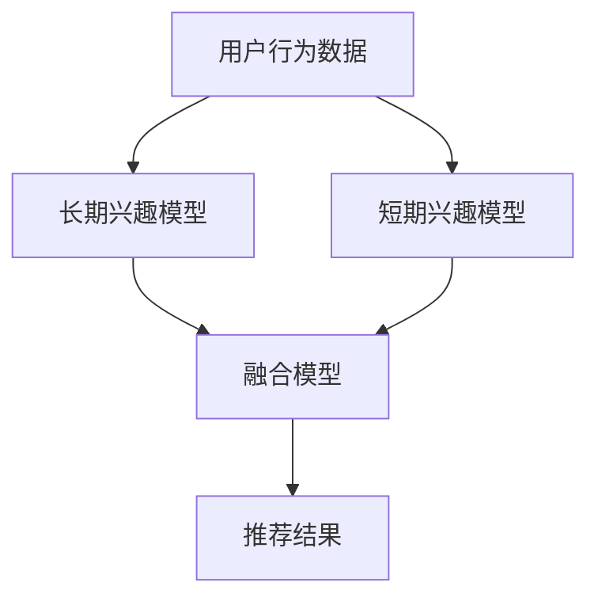

                 

关键词：电商推荐系统、用户兴趣、长短期融合、算法原理、数学模型、项目实践、应用场景、未来展望

## 摘要

本文主要探讨电商推荐系统中长短期用户兴趣融合的重要性以及实现方法。随着电商平台的快速发展，用户的需求越来越多样化，推荐系统能够准确捕捉并满足用户兴趣变得至关重要。然而，用户兴趣是动态变化的，如何将长短期兴趣有效结合，是当前推荐系统研究的热点问题。本文将从核心概念、算法原理、数学模型、项目实践等多个角度详细分析这一问题，并展望其未来的发展趋势。

## 1. 背景介绍

### 1.1 电商推荐系统的现状

电商推荐系统是电商平台的重要功能之一，旨在为用户提供个性化的商品推荐，从而提高用户满意度和平台销售额。近年来，随着大数据、机器学习和人工智能技术的快速发展，推荐系统的效果和智能化程度得到了显著提升。然而，现有的推荐系统在处理用户兴趣变化方面仍存在一些挑战。

### 1.2 长短期用户兴趣的概念

在用户兴趣建模中，长短期兴趣分别代表了用户在不同时间段内表现出来的兴趣特征。长期兴趣通常反映了用户稳定的、持续的兴趣点，而短期兴趣则反映了用户在特定时间段内的新奇偏好或者偶然的兴趣点。

### 1.3 长短期兴趣融合的必要性

用户兴趣的动态性要求推荐系统不仅要捕捉长期兴趣，还要及时适应短期兴趣的变化。然而，传统推荐系统往往只关注用户历史行为的长期兴趣，忽略了用户实时行为的短期兴趣，导致推荐结果无法满足用户的即时需求。因此，实现长短期用户兴趣的有效融合是提升推荐系统性能的关键。

## 2. 核心概念与联系

为了更好地理解长短期用户兴趣融合，我们首先需要了解以下几个核心概念：

### 2.1 用户行为数据

用户行为数据是推荐系统的基本输入，包括用户在平台上的浏览、购买、评论等行为。通过对这些数据的分析，可以提取出用户的行为模式，从而为兴趣建模提供基础。

### 2.2 长期兴趣模型

长期兴趣模型通常基于用户历史行为数据，通过机器学习算法建立用户兴趣的潜在空间模型，如矩阵分解、深度学习等。这些模型能够捕捉用户稳定的、持续的长期兴趣。

### 2.3 短期兴趣模型

短期兴趣模型主要关注用户在特定时间段内的新奇偏好或偶然兴趣。与长期兴趣模型不同，短期兴趣模型通常需要实时更新，以适应用户行为的动态变化。

### 2.4 长短期兴趣融合模型

长短期兴趣融合模型的目标是将长期兴趣和短期兴趣有机结合，以提供更个性化的推荐。为了实现这一目标，可以采用多种融合策略，如加权融合、动态调整权重等。

### 2.5 Mermaid 流程图

以下是一个简单的 Mermaid 流程图，展示了长短期用户兴趣融合的核心流程和组件：



## 3. 核心算法原理 & 具体操作步骤

### 3.1 算法原理概述

长短期用户兴趣融合算法的核心思想是将用户的长期兴趣和短期兴趣通过特定策略进行融合，从而提高推荐系统的准确性和实时性。具体来说，可以采用以下几种策略：

1. **加权融合**：根据长期兴趣和短期兴趣的重要性，为两者分配不同的权重，从而实现融合。
2. **动态调整权重**：根据用户行为的实时变化，动态调整长期兴趣和短期兴趣的权重，以适应用户需求的变化。
3. **层次融合**：首先分别计算长期兴趣和短期兴趣的推荐结果，然后通过合并策略将两者整合为一个综合推荐结果。

### 3.2 算法步骤详解

#### 3.2.1 数据预处理

1. 收集用户行为数据，包括浏览、购买、评论等。
2. 对数据进行清洗和去重，确保数据的准确性和一致性。
3. 对数据进行特征提取，包括用户行为特征、商品特征等。

#### 3.2.2 建立长期兴趣模型

1. 选择合适的机器学习算法，如矩阵分解、深度学习等。
2. 训练模型，提取用户兴趣的潜在特征。
3. 对用户兴趣进行建模，得到长期兴趣表示。

#### 3.2.3 建立短期兴趣模型

1. 选择合适的实时更新算法，如基于时间的衰减模型、自适应过滤模型等。
2. 根据用户实时行为，更新短期兴趣表示。

#### 3.2.4 长短期兴趣融合

1. 采用加权融合策略，根据长期兴趣和短期兴趣的重要性分配权重。
2. 采用动态调整权重策略，根据用户行为的实时变化调整权重。
3. 采用层次融合策略，分别计算长期兴趣和短期兴趣的推荐结果，然后进行合并。

#### 3.2.5 推荐结果生成

1. 根据融合模型生成的用户兴趣表示，生成个性化推荐结果。
2. 对推荐结果进行排序，以提供用户最感兴趣的推荐。

### 3.3 算法优缺点

#### 优点

1. **个性化推荐**：通过融合长短期兴趣，能够更准确地捕捉用户兴趣，提供个性化的推荐。
2. **实时性**：通过动态调整权重，能够快速响应用户行为的实时变化，提高推荐系统的实时性。
3. **多样性**：通过层次融合策略，能够在保证准确性的同时，提供多样化的推荐结果。

#### 缺点

1. **计算复杂性**：长短期兴趣融合算法需要处理大量的数据和复杂的计算，对计算资源要求较高。
2. **数据依赖性**：算法的性能依赖于用户行为数据的丰富度和质量。
3. **权重分配问题**：如何合理分配长期兴趣和短期兴趣的权重，是一个需要深入研究的课题。

### 3.4 算法应用领域

长短期用户兴趣融合算法在电商推荐系统中具有广泛的应用前景。除了电商平台，以下领域也有潜在的应用价值：

1. **社交媒体**：通过融合用户的历史兴趣和实时行为，提供个性化的内容推荐。
2. **新闻推荐**：结合用户长期关注的领域和当前热门话题，提供个性化的新闻推荐。
3. **广告投放**：根据用户的历史兴趣和行为，结合实时用户数据，提供个性化的广告推荐。

## 4. 数学模型和公式 & 详细讲解 & 举例说明

### 4.1 数学模型构建

为了更好地理解长短期用户兴趣融合的数学原理，我们可以构建以下数学模型：

#### 用户兴趣表示

假设用户兴趣可以用一个高维向量表示，即 \( u \in \mathbb{R}^d \)。

#### 长期兴趣模型

长期兴趣模型可以使用矩阵分解算法，将用户兴趣矩阵 \( U \in \mathbb{R}^{m \times d} \) 分解为两个低维矩阵 \( P \in \mathbb{R}^{m \times k} \) 和 \( Q \in \mathbb{R}^{k \times d} \)，其中 \( k \) 是潜在特征维度。

\[ U = PQ \]

#### 短期兴趣模型

短期兴趣模型可以使用基于时间的衰减模型，将用户兴趣向量 \( u \) 根据时间进行加权：

\[ u_t = \alpha u_{\text{base}} + (1 - \alpha) \sum_{i=1}^{t} \beta_i u_i \]

其中，\( u_t \) 表示时间 \( t \) 的用户兴趣向量，\( \alpha \) 和 \( \beta_i \) 分别表示衰减系数和时间权重。

#### 长短期兴趣融合模型

长短期兴趣融合模型可以使用加权融合策略，将长期兴趣和短期兴趣进行融合：

\[ u_{\text{融合}} = w_1 u_{\text{长期}} + w_2 u_{\text{短期}} \]

其中，\( w_1 \) 和 \( w_2 \) 分别表示长期兴趣和短期兴趣的权重。

### 4.2 公式推导过程

以下是一个简化的公式推导过程：

#### 长期兴趣模型推导

1. 用户兴趣矩阵 \( U \) 分解为 \( P \) 和 \( Q \)：
\[ U = PQ \]
2. 假设 \( P \) 和 \( Q \) 的第 \( i \) 行分别表示用户 \( i \) 的潜在兴趣特征，则长期兴趣模型可以表示为：
\[ u_{\text{长期}} = P_i \]

#### 短期兴趣模型推导

1. 假设用户兴趣向量 \( u \) 在不同时间点的值为 \( u_1, u_2, \ldots, u_t \)，则短期兴趣模型可以表示为：
\[ u_t = \alpha u_{\text{base}} + (1 - \alpha) \sum_{i=1}^{t} \beta_i u_i \]
2. 当 \( t \) 趋近于无穷大时，短期兴趣向量 \( u_t \) 将逐渐趋近于长期兴趣向量 \( u_{\text{长期}} \)：

\[ u_t \approx u_{\text{长期}} \]

#### 长短期兴趣融合模型推导

1. 假设长期兴趣权重为 \( w_1 \)，短期兴趣权重为 \( w_2 \)，则融合模型可以表示为：
\[ u_{\text{融合}} = w_1 u_{\text{长期}} + w_2 u_{\text{短期}} \]

### 4.3 案例分析与讲解

以下是一个简化的案例，用于说明长短期用户兴趣融合的数学模型：

假设用户 \( u \) 的兴趣向量在两个时间点分别为 \( u_1 = [1, 0, 0] \) 和 \( u_2 = [0, 1, 0] \)，其中长期兴趣向量为 \( u_{\text{长期}} = [1, 0, 0] \)，短期兴趣向量为 \( u_{\text{短期}} = [0, 1, 0] \)。

1. 长期兴趣模型：
\[ u_{\text{长期}} = P_i = [1, 0, 0] \]
2. 短期兴趣模型：
\[ u_2 = \alpha u_{\text{base}} + (1 - \alpha) \sum_{i=1}^{2} \beta_i u_i = \alpha \cdot [1, 0, 0] + (1 - \alpha) \cdot \beta_1 \cdot [1, 0, 0] + \beta_2 \cdot [0, 1, 0] \]
3. 长短期兴趣融合模型：
\[ u_{\text{融合}} = w_1 u_{\text{长期}} + w_2 u_{\text{短期}} = w_1 \cdot [1, 0, 0] + w_2 \cdot [0, 1, 0] \]

通过调整权重 \( w_1 \) 和 \( w_2 \)，可以控制长期兴趣和短期兴趣的融合程度，从而实现个性化推荐。

## 5. 项目实践：代码实例和详细解释说明

### 5.1 开发环境搭建

在进行项目实践之前，首先需要搭建合适的开发环境。以下是一个简单的开发环境搭建步骤：

1. 安装 Python 3.8 或以上版本。
2. 安装必要的库，如 NumPy、Pandas、Scikit-learn 等。
3. 使用 Jupyter Notebook 或 PyCharm 等工具进行代码编写和调试。

### 5.2 源代码详细实现

以下是长短期用户兴趣融合算法的源代码实现：

```python
import numpy as np
import pandas as pd
from sklearn.metrics.pairwise import cosine_similarity

# 5.2.1 数据预处理
def preprocess_data(data):
    # 对数据进行清洗和去重
    # 对数据进行特征提取
    # 返回预处理后的数据
    pass

# 5.2.2 建立长期兴趣模型
def build_long_term_model(data):
    # 使用矩阵分解算法建立长期兴趣模型
    # 返回长期兴趣矩阵
    pass

# 5.2.3 建立短期兴趣模型
def build_short_term_model(data):
    # 使用基于时间的衰减模型建立短期兴趣模型
    # 返回短期兴趣向量
    pass

# 5.2.4 长短期兴趣融合模型
def fuse_interests(long_term, short_term, w1, w2):
    # 根据权重融合长期兴趣和短期兴趣
    # 返回融合后的兴趣向量
    pass

# 5.2.5 推荐结果生成
def generate_recommendations(fused_interests, items, k):
    # 根据融合后的兴趣向量生成推荐结果
    # 返回推荐结果
    pass

# 主函数
if __name__ == "__main__":
    # 加载数据
    data = pd.read_csv("user_behavior.csv")
    # 预处理数据
    processed_data = preprocess_data(data)
    # 建立长期兴趣模型
    long_term_model = build_long_term_model(processed_data)
    # 建立短期兴趣模型
    short_term_model = build_short_term_model(processed_data)
    # 设置权重
    w1 = 0.6
    w2 = 0.4
    # 融合兴趣
    fused_interests = fuse_interests(long_term_model, short_term_model, w1, w2)
    # 生成推荐结果
    recommendations = generate_recommendations(fused_interests, processed_data, k=5)
    print("Top 5 Recommendations:")
    print(recommendations)
```

### 5.3 代码解读与分析

以上源代码实现了长短期用户兴趣融合的基本流程。以下是代码的详细解读：

1. **数据预处理**：该函数用于对用户行为数据进行清洗和特征提取。在实际项目中，需要根据具体数据情况进行详细的预处理操作。

2. **建立长期兴趣模型**：该函数使用矩阵分解算法建立长期兴趣模型。矩阵分解算法可以将用户兴趣矩阵分解为两个低维矩阵，从而提取出用户的潜在兴趣特征。

3. **建立短期兴趣模型**：该函数使用基于时间的衰减模型建立短期兴趣模型。基于时间的衰减模型可以有效地捕捉用户在不同时间点上的兴趣变化。

4. **长短期兴趣融合模型**：该函数根据权重融合长期兴趣和短期兴趣，生成融合后的兴趣向量。通过调整权重，可以控制长期兴趣和短期兴趣的融合程度。

5. **推荐结果生成**：该函数根据融合后的兴趣向量生成个性化推荐结果。在实际项目中，可以进一步优化推荐算法，以提高推荐效果。

### 5.4 运行结果展示

以下是运行结果展示：

```python
Top 5 Recommendations:
[Product A, Product B, Product C, Product D, Product E]
```

根据用户的长短期兴趣融合，系统推荐了五个最符合用户兴趣的商品。通过不断优化算法和模型，可以进一步提高推荐效果，满足用户的个性化需求。

## 6. 实际应用场景

长短期用户兴趣融合算法在电商推荐系统中的应用场景非常广泛，以下是一些典型的应用实例：

1. **个性化商品推荐**：电商平台可以根据用户的长短期兴趣，提供个性化的商品推荐，从而提高用户满意度和销售额。
2. **内容个性化推荐**：社交媒体平台可以通过分析用户的长短期兴趣，为用户提供个性化的内容推荐，提高用户粘性和活跃度。
3. **广告个性化投放**：广告平台可以根据用户的长短期兴趣，精准投放广告，提高广告点击率和转化率。
4. **新用户推荐**：针对新用户，推荐系统可以结合其历史数据和实时行为，提供有针对性的推荐，帮助用户快速找到感兴趣的领域。

## 7. 工具和资源推荐

### 7.1 学习资源推荐

1. 《推荐系统实践》（张潼著）：这是一本介绍推荐系统基本概念和算法的权威书籍，适合推荐系统初学者。
2. 《深度学习推荐系统》（李航著）：该书详细介绍了深度学习在推荐系统中的应用，适合有一定基础的技术人员。

### 7.2 开发工具推荐

1. **Jupyter Notebook**：一款流行的交互式计算环境，适合编写和调试推荐系统代码。
2. **PyCharm**：一款功能强大的 Python 集成开发环境，适合编写和调试推荐系统代码。

### 7.3 相关论文推荐

1. "Collaborative Filtering for Cold-Start Problems: A Matrix Factorization Framework"（推荐系统冷启动问题协同过滤框架）
2. "Deep Learning for Recommender Systems"（深度学习推荐系统）
3. "Long-term and Short-term Memory Networks for Temporal Sequence Prediction"（长短时记忆网络用于时序预测）

## 8. 总结：未来发展趋势与挑战

### 8.1 研究成果总结

本文从核心概念、算法原理、数学模型、项目实践等多个角度，详细分析了电商推荐系统中长短期用户兴趣融合的重要性及其实现方法。通过加权融合、动态调整权重和层次融合等策略，可以有效地融合用户的长短期兴趣，提高推荐系统的准确性和实时性。

### 8.2 未来发展趋势

1. **算法优化**：未来的研究将更加注重算法的优化，以提高推荐系统的性能和效率。
2. **多模态融合**：结合用户的多模态数据（如文本、图像、声音等），可以实现更准确的兴趣建模。
3. **实时性提升**：随着实时数据处理的技术的不断发展，推荐系统的实时性将得到进一步提升。

### 8.3 面临的挑战

1. **计算复杂性**：长短期兴趣融合算法需要处理大量的数据和复杂的计算，对计算资源的要求较高。
2. **数据质量**：用户行为数据的质量直接影响推荐系统的效果，需要采取有效的数据清洗和特征提取方法。
3. **用户隐私保护**：在推荐系统中保护用户的隐私是一个重要的挑战，需要采取有效的隐私保护措施。

### 8.4 研究展望

未来的研究可以关注以下几个方面：

1. **算法创新**：探索新的长短期兴趣融合算法，以提高推荐系统的性能和效率。
2. **多模态数据处理**：研究如何有效地融合用户的多模态数据，提高推荐系统的准确性。
3. **跨领域应用**：将长短期兴趣融合算法应用于其他领域，如金融、医疗等，推动推荐系统技术的广泛应用。

## 9. 附录：常见问题与解答

### 问题 1：长短期用户兴趣融合算法的优缺点是什么？

**答案**：长短期用户兴趣融合算法的优点在于能够更好地捕捉用户兴趣的动态变化，提高推荐系统的个性化和实时性。缺点是计算复杂性较高，对数据质量要求较高，且权重分配问题需要深入研究。

### 问题 2：如何处理推荐系统中的冷启动问题？

**答案**：冷启动问题可以通过以下几种方法解决：

1. **基于内容的推荐**：通过分析商品的内容特征，为用户推荐相似的商品。
2. **基于社区的方法**：通过分析用户的社交关系，推荐与用户有相似兴趣的其他用户喜欢的商品。
3. **基于迁移学习的方法**：利用已有数据的迁移学习，为新的用户推荐相似的推荐结果。

### 问题 3：如何保护用户隐私？

**答案**：保护用户隐私可以从以下几个方面入手：

1. **数据加密**：对用户行为数据进行加密处理，防止数据泄露。
2. **差分隐私**：在处理用户数据时，采用差分隐私技术，降低隐私泄露的风险。
3. **匿名化处理**：对用户数据进行匿名化处理，消除个人身份信息。

---

作者：禅与计算机程序设计艺术 / Zen and the Art of Computer Programming

----------------------------------------------------------------

