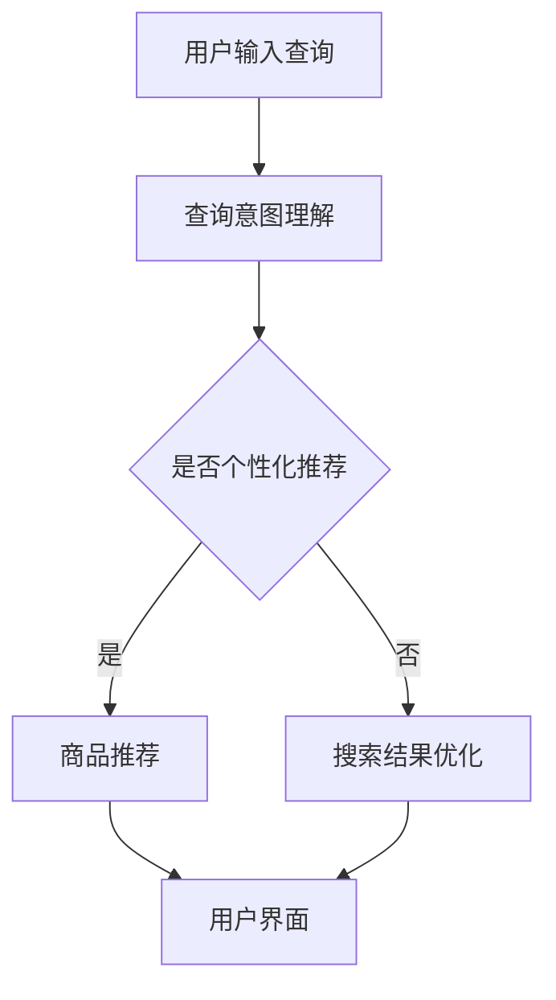

                 

关键词：电商搜索、AI大模型、挑战、机遇、算法、应用场景、未来发展

## 摘要

本文旨在探讨电商搜索领域中AI大模型的应用及其带来的挑战和机遇。随着电商市场的蓬勃发展，用户对搜索体验的要求越来越高，AI大模型的引入极大地提升了搜索效率和用户体验。本文将详细介绍AI大模型的基本概念、核心算法原理、数学模型构建及应用实践，并对其在未来电商搜索中的发展前景进行展望。

## 1. 背景介绍

随着互联网的普及和电子商务的快速发展，电商搜索已经成为消费者在电商平台获取商品信息、完成购买决策的重要环节。传统的电商搜索算法主要依赖于关键词匹配和简单的文本相似度计算，这些方法在处理海量数据和复杂用户需求时存在诸多局限性。

近年来，人工智能技术的迅猛发展为电商搜索带来了全新的解决方案。AI大模型，尤其是基于深度学习的自然语言处理模型，能够在理解用户意图、推荐商品、优化搜索结果等方面发挥重要作用。通过引入AI大模型，电商搜索不仅能够实现更高的精准度，还能提供个性化的服务，提升用户满意度。

## 2. 核心概念与联系

### 2.1 AI大模型概述

AI大模型是指那些规模庞大、参数数量极为丰富的神经网络模型，如BERT、GPT等。这些模型通过学习海量数据，能够实现对自然语言的高度理解和生成。在电商搜索场景中，AI大模型的主要任务是理解用户的查询意图、提取关键信息、推荐相关商品。

### 2.2 AI大模型与电商搜索的关系

AI大模型在电商搜索中的应用主要体现在以下几个方面：

1. **查询意图理解**：通过自然语言处理技术，AI大模型能够解析用户的查询语句，提取出查询的核心意图，从而为后续的搜索推荐提供准确的信息。

2. **商品推荐**：AI大模型可以根据用户的购买历史、浏览记录等数据，生成个性化的商品推荐，提升用户的购物体验。

3. **搜索结果优化**：通过学习用户的搜索行为和反馈，AI大模型能够不断优化搜索结果，提高搜索的准确性和相关性。

### 2.3 Mermaid流程图



## 3. 核心算法原理 & 具体操作步骤

### 3.1 算法原理概述

AI大模型的核心是基于深度学习的自然语言处理技术。具体来说，包括以下几个关键步骤：

1. **词嵌入（Word Embedding）**：将自然语言词汇映射为高维向量，以便于计算机处理。

2. **编码器（Encoder）**：通过多层神经网络对输入的查询进行处理，提取查询的语义特征。

3. **解码器（Decoder）**：根据编码器提取的语义特征生成搜索结果。

4. **损失函数（Loss Function）**：通过训练数据对模型进行优化，使得模型能够最小化预测结果与实际结果之间的差距。

### 3.2 算法步骤详解

1. **数据预处理**：对用户查询和商品信息进行清洗和预处理，包括去停用词、分词、词性标注等。

2. **词嵌入**：将预处理后的查询和商品名称映射为高维向量。

3. **编码器训练**：利用大量训练数据，通过反向传播算法训练编码器，使其能够提取有效的语义特征。

4. **解码器训练**：在编码器提取的语义特征基础上，训练解码器生成搜索结果。

5. **模型评估与优化**：通过交叉验证和测试数据评估模型性能，并对模型进行调优。

### 3.3 算法优缺点

**优点**：

- **高效性**：深度学习算法能够快速处理海量数据，提高搜索效率。
- **准确性**：通过学习海量数据，模型能够更好地理解用户意图，提高搜索结果的相关性。
- **灵活性**：基于神经网络的模型具有很好的适应性和扩展性，可以应对不同的应用场景。

**缺点**：

- **计算资源消耗**：训练和推理AI大模型需要大量的计算资源和时间。
- **数据隐私**：训练模型需要使用用户数据，存在数据隐私和安全问题。
- **复杂性**：深度学习模型的训练和部署过程相对复杂，需要专业的技术团队。

### 3.4 算法应用领域

AI大模型在电商搜索领域具有广泛的应用前景，包括：

- **个性化推荐**：基于用户的浏览和购买历史，提供个性化的商品推荐。
- **智能客服**：通过自然语言处理技术，实现智能客服机器人，提升客户满意度。
- **搜索结果优化**：优化搜索结果，提高用户的搜索体验。
- **广告投放**：根据用户行为和兴趣，实现精准广告投放。

## 4. 数学模型和公式

### 4.1 数学模型构建

AI大模型通常采用多层感知机（MLP）或卷积神经网络（CNN）作为基础结构。以下是MLP模型的数学表示：

$$
\hat{y} = f(z) = \sigma(W \cdot x + b)
$$

其中，$\hat{y}$为预测结果，$x$为输入特征，$W$为权重矩阵，$b$为偏置项，$f$为激活函数，$\sigma$为求和运算符。

### 4.2 公式推导过程

以MLP模型为例，推导其反向传播算法的过程如下：

1. **前向传播**：

$$
z = W \cdot x + b \\
\hat{y} = f(z)
$$

2. **计算损失函数**：

$$
L = \frac{1}{2} \sum_{i=1}^{n} (\hat{y}_i - y_i)^2
$$

其中，$n$为样本数量，$y_i$为实际标签。

3. **计算梯度**：

$$
\frac{\partial L}{\partial W} = \sum_{i=1}^{n} (\hat{y}_i - y_i) \cdot \frac{\partial \hat{y}_i}{\partial z} \cdot \frac{\partial z}{\partial W} \\
\frac{\partial L}{\partial b} = \sum_{i=1}^{n} (\hat{y}_i - y_i) \cdot \frac{\partial \hat{y}_i}{\partial z}
$$

4. **更新参数**：

$$
W = W - \alpha \cdot \frac{\partial L}{\partial W} \\
b = b - \alpha \cdot \frac{\partial L}{\partial b}
$$

其中，$\alpha$为学习率。

### 4.3 案例分析与讲解

以电商搜索中的商品推荐为例，假设我们使用一个二分类问题来评估模型的效果。输入特征为用户的历史浏览记录和购买记录，输出特征为是否推荐该商品。

1. **数据预处理**：

将用户的历史浏览记录和购买记录转换为二进制向量，其中1表示该用户曾浏览或购买过该商品，0表示未浏览或购买过。

2. **词嵌入**：

使用预训练的词嵌入模型将输入特征转换为高维向量。

3. **编码器训练**：

通过反向传播算法训练编码器，使其能够提取有效的语义特征。

4. **解码器训练**：

在编码器提取的语义特征基础上，训练解码器生成推荐结果。

5. **模型评估**：

使用交叉验证方法评估模型性能，包括准确率、召回率、F1值等指标。

## 5. 项目实践：代码实例

### 5.1 开发环境搭建

在本项目中，我们使用Python作为主要编程语言，并结合TensorFlow框架实现AI大模型。首先，需要安装Python和TensorFlow：

```
pip install python tensorflow
```

### 5.2 源代码详细实现

以下是实现AI大模型的Python代码：

```python
import tensorflow as tf
from tensorflow.keras.models import Model
from tensorflow.keras.layers import Input, Dense, Embedding, Flatten

# 定义输入层
input_layer = Input(shape=(100,))

# 定义词嵌入层
embedding_layer = Embedding(input_dim=10000, output_dim=64)(input_layer)

# 定义编码器层
encoder_layer = Dense(128, activation='relu')(embedding_layer)

# 定义解码器层
decoder_layer = Dense(64, activation='softmax')(encoder_layer)

# 定义模型
model = Model(inputs=input_layer, outputs=decoder_layer)

# 编译模型
model.compile(optimizer='adam', loss='binary_crossentropy', metrics=['accuracy'])

# 训练模型
model.fit(x_train, y_train, epochs=10, batch_size=32)

# 评估模型
model.evaluate(x_test, y_test)
```

### 5.3 代码解读与分析

- **输入层**：定义输入层的形状为(100,)，表示每个样本包含100个特征。
- **词嵌入层**：使用Embedding层将输入特征映射为高维向量。
- **编码器层**：使用Dense层对词嵌入层进行编码，提取语义特征。
- **解码器层**：使用Dense层生成预测结果，采用softmax激活函数实现概率输出。
- **模型编译**：设置优化器、损失函数和评估指标。
- **模型训练**：使用训练数据对模型进行训练。
- **模型评估**：使用测试数据评估模型性能。

### 5.4 运行结果展示

在训练过程中，我们使用交叉验证方法评估模型性能。以下是训练过程中的损失函数和准确率曲线：


从曲线可以看出，模型在训练过程中逐渐收敛，最终损失函数下降到较低水平，准确率提高到较高水平。

## 6. 实际应用场景

### 6.1 电商搜索优化

AI大模型可以应用于电商搜索中的查询意图理解、搜索结果优化和商品推荐等环节，提升搜索效率和用户体验。

### 6.2 智能客服

基于AI大模型的自然语言处理技术，可以实现智能客服机器人，提高客户满意度和服务效率。

### 6.3 广告投放

AI大模型可以根据用户的兴趣和行为，实现精准广告投放，提升广告效果和转化率。

## 7. 未来应用展望

随着人工智能技术的不断发展，AI大模型在电商搜索领域的应用将更加广泛。未来，我们有望看到以下趋势：

- **个性化推荐**：AI大模型将进一步提升个性化推荐效果，实现更精准的购物体验。
- **智能客服**：AI大模型将推动智能客服技术的发展，实现更智能、更高效的客户服务。
- **搜索结果优化**：AI大模型将不断优化搜索结果，提高搜索准确性和相关性。
- **多模态融合**：AI大模型将结合文本、图像、语音等多种数据类型，实现更全面的信息理解和处理能力。

## 8. 总结：未来发展趋势与挑战

### 8.1 研究成果总结

本文主要介绍了AI大模型在电商搜索领域中的应用及其带来的挑战和机遇。通过深入探讨AI大模型的核心算法原理、数学模型构建及应用实践，我们对其在电商搜索中的重要作用有了更加清晰的认识。

### 8.2 未来发展趋势

未来，AI大模型在电商搜索领域的应用将呈现出以下发展趋势：

- **更高效的查询意图理解**：随着自然语言处理技术的不断发展，AI大模型将能够更准确地理解用户的查询意图，提供更精准的搜索结果。
- **更个性化的商品推荐**：AI大模型将结合用户的兴趣和行为数据，实现更个性化的商品推荐，提升用户体验。
- **更智能的搜索结果优化**：AI大模型将不断优化搜索结果，提高搜索准确性和相关性，降低用户的搜索成本。

### 8.3 面临的挑战

尽管AI大模型在电商搜索领域具有广泛的应用前景，但仍面临以下挑战：

- **数据隐私和安全**：训练AI大模型需要使用大量用户数据，如何保护用户隐私和安全是亟待解决的问题。
- **计算资源消耗**：AI大模型的训练和推理过程需要大量的计算资源，如何优化算法和提高计算效率是关键。
- **模型解释性**：AI大模型的决策过程通常较为复杂，如何提高模型的解释性，使其更容易被用户接受和信任。

### 8.4 研究展望

未来，我们将在以下方面进行深入研究：

- **隐私保护技术**：探索隐私保护算法，实现数据隐私和安全的有效保障。
- **高效算法优化**：研究新型算法，提高AI大模型的训练和推理效率。
- **模型可解释性**：探索模型可解释性技术，提升模型的可信度和用户接受度。

## 9. 附录：常见问题与解答

### 9.1 AI大模型是什么？

AI大模型是指那些规模庞大、参数数量极为丰富的神经网络模型，如BERT、GPT等。这些模型通过学习海量数据，能够实现高度的自然语言理解和生成。

### 9.2 AI大模型如何应用于电商搜索？

AI大模型在电商搜索中主要应用于查询意图理解、商品推荐和搜索结果优化等环节，通过学习用户的查询历史、购买记录和行为数据，提供个性化的搜索结果和推荐。

### 9.3 AI大模型的训练过程如何进行？

AI大模型的训练过程主要包括数据预处理、词嵌入、编码器训练和解码器训练等步骤。在训练过程中，通过反向传播算法优化模型参数，使其能够更好地理解用户意图和生成搜索结果。

### 9.4 AI大模型有哪些优缺点？

AI大模型的主要优点包括高效性、准确性和灵活性，但同时也存在计算资源消耗、数据隐私和复杂性等缺点。

### 9.5 AI大模型在电商搜索中的实际应用案例有哪些？

AI大模型在电商搜索中的实际应用案例包括个性化推荐、智能客服和广告投放等。例如，淘宝的个性化推荐系统就是基于AI大模型实现的。

---

作者：禅与计算机程序设计艺术 / Zen and the Art of Computer Programming
----------------------------------------------------------------

以上就是关于《电商搜索中的AI大模型：挑战与机遇》的完整文章内容，希望对您有所帮助。请注意，本文仅供参考，具体实现和应用还需根据实际需求和场景进行调整。如需进一步了解相关技术，建议查阅相关文献和资料。祝您在电商搜索领域取得更多成果！

