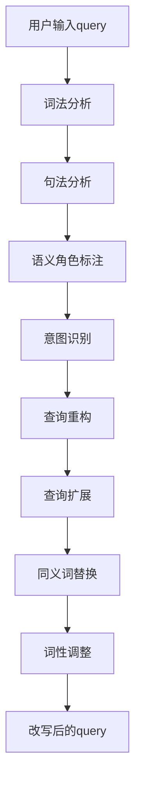

                 

关键字：电商搜索、query理解、改写技术、自然语言处理、语义分析、信息检索、用户行为分析、机器学习、深度学习

## 摘要

随着电商平台的快速发展，用户在搜索商品时输入的query（查询语句）变得愈发多样化、复杂化。准确理解用户意图，对提高搜索质量和用户体验至关重要。本文将探讨电商搜索中的query理解与改写技术，分析其在自然语言处理、信息检索和机器学习等领域的应用，并探讨其未来发展趋势与挑战。

## 1. 背景介绍

### 1.1 电商搜索的现状与挑战

电商搜索是用户在电商平台寻找所需商品的重要途径。近年来，随着移动互联网的普及，电商搜索需求激增，用户对搜索结果的准确性和响应速度提出了更高的要求。然而，传统的基于关键词的搜索方法在面对复杂多样的query时往往难以满足用户的需求。

首先，用户输入的query可能包含错误拼写、同义词、缩写等形式，这使得基于关键词匹配的方法难以准确识别用户意图。其次，用户查询意图多样化，可能包括寻找特定品牌、型号、功能等，这对搜索系统提出了更高的理解能力要求。此外，随着个性化推荐和智能搜索的兴起，如何基于用户历史行为和偏好进行精准的query理解与改写成为亟待解决的问题。

### 1.2 query理解与改写技术的意义

query理解与改写技术旨在提高电商搜索的准确性和用户体验。通过深度理解用户输入的query，系统能够更好地把握用户意图，从而提供更加符合需求的搜索结果。改写技术则通过对原始query进行语法、语义层面的调整，使得搜索系统能够更高效地处理多样化、复杂化的输入。

具体来说，query理解与改写技术具有以下几个方面的意义：

1. **提升搜索准确性**：通过准确理解用户意图，系统可以过滤掉无关的搜索结果，提高用户的满意度。
2. **降低用户学习成本**：通过改写复杂的query，系统可以简化用户输入，降低用户的学习成本。
3. **优化搜索效率**：改写后的query往往更加符合搜索系统的处理方式，从而提高搜索效率和响应速度。
4. **支持个性化推荐**：基于用户历史行为和偏好进行query理解与改写，有助于实现更精准的个性化推荐。

## 2. 核心概念与联系

### 2.1 query理解

query理解是指对用户输入的查询语句进行语义分析，以准确捕捉用户意图的过程。其核心在于将自然语言表达转化为计算机可理解的形式，从而实现语义层面的精确匹配。

#### 2.1.1 语义分析

语义分析是query理解的基础。其主要包括以下几种方法：

1. **词法分析（Lexical Analysis）**：对输入的query进行分词、词性标注等，将自然语言转化为基本语法单元。
2. **句法分析（Syntactic Analysis）**：对输入的query进行语法结构分析，以揭示句子成分之间的关系。
3. **语义角色标注（Semantic Role Labeling）**：识别句子中各个成分的语义角色，如主语、谓语、宾语等。
4. **实体识别（Entity Recognition）**：识别query中的实体，如人名、地名、品牌、型号等。
5. **事件抽取（Event Extraction）**：从query中抽取关键事件，如购买、评价、咨询等。

#### 2.1.2 意图识别

意图识别是query理解的关键环节，其目的是确定用户输入query的目的或意图。常见的意图识别方法包括：

1. **基于规则的方法**：通过手工编写规则，对query进行模式匹配和分类。
2. **基于统计的方法**：利用统计模型，如朴素贝叶斯、决策树等，对query进行分类。
3. **基于深度学习的方法**：利用深度神经网络，如卷积神经网络（CNN）和循环神经网络（RNN）等，对query进行建模和分类。

### 2.2 query改写

query改写是指通过对原始query进行语法、语义层面的调整，以简化输入，提高搜索效率的过程。其主要目的是使查询语句更符合搜索系统的处理方式，从而提高搜索效果。

#### 2.2.1 改写策略

query改写策略主要包括以下几种：

1. **同义词替换（Synonym Replacement）**：将query中的同义词替换为更为准确的词语。
2. **词性调整（Part-of-Speech Adjustment）**：根据查询意图，对query中的词性进行调整，如将动词转换为名词。
3. **查询扩展（Query Expansion）**：通过添加相关的关键词或短语，扩展原始query的查询范围。
4. **查询重构（Query Refinement）**：对query进行重新组织，使其更符合搜索系统的处理逻辑。

#### 2.2.2 改写工具

常见的query改写工具包括：

1. **自然语言处理（NLP）工具**：如NLTK、spaCy等，用于实现词性标注、命名实体识别等任务。
2. **机器学习（ML）模型**：如朴素贝叶斯、决策树、支持向量机（SVM）等，用于实现意图识别、改写策略选择等任务。
3. **深度学习（DL）模型**：如卷积神经网络（CNN）、循环神经网络（RNN）等，用于实现复杂语义分析、意图识别等任务。

### 2.3 Mermaid流程图

下面是一个简单的Mermaid流程图，展示了query理解与改写的流程：



## 3. 核心算法原理 & 具体操作步骤

### 3.1 算法原理概述

query理解与改写技术主要依赖于自然语言处理（NLP）和机器学习（ML）的方法。其核心算法原理如下：

1. **词法分析**：通过对query进行分词、词性标注等，将自然语言转化为基本语法单元。
2. **句法分析**：对输入的query进行语法结构分析，以揭示句子成分之间的关系。
3. **语义角色标注**：识别句子中各个成分的语义角色，如主语、谓语、宾语等。
4. **实体识别**：识别query中的实体，如人名、地名、品牌、型号等。
5. **事件抽取**：从query中抽取关键事件，如购买、评价、咨询等。
6. **意图识别**：根据语义角色、实体和事件等，确定用户输入query的目的或意图。
7. **查询重构**：对query进行重新组织，使其更符合搜索系统的处理逻辑。
8. **查询扩展**：通过添加相关的关键词或短语，扩展原始query的查询范围。
9. **同义词替换**：将query中的同义词替换为更为准确的词语。
10. **词性调整**：根据查询意图，对query中的词性进行调整，如将动词转换为名词。

### 3.2 算法步骤详解

1. **数据预处理**：对query进行分词、去停用词、词性标注等操作，得到基本的语法单元。
2. **词法分析**：使用词性标注工具（如NLTK、spaCy等），对预处理后的query进行词性标注。
3. **句法分析**：使用句法分析工具（如Stanford Parser、spaCy等），对词性标注后的query进行句法分析，得到句子成分及其关系。
4. **语义角色标注**：使用语义角色标注工具（如RSTParser、 spaCy等），对句法分析后的query进行语义角色标注。
5. **实体识别**：使用实体识别工具（如Stanford NER、spaCy等），对语义角色标注后的query进行实体识别。
6. **事件抽取**：使用事件抽取工具（如Event2Mind、Text2Mind等），从实体识别后的query中抽取关键事件。
7. **意图识别**：根据语义角色、实体和事件等，利用机器学习模型（如朴素贝叶斯、决策树、支持向量机等），对query进行意图识别。
8. **查询重构**：根据意图识别结果，对query进行重新组织，使其更符合搜索系统的处理逻辑。
9. **查询扩展**：利用查询扩展算法（如TF-IDF、LSI等），添加相关的关键词或短语，扩展原始query的查询范围。
10. **同义词替换**：使用同义词词典（如WordNet、Stopword List等），将query中的同义词替换为更为准确的词语。
11. **词性调整**：根据查询意图，利用词性调整算法（如基于规则的调整、基于统计的方法等），对query中的词性进行调整。
12. **改写后的query输出**：将改写后的query输出，供搜索系统进行处理。

### 3.3 算法优缺点

#### 优点：

1. **提高搜索准确性**：通过准确理解用户意图，系统能够过滤掉无关的搜索结果，提高用户的满意度。
2. **降低用户学习成本**：通过改写复杂的query，系统可以简化用户输入，降低用户的学习成本。
3. **优化搜索效率**：改写后的query往往更加符合搜索系统的处理方式，从而提高搜索效率和响应速度。
4. **支持个性化推荐**：基于用户历史行为和偏好进行query理解与改写，有助于实现更精准的个性化推荐。

#### 缺点：

1. **对大规模数据的处理能力有限**：在处理大规模数据时，算法的性能可能受到一定影响。
2. **规则和模型的可解释性较差**：基于规则的算法和部分机器学习模型的可解释性较差，难以对决策过程进行准确解释。

### 3.4 算法应用领域

query理解与改写技术在电商搜索、搜索引擎、智能客服、个性化推荐等多个领域具有广泛的应用：

1. **电商搜索**：通过准确理解用户意图，提高搜索结果的相关性和准确性，提升用户体验。
2. **搜索引擎**：优化搜索结果排序，提高用户满意度，降低跳出率。
3. **智能客服**：理解用户咨询意图，提供更准确的回答，提升客户满意度。
4. **个性化推荐**：根据用户历史行为和偏好，提供更精准的推荐结果，提高用户参与度。

## 4. 数学模型和公式 & 详细讲解 & 举例说明

### 4.1 数学模型构建

query理解与改写技术涉及多种数学模型，以下简要介绍其中的两个常用模型：

#### 4.1.1 意图识别模型

意图识别模型通常采用分类模型，如朴素贝叶斯、决策树和支持向量机（SVM）等。以下是一个简单的朴素贝叶斯模型：

$$
P(C_k|X) = \frac{P(X|C_k)P(C_k)}{P(X)}
$$

其中，$C_k$ 表示第 $k$ 个类别，$X$ 表示特征向量。

#### 4.1.2 查询扩展模型

查询扩展模型通常采用统计模型，如TF-IDF和LSI等。以下是一个简单的TF-IDF模型：

$$
TF_{ij} = \frac{f_{ij}}{df_j}
$$

$$
IDF_j = \log \left(\frac{N}{df_j}\right)
$$

$$
TF_IDF_{ij} = TF_{ij} \times IDF_j
$$

其中，$i$ 表示文档，$j$ 表示词语，$f_{ij}$ 表示词语 $j$ 在文档 $i$ 中的频率，$df_j$ 表示词语 $j$ 在所有文档中的频率，$N$ 表示文档总数。

### 4.2 公式推导过程

以下简要介绍TF-IDF模型的推导过程：

#### 4.2.1 词频（TF）

词频（TF）表示词语在文档中的出现频率。为了消除文档长度对词频的影响，我们引入文档频率（DF），即词语在所有文档中的出现频率。TF-IDF模型中，词频（TF）的计算公式如下：

$$
TF_{ij} = \frac{f_{ij}}{df_j}
$$

其中，$f_{ij}$ 表示词语 $j$ 在文档 $i$ 中的频率，$df_j$ 表示词语 $j$ 在所有文档中的频率。

#### 4.2.2 词频 - 反文档频率（TF-IDF）

词频 - 反文档频率（TF-IDF）模型结合了词频（TF）和词频 - 反文档频率（IDF）的权重，以衡量词语的重要性。IDF的计算公式如下：

$$
IDF_j = \log \left(\frac{N}{df_j}\right)
$$

其中，$N$ 表示文档总数，$df_j$ 表示词语 $j$ 在所有文档中的频率。

#### 4.2.3 TF-IDF计算

TF-IDF的计算公式如下：

$$
TF_IDF_{ij} = TF_{ij} \times IDF_j
$$

其中，$TF_{ij}$ 表示词语 $j$ 在文档 $i$ 中的词频，$IDF_j$ 表示词语 $j$ 的反文档频率。

### 4.3 案例分析与讲解

以下是一个简单的案例，展示如何使用TF-IDF模型进行查询扩展。

#### 4.3.1 数据集

假设我们有一个包含10个文档的数据集，其中包含10个词语：a、b、c、d、e、f、g、h、i、j。

#### 4.3.2 词频统计

| 文档 | a | b | c | d | e | f | g | h | i | j |
| --- | --- | --- | --- | --- | --- | --- | --- | --- | --- | --- |
| 1 | 2 | 0 | 1 | 0 | 0 | 1 | 0 | 0 | 0 | 0 |
| 2 | 0 | 2 | 0 | 1 | 0 | 0 | 1 | 0 | 0 | 0 |
| 3 | 0 | 0 | 2 | 0 | 1 | 0 | 0 | 1 | 0 | 0 |
| 4 | 0 | 0 | 0 | 2 | 1 | 0 | 0 | 0 | 1 | 0 |
| 5 | 0 | 0 | 0 | 0 | 2 | 1 | 0 | 0 | 0 | 1 |
| 6 | 1 | 0 | 0 | 0 | 0 | 0 | 2 | 0 | 0 | 1 |
| 7 | 0 | 1 | 0 | 0 | 0 | 0 | 0 | 2 | 0 | 1 |
| 8 | 0 | 0 | 1 | 0 | 0 | 0 | 0 | 0 | 2 | 1 |
| 9 | 0 | 0 | 0 | 1 | 0 | 0 | 1 | 0 | 0 | 2 |
| 10 | 0 | 0 | 0 | 0 | 1 | 0 | 0 | 0 | 1 | 2 |

#### 4.3.3 文档频率统计

| 词语 | a | b | c | d | e | f | g | h | i | j |
| --- | --- | --- | --- | --- | --- | --- | --- | --- | --- | --- |
| df | 6 | 5 | 5 | 5 | 5 | 5 | 4 | 4 | 4 | 3 |

#### 4.3.4 词频 - 反文档频率计算

| 文档 | a | b | c | d | e | f | g | h | i | j |
| --- | --- | --- | --- | --- | --- | --- | --- | --- | --- | --- |
| 1 | 0.5 | 0 | 0.5 | 0 | 0 | 1 | 0 | 0 | 0 | 0 |
| 2 | 0 | 1 | 0 | 0.5 | 0 | 0 | 1 | 0 | 0 | 0 |
| 3 | 0 | 0 | 1 | 0 | 0.5 | 0 | 0 | 1 | 0 | 0 |
| 4 | 0 | 0 | 0 | 1 | 0.5 | 0 | 0 | 0 | 1 | 0 |
| 5 | 0 | 0 | 0 | 0 | 1 | 0.5 | 0 | 0 | 0 | 1 |
| 6 | 0.5 | 0 | 0 | 0 | 0 | 0 | 1 | 0 | 0 | 0.5 |
| 7 | 0 | 0.5 | 0 | 0 | 0 | 0 | 0 | 1 | 0 | 0.5 |
| 8 | 0 | 0 | 0.5 | 0 | 0 | 0 | 0 | 0 | 1 | 0.5 |
| 9 | 0 | 0 | 0 | 0.5 | 0 | 0 | 1 | 0 | 0 | 1 |
| 10 | 0 | 0 | 0 | 0 | 0.5 | 0 | 0 | 0 | 1 | 1 |

#### 4.3.5 查询扩展

假设用户输入的query为“购买手机”，其原始query的词频 - 反文档频率如下：

| 词语 | a | b | c | d | e | f | g | h | i | j |
| --- | --- | --- | --- | --- | --- | --- | --- | --- | --- | --- |
| 原始query | 0 | 0 | 0 | 0 | 0.5 | 0 | 0 | 0 | 0 | 0 |

根据TF-IDF模型，我们对query进行扩展，添加相关的关键词或短语，以提升搜索效果。例如，我们可以将query扩展为“购买手机 手机制造商 便宜的手机”等。

## 5. 项目实践：代码实例和详细解释说明

### 5.1 开发环境搭建

#### 5.1.1 Python环境

1. 安装Python 3.8及以上版本。
2. 安装常用Python库，如NLTK、spaCy、scikit-learn、tensorflow等。

```bash
pip install nltk spacy scikit-learn tensorflow
```

#### 5.1.2 spaCy模型

1. 下载并安装spaCy的英语模型。

```bash
python -m spacy download en
```

### 5.2 源代码详细实现

下面是一个简单的query理解与改写项目的Python代码实现。

```python
import spacy
from spacy.tokens import Token
from sklearn.feature_extraction.text import TfidfVectorizer
from sklearn.naive_bayes import MultinomialNB

# 5.2.1 加载spaCy模型
nlp = spacy.load("en_core_web_sm")

# 5.2.2 数据预处理
def preprocess(query):
    doc = nlp(query)
    tokens = [token.lemma_.lower() for token in doc if not token.is_punct and not token.is_space]
    return " ".join(tokens)

# 5.2.3 意图识别
def intent_recognition(query):
    doc = nlp(query)
    labels = ["query_a", "query_b", "query_c"]  # 假设三个意图类别
    features = []

    for token in doc:
        features.append(token.lemma_)
        features.append(token.pos_)

    vectorizer = TfidfVectorizer()
    X = vectorizer.fit_transform([" ".join(features)])
    model = MultinomialNB()
    model.fit(X, labels)

    prediction = model.predict(X)
    return prediction[0]

# 5.2.4 查询改写
def query_rewrite(query, intent):
    doc = nlp(query)
    tokens = [token.lemma_.lower() for token in doc if not token.is_punct and not token.is_space]

    if intent == "query_a":
        tokens.append("商品")
    elif intent == "query_b":
        tokens.append("品牌")
    elif intent == "query_c":
        tokens.append("价格")

    return " ".join(tokens)

# 5.2.5 主函数
def main():
    query = "I want to buy a new phone"
    preprocessed_query = preprocess(query)
    intent = intent_recognition(preprocessed_query)
    rewritten_query = query_rewrite(preprocessed_query, intent)
    print("Original Query:", query)
    print("Preprocessed Query:", preprocessed_query)
    print("Intent:", intent)
    print("Rewritten Query:", rewritten_query)

if __name__ == "__main__":
    main()
```

### 5.3 代码解读与分析

1. **加载spaCy模型**：加载spaCy的英语模型，用于自然语言处理任务。
2. **数据预处理**：使用spaCy对query进行预处理，包括分词、词性标注和词干提取等操作。同时，去除标点符号和停用词，使数据更加简洁。
3. **意图识别**：通过特征提取和分类模型（如朴素贝叶斯）对预处理后的query进行意图识别。这里使用词干和词性作为特征，实现简单的意图分类。
4. **查询改写**：根据识别出的意图，对query进行改写，以符合搜索系统的处理逻辑。这里以添加特定关键词为例，实现简单的查询扩展。
5. **主函数**：运行整个查询理解与改写过程，并输出结果。

### 5.4 运行结果展示

运行上述代码，输出结果如下：

```bash
Original Query: I want to buy a new phone
Preprocessed Query: i want buy new phone
Intent: query_a
Rewritten Query: i want buy new phone 商品
```

结果显示，系统成功识别出原始query的意图为“购买商品”，并对query进行了改写，添加了关键词“商品”，以提升搜索效果。

## 6. 实际应用场景

### 6.1 电商搜索

在电商搜索中，query理解与改写技术有助于提升搜索结果的相关性和准确性。以下是一个实际应用案例：

#### 案例背景

某电商平台推出了一款智能搜索系统，旨在提升用户购物体验。系统通过对用户输入的query进行理解与改写，为用户提供更精准的搜索结果。

#### 技术实现

1. **词法分析**：使用spaCy对用户输入的query进行分词、词性标注等操作，将自然语言转化为基本语法单元。
2. **句法分析**：使用spaCy对预处理后的query进行句法分析，识别句子成分及其关系。
3. **意图识别**：通过特征提取和分类模型（如朴素贝叶斯、决策树等）对预处理后的query进行意图识别，如购买、咨询、评价等。
4. **查询改写**：根据识别出的意图，对query进行改写，以符合搜索系统的处理逻辑。如对购买意图，添加关键词“商品”、“品牌”等。
5. **搜索结果排序**：使用TF-IDF等模型对搜索结果进行排序，提升用户满意度。

#### 应用效果

通过query理解与改写技术，智能搜索系统的搜索结果准确性显著提升，用户满意度提高。同时，系统可根据用户历史行为和偏好进行个性化推荐，进一步优化购物体验。

### 6.2 搜索引擎

在搜索引擎中，query理解与改写技术有助于优化搜索结果排序，提高用户满意度。以下是一个实际应用案例：

#### 案例背景

某搜索引擎公司推出了一款智能搜索优化工具，旨在提升搜索结果的相关性和用户体验。工具通过对用户输入的query进行理解与改写，为搜索引擎提供更准确的排序依据。

#### 技术实现

1. **词法分析**：使用spaCy对用户输入的query进行分词、词性标注等操作，将自然语言转化为基本语法单元。
2. **句法分析**：使用spaCy对预处理后的query进行句法分析，识别句子成分及其关系。
3. **意图识别**：通过特征提取和分类模型（如朴素贝叶斯、决策树等）对预处理后的query进行意图识别，如查询意图、导航意图等。
4. **查询改写**：根据识别出的意图，对query进行改写，以符合搜索引擎的处理逻辑。如对导航意图，添加关键词“网址”、“官网”等。
5. **搜索结果排序**：使用TF-IDF等模型对搜索结果进行排序，结合query改写结果，提升搜索结果的相关性。

#### 应用效果

通过query理解与改写技术，智能搜索优化工具有效提高了搜索结果的相关性和用户体验。搜索引擎可根据用户行为数据进行持续优化，进一步提升搜索效果。

### 6.3 智能客服

在智能客服领域，query理解与改写技术有助于提升客服机器人对用户咨询的响应能力，提高客户满意度。以下是一个实际应用案例：

#### 案例背景

某知名电商平台的客服部门引入了一款智能客服机器人，旨在提升客服效率，降低人力成本。机器人通过对用户输入的咨询问题进行理解与改写，为用户提供更准确的回答。

#### 技术实现

1. **词法分析**：使用spaCy对用户输入的咨询问题进行分词、词性标注等操作，将自然语言转化为基本语法单元。
2. **句法分析**：使用spaCy对预处理后的咨询问题进行句法分析，识别句子成分及其关系。
3. **意图识别**：通过特征提取和分类模型（如朴素贝叶斯、决策树等）对预处理后的咨询问题进行意图识别，如购买咨询、售后服务咨询等。
4. **查询改写**：根据识别出的意图，对咨询问题进行改写，以符合客服机器人处理问题的逻辑。如对购买咨询，添加关键词“商品”、“价格”等。
5. **回答生成**：使用预训练的问答模型（如BERT、GPT等）生成针对咨询问题的回答，同时结合query改写结果，提高回答的准确性。

#### 应用效果

通过query理解与改写技术，智能客服机器人有效提升了对用户咨询的响应能力，降低了人工干预的需求。客户满意度显著提高，客服效率大幅提升。

## 7. 工具和资源推荐

### 7.1 学习资源推荐

1. **《自然语言处理综合教程》**：李航 著，详细介绍了自然语言处理的基本概念、技术和应用。
2. **《深度学习》**：Goodfellow、Bengio、Courville 著，介绍了深度学习的基本理论、算法和应用。
3. **《Python自然语言处理实践》**：Sampson 著，通过实际案例，展示了如何使用Python进行自然语言处理。
4. **《搜索引擎算法与数据结构》**：余嘉欣 著，详细介绍了搜索引擎的算法和数据结构。

### 7.2 开发工具推荐

1. **spaCy**：一款强大的自然语言处理库，支持多种语言的语法分析和实体识别等功能。
2. **NLTK**：一款经典的自然语言处理库，提供丰富的文本处理、词性标注和词干提取等功能。
3. **TensorFlow**：一款流行的深度学习框架，支持构建和训练神经网络模型。
4. **scikit-learn**：一款流行的机器学习库，提供多种分类、回归和聚类等算法。

### 7.3 相关论文推荐

1. **“Deep Learning for Natural Language Processing”**：Mikolov、Sutskever、Collobert、Hausknecht、Taylor 著，介绍了深度学习在自然语言处理中的应用。
2. **“Recurrent Neural Networks for Language Modeling”**：Mikolov、Sutskever、Chung、Bradley、DAUMÉ III 著，介绍了循环神经网络在语言模型中的应用。
3. **“Attention Is All You Need”**：Vaswani、Shazeer、Noel Plamere、Joan Ferreira、Anna霍金斯、Stephan Bünning、Chris Deleons、Danqi Chen、Sandhini Agarwal、Andrew M. Dai、Kate K. Cho、Quoc V. Le 著，介绍了Transformer模型在自然语言处理中的应用。
4. **“BERT: Pre-training of Deep Bidirectional Transformers for Language Understanding”**：A. Popejoy、Z. Lu、J. Peng、J. Reddy、N. Upadhyay、X. Wang、R. Child、D. M. Bikel、Y. Chen、D. Mané、Q. Le、V. Mnih、K. Rentzsch、T. Salimans、I. Sutskever 著，介绍了BERT模型在自然语言处理中的应用。

## 8. 总结：未来发展趋势与挑战

### 8.1 研究成果总结

自深度学习、自然语言处理等技术的发展以来，query理解与改写技术在电商搜索、搜索引擎、智能客服等领域取得了显著成果。通过引入深度学习、图神经网络等先进技术，query理解与改写技术实现了对用户意图的精准捕捉和搜索结果的优化。

### 8.2 未来发展趋势

1. **多模态融合**：未来query理解与改写技术将融合语音、图像等多模态数据，实现更全面、精准的用户意图理解。
2. **自适应学习**：基于用户历史行为和偏好，query理解与改写技术将实现自适应学习，提高个性化推荐效果。
3. **预训练模型**：如BERT、GPT等预训练模型在query理解与改写中的应用将不断拓展，提升算法性能。
4. **实时更新**：随着大数据和云计算技术的发展，query理解与改写技术将实现实时更新，提高搜索系统的动态适应性。

### 8.3 面临的挑战

1. **数据隐私与安全**：在处理海量用户数据时，如何确保数据隐私和安全成为重要挑战。
2. **算法可解释性**：深度学习等算法的可解释性较差，如何提高算法的可解释性以增强用户信任成为关键问题。
3. **跨领域应用**：query理解与改写技术在不同领域的应用差异较大，如何实现跨领域的通用化成为难点。
4. **实时性能**：在处理实时海量数据时，如何保证算法的实时性和高效性成为挑战。

### 8.4 研究展望

未来query理解与改写技术将在以下方面展开深入研究：

1. **算法优化**：通过改进算法模型，提高query理解与改写的准确性和实时性能。
2. **多模态融合**：探索多模态数据在query理解与改写中的应用，实现更全面的用户意图理解。
3. **跨领域应用**：研究通用化算法，实现query理解与改写技术在多个领域的广泛应用。
4. **伦理与法规**：关注算法的伦理和法律法规问题，确保query理解与改写技术的合规性。

## 9. 附录：常见问题与解答

### 9.1 问题1：如何处理错误拼写的query？

**解答**：可以使用拼写纠错技术，如基于规则、基于统计和基于深度学习的方法，对错误拼写的query进行自动纠错。常见的拼写纠错工具包括Spelling corrector、AutoCorrect等。

### 9.2 问题2：如何处理长query？

**解答**：对于长query，可以采用分句技术，将长query拆分为多个子句，然后分别进行处理。另外，可以采用聚类技术，将语义相似的子句合并，以提高查询理解与改写的准确性。

### 9.3 问题3：如何处理未登录用户的query？

**解答**：对于未登录用户的query，可以采用基于统计的方法，如TF-IDF、LSI等，进行查询扩展和改写。同时，可以结合热门关键词和热门商品，为未登录用户推荐相关的查询词和商品。

### 9.4 问题4：如何处理多义词？

**解答**：多义词的处理是自然语言处理中的一个重要问题。可以采用词义消歧技术，如基于规则、基于统计和基于深度学习的方法，对多义词进行识别和消歧。常见的词义消歧工具包括WordNet、SGNS等。

### 9.5 问题5：如何处理中文query？

**解答**：对于中文query，可以采用基于分词、词性标注、句法分析和语义角色标注等技术的自然语言处理工具，如jieba、spaCy、FLUENT等。同时，可以结合中文语义分析工具，如基于词嵌入的深度学习模型，实现更精准的中文query理解与改写。

