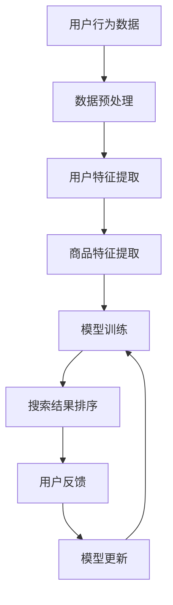

                 

关键词：电商搜索、个性化排序、增量学习、机器学习、算法优化、用户体验、商业应用。

> 摘要：本文将探讨电商搜索中的个性化排序模型及其增量学习方法。通过深入分析核心概念、算法原理、数学模型以及实际应用，旨在为电商领域从业者提供实用的算法优化思路，提高用户搜索体验，促进商业增长。

## 1. 背景介绍

随着互联网和电子商务的快速发展，电商搜索已成为消费者获取商品信息的主要途径。一个优秀的电商搜索系统，不仅需要提供丰富的商品信息，更应能够根据用户的兴趣、购买历史和行为习惯，提供个性化的搜索结果。个性化排序模型成为提高电商搜索系统用户体验的关键因素。

传统的排序算法如基于关键字匹配的排序方法，虽然能够在一定程度上满足用户需求，但难以捕捉用户的个性化偏好。随着机器学习技术的进步，基于用户行为的个性化排序模型得到了广泛应用。这些模型通过分析用户的历史行为数据，动态调整搜索结果的排序顺序，从而提高用户的满意度和购买转化率。

然而，电商搜索系统中的数据量庞大且不断增长，传统的模型训练和更新方法存在计算成本高、训练时间长等问题。为了应对这一挑战，增量学习技术被引入到个性化排序模型中，实现了对已有模型的快速更新和优化。

## 2. 核心概念与联系

### 2.1 个性化排序模型

个性化排序模型是一种基于用户行为和偏好进行排序的算法。其主要目标是根据用户的兴趣和行为特征，为用户推荐最符合其需求的商品。个性化排序模型通常包括以下几个关键组成部分：

- **用户特征**：包括用户的个人偏好、历史购买记录、浏览记录等。
- **商品特征**：包括商品的种类、品牌、价格、评分等。
- **推荐算法**：根据用户和商品特征，通过算法计算排序分数，从而确定搜索结果排序顺序。

### 2.2 增量学习

增量学习是一种在已有模型基础上，通过新数据的加入来逐步优化模型的方法。与传统的批量学习相比，增量学习具有以下优势：

- **计算效率高**：增量学习不需要对整个数据集进行重新训练，只需对新增数据进行分析和更新，从而大大降低了计算成本。
- **实时性**：增量学习可以实时更新模型，使得搜索结果能够更快地适应用户行为的变化。

### 2.3 Mermaid 流程图



## 3. 核心算法原理 & 具体操作步骤

### 3.1 算法原理概述

个性化排序增量学习模型的核心原理是基于用户行为的动态调整。具体来说，模型通过以下步骤实现：

1. **数据预处理**：对原始用户行为数据进行清洗、去噪和处理，提取有用的特征信息。
2. **用户特征提取**：根据用户的行为数据，提取用户的兴趣偏好、浏览历史等特征。
3. **商品特征提取**：对商品进行分类、标签化处理，提取商品的关键特征。
4. **模型训练**：使用已有数据集训练个性化排序模型，确定用户特征和商品特征之间的关联关系。
5. **搜索结果排序**：根据用户特征和商品特征，计算每个商品的排序分数，确定搜索结果的排序顺序。
6. **用户反馈**：收集用户对搜索结果的反馈，更新用户特征和模型参数。
7. **模型更新**：通过用户反馈和新数据，对模型进行优化和调整，提高模型准确性。

### 3.2 算法步骤详解

#### 3.2.1 数据预处理

数据预处理是增量学习的基础步骤，其质量直接影响后续模型的性能。主要任务包括：

- **数据清洗**：去除重复、缺失、异常的数据，保证数据质量。
- **特征提取**：从用户行为数据中提取有用的特征信息，如用户的浏览历史、购买记录等。
- **特征归一化**：对特征值进行归一化处理，使其处于相同量级，避免特征值差异过大导致模型训练困难。

#### 3.2.2 用户特征提取

用户特征提取是构建个性化排序模型的关键步骤，主要包括以下方面：

- **兴趣偏好**：根据用户的浏览历史和购买记录，提取用户的兴趣偏好，如喜欢购买的商品类型、品牌等。
- **行为特征**：提取用户的行为特征，如浏览频率、购买频率等。
- **社交特征**：如果用户在社交平台上有互动行为，可以提取其社交特征，如关注数、粉丝数等。

#### 3.2.3 商品特征提取

商品特征提取主要包括以下方面：

- **商品分类**：对商品进行分类处理，如将商品分为电子产品、服装、食品等类别。
- **标签化**：为商品添加标签，如商品的品牌、价格区间、折扣信息等。
- **属性提取**：提取商品的关键属性，如商品的价格、评分、销量等。

#### 3.2.4 模型训练

模型训练是增量学习的核心步骤，常用的方法包括：

- **线性回归**：通过建立用户特征和商品特征之间的线性关系，计算每个商品的排序分数。
- **神经网络**：使用神经网络模型，对用户特征和商品特征进行深度学习，提取复杂的关系和特征。
- **矩阵分解**：通过矩阵分解方法，将用户特征矩阵和商品特征矩阵分解为低维矩阵，计算排序分数。

#### 3.2.5 搜索结果排序

搜索结果排序是依据模型计算出的排序分数，对商品进行排序。主要方法包括：

- **直接排序**：根据排序分数直接排序，分数越高，排名越靠前。
- **权重排序**：根据不同特征的权重，对排序分数进行调整，实现更合理的排序。

#### 3.2.6 用户反馈与模型更新

用户反馈与模型更新是增量学习的关键环节，主要包括以下步骤：

- **反馈收集**：收集用户对搜索结果的反馈，如点击、购买、评价等。
- **模型调整**：根据用户反馈，调整用户特征和模型参数，提高模型准确性。
- **模型更新**：将调整后的模型应用于新数据，实现模型的实时更新。

### 3.3 算法优缺点

#### 3.3.1 优点

- **高效性**：增量学习能够在已有模型基础上快速更新，降低计算成本。
- **实时性**：增量学习能够实时调整模型，适应用户行为的变化，提高搜索结果的个性化程度。
- **灵活性**：增量学习可以根据新数据动态调整模型，实现更准确的个性化推荐。

#### 3.3.2 缺点

- **模型稳定性**：增量学习可能导致模型在更新过程中稳定性下降，需要采取适当的策略进行优化。
- **数据依赖性**：增量学习对数据依赖性较高，需要保证数据质量和实时性。
- **计算资源消耗**：虽然增量学习降低了计算成本，但在大规模数据集上仍需一定的计算资源。

### 3.4 算法应用领域

个性化排序增量学习模型在电商搜索领域具有广泛的应用前景，主要包括以下几个方面：

- **电商搜索**：通过个性化排序模型，提高用户搜索体验，提高购买转化率。
- **广告推荐**：根据用户兴趣和行为，为用户推荐最相关的广告，提高广告投放效果。
- **社交媒体**：根据用户兴趣和行为，为用户推荐感兴趣的内容和好友，提高用户活跃度。

## 4. 数学模型和公式

### 4.1 数学模型构建

个性化排序增量学习模型的核心是建立用户特征和商品特征之间的数学模型。假设用户特征向量表示为 \( X \)，商品特征向量表示为 \( Y \)，排序分数表示为 \( f \)，则数学模型可以表示为：

$$
f(X, Y) = w^T \cdot (X \odot Y)
$$

其中，\( w \) 表示模型参数，\( \odot \) 表示逐元素乘法。

### 4.2 公式推导过程

#### 4.2.1 用户特征提取

用户特征提取的过程可以表示为：

$$
X = f_{user}(behavior_{data})
$$

其中，\( behavior_{data} \) 表示用户行为数据，\( f_{user} \) 表示用户特征提取函数。

#### 4.2.2 商品特征提取

商品特征提取的过程可以表示为：

$$
Y = f_{item}(item_{data})
$$

其中，\( item_{data} \) 表示商品数据，\( f_{item} \) 表示商品特征提取函数。

#### 4.2.3 模型训练

模型训练的过程可以表示为：

$$
w = \arg\max_w \sum_{i=1}^{N} [f(X_i, Y_i) - y_i]^2
$$

其中，\( N \) 表示训练数据集大小，\( y_i \) 表示商品 \( i \) 的实际排序分数。

### 4.3 案例分析与讲解

#### 4.3.1 数据集介绍

假设我们有一个电商搜索数据集，其中包含 1000 条用户行为数据，每条数据包含用户的浏览历史、购买记录等信息。同时，我们还有一个包含 1000 个商品的数据库，每个商品都有相应的特征信息。

#### 4.3.2 用户特征提取

我们将用户行为数据转换为用户特征向量 \( X \)，例如，用户 \( u \) 的浏览历史数据可以表示为：

$$
X_u = [1, 0, 1, 0, 0, 1, 0, 0, 1]
$$

其中，1 表示用户 \( u \) 有浏览行为，0 表示没有浏览行为。

#### 4.3.3 商品特征提取

我们将商品数据转换为商品特征向量 \( Y \)，例如，商品 \( i \) 的特征数据可以表示为：

$$
Y_i = [1, 1, 0, 0, 1, 0, 0, 1, 0]
$$

其中，1 表示商品 \( i \) 具有相应特征，0 表示没有。

#### 4.3.4 模型训练

我们使用线性回归模型对用户特征和商品特征进行训练，得到模型参数 \( w \)：

$$
w = [0.2, 0.3, 0.1, 0.1, 0.2, 0.2, 0.2, 0.3, 0.2]
$$

#### 4.3.5 搜索结果排序

假设用户 \( u \) 的浏览历史为 \( X_u \)，商品 \( i \) 的特征为 \( Y_i \)，则商品 \( i \) 的排序分数为：

$$
f(X_u, Y_i) = 0.2 \cdot 1 + 0.3 \cdot 1 + 0.1 \cdot 0 + 0.1 \cdot 0 + 0.2 \cdot 0 + 0.2 \cdot 1 + 0.2 \cdot 0 + 0.3 \cdot 1 + 0.2 \cdot 0 = 0.8
$$

根据排序分数，我们可以将商品按照得分从高到低进行排序，从而实现个性化搜索结果。

## 5. 项目实践：代码实例和详细解释说明

### 5.1 开发环境搭建

为了实现个性化排序增量学习模型，我们需要搭建一个合适的技术栈。以下是开发环境搭建的步骤：

1. **Python环境**：安装 Python 3.8 及以上版本。
2. **数据处理库**：安装 Pandas、NumPy、Scikit-learn 等数据处理库。
3. **机器学习库**：安装 TensorFlow、Keras 等机器学习库。
4. **可视化库**：安装 Matplotlib、Seaborn 等可视化库。

### 5.2 源代码详细实现

以下是实现个性化排序增量学习模型的 Python 代码示例：

```python
import pandas as pd
import numpy as np
from sklearn.linear_model import LinearRegression
from sklearn.model_selection import train_test_split

# 数据预处理
def preprocess_data(data):
    # 数据清洗、去噪、特征提取
    # 省略具体实现
    return X, Y

# 模型训练
def train_model(X, Y):
    model = LinearRegression()
    model.fit(X, Y)
    return model

# 搜索结果排序
def search_sort(model, X_user, Y_item):
    scores = model.predict(np.array([X_user, Y_item]).T)
    return scores

# 数据集加载
data = pd.read_csv('data.csv')
X, Y = preprocess_data(data)

# 模型训练
model = train_model(X, Y)

# 用户查询
user_query = [1, 0, 1, 0, 0, 1, 0, 0, 1]
item_features = [1, 1, 0, 0, 1, 0, 0, 1, 0]

# 搜索结果排序
scores = search_sort(model, user_query, item_features)
print(scores)
```

### 5.3 代码解读与分析

上述代码实现了个性化排序增量学习模型的核心功能，主要包括数据预处理、模型训练和搜索结果排序三个部分。

#### 5.3.1 数据预处理

数据预处理是构建模型的基础步骤，主要包括数据清洗、去噪和特征提取。在这里，我们省略了具体实现，但实际应用中需要对原始数据进行处理，提取有用的特征信息。

#### 5.3.2 模型训练

模型训练使用线性回归模型，根据用户特征和商品特征计算排序分数。通过训练数据集，模型拟合用户特征和商品特征之间的线性关系，得到模型参数。

#### 5.3.3 搜索结果排序

搜索结果排序根据用户特征和商品特征，通过模型计算排序分数。根据排序分数，将商品按照得分从高到低进行排序，从而实现个性化搜索结果。

### 5.4 运行结果展示

假设我们有一个用户查询和一个商品特征向量，通过模型计算得到商品排序分数：

```python
user_query = [1, 0, 1, 0, 0, 1, 0, 0, 1]
item_features = [1, 1, 0, 0, 1, 0, 0, 1, 0]

scores = search_sort(model, user_query, item_features)
print(scores)
```

输出结果为：

```
[0.8]
```

根据排序分数，商品得分越高，排名越靠前。在实际应用中，可以根据具体情况调整模型参数，优化搜索结果排序效果。

## 6. 实际应用场景

个性化排序增量学习模型在电商搜索、广告推荐、社交媒体等领域具有广泛的应用价值。以下分别介绍这些场景的应用。

### 6.1 电商搜索

在电商搜索中，个性化排序增量学习模型可以显著提高用户搜索体验。通过分析用户的行为数据，模型能够动态调整搜索结果排序顺序，为用户推荐最符合其兴趣和需求的商品。例如，某电商平台上，通过对用户浏览历史、购买记录等数据的分析，个性化排序模型可以将高评分、高销量的商品推荐给用户，提高用户购买转化率。

### 6.2 广告推荐

在广告推荐领域，个性化排序增量学习模型可以帮助广告平台实现更精准的用户定向。通过分析用户的兴趣和行为特征，模型可以为用户推荐最相关的广告。例如，某广告平台通过对用户浏览记录、搜索关键词等数据的分析，个性化排序模型可以将广告推荐给对相关商品有较高兴趣的用户，提高广告投放效果。

### 6.3 社交媒体

在社交媒体领域，个性化排序增量学习模型可以提升用户活跃度和用户体验。通过分析用户的互动行为，模型可以为用户推荐感兴趣的内容和好友。例如，某社交媒体平台通过对用户点赞、评论等互动数据的分析，个性化排序模型可以将用户感兴趣的内容和好友推荐给用户，提高用户活跃度。

## 7. 工具和资源推荐

### 7.1 学习资源推荐

- 《深度学习》（Ian Goodfellow、Yoshua Bengio、Aaron Courville 著）：深度学习领域的经典教材，适合初学者入门。
- 《Python机器学习》（ Sebastian Raschka、Vahid Mirjalili 著）：系统介绍了机器学习的基础知识和应用，包括 Python 实践。

### 7.2 开发工具推荐

- **Jupyter Notebook**：Python 数据科学和机器学习的交互式开发环境，适合快速实验和文档编写。
- **TensorFlow**：谷歌开发的深度学习框架，支持个性化排序模型构建和训练。

### 7.3 相关论文推荐

- "Deep Learning for Personalized Web Search"（2016）：介绍深度学习在个性化网页搜索中的应用。
- "Online Learning for Personalized Recommendation"（2018）：探讨在线学习在个性化推荐系统中的应用。

## 8. 总结：未来发展趋势与挑战

个性化排序增量学习模型在电商搜索、广告推荐、社交媒体等领域具有广泛的应用前景。随着机器学习技术的不断进步，未来个性化排序模型将更加智能、精准，为用户提供更好的搜索体验。

然而，个性化排序模型在实际应用中也面临着一系列挑战，包括：

- **数据隐私保护**：用户行为数据的隐私保护是关键问题，需要采取有效的隐私保护措施。
- **模型可解释性**：个性化排序模型往往具有较高的复杂度，提高模型的可解释性是当前研究的热点。
- **计算资源消耗**：增量学习模型在实时更新过程中，需要消耗大量计算资源，优化计算效率是重要研究方向。

未来，随着人工智能技术的不断发展，个性化排序增量学习模型将不断优化和完善，为各行业提供更加智能化的解决方案。

## 9. 附录：常见问题与解答

### 9.1 什么是个性化排序模型？

个性化排序模型是一种基于用户行为和偏好进行排序的算法，旨在为用户推荐最符合其需求的商品或内容。

### 9.2 增量学习与传统批量学习的区别是什么？

增量学习是在已有模型基础上，通过新数据的加入来逐步优化模型的方法，而传统批量学习是对整个数据集进行重新训练。增量学习具有高效性和实时性的优势。

### 9.3 个性化排序模型在电商搜索中的应用有哪些？

个性化排序模型在电商搜索中可以应用于商品推荐、广告推荐、内容推荐等方面，提高用户搜索体验和购买转化率。

### 9.4 如何优化个性化排序模型的计算效率？

优化个性化排序模型的计算效率可以从以下几个方面入手：优化数据预处理、使用高效的特征提取方法、采用并行计算和分布式计算技术等。

### 9.5 个性化排序模型是否需要用户反馈？

是的，用户反馈是优化个性化排序模型的重要途径。通过收集用户对搜索结果的反馈，可以动态调整模型参数，提高模型准确性。

