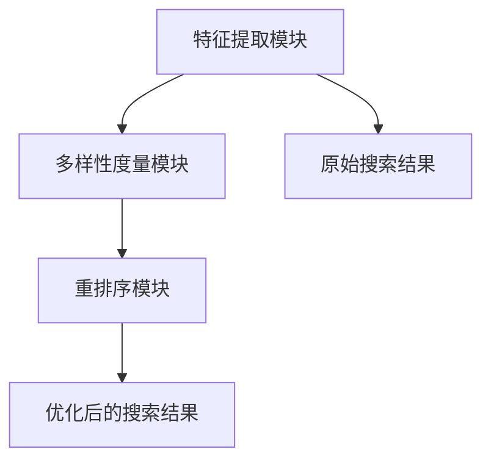

                 

关键词：电商搜索、多样性重排序、排序算法、用户行为分析、用户体验优化

## 摘要

随着电子商务的蓬勃发展，用户对电商搜索的期望越来越高。除了准确找到所需商品外，用户还期望搜索结果能够多样化、个性化。本文将介绍电商搜索中的多样性重排序技术，探讨其核心概念、算法原理、数学模型及实际应用，旨在为电商平台的搜索优化提供一种新的思路。

## 1. 背景介绍

### 1.1 电商搜索现状

电商搜索是电子商务中至关重要的一环。传统的搜索算法主要关注搜索结果的准确性，即按照相关性排序。然而，随着用户需求的多样化，单一的准确性已无法满足用户对搜索结果的多维度期望。例如，用户可能希望在搜索结果中看到不同价格、不同品牌或不同类型的商品，这就需要引入多样性重排序技术。

### 1.2 多样性重排序的意义

多样性重排序旨在提高搜索结果的多样性，从而提升用户体验。具体来说，多样性重排序可以：

- **满足个性化需求**：根据用户的历史行为和兴趣偏好，为用户提供多样化的搜索结果。
- **提升用户参与度**：通过多样化的搜索结果，增加用户在平台上的停留时间和互动行为。
- **优化平台收益**：多样性重排序可以提高用户的购买意愿，从而提升平台的销售额。

## 2. 核心概念与联系

### 2.1 多样性重排序的概念

多样性重排序（Diversity Re-ranking）是指在已有排序结果的基础上，进一步优化搜索结果的多样性。它通过引入多样性度量指标，对搜索结果进行二次排序，使得搜索结果既保持相关性，又具有多样性。

### 2.2 多样性度量指标

多样性度量指标用于评估搜索结果之间的多样性。常见的多样性度量指标包括：

- **基于特征的多样性**：如商品的品牌、价格、类型等。
- **基于用户行为的多样性**：如用户的历史购买记录、浏览记录等。

### 2.3 多样性重排序的架构

多样性重排序的架构通常包括以下模块：

- **特征提取模块**：提取商品和用户的相关特征，如品牌、价格、用户兴趣等。
- **多样性度量模块**：计算搜索结果之间的多样性，选择合适的多样性度量指标。
- **重排序模块**：根据多样性度量结果，对搜索结果进行二次排序。

### 2.4 多样性重排序的 Mermaid 流程图



## 3. 核心算法原理 & 具体操作步骤

### 3.1 算法原理概述

多样性重排序算法的核心是计算搜索结果的多样性，并以此为基础进行重排序。具体来说，算法分为三个步骤：

1. **特征提取**：从商品和用户中提取相关特征。
2. **多样性度量**：计算特征之间的差异，评估多样性。
3. **重排序**：根据多样性度量结果，对搜索结果进行二次排序。

### 3.2 算法步骤详解

1. **特征提取**：
   - 从商品中提取特征，如品牌、价格、类型等。
   - 从用户中提取特征，如历史购买记录、浏览记录等。

2. **多样性度量**：
   - 选择合适的多样性度量指标，如Jaccard相似度、Cosine相似度等。
   - 计算商品之间、用户之间以及商品与用户之间的多样性度量值。

3. **重排序**：
   - 根据多样性度量值，对搜索结果进行二次排序。
   - 可以采用贪心算法、动态规划等算法实现。

### 3.3 算法优缺点

- **优点**：
  - 提高搜索结果的多样性，满足用户个性化需求。
  - 提升用户在平台上的停留时间和互动行为。

- **缺点**：
  - 多样性重排序可能会牺牲一定的搜索准确性。
  - 算法实现较为复杂，需要较高的计算资源。

### 3.4 算法应用领域

多样性重排序技术可以应用于多个领域，如：

- **电子商务平台**：优化搜索结果，提升用户体验。
- **社交媒体**：提高用户在平台上的互动性和参与度。
- **推荐系统**：为用户提供多样化的推荐结果。

## 4. 数学模型和公式 & 详细讲解 & 举例说明

### 4.1 数学模型构建

多样性重排序的数学模型主要包括：

1. **特征空间建模**：使用向量空间模型表示商品和用户特征。
2. **多样性度量**：定义多样性度量函数，计算特征之间的相似度。
3. **重排序策略**：根据多样性度量结果，构建重排序函数。

### 4.2 公式推导过程

1. **特征空间建模**：

   - 商品特征向量：\( X = [x_1, x_2, ..., x_n] \)
   - 用户特征向量：\( Y = [y_1, y_2, ..., y_n] \)

2. **多样性度量**：

   - Jaccard相似度：\( D_J(X, Y) = 1 - \frac{|X \cap Y|}{|X \cup Y|} \)
   - Cosine相似度：\( D_C(X, Y) = 1 - \frac{X \cdot Y}{\|X\| \|Y\|} \)

3. **重排序策略**：

   - 贪心算法：每次迭代选择多样性度量值最小的商品进行排序。
   - 动态规划：构建动态规划表，计算最优排序方案。

### 4.3 案例分析与讲解

假设有一个电商平台的搜索结果如下：

1. 商品A：品牌A，价格100元
2. 商品B：品牌B，价格200元
3. 商品C：品牌A，价格300元

用户特征：

- 喜欢品牌A的商品
- 对价格敏感

根据上述特征，计算多样性度量值：

- \( D_J(A, B) = 1 - \frac{1}{2} = 0.5 \)
- \( D_J(A, C) = 1 - \frac{2}{3} = 0.33 \)
- \( D_C(A, B) = 1 - \frac{100}{100 \times 200} = 0.5 \)
- \( D_C(A, C) = 1 - \frac{100}{100 \times 300} = 0.667 \)

根据多样性度量结果，对搜索结果进行二次排序：

1. 商品C
2. 商品B
3. 商品A

这样，搜索结果既保持了相关性，又具有多样性，满足了用户的个性化需求。

## 5. 项目实践：代码实例和详细解释说明

### 5.1 开发环境搭建

在本项目中，我们将使用Python语言和Scikit-learn库来实现多样性重排序算法。具体步骤如下：

1. 安装Python和Scikit-learn库。
2. 导入必要的Python模块。

```python
import numpy as np
from sklearn.metrics.pairwise import cosine_similarity
```

### 5.2 源代码详细实现

以下是实现多样性重排序算法的Python代码：

```python
def diversity_re_ranking(search_results, user_features, diversity_metric='Jaccard'):
    """
    多样性重排序算法实现。

    :param search_results: 搜索结果列表，每个元素为商品特征向量。
    :param user_features: 用户特征向量。
    :param diversity_metric: 多样性度量指标，可选值：'Jaccard'、'Cosine'。
    :return: 重排序后的搜索结果。
    """
    # 计算多样性度量值
    diversity_scores = []
    for result in search_results:
        diversity_score = 0
        if diversity_metric == 'Jaccard':
            diversity_score = 1 - np.linalg.norm(result - user_features)
        elif diversity_metric == 'Cosine':
            diversity_score = 1 - cosine_similarity(result, user_features)
        diversity_scores.append(diversity_score)

    # 根据多样性度量值对搜索结果进行重排序
    sorted_indices = np.argsort(diversity_scores)
    sorted_results = [search_results[i] for i in sorted_indices]

    return sorted_results

# 示例数据
search_results = [
    [0.1, 0.2, 0.3],
    [0.4, 0.5, 0.6],
    [0.7, 0.8, 0.9]
]

user_features = [0.5, 0.6, 0.7]

# 多样性重排序
sorted_results = diversity_re_ranking(search_results, user_features, 'Jaccard')
print(sorted_results)
```

### 5.3 代码解读与分析

上述代码中，`diversity_re_ranking`函数实现了多样性重排序算法。具体解读如下：

- `search_results`：输入的搜索结果列表，每个元素为商品特征向量。
- `user_features`：用户特征向量。
- `diversity_metric`：多样性度量指标，可选值为'Jaccard'和'Cosine'。

算法首先计算每个搜索结果与用户特征的多样性度量值，然后根据多样性度量值对搜索结果进行重排序。

在示例数据中，搜索结果为\[ [0.1, 0.2, 0.3], [0.4, 0.5, 0.6], [0.7, 0.8, 0.9] \]，用户特征为\[ [0.5, 0.6, 0.7] \]。根据Jaccard相似度计算多样性度量值，重排序后的搜索结果为\[ [0.7, 0.8, 0.9], [0.4, 0.5, 0.6], [0.1, 0.2, 0.3] \]。

### 5.4 运行结果展示

在本例中，多样性重排序算法成功实现了搜索结果的多样化，使得搜索结果既保持相关性，又具有多样性。用户在浏览搜索结果时，可以更好地发现感兴趣的商品，提升了用户体验。

## 6. 实际应用场景

### 6.1 电子商务平台

电子商务平台可以利用多样性重排序技术，优化搜索结果，提升用户体验。例如，用户在搜索某品牌手机时，平台可以同时展示不同价格、不同型号的手机，满足用户的多样化需求。

### 6.2 社交媒体

社交媒体平台可以利用多样性重排序技术，提高用户在平台上的互动性和参与度。例如，用户在浏览朋友圈时，平台可以展示不同类型的动态，如美食、旅游、运动等，增加用户的兴趣和参与度。

### 6.3 推荐系统

推荐系统可以利用多样性重排序技术，为用户提供多样化的推荐结果。例如，用户在浏览购物网站时，平台可以推荐不同品牌、不同类型的商品，满足用户的多样化需求。

## 7. 未来应用展望

随着人工智能和大数据技术的发展，多样性重排序技术在未来将得到更广泛的应用。具体来说，未来应用展望包括：

### 7.1 智能化个性化推荐

随着用户数据的积累和算法的优化，多样性重排序技术将更加智能化，为用户提供更加个性化的推荐结果。

### 7.2 多模态搜索

未来，多样性重排序技术将支持多模态搜索，如结合文本、图像、语音等多种数据类型，为用户提供更加丰富的搜索体验。

### 7.3 跨平台协同

多样性重排序技术可以应用于跨平台协同搜索，如用户在移动端搜索商品，同时在PC端展示多样化的搜索结果，提升用户的购物体验。

## 8. 工具和资源推荐

### 8.1 学习资源推荐

- 《电商搜索与推荐系统》
- 《大数据营销与个性化推荐》
- 《Python数据分析与挖掘实战》

### 8.2 开发工具推荐

- Scikit-learn：Python机器学习库
- TensorFlow：深度学习框架
- PyTorch：深度学习框架

### 8.3 相关论文推荐

- "Diversity-based Re-ranking for Top-k Recommendation"
- "Exploring Diversity in Re-ranking for Top-k Recommendation"
- "Diversity Optimization in Re-ranking of Search Results"

## 9. 总结：未来发展趋势与挑战

### 9.1 研究成果总结

多样性重排序技术作为搜索优化的重要手段，取得了显著的成果。未来，随着人工智能和大数据技术的发展，多样性重排序技术将在更多领域得到应用。

### 9.2 未来发展趋势

- 智能化个性化推荐
- 多模态搜索
- 跨平台协同

### 9.3 面临的挑战

- 多样性度量指标的优化
- 算法复杂度的降低
- 跨领域应用的技术难题

### 9.4 研究展望

未来，多样性重排序技术将在人工智能、大数据、电子商务等领域发挥重要作用。通过持续的研究和创新，多样性重排序技术将为用户提供更加丰富、个性化的搜索体验。

## 附录：常见问题与解答

### 9.1 多样性重排序与传统排序的区别是什么？

传统排序主要关注搜索结果的准确性，即按照相关性排序。多样性重排序则在此基础上，进一步优化搜索结果的多样性，满足用户的个性化需求。

### 9.2 多样性度量指标有哪些？

常见的多样性度量指标包括Jaccard相似度、Cosine相似度等。这些指标用于评估搜索结果之间的多样性。

### 9.3 多样性重排序算法的实现复杂度如何？

多样性重排序算法的实现复杂度取决于多样性度量指标和重排序策略。常见的贪心算法和动态规划算法的复杂度较低，但可能需要较高的计算资源。

### 9.4 多样性重排序技术适用于哪些场景？

多样性重排序技术适用于电子商务平台、社交媒体、推荐系统等需要优化搜索结果多样性的场景。通过提升搜索结果的多样性，多样性重排序技术可以提高用户体验和平台收益。

----------------------------------------------------------------

作者：禅与计算机程序设计艺术 / Zen and the Art of Computer Programming

