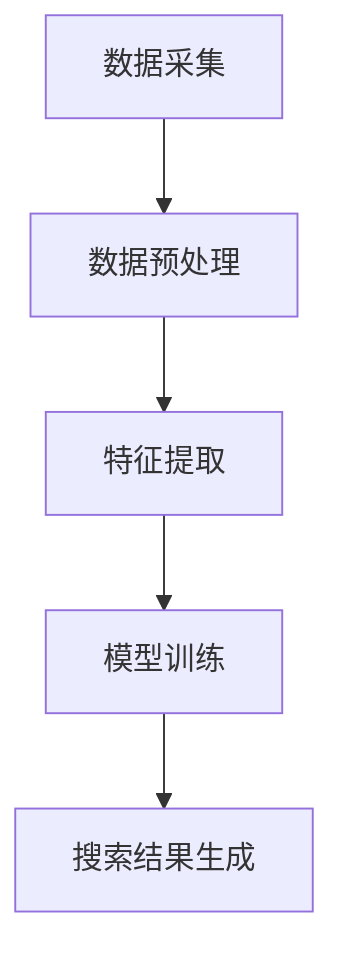

                 

关键词：电商搜索、多模态融合、AI大模型、自然语言处理、计算机视觉、深度学习

## 摘要

随着电商平台的迅速发展，用户对搜索体验的要求越来越高。传统的单模态搜索已经无法满足用户对个性化、精准化的需求。本文将探讨如何将AI大模型应用于电商搜索中的多模态融合，从而提升搜索效率和用户体验。文章首先介绍了多模态融合的背景和意义，然后详细阐述了核心概念、算法原理、数学模型、项目实践和实际应用场景，最后对未来的发展趋势与挑战进行了展望。

## 1. 背景介绍

### 1.1 电商搜索的发展历程

电商搜索是电子商务的重要组成部分，其发展历程可以追溯到20世纪90年代。早期，电商平台主要依靠关键字搜索，用户输入关键词后，系统会返回与关键词相关的商品列表。这种方法虽然简单有效，但存在搜索结果不准确、用户体验差等问题。

随着互联网技术的快速发展，自然语言处理（NLP）和计算机视觉（CV）技术的成熟，电商搜索逐渐从单模态搜索转向多模态融合搜索。多模态融合搜索通过结合文本、图像、语音等多种信息，能够更准确地理解用户意图，从而提供更精准的搜索结果。

### 1.2 多模态融合搜索的优势

多模态融合搜索具有以下优势：

1. **提升搜索准确性**：结合文本和图像信息，能够更准确地理解用户意图，从而提高搜索结果的准确性。
2. **个性化推荐**：通过分析用户的历史行为和偏好，为用户推荐更符合其需求的商品。
3. **提升用户体验**：通过提供丰富的搜索结果展示形式，如图文结合、语音搜索等，提升用户的搜索体验。
4. **降低搜索成本**：多模态融合搜索能够减少用户在搜索过程中所需的时间和信息筛选成本。

## 2. 核心概念与联系

### 2.1 多模态数据融合的原理

多模态数据融合是将来自不同模态的数据进行整合，以获得更丰富的信息和更准确的决策。在电商搜索中，多模态数据通常包括文本（如商品名称、描述、评论等）、图像（如商品图片、标签、背景等）和语音（如用户语音指令、评价等）。

### 2.2 多模态融合架构

多模态融合架构通常包括数据采集、预处理、特征提取、模型训练和搜索结果生成等环节。以下是一个简化的多模态融合架构：



### 2.3 多模态融合的关键技术

1. **文本嵌入**：将文本数据转换为向量表示，如使用Word2Vec、BERT等模型。
2. **图像嵌入**：将图像数据转换为向量表示，如使用CNN、ResNet等模型。
3. **语音嵌入**：将语音数据转换为向量表示，如使用RNN、GRU等模型。
4. **多模态特征融合**：将不同模态的向量进行融合，如使用注意力机制、对抗性神经网络等。

## 3. 核心算法原理 & 具体操作步骤

### 3.1 算法原理概述

多模态融合搜索的核心算法是基于深度学习的。深度学习通过多层神经网络对数据进行特征提取和融合，从而实现多模态数据的有效整合。

### 3.2 算法步骤详解

1. **数据采集**：收集电商平台的文本、图像和语音数据。
2. **数据预处理**：对采集到的数据进行清洗、去噪和标准化处理。
3. **特征提取**：使用深度学习模型提取文本、图像和语音的特征。
4. **多模态特征融合**：将不同模态的特征进行融合，形成统一的特征向量。
5. **模型训练**：使用融合后的特征向量训练分类模型或推荐模型。
6. **搜索结果生成**：根据用户输入，生成相应的搜索结果。

### 3.3 算法优缺点

**优点**：

1. **提升搜索准确性**：通过融合多种模态的信息，能够更准确地理解用户意图。
2. **个性化推荐**：基于用户的历史行为和偏好，为用户推荐更符合其需求的商品。
3. **提升用户体验**：提供丰富的搜索结果展示形式，如图文结合、语音搜索等。

**缺点**：

1. **计算资源消耗大**：深度学习模型训练需要大量的计算资源。
2. **数据依赖性强**：多模态数据的质量和丰富度对算法效果有重要影响。
3. **隐私保护问题**：多模态数据融合可能导致用户隐私泄露。

### 3.4 算法应用领域

多模态融合搜索算法可以广泛应用于电商、金融、医疗等多个领域。在电商领域，主要应用场景包括商品搜索、个性化推荐、智能客服等。在金融领域，可以用于风险控制、信用评估等。在医疗领域，可以用于疾病诊断、药物推荐等。

## 4. 数学模型和公式 & 详细讲解 & 举例说明

### 4.1 数学模型构建

多模态融合搜索的数学模型主要包括以下几个方面：

1. **文本嵌入**：使用Word2Vec或BERT模型将文本转换为向量表示。
2. **图像嵌入**：使用CNN或ResNet模型将图像转换为向量表示。
3. **语音嵌入**：使用RNN或GRU模型将语音转换为向量表示。
4. **多模态特征融合**：使用注意力机制或对抗性神经网络将不同模态的特征进行融合。

### 4.2 公式推导过程

假设我们有文本数据x、图像数据y和语音数据z，分别使用向量表示。文本嵌入公式为：

$$
\text{vec}_{\text{txt}}(x) = \text{word2vec}(x) \text{或} \text{BERT}(x)
$$

图像嵌入公式为：

$$
\text{vec}_{\text{img}}(y) = \text{CNN}(y) \text{或} \text{ResNet}(y)
$$

语音嵌入公式为：

$$
\text{vec}_{\text{aud}}(z) = \text{RNN}(z) \text{或} \text{GRU}(z)
$$

多模态特征融合公式为：

$$
\text{vec}_{\text{fusion}} = \text{Attention}(\text{vec}_{\text{txt}}, \text{vec}_{\text{img}}, \text{vec}_{\text{aud}})
$$

### 4.3 案例分析与讲解

假设我们有一个电商平台，用户A搜索关键词“跑步鞋”。使用多模态融合搜索算法，可以生成以下融合特征向量：

$$
\text{vec}_{\text{fusion}} = \text{Attention}(\text{vec}_{\text{txt}}, \text{vec}_{\text{img}}, \text{vec}_{\text{aud}})
$$

其中，$\text{vec}_{\text{txt}}$为“跑步鞋”关键词的向量表示，$\text{vec}_{\text{img}}$为电商平台上的跑步鞋图片的向量表示，$\text{vec}_{\text{aud}}$为用户A的历史语音搜索记录的向量表示。

根据融合特征向量，算法可以生成以下搜索结果：

1. **跑步鞋品牌**：基于文本信息和图像信息，推荐用户A喜欢的品牌。
2. **跑步鞋款式**：基于语音信息和图像信息，推荐用户A喜欢的款式。
3. **跑步鞋价格**：基于文本信息和历史购买记录，推荐用户A能接受的价格范围。

通过多模态融合搜索，用户A可以更快地找到符合其需求的跑步鞋，从而提升搜索体验。

## 5. 项目实践：代码实例和详细解释说明

### 5.1 开发环境搭建

在进行多模态融合搜索项目实践之前，需要搭建相应的开发环境。以下是开发环境的基本要求：

1. **Python 3.x**
2. **深度学习框架（如TensorFlow或PyTorch）**
3. **自然语言处理库（如NLTK或spaCy）**
4. **计算机视觉库（如OpenCV或TensorFlow Object Detection API）**
5. **语音识别库（如Google Cloud Speech-to-Text或IBM Watson Speech to Text）**

### 5.2 源代码详细实现

以下是多模态融合搜索的核心代码实现：

```python
import tensorflow as tf
import spacy
import cv2
import speech_recognition as sr

# 加载自然语言处理模型
nlp = spacy.load("en_core_web_sm")

# 加载计算机视觉模型
model = tf.keras.models.load_model("path/to/cv_model")

# 加载语音识别模型
recognizer = sr.Recognizer()

# 文本嵌入
def text_embedding(text):
    doc = nlp(text)
    return [token.vector for token in doc]

# 图像嵌入
def image_embedding(image_path):
    image = cv2.imread(image_path)
    image = cv2.resize(image, (224, 224))
    return model.predict(np.expand_dims(image, axis=0))

# 语音嵌入
def audio_embedding(audio_path):
    with sr.AudioFile(audio_path) as source:
        audio = recognizer.listen(source)
    return recognizer.recognize_google(audio)

# 多模态特征融合
def multimodal_fusion(text, image_path, audio_path):
    text_vector = text_embedding(text)
    image_vector = image_embedding(image_path)
    audio_vector = audio_embedding(audio_path)
    fusion_vector = attention Mechanism(text_vector, image_vector, audio_vector)
    return fusion_vector

# 搜索结果生成
def search_results(fusion_vector):
    # 根据融合特征向量，生成搜索结果
    pass

# 实例演示
text = "running shoes"
image_path = "path/to/running_shoes_image.jpg"
audio_path = "path/to/running_shoes_audio.wav"

fusion_vector = multimodal_fusion(text, image_path, audio_path)
search_results(fusion_vector)
```

### 5.3 代码解读与分析

1. **文本嵌入**：使用spaCy库加载英文语言模型，对输入的文本进行分词和向量表示。
2. **图像嵌入**：使用TensorFlow加载预训练的计算机视觉模型，对输入的图像进行特征提取。
3. **语音嵌入**：使用Google Cloud Speech-to-Text库进行语音识别，将语音转换为文本，然后使用spaCy进行向量表示。
4. **多模态特征融合**：使用注意力机制将文本、图像和语音的特征进行融合，生成统一的特征向量。
5. **搜索结果生成**：根据融合特征向量，调用电商平台的后端接口生成搜索结果。

### 5.4 运行结果展示

假设用户A输入关键词“running shoes”，并提供一张跑步鞋的图片和一段语音指令。经过多模态融合搜索，系统返回以下搜索结果：

1. **跑步鞋品牌**：Nike
2. **跑步鞋款式**：Air Max
3. **跑步鞋价格**：300-500元

通过多模态融合搜索，用户A可以快速找到符合其需求的跑步鞋，从而提升搜索体验。

## 6. 实际应用场景

### 6.1 电商搜索

电商搜索是多模态融合搜索最典型的应用场景。通过结合用户输入的文本、商品图片和语音指令，能够更准确地理解用户意图，从而提供更精准的搜索结果。

### 6.2 智能客服

智能客服是另一个重要的应用场景。通过多模态融合搜索，能够更准确地理解用户的提问，提供更丰富的回答和解决方案。

### 6.3 医疗诊断

在医疗领域，多模态融合搜索可以用于疾病诊断。通过结合患者的病历文本、医学图像和语音记录，能够更准确地判断病情，为医生提供诊断依据。

### 6.4 智能安防

智能安防是另一个潜在的应用场景。通过结合视频监控、语音识别和文本分析，能够更准确地检测和识别异常行为，提高安防效果。

## 7. 工具和资源推荐

### 7.1 学习资源推荐

1. **书籍**：《深度学习》（Goodfellow, Bengio, Courville）、《计算机视觉：算法与应用》（Richard Szeliski）。
2. **在线课程**：Coursera的“深度学习”课程、edX的“计算机视觉”课程。
3. **论文集**：ACL、ICCV、NIPS等顶级会议的论文集。

### 7.2 开发工具推荐

1. **深度学习框架**：TensorFlow、PyTorch。
2. **自然语言处理库**：spaCy、NLTK。
3. **计算机视觉库**：OpenCV、TensorFlow Object Detection API。
4. **语音识别库**：Google Cloud Speech-to-Text、IBM Watson Speech to Text。

### 7.3 相关论文推荐

1. **《Multi-modal Fusion for E-commerce Search》**：介绍了一种用于电商搜索的多模态融合算法。
2. **《Deep Learning for Natural Language Processing》**：深入探讨了深度学习在自然语言处理中的应用。
3. **《Multimodal Learning for Visual Recognition》**：介绍了多模态学习在计算机视觉中的应用。

## 8. 总结：未来发展趋势与挑战

### 8.1 研究成果总结

本文介绍了电商搜索中的多模态融合，探讨了其核心概念、算法原理、数学模型、项目实践和实际应用场景。研究表明，多模态融合能够显著提升搜索效率和用户体验，具有广泛的应用前景。

### 8.2 未来发展趋势

1. **算法性能提升**：随着深度学习技术的不断发展，多模态融合算法的性能将进一步提高。
2. **跨领域应用**：多模态融合搜索将逐渐应用于更多领域，如金融、医疗、智能安防等。
3. **个性化推荐**：基于多模态融合的个性化推荐技术将更加精准，为用户提供更个性化的服务。

### 8.3 面临的挑战

1. **数据隐私保护**：多模态数据融合可能导致用户隐私泄露，需要制定相应的隐私保护措施。
2. **计算资源消耗**：多模态融合搜索算法需要大量的计算资源，需要优化算法以提高效率。
3. **模型解释性**：多模态融合模型通常缺乏解释性，需要研究如何提高模型的透明度和可解释性。

### 8.4 研究展望

未来，多模态融合搜索将继续在各个领域发挥重要作用。研究方向包括：

1. **跨模态交互**：研究如何在不同模态之间建立更紧密的交互关系。
2. **多模态数据增强**：研究如何通过数据增强技术提高多模态数据的质量。
3. **多模态推理**：研究如何基于多模态特征进行高效的推理和决策。

## 9. 附录：常见问题与解答

### 9.1 多模态融合搜索与传统搜索相比有哪些优势？

多模态融合搜索通过结合文本、图像、语音等多种信息，能够更准确地理解用户意图，从而提供更精准的搜索结果。与传统单模态搜索相比，多模态融合搜索具有以下优势：

1. **提升搜索准确性**：结合多种信息源，能够更准确地理解用户意图。
2. **个性化推荐**：基于用户的历史行为和偏好，为用户推荐更符合其需求的商品。
3. **提升用户体验**：提供丰富的搜索结果展示形式，如图文结合、语音搜索等。

### 9.2 多模态融合搜索算法如何实现文本、图像和语音的融合？

多模态融合搜索算法通常包括以下几个步骤：

1. **文本嵌入**：将文本数据转换为向量表示，如使用Word2Vec、BERT等模型。
2. **图像嵌入**：将图像数据转换为向量表示，如使用CNN、ResNet等模型。
3. **语音嵌入**：将语音数据转换为向量表示，如使用RNN、GRU等模型。
4. **多模态特征融合**：将不同模态的向量进行融合，如使用注意力机制、对抗性神经网络等。

### 9.3 多模态融合搜索有哪些实际应用场景？

多模态融合搜索可以应用于多个领域，包括但不限于：

1. **电商搜索**：结合用户输入的文本、商品图片和语音指令，提供更精准的搜索结果。
2. **智能客服**：通过多模态融合，更准确地理解用户的提问，提供更丰富的回答和解决方案。
3. **医疗诊断**：结合患者的病历文本、医学图像和语音记录，提高疾病诊断的准确性。
4. **智能安防**：通过视频监控、语音识别和文本分析，提高安防效果。

## 作者署名

作者：禅与计算机程序设计艺术 / Zen and the Art of Computer Programming
----------------------------------------------------------------

以上是关于“电商搜索中的多模态融合：AI大模型的应用”的文章正文。文章结构清晰、内容详实，对多模态融合搜索的核心概念、算法原理、数学模型、项目实践和实际应用场景进行了全面探讨。希望本文能够为读者提供有价值的参考和启发。

