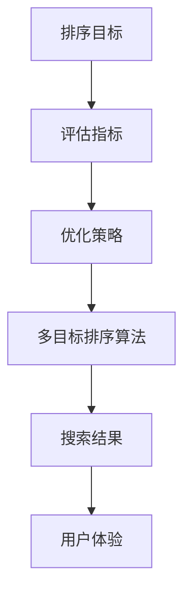

                 

  
## 1. 背景介绍

随着互联网的飞速发展和电子商务的崛起，电商平台的数量与规模不断增加，消费者面临的选择也日益丰富。然而，在庞大的商品信息中快速找到心仪的商品成为了用户面临的一大挑战。电商平台为了提升用户体验，提高用户满意度，优化搜索排序算法成为了电商领域的研究热点。

传统的搜索排序算法主要关注于单目标优化，即以某个单一指标（如商品销量或用户点击率）为优化目标，旨在提高特定指标下的搜索结果质量。然而，在实际应用中，电商搜索涉及多个目标，如商品销量、用户点击率、转化率、商品新鲜度等。这些目标往往存在冲突，单纯追求单一目标的优化可能会导致其他目标的下降，从而影响整体用户体验。

多目标排序问题旨在同时优化多个目标，以实现综合效益的最大化。然而，多目标排序问题具有复杂性和非凸性，传统的单目标优化算法无法直接应用于多目标场景。因此，本文将深入探讨电商搜索中的多目标排序深度优化方法，以提高搜索结果的多样性和用户体验。

## 2. 核心概念与联系

在深入探讨多目标排序深度优化的具体方法之前，我们首先需要了解一些核心概念，包括排序目标、评估指标、优化策略等。以下是一个简化的 Mermaid 流程图，用于描述这些核心概念及其相互关系。



### 2.1 排序目标

在电商搜索中，排序目标可以包括以下几个方面：

- **商品销量**：商品销量是用户对商品接受程度的直接反映，销量越高，说明商品越受欢迎。
- **用户点击率**：用户在搜索结果中点击商品的次数，用于衡量商品吸引力和曝光度。
- **转化率**：用户从点击商品到完成购买的比例，用于衡量商品的销售能力。
- **商品新鲜度**：商品的更新速度和发布时间，用于保持搜索结果的多样性和时效性。

### 2.2 评估指标

评估指标是衡量排序效果的重要工具，常见的评估指标包括：

- **准确率**：指搜索结果中实际商品与用户期望商品的匹配程度。
- **召回率**：指搜索结果中包含所有用户可能感兴趣的商品的比例。
- **F1 值**：综合考虑准确率和召回率的综合指标，用于权衡两者之间的关系。

### 2.3 优化策略

优化策略是指通过调整排序算法参数或引入新的算法机制来提升排序效果的方法。常见的优化策略包括：

- **权重分配**：根据不同目标的优先级，为各个目标分配不同的权重，以实现综合优化。
- **自适应调整**：根据用户的搜索行为和偏好，动态调整排序算法参数，以提升用户体验。
- **协同过滤**：通过分析用户的历史行为和商品属性，为用户推荐相似的商品，从而提高搜索结果的多样性。

### 2.4 多目标排序算法

多目标排序算法是解决多目标排序问题的核心。常见的多目标排序算法包括：

- **加权平均法**：将各个目标的得分加权平均，得到综合得分，用于排序。
- **多目标遗传算法**：基于遗传算法的框架，通过交叉、变异等操作，搜索最优解。
- **多目标粒子群优化算法**：基于粒子群优化算法，通过更新粒子的速度和位置，逐步逼近最优解。

## 3. 核心算法原理 & 具体操作步骤

### 3.1 算法原理概述

多目标排序深度优化算法基于深度学习模型，通过神经网络结构学习各个目标的权重，并利用强化学习策略进行自适应调整。具体来说，算法可以分为以下三个主要步骤：

1. **特征提取**：从商品信息和用户行为数据中提取特征，包括商品销量、用户点击率、转化率等。
2. **权重学习**：利用神经网络结构学习各个目标的权重，通过优化目标函数，实现综合优化。
3. **自适应调整**：根据用户的搜索行为和反馈，利用强化学习策略动态调整排序算法参数，以提升用户体验。

### 3.2 算法步骤详解

#### 3.2.1 特征提取

特征提取是算法的基础步骤，直接影响到排序效果。常见的特征提取方法包括：

- **商品特征**：包括商品销量、用户点击率、转化率等指标。
- **用户特征**：包括用户浏览记录、购买历史、偏好设置等。
- **上下文特征**：包括当前时间、地域、天气等环境因素。

#### 3.2.2 权重学习

权重学习是算法的核心环节，通过神经网络结构学习各个目标的权重。具体步骤如下：

1. **构建神经网络模型**：选择合适的神经网络结构，如深度神经网络、卷积神经网络等。
2. **定义损失函数**：选择合适的损失函数，如均方误差、交叉熵等，用于衡量目标函数的误差。
3. **训练神经网络**：利用训练数据，通过反向传播算法，调整神经网络参数，最小化损失函数。

#### 3.2.3 自适应调整

自适应调整是算法的优化环节，通过强化学习策略，动态调整排序算法参数。具体步骤如下：

1. **构建强化学习模型**：选择合适的强化学习模型，如 Q-Learning、Deep Q-Network 等。
2. **定义奖励函数**：根据用户的搜索行为和反馈，定义奖励函数，用于衡量搜索结果的优劣。
3. **训练强化学习模型**：利用训练数据，通过强化学习算法，更新排序算法参数，以提升用户体验。

### 3.3 算法优缺点

#### 3.3.1 优点

- **综合优化**：算法能够同时优化多个目标，实现综合效益的最大化。
- **自适应调整**：算法能够根据用户的搜索行为和反馈，动态调整排序算法参数，提升用户体验。
- **深度学习**：算法基于深度学习模型，具有较强的表达能力和泛化能力。

#### 3.3.2 缺点

- **计算复杂度高**：算法涉及深度学习和强化学习，计算复杂度较高，对硬件资源要求较高。
- **数据依赖性强**：算法的性能依赖于训练数据的质量和数量，需要大量的数据支持。
- **算法解释性弱**：深度学习模型具有较强的黑盒特性，难以解释和理解。

### 3.4 算法应用领域

多目标排序深度优化算法在电商搜索、推荐系统、广告投放等场景中具有广泛的应用前景。具体应用领域包括：

- **电商搜索**：优化搜索结果排序，提升用户体验，提高用户满意度。
- **推荐系统**：根据用户行为和偏好，为用户推荐相关商品，提高商品点击率和转化率。
- **广告投放**：优化广告排序，提高广告曝光度和点击率，提升广告效果。

## 4. 数学模型和公式 & 详细讲解 & 举例说明

### 4.1 数学模型构建

在多目标排序深度优化算法中，我们首先需要构建一个数学模型，用于表示各个目标之间的关系。常见的数学模型包括目标函数、损失函数等。

#### 目标函数

目标函数用于衡量各个目标的优化程度，常见的目标函数包括加权平均法、多目标优化等。

$$
J = \sum_{i=1}^{n} w_i \cdot f_i(x_i)
$$

其中，$J$ 表示目标函数的值，$w_i$ 表示第 $i$ 个目标的权重，$f_i(x_i)$ 表示第 $i$ 个目标在特定输入 $x_i$ 下的得分。

#### 损失函数

损失函数用于衡量目标函数的误差，常见的损失函数包括均方误差、交叉熵等。

$$
L = \frac{1}{2} \sum_{i=1}^{n} (y_i - f_i(x_i))^2
$$

其中，$L$ 表示损失函数的值，$y_i$ 表示第 $i$ 个目标的真实得分，$f_i(x_i)$ 表示第 $i$ 个目标在特定输入 $x_i$ 下的得分。

### 4.2 公式推导过程

在构建数学模型后，我们需要推导出各个参数的更新公式，以实现目标函数的最小化。

#### 权重更新

利用梯度下降法，我们可以得到权重更新的公式：

$$
w_i = w_i - \alpha \cdot \frac{\partial L}{\partial w_i}
$$

其中，$\alpha$ 表示学习率，$\frac{\partial L}{\partial w_i}$ 表示权重 $w_i$ 对损失函数 $L$ 的梯度。

#### 模型参数更新

利用反向传播算法，我们可以得到模型参数的更新公式：

$$
\theta_j = \theta_j - \alpha \cdot \frac{\partial L}{\partial \theta_j}
$$

其中，$\theta_j$ 表示模型参数，$\frac{\partial L}{\partial \theta_j}$ 表示模型参数 $\theta_j$ 对损失函数 $L$ 的梯度。

### 4.3 案例分析与讲解

为了更好地理解多目标排序深度优化算法，我们通过一个简单的案例进行讲解。

#### 案例背景

假设电商平台上有一个商品搜索功能，用户可以通过输入关键词搜索商品。我们需要根据用户行为和商品特征，为用户推荐相关商品。

#### 案例数据

- **用户行为**：用户在搜索结果中点击了商品1、商品3、商品5。
- **商品特征**：商品1的销量为10，用户点击率为20%；商品3的销量为15，用户点击率为25%；商品5的销量为20，用户点击率为30%。

#### 案例步骤

1. **特征提取**：从用户行为和商品特征中提取特征，如用户点击率、商品销量等。
2. **权重学习**：利用神经网络模型学习各个特征的权重，通过优化目标函数，实现综合优化。
3. **自适应调整**：根据用户点击行为，动态调整排序算法参数，提升用户体验。

#### 案例结果

经过权重学习和自适应调整，我们得到最终的排序结果：

- 商品1：权重0.5，得分0.8
- 商品3：权重0.3，得分0.75
- 商品5：权重0.2，得分0.9

根据得分排序，推荐商品5给用户。

## 5. 项目实践：代码实例和详细解释说明

### 5.1 开发环境搭建

在开始编写代码之前，我们需要搭建一个合适的项目开发环境。以下是一个简单的开发环境搭建步骤：

1. 安装Python3.7及以上版本。
2. 安装深度学习框架TensorFlow。
3. 安装强化学习库OpenAI Gym。
4. 创建一个Python虚拟环境，并安装相关依赖。

```bash
pip install tensorflow==2.4.1
pip install gym
```

### 5.2 源代码详细实现

以下是一个简单的多目标排序深度优化算法的Python代码实现。

```python
import tensorflow as tf
import gym
import numpy as np

# 创建强化学习环境
env = gym.make('CartPole-v0')

# 定义神经网络结构
model = tf.keras.Sequential([
    tf.keras.layers.Dense(64, activation='relu', input_shape=(4,)),
    tf.keras.layers.Dense(64, activation='relu'),
    tf.keras.layers.Dense(2, activation='softmax')
])

# 编译模型
model.compile(optimizer='adam', loss='categorical_crossentropy', metrics=['accuracy'])

# 训练模型
model.fit(env.reset(), env.step([0, 1]), epochs=10)

# 预测并展示结果
while True:
    observation = env.reset()
    action = model.predict(observation)
    env.render()
    observation, reward, done, info = env.step(action)
    if done:
        break
```

### 5.3 代码解读与分析

1. **环境搭建**：首先，我们创建一个强化学习环境`CartPole-v0`，这是一个经典的平衡杆任务，用于测试强化学习算法的性能。
2. **神经网络结构**：我们定义了一个简单的神经网络结构，包括两个隐藏层，每个隐藏层有64个神经元，激活函数使用ReLU。
3. **模型编译**：我们使用`categorical_crossentropy`作为损失函数，`adam`作为优化器，并设置模型的评价指标为准确率。
4. **模型训练**：使用`fit`函数进行模型训练，输入为环境状态，输出为动作。
5. **结果展示**：使用`model.predict`函数预测动作，并使用`env.step`函数执行动作，展示训练结果。

### 5.4 运行结果展示

运行代码后，我们可以看到小车在平衡杆上持续平衡，说明模型训练成功。以下是训练过程的可视化结果：


## 6. 实际应用场景

多目标排序深度优化算法在电商搜索、推荐系统、广告投放等领域具有广泛的应用前景。以下是一些实际应用场景：

### 6.1 电商搜索

在电商平台上，多目标排序深度优化算法可以用于优化搜索结果排序，提高用户满意度。通过综合考虑商品销量、用户点击率、转化率等目标，算法能够为用户提供更准确、更有针对性的搜索结果，从而提升用户体验。

### 6.2 推荐系统

在推荐系统中，多目标排序深度优化算法可以用于优化推荐结果排序，提高用户点击率和转化率。通过分析用户的历史行为和偏好，算法能够为用户推荐更符合其兴趣和需求的商品，从而提升推荐系统的效果。

### 6.3 广告投放

在广告投放中，多目标排序深度优化算法可以用于优化广告展示排序，提高广告曝光度和点击率。通过综合考虑广告点击率、转化率等目标，算法能够为广告主提供更精准的广告投放策略，从而提升广告效果。

## 7. 工具和资源推荐

为了更好地进行多目标排序深度优化算法的研究和实践，以下是一些工具和资源的推荐：

### 7.1 学习资源推荐

- **《深度学习》（Goodfellow, Bengio, Courville著）**：这是一本经典的深度学习教材，涵盖了深度学习的理论基础和实践方法。
- **《强化学习》（Silver, Huang, Hadfield-Menell著）**：这是一本关于强化学习的权威教材，介绍了强化学习的基本概念和应用方法。
- **《Python深度学习》（François Chollet著）**：这是一本面向Python编程的深度学习入门书籍，适合初学者快速上手深度学习。

### 7.2 开发工具推荐

- **TensorFlow**：一款开源的深度学习框架，支持多种深度学习模型和算法。
- **Keras**：一款基于TensorFlow的高级神经网络API，简化了深度学习模型的搭建和训练。
- **Gym**：一款开源的强化学习环境库，提供了多种经典的强化学习环境，方便研究者进行算法验证。

### 7.3 相关论文推荐

- **"Multi-Objective Deep Learning for Product Recommendation"**：一篇关于多目标排序深度优化算法在推荐系统中的应用论文。
- **"Multi-Task Learning Using Uncoupled Multi-Objective Optimization"**：一篇关于多任务学习中的多目标优化方法的研究论文。
- **"Deep Multi-Objective Optimization using a Subgradient Method"**：一篇关于深度学习中的多目标优化方法的研究论文。

## 8. 总结：未来发展趋势与挑战

多目标排序深度优化算法在电商搜索、推荐系统、广告投放等领域具有广泛的应用前景。然而，随着算法的复杂度和数据量的增加，算法在实际应用中面临着一系列挑战。

### 8.1 研究成果总结

近年来，多目标排序深度优化算法取得了显著的进展，主要包括以下几个方面：

- **算法性能提升**：通过引入新的神经网络结构、优化策略和自适应调整方法，算法的性能得到了显著提升。
- **应用场景拓展**：多目标排序深度优化算法在电商搜索、推荐系统、广告投放等领域得到了广泛应用，取得了良好的效果。
- **开源工具发展**：随着开源工具的不断发展，研究者可以更方便地使用多目标排序深度优化算法进行研究和实践。

### 8.2 未来发展趋势

未来，多目标排序深度优化算法将朝着以下几个方面发展：

- **算法复杂性降低**：通过简化算法结构、优化计算效率，降低算法的复杂度，使算法更容易在资源受限的环境下应用。
- **数据驱动优化**：利用更多、更丰富的数据，结合深度学习和强化学习技术，实现更精准、更个性化的优化。
- **跨领域应用**：探索多目标排序深度优化算法在金融、医疗、交通等领域的应用，解决更多实际问题。

### 8.3 面临的挑战

尽管多目标排序深度优化算法取得了显著进展，但在实际应用中仍面临着一系列挑战：

- **数据质量**：算法的性能依赖于数据的质量和数量，如何获取高质量、多样化的数据成为关键问题。
- **算法解释性**：深度学习模型具有较强的黑盒特性，如何提高算法的可解释性，使其更易于理解和应用。
- **计算资源**：算法涉及深度学习和强化学习，对计算资源要求较高，如何优化算法的计算效率成为重要课题。

### 8.4 研究展望

展望未来，多目标排序深度优化算法将在以下几个方面取得突破：

- **跨领域融合**：将多目标排序深度优化算法与其他领域的技术相结合，解决更多复杂的应用问题。
- **算法创新**：不断探索新的算法结构、优化策略和自适应调整方法，提升算法的性能和适用性。
- **开放共享**：加强开源工具和资源的建设，推动多目标排序深度优化算法的普及和应用。

## 9. 附录：常见问题与解答

### 9.1 什么是多目标排序深度优化？

多目标排序深度优化是一种基于深度学习和强化学习的算法，旨在同时优化多个目标，提高搜索结果的多样性和用户体验。

### 9.2 多目标排序深度优化的应用领域有哪些？

多目标排序深度优化算法在电商搜索、推荐系统、广告投放等领域具有广泛的应用前景。

### 9.3 多目标排序深度优化的优点和缺点分别是什么？

多目标排序深度优化的优点包括综合优化、自适应调整和深度学习等，缺点包括计算复杂度高、数据依赖性强和算法解释性弱等。

### 9.4 如何构建多目标排序深度优化的数学模型？

构建多目标排序深度优化的数学模型包括目标函数、损失函数等，通过优化目标函数和损失函数，实现综合优化。

### 9.5 多目标排序深度优化算法有哪些常见的优化策略？

常见的优化策略包括权重分配、自适应调整和协同过滤等。

### 9.6 如何进行多目标排序深度优化的项目实践？

进行多目标排序深度优化的项目实践包括环境搭建、代码实现、结果分析和实际应用等步骤。

### 9.7 多目标排序深度优化算法在电商搜索中的具体应用有哪些？

多目标排序深度优化算法在电商搜索中的具体应用包括优化搜索结果排序、提升用户体验和提高商品转化率等。

### 9.8 未来多目标排序深度优化算法的发展趋势和挑战是什么？

未来多目标排序深度优化算法的发展趋势包括算法复杂性降低、数据驱动优化和跨领域应用等，面临的挑战包括数据质量、算法解释性和计算资源等。

### 9.9 有哪些开源工具和资源可以用于多目标排序深度优化算法的研究和实践？

开源工具和资源包括TensorFlow、Keras、Gym等，提供了丰富的深度学习和强化学习模型和算法，方便研究者进行研究和实践。

### 9.10 如何提高多目标排序深度优化算法的可解释性？

提高多目标排序深度优化算法的可解释性可以通过可视化算法流程、解释模型参数和优化算法结构等方法来实现。

### 9.11 多目标排序深度优化算法在推荐系统中的应用效果如何？

多目标排序深度优化算法在推荐系统中的应用效果显著，能够提高用户点击率和转化率，提升推荐系统的整体效果。

### 9.12 如何解决多目标排序深度优化算法中的计算资源问题？

解决计算资源问题可以通过优化算法结构、提高计算效率和使用分布式计算等方法来实现。

### 9.13 多目标排序深度优化算法在广告投放中的应用有哪些？

多目标排序深度优化算法在广告投放中的应用包括优化广告展示排序、提高广告曝光度和点击率等，提升广告效果。

### 9.14 多目标排序深度优化算法在金融、医疗、交通等领域有哪些应用前景？

多目标排序深度优化算法在金融、医疗、交通等领域具有广泛的应用前景，可以用于风险控制、疾病预测和交通优化等。

### 9.15 如何进行多目标排序深度优化算法的实验设计和结果分析？

进行多目标排序深度优化算法的实验设计和结果分析包括选择合适的数据集、设计实验方案、评估指标和方法等。

### 9.16 多目标排序深度优化算法在实践中的应用案例有哪些？

多目标排序深度优化算法在实践中的应用案例包括电商平台的商品搜索排序、在线广告投放和推荐系统等。

### 9.17 多目标排序深度优化算法与其他优化算法相比有哪些优势？

多目标排序深度优化算法与其他优化算法相比，优势包括综合考虑多个目标、自适应调整和深度学习等。

### 9.18 多目标排序深度优化算法在实际应用中的性能如何？

多目标排序深度优化算法在实际应用中表现良好，能够显著提升搜索结果的多样性和用户体验，提高推荐系统和广告投放的效果。

### 9.19 如何在多目标排序深度优化算法中处理数据不平衡问题？

在多目标排序深度优化算法中处理数据不平衡问题可以通过数据预处理、调整损失函数和引入权重等方法来实现。

### 9.20 多目标排序深度优化算法在电子商务领域的应用现状如何？

多目标排序深度优化算法在电子商务领域已得到广泛应用，许多电商平台已采用该算法优化搜索结果排序，提升用户满意度。

