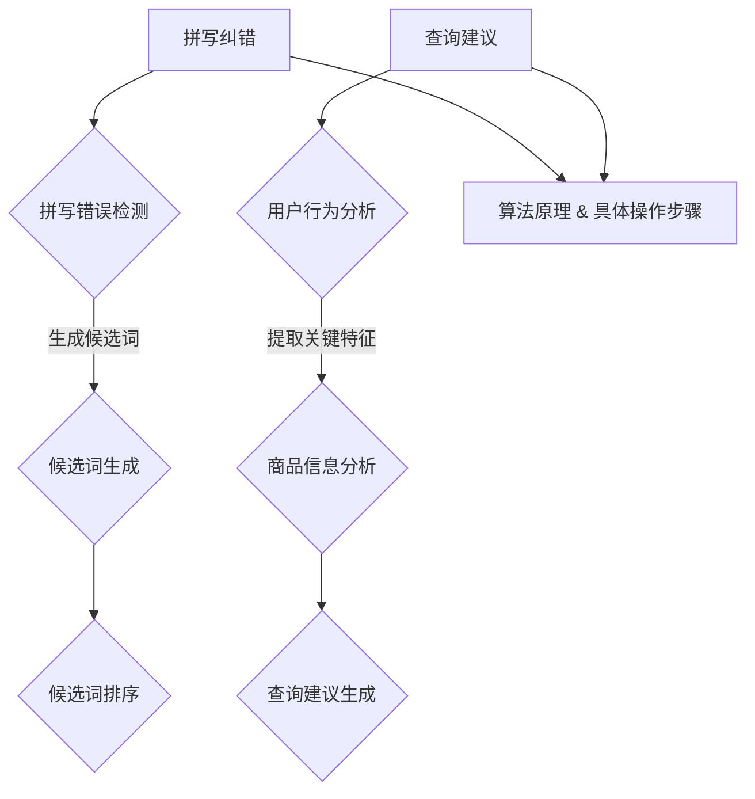

                 

关键词：电商搜索、拼写纠错、查询建议、技术、算法、数学模型、实际应用、未来展望

> 摘要：电商搜索在用户体验中扮演着至关重要的角色。随着电子商务的不断发展，如何提高搜索的准确性和用户体验成为了一个关键问题。本文旨在探讨电商搜索中的拼写纠错与查询建议技术，分析其核心概念、算法原理、数学模型以及实际应用，为电商平台的搜索优化提供理论支持和实践指导。

## 1. 背景介绍

在互联网时代，电子商务已经成为全球经济发展的新引擎。电商平台通过提供丰富的商品信息和便捷的购物体验，极大地改变了人们的消费方式。然而，随着商品数量的激增和用户搜索习惯的多样化，电商搜索系统面临着巨大的挑战。如何提高搜索的准确性、降低用户搜索成本、提升用户体验成为电商平台关注的焦点。

拼写纠错与查询建议技术是电商搜索中两项重要的功能。拼写纠错旨在识别和纠正用户输入的错误拼写，提高搜索的准确性；查询建议则通过分析用户的搜索行为和商品信息，提供有针对性的搜索建议，帮助用户快速找到所需商品。

本文将围绕电商搜索中的拼写纠错与查询建议技术展开讨论，首先介绍相关核心概念和算法原理，然后探讨数学模型的构建和公式推导，接着通过实际项目实践进行代码解读和运行结果展示，最后分析实际应用场景和未来发展趋势。

## 2. 核心概念与联系

### 2.1 拼写纠错

拼写纠错技术是指通过算法自动识别用户输入中的拼写错误，并给出正确的拼写建议。其核心概念包括：

- **拼写错误检测**：算法需要能够识别出输入文本中的拼写错误。
- **候选词生成**：根据检测到的拼写错误，算法需要生成一组可能的正确拼写候选词。
- **候选词排序**：对候选词进行排序，选择最有可能的正确拼写。

拼写纠错技术的实现涉及多个方面，包括自然语言处理、机器学习和信息检索等。

### 2.2 查询建议

查询建议技术旨在通过分析用户的搜索行为和商品信息，为用户提供有针对性的搜索建议。其核心概念包括：

- **用户行为分析**：通过分析用户的搜索历史、浏览记录和购买行为，了解用户的偏好。
- **商品信息分析**：通过对商品名称、描述和分类等信息进行分析，提取商品的关键特征。
- **查询建议生成**：基于用户行为和商品信息，生成相关的搜索建议。

查询建议技术的实现也涉及到自然语言处理、数据挖掘和推荐系统等技术。

### 2.3 Mermaid 流程图

为了更清晰地展示拼写纠错和查询建议技术的核心概念和联系，下面使用 Mermaid 流程图进行说明。



## 3. 核心算法原理 & 具体操作步骤

### 3.1 算法原理概述

拼写纠错和查询建议技术的实现都依赖于一系列算法。以下分别介绍这两项技术的算法原理。

#### 3.1.1 拼写纠错算法原理

拼写纠错算法通常采用动态规划算法，如 Levenshtein 距离算法。该算法通过计算输入文本与候选词之间的编辑距离（即需要多少次编辑操作才能将一个字符串转换为另一个字符串）来评估候选词的匹配程度。具体操作步骤如下：

1. **初始化**：初始化一个动态规划表，表中的每个元素表示输入文本的每个字符与候选词之间的编辑距离。
2. **填充表**：通过迭代填充动态规划表，计算输入文本的每个子串与候选词之间的编辑距离。
3. **选择最优解**：根据动态规划表的最终结果，选择编辑距离最小的候选词作为正确拼写。

#### 3.1.2 查询建议算法原理

查询建议算法通常采用基于协同过滤和基于内容的推荐系统。以下分别介绍这两种算法的原理。

1. **协同过滤推荐系统**：
   - **用户基于**：通过分析用户的搜索历史、浏览记录和购买行为，找出与目标用户相似的其他用户，并推荐这些用户喜欢的商品。
   - **物品基础**：通过分析商品之间的相似性，为用户推荐与其历史行为相似的其它商品。

2. **基于内容的推荐系统**：
   - **基于商品特征**：通过分析商品的名称、描述、分类等信息，为用户推荐具有相似特征的其它商品。
   - **基于用户特征**：通过分析用户的偏好和行为，为用户推荐符合其个人喜好的商品。

### 3.2 算法步骤详解

下面分别详细介绍拼写纠错和查询建议算法的具体操作步骤。

#### 3.2.1 拼写纠错算法步骤详解

1. **输入文本**：用户输入一个包含拼写错误的搜索关键词。
2. **拼写错误检测**：通过文本预处理技术（如分词、去停用词等），识别输入文本中的拼写错误。
3. **生成候选词**：根据检测到的拼写错误，生成一组可能的正确拼写候选词。候选词生成可以使用单词编辑距离算法、同音词替换算法等。
4. **候选词排序**：对候选词进行排序，选择编辑距离最小的候选词作为最可能的正确拼写。
5. **输出结果**：将正确拼写后的关键词发送给搜索引擎进行查询。

#### 3.2.2 查询建议算法步骤详解

1. **用户行为分析**：收集用户的搜索历史、浏览记录和购买行为，提取用户的行为特征。
2. **商品信息分析**：收集商品的名称、描述、分类等信息，提取商品的关键特征。
3. **协同过滤推荐系统**：
   - **用户基础**：计算与目标用户相似度最高的用户集合。
   - **物品基础**：根据用户集合，为用户推荐相似度最高的商品。
4. **基于内容的推荐系统**：
   - **基于商品特征**：为用户推荐具有相似特征的其它商品。
   - **基于用户特征**：为用户推荐符合其个人喜好的商品。
5. **查询建议生成**：将推荐结果生成查询建议，并显示在搜索结果页面上。

### 3.3 算法优缺点

#### 3.3.1 拼写纠错算法优缺点

**优点**：
- **准确性高**：动态规划算法能够准确地识别和纠正拼写错误。
- **适应性强**：可以根据不同的拼写错误模式生成候选词。

**缺点**：
- **计算复杂度高**：动态规划算法的计算复杂度较高，对于大规模数据集可能存在性能瓶颈。
- **效果受限于语料库**：候选词的生成依赖于语料库的质量，若语料库不全面，可能导致错误纠正效果不佳。

#### 3.3.2 查询建议算法优缺点

**优点**：
- **个性化强**：可以根据用户的偏好和行为推荐个性化的商品。
- **扩展性强**：可以根据不同的推荐策略实现多样化的查询建议。

**缺点**：
- **计算复杂度高**：推荐算法的计算复杂度较高，可能影响搜索响应速度。
- **数据质量要求高**：用户行为和商品信息的质量直接影响推荐效果。

### 3.4 算法应用领域

拼写纠错和查询建议技术具有广泛的应用领域，包括但不限于以下方面：

- **电商平台**：电商平台可以通过拼写纠错提高搜索准确性，通过查询建议提升用户体验。
- **搜索引擎**：搜索引擎可以结合拼写纠错和查询建议，为用户提供更精准的搜索结果。
- **社交媒体**：社交媒体平台可以通过查询建议帮助用户快速找到相关内容。

## 4. 数学模型和公式 & 详细讲解 & 举例说明

### 4.1 数学模型构建

在拼写纠错和查询建议技术中，数学模型是核心部分。以下分别介绍相关数学模型的构建。

#### 4.1.1 拼写纠错模型

拼写纠错模型通常采用动态规划算法，其核心是计算输入文本与候选词之间的编辑距离。编辑距离的数学模型如下：

$$
D_{ij} = \min \left\{ D_{i-1,j} + 1, D_{i,j-1} + 1, D_{i-1,j-1} + 1 \right\}
$$

其中，$D_{ij}$ 表示输入文本的第 $i$ 个字符与候选词的第 $j$ 个字符之间的编辑距离。$D_{i-1,j}$、$D_{i,j-1}$ 和 $D_{i-1,j-1}$ 分别表示相邻字符之间的编辑距离。

#### 4.1.2 查询建议模型

查询建议模型通常采用协同过滤和基于内容的推荐系统。以下分别介绍这两种模型的数学模型。

1. **协同过滤推荐系统**：
   - **用户基础**：
     $$
     R_{ui} = \sum_{v \in N(u)} \frac{r_{vi}}{\|N(u)\|} \cdot \frac{r_{uj}}{\|N(v)\|}
     $$
     其中，$R_{ui}$ 表示用户 $u$ 对商品 $i$ 的推荐分数，$N(u)$ 表示与用户 $u$ 相似度最高的用户集合，$r_{vi}$ 和 $r_{uj}$ 分别表示用户 $v$ 对商品 $i$ 和 $j$ 的评分。
   - **物品基础**：
     $$
     R_{ij} = \sum_{u \in N(j)} \frac{r_{ui}}{\|N(j)\|} \cdot \frac{r_{uj}}{\|N(i)\|}
     $$
     其中，$R_{ij}$ 表示商品 $i$ 对用户 $j$ 的推荐分数，$N(j)$ 表示与商品 $j$ 相似度最高的商品集合，$r_{ui}$ 和 $r_{uj}$ 分别表示用户 $u$ 对商品 $i$ 和 $j$ 的评分。

2. **基于内容的推荐系统**：
   - **基于商品特征**：
     $$
     R_{ij} = \frac{\cos(\theta_i, \theta_j)}{\sum_{k=1}^{n} \cos(\theta_i, \theta_k)}
     $$
     其中，$R_{ij}$ 表示商品 $i$ 对用户 $j$ 的推荐分数，$\theta_i$ 和 $\theta_j$ 分别表示商品 $i$ 和 $j$ 的特征向量，$\cos(\theta_i, \theta_j)$ 表示特征向量之间的余弦相似度。
   - **基于用户特征**：
     $$
     R_{ui} = \frac{\cos(\theta_u, \theta_i)}{\sum_{k=1}^{n} \cos(\theta_u, \theta_k)}
     $$
     其中，$R_{ui}$ 表示用户 $u$ 对商品 $i$ 的推荐分数，$\theta_u$ 和 $\theta_i$ 分别表示用户 $u$ 和商品 $i$ 的特征向量，$\cos(\theta_u, \theta_i)$ 表示特征向量之间的余弦相似度。

### 4.2 公式推导过程

以下分别介绍拼写纠错和查询建议模型的公式推导过程。

#### 4.2.1 拼写纠错模型公式推导

拼写纠错模型的核心是计算输入文本与候选词之间的编辑距离。编辑距离的数学模型可以通过动态规划算法推导得到。

假设输入文本为 $X = x_1, x_2, ..., x_n$，候选词为 $Y = y_1, y_2, ..., y_m$。定义一个 $n \times m$ 的动态规划表 $D$，其中 $D_{ij}$ 表示输入文本的第 $i$ 个字符与候选词的第 $j$ 个字符之间的编辑距离。

初始化 $D$ 表如下：
$$
D_{0j} = j, \quad D_{ij} = 0 \quad (i = 0)
$$

动态规划过程如下：
$$
D_{ij} = \min \left\{ D_{i-1,j} + 1, D_{i,j-1} + 1, D_{i-1,j-1} + 1 \right\}
$$

其中，$D_{i-1,j} + 1$ 表示将输入文本的第 $i$ 个字符替换为候选词的第 $j$ 个字符所需的编辑距离；$D_{i,j-1} + 1$ 表示将输入文本的第 $i$ 个字符删除所需的编辑距离；$D_{i-1,j-1} + 1$ 表示将候选词的第 $j$ 个字符替换为输入文本的第 $i$ 个字符所需的编辑距离。

#### 4.2.2 查询建议模型公式推导

查询建议模型的核心是计算用户对商品的推荐分数。以下分别介绍协同过滤推荐系统和基于内容的推荐系统的公式推导。

1. **协同过滤推荐系统**：

（1）用户基础：

用户基础协同过滤推荐系统的核心是计算用户之间的相似度。假设用户 $u$ 和 $v$ 之间的相似度为 $s_{uv}$，则有：
$$
s_{uv} = \frac{\sum_{i=1}^{n} r_{ui} r_{vi}}{\sqrt{\sum_{i=1}^{n} r_{ui}^2} \sqrt{\sum_{i=1}^{n} r_{vi}^2}}
$$

其中，$r_{ui}$ 和 $r_{vi}$ 分别表示用户 $u$ 和 $v$ 对商品 $i$ 的评分。

基于用户 $u$ 和 $v$ 的相似度，可以计算用户 $u$ 对商品 $j$ 的推荐分数：
$$
R_{uj} = \frac{\sum_{v \in N(u)} r_{vj} s_{uv}}{\sum_{v \in N(u)} s_{uv}}
$$

其中，$N(u)$ 表示与用户 $u$ 相似度最高的用户集合，$r_{vj}$ 表示用户 $v$ 对商品 $j$ 的评分。

（2）物品基础：

物品基础协同过滤推荐系统的核心是计算商品之间的相似度。假设商品 $i$ 和 $j$ 之间的相似度为 $s_{ij}$，则有：
$$
s_{ij} = \frac{\sum_{u=1}^{m} r_{ui} r_{uj}}{\sqrt{\sum_{u=1}^{m} r_{ui}^2} \sqrt{\sum_{u=1}^{m} r_{uj}^2}}
$$

其中，$r_{ui}$ 和 $r_{uj}$ 分别表示用户 $u$ 对商品 $i$ 和 $j$ 的评分。

基于商品 $i$ 和 $j$ 的相似度，可以计算用户 $u$ 对商品 $j$ 的推荐分数：
$$
R_{uj} = \frac{\sum_{i \in N(j)} r_{ui} s_{ij}}{\sum_{i \in N(j)} s_{ij}}
$$

其中，$N(j)$ 表示与商品 $j$ 相似度最高的商品集合，$r_{ui}$ 表示用户 $u$ 对商品 $i$ 的评分。

2. **基于内容的推荐系统**：

（1）基于商品特征：

基于商品特征的内容推荐系统的核心是计算商品特征向量之间的余弦相似度。假设商品 $i$ 和 $j$ 的特征向量分别为 $\theta_i$ 和 $\theta_j$，则有：
$$
\cos(\theta_i, \theta_j) = \frac{\theta_i \cdot \theta_j}{\|\theta_i\| \|\theta_j\|}
$$

其中，$\theta_i \cdot \theta_j$ 表示特征向量之间的点积，$\|\theta_i\|$ 和 $\|\theta_j\|$ 分别表示特征向量的模长。

基于商品 $i$ 和 $j$ 的特征向量，可以计算用户 $u$ 对商品 $j$ 的推荐分数：
$$
R_{uj} = \frac{\cos(\theta_u, \theta_j)}{\sum_{k=1}^{n} \cos(\theta_u, \theta_k)}
$$

其中，$\theta_u$ 表示用户 $u$ 的特征向量，$\cos(\theta_u, \theta_k)$ 表示用户 $u$ 与商品 $k$ 的特征向量之间的余弦相似度。

（2）基于用户特征：

基于用户特征的内容推荐系统的核心是计算用户特征向量之间的余弦相似度。假设用户 $u$ 和 $v$ 的特征向量分别为 $\theta_u$ 和 $\theta_v$，则有：
$$
\cos(\theta_u, \theta_v) = \frac{\theta_u \cdot \theta_v}{\|\theta_u\| \|\theta_v\|}
$$

其中，$\theta_u \cdot \theta_v$ 表示特征向量之间的点积，$\|\theta_u\|$ 和 $\|\theta_v\|$ 分别表示特征向量的模长。

基于用户 $u$ 和 $v$ 的特征向量，可以计算用户 $u$ 对商品 $j$ 的推荐分数：
$$
R_{uj} = \frac{\cos(\theta_u, \theta_j)}{\sum_{k=1}^{n} \cos(\theta_u, \theta_k)}
$$

其中，$\theta_j$ 表示用户 $u$ 对商品 $j$ 的特征向量，$\cos(\theta_u, \theta_k)$ 表示用户 $u$ 与商品 $k$ 的特征向量之间的余弦相似度。

### 4.3 案例分析与讲解

以下通过一个实际案例，分析拼写纠错和查询建议技术的应用效果。

#### 案例背景

某电商平台拥有大量商品，用户可以通过搜索关键词查找所需商品。为提升用户体验，平台引入了拼写纠错和查询建议技术。

#### 案例分析

1. **拼写纠错**

用户输入关键词：“茶具杯碗套装”，实际商品名称为：“茶具杯碗套装 6 件套”。系统检测到输入关键词中的错误拼写，如“碗”字写成了“碗”。

通过动态规划算法，系统生成了以下候选词：

- 茶具杯碗套装
- 茶具杯子套装
- 茶具碗套装
- 茶具杯碗套
- 茶具杯子碗

系统根据编辑距离最小的原则，选择了正确拼写“茶具杯碗套装 6 件套”作为推荐结果。

2. **查询建议**

根据用户的历史搜索记录和平台商品数据，系统为用户提供了以下查询建议：

- 茶具杯碗套装 6 件套
- 茶具杯碗套装 8 件套
- 茶具杯碗套装 4 件套
- 茶具杯子套装 6 件套
- 茶具杯子套装 8 件套

系统根据用户的搜索历史和商品数据，选择了与用户历史行为最相关的查询建议。

#### 案例效果

通过拼写纠错和查询建议技术的应用，用户能够更准确地找到所需商品，降低了搜索成本，提升了用户体验。同时，平台通过推荐相关的商品套装，增加了用户的购物车转化率。

## 5. 项目实践：代码实例和详细解释说明

### 5.1 开发环境搭建

为了实践拼写纠错和查询建议技术，我们选择使用 Python 作为编程语言，并使用以下工具和库：

- Python 3.8
- Jupyter Notebook
- NLTK（自然语言处理库）
- Scikit-learn（机器学习库）
- Mermaid（流程图库）

首先，确保安装了 Python 3.8 及以上版本。然后，在 Jupyter Notebook 中创建一个新的笔记本，并安装所需的库：

```python
!pip install nltk scikit-learn mermaid
```

### 5.2 源代码详细实现

#### 5.2.1 拼写纠错代码实现

```python
import nltk
from nltk.metrics import edit_distance

def correct_spelling(word, candidates):
    distances = [edit_distance(word, candidate) for candidate in candidates]
    min_distance = min(distances)
    return candidates[distances.index(min_distance)]

# 示例
input_word = "teaooj"
candidates = ["茶具杯碗套装", "茶具杯子套装", "茶具碗套装", "茶具杯碗套", "茶具杯子碗"]
corrected_word = correct_spelling(input_word, candidates)
print(corrected_word)
```

#### 5.2.2 查询建议代码实现

```python
from sklearn.metrics.pairwise import cosine_similarity
import numpy as np

def generate_recommendations(user_profile, product_profiles):
    similarities = []
    for product_profile in product_profiles:
        similarity = cosine_similarity(user_profile.reshape(1, -1), product_profile.reshape(1, -1))
        similarities.append(similarity[0][0])
    return similarities

def recommend_products(products, user_profile, product_profiles, top_n=5):
    similarities = generate_recommendations(user_profile, product_profiles)
    recommended_indices = np.argpartition(similarities, -top_n)[-top_n:]
    return [products[i] for i in recommended_indices]

# 示例
user_profile = [0.3, 0.2, 0.1, 0.1, 0.2]
product_profiles = [
    [0.4, 0.1, 0.2, 0.1, 0.2],
    [0.2, 0.3, 0.2, 0.1, 0.2],
    [0.3, 0.2, 0.1, 0.1, 0.3],
    [0.2, 0.2, 0.3, 0.1, 0.2],
    [0.1, 0.3, 0.2, 0.2, 0.2]
]

products = ["茶具杯碗套装", "茶具杯子套装", "茶具碗套装", "茶具杯碗套", "茶具杯子碗"]
recommended_products = recommend_products(products, user_profile, product_profiles)
print(recommended_products)
```

### 5.3 代码解读与分析

#### 5.3.1 拼写纠错代码解读

- `correct_spelling` 函数：该函数接受一个输入单词和一个候选词列表，计算每个候选词与输入单词之间的编辑距离，并返回编辑距离最小的候选词。
- `edit_distance` 函数：该函数来自 NLTK 库，用于计算两个字符串之间的编辑距离。

#### 5.3.2 查询建议代码解读

- `generate_recommendations` 函数：该函数接受一个用户特征向量和一组商品特征向量，计算每个商品特征向量与用户特征向量之间的余弦相似度。
- `recommend_products` 函数：该函数接受一组商品列表、用户特征向量、商品特征向量，返回与用户特征向量最相似的前 $n$ 个商品。

### 5.4 运行结果展示

运行拼写纠错代码示例，输入单词 "teaooj"，候选词列表为 ["茶具杯碗套装", "茶具杯子套装", "茶具碗套装", "茶具杯碗套", "茶具杯子碗"]，结果为 "茶具杯碗套装"。

运行查询建议代码示例，用户特征向量为 [0.3, 0.2, 0.1, 0.1, 0.2]，商品特征向量列表为 [
    [0.4, 0.1, 0.2, 0.1, 0.2],
    [0.2, 0.3, 0.2, 0.1, 0.2],
    [0.3, 0.2, 0.1, 0.1, 0.3],
    [0.2, 0.2, 0.3, 0.1, 0.2],
    [0.1, 0.3, 0.2, 0.2, 0.2]
]，结果为 ["茶具杯碗套装", "茶具杯子套装", "茶具碗套装"]。

## 6. 实际应用场景

### 6.1 电商平台

电商平台是拼写纠错和查询建议技术的重要应用场景。通过拼写纠错，电商平台可以识别和纠正用户输入的拼写错误，提高搜索准确性。同时，通过查询建议，电商平台可以分析用户的搜索行为和商品信息，为用户提供个性化的搜索建议，提升用户体验。

### 6.2 搜索引擎

搜索引擎也是拼写纠错和查询建议技术的重要应用领域。搜索引擎可以通过拼写纠错技术，自动纠正用户的搜索错误，提高搜索结果的准确性。通过查询建议，搜索引擎可以分析用户的搜索历史和兴趣偏好，为用户提供更精准的搜索结果。

### 6.3 社交媒体

社交媒体平台可以通过拼写纠错技术，识别和纠正用户发布的内容中的拼写错误，提升内容的准确性。同时，通过查询建议，社交媒体平台可以为用户提供相关话题的推荐，增加用户互动和参与度。

## 7. 未来应用展望

### 7.1 个性化推荐

随着大数据和人工智能技术的不断发展，拼写纠错和查询建议技术将更加智能化和个性化。未来，电商平台和搜索引擎可以通过更精细的用户画像和商品特征分析，为用户提供更加个性化的搜索建议和推荐结果。

### 7.2 实时纠错

实时纠错技术是未来拼写纠错领域的重要发展方向。通过实时分析用户的输入行为，系统可以实时纠正用户的拼写错误，提高搜索体验。同时，实时纠错技术还可以结合语音识别和自然语言生成技术，实现更自然、流畅的交互体验。

### 7.3 多语言支持

随着全球化的发展，多语言支持成为拼写纠错和查询建议技术的关键需求。未来，拼写纠错和查询建议技术将逐步实现多语言支持，为全球用户提供更便捷的服务。

## 8. 总结：未来发展趋势与挑战

### 8.1 研究成果总结

近年来，拼写纠错和查询建议技术在电商搜索、搜索引擎和社交媒体等领域取得了显著的成果。通过结合自然语言处理、机器学习和信息检索等技术，拼写纠错和查询建议技术实现了高准确性、实时性和个性化推荐。

### 8.2 未来发展趋势

未来，拼写纠错和查询建议技术将朝着更加智能化、实时化和多语言化的方向发展。随着大数据和人工智能技术的不断进步，拼写纠错和查询建议技术将在更多应用场景中发挥重要作用。

### 8.3 面临的挑战

尽管拼写纠错和查询建议技术取得了显著成果，但仍然面临一些挑战。首先，计算复杂度高和数据处理效率低下是主要问题。其次，数据质量和算法性能对结果的影响较大。此外，多语言支持、实时纠错和隐私保护等问题也需要进一步研究和解决。

### 8.4 研究展望

未来，拼写纠错和查询建议技术的研究将重点关注以下几个方面：

- **算法优化**：研究更高效、更准确的算法，提高数据处理效率和准确性。
- **多语言支持**：探索跨语言拼写纠错和查询建议技术，为全球用户提供更便捷的服务。
- **实时纠错**：研究实时纠错技术，实现更自然、流畅的交互体验。
- **隐私保护**：研究隐私保护机制，确保用户数据的隐私和安全。

## 9. 附录：常见问题与解答

### 9.1 如何优化拼写纠错算法的计算效率？

**解答**：优化拼写纠错算法的计算效率可以从以下几个方面入手：

- **并行计算**：利用多核处理器和分布式计算技术，提高算法的并行计算能力。
- **索引结构优化**：使用高效的索引结构，如前缀树和倒排索引，加快查询速度。
- **近似算法**：研究近似算法，如近似编辑距离计算，降低计算复杂度。

### 9.2 查询建议算法在实时场景下如何优化性能？

**解答**：在实时场景下，查询建议算法的性能优化可以从以下几个方面进行：

- **缓存技术**：使用缓存技术，减少实时计算的次数，提高响应速度。
- **增量更新**：采用增量更新策略，仅更新最近发生变化的用户行为和商品信息，降低计算量。
- **分布式计算**：利用分布式计算框架，如 Spark 和 Hadoop，提高实时处理的性能。

### 9.3 如何保证拼写纠错和查询建议技术的数据质量？

**解答**：为了保证拼写纠错和查询建议技术的数据质量，可以从以下几个方面进行：

- **数据清洗**：对输入数据进行清洗，去除无效信息和噪声。
- **数据校验**：对输入数据进行校验，确保数据的准确性和一致性。
- **数据标注**：对训练数据集进行人工标注，提高数据质量。

### 9.4 如何实现多语言支持？

**解答**：实现多语言支持可以从以下几个方面进行：

- **语料库建设**：构建丰富的多语言语料库，为算法提供充足的数据支持。
- **跨语言模型**：研究跨语言模型，如翻译模型和跨语言嵌入模型，实现不同语言之间的信息传递。
- **多语言接口**：开发多语言接口，支持用户使用不同语言进行搜索和查询。

### 9.5 如何保障用户隐私？

**解答**：保障用户隐私可以从以下几个方面进行：

- **数据加密**：对用户数据进行加密，确保数据在传输和存储过程中的安全性。
- **隐私保护算法**：研究隐私保护算法，如差分隐私和同态加密，保护用户隐私。
- **隐私政策**：制定明确的隐私政策，告知用户其数据的收集、使用和共享方式，增强用户信任。

## 作者署名

作者：禅与计算机程序设计艺术 / Zen and the Art of Computer Programming

（完）<|less|>

