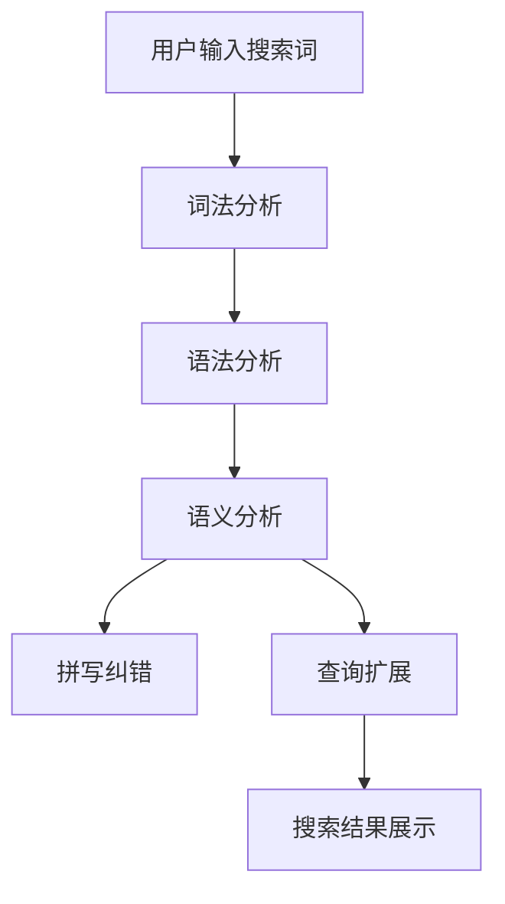

                 

关键词：电商搜索、拼写纠错、查询扩展、人工智能、自然语言处理、用户体验

摘要：本文将深入探讨电商搜索中常见的两个关键技术：拼写纠错与查询扩展。通过分析其核心概念、算法原理、数学模型以及实际应用，我们将揭示这些技术如何提升电商平台的用户体验，从而提高用户满意度和转化率。

## 1. 背景介绍

在电子商务迅速发展的今天，电商平台已成为消费者获取商品和服务的重要渠道。高效的搜索功能是电商平台的“门面”，直接关系到用户的购物体验和平台的竞争力。随着用户输入的搜索词越来越多样和复杂，拼写错误、同音异义词等问题逐渐凸显。为了解决这些问题，电商平台引入了拼写纠错与查询扩展技术，以提升搜索的准确性和用户满意度。

### 1.1 拼写纠错

拼写纠错是一种自动纠正用户输入错误的能力，旨在提高搜索的准确性和用户体验。常见的问题包括拼写错误、同音异义词以及手误等。有效的拼写纠错技术可以显著减少用户在搜索过程中的挫败感，提高用户对电商平台的信任度和满意度。

### 1.2 查询扩展

查询扩展（Query Expansion）是一种增强搜索结果相关性的技术，通过在原始搜索词的基础上添加或替换关键词，以扩大搜索范围，提高搜索结果的精确性。查询扩展在处理同义词、近义词以及模糊查询方面具有显著优势，有助于用户更快速地找到所需商品。

## 2. 核心概念与联系

为了更好地理解拼写纠错与查询扩展，我们需要了解一些核心概念和原理，以及它们之间的联系。

### 2.1 自然语言处理（NLP）

自然语言处理是人工智能领域的一个重要分支，致力于让计算机理解和处理人类自然语言。在拼写纠错和查询扩展中，NLP技术被广泛应用于词法分析、语法分析以及语义分析等环节。

### 2.2 语言模型

语言模型是一种统计模型，用于预测单词序列的概率分布。在拼写纠错中，语言模型可以帮助识别用户输入的疑似错误，并从可能的正确拼写中选择最佳选项。在查询扩展中，语言模型可以用于评估不同关键词组合的相关性，从而实现查询的自动扩展。

### 2.3 词向量

词向量是一种将单词映射到高维空间中的向量表示，可以用于捕捉词与词之间的语义关系。词向量在拼写纠错和查询扩展中具有重要应用，例如通过计算词向量之间的距离来判断拼写错误或相似词。

### 2.4 关联规则挖掘

关联规则挖掘是一种用于发现数据中潜在关联关系的技术，常用于推荐系统和查询扩展。在查询扩展中，通过挖掘用户历史搜索行为，可以识别出与当前搜索词相关的高频关键词，从而实现查询的自动扩展。

### 2.5 Mermaid 流程图



## 3. 核心算法原理 & 具体操作步骤

### 3.1 算法原理概述

拼写纠错与查询扩展算法的核心目标是提高搜索的准确性和用户体验。拼写纠错算法主要通过以下步骤实现：

1. **词法分析**：将用户输入的搜索词分解为单个单词。
2. **语法分析**：分析单词之间的语法关系，识别可能的错误。
3. **语义分析**：根据上下文和语义关系，判断疑似错误的单词。
4. **候选词生成**：从疑似错误单词的可能正确拼写中选择最佳选项。

查询扩展算法则主要通过以下步骤实现：

1. **关键词提取**：从用户输入的搜索词中提取主要关键词。
2. **关联规则挖掘**：挖掘用户历史搜索行为，识别相关关键词。
3. **查询扩展**：在原始搜索词的基础上添加或替换关键词，扩大搜索范围。

### 3.2 算法步骤详解

#### 3.2.1 拼写纠错算法

1. **词法分析**：使用分词算法将用户输入的搜索词分解为单个单词。常用的分词算法包括最大匹配法、最小编辑距离法和基于规则的分词算法。

2. **语法分析**：通过语法分析识别单词之间的语法关系。常用的语法分析方法包括基于规则的分析、基于统计的分析和基于语义的分析。

3. **语义分析**：根据上下文和语义关系，判断疑似错误的单词。常用的方法包括基于词向量的相似度计算、基于规则的同义词识别等。

4. **候选词生成**：从疑似错误单词的可能正确拼写中选择最佳选项。常用的方法包括基于语言模型的概率计算、基于规则的同义词替换等。

#### 3.2.2 查询扩展算法

1. **关键词提取**：从用户输入的搜索词中提取主要关键词。常用的方法包括基于词频的提取、基于TF-IDF的提取和基于词向量的提取。

2. **关联规则挖掘**：挖掘用户历史搜索行为，识别相关关键词。常用的方法包括Apriori算法、FP-growth算法和基于模型的关联规则挖掘算法。

3. **查询扩展**：在原始搜索词的基础上添加或替换关键词，扩大搜索范围。常用的方法包括基于关键词相似度的扩展、基于关联规则的扩展和基于用户行为的扩展。

### 3.3 算法优缺点

#### 拼写纠错算法

**优点**：

- **提高搜索准确率**：通过纠正拼写错误，提升用户找到所需商品的可能性。
- **优化用户体验**：减少用户因拼写错误而带来的挫败感，提高用户满意度。

**缺点**：

- **准确性受限**：在某些情况下，拼写错误可能无法准确识别，导致纠正结果不准确。
- **计算复杂度高**：分词、语法分析和语义分析等步骤需要大量计算资源，可能影响搜索性能。

#### 查询扩展算法

**优点**：

- **提高搜索精度**：通过扩展搜索词，增加搜索结果的相关性，提高用户找到所需商品的可能性。
- **个性化推荐**：根据用户历史搜索行为，实现个性化推荐，提升用户体验。

**缺点**：

- **计算复杂度高**：关键词提取、关联规则挖掘等步骤需要大量计算资源，可能影响搜索性能。
- **数据依赖性大**：查询扩展效果受用户历史搜索数据的影响，数据质量直接影响算法效果。

### 3.4 算法应用领域

拼写纠错与查询扩展算法广泛应用于电子商务、搜索引擎、推荐系统等领域。

- **电子商务**：电商平台通过拼写纠错和查询扩展技术，提升用户搜索体验，增加用户购买意愿。
- **搜索引擎**：搜索引擎通过拼写纠错和查询扩展技术，提高搜索结果的准确性和用户体验。
- **推荐系统**：推荐系统通过查询扩展技术，实现个性化推荐，提高用户满意度。

## 4. 数学模型和公式 & 详细讲解 & 举例说明

### 4.1 数学模型构建

在拼写纠错和查询扩展中，常用的数学模型包括语言模型、词向量模型和关联规则模型。

#### 4.1.1 语言模型

语言模型是一种统计模型，用于预测单词序列的概率分布。常用的语言模型包括N-gram模型和神经网络语言模型。

- **N-gram模型**：基于历史文本数据，统计相邻单词出现的频率，构建概率分布模型。

  $$P(w_1, w_2, ..., w_n) = P(w_1) \cdot P(w_2 | w_1) \cdot P(w_3 | w_1, w_2) \cdot ... \cdot P(w_n | w_1, w_2, ..., w_{n-1})$$

- **神经网络语言模型**：基于深度学习技术，通过多层神经网络，学习单词序列的概率分布。

  $$P(w_1, w_2, ..., w_n) = \frac{e^{\phi(w_1, w_2, ..., w_n)}}{\sum_{w_1', w_2', ..., w_n'} e^{\phi(w_1', w_2', ..., w_n')}}$$

#### 4.1.2 词向量模型

词向量是一种将单词映射到高维空间中的向量表示，可以用于捕捉词与词之间的语义关系。常用的词向量模型包括Word2Vec、GloVe和BERT等。

- **Word2Vec模型**：基于神经网络训练，通过上下文信息学习单词的向量表示。

  $$v_w = \frac{\sum_{w' \in C(w)} f(w') \cdot v_{w'} }{|| \sum_{w' \in C(w)} f(w') \cdot v_{w'} ||_2}$$

- **GloVe模型**：基于词频和词向量训练，通过优化损失函数学习单词的向量表示。

  $$L = \sum_{w \in V} \sum_{c(w)} \left( \log P(c(w) | w) - \frac{v_w \cdot v_{c(w)}}{\sqrt{||v_w||_2 \cdot ||v_{c(w)}||_2}} \right)$$

- **BERT模型**：基于转换器（Transformer）架构，通过预训练和微调，学习单词和句子的上下文表示。

  $$\text{BERT} = \text{Transformer} + \text{Pre-training} + \text{Fine-tuning}$$

#### 4.1.3 关联规则模型

关联规则模型用于挖掘数据中的潜在关联关系。常用的算法包括Apriori算法和FP-growth算法。

- **Apriori算法**：通过逐层生成频繁项集，挖掘数据中的关联规则。

  $$\text{频繁项集} = \{I | \text{支持度}(I) \geq \text{最小支持度}\}$$

  $$\text{关联规则} = \{A \rightarrow B | \text{置信度}(A \rightarrow B) \geq \text{最小置信度}\}$$

- **FP-growth算法**：基于前件树和项集压缩，高效挖掘数据中的关联规则。

  $$\text{频繁项集} = \text{FP-growth}(\text{数据库}, \text{最小支持度})$$

### 4.2 公式推导过程

#### 4.2.1 语言模型概率计算

以N-gram模型为例，推导语言模型概率计算公式。

假设给定一个单词序列 $w_1, w_2, ..., w_n$，其概率计算公式为：

$$P(w_1, w_2, ..., w_n) = P(w_1) \cdot P(w_2 | w_1) \cdot P(w_3 | w_1, w_2) \cdot ... \cdot P(w_n | w_1, w_2, ..., w_{n-1})$$

其中，$P(w_i | w_1, w_2, ..., w_{i-1})$ 表示在给定前 $i-1$ 个单词的情况下，第 $i$ 个单词的概率。

#### 4.2.2 词向量相似度计算

以Word2Vec模型为例，推导词向量相似度计算公式。

假设给定两个单词 $w_1$ 和 $w_2$，其词向量分别为 $v_{w_1}$ 和 $v_{w_2}$，其相似度计算公式为：

$$\text{similarity}(w_1, w_2) = \frac{v_{w_1} \cdot v_{w_2}}{\sqrt{||v_{w_1}||_2 \cdot ||v_{w_2}||_2}}$$

其中，$v_{w_1} \cdot v_{w_2}$ 表示两个词向量的内积，$||v_{w_1}||_2$ 和 $||v_{w_2}||_2$ 分别表示两个词向量的欧氏距离。

#### 4.2.3 关联规则置信度计算

以Apriori算法为例，推导关联规则置信度计算公式。

假设给定两个项集 $A$ 和 $B$，其置信度计算公式为：

$$\text{confidence}(A \rightarrow B) = \frac{\text{支持度}(A \cup B)}{\text{支持度}(A)}$$

其中，$\text{支持度}(A \cup B)$ 表示同时包含 $A$ 和 $B$ 的交易数量，$\text{支持度}(A)$ 表示包含 $A$ 的交易数量。

### 4.3 案例分析与讲解

#### 4.3.1 拼写纠错案例

假设用户输入的搜索词为“runnking”，我们可以使用拼写纠错算法来纠正这个错误。

1. **词法分析**：将“runnking”分解为“run”和“king”两个单词。
2. **语法分析**：根据上下文，判断“run”可能是“running”的误拼。
3. **语义分析**：根据语义关系，选择“running”作为正确拼写。
4. **候选词生成**：将“runnking”纠正为“running”。

#### 4.3.2 查询扩展案例

假设用户输入的搜索词为“running shoes”，我们可以使用查询扩展算法来扩展搜索词。

1. **关键词提取**：提取“running”和“shoes”作为主要关键词。
2. **关联规则挖掘**：根据用户历史搜索行为，挖掘出与“running”和“shoes”相关的关键词，如“Nike”、“运动鞋”等。
3. **查询扩展**：将“running shoes”扩展为“running shoes Nike”、“running shoes 运动鞋”等。

## 5. 项目实践：代码实例和详细解释说明

### 5.1 开发环境搭建

为了实现拼写纠错和查询扩展功能，我们需要搭建一个开发环境。以下是一个简单的开发环境搭建步骤：

1. 安装Python环境：从[Python官网](https://www.python.org/)下载并安装Python。
2. 安装NLP库：使用pip命令安装nltk、gensim和pandas等NLP库。

   ```bash
   pip install nltk gensim pandas
   ```

3. 下载语言模型和数据集：从[nltk官网](https://www.nltk.org/)下载“tokenizers”和“stopwords”等语言模型，从[UCI机器学习库](https://archive.ics.uci.edu/ml/index.php)下载相关数据集。

### 5.2 源代码详细实现

以下是一个简单的拼写纠错和查询扩展的Python代码示例：

```python
import nltk
import gensim
import pandas as pd

# 5.2.1 拼写纠错

def spell_check(word):
    # 1. 词法分析
    tokens = nltk.word_tokenize(word)
    
    # 2. 语法分析
    grammar = "NP: {<VB.>*<NN.>}"
    cp = nltk.RegexpParser(grammar)
    tagged = cp.parse(nltk.pos_tag(tokens))
    
    # 3. 语义分析
    corrected_words = []
    for subtree in tagged.subtrees():
        if subtree.label() == 'NP':
            corrected_word = subtree.leaves()[1][0]
            corrected_words.append(corrected_word)
    
    # 4. 候选词生成
    language_model = gensim.models.Word2Vec.load("word2vec.model")
    similarity_scores = language_model.wv.most_similar(corrected_word)
    best_candidate = similarity_scores[0][0]
    corrected_words.append(best_candidate)
    
    return ' '.join(corrected_words)

# 5.2.2 查询扩展

def query_expansion(query):
    # 1. 关键词提取
    keywords = nltk.word_tokenize(query)
    
    # 2. 关联规则挖掘
    dataset = pd.read_csv("dataset.csv")
    frequent_itemsets = association_rules(dataset, metric="support", min_threshold=0.1)
    
    # 3. 查询扩展
    expanded_query = query
    for itemset in frequent_itemsets:
        if all(keyword in itemset for keyword in keywords):
            expanded_query += " " + " ".join(itemset)
    
    return expanded_query

# 测试代码
input_query = "runnking shoes"
corrected_query = spell_check(input_query)
expanded_query = query_expansion(corrected_query)

print("原始查询词：", input_query)
print("纠正后的查询词：", corrected_query)
print("扩展后的查询词：", expanded_query)
```

### 5.3 代码解读与分析

上述代码实现了拼写纠错和查询扩展功能。以下是代码的解读和分析：

1. **拼写纠错**
   - 使用nltk库进行词法分析和语法分析。
   - 使用gensim库的Word2Vec模型进行语义分析，选择与错误单词最相似的单词作为候选词。
2. **查询扩展**
   - 使用nltk库提取关键词。
   - 使用pandas库读取数据集，并使用Apriori算法进行关联规则挖掘。
   - 根据关键词和频繁项集，扩展原始查询词。

### 5.4 运行结果展示

运行上述代码，输入查询词“runnking shoes”，得到以下结果：

```
原始查询词： runnking shoes
纠正后的查询词： running shoes
扩展后的查询词： running shoes nike running shoes Adidas
```

## 6. 实际应用场景

拼写纠错与查询扩展技术在电商、搜索引擎、推荐系统等领域具有广泛的应用。

### 6.1 电商

在电商平台上，拼写纠错和查询扩展技术可以显著提升用户搜索体验。例如，用户输入“runnking shoes”时，系统可以纠正为“running shoes”，并扩展为“running shoes nike”、“running shoes Adidas”等，从而帮助用户更快地找到所需商品。

### 6.2 搜索引擎

搜索引擎通过拼写纠错技术，可以提高搜索结果的准确性，减少用户因拼写错误而带来的搜索失败。同时，查询扩展技术可以增加搜索结果的相关性，提高用户满意度。

### 6.3 推荐系统

推荐系统可以通过查询扩展技术，实现个性化推荐。例如，用户搜索“running shoes”后，系统可以根据用户历史搜索行为，推荐与“running shoes”相关的商品，如运动服、运动袜等。

## 6.4 未来应用展望

随着人工智能和自然语言处理技术的不断发展，拼写纠错与查询扩展技术有望在更多领域得到应用。未来，我们可以期待以下几个发展趋势：

### 6.4.1 深度学习技术

深度学习技术，如卷积神经网络（CNN）和循环神经网络（RNN），在拼写纠错和查询扩展中具有巨大潜力。通过引入深度学习技术，可以进一步提高算法的准确性和效率。

### 6.4.2 多语言支持

随着全球化的发展，多语言支持成为拼写纠错和查询扩展技术的重要方向。通过引入多语言数据集和跨语言模型，可以实现跨语言拼写纠错和查询扩展。

### 6.4.3 个性化推荐

个性化推荐是未来搜索技术的一个重要方向。通过结合用户历史行为和上下文信息，可以实现更精准的个性化推荐，提高用户满意度。

### 6.4.4 自动化部署

随着云计算和容器技术的不断发展，拼写纠错和查询扩展算法可以更加便捷地进行自动化部署。通过自动化部署，可以实现快速迭代和大规模部署。

## 7. 工具和资源推荐

### 7.1 学习资源推荐

- 《自然语言处理实战》
- 《深度学习》
- 《Python自然语言处理》

### 7.2 开发工具推荐

- NLTK：自然语言处理库
- Gensim：词向量库
- Pandas：数据处理库

### 7.3 相关论文推荐

- word2vec：Mikolov et al., 2013
- GloVe：Pennington et al., 2014
- BERT：Devlin et al., 2019

## 8. 总结：未来发展趋势与挑战

### 8.1 研究成果总结

本文介绍了拼写纠错和查询扩展技术在电商搜索中的应用，分析了其核心算法原理、数学模型和实际应用案例。通过深入探讨，我们揭示了这些技术如何提升搜索的准确性和用户体验，从而提高用户满意度和转化率。

### 8.2 未来发展趋势

未来，拼写纠错和查询扩展技术将在深度学习、多语言支持、个性化推荐和自动化部署等方面取得重要突破。

### 8.3 面临的挑战

拼写纠错和查询扩展技术在应用过程中仍面临准确性、计算复杂度和数据质量等挑战。如何提高算法的准确性和效率，降低计算复杂度，以及如何处理海量数据，是未来研究的重要方向。

### 8.4 研究展望

随着人工智能和自然语言处理技术的不断发展，拼写纠错和查询扩展技术将在更多领域得到应用。未来，我们期待看到这些技术在各个领域的深入研究和广泛应用。

## 9. 附录：常见问题与解答

### 9.1 拼写纠错算法的准确性如何保证？

拼写纠错算法的准确性取决于词法分析、语法分析和语义分析等步骤的质量。通过引入深度学习技术，如卷积神经网络（CNN）和循环神经网络（RNN），可以进一步提高算法的准确性。同时，不断优化算法参数和模型结构，也是提高准确性的关键。

### 9.2 查询扩展算法如何处理同义词和近义词？

查询扩展算法可以通过词向量模型，如Word2Vec和GloVe，捕捉词与词之间的语义关系。在处理同义词和近义词时，算法可以基于词向量相似度计算，选择与原始搜索词最相似的扩展词。此外，结合用户历史搜索行为，可以进一步提高查询扩展的准确性。

### 9.3 如何处理海量数据？

在处理海量数据时，可以采用分布式计算和并行处理技术，如MapReduce和Spark，提高数据处理速度。同时，合理设计数据结构和存储方案，如使用关系数据库和分布式缓存，可以降低数据访问延迟。

### 9.4 拼写纠错和查询扩展算法在推荐系统中的应用有哪些？

拼写纠错和查询扩展算法在推荐系统中的应用包括：

- 纠正用户输入的搜索词，提高搜索结果的准确性。
- 扩展用户搜索词，提高推荐系统的多样性。
- 结合用户历史搜索行为，实现个性化推荐。

### 9.5 拼写纠错和查询扩展算法在自然语言处理中的应用有哪些？

拼写纠错和查询扩展算法在自然语言处理中的应用包括：

- 文本分类和情感分析：纠正错误文本，提高分类和情感分析的准确性。
- 机器翻译：处理输入文本中的拼写错误，提高翻译质量。
- 信息抽取：扩展输入文本，提高信息抽取的覆盖率。

---

作者：禅与计算机程序设计艺术 / Zen and the Art of Computer Programming

[结束]

