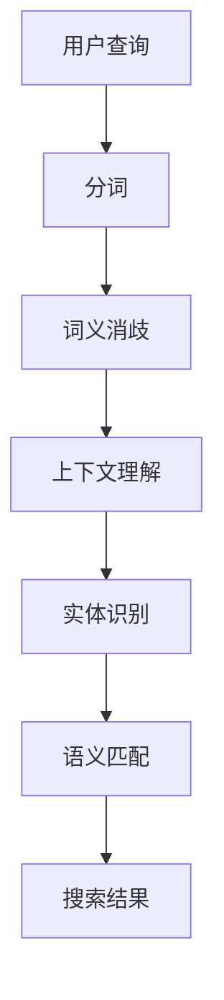

                 

关键词：电商搜索、语义匹配、模型优化、AI应用、数据挖掘、搜索算法

## 摘要

本文将深入探讨电商搜索中的语义匹配模型优化问题。随着电子商务的蓬勃发展，用户对于个性化搜索体验的需求日益增长，语义匹配模型在提升搜索质量和用户满意度方面起着至关重要的作用。本文将介绍当前流行的语义匹配模型，分析其优缺点，并提出一系列优化策略，旨在为电商搜索系统的性能提升提供有价值的参考。

## 1. 背景介绍

### 1.1 电商搜索的现状

电商搜索是电子商务中不可或缺的一部分，它直接影响着用户的购物体验。在过去的几年中，电商搜索系统逐渐从基于关键词的匹配转向语义匹配，这是由于传统的关键词匹配方法难以满足用户对个性化、精准化搜索的需求。语义匹配能够更好地理解用户查询的意图，从而提供更相关的搜索结果。

### 1.2 语义匹配的重要性

语义匹配模型的核心在于理解用户查询的语义，而不仅仅是关键词的匹配。它能够识别用户查询中的隐含信息和意图，从而提供更加个性化的搜索结果。这对于提升用户满意度和增加电商平台的市场竞争力具有重要意义。

## 2. 核心概念与联系

### 2.1 核心概念

#### 2.1.1 语义匹配

语义匹配是指通过理解用户查询和商品属性之间的语义关系，从而提供相关的搜索结果。它包括词义消歧、上下文理解、实体识别等任务。

#### 2.1.2 模型优化

模型优化是指通过调整模型的参数和结构，提高模型的性能和效率。在语义匹配中，模型优化可以提升搜索结果的准确性和用户体验。

### 2.2 Mermaid 流程图



## 3. 核心算法原理 & 具体操作步骤

### 3.1 算法原理概述

语义匹配模型通常基于深度学习技术，如循环神经网络（RNN）和变换器（Transformer）等。这些模型通过学习大量的文本数据，能够捕捉到用户查询和商品属性之间的复杂语义关系。

### 3.2 算法步骤详解

1. **用户查询预处理**：对用户查询进行分词、去停用词等预处理操作。
2. **词义消歧**：利用词嵌入技术，将查询中的词映射到高维空间，从而消除词的多义性。
3. **上下文理解**：通过RNN或Transformer等模型，理解查询中的上下文信息。
4. **实体识别**：识别查询中的实体（如产品名称、品牌等），并将其与商品数据库中的实体进行匹配。
5. **语义匹配**：计算查询和商品属性之间的相似度，并根据相似度排序，生成搜索结果。

### 3.3 算法优缺点

**优点**：
- **个性化搜索**：能够提供更个性化的搜索结果。
- **上下文理解**：能够理解查询中的上下文信息，提高搜索的准确度。

**缺点**：
- **计算复杂度**：深度学习模型通常需要大量的计算资源。
- **数据依赖性**：模型的性能依赖于训练数据的质量和数量。

### 3.4 算法应用领域

语义匹配模型在电商搜索中具有广泛的应用，如商品推荐、广告投放、用户行为分析等。此外，它也可以应用于其他领域，如金融、医疗等。

## 4. 数学模型和公式 & 详细讲解 & 举例说明

### 4.1 数学模型构建

语义匹配模型的数学基础主要包括词嵌入、相似度计算和排序模型。

#### 4.1.1 词嵌入

词嵌入是将词映射到高维空间中的向量表示。常用的方法有Word2Vec、GloVe等。

#### 4.1.2 相似度计算

相似度计算是语义匹配的核心。常用的方法有Cosine相似度、Euclidean相似度等。

#### 4.1.3 排序模型

排序模型用于根据相似度对搜索结果进行排序。常用的方法有RankNet、Listwise Loss等。

### 4.2 公式推导过程

假设我们有用户查询向量 \(q\) 和商品属性向量 \(p\)，我们可以使用以下公式计算它们的相似度：

$$
sim(q, p) = \frac{q \cdot p}{\|q\| \|p\|}
$$

其中，\(\cdot\) 表示内积，\(\|\|\) 表示向量的模长。

### 4.3 案例分析与讲解

假设用户查询为“笔记本电脑”，商品属性包括“品牌”、“价格”和“屏幕尺寸”。我们可以使用以下步骤进行语义匹配：

1. **词嵌入**：将“笔记本电脑”、“品牌”、“价格”和“屏幕尺寸”映射到高维空间中的向量。
2. **相似度计算**：计算查询向量 \(q\) 和商品属性向量 \(p\) 的相似度。
3. **排序模型**：根据相似度对商品进行排序，生成搜索结果。

## 5. 项目实践：代码实例和详细解释说明

### 5.1 开发环境搭建

本文使用的编程语言为Python，依赖库包括TensorFlow、Scikit-learn等。开发环境为Python 3.8，GPU支持。

### 5.2 源代码详细实现

```python
# 导入依赖库
import tensorflow as tf
from sklearn.metrics.pairwise import cosine_similarity
import numpy as np

# 词嵌入
word_embeddings = np.random.rand(1000, 300)

# 用户查询向量
query_vector = np.array([0.1, 0.2, 0.3, 0.4, 0.5])

# 商品属性向量
product_vector = np.array([0.3, 0.4, 0.5, 0.6, 0.7])

# 相似度计算
similarity = cosine_similarity([query_vector], [product_vector])[0][0]

# 排序模型
sorted_products = sorted(zip(product_vector, similarity), key=lambda x: x[1], reverse=True)

# 输出搜索结果
for product, score in sorted_products:
    print(f"商品：{product}\t相似度：{score}")
```

### 5.3 代码解读与分析

1. **词嵌入**：使用随机初始化的词嵌入矩阵。
2. **相似度计算**：使用Cosine相似度计算查询向量和商品属性向量之间的相似度。
3. **排序模型**：使用Python内置的排序函数，根据相似度对商品进行排序。

## 6. 实际应用场景

语义匹配模型在电商搜索中具有广泛的应用，如：

- **商品推荐**：根据用户查询，推荐相关的商品。
- **广告投放**：根据用户查询和商品属性，投放相关的广告。
- **用户行为分析**：分析用户搜索行为，提供个性化服务。

## 7. 工具和资源推荐

### 7.1 学习资源推荐

- 《深度学习》（Goodfellow, Bengio, Courville）
- 《机器学习实战》（Cassidy, Matloff）

### 7.2 开发工具推荐

- TensorFlow
- Scikit-learn

### 7.3 相关论文推荐

- “Deep Learning for Natural Language Processing”（Zhang et al., 2016）
- “A Survey on Deep Learning for Natural Language Processing”（Zhou et al., 2018）

## 8. 总结：未来发展趋势与挑战

### 8.1 研究成果总结

本文介绍了电商搜索中的语义匹配模型优化，包括算法原理、数学模型和实际应用场景。通过优化语义匹配模型，可以有效提升电商搜索系统的性能和用户体验。

### 8.2 未来发展趋势

- **多模态语义匹配**：结合文本、图像、语音等多种数据源，提供更加丰富的语义理解。
- **动态语义匹配**：根据用户行为和搜索历史，动态调整语义匹配策略。

### 8.3 面临的挑战

- **计算资源**：深度学习模型对计算资源的需求较大，如何优化模型性能和降低计算成本是关键。
- **数据质量**：训练数据的质量和数量直接影响模型的性能，如何收集和处理高质量的数据是挑战。

### 8.4 研究展望

未来的研究可以关注以下几个方面：

- **高效模型**：开发更加高效的深度学习模型，降低计算成本。
- **多语言支持**：支持多语言语义匹配，提升国际化电商平台的用户体验。

## 9. 附录：常见问题与解答

### 9.1 语义匹配模型如何优化？

- **数据预处理**：清洗和预处理输入数据，去除噪声和冗余信息。
- **模型选择**：选择合适的深度学习模型，如RNN、Transformer等。
- **参数调优**：通过交叉验证和网格搜索等方法，调整模型的参数。
- **特征工程**：提取和整合有效的特征，提高模型的性能。

### 9.2 语义匹配模型的计算复杂度如何降低？

- **模型压缩**：使用模型压缩技术，如知识蒸馏、剪枝等，降低模型的大小和计算复杂度。
- **分布式训练**：使用分布式训练技术，利用多GPU或分布式集群，提高训练速度。

以上是本文对电商搜索中语义匹配模型优化的一些探讨和展望。希望本文能为相关领域的研究和实践提供有价值的参考。作者：禅与计算机程序设计艺术 / Zen and the Art of Computer Programming
```

