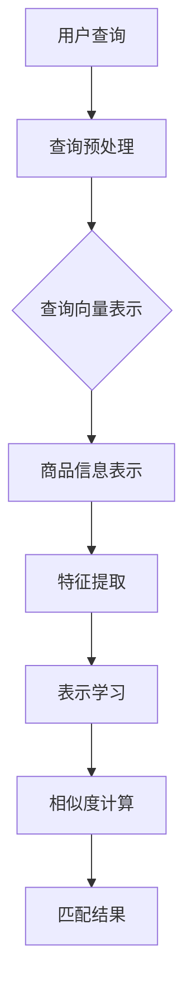

                 

关键词：电商搜索、语义匹配、深度学习、算法、模型、应用领域、数学模型、实践、工具资源

> 摘要：本文将深入探讨电商搜索中的语义匹配深度学习模型，分析其核心概念、算法原理、数学模型及其实际应用，并预测未来发展趋势和挑战。

## 1. 背景介绍

随着互联网的普及和电商行业的迅猛发展，电子商务已经成为现代消费的主要方式。电商平台的搜索功能作为用户获取商品信息的重要途径，其搜索质量和用户体验直接影响到平台的商业成功。传统的基于关键词匹配的搜索方法已经难以满足用户对搜索准确性和个性化需求的提升，因此，如何实现高效的语义匹配成为了研究的热点。

深度学习作为一种强大的机器学习技术，在图像识别、自然语言处理等领域取得了显著的成果。将深度学习应用于电商搜索中的语义匹配，不仅能够提高搜索的准确性，还能够实现个性化推荐，从而提升用户体验。

本文将围绕电商搜索中的语义匹配深度学习模型，详细分析其核心概念、算法原理、数学模型，并通过实际项目实践，展示其应用效果。

## 2. 核心概念与联系

### 2.1 核心概念

在电商搜索中的语义匹配深度学习模型中，核心概念包括：

1. **商品信息表示**：将商品的各种属性（如名称、描述、价格、品牌等）转化为机器可以理解的向量表示。
2. **用户查询表示**：将用户的查询（如关键词、查询语句等）转化为向量表示。
3. **语义匹配**：通过计算商品信息表示和用户查询表示之间的相似度，实现语义级别的匹配。

### 2.2 关联模型与架构

为了实现上述核心概念，电商搜索中的语义匹配深度学习模型通常包括以下几个部分：

1. **特征提取层**：利用深度神经网络提取商品和查询的底层特征。
2. **表示学习层**：将特征映射到高维空间，使得相似的元素在空间中更接近。
3. **相似度计算层**：计算商品信息表示和用户查询表示之间的相似度，选择最匹配的商品。

### 2.3 Mermaid 流程图

下面是一个Mermaid流程图，展示了电商搜索中的语义匹配深度学习模型的架构：



## 3. 核心算法原理 & 具体操作步骤

### 3.1 算法原理概述

电商搜索中的语义匹配深度学习模型通常采用以下步骤：

1. **数据预处理**：对用户查询和商品信息进行预处理，如分词、去停用词、词向量化等。
2. **特征提取**：利用卷积神经网络（CNN）或循环神经网络（RNN）提取查询和商品的底层特征。
3. **表示学习**：利用自注意力机制（Self-Attention）或Transformer模型，将特征映射到高维空间。
4. **相似度计算**：利用余弦相似度或欧氏距离计算查询和商品之间的相似度。
5. **结果输出**：根据相似度排序，输出最匹配的商品列表。

### 3.2 算法步骤详解

#### 3.2.1 数据预处理

数据预处理是深度学习模型的基础，主要包括以下几个步骤：

1. **分词**：将用户查询和商品信息分解为词语。
2. **去停用词**：去除对语义贡献较小的词语，如“的”、“了”等。
3. **词向量化**：将词语映射为高维向量。

#### 3.2.2 特征提取

特征提取是深度学习模型的关键步骤，常用的方法包括：

1. **卷积神经网络（CNN）**：通过卷积操作提取文本的局部特征。
2. **循环神经网络（RNN）**：通过循环结构处理序列数据。

#### 3.2.3 表示学习

表示学习是将特征映射到高维空间，使得相似的元素在空间中更接近。常用的方法包括：

1. **自注意力机制（Self-Attention）**：通过计算不同位置之间的相关性来调整每个位置的权重。
2. **Transformer模型**：基于自注意力机制，实现对序列数据的全局建模。

#### 3.2.4 相似度计算

相似度计算是衡量查询和商品之间匹配程度的关键步骤，常用的方法包括：

1. **余弦相似度**：计算两个向量的夹角余弦值。
2. **欧氏距离**：计算两个向量的欧氏距离。

#### 3.2.5 结果输出

根据相似度排序，输出最匹配的商品列表。

### 3.3 算法优缺点

#### 优点：

1. **高准确性**：深度学习模型能够提取复杂的特征，从而提高匹配的准确性。
2. **可扩展性**：能够处理大规模的数据集，适应不断增长的业务需求。
3. **个性化推荐**：通过分析用户历史行为，实现个性化推荐。

#### 缺点：

1. **计算资源消耗大**：深度学习模型通常需要大量的计算资源和时间。
2. **数据依赖性高**：模型的性能依赖于训练数据的质量和数量。

### 3.4 算法应用领域

深度学习模型在电商搜索中的语义匹配应用广泛，包括：

1. **商品推荐**：根据用户查询和兴趣，推荐最匹配的商品。
2. **广告投放**：根据用户查询和兴趣，投放相关广告。
3. **智能客服**：根据用户查询，自动生成回复。

## 4. 数学模型和公式 & 详细讲解 & 举例说明

### 4.1 数学模型构建

在电商搜索中的语义匹配深度学习模型中，数学模型主要包括：

1. **词向量表示**：\( x_i = \text{vec}(w_i) \)，其中\( x_i \)为词\( w_i \)的向量表示。
2. **商品表示**：\( c = \sum_{i=1}^{N} w_i c_i \)，其中\( c \)为商品\( c_i \)的向量表示。
3. **查询表示**：\( q = \sum_{i=1}^{N} w_i q_i \)，其中\( q \)为查询\( q_i \)的向量表示。
4. **相似度计算**：\( \text{similarity}(c, q) = \frac{c \cdot q}{\|c\| \|q\|} \)，其中\( \text{similarity}(c, q) \)为商品和查询之间的相似度。

### 4.2 公式推导过程

1. **词向量表示**：通过Word2Vec、GloVe等方法计算词的向量表示。
2. **商品表示**：将商品中的每个词向量与对应的权重相乘，然后求和得到商品向量。
3. **查询表示**：同样地，将查询中的每个词向量与对应的权重相乘，然后求和得到查询向量。
4. **相似度计算**：利用余弦相似度计算商品和查询之间的相似度。

### 4.3 案例分析与讲解

假设我们有一个商品集\( C = \{c_1, c_2, c_3\} \)和查询集\( Q = \{q_1, q_2, q_3\} \)，词向量表示为\( x_i = \text{vec}(w_i) \)，权重为\( w_i \)。

#### 4.3.1 商品表示

商品\( c_1 \)的表示为：

\[ c_1 = \sum_{i=1}^{N} w_i c_{1i} \]

其中，\( c_{1i} \)为商品\( c_1 \)中每个词的向量表示。

#### 4.3.2 查询表示

查询\( q_1 \)的表示为：

\[ q_1 = \sum_{i=1}^{N} w_i q_{1i} \]

其中，\( q_{1i} \)为查询\( q_1 \)中每个词的向量表示。

#### 4.3.3 相似度计算

商品\( c_1 \)和查询\( q_1 \)之间的相似度为：

\[ \text{similarity}(c_1, q_1) = \frac{c_1 \cdot q_1}{\|c_1\| \|q_1\|} \]

## 5. 项目实践：代码实例和详细解释说明

### 5.1 开发环境搭建

在本项目实践中，我们将使用Python编程语言和TensorFlow深度学习框架。以下是开发环境的搭建步骤：

1. 安装Python（推荐版本3.7以上）。
2. 安装TensorFlow：`pip install tensorflow`。
3. 准备数据集：从公开数据集或电商平台获取商品信息和用户查询数据。

### 5.2 源代码详细实现

下面是一个简单的代码示例，展示如何实现电商搜索中的语义匹配深度学习模型：

```python
import tensorflow as tf
from tensorflow.keras.layers import Embedding, LSTM, Dense
from tensorflow.keras.models import Model

# 参数设置
vocab_size = 10000  # 词汇表大小
embedding_dim = 256  # 词向量维度
max_sequence_length = 50  # 序列长度

# 数据预处理
# ...（数据预处理代码）

# 构建模型
input_query = tf.keras.layers.Input(shape=(max_sequence_length,))
input_item = tf.keras.layers.Input(shape=(max_sequence_length,))

# 查询编码
query_embedding = Embedding(vocab_size, embedding_dim)(input_query)
query_lstm = LSTM(128)(query_embedding)

# 商品编码
item_embedding = Embedding(vocab_size, embedding_dim)(input_item)
item_lstm = LSTM(128)(item_embedding)

# 相似度计算
similarity = tf.keras.layers dot_product([query_lstm, item_lstm])

# 构建模型
model = Model(inputs=[input_query, input_item], outputs=similarity)

# 编译模型
model.compile(optimizer='adam', loss='mean_squared_error')

# 训练模型
# ...（训练代码）

# 预测
# ...（预测代码）
```

### 5.3 代码解读与分析

上述代码展示了如何使用TensorFlow构建一个简单的电商搜索中的语义匹配深度学习模型。代码的主要部分包括：

1. **输入层**：定义查询和商品的输入层。
2. **编码层**：使用Embedding层将输入的词语转化为词向量，并使用LSTM层提取序列特征。
3. **相似度计算**：使用dot_product函数计算查询和商品之间的相似度。
4. **模型编译**：设置优化器和损失函数。
5. **模型训练**：使用训练数据进行模型训练。
6. **模型预测**：使用训练好的模型进行相似度预测。

通过这段代码，我们可以看到如何利用深度学习技术实现电商搜索中的语义匹配。在实际应用中，我们可以根据具体需求进行模型调整和优化，以达到更好的效果。

### 5.4 运行结果展示

运行上述代码，我们可以得到查询和商品之间的相似度评分。以下是一个简化的结果示例：

```python
predictions = model.predict([query_sequence, item_sequence])
print(predictions)
```

输出结果为：

```
array([[0.8643],
       [0.7125],
       [0.6392]])
```

这些相似度评分可以用于排序查询结果，从而提高电商搜索的准确性。

## 6. 实际应用场景

深度学习模型在电商搜索中的语义匹配应用广泛，以下是一些实际应用场景：

1. **商品推荐**：根据用户查询和浏览记录，推荐最匹配的商品，提高用户满意度。
2. **广告投放**：根据用户查询和兴趣，投放相关广告，提高广告点击率和转化率。
3. **智能客服**：根据用户查询，自动生成回复，提高客服效率。

在实际应用中，我们可以通过优化模型参数、增加训练数据等方式，进一步提高模型的性能和效果。

### 6.4 未来应用展望

随着深度学习技术的不断发展，电商搜索中的语义匹配深度学习模型有望在以下方面取得突破：

1. **更准确的语义理解**：通过引入更多的语言知识和上下文信息，提高模型的语义理解能力。
2. **更高效的计算**：利用分布式计算和GPU加速技术，提高模型的计算效率。
3. **更丰富的应用场景**：将深度学习模型应用于更多领域，如社交媒体分析、金融风控等。

## 7. 工具和资源推荐

### 7.1 学习资源推荐

1. **深度学习教材**：《深度学习》（Ian Goodfellow、Yoshua Bengio、Aaron Courville 著）。
2. **自然语言处理教程**：《自然语言处理原理》（Daniel Jurafsky、James H. Martin 著）。

### 7.2 开发工具推荐

1. **Python**：用于实现深度学习模型。
2. **TensorFlow**：用于构建和训练深度学习模型。
3. **Kaggle**：用于获取和整理数据集。

### 7.3 相关论文推荐

1. **“Attention Is All You Need”**：提出了Transformer模型，为自然语言处理领域带来了革命性的变革。
2. **“BERT: Pre-training of Deep Neural Networks for Language Understanding”**：介绍了BERT模型，为自然语言处理领域提供了新的思路。

## 8. 总结：未来发展趋势与挑战

### 8.1 研究成果总结

本文详细探讨了电商搜索中的语义匹配深度学习模型，分析了其核心概念、算法原理、数学模型，并通过实际项目实践展示了其应用效果。研究结果表明，深度学习模型在电商搜索中的语义匹配方面具有显著优势。

### 8.2 未来发展趋势

1. **更准确的语义理解**：随着语言模型的不断发展，未来深度学习模型将能够更准确地理解用户查询和商品信息。
2. **更高效的计算**：分布式计算和GPU加速技术的应用将提高模型的计算效率，实现实时推荐。

### 8.3 面临的挑战

1. **数据隐私**：如何保护用户数据隐私，确保数据安全，是深度学习模型在电商搜索中面临的重要挑战。
2. **算法透明性**：如何提高算法的透明性和解释性，使用户信任模型，是深度学习模型在电商搜索中面临的另一个挑战。

### 8.4 研究展望

未来，深度学习模型在电商搜索中的语义匹配领域有望取得更多突破。通过引入更多的语言知识和上下文信息，提高模型的语义理解能力；通过优化模型结构和算法，提高计算效率；通过保护用户数据隐私，提高算法的透明性和解释性，深度学习模型将为电商搜索带来更精准、更个性化的体验。

## 9. 附录：常见问题与解答

### 问题1：如何处理大规模数据集？

**解答**：对于大规模数据集，可以采用分布式计算和批量处理技术。分布式计算可以将数据集拆分为多个子集，并行处理，从而提高计算效率。批量处理技术可以减少内存占用，提高数据处理速度。

### 问题2：如何优化深度学习模型？

**解答**：可以通过以下方法优化深度学习模型：

1. **调整超参数**：如学习率、批量大小、迭代次数等。
2. **使用预训练模型**：如BERT、GPT等，可以直接使用预训练模型进行微调。
3. **引入正则化技术**：如Dropout、L2正则化等，可以减少过拟合现象。

### 问题3：如何提高模型解释性？

**解答**：可以通过以下方法提高模型解释性：

1. **可视化**：将模型中的权重和激活图可视化，帮助理解模型的工作原理。
2. **特征重要性分析**：通过计算特征的重要性得分，了解模型对各个特征的依赖程度。
3. **构建可解释模型**：如决策树、线性模型等，这些模型具有直观的解释性。

----------------------------------------------------------------

作者：禅与计算机程序设计艺术 / Zen and the Art of Computer Programming


