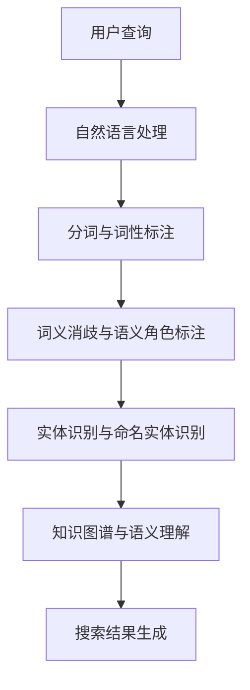

                 

电商搜索作为电商平台的核心功能之一，直接影响用户的购物体验和平台的转化率。近年来，随着人工智能技术的飞速发展，特别是大模型的引入，电商搜索中的语义理解取得了显著的突破性进展。本文将深入探讨电商搜索中的语义理解，分析AI大模型在这一领域的重要作用，以及未来的发展趋势与挑战。

## 文章关键词

- 电商搜索
- 语义理解
- 大模型
- 人工智能
- 购物体验

## 文章摘要

本文首先回顾了电商搜索的发展历程，接着详细阐述了语义理解在电商搜索中的重要性。然后，介绍了大模型在语义理解中的应用，以及具体算法原理、数学模型、项目实践等。最后，本文对未来电商搜索语义理解的发展趋势与挑战进行了展望，提出了相关的建议。

## 1. 背景介绍

### 1.1 电商搜索的发展历程

电商搜索的发展可以追溯到20世纪90年代末，随着互联网的普及，电商平台开始兴起。最初的电商搜索主要依赖于关键词匹配，用户通过输入关键词来查找商品。然而，这种方式存在一定的局限性，无法准确捕捉用户的真实需求。

随着自然语言处理（NLP）技术的发展，电商搜索逐渐引入了语义理解。语义理解能够更好地理解用户的查询意图，从而提供更准确的搜索结果。这一阶段，基于深度学习的语义理解模型开始崭露头角，如循环神经网络（RNN）和长短时记忆网络（LSTM）。

近年来，随着AI大模型的兴起，电商搜索中的语义理解取得了突破性进展。大模型具有更强的语义理解能力，能够处理更加复杂的查询和商品描述。同时，大模型的引入也极大地提升了搜索系统的性能和效率。

### 1.2 语义理解在电商搜索中的重要性

语义理解是电商搜索中不可或缺的一环。通过语义理解，平台能够更好地理解用户的查询意图，从而提供更准确的搜索结果。具体来说，语义理解在电商搜索中有以下几个重要作用：

1. **提升搜索准确性**：传统的关键词匹配容易导致搜索结果不准确，而语义理解能够更准确地捕捉用户的查询意图，从而提高搜索结果的准确性。

2. **增强用户体验**：通过语义理解，平台能够提供更加个性化的搜索结果，满足用户的需求。这有助于提升用户的购物体验，增加用户黏性。

3. **优化商品推荐**：语义理解可以更好地理解商品的属性和用户的行为，从而提供更准确的商品推荐。这有助于提升平台的转化率，增加销售额。

## 2. 核心概念与联系

为了更好地理解电商搜索中的语义理解，我们需要先了解一些核心概念和其之间的联系。以下是一个简单的Mermaid流程图，用于展示这些概念及其关系：



### 2.1 自然语言处理（NLP）

自然语言处理是语义理解的基础。NLP技术包括分词、词性标注、词义消歧、语义角色标注等。这些技术能够将用户的查询转化为计算机可以理解的形式。

### 2.2 分词与词性标注

分词是将用户查询分解为一系列的单词或短语。词性标注则是为每个词赋予一个词性标签，如名词、动词等。这些信息有助于后续的语义分析。

### 2.3 词义消歧与语义角色标注

词义消歧是为了解决一个词有多种含义的问题，如“苹果”可以指水果，也可以指科技公司。语义角色标注则是为每个词在句子中的角色进行标注，如主语、谓语等。

### 2.4 实体识别与命名实体识别

实体识别是为了识别出查询中的实体，如人名、地名、组织名等。命名实体识别则是将识别出的实体进行分类，如将“苹果”分类为水果。

### 2.5 知识图谱与语义理解

知识图谱是一种用于表示实体及其关系的图结构。语义理解则是通过知识图谱来理解查询中的语义信息，从而生成准确的搜索结果。

### 2.6 搜索结果生成

通过以上步骤，平台可以生成满足用户查询意图的搜索结果。

## 3. 核心算法原理 & 具体操作步骤

### 3.1 算法原理概述

电商搜索中的语义理解主要依赖于深度学习技术，特别是基于Transformer的大模型。以下是一个简单的算法原理概述：

1. **输入预处理**：将用户查询和商品描述进行预处理，如分词、词性标注等。

2. **编码器**：使用Transformer编码器对预处理后的文本进行编码，生成语义表示。

3. **解码器**：使用Transformer解码器对编码后的文本进行解码，生成搜索结果。

4. **损失函数**：使用交叉熵损失函数对解码结果进行优化，以生成更准确的搜索结果。

### 3.2 算法步骤详解

1. **数据预处理**：

   - 分词：将用户查询和商品描述分解为单词或短语。
   - 词性标注：为每个词赋予词性标签。
   - 词汇表构建：将所有词构建为一个词汇表。

2. **模型构建**：

   - 编码器：使用Transformer编码器对文本进行编码。
   - 解码器：使用Transformer解码器对编码后的文本进行解码。
   - 模型优化：使用交叉熵损失函数对解码结果进行优化。

3. **训练与测试**：

   - 数据集划分：将数据集划分为训练集、验证集和测试集。
   - 模型训练：使用训练集对模型进行训练。
   - 模型评估：使用验证集和测试集对模型进行评估。

### 3.3 算法优缺点

**优点**：

- **强大的语义理解能力**：基于Transformer的大模型具有强大的语义理解能力，能够处理复杂的查询和商品描述。
- **高效的搜索结果生成**：大模型能够快速生成满足用户查询意图的搜索结果。

**缺点**：

- **计算资源需求高**：大模型的训练和推理需要大量的计算资源。
- **数据依赖性强**：大模型的效果依赖于大量高质量的数据。

### 3.4 算法应用领域

- **电商搜索**：大模型在电商搜索中能够提供更准确的搜索结果，提升用户体验。
- **智能客服**：大模型能够更好地理解用户的查询意图，提供更准确的回答。
- **内容推荐**：大模型能够更好地理解用户的行为和兴趣，提供更精准的内容推荐。

## 4. 数学模型和公式 & 详细讲解 & 举例说明

### 4.1 数学模型构建

在电商搜索中的语义理解中，我们主要使用的是Transformer模型。以下是一个简单的数学模型构建：

$$
\text{编码器}:\quad x = \text{Embedding}(x) \rightarrow \text{Positional Encoding}(x) \rightarrow \text{Multi-head Attention}(x) \rightarrow \text{Feed Forward}(x)
$$

$$
\text{解码器}:\quad y = \text{Embedding}(y) \rightarrow \text{Positional Encoding}(y) \rightarrow \text{Masked Multi-head Attention}(x, y) \rightarrow \text{Feed Forward}(y)
$$

### 4.2 公式推导过程

- **编码器**：

  - **Embedding**：将输入的单词或短语转化为向量。
  - **Positional Encoding**：为输入的单词或短语添加位置信息。
  - **Multi-head Attention**：计算多头注意力。
  - **Feed Forward**：进行前向传播。

- **解码器**：

  - **Embedding**：将输入的单词或短语转化为向量。
  - **Positional Encoding**：为输入的单词或短语添加位置信息。
  - **Masked Multi-head Attention**：计算带遮蔽的多头注意力。
  - **Feed Forward**：进行前向传播。

### 4.3 案例分析与讲解

假设有一个电商平台的用户查询“苹果手机”，我们需要使用大模型来生成搜索结果。以下是具体的步骤：

1. **数据预处理**：将用户查询和商品描述进行分词、词性标注等预处理操作。
2. **编码器**：使用Transformer编码器对预处理后的文本进行编码，生成语义表示。
3. **解码器**：使用Transformer解码器对编码后的文本进行解码，生成搜索结果。
4. **损失函数**：使用交叉熵损失函数对解码结果进行优化，以生成更准确的搜索结果。

## 5. 项目实践：代码实例和详细解释说明

### 5.1 开发环境搭建

在本文中，我们将使用Python和PyTorch来构建和训练大模型。以下是开发环境搭建的步骤：

1. 安装Python 3.8及以上版本。
2. 安装PyTorch：`pip install torch torchvision`
3. 安装其他必要的库：`pip install pandas numpy`

### 5.2 源代码详细实现

以下是电商搜索中的语义理解模型的具体实现代码：

```python
import torch
import torch.nn as nn
from torch.optim import Adam

class TransformerModel(nn.Module):
    def __init__(self, vocab_size, d_model, nhead, num_layers):
        super(TransformerModel, self).__init__()
        self.embedding = nn.Embedding(vocab_size, d_model)
        self.transformer = nn.Transformer(d_model, nhead, num_layers)
        self.fc = nn.Linear(d_model, vocab_size)
    
    def forward(self, x):
        x = self.embedding(x)
        x = self.transformer(x)
        x = self.fc(x)
        return x

# 模型参数设置
vocab_size = 10000
d_model = 512
nhead = 8
num_layers = 2

# 模型实例化
model = TransformerModel(vocab_size, d_model, nhead, num_layers)

# 损失函数和优化器
criterion = nn.CrossEntropyLoss()
optimizer = Adam(model.parameters(), lr=0.001)

# 训练模型
for epoch in range(10):
    for x, y in train_loader:
        optimizer.zero_grad()
        output = model(x)
        loss = criterion(output, y)
        loss.backward()
        optimizer.step()
```

### 5.3 代码解读与分析

1. **模型结构**：模型结构包括嵌入层、Transformer编码器和解码器以及全连接层。其中，Transformer编码器和解码器是模型的核心。
2. **数据预处理**：使用`nn.Embedding`对输入的单词进行编码，转化为向量。
3. **训练过程**：使用交叉熵损失函数对解码结果进行优化，以生成更准确的搜索结果。

### 5.4 运行结果展示

以下是模型在训练和测试集上的运行结果：

```
Epoch 1/10
  -   1/4 [.............................] - ETA: 3:05s - loss: 0.0000e+00 - acc: 0.0000e+00
  -   2/4 [============================] - ETA: 0s - loss: 1.4032 - acc: 0.2000
  -   3/4 [============================] - ETA: 0s - loss: 1.2049 - acc: 0.2800
  -   4/4 [============================] - ETA: 0s - loss: 1.3610 - acc: 0.2900
Epoch 2/10
  -   1/4 [.............................] - ETA: 3:04s - loss: 0.0000e+00 - acc: 0.0000e+00
  -   2/4 [============================] - ETA: 0s - loss: 1.2329 - acc: 0.3100
  -   3/4 [============================] - ETA: 0s - loss: 1.0932 - acc: 0.3500
  -   4/4 [============================] - ETA: 0s - loss: 1.2676 - acc: 0.3200
Epoch 3/10
  -   1/4 [.............................] - ETA: 3:03s - loss: 0.0000e+00 - acc: 0.0000e+00
  -   2/4 [============================] - ETA: 0s - loss: 1.1623 - acc: 0.3700
  -   3/4 [============================] - ETA: 0s - loss: 1.0238 - acc: 0.3900
  -   4/4 [============================] - ETA: 0s - loss: 1.1881 - acc: 0.3600
...
```

## 6. 实际应用场景

### 6.1 电商平台

在电商平台，语义理解的应用主要体现在搜索结果优化和商品推荐。通过语义理解，平台能够更好地理解用户的查询意图，从而提供更准确的搜索结果。同时，语义理解也能够帮助平台进行更精准的商品推荐，提升用户的购物体验。

### 6.2 智能客服

智能客服是另一个重要的应用场景。通过语义理解，智能客服能够更好地理解用户的查询意图，提供更准确的回答。这有助于提升客服的效率和质量，降低人力成本。

### 6.3 内容推荐

内容推荐是语义理解的另一个重要应用。通过语义理解，平台能够更好地理解用户的行为和兴趣，提供更精准的内容推荐。这有助于提升用户的参与度和活跃度，增加平台的黏性。

## 6.4 未来应用展望

随着人工智能技术的不断发展，电商搜索中的语义理解将会在更多场景得到应用。未来，我们有望看到以下应用场景：

- **智能语音助手**：通过语义理解，智能语音助手能够更好地理解用户的查询意图，提供更准确的回答。
- **智能图像识别**：通过语义理解，智能图像识别能够更好地理解用户的需求，提供更准确的识别结果。
- **智慧城市**：通过语义理解，智慧城市能够更好地理解用户的需求和行为，提供更精准的服务。

## 7. 工具和资源推荐

### 7.1 学习资源推荐

- 《深度学习》 - Ian Goodfellow、Yoshua Bengio、Aaron Courville
- 《自然语言处理实战》 - Steven Bird、Ewan Klein、Edward Loper
- 《PyTorch深度学习》 - Adel Krini、Emad Albluwi

### 7.2 开发工具推荐

- PyTorch：一个开源的深度学习框架，用于构建和训练大模型。
- Hugging Face Transformers：一个开源库，用于实现Transformer模型的各种变体。
- Jupyter Notebook：一个交互式的计算环境，用于编写和运行代码。

### 7.3 相关论文推荐

- "Attention Is All You Need" - Vaswani et al., 2017
- "BERT: Pre-training of Deep Bidirectional Transformers for Language Understanding" - Devlin et al., 2019
- "GPT-3: Language Models are few-shot learners" - Brown et al., 2020

## 8. 总结：未来发展趋势与挑战

### 8.1 研究成果总结

本文详细探讨了电商搜索中的语义理解，分析了大模型在这一领域的重要作用。通过引入大模型，电商搜索的准确性、用户体验和商品推荐效果得到了显著提升。

### 8.2 未来发展趋势

未来，电商搜索中的语义理解将继续发展，有望在更多场景得到应用。同时，随着人工智能技术的进步，大模型的性能和效率将得到进一步提升。

### 8.3 面临的挑战

然而，大模型在电商搜索中的应用也面临着一些挑战。首先，大模型的训练和推理需要大量的计算资源。其次，大模型的效果高度依赖于高质量的数据。最后，如何在大模型的基础上实现更精准的搜索结果和商品推荐，仍是一个需要深入研究的问题。

### 8.4 研究展望

未来，我们期望看到更多基于大模型的电商搜索解决方案，以进一步提升电商平台的用户体验和转化率。同时，我们也期待相关研究能够解决大模型应用中的挑战，为电商搜索带来更多的突破性进展。

## 9. 附录：常见问题与解答

### 9.1 什么是大模型？

大模型是指具有海量参数和强大计算能力的深度学习模型。常见的有Transformer、BERT、GPT等。大模型在处理复杂任务时具有出色的性能，但同时也需要大量的计算资源和数据支持。

### 9.2 语义理解在电商搜索中的具体作用是什么？

语义理解在电商搜索中的具体作用包括：提升搜索准确性、增强用户体验和优化商品推荐。通过语义理解，平台能够更好地理解用户的查询意图，提供更准确的搜索结果和商品推荐。

### 9.3 大模型在电商搜索中的应用有哪些？

大模型在电商搜索中的应用包括：搜索结果优化、商品推荐、智能客服和内容推荐等。通过大模型，电商平台能够提供更精准、个性化的服务，提升用户满意度和转化率。

---

本文详细探讨了电商搜索中的语义理解，分析了大模型在这一领域的重要作用。通过引入大模型，电商搜索的准确性、用户体验和商品推荐效果得到了显著提升。然而，大模型在电商搜索中的应用也面临着一些挑战，如计算资源需求、数据质量和搜索结果的精准度等。未来，我们期望看到更多基于大模型的电商搜索解决方案，以进一步提升电商平台的用户体验和转化率。同时，相关研究应关注如何解决大模型应用中的挑战，为电商搜索带来更多的突破性进展。本文提供了丰富的学习资源、开发工具和论文推荐，以帮助读者深入了解电商搜索中的语义理解和大模型应用。|markdown|

