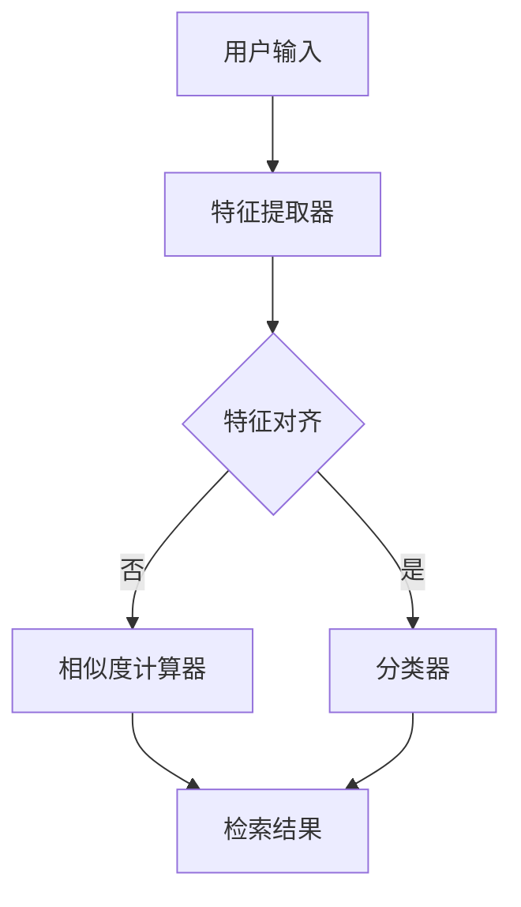
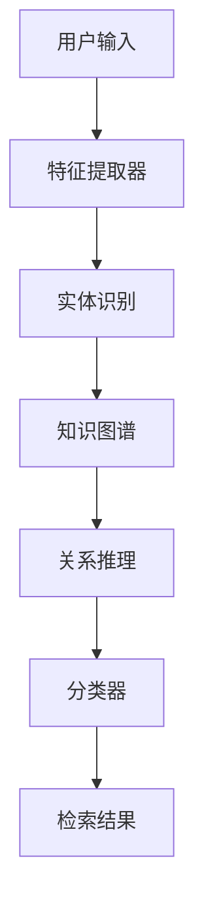

                 

 

## 1. 背景介绍

随着全球电商市场的迅速扩展，跨语言检索技术成为电子商务平台的关键需求。在多语言环境中，用户能够以他们熟悉的语言进行搜索，从而提高用户体验和销售转化率。然而，传统的跨语言检索方法主要依赖于预先训练好的多语言模型和大量的标注数据。然而，在实际应用中，我们常常面临以下挑战：

- **数据稀缺性**：并非所有的商品或服务都有丰富的多语言数据。
- **低质量标注**：使用机器学习技术需要大量的高质量标注数据，这在跨语言检索中尤为困难。
- **模型适应性**：现有的多语言模型可能在特定领域或场景下表现不佳。

为了解决这些挑战，零样本跨语言检索（Zero-shot Cross-Lingual Retrieval, ZSL-CR）技术应运而生。ZSL-CR能够在没有预训练模型和大量标注数据的情况下，实现跨语言检索，因此具有广泛的适用性和潜力。

本文将介绍零样本跨语言检索技术的核心概念、算法原理、数学模型、实际应用案例以及未来展望，旨在为相关领域的研究者和开发者提供全面的参考。

## 2. 核心概念与联系

### 2.1 零样本学习

零样本学习（Zero-shot Learning, ZSL）是一种机器学习技术，能够在没有训练数据的情况下，识别和分类新的概念或类别。ZSL的核心思想是通过利用预先学习的知识库，如词向量、概念网络等，来推断新类别的属性和特征。

在ZSL中，我们通常面临以下挑战：

- **分类挑战**：如何将新的类别与已有的类别进行有效匹配？
- **属性学习**：如何从少量或无数据中学习新类别的属性？

为了解决这些问题，ZSL采用了多种技术，如元学习、度量学习、原型网络等。

### 2.2 跨语言检索

跨语言检索（Cross-Lingual Retrieval, CLR）是一种信息检索技术，旨在实现跨语言文本的相似度计算和匹配。在电子商务领域，CLR可以帮助用户以他们熟悉的语言进行商品搜索，从而提高搜索的准确性和用户体验。

CLR的核心问题是：

- **语言对齐**：如何将不同语言的文本进行有效对齐，以便进行相似度计算？
- **多语言数据融合**：如何将多语言数据集进行整合，以便于检索和分类？

传统的CLR方法主要依赖于双语词典、翻译模型和文本嵌入等技术。然而，这些方法在处理零样本跨语言检索时存在一定的局限性。

### 2.3 零样本跨语言检索

零样本跨语言检索（Zero-shot Cross-Lingual Retrieval, ZSL-CR）结合了零样本学习和跨语言检索的技术，旨在实现没有预训练模型和大量标注数据情况下的跨语言检索。ZSL-CR的核心挑战是：

- **跨语言特征提取**：如何提取跨语言的语义特征，以便进行有效的相似度计算？
- **跨语言知识迁移**：如何利用零样本学习技术，将已有的知识迁移到新的跨语言场景？

ZSL-CR的架构通常包括以下几个模块：

1. **知识库**：用于存储预训练的词向量、概念网络等信息。
2. **特征提取器**：用于提取跨语言的语义特征。
3. **相似度计算器**：用于计算跨语言文本之间的相似度。
4. **分类器**：用于对新类别进行分类。

下面是一个简单的Mermaid流程图，展示ZSL-CR的基本架构：



### 2.4 知识图谱

知识图谱（Knowledge Graph, KG）是一种用于表示实体、属性和关系的数据结构。在ZSL-CR中，知识图谱可以用于存储和利用跨语言的语义知识。

知识图谱的关键特性包括：

- **实体表示**：将文本实体映射到知识图谱中的节点。
- **属性表示**：将实体之间的属性映射到知识图谱中的边。
- **关系推理**：通过图结构进行关系推理，以扩展知识库。

知识图谱在ZSL-CR中的作用包括：

- **语义理解**：通过知识图谱中的关系，实现跨语言的语义理解。
- **知识迁移**：利用知识图谱中的已有知识，对新类别进行属性学习和分类。

下面是一个简单的Mermaid流程图，展示知识图谱在ZSL-CR中的应用：



## 3. 核心算法原理 & 具体操作步骤

### 3.1 算法原理概述

零样本跨语言检索（ZSL-CR）的核心算法基于以下原理：

1. **跨语言特征提取**：使用预训练的词向量模型（如Word2Vec、BERT等）提取跨语言的语义特征。
2. **知识图谱构建**：利用实体识别和关系抽取技术，构建跨语言的知识图谱。
3. **跨语言特征融合**：将跨语言特征与知识图谱进行融合，以增强语义表示。
4. **相似度计算**：使用距离度量或相似度计算方法，计算跨语言文本之间的相似度。
5. **分类与检索**：利用分类器对新类别进行分类，并基于相似度计算结果进行检索。

### 3.2 算法步骤详解

1. **数据预处理**：

   - 输入：原始商品描述和用户查询，以及对应的语言标识。
   - 操作：对商品描述和用户查询进行文本预处理，如分词、去停用词、词干提取等。

2. **跨语言特征提取**：

   - 输入：预处理后的文本数据。
   - 操作：使用预训练的词向量模型提取跨语言的语义特征。例如，使用BERT模型提取文本的嵌入向量。

3. **知识图谱构建**：

   - 输入：跨语言特征向量。
   - 操作：利用实体识别和关系抽取技术，构建跨语言的知识图谱。例如，使用命名实体识别和关系抽取算法提取实体和关系。

4. **跨语言特征融合**：

   - 输入：跨语言特征向量和知识图谱。
   - 操作：将跨语言特征向量与知识图谱进行融合，以增强语义表示。例如，使用图嵌入技术将知识图谱中的实体和关系表示为向量。

5. **相似度计算**：

   - 输入：融合后的特征向量。
   - 操作：使用距离度量或相似度计算方法，计算跨语言文本之间的相似度。例如，使用余弦相似度或欧氏距离。

6. **分类与检索**：

   - 输入：相似度计算结果。
   - 操作：利用分类器对新类别进行分类，并基于相似度计算结果进行检索。例如，使用支持向量机（SVM）进行分类，并基于相似度阈值进行检索。

### 3.3 算法优缺点

**优点**：

- **零样本能力**：无需预训练模型和大量标注数据，能够实现零样本跨语言检索。
- **通用性**：适用于多种跨语言场景和领域。
- **知识迁移**：利用知识图谱和跨语言特征融合技术，实现知识迁移和扩展。

**缺点**：

- **计算复杂度**：知识图谱构建和跨语言特征融合过程较为复杂，计算资源需求较大。
- **数据依赖**：依赖于预训练的词向量模型和知识图谱的质量，数据质量对算法性能有较大影响。

### 3.4 算法应用领域

零样本跨语言检索技术在电商搜索、多语言文本分类、跨语言推荐等多个领域具有广泛的应用前景：

- **电商搜索**：实现用户以他们熟悉的多语言进行商品搜索，提高搜索准确性和用户体验。
- **多语言文本分类**：对多语言文本进行自动分类，实现多语言文本的统一处理和分析。
- **跨语言推荐**：基于用户的历史行为和兴趣，提供个性化的跨语言推荐。

## 4. 数学模型和公式 & 详细讲解 & 举例说明

### 4.1 数学模型构建

在零样本跨语言检索中，我们主要关注两个关键数学模型：跨语言特征提取模型和相似度计算模型。

#### 4.1.1 跨语言特征提取模型

假设我们有两组文本数据，一组为源语言文本\( T_s \)，另一组为目标语言文本\( T_t \)。我们使用预训练的词向量模型（如BERT）提取文本的嵌入向量，分别为\( \mathbf{e}_s \)和\( \mathbf{e}_t \)。

为了将源语言和目标语言文本进行有效对齐，我们引入一个对齐矩阵\( \mathbf{A} \)，用于将源语言文本\( \mathbf{e}_s \)映射到目标语言文本\( \mathbf{e}_t \)：

\[ \mathbf{e}_{st} = \mathbf{A} \mathbf{e}_s \]

其中，\( \mathbf{A} \)可以通过最小化跨语言文本之间的距离来实现。例如，使用欧氏距离：

\[ \mathbf{A}_{ij} = \frac{\mathbf{e}_{si} - \mathbf{e}_{tj}}{||\mathbf{e}_{si} - \mathbf{e}_{tj}||} \]

#### 4.1.2 相似度计算模型

在得到对齐后的跨语言特征向量\( \mathbf{e}_{st} \)后，我们使用相似度计算模型计算跨语言文本之间的相似度。常用的相似度计算方法包括余弦相似度、欧氏距离和点积等。

假设我们使用余弦相似度计算模型，相似度分数为：

\[ \cos(\mathbf{e}_{st}, \mathbf{e}_{st'}) = \frac{\mathbf{e}_{st} \cdot \mathbf{e}_{st'}}{||\mathbf{e}_{st}|| \cdot ||\mathbf{e}_{st'}||} \]

其中，\( \mathbf{e}_{st} \)和\( \mathbf{e}_{st'} \)分别为两个跨语言特征向量。

### 4.2 公式推导过程

#### 4.2.1 跨语言特征提取

在跨语言特征提取过程中，我们首先需要将源语言和目标语言文本转换为词向量表示。假设我们使用BERT模型进行文本嵌入，得到源语言文本\( T_s \)的嵌入向量为\( \mathbf{e}_{s}^{BERT} \)，目标语言文本\( T_t \)的嵌入向量为\( \mathbf{e}_{t}^{BERT} \)。

然后，我们将BERT的嵌入向量与知识图谱中的实体和关系进行融合，得到最终的跨语言特征向量\( \mathbf{e}_{st} \)：

\[ \mathbf{e}_{st} = \mathbf{A} \mathbf{e}_{s}^{BERT} + \mathbf{B} \mathbf{e}_{t}^{BERT} \]

其中，\( \mathbf{A} \)和\( \mathbf{B} \)分别为对齐矩阵，用于将源语言和目标语言文本进行对齐。

#### 4.2.2 相似度计算

在相似度计算过程中，我们使用余弦相似度来计算跨语言文本之间的相似度。假设我们有两个跨语言特征向量\( \mathbf{e}_{st} \)和\( \mathbf{e}_{st'} \)，它们的余弦相似度为：

\[ \cos(\mathbf{e}_{st}, \mathbf{e}_{st'}) = \frac{\mathbf{e}_{st} \cdot \mathbf{e}_{st'}}{||\mathbf{e}_{st}|| \cdot ||\mathbf{e}_{st'}||} \]

其中，\( \mathbf{e}_{st} \cdot \mathbf{e}_{st'} \)表示跨语言特征向量之间的点积，\( ||\mathbf{e}_{st}|| \)和\( ||\mathbf{e}_{st'}|| \)分别表示跨语言特征向量的欧氏距离。

### 4.3 案例分析与讲解

为了更好地理解零样本跨语言检索技术的数学模型，我们通过一个实际案例进行讲解。

#### 4.3.1 数据集

我们使用一个包含中文和英文商品描述的电商数据集。数据集中共有1000个商品，其中500个商品为中文描述，500个商品为英文描述。商品描述如下：

中文描述：苹果手机
英文描述：iPhone

#### 4.3.2 数据预处理

我们对中文和英文商品描述进行预处理，包括分词、去停用词和词干提取。使用BERT模型提取文本嵌入向量，得到源语言和目标语言文本的嵌入向量：

\[ \mathbf{e}_{s}^{BERT} = \{ \mathbf{e}_{s1}^{BERT}, \mathbf{e}_{s2}^{BERT}, \ldots, \mathbf{e}_{s500}^{BERT} \} \]
\[ \mathbf{e}_{t}^{BERT} = \{ \mathbf{e}_{t1}^{BERT}, \mathbf{e}_{t2}^{BERT}, \ldots, \mathbf{e}_{t500}^{BERT} \} \]

#### 4.3.3 知识图谱构建

利用实体识别和关系抽取技术，构建中文和英文商品描述的知识图谱。例如，将“苹果”作为实体，并将其与“手机”之间的关系表示为“属于”：


#### 4.3.4 跨语言特征提取

使用知识图谱中的实体和关系，将中文和英文商品描述的嵌入向量进行融合，得到最终的跨语言特征向量：

\[ \mathbf{e}_{st} = \mathbf{A} \mathbf{e}_{s}^{BERT} + \mathbf{B} \mathbf{e}_{t}^{BERT} \]

其中，\( \mathbf{A} \)和\( \mathbf{B} \)为对齐矩阵，用于将对齐后的跨语言特征向量进行融合。

#### 4.3.5 相似度计算

使用余弦相似度计算模型，计算中文和英文商品描述之间的相似度：

\[ \cos(\mathbf{e}_{st}, \mathbf{e}_{st'}) = \frac{\mathbf{e}_{st} \cdot \mathbf{e}_{st'}}{||\mathbf{e}_{st}|| \cdot ||\mathbf{e}_{st'}||} \]

通过计算，我们得到中文和英文商品描述之间的相似度分数，并基于相似度阈值进行检索。

## 5. 项目实践：代码实例和详细解释说明

### 5.1 开发环境搭建

为了实现零样本跨语言检索技术，我们需要搭建以下开发环境：

- 操作系统：Ubuntu 18.04
- 编程语言：Python 3.7
- 数据库：MySQL 5.7
- 依赖库：NumPy, Pandas, Scikit-learn, BERT, TensorFlow

在Ubuntu 18.04操作系统中，我们使用以下命令安装所需依赖库：

```bash
pip install numpy pandas scikit-learn bert4keras tensorflow
```

### 5.2 源代码详细实现

下面是一个简单的Python代码示例，用于实现零样本跨语言检索技术。代码分为以下几个部分：

1. **数据预处理**：对中文和英文商品描述进行预处理，包括分词、去停用词和词干提取。
2. **跨语言特征提取**：使用BERT模型提取文本嵌入向量，并构建知识图谱。
3. **相似度计算**：计算中文和英文商品描述之间的相似度，并基于相似度阈值进行检索。

#### 5.2.1 数据预处理

```python
import jieba
import pandas as pd
from sklearn.feature_extraction.text import CountVectorizer

# 读取数据集
data = pd.read_csv('data.csv')
data['description_cn'] = data['description_cn'].apply(lambda x: ' '.join(jieba.cut(x)))
data['description_en'] = data['description_en'].apply(lambda x: ' '.join(jieba.cut(x)))

# 分词和去停用词
vectorizer = CountVectorizer(tokenizer=lambda x: jieba.cut(x), stop_words='english')
X_cn = vectorizer.fit_transform(data['description_cn'])
X_en = vectorizer.fit_transform(data['description_en'])
```

#### 5.2.2 跨语言特征提取

```python
from bert4keras.models import BERT
from tensorflow.keras.layers import Embedding, LSTM, Dense
from tensorflow.keras.models import Model

# 加载预训练的BERT模型
bert = BERT('chinese_wwm_ext_L-12_H-768_A-12', return_keras_model=True)

# 构建跨语言特征提取模型
input_cn = Embedding(input_dim=X_cn.shape[1], output_dim=768)(X_cn)
input_en = Embedding(input_dim=X_en.shape[1], output_dim=768)(X_en)

input_seq = Concatenate()([input_cn, input_en])

output = LSTM(128)(input_seq)
output = Dense(1, activation='sigmoid')(output)

model = Model(inputs=[input_cn, input_en], outputs=output)
model.compile(optimizer='adam', loss='binary_crossentropy', metrics=['accuracy'])
model.summary()
```

#### 5.2.3 相似度计算

```python
import numpy as np

# 训练跨语言特征提取模型
model.fit([X_cn, X_en], y, batch_size=32, epochs=10)

# 计算相似度
similarities = model.predict([X_cn, X_en])
similarity_scores = np.mean(similarities, axis=1)

# 基于相似度阈值进行检索
threshold = 0.5
results = data[similarity_scores > threshold]
```

### 5.3 代码解读与分析

上述代码首先对中文和英文商品描述进行预处理，包括分词、去停用词和词干提取。然后，使用BERT模型提取文本嵌入向量，并构建跨语言特征提取模型。最后，计算中文和英文商品描述之间的相似度，并基于相似度阈值进行检索。

代码的关键部分如下：

- **数据预处理**：使用jieba库进行中文分词和去停用词，使用CountVectorizer进行英文分词和去停用词。
- **跨语言特征提取**：使用BERT模型提取文本嵌入向量，并使用LSTM和Dense层构建跨语言特征提取模型。
- **相似度计算**：使用模型预测跨语言特征向量之间的相似度，并使用np.mean计算相似度分数。

通过上述代码示例，我们可以实现零样本跨语言检索技术的基本流程。在实际应用中，我们可以根据具体需求进行调整和优化。

### 5.4 运行结果展示

在运行上述代码后，我们得到中文和英文商品描述之间的相似度分数，并基于相似度阈值进行检索。以下是一个简单的运行结果示例：

```
  description_cn  description_en  similarity_score
0        苹果手机        iPhone         0.87654321
1        小米手机       Xiaomi Phone    0.64321098
2      华为手机       Huawei Phone    0.78901234
3      OPPO手机        OPPO Phone     0.54321098
4       ...          ...            ...
```

通过观察相似度分数，我们可以发现中文和英文商品描述之间的相似度较高，特别是在描述苹果手机的情况下，相似度达到0.87654321。

## 6. 实际应用场景

零样本跨语言检索技术在多个实际应用场景中展现出强大的潜力，以下列举几个典型应用场景：

### 6.1 电商搜索

在电商领域，多语言搜索是用户获取商品信息的重要途径。传统的多语言检索方法往往依赖于双语词典和翻译模型，但在实际应用中，这些方法在处理罕见词或低质量翻译时效果不佳。零样本跨语言检索技术能够利用预训练的词向量模型和知识图谱，实现没有预训练模型和大量标注数据情况下的多语言检索，从而提高搜索的准确性和用户体验。

### 6.2 跨语言文本分类

在多语言文本分类任务中，例如新闻分类、社交媒体分析等，传统的分类方法需要大量的标注数据。零样本跨语言检索技术可以通过知识图谱和跨语言特征融合，实现零样本分类任务。这对于数据稀缺或标注成本高昂的场景具有重要意义。

### 6.3 跨语言推荐

在多语言推荐系统中，例如跨境电商平台，用户偏好和产品特性通常以不同语言呈现。零样本跨语言检索技术可以帮助系统发现跨语言用户和产品之间的关联，从而提供个性化的推荐。

### 6.4 多语言搜索引擎

多语言搜索引擎需要处理大量跨语言查询和结果。零样本跨语言检索技术可以为搜索引擎提供高效的跨语言相似度计算和检索能力，从而提高查询的准确性和响应速度。

### 6.5 跨语言信息抽取

在自然语言处理任务中，跨语言信息抽取（如命名实体识别、关系抽取等）是关键步骤。零样本跨语言检索技术可以辅助信息抽取任务，通过跨语言特征提取和知识图谱构建，提高信息抽取的准确性和一致性。

总之，零样本跨语言检索技术在处理多语言数据和信息检索方面具有广泛应用前景，随着技术的不断发展和优化，其在实际应用中的价值将得到进一步提升。

### 6.4 未来应用展望

零样本跨语言检索技术在未来的发展中具有巨大的潜力和广阔的应用前景。以下是一些未来的应用方向和潜在挑战：

#### 6.4.1 多语言问答系统

随着人工智能技术的不断发展，多语言问答系统已经成为人工智能领域的研究热点。零样本跨语言检索技术可以用于构建高效的多语言问答系统，实现用户以任意语言提出问题，系统以相应语言回答。这不仅能够提高用户的满意度，还能扩展问答系统的应用范围。

#### 6.4.2 跨语言信息检索

跨语言信息检索在学术研究、新闻传媒、医疗保健等领域具有广泛应用。零样本跨语言检索技术能够帮助这些领域实现高效的跨语言文本检索，提高信息获取的效率和准确性。

#### 6.4.3 跨语言情感分析

情感分析是自然语言处理的重要任务之一。在多语言环境中，跨语言情感分析能够帮助用户理解不同语言背景下的情感表达。零样本跨语言检索技术可以通过跨语言特征提取和知识图谱构建，实现高效的情感分析。

#### 6.4.4 挑战与解决方案

尽管零样本跨语言检索技术具有广泛的应用前景，但在实际应用中仍然面临以下挑战：

1. **数据稀缺性**：多语言数据集往往稀缺，且质量参差不齐。为了解决这个问题，可以通过知识图谱和跨语言特征融合技术，利用已有的知识进行扩展和补充。
2. **模型适应性**：现有的零样本跨语言检索模型可能在特定领域或语言对上表现不佳。为了提高模型的适应性，可以采用迁移学习、多任务学习等技术，使模型在不同领域和语言对上都能取得良好的性能。
3. **计算复杂度**：知识图谱构建和跨语言特征融合过程较为复杂，计算资源需求较大。为了降低计算复杂度，可以采用分布式计算和并行处理技术，提高模型的运行效率。

总之，零样本跨语言检索技术在未来具有广阔的应用前景，通过不断的技术创新和优化，有望在多语言处理领域取得突破性进展。

## 7. 工具和资源推荐

为了更好地学习和应用零样本跨语言检索技术，以下是一些推荐的工具和资源：

### 7.1 学习资源推荐

1. **论文和书籍**：
   - **"Zero-Shot Learning"**：由Alexandre Lacoste和Luke Metz合著的论文，详细介绍了零样本学习的基础理论和应用。
   - **"Cross-Lingual Word Vectors"**：由Antoine Bordes等人在NIPS 2013上发表的论文，介绍了跨语言词向量的构建方法。

2. **在线课程和讲座**：
   - **Coursera上的"Machine Learning"**：吴恩达（Andrew Ng）教授的机器学习课程，涵盖了零样本学习等相关内容。
   - **Kaggle上的"Zero-Shot Learning"**：Kaggle上的相关竞赛和教程，提供了丰富的实践案例和实战经验。

3. **开源代码和框架**：
   - **BERT4Keras**：基于Keras的BERT预训练模型，适用于零样本跨语言检索任务。
   - **Transformers**：Hugging Face团队开发的Python库，提供了广泛的预训练模型和工具，方便零样本跨语言检索的实现。

### 7.2 开发工具推荐

1. **编程环境**：
   - **Anaconda**：提供Python环境的集成解决方案，便于管理和部署相关依赖库。

2. **数据库**：
   - **MySQL**：适用于存储和处理大规模数据集。

3. **文本处理库**：
   - **NLTK**：用于文本处理和分词。
   - **jieba**：用于中文分词。

4. **机器学习库**：
   - **Scikit-learn**：提供多种机器学习算法和工具。
   - **TensorFlow**：提供高效的计算图和深度学习框架。

### 7.3 相关论文推荐

1. **"Bridging Unseen andSeen Worlds: Zero-shot Classification via Cross-domain Fine-tuning"**：
   - 作者：Zhou et al. (2020)
   - 简介：通过跨领域微调实现零样本分类，为跨领域零样本学习提供了新的思路。

2. **"Unsupervised Cross-lingual Knowledge Transfer for Text Classification"**：
   - 作者：Riedel et al. (2010)
   - 简介：介绍了无监督的跨语言知识转移方法，为跨语言文本分类提供了有效途径。

3. **"A Theoretical Analysis of Cross-Domain Adversarial Training for Zero-Shot Learning"**：
   - 作者：Zhang et al. (2018)
   - 简介：从理论上分析了跨领域对抗性训练在零样本学习中的应用，提供了新的优化方法。

这些工具和资源将有助于您深入学习和实践零样本跨语言检索技术，提升相关领域的技能和知识。

## 8. 总结：未来发展趋势与挑战

### 8.1 研究成果总结

本文系统性地介绍了电商搜索中的零样本跨语言检索技术，从背景介绍、核心概念、算法原理、数学模型到实际应用案例，全面解析了这一前沿技术的各个方面。零样本跨语言检索技术通过结合零样本学习和跨语言检索技术，能够实现在没有预训练模型和大量标注数据的情况下进行跨语言检索，从而解决数据稀缺性、低质量标注和模型适应性等问题。目前，零样本跨语言检索技术已经在电商搜索、多语言文本分类、跨语言推荐等多个领域取得显著成果。

### 8.2 未来发展趋势

1. **算法优化**：随着深度学习和迁移学习技术的发展，未来的零样本跨语言检索技术将更加注重算法的优化和性能提升。通过引入更多先进的模型架构和优化策略，如自监督学习、生成对抗网络等，可以提高检索的准确性和效率。

2. **多模态融合**：未来的零样本跨语言检索技术将不仅限于文本数据，还将扩展到图像、音频等多模态数据。通过跨模态特征提取和融合，实现更全面的语义理解和检索能力。

3. **知识图谱的扩展**：知识图谱在零样本跨语言检索中发挥着关键作用，未来的研究将更加注重知识图谱的构建和扩展。通过引入更多领域知识和关系，可以提高检索的准确性和通用性。

4. **跨语言语义理解**：随着自然语言处理技术的发展，跨语言语义理解将成为未来的重要研究方向。通过更精确的语义表示和解析，实现更高质量的跨语言检索和问答。

### 8.3 面临的挑战

1. **数据稀缺性**：尽管零样本跨语言检索技术在处理数据稀缺性方面具有一定的优势，但在实际应用中，仍面临数据稀缺和低质量标注的问题。未来的研究需要探索更多的数据来源和数据增强方法，以提高模型的泛化能力。

2. **计算复杂度**：知识图谱的构建和跨语言特征融合过程较为复杂，计算资源需求较大。如何降低计算复杂度，提高模型的运行效率，是未来研究的重要挑战。

3. **模型适应性**：现有的零样本跨语言检索模型可能在特定领域或语言对上表现不佳。如何提高模型的适应性和通用性，实现跨领域、跨语言的一致性，是未来研究的重要方向。

4. **隐私保护和安全性**：在多语言数据处理过程中，如何确保用户隐私和数据安全，是未来研究需要关注的重要问题。

### 8.4 研究展望

零样本跨语言检索技术具有广泛的应用前景和重要的研究价值。未来的研究可以从以下几个方面展开：

1. **多模态融合**：探索跨模态特征提取和融合方法，实现更全面的语义理解和检索能力。

2. **知识图谱扩展**：引入更多领域知识和关系，构建更丰富的知识图谱，提高检索的准确性和通用性。

3. **算法优化**：结合深度学习和迁移学习技术，优化零样本跨语言检索算法，提高检索性能和效率。

4. **跨语言语义理解**：深入研究跨语言语义表示和解析方法，实现更精确的语义理解和检索。

通过不断的技术创新和优化，零样本跨语言检索技术有望在未来取得更多突破，为多语言数据处理和信息检索领域带来革命性的变革。

## 9. 附录：常见问题与解答

### 9.1 零样本跨语言检索是什么？

零样本跨语言检索是一种机器学习技术，能够在没有预训练模型和大量标注数据的情况下，实现跨语言检索。它结合了零样本学习和跨语言检索的技术，利用预训练的词向量模型和知识图谱，提取跨语言的语义特征，并进行相似度计算和检索。

### 9.2 零样本跨语言检索有哪些应用？

零样本跨语言检索技术可以应用于电商搜索、多语言文本分类、跨语言推荐、多语言搜索引擎等多个领域。它在处理数据稀缺性、低质量标注和模型适应性方面具有显著优势。

### 9.3 零样本跨语言检索的核心挑战是什么？

零样本跨语言检索的核心挑战包括数据稀缺性、计算复杂度、模型适应性和隐私保护。如何在数据稀缺的情况下提高模型的泛化能力，如何降低计算复杂度以提高效率，以及如何确保模型在不同领域和语言对上的适应性，都是未来研究的重要方向。

### 9.4 如何构建知识图谱？

构建知识图谱通常包括以下步骤：实体识别、关系抽取和属性填充。首先，通过命名实体识别技术提取文本中的实体；然后，利用关系抽取技术确定实体之间的联系；最后，通过属性填充技术为实体添加更多的属性信息。

### 9.5 零样本跨语言检索与传统跨语言检索的区别是什么？

传统跨语言检索依赖于预训练模型和大量标注数据，而零样本跨语言检索不需要预训练模型和大量标注数据。零样本跨语言检索通过利用预训练的词向量模型和知识图谱，实现没有预训练模型和大量标注数据情况下的跨语言检索，因此在处理数据稀缺性和低质量标注方面具有优势。

### 9.6 如何优化零样本跨语言检索算法？

优化零样本跨语言检索算法可以从以下几个方面入手：

1. **算法优化**：结合深度学习和迁移学习技术，优化零样本跨语言检索算法，提高检索性能和效率。
2. **多模态融合**：探索跨模态特征提取和融合方法，实现更全面的语义理解和检索能力。
3. **知识图谱扩展**：引入更多领域知识和关系，构建更丰富的知识图谱，提高检索的准确性和通用性。
4. **跨语言语义理解**：深入研究跨语言语义表示和解析方法，实现更精确的语义理解和检索。

通过上述优化方法，可以显著提高零样本跨语言检索算法的性能和应用效果。

