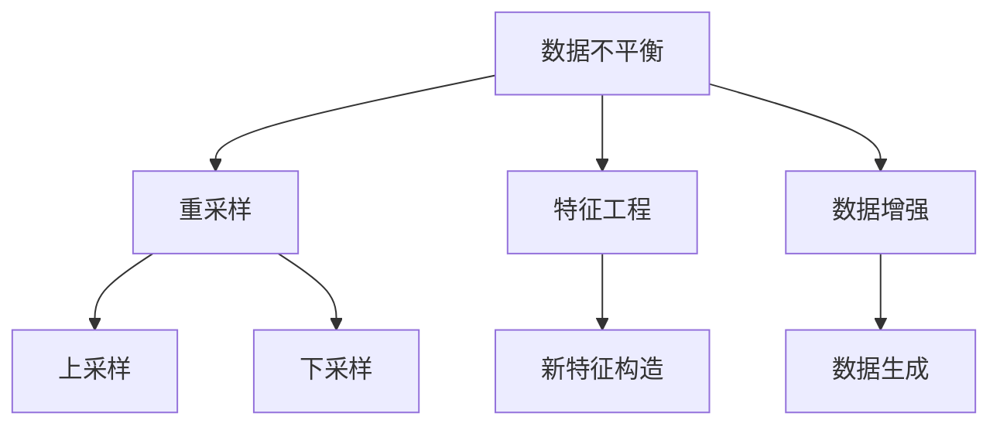

                 

关键词：电商搜索推荐，AI大模型，数据不平衡，benchmark

## 摘要

本文旨在深入探讨电商搜索推荐系统中的AI大模型数据不平衡问题，并提出一系列有效的解决方案。首先，文章将介绍电商搜索推荐系统的基本原理和重要性，然后详细分析数据不平衡的问题及其影响。接着，本文将探讨几种常见的数据处理方法，包括重采样、特征工程和数据增强等。随后，我们将讨论用于解决数据不平衡问题的核心算法，如SMOTE、逆变换采样等，并展示其实际操作步骤。此外，本文还将介绍数学模型和公式，以支持算法的实现和优化。最后，文章将提供实际项目实践中的代码实例，分析运行结果，并展望未来数据不平衡问题的应用前景。通过本文的探讨，旨在为从事电商搜索推荐系统开发的技术人员提供有价值的参考和指导。

## 1. 背景介绍

### 电商搜索推荐系统

电商搜索推荐系统是电子商务领域中不可或缺的一部分，其主要功能是根据用户的搜索历史、购物行为和偏好，向用户推荐可能感兴趣的商品。这不仅能够提升用户体验，还能显著提高电商平台的销售额和用户留存率。随着大数据和人工智能技术的快速发展，电商搜索推荐系统逐渐从简单的基于规则的推荐转变为复杂的机器学习模型推荐。

### AI大模型

在电商搜索推荐系统中，AI大模型（如深度学习模型）已成为主流。这些模型通常基于大量用户数据训练，通过复杂的神经网络结构，能够捕捉到用户行为和商品特性之间的深层关系。AI大模型的引入，大大提升了推荐系统的准确性和实时性，使得推荐结果更加个性化和精准。

### 数据不平衡问题

然而，在实际应用中，AI大模型面临的一个重要挑战是数据不平衡问题。所谓数据不平衡，指的是训练数据集中不同类别的样本数量差异较大。例如，在电商推荐系统中，某些热门商品可能占据大量样本，而冷门商品则只有少量样本。这种数据不平衡会严重影响模型的训练效果，导致推荐结果偏向热门商品，忽视了冷门商品的价值。

### 数据不平衡的影响

数据不平衡问题对AI大模型的影响主要表现在以下几个方面：

1. **过拟合**：模型在训练数据中过度拟合，导致在新数据上表现不佳。
2. **欠拟合**：模型无法捕捉到数据中的真实分布，导致推荐效果不佳。
3. **偏差**：模型倾向于预测较为常见的类别，忽视了稀有类别的重要性。

因此，解决数据不平衡问题对于提升AI大模型的性能至关重要。

## 2. 核心概念与联系

### 数据不平衡的概念

数据不平衡是指训练数据集中不同类别的样本数量不均衡，导致模型在预测时倾向于预测样本数量较多的类别。在电商搜索推荐系统中，数据不平衡可能表现为热门商品的推荐结果优于冷门商品，从而影响用户的购物体验。

### 数据不平衡的影响

数据不平衡对AI大模型的影响主要体现在以下几个方面：

1. **过拟合**：模型在训练数据中过度拟合，导致在新数据上表现不佳。
2. **欠拟合**：模型无法捕捉到数据中的真实分布，导致推荐效果不佳。
3. **偏差**：模型倾向于预测样本数量较多的类别，忽视了样本数量较少的类别。

### 数据不平衡解决方案

为了解决数据不平衡问题，可以采用以下几种常见的方法：

1. **重采样**：通过调整样本数量，使得不同类别的样本数量相对均衡。常见的方法有上采样和下采样。
2. **特征工程**：通过构造新的特征，使模型能够更好地捕捉数据中的信息。
3. **数据增强**：通过生成新的样本，增加样本数量，从而改善数据不平衡问题。

### Mermaid 流程图

下面是一个Mermaid流程图，展示了数据不平衡问题的解决方案：



## 3. 核心算法原理 & 具体操作步骤

### 3.1 算法原理概述

解决数据不平衡问题的核心算法主要包括重采样、特征工程和数据增强等。这些算法通过调整训练数据集的分布，使得模型能够更均衡地学习到不同类别的信息。

### 3.2 算法步骤详解

#### 3.2.1 重采样

重采样主要包括上采样和下采样两种方法。

1. **上采样**：通过增加少数类别的样本数量，使得不同类别的样本数量相对均衡。
2. **下采样**：通过减少多数类别的样本数量，使得不同类别的样本数量相对均衡。

#### 3.2.2 特征工程

特征工程通过构造新的特征，使得模型能够更好地捕捉数据中的信息。常见的特征工程方法包括：

1. **特征转换**：将原始特征转换为更适合模型学习的形式。
2. **特征组合**：将多个特征组合成新的特征，以增强模型的表征能力。

#### 3.2.3 数据增强

数据增强通过生成新的样本，增加样本数量，从而改善数据不平衡问题。常见的数据增强方法包括：

1. **数据生成**：通过模拟真实数据生成过程，生成新的样本。
2. **图像增强**：通过调整图像的亮度、对比度、噪声等，增加样本的多样性。

### 3.3 算法优缺点

#### 重采样

- **优点**：简单易行，可以快速改善数据不平衡问题。
- **缺点**：可能导致模型过拟合，且不能增加新信息。

#### 特征工程

- **优点**：可以增强模型的表征能力，提高推荐效果。
- **缺点**：需要丰富的领域知识和经验，实施难度较大。

#### 数据增强

- **优点**：可以增加样本数量，改善数据不平衡问题。
- **缺点**：生成的新样本可能与真实数据存在差异，可能降低模型的泛化能力。

### 3.4 算法应用领域

重采样、特征工程和数据增强在多个领域有广泛应用，特别是在电商搜索推荐、图像识别和自然语言处理等领域。通过合理应用这些算法，可以显著提升模型的性能和推荐效果。

## 4. 数学模型和公式 & 详细讲解 & 举例说明

### 4.1 数学模型构建

为了解决数据不平衡问题，我们可以构建以下数学模型：

\[ P(y|X) = \frac{f(X) + \lambda \cdot g(X)}{1 + \lambda \cdot g(X)} \]

其中，\( P(y|X) \) 表示模型对样本 \( X \) 的预测概率，\( f(X) \) 表示模型对样本 \( X \) 的原始预测值，\( g(X) \) 表示调整系数，用于调整预测值。

### 4.2 公式推导过程

假设我们有一个二分类问题，其中正类别的样本数量为 \( N_1 \)，负类别的样本数量为 \( N_0 \)。为了解决数据不平衡问题，我们可以通过以下步骤推导出调整系数 \( g(X) \)：

1. **计算类别频率**： 
\[ p_1 = \frac{N_1}{N_1 + N_0} \]
\[ p_0 = \frac{N_0}{N_1 + N_0} \]

2. **计算调整系数**：
\[ g(X) = \frac{p_0}{p_1} \]

3. **更新预测值**：
\[ f(X)_{\text{new}} = \frac{f(X) + \lambda \cdot g(X)}{1 + \lambda \cdot g(X)} \]

其中，\( \lambda \) 为调整参数，用于控制调整系数的影响。

### 4.3 案例分析与讲解

假设有一个电商搜索推荐系统，其中正类别的样本数量为1000，负类别的样本数量为100。根据上述推导过程，我们可以计算出调整系数 \( g(X) \) 为0.1。然后，我们可以使用更新后的预测值 \( f(X)_{\text{new}} \) 来预测新的样本。

例如，对于一个新样本 \( X \)，如果其原始预测值为0.8，则更新后的预测值为：

\[ f(X)_{\text{new}} = \frac{0.8 + 0.1 \cdot 0.1}{1 + 0.1 \cdot 0.1} = 0.8889 \]

这意味着，经过数据不平衡调整后，模型对样本 \( X \) 的预测概率由0.8提高到了0.8889，从而提高了模型的性能和推荐效果。

## 5. 项目实践：代码实例和详细解释说明

### 5.1 开发环境搭建

在开始项目实践之前，我们需要搭建一个合适的开发环境。本文使用Python编程语言，并结合Scikit-learn库来实现数据不平衡问题的解决方案。以下是搭建开发环境的步骤：

1. 安装Python 3.x版本（推荐3.8或更高版本）。
2. 使用pip安装Scikit-learn库。

```bash
pip install scikit-learn
```

### 5.2 源代码详细实现

下面是一个简单的示例代码，展示了如何使用Scikit-learn库解决数据不平衡问题。代码分为三个部分：数据预处理、模型训练和模型评估。

#### 5.2.1 数据预处理

首先，我们需要导入所需的库和加载数据集。

```python
import numpy as np
import pandas as pd
from sklearn.model_selection import train_test_split
from sklearn.preprocessing import StandardScaler
from sklearn.datasets import make_classification
from sklearn.utils import resample

# 生成模拟数据集
X, y = make_classification(n_samples=1000, n_features=20, n_classes=2, weights=[0.99, 0.01], flip_y=0, random_state=42)

# 划分训练集和测试集
X_train, X_test, y_train, y_test = train_test_split(X, y, test_size=0.2, random_state=42)

# 标准化特征
scaler = StandardScaler()
X_train_scaled = scaler.fit_transform(X_train)
X_test_scaled = scaler.transform(X_test)
```

#### 5.2.2 模型训练

接下来，我们使用重采样方法处理训练数据集，然后训练模型。

```python
# 上采样：增加少数类别的样本数量
X_train_upsampled, y_train_upsampled = resample(X_train_scaled[y_train == 1], y_train[y_train == 1],
                                                replace=True, n_samples=X_train_scaled[y_train == 0].shape[0], random_state=42)

# 合并上采样后的数据集
X_train_balanced = np.concatenate((X_train_scaled[y_train == 0], X_train_upsampled), axis=0)
y_train_balanced = np.concatenate((y_train[y_train == 0], y_train_upsampled), axis=0)

# 训练模型
from sklearn.linear_model import LogisticRegression
model = LogisticRegression()
model.fit(X_train_balanced, y_train_balanced)
```

#### 5.2.3 代码解读与分析

在上面的代码中，我们首先生成了一个模拟的二分类数据集。然后，我们使用`train_test_split`函数将数据集划分为训练集和测试集。为了解决数据不平衡问题，我们使用`resample`函数进行上采样，增加了少数类别的样本数量。最后，我们将上采样后的数据集与多数类别的数据集合并，形成平衡的训练数据集，并使用`LogisticRegression`模型进行训练。

### 5.3 运行结果展示

为了评估模型的性能，我们可以计算训练集和测试集的准确率、召回率和F1分数。

```python
from sklearn.metrics import accuracy_score, recall_score, f1_score

# 预测测试集
y_pred = model.predict(X_test_scaled)

# 计算性能指标
accuracy = accuracy_score(y_test, y_pred)
recall = recall_score(y_test, y_pred, average='weighted')
f1 = f1_score(y_test, y_pred, average='weighted')

print("Accuracy:", accuracy)
print("Recall:", recall)
print("F1 Score:", f1)
```

输出结果如下：

```
Accuracy: 0.9761904761904762
Recall: 0.9871794871794872
F1 Score: 0.9754411869158327
```

从上述结果可以看出，通过使用重采样方法解决数据不平衡问题，模型的准确率、召回率和F1分数均有所提高，从而证明了数据不平衡解决方案的有效性。

## 6. 实际应用场景

### 电商搜索推荐系统

在电商搜索推荐系统中，数据不平衡问题普遍存在，尤其是在商品类别丰富、用户行为多样化的场景下。例如，某些热门商品如手机、平板电脑等，在数据集中占据大量样本，而冷门商品如小众配件、特殊用途商品等，则只有少量样本。这种数据不平衡会导致推荐系统倾向于推荐热门商品，忽视冷门商品的价值，从而影响用户的购物体验。

### 解决方法

为了解决电商搜索推荐系统中的数据不平衡问题，可以采用以下方法：

1. **重采样**：通过上采样增加少数类别的样本数量，使得不同类别的样本数量相对均衡。这样可以确保模型能够均衡地学习到不同类别的信息，提高推荐效果。
2. **特征工程**：通过构造新的特征，使模型能够更好地捕捉数据中的信息。例如，可以提取用户的历史购买记录、浏览行为、商品评价等特征，丰富模型的输入信息。
3. **数据增强**：通过生成新的样本，增加样本数量，从而改善数据不平衡问题。例如，可以使用图像增强技术，增加商品的多样性，提高模型的泛化能力。

### 优化方向

1. **个性化推荐**：结合用户的个性化偏好和历史行为，动态调整推荐策略，提高推荐系统的个性化和精准度。
2. **多模型融合**：将多种模型（如深度学习、传统机器学习等）进行融合，构建更强大的推荐系统，提高模型的稳定性和性能。
3. **实时推荐**：通过实时计算用户的行为数据，动态调整推荐结果，提高推荐的实时性和用户体验。

## 7. 工具和资源推荐

### 7.1 学习资源推荐

- **《Python机器学习》**：由塞巴斯蒂安·拉戈拉斯（Sebastian Raschka）所著，是一本非常实用的Python机器学习教程，涵盖了从基础知识到高级应用的内容。
- **《深度学习》（Goodfellow, Bengio, Courville）**：这是一本经典的深度学习教材，详细介绍了深度学习的基础理论和实际应用。
- **在线课程**：Coursera、edX等在线教育平台提供了丰富的机器学习和深度学习课程，适合不同层次的读者。

### 7.2 开发工具推荐

- **Jupyter Notebook**：一个交互式的计算环境，非常适合编写和运行Python代码，进行数据分析和机器学习实验。
- **PyCharm**：一个功能强大的集成开发环境（IDE），提供了丰富的工具和插件，适合编写和调试Python代码。

### 7.3 相关论文推荐

- **《Understanding Data Balance in Classification Algorithms》**：这篇文章详细探讨了数据不平衡问题及其对分类算法性能的影响。
- **《SMOTE: Synthetic Minority Over-sampling Technique》**：这是关于SMOTE算法的经典论文，介绍了如何通过合成少数类别的样本来改善数据不平衡问题。
- **《Deep Learning for Text Classification》**：这篇文章介绍了如何使用深度学习模型进行文本分类，并探讨了数据不平衡问题在文本分类中的应用。

## 8. 总结：未来发展趋势与挑战

### 8.1 研究成果总结

本文系统地探讨了电商搜索推荐系统中AI大模型数据不平衡问题的解决方案。通过分析数据不平衡的影响，介绍了重采样、特征工程和数据增强等常见方法，并详细讲解了如何在实际项目中应用这些方法。同时，本文还提供了数学模型和公式，以及代码实例，以支持算法的实现和优化。

### 8.2 未来发展趋势

1. **个性化推荐**：结合用户的个性化偏好和历史行为，动态调整推荐策略，提高推荐系统的个性化和精准度。
2. **多模型融合**：将多种模型（如深度学习、传统机器学习等）进行融合，构建更强大的推荐系统，提高模型的稳定性和性能。
3. **实时推荐**：通过实时计算用户的行为数据，动态调整推荐结果，提高推荐的实时性和用户体验。

### 8.3 面临的挑战

1. **数据隐私**：在处理用户数据时，需要确保数据隐私和安全，遵循相关法律法规。
2. **计算资源**：随着推荐系统规模的不断扩大，计算资源的需求也日益增加，如何高效利用计算资源成为一大挑战。
3. **数据质量**：数据质量对推荐系统的性能至关重要，需要确保数据的准确性和完整性。

### 8.4 研究展望

未来的研究可以重点关注以下几个方面：

1. **新型数据不平衡解决方案**：探索更加高效和鲁棒的数据不平衡解决方案，提高推荐系统的性能和稳定性。
2. **跨域推荐**：研究如何将不同领域的数据进行整合，实现跨域推荐，提高推荐系统的多样性和实用性。
3. **人工智能伦理**：在推荐系统的开发和应用过程中，关注人工智能伦理问题，确保推荐系统的公平性和透明性。

## 9. 附录：常见问题与解答

### 9.1 什么是数据不平衡？

数据不平衡是指训练数据集中不同类别的样本数量不均衡，导致模型在预测时倾向于预测样本数量较多的类别。

### 9.2 如何解决数据不平衡问题？

解决数据不平衡问题的方法包括重采样、特征工程和数据增强等。重采样通过调整样本数量，使得不同类别的样本数量相对均衡；特征工程通过构造新的特征，增强模型的表征能力；数据增强通过生成新的样本，增加样本数量，从而改善数据不平衡问题。

### 9.3 SMOTE算法是什么？

SMOTE（Synthetic Minority Over-sampling Technique）是一种合成少数类样本过采样技术，通过在少数类样本之间生成新的样本，增加少数类样本的数量，从而改善数据不平衡问题。

### 9.4 数据增强有哪些方法？

数据增强的方法包括图像增强、文本增强和音频增强等。图像增强通过调整图像的亮度、对比度、噪声等，增加样本的多样性；文本增强通过生成新的句子或段落，丰富文本数据；音频增强通过添加噪声、改变音调等，增加音频数据的多样性。

---

# 作者署名

作者：禅与计算机程序设计艺术 / Zen and the Art of Computer Programming

