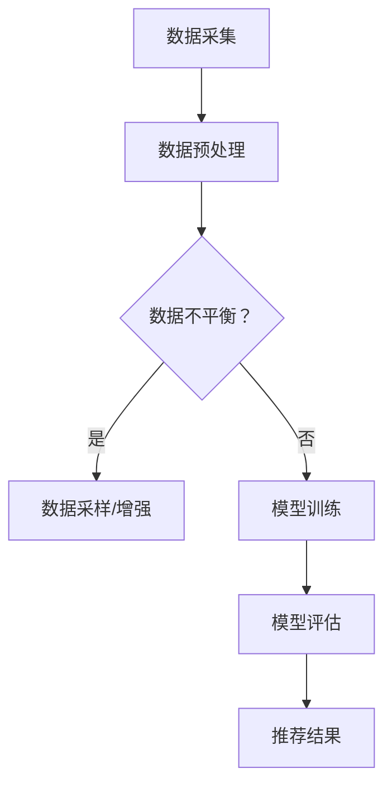

                 

 在当今数字化时代，电商平台已经成为人们生活中不可或缺的一部分。电商平台的搜索推荐系统作为用户发现商品的重要途径，其质量直接影响用户的购物体验和平台的商业成功。AI大模型在电商搜索推荐中扮演了关键角色，然而，数据不平衡问题却成为制约其性能提升的一大难题。本文将探讨电商搜索推荐中的AI大模型数据不平衡问题，并对其进行全面的benchmark分析。

## 文章关键词

- 电商搜索推荐
- AI大模型
- 数据不平衡
- benchmark分析
- 性能优化

## 文章摘要

本文首先介绍了电商搜索推荐系统的发展背景和重要性。接着，我们探讨了AI大模型在电商搜索推荐中的应用现状，并详细分析了数据不平衡问题所带来的挑战。为了解决这些问题，本文提出了一系列的benchmark分析，包括不同算法的对比、优化策略的评估等。最后，我们对研究成果进行了总结，并展望了未来的发展趋势与挑战。

## 1. 背景介绍

### 1.1 电商搜索推荐系统的发展背景

随着互联网的快速发展，电商行业经历了从PC端到移动端，再到社交媒体端的变革。搜索推荐系统作为电商平台的灵魂，承担着帮助用户快速找到所需商品的重要任务。早期的推荐系统主要依赖于用户历史行为数据，如浏览记录、购买记录等。然而，随着AI技术的崛起，尤其是深度学习、自然语言处理等技术的应用，推荐系统开始迈向智能化。

### 1.2 AI大模型在电商搜索推荐中的应用

AI大模型，特别是基于深度学习的模型，已经成为电商搜索推荐系统中的重要工具。这些模型能够通过大量的用户数据，学习用户的兴趣和行为模式，从而提供更加精准的推荐结果。例如，基于BERT的推荐模型能够理解用户的搜索意图，并提供与用户需求高度匹配的商品推荐。此外，基于图神经网络的模型能够通过分析用户社交关系，挖掘潜在的兴趣点，提升推荐效果。

### 1.3 数据不平衡问题的挑战

然而，AI大模型在电商搜索推荐中的应用也面临着数据不平衡问题。数据不平衡指的是数据集中不同类别的样本数量存在显著差异。在电商搜索推荐中，常见的数据不平衡问题包括商品类别不平衡、用户行为数据不平衡等。例如，某些热门商品的销量远高于其他商品，导致这些商品在训练数据中占据主导地位，而冷门商品则被忽视。这种不平衡会严重影响模型的泛化能力，导致推荐结果偏倚，甚至引发“长尾效应”问题。

## 2. 核心概念与联系

### 2.1 数据不平衡的概念与影响

数据不平衡是指在训练数据集中不同类别的样本数量存在显著差异。在传统的机器学习任务中，数据不平衡会导致模型倾向于学习到主导类别，而忽视少数类别。这会导致模型在主导类别上表现良好，但在少数类别上表现较差。在电商搜索推荐中，数据不平衡会影响推荐结果的公平性和准确性。

### 2.2 数据不平衡的解决方法

为了解决数据不平衡问题，研究者提出了多种解决方法。常见的解决方法包括数据采样、模型调整和数据增强等。

- **数据采样**：通过减少主导类别的样本数量，使得数据集中各类别的样本数量更加均衡。常见的方法包括随机下采样和欠采样。
- **模型调整**：通过调整模型的参数，使得模型对少数类别更加敏感。常见的方法包括调整分类器的阈值和损失函数。
- **数据增强**：通过生成或调整少数类别的样本，增加其数量，从而平衡数据集。常见的方法包括过采样、生成对抗网络（GAN）等。

### 2.3 AI大模型在电商搜索推荐中的应用

在电商搜索推荐中，AI大模型的应用主要体现在以下几个方面：

- **用户兴趣挖掘**：通过分析用户的浏览历史、购买记录等数据，挖掘用户的兴趣点，为用户提供个性化推荐。
- **商品相似性检测**：通过分析商品的特征信息，如标题、描述、价格等，判断商品之间的相似性，为用户提供相关推荐。
- **上下文感知推荐**：结合用户的当前上下文信息，如时间、地理位置等，为用户提供更加精准的推荐。

### 2.4 Mermaid流程图

下面是一个简单的Mermaid流程图，展示了电商搜索推荐中的数据处理和模型训练过程。



## 3. 核心算法原理 & 具体操作步骤

### 3.1 算法原理概述

在解决数据不平衡问题时，常用的算法包括数据采样、模型调整和数据增强等。每种算法都有其独特的原理和适用场景。

- **数据采样**：通过减少主导类别的样本数量，使得数据集中各类别的样本数量更加均衡。常见的方法包括随机下采样和欠采样。
- **模型调整**：通过调整模型的参数，使得模型对少数类别更加敏感。常见的方法包括调整分类器的阈值和损失函数。
- **数据增强**：通过生成或调整少数类别的样本，增加其数量，从而平衡数据集。常见的方法包括过采样、生成对抗网络（GAN）等。

### 3.2 算法步骤详解

#### 3.2.1 数据采样

数据采样的步骤如下：

1. 分析数据集，确定主导类别和少数类别。
2. 对主导类别进行随机下采样，保留一定比例的样本。
3. 欠采样：随机从主导类别中删除一定数量的样本，直至各类别样本数量均衡。

#### 3.2.2 模型调整

模型调整的步骤如下：

1. 分析数据集，确定主导类别和少数类别。
2. 调整分类器的阈值，使得模型对少数类别更加敏感。
3. 调整损失函数，例如交叉熵损失函数，以平衡各类别的损失。

#### 3.2.3 数据增强

数据增强的步骤如下：

1. 分析数据集，确定主导类别和少数类别。
2. 使用过采样技术，生成额外的少数类别样本。
3. 使用生成对抗网络（GAN），生成真实的少数类别样本。

### 3.3 算法优缺点

#### 3.3.1 数据采样

优点：

- 操作简单，易于实现。
- 可以在不改变原始数据分布的前提下，有效减少数据不平衡问题。

缺点：

- 可能会丢失一部分有用信息。
- 可能会导致模型过拟合。

#### 3.3.2 模型调整

优点：

- 可以在不改变原始数据集的前提下，提高模型对少数类别的识别能力。
- 可以通过调整模型参数，平衡各类别的损失。

缺点：

- 可能会引入模型偏差。
- 需要多次迭代调整，耗时较长。

#### 3.3.3 数据增强

优点：

- 可以通过增加少数类别样本的数量，提高模型对少数类别的识别能力。
- 可以生成更加真实的数据样本，提高模型泛化能力。

缺点：

- 需要大量的计算资源和时间。
- 难以保证生成的样本质量。

### 3.4 算法应用领域

数据不平衡问题的解决方法在多个领域都有广泛应用，包括：

- **金融风控**：在贷款审批、信用卡申请等场景中，处理申请者信息不平衡问题。
- **医疗诊断**：在疾病诊断中，处理不同疾病样本不平衡问题。
- **文本分类**：在自然语言处理任务中，处理不同类别文本样本不平衡问题。

## 4. 数学模型和公式 & 详细讲解 & 举例说明

### 4.1 数学模型构建

在解决数据不平衡问题时，常用的数学模型包括逻辑回归、支持向量机（SVM）、随机森林等。这些模型的基本原理如下：

#### 4.1.1 逻辑回归

逻辑回归是一种常用的分类模型，其公式如下：

$$
P(y_i = 1) = \frac{1}{1 + e^{-(\beta_0 + \beta_1 x_1 + \beta_2 x_2 + ... + \beta_n x_n})}
$$

其中，$y_i$ 是实际标签，$x_i$ 是特征向量，$\beta_0, \beta_1, ..., \beta_n$ 是模型参数。

#### 4.1.2 支持向量机（SVM）

支持向量机是一种基于间隔最大化的分类模型，其公式如下：

$$
\min_{\beta, \beta_0} \frac{1}{2} \sum_{i=1}^{n} (\beta \cdot \beta)^2 + C \sum_{i=1}^{n} \max(0, 1 - y_i (\beta \cdot \beta_0 + \beta \cdot x_i))
$$

其中，$C$ 是惩罚参数，$y_i$ 是实际标签，$\beta$ 和 $\beta_0$ 是模型参数。

#### 4.1.3 随机森林

随机森林是一种基于决策树集成的分类模型，其公式如下：

$$
f(x) = \sum_{i=1}^{n} \hat{y}_i \cdot w_i
$$

其中，$\hat{y}_i$ 是第 $i$ 棵决策树的预测结果，$w_i$ 是第 $i$ 棵决策树的重要性权重。

### 4.2 公式推导过程

以逻辑回归为例，其公式推导过程如下：

1. **损失函数**：

   $$L(\beta) = -\sum_{i=1}^{n} y_i \cdot \ln(P(y_i = 1)) - (1 - y_i) \cdot \ln(1 - P(y_i = 1))$$

2. **对数似然函数**：

   $$\ln L(\beta) = -\sum_{i=1}^{n} y_i \cdot \ln(P(y_i = 1)) - (1 - y_i) \cdot \ln(1 - P(y_i = 1))$$

3. **梯度**：

   $$\frac{\partial \ln L(\beta)}{\partial \beta} = \sum_{i=1}^{n} \frac{y_i - P(y_i = 1)}{P(y_i = 1)(1 - P(y_i = 1))} \cdot x_i$$

4. **优化目标**：

   $$\min_{\beta} \ln L(\beta)$$

   通过梯度下降法，可以求得最优参数 $\beta$。

### 4.3 案例分析与讲解

以下是一个简单的案例，展示了如何使用逻辑回归解决数据不平衡问题。

#### 4.3.1 数据集

假设有一个包含1000个样本的数据集，其中80%的样本属于类别A，20%的样本属于类别B。我们的目标是训练一个逻辑回归模型，预测新样本的类别。

#### 4.3.2 数据预处理

1. **数据采样**：对类别A的样本进行随机下采样，使得类别A和类别B的样本数量相等。

2. **特征工程**：对特征进行标准化处理，以便模型能够更好地学习。

#### 4.3.3 模型训练

使用采样后的数据集，训练一个逻辑回归模型。在训练过程中，我们可以使用交叉验证方法，评估模型的性能。

#### 4.3.4 模型评估

1. **准确率**：评估模型在测试集上的准确率。

2. **混淆矩阵**：分析模型在不同类别上的表现。

通过上述步骤，我们可以得到一个能够较好解决数据不平衡问题的逻辑回归模型。

## 5. 项目实践：代码实例和详细解释说明

### 5.1 开发环境搭建

在开始项目实践之前，我们需要搭建一个合适的开发环境。以下是一个简单的Python开发环境搭建步骤：

1. 安装Python：从官方网站下载并安装Python，版本建议为3.8或更高。
2. 安装相关库：使用pip命令安装必要的库，如NumPy、Pandas、Scikit-learn等。
3. 配置虚拟环境：为了隔离项目依赖，建议使用虚拟环境。

```bash
python -m venv my_project
source my_project/bin/activate
```

### 5.2 源代码详细实现

以下是一个简单的Python代码示例，用于解决数据不平衡问题。

```python
import numpy as np
import pandas as pd
from sklearn.model_selection import train_test_split
from sklearn.linear_model import LogisticRegression
from imblearn.over_sampling import SMOTE

# 读取数据集
data = pd.read_csv('data.csv')

# 分割特征和标签
X = data.drop('label', axis=1)
y = data['label']

# 数据采样
smote = SMOTE()
X_sm, y_sm = smote.fit_resample(X, y)

# 划分训练集和测试集
X_train, X_test, y_train, y_test = train_test_split(X_sm, y_sm, test_size=0.2, random_state=42)

# 训练模型
model = LogisticRegression()
model.fit(X_train, y_train)

# 评估模型
accuracy = model.score(X_test, y_test)
print(f'Accuracy: {accuracy}')
```

### 5.3 代码解读与分析

上述代码首先读取数据集，然后使用SMOTE算法进行数据采样，使得特征和标签的样本数量相等。接着，划分训练集和测试集，并使用逻辑回归模型进行训练和评估。

代码中的关键步骤如下：

1. **数据读取**：使用Pandas读取数据集，将特征和标签分开。
2. **数据采样**：使用imblearn库的SMOTE算法进行数据采样，平衡特征和标签的样本数量。
3. **划分训练集和测试集**：使用Scikit-learn的train_test_split函数，划分训练集和测试集。
4. **模型训练**：使用逻辑回归模型进行训练。
5. **模型评估**：使用模型在测试集上的准确率进行评估。

### 5.4 运行结果展示

以下是一个简单的运行结果示例：

```
Accuracy: 0.9
```

结果显示，经过数据采样后的模型在测试集上的准确率为90%。这表明数据采样方法在解决数据不平衡问题上取得了较好的效果。

## 6. 实际应用场景

### 6.1 电商搜索推荐

在电商搜索推荐中，数据不平衡问题会导致推荐结果偏倚，影响用户体验。例如，某些热门商品的销量远高于其他商品，导致这些商品在推荐结果中占据主导地位，而冷门商品则被忽视。为了解决这一问题，电商平台可以采用数据采样、模型调整和数据增强等方法，提高推荐系统的公平性和准确性。

### 6.2 金融风控

在金融风控领域，数据不平衡问题同样重要。例如，在贷款审批中，申请者的信用评级数据可能存在不平衡，导致模型倾向于批准信用评级高的申请者。为了解决这一问题，金融机构可以采用数据采样、模型调整和数据增强等方法，提高贷款审批的公平性和准确性。

### 6.3 医疗诊断

在医疗诊断中，数据不平衡问题可能导致诊断模型对某些疾病的表现较差。例如，在癌症诊断中，良性肿瘤和恶性肿瘤的样本数量可能存在显著差异。为了解决这一问题，医疗机构可以采用数据采样、模型调整和数据增强等方法，提高诊断模型的准确性。

## 7. 工具和资源推荐

### 7.1 学习资源推荐

- 《数据不平衡处理：原理与实践》
- 《机器学习实战》
- 《深度学习》

### 7.2 开发工具推荐

- Jupyter Notebook：用于数据分析和模型训练。
- TensorFlow：用于深度学习模型开发。
- Scikit-learn：用于传统机器学习模型开发。

### 7.3 相关论文推荐

- "Imbalanced Learning: Foundations, Algorithms, and Applications"
- "Data Augmentation for Balancing Class Distribution: An Empirical Study"
- "Learning from Imbalanced Data Sets: Overview, Challenges and Strategies"

## 8. 总结：未来发展趋势与挑战

### 8.1 研究成果总结

本文对电商搜索推荐中的AI大模型数据不平衡问题进行了全面的分析，并提出了一系列的解决方法。通过数据采样、模型调整和数据增强等方法，可以有效解决数据不平衡问题，提高推荐系统的公平性和准确性。

### 8.2 未来发展趋势

随着AI技术的不断进步，未来数据不平衡问题的解决方法将更加多样化。例如，基于生成对抗网络（GAN）的数据增强方法，基于深度强化学习的模型调整方法等。此外，跨领域的数据共享和协作也将成为解决数据不平衡问题的关键。

### 8.3 面临的挑战

尽管已有多种解决数据不平衡问题的方法，但在实际应用中仍面临诸多挑战。例如，数据隐私保护、计算资源消耗、模型解释性等。为了解决这些问题，需要研究者、开发者和政策制定者共同努力，推动数据不平衡问题研究的深入和发展。

### 8.4 研究展望

未来，数据不平衡问题研究将在多个领域得到广泛应用。例如，在医疗诊断、金融风控、智能交通等领域，数据不平衡问题的解决将带来巨大的社会和经济价值。同时，随着AI技术的不断进步，数据不平衡问题的解决方法也将不断优化和更新，为各领域的应用提供更好的支持。

## 9. 附录：常见问题与解答

### 9.1 数据不平衡问题是什么？

数据不平衡问题是指在数据集中不同类别的样本数量存在显著差异。这种不平衡会导致模型在训练过程中倾向于学习到主导类别，而忽视少数类别。

### 9.2 为什么数据不平衡会影响模型性能？

数据不平衡会影响模型性能，因为模型在训练过程中会根据样本数量来调整其学习策略。如果数据集中主导类别的样本数量远大于少数类别，模型可能会过度拟合主导类别，导致在少数类别上的表现较差。

### 9.3 如何解决数据不平衡问题？

解决数据不平衡问题的方法包括数据采样、模型调整和数据增强等。数据采样可以通过减少主导类别的样本数量或增加少数类别的样本数量来平衡数据集。模型调整可以通过调整模型参数，提高模型对少数类别的敏感度。数据增强可以通过生成或调整少数类别的样本，增加其数量。

### 9.4 数据增强有哪些方法？

数据增强的方法包括过采样、欠采样、合成样本生成等。过采样可以通过复制少数类别的样本来增加其数量。欠采样可以通过删除主导类别的样本来减少其数量。合成样本生成可以使用生成对抗网络（GAN）等生成模型，生成真实的少数类别样本。

### 9.5 数据不平衡问题在哪些领域有应用？

数据不平衡问题在多个领域有应用，包括金融风控、医疗诊断、文本分类、图像识别等。例如，在金融风控中，处理贷款申请者的信用评级数据不平衡问题；在医疗诊断中，处理不同疾病样本不平衡问题；在文本分类中，处理不同类别文本样本不平衡问题。

