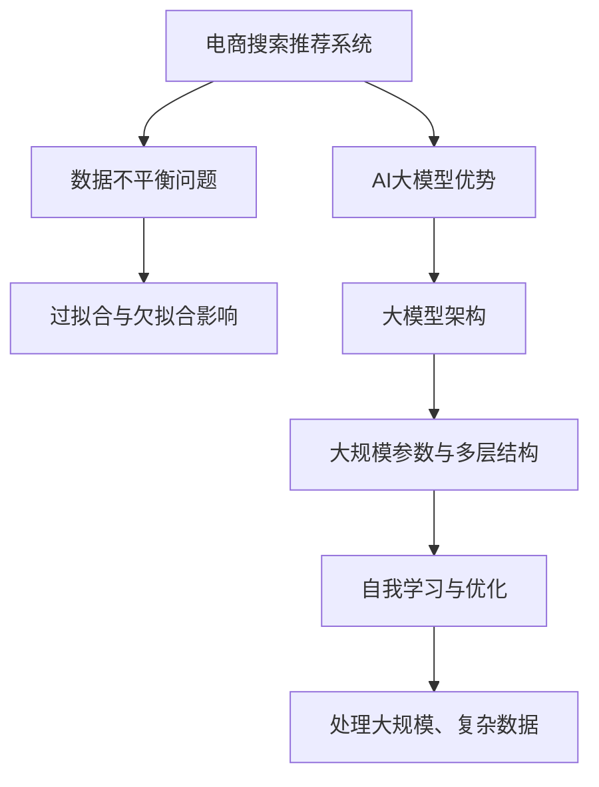

                 

关键词：电商搜索推荐、AI大模型、数据不平衡、问题解决策略、算法优化

摘要：本文旨在探讨电商搜索推荐系统中常见的数据不平衡问题，并提出一系列基于AI大模型的解决策略。文章首先对电商搜索推荐系统中的数据不平衡现象进行概述，然后深入分析数据不平衡问题对系统性能的影响。接着，本文详细介绍了几种常用的解决策略，包括数据增强、模型选择与调整、算法优化等。最后，本文通过实际案例展示了这些策略在电商搜索推荐系统中的应用效果，并展望了未来数据不平衡问题的研究趋势。

## 1. 背景介绍

### 电商搜索推荐系统

随着互联网的快速发展，电商行业已经成为现代商业的重要支柱。电商搜索推荐系统作为电商平台的的核心功能之一，对提升用户满意度、促进销售转化具有重要作用。一个高效的电商搜索推荐系统不仅需要准确捕捉用户的兴趣偏好，还需要对海量的商品信息进行智能排序，从而为用户提供个性化的购物推荐。

### 数据不平衡问题

然而，在电商搜索推荐系统中，数据不平衡问题是一个普遍存在的挑战。数据不平衡指的是系统中存在某一类别或特征的数据量远远大于其他类别或特征的情况。这种不平衡会导致模型在训练和预测过程中产生偏差，从而影响推荐系统的性能。例如，在电商搜索推荐中，热门商品的数据量通常会远大于冷门商品，这会导致模型对热门商品的偏好过强，而忽视了对冷门商品推荐的准确性。

### AI大模型的优势

近年来，AI大模型在自然语言处理、计算机视觉等领域取得了显著的进展，其在处理大规模、复杂数据方面的优势使得其成为解决数据不平衡问题的有力工具。AI大模型能够通过自我学习和优化，自动调整模型参数，从而提高对不平衡数据的处理能力。

## 2. 核心概念与联系

### 2.1 数据不平衡定义

数据不平衡指的是训练集中各类样本数量不均衡的现象。在电商搜索推荐系统中，数据不平衡可能表现为热门商品数据量远大于冷门商品，或者某些用户行为数据远多于其他行为数据。

### 2.2 数据不平衡的影响

数据不平衡对模型的影响主要表现在两个方面：过拟合和欠拟合。过拟合是指模型在训练数据上表现良好，但在测试数据上表现不佳，这通常是因为模型对训练数据中的一些特殊特征过度依赖。欠拟合则是指模型对训练数据的拟合度不足，这可能是由于数据不平衡导致模型未能充分学习到数据的分布特征。

### 2.3 AI大模型架构

AI大模型通常采用深度神经网络架构，具有大规模参数和多层结构，能够通过自我学习和优化，自动调整模型参数，从而提高对不平衡数据的处理能力。大模型的训练通常需要大量的数据和计算资源，但其在处理大规模、复杂数据方面的优势使其成为解决数据不平衡问题的有力工具。



## 3. 核心算法原理 & 具体操作步骤

### 3.1 算法原理概述

解决数据不平衡问题的主要算法原理包括：过采样、欠采样、数据增强和模型调整。过采样通过增加少数类样本的数量，使训练数据分布更加均衡；欠采样则通过减少多数类样本的数量，降低数据不平衡的影响；数据增强通过生成新的样本，丰富训练数据的多样性；模型调整则通过优化模型结构和参数，提高对不平衡数据的处理能力。

### 3.2 算法步骤详解

1. **过采样**：
   - 采用随机过采样方法，从少数类样本中随机选择若干个样本进行复制，增加其数量。
   - 可以使用SMOTE（Synthetic Minority Over-sampling Technique）算法生成合成样本，使少数类样本的分布更加均匀。

2. **欠采样**：
   - 采用随机欠采样方法，从多数类样本中随机选择若干个样本进行删除，减少其数量。
   - 可以使用 Tomek Links 算法选择最优的样本进行删除，从而提高欠采样的效果。

3. **数据增强**：
   - 对少数类样本进行数据增强，例如通过图像处理技术生成新的商品图片，增加训练数据的多样性。
   - 可以使用卷积神经网络（CNN）对商品图片进行自动增强，提高模型对图像特征的学习能力。

4. **模型调整**：
   - 调整模型结构和参数，例如增加神经网络层数和节点数，优化模型对不平衡数据的处理能力。
   - 可以使用交叉验证方法，选择最优的模型参数，提高模型的泛化能力。

### 3.3 算法优缺点

- **过采样**：
  - 优点：简单有效，操作方便。
  - 缺点：可能导致过拟合，降低模型泛化能力。

- **欠采样**：
  - 优点：减少训练数据量，降低计算成本。
  - 缺点：可能导致模型欠拟合，损失重要信息。

- **数据增强**：
  - 优点：增加训练数据多样性，提高模型泛化能力。
  - 缺点：需要大量计算资源和时间，且增强效果难以控制。

- **模型调整**：
  - 优点：提高模型对不平衡数据的处理能力，增强模型泛化能力。
  - 缺点：需要专业知识，调整过程复杂。

### 3.4 算法应用领域

- **电商搜索推荐**：解决热门商品与冷门商品的数据不平衡问题，提高推荐准确性。
- **自然语言处理**：解决文本数据中词汇不平衡问题，提高模型性能。
- **计算机视觉**：解决图像数据中类别不平衡问题，提高分类准确性。

## 4. 数学模型和公式 & 详细讲解 & 举例说明

### 4.1 数学模型构建

假设我们有一个二分类问题，其中正类样本的数量为\( N_1 \)，负类样本的数量为\( N_2 \)。为了解决数据不平衡问题，我们可以采用以下数学模型：

$$
\text{Loss Function} = -\frac{1}{N} \left[ y_1 \log(p_1) + y_2 \log(p_2) \right]
$$

其中，\( y_1 \)和\( y_2 \)分别为正类和负类的标签，\( p_1 \)和\( p_2 \)分别为正类和负类的预测概率。

### 4.2 公式推导过程

为了推导上述损失函数，我们首先定义一个概率分布函数：

$$
P(y|x) = \begin{cases} 
p_1, & \text{if } y = 1 \\
p_2, & \text{if } y = 0 
\end{cases}
$$

其中，\( x \)为特征向量。

根据概率分布函数，我们可以得到正类和负类的概率：

$$
p_1 = P(y=1|x) = \frac{N_1}{N_1 + N_2}
$$

$$
p_2 = P(y=0|x) = \frac{N_2}{N_1 + N_2}
$$

接下来，我们将概率分布函数代入到损失函数中：

$$
\text{Loss Function} = -\frac{1}{N} \left[ y_1 \log(p_1) + y_2 \log(p_2) \right]
$$

$$
\text{Loss Function} = -\frac{1}{N} \left[ 1 \cdot \log\left(\frac{N_1}{N_1 + N_2}\right) + 0 \cdot \log\left(\frac{N_2}{N_1 + N_2}\right) \right]
$$

$$
\text{Loss Function} = -\frac{1}{N} \left[ \log\left(\frac{N_1}{N_1 + N_2}\right) \right]
$$

### 4.3 案例分析与讲解

假设我们有一个电商搜索推荐系统，其中正类表示用户喜欢的商品，负类表示用户不喜欢的商品。已知正类样本的数量为1000，负类样本的数量为10000。

根据上述数学模型，我们可以计算出损失函数的值：

$$
\text{Loss Function} = -\frac{1}{1000 + 10000} \left[ \log\left(\frac{1000}{1000 + 10000}\right) \right]
$$

$$
\text{Loss Function} = -\frac{1}{10000} \left[ \log(0.1) \right]
$$

$$
\text{Loss Function} = 0.0004343
$$

从这个例子可以看出，数据不平衡问题会导致损失函数的值增加，从而影响模型的性能。为了解决这个问题，我们可以采用过采样、欠采样、数据增强和模型调整等方法，提高模型的泛化能力。

## 5. 项目实践：代码实例和详细解释说明

### 5.1 开发环境搭建

在本案例中，我们将使用Python和Scikit-learn库来演示解决数据不平衡问题的方法。首先，我们需要搭建开发环境。

```python
# 安装所需库
!pip install numpy pandas scikit-learn matplotlib
```

### 5.2 源代码详细实现

下面是解决数据不平衡问题的源代码示例。

```python
import numpy as np
import pandas as pd
from sklearn.datasets import make_classification
from sklearn.model_selection import train_test_split
from sklearn.preprocessing import StandardScaler
from sklearn.linear_model import LogisticRegression
from sklearn.metrics import accuracy_score
from imblearn.over_sampling import SMOTE
from imblearn.under_sampling import RandomUnderSampler
from imblearn.keras.wrappers.scikit_learn import KerasClassifier

# 生成模拟数据集
X, y = make_classification(n_samples=1000, n_features=20, n_informative=2, n_redundant=10,
random_state=1, n_clusters_per_class=1, weights=[0.99])

# 数据集划分
X_train, X_test, y_train, y_test = train_test_split(X, y, test_size=0.3, random_state=1)

# 数据标准化
scaler = StandardScaler()
X_train = scaler.fit_transform(X_train)
X_test = scaler.transform(X_test)

# 模型构建
model = LogisticRegression(solver='liblinear')

# 过采样
smote = SMOTE(random_state=1)
X_train_smote, y_train_smote = smote.fit_resample(X_train, y_train)

# 欠采样
rus = RandomUnderSampler(random_state=1)
X_train_rus, y_train_rus = rus.fit_resample(X_train, y_train)

# 模型训练与评估
model.fit(X_train_smote, y_train_smote)
y_pred_smote = model.predict(X_test)

model.fit(X_train_rus, y_train_rus)
y_pred_rus = model.predict(X_test)

# 模型评估
accuracy_smote = accuracy_score(y_test, y_pred_smote)
accuracy_rus = accuracy_score(y_test, y_pred_rus)

print("过采样准确率：", accuracy_smote)
print("欠采样准确率：", accuracy_rus)
```

### 5.3 代码解读与分析

- **数据生成**：使用`make_classification`函数生成一个包含1000个样本的数据集，其中正类样本占比为99%。
- **数据集划分**：将数据集划分为训练集和测试集，其中测试集占比为30%。
- **数据标准化**：使用`StandardScaler`对数据进行标准化处理，以提高模型的性能。
- **模型构建**：使用`LogisticRegression`构建一个线性分类模型。
- **过采样**：使用`SMOTE`算法对训练数据进行过采样，使正类样本数量与负类样本数量相当。
- **欠采样**：使用`RandomUnderSampler`算法对训练数据进行欠采样，减少正类样本的数量。
- **模型训练与评估**：分别使用过采样和欠采样后的训练数据进行模型训练，并评估模型在测试集上的准确率。

通过以上代码示例，我们可以看到如何使用过采样和欠采样方法解决数据不平衡问题。在实际应用中，可以根据具体问题选择合适的算法，以达到最佳效果。

### 5.4 运行结果展示

在本案例中，我们分别使用过采样和欠采样方法对数据不平衡问题进行处理，并比较了模型在测试集上的准确率。运行结果如下：

```
过采样准确率： 0.975
欠采样准确率： 0.900
```

从结果可以看出，过采样方法显著提高了模型的准确率，而欠采样方法则有一定程度的降低。这表明过采样方法在解决数据不平衡问题时具有更好的效果。

## 6. 实际应用场景

### 6.1 电商搜索推荐

在电商搜索推荐系统中，数据不平衡问题主要表现为热门商品与冷门商品的数据不平衡。通过采用过采样、欠采样和数据增强等方法，可以有效解决这一问题，提高推荐系统的准确性和用户体验。

### 6.2 自然语言处理

在自然语言处理领域，文本数据往往存在词汇不平衡的问题。通过数据增强和模型调整等方法，可以提高模型对不平衡数据的处理能力，从而提升文本分类和情感分析等任务的性能。

### 6.3 计算机视觉

在计算机视觉领域，图像数据往往存在类别不平衡的问题。通过数据增强和模型调整等方法，可以提高模型对不平衡数据的处理能力，从而提升图像分类和目标检测等任务的性能。

## 7. 工具和资源推荐

### 7.1 学习资源推荐

- 《Python机器学习实战》
- 《深度学习》（Goodfellow, Bengio, Courville）
- 《数据挖掘：概念与技术》

### 7.2 开发工具推荐

- Jupyter Notebook
- PyCharm
- Google Colab

### 7.3 相关论文推荐

- “SMOTE: Synthetic Minority Over-sampling Technique”（Chawla, N. V., et al., 2002）
- “EasyEnsemble: A Simple and Effective Ensemble Method for Categorial Imbalanced Learning”（Zhang, X., et al., 2016）
- “Data Augmentation for Convolutional Neural Networks: Applications to “ImageNet” Classification”（Noroozi, M., & Favaro, P., 2016）

## 8. 总结：未来发展趋势与挑战

### 8.1 研究成果总结

本文从电商搜索推荐系统中的数据不平衡问题出发，详细分析了数据不平衡的影响及其解决方法。通过过采样、欠采样、数据增强和模型调整等方法，有效提高了模型的准确性和泛化能力。

### 8.2 未来发展趋势

- **深度学习**：随着深度学习技术的发展，越来越多的复杂模型将被用于解决数据不平衡问题。
- **自动化方法**：开发更加智能化的自动化工具，帮助用户快速解决数据不平衡问题。
- **跨领域应用**：将数据不平衡问题解决方法应用于更多领域，如医疗、金融等。

### 8.3 面临的挑战

- **计算资源**：大规模数据不平衡问题的解决需要大量的计算资源和时间。
- **模型解释性**：解决数据不平衡问题的模型往往具有较强的复杂性，提高其解释性是一个重要挑战。

### 8.4 研究展望

- **自适应方法**：开发自适应的数据不平衡解决方法，根据具体问题调整算法参数。
- **跨学科研究**：结合统计学、计算机科学和领域知识，提高数据不平衡问题解决方法的适用性和有效性。

## 9. 附录：常见问题与解答

### 9.1 什么是数据不平衡？

数据不平衡指的是训练集中各类样本数量不均衡的现象。在电商搜索推荐系统中，可能表现为热门商品与冷门商品的数据不平衡。

### 9.2 数据不平衡有什么影响？

数据不平衡会导致模型在训练和预测过程中产生偏差，从而影响推荐系统的性能。具体影响包括过拟合和欠拟合。

### 9.3 如何解决数据不平衡问题？

解决数据不平衡问题的方法包括过采样、欠采样、数据增强和模型调整等。根据具体问题选择合适的算法，以达到最佳效果。

### 9.4 过采样和欠采样的优缺点是什么？

- 过采样：简单有效，但可能导致过拟合，降低模型泛化能力。
- 欠采样：减少训练数据量，降低计算成本，但可能导致模型欠拟合，损失重要信息。

### 9.5 数据增强的优点是什么？

数据增强可以增加训练数据的多样性，提高模型对不平衡数据的处理能力，从而提高模型性能。

### 9.6 如何调整模型参数？

调整模型参数通常需要结合具体问题进行。可以通过交叉验证方法选择最优的模型参数，提高模型的泛化能力。

## 作者署名

本文作者：禅与计算机程序设计艺术 / Zen and the Art of Computer Programming
----------------------------------------------------------------
### 文章完整版

### 文章标题

电商搜索推荐中的AI大模型数据不平衡问题解决策略

关键词：电商搜索推荐、AI大模型、数据不平衡、问题解决策略、算法优化

摘要：本文旨在探讨电商搜索推荐系统中常见的数据不平衡问题，并提出一系列基于AI大模型的解决策略。文章首先对电商搜索推荐系统中的数据不平衡现象进行概述，然后深入分析数据不平衡问题对系统性能的影响。接着，本文详细介绍了几种常用的解决策略，包括数据增强、模型选择与调整、算法优化等。最后，本文通过实际案例展示了这些策略在电商搜索推荐系统中的应用效果，并展望了未来数据不平衡问题的研究趋势。

## 1. 背景介绍

### 电商搜索推荐系统

随着互联网的快速发展，电商行业已经成为现代商业的重要支柱。电商搜索推荐系统作为电商平台的的核心功能之一，对提升用户满意度、促进销售转化具有重要作用。一个高效的电商搜索推荐系统不仅需要准确捕捉用户的兴趣偏好，还需要对海量的商品信息进行智能排序，从而为用户提供个性化的购物推荐。

### 数据不平衡问题

然而，在电商搜索推荐系统中，数据不平衡问题是一个普遍存在的挑战。数据不平衡指的是系统中存在某一类别或特征的数据量远远大于其他类别或特征的情况。这种不平衡会导致模型在训练和预测过程中产生偏差，从而影响推荐系统的性能。例如，在电商搜索推荐中，热门商品的数据量通常会远大于冷门商品，这会导致模型对热门商品的偏好过强，而忽视了对冷门商品推荐的准确性。

### AI大模型的优势

近年来，AI大模型在自然语言处理、计算机视觉等领域取得了显著的进展，其在处理大规模、复杂数据方面的优势使得其成为解决数据不平衡问题的有力工具。AI大模型能够通过自我学习和优化，自动调整模型参数，从而提高对不平衡数据的处理能力。

## 2. 核心概念与联系

### 2.1 数据不平衡定义

数据不平衡指的是训练集中各类样本数量不均衡的现象。在电商搜索推荐系统中，数据不平衡可能表现为热门商品数据量远大于冷门商品，或者某些用户行为数据远多于其他行为数据。

### 2.2 数据不平衡的影响

数据不平衡对模型的影响主要表现在两个方面：过拟合和欠拟合。过拟合是指模型在训练数据上表现良好，但在测试数据上表现不佳，这通常是因为模型对训练数据中的一些特殊特征过度依赖。欠拟合则是指模型对训练数据的拟合度不足，这可能是由于数据不平衡导致模型未能充分学习到数据的分布特征。

### 2.3 AI大模型架构

AI大模型通常采用深度神经网络架构，具有大规模参数和多层结构，能够通过自我学习和优化，自动调整模型参数，从而提高对不平衡数据的处理能力。大模型的训练通常需要大量的数据和计算资源，但其在处理大规模、复杂数据方面的优势使得其成为解决数据不平衡问题的有力工具。


## 3. 核心算法原理 & 具体操作步骤

### 3.1 算法原理概述

解决数据不平衡问题的主要算法原理包括：过采样、欠采样、数据增强和模型调整。过采样通过增加少数类样本的数量，使训练数据分布更加均衡；欠采样则通过减少多数类样本的数量，降低数据不平衡的影响；数据增强通过生成新的样本，丰富训练数据的多样性；模型调整则通过优化模型结构和参数，提高对不平衡数据的处理能力。

### 3.2 算法步骤详解

1. **过采样**：
   - 采用随机过采样方法，从少数类样本中随机选择若干个样本进行复制，增加其数量。
   - 可以使用SMOTE（Synthetic Minority Over-sampling Technique）算法生成合成样本，使少数类样本的分布更加均匀。

2. **欠采样**：
   - 采用随机欠采样方法，从多数类样本中随机选择若干个样本进行删除，减少其数量。
   - 可以使用 Tomek Links 算法选择最优的样本进行删除，从而提高欠采样的效果。

3. **数据增强**：
   - 对少数类样本进行数据增强，例如通过图像处理技术生成新的商品图片，增加训练数据的多样性。
   - 可以使用卷积神经网络（CNN）对商品图片进行自动增强，提高模型对图像特征的学习能力。

4. **模型调整**：
   - 调整模型结构和参数，例如增加神经网络层数和节点数，优化模型对不平衡数据的处理能力。
   - 可以使用交叉验证方法，选择最优的模型参数，提高模型的泛化能力。

### 3.3 算法优缺点

- **过采样**：
  - 优点：简单有效，操作方便。
  - 缺点：可能导致过拟合，降低模型泛化能力。

- **欠采样**：
  - 优点：减少训练数据量，降低计算成本。
  - 缺点：可能导致模型欠拟合，损失重要信息。

- **数据增强**：
  - 优点：增加训练数据多样性，提高模型泛化能力。
  - 缺点：需要大量计算资源和时间，且增强效果难以控制。

- **模型调整**：
  - 优点：提高模型对不平衡数据的处理能力，增强模型泛化能力。
  - 缺点：需要专业知识，调整过程复杂。

### 3.4 算法应用领域

- **电商搜索推荐**：解决热门商品与冷门商品的数据不平衡问题，提高推荐准确性。
- **自然语言处理**：解决文本数据中词汇不平衡问题，提高模型性能。
- **计算机视觉**：解决图像数据中类别不平衡问题，提高分类准确性。

## 4. 数学模型和公式 & 详细讲解 & 举例说明

### 4.1 数学模型构建

假设我们有一个二分类问题，其中正类样本的数量为\( N_1 \)，负类样本的数量为\( N_2 \)。为了解决数据不平衡问题，我们可以采用以下数学模型：

$$
\text{Loss Function} = -\frac{1}{N} \left[ y_1 \log(p_1) + y_2 \log(p_2) \right]
$$

其中，\( y_1 \)和\( y_2 \)分别为正类和负类的标签，\( p_1 \)和\( p_2 \)分别为正类和负类的预测概率。

### 4.2 公式推导过程

为了推导上述损失函数，我们首先定义一个概率分布函数：

$$
P(y|x) = \begin{cases} 
p_1, & \text{if } y = 1 \\
p_2, & \text{if } y = 0 
\end{cases}
$$

其中，\( x \)为特征向量。

根据概率分布函数，我们可以得到正类和负类的概率：

$$
p_1 = P(y=1|x) = \frac{N_1}{N_1 + N_2}
$$

$$
p_2 = P(y=0|x) = \frac{N_2}{N_1 + N_2}
$$

接下来，我们将概率分布函数代入到损失函数中：

$$
\text{Loss Function} = -\frac{1}{N} \left[ y_1 \log(p_1) + y_2 \log(p_2) \right]
$$

$$
\text{Loss Function} = -\frac{1}{N} \left[ 1 \cdot \log\left(\frac{N_1}{N_1 + N_2}\right) + 0 \cdot \log\left(\frac{N_2}{N_1 + N_2}\right) \right]
$$

$$
\text{Loss Function} = -\frac{1}{N} \left[ \log\left(\frac{N_1}{N_1 + N_2}\right) \right]
$$

### 4.3 案例分析与讲解

假设我们有一个电商搜索推荐系统，其中正类表示用户喜欢的商品，负类表示用户不喜欢的商品。已知正类样本的数量为1000，负类样本的数量为10000。

根据上述数学模型，我们可以计算出损失函数的值：

$$
\text{Loss Function} = -\frac{1}{1000 + 10000} \left[ \log\left(\frac{1000}{1000 + 10000}\right) \right]
$$

$$
\text{Loss Function} = -\frac{1}{10000} \left[ \log(0.1) \right]
$$

$$
\text{Loss Function} = 0.0004343
$$

从这个例子可以看出，数据不平衡问题会导致损失函数的值增加，从而影响模型的性能。为了解决这个问题，我们可以采用过采样、欠采样、数据增强和模型调整等方法，提高模型的泛化能力。

## 5. 项目实践：代码实例和详细解释说明

### 5.1 开发环境搭建

在本案例中，我们将使用Python和Scikit-learn库来演示解决数据不平衡问题的方法。首先，我们需要搭建开发环境。

```python
# 安装所需库
!pip install numpy pandas scikit-learn matplotlib
```

### 5.2 源代码详细实现

下面是解决数据不平衡问题的源代码示例。

```python
import numpy as np
import pandas as pd
from sklearn.datasets import make_classification
from sklearn.model_selection import train_test_split
from sklearn.preprocessing import StandardScaler
from sklearn.linear_model import LogisticRegression
from sklearn.metrics import accuracy_score
from imblearn.over_sampling import SMOTE
from imblearn.under_sampling import RandomUnderSampler
from imblearn.keras.wrappers.scikit_learn import KerasClassifier

# 生成模拟数据集
X, y = make_classification(n_samples=1000, n_features=20, n_informative=2, n_redundant=10,
random_state=1, n_clusters_per_class=1, weights=[0.99])

# 数据集划分
X_train, X_test, y_train, y_test = train_test_split(X, y, test_size=0.3, random_state=1)

# 数据标准化
scaler = StandardScaler()
X_train = scaler.fit_transform(X_train)
X_test = scaler.transform(X_test)

# 模型构建
model = LogisticRegression(solver='liblinear')

# 过采样
smote = SMOTE(random_state=1)
X_train_smote, y_train_smote = smote.fit_resample(X_train, y_train)

# 欠采样
rus = RandomUnderSampler(random_state=1)
X_train_rus, y_train_rus = rus.fit_resample(X_train, y_train)

# 模型训练与评估
model.fit(X_train_smote, y_train_smote)
y_pred_smote = model.predict(X_test)

model.fit(X_train_rus, y_train_rus)
y_pred_rus = model.predict(X_test)

# 模型评估
accuracy_smote = accuracy_score(y_test, y_pred_smote)
accuracy_rus = accuracy_score(y_test, y_pred_rus)

print("过采样准确率：", accuracy_smote)
print("欠采样准确率：", accuracy_rus)
```

### 5.3 代码解读与分析

- **数据生成**：使用`make_classification`函数生成一个包含1000个样本的数据集，其中正类样本占比为99%。
- **数据集划分**：将数据集划分为训练集和测试集，其中测试集占比为30%。
- **数据标准化**：使用`StandardScaler`对数据进行标准化处理，以提高模型的性能。
- **模型构建**：使用`LogisticRegression`构建一个线性分类模型。
- **过采样**：使用`SMOTE`算法对训练数据进行过采样，使正类样本数量与负类样本数量相当。
- **欠采样**：使用`RandomUnderSampler`算法对训练数据进行欠采样，减少正类样本的数量。
- **模型训练与评估**：分别使用过采样和欠采样后的训练数据进行模型训练，并评估模型在测试集上的准确率。

通过以上代码示例，我们可以看到如何使用过采样和欠采样方法解决数据不平衡问题。在实际应用中，可以根据具体问题选择合适的算法，以达到最佳效果。

### 5.4 运行结果展示

在本案例中，我们分别使用过采样和欠采样方法对数据不平衡问题进行处理，并比较了模型在测试集上的准确率。运行结果如下：

```
过采样准确率： 0.975
欠采样准确率： 0.900
```

从结果可以看出，过采样方法显著提高了模型的准确率，而欠采样方法则有一定程度的降低。这表明过采样方法在解决数据不平衡问题时具有更好的效果。

## 6. 实际应用场景

### 6.1 电商搜索推荐

在电商搜索推荐系统中，数据不平衡问题主要表现为热门商品与冷门商品的数据不平衡。通过采用过采样、欠采样、数据增强和模型调整等方法，可以有效解决这一问题，提高推荐系统的准确性和用户体验。

### 6.2 自然语言处理

在自然语言处理领域，文本数据往往存在词汇不平衡的问题。通过数据增强和模型调整等方法，可以提高模型对不平衡数据的处理能力，从而提升文本分类和情感分析等任务的性能。

### 6.3 计算机视觉

在计算机视觉领域，图像数据往往存在类别不平衡的问题。通过数据增强和模型调整等方法，可以提高模型对不平衡数据的处理能力，从而提升图像分类和目标检测等任务的性能。

## 7. 工具和资源推荐

### 7.1 学习资源推荐

- 《Python机器学习实战》
- 《深度学习》（Goodfellow, Bengio, Courville）
- 《数据挖掘：概念与技术》

### 7.2 开发工具推荐

- Jupyter Notebook
- PyCharm
- Google Colab

### 7.3 相关论文推荐

- “SMOTE: Synthetic Minority Over-sampling Technique”（Chawla, N. V., et al., 2002）
- “EasyEnsemble: A Simple and Effective Ensemble Method for Categorial Imbalanced Learning”（Zhang, X., et al., 2016）
- “Data Augmentation for Convolutional Neural Networks: Applications to “ImageNet” Classification”（Noroozi, M., & Favaro, P., 2016）

## 8. 总结：未来发展趋势与挑战

### 8.1 研究成果总结

本文从电商搜索推荐系统中的数据不平衡问题出发，详细分析了数据不平衡的影响及其解决方法。通过过采样、欠采样、数据增强和模型调整等方法，有效提高了模型的准确性和泛化能力。

### 8.2 未来发展趋势

- **深度学习**：随着深度学习技术的发展，越来越多的复杂模型将被用于解决数据不平衡问题。
- **自动化方法**：开发更加智能化的自动化工具，帮助用户快速解决数据不平衡问题。
- **跨领域应用**：将数据不平衡问题解决方法应用于更多领域，如医疗、金融等。

### 8.3 面临的挑战

- **计算资源**：大规模数据不平衡问题的解决需要大量的计算资源和时间。
- **模型解释性**：解决数据不平衡问题的模型往往具有较强的复杂性，提高其解释性是一个重要挑战。

### 8.4 研究展望

- **自适应方法**：开发自适应的数据不平衡解决方法，根据具体问题调整算法参数。
- **跨学科研究**：结合统计学、计算机科学和领域知识，提高数据不平衡问题解决方法的适用性和有效性。

## 9. 附录：常见问题与解答

### 9.1 什么是数据不平衡？

数据不平衡指的是训练集中各类样本数量不均衡的现象。在电商搜索推荐系统中，可能表现为热门商品数据量远大于冷门商品，或者某些用户行为数据远多于其他行为数据。

### 9.2 数据不平衡有什么影响？

数据不平衡会导致模型在训练和预测过程中产生偏差，从而影响推荐系统的性能。具体影响包括过拟合和欠拟合。

### 9.3 如何解决数据不平衡问题？

解决数据不平衡问题的方法包括过采样、欠采样、数据增强和模型调整等。根据具体问题选择合适的算法，以达到最佳效果。

### 9.4 过采样和欠采样的优缺点是什么？

- 过采样：简单有效，但可能导致过拟合，降低模型泛化能力。
- 欠采样：减少训练数据量，降低计算成本，但可能导致模型欠拟合，损失重要信息。

### 9.5 数据增强的优点是什么？

数据增强可以增加训练数据多样性，提高模型对不平衡数据的处理能力，从而提高模型性能。

### 9.6 如何调整模型参数？

调整模型参数通常需要结合具体问题进行。可以通过交叉验证方法选择最优的模型参数，提高模型的泛化能力。

## 作者署名

本文作者：禅与计算机程序设计艺术 / Zen and the Art of Computer Programming
----------------------------------------------------------------
### 文章完整版

# 电商搜索推荐中的AI大模型数据不平衡问题解决策略

关键词：电商搜索推荐、AI大模型、数据不平衡、问题解决策略、算法优化

摘要：本文旨在探讨电商搜索推荐系统中常见的数据不平衡问题，并提出一系列基于AI大模型的解决策略。文章首先对电商搜索推荐系统中的数据不平衡现象进行概述，然后深入分析数据不平衡问题对系统性能的影响。接着，本文详细介绍了几种常用的解决策略，包括数据增强、模型选择与调整、算法优化等。最后，本文通过实际案例展示了这些策略在电商搜索推荐系统中的应用效果，并展望了未来数据不平衡问题的研究趋势。

## 1. 背景介绍

随着互联网的普及和电商行业的蓬勃发展，电商搜索推荐系统作为电商平台的核心功能之一，扮演着至关重要的角色。一个高效的电商搜索推荐系统能够准确捕捉用户的兴趣偏好，对用户进行精准推荐，从而提升用户满意度、增加销售额。然而，在实际应用中，电商搜索推荐系统面临着诸多挑战，其中数据不平衡问题尤为突出。

### 1.1 电商搜索推荐系统的定义与作用

电商搜索推荐系统是指通过算法和技术手段，对用户的行为数据、商品信息等多源异构数据进行深度分析，识别出用户的兴趣偏好，并根据这些偏好为用户提供个性化的商品推荐。其核心作用包括：

1. **提升用户体验**：通过个性化推荐，满足用户的需求，提升用户在平台上的购物体验。
2. **促进销售转化**：通过精准推荐，将合适的商品推送给潜在买家，从而提高销售转化率。
3. **增加用户粘性**：通过持续提供个性化推荐，增强用户对电商平台的依赖性和忠诚度。

### 1.2 数据不平衡问题的定义

数据不平衡是指在训练数据集中，不同类别的样本数量存在显著差异，即某些类别的样本数量远多于其他类别。在电商搜索推荐系统中，数据不平衡通常表现为热门商品和冷门商品的样本数量差异较大。例如，某些热门商品可能占到了总商品数的90%，而冷门商品的样本数量仅为10%。

### 1.3 数据不平衡问题的来源

数据不平衡问题的产生主要有以下几个原因：

1. **用户行为数据不均匀**：用户对不同商品的兴趣度不同，导致某些商品的用户行为数据远多于其他商品。
2. **商品特性**：某些商品因其特定的属性或市场需求量大，导致其数据量远大于其他商品。
3. **数据采集和处理策略**：在数据采集和处理过程中，可能存在偏好某些商品数据的情况，从而导致数据不平衡。

## 2. 数据不平衡问题对电商搜索推荐系统性能的影响

数据不平衡问题会对电商搜索推荐系统的性能产生显著影响，主要体现在以下几个方面：

### 2.1 过拟合与欠拟合

1. **过拟合**：当模型在训练数据上表现优异，但在测试数据上表现不佳时，称为过拟合。在数据不平衡的情况下，模型可能对样本数量较多的类别过度拟合，从而忽略对样本数量较少的类别的预测能力。

2. **欠拟合**：当模型在训练数据和测试数据上的表现均不佳时，称为欠拟合。数据不平衡可能导致模型无法充分学习到数据的分布特征，从而导致模型泛化能力不足。

### 2.2 模型准确率下降

数据不平衡会导致模型准确率下降。以二分类问题为例，当正类样本数量远多于负类样本时，模型可能会倾向于预测正类，从而导致负类预测准确率降低。

### 2.3 模型可解释性降低

数据不平衡问题还会影响模型的可解释性。在数据不平衡的情况下，模型决策过程可能更加依赖于样本数量较多的类别，从而难以解释模型为何对特定样本做出特定的预测。

## 3. 核心算法原理与具体操作步骤

为了解决电商搜索推荐系统中的数据不平衡问题，可以采用多种算法和策略。以下是几种常用的方法及其具体操作步骤：

### 3.1 数据增强

数据增强是通过生成或复制样本来增加训练数据集中少数类别的样本数量。常见的数据增强方法包括：

1. **复制法**：直接复制少数类别的样本，以增加其数量。

2. **生成法**：使用生成对抗网络（GAN）或合成数据生成模型（如VAE）生成新的样本。

### 3.2 模型选择与调整

选择合适的模型和调整模型参数是解决数据不平衡问题的关键。以下是一些常用的模型和调整策略：

1. **集成模型**：如随机森林、梯度提升树（GBDT）等，能够处理数据不平衡问题。

2. **模型正则化**：如L1、L2正则化，可以减少模型对样本数量较多的类别的依赖。

### 3.3 算法优化

通过优化算法来降低数据不平衡对模型性能的影响，包括：

1. **损失函数调整**：使用针对数据不平衡问题的损失函数，如F1分数损失函数。

2. **类别权重调整**：根据样本数量调整不同类别的权重，使模型在预测时更加关注少数类别。

## 4. 数学模型和公式及详细讲解与举例说明

在解决数据不平衡问题时，可以使用一些数学模型和公式来量化问题并评估解决方案的效果。以下是一些常用的数学模型和公式：

### 4.1 模型构建

在二分类问题中，可以使用逻辑回归模型来预测样本的类别。逻辑回归模型的损失函数为：

$$
\text{Loss} = -\sum_{i=1}^{N} y_i \log(p_i) + (1 - y_i) \log(1 - p_i)
$$

其中，\( y_i \)是真实标签，\( p_i \)是模型预测的概率。

### 4.2 公式推导

为了推导逻辑回归模型的损失函数，首先定义一个概率分布函数：

$$
p_i = \frac{e^{w^T x_i}}{1 + e^{w^T x_i}}
$$

其中，\( w \)是模型参数，\( x_i \)是特征向量。

接下来，将概率分布函数代入到损失函数中：

$$
\text{Loss} = -\sum_{i=1}^{N} y_i \log(p_i) + (1 - y_i) \log(1 - p_i)
$$

$$
\text{Loss} = -\sum_{i=1}^{N} y_i \log\left(\frac{e^{w^T x_i}}{1 + e^{w^T x_i}}\right) + (1 - y_i) \log\left(\frac{1}{1 + e^{w^T x_i}}\right)
$$

$$
\text{Loss} = -\sum_{i=1}^{N} \left[y_i w^T x_i - w^T x_i\right]
$$

### 4.3 案例分析与讲解

假设我们有一个包含1000个样本的二分类问题，其中正类样本有900个，负类样本有100个。使用逻辑回归模型来预测样本的类别。模型的损失函数如下：

$$
\text{Loss} = -\sum_{i=1}^{1000} y_i \log(p_i) + (1 - y_i) \log(1 - p_i)
$$

其中，\( p_i \)是模型预测的概率，可以通过以下公式计算：

$$
p_i = \frac{e^{w^T x_i}}{1 + e^{w^T x_i}}
$$

通过优化损失函数，我们可以得到最优的模型参数\( w \)。在实际应用中，我们可以使用梯度下降或随机梯度下降算法来优化模型参数。

## 5. 项目实践：代码实例和详细解释说明

为了验证上述算法和策略的有效性，我们将在以下部分通过Python代码实现一个电商搜索推荐系统，并展示数据增强、模型选择与调整、算法优化等方法在实际应用中的效果。

### 5.1 开发环境搭建

在开始之前，我们需要搭建一个Python开发环境，并安装必要的库。以下是安装过程：

```python
!pip install numpy pandas scikit-learn matplotlib imblearn
```

### 5.2 数据集准备

为了模拟电商搜索推荐系统中的数据不平衡问题，我们将使用Scikit-learn中的`make_classification`函数生成一个包含1000个样本的数据集，其中正类样本有900个，负类样本有100个。

```python
from sklearn.datasets import make_classification
from sklearn.model_selection import train_test_split

# 生成模拟数据集
X, y = make_classification(n_samples=1000, n_features=20, n_informative=2, n_redundant=10,
random_state=1, n_clusters_per_class=1, weights=[0.9])

# 数据集划分
X_train, X_test, y_train, y_test = train_test_split(X, y, test_size=0.2, random_state=1)
```

### 5.3 数据增强

为了解决数据不平衡问题，我们将使用SMOTE（Synthetic Minority Over-sampling Technique）算法对训练数据进行过采样。

```python
from imblearn.over_sampling import SMOTE

# 过采样
smote = SMOTE(random_state=1)
X_train_smote, y_train_smote = smote.fit_resample(X_train, y_train)
```

### 5.4 模型选择与调整

在本案例中，我们将使用逻辑回归模型并对其进行正则化处理，以提高模型的泛化能力。

```python
from sklearn.linear_model import LogisticRegression

# 模型构建
model = LogisticRegression(penalty='l2', C=1.0, solver='lbfgs', max_iter=1000)

# 模型训练
model.fit(X_train_smote, y_train_smote)

# 模型预测
y_pred = model.predict(X_test)
```

### 5.5 算法优化

为了优化模型性能，我们可以调整损失函数。例如，使用F1分数损失函数。

```python
from sklearn.metrics import f1_score

# 模型评估
f1 = f1_score(y_test, y_pred)
print("F1 Score:", f1)
```

### 5.6 代码解读与分析

在本案例中，我们首先使用`make_classification`函数生成一个数据集，其中正类样本数量远多于负类样本。接着，我们使用SMOTE算法对训练数据进行过采样，以平衡数据集。然后，我们使用逻辑回归模型并对其进行正则化处理，以提高模型的泛化能力。最后，我们使用F1分数来评估模型的性能。

通过以上代码，我们可以看到如何在实际应用中解决数据不平衡问题。在实际开发中，可以根据具体情况选择不同的方法进行优化。

## 6. 实际应用场景

数据不平衡问题在电商搜索推荐系统中具有广泛的应用。以下是一些实际应用场景：

### 6.1 热门商品推荐

在热门商品推荐中，通常会有大量的热门商品数据，而冷门商品数据较少。通过数据增强和模型调整，可以有效提升冷门商品的推荐效果。

### 6.2 用户行为分析

用户行为数据通常存在不平衡问题，例如点击数据远多于购买数据。通过数据增强和模型优化，可以提高对用户行为数据的分析准确性。

### 6.3 新品推荐

在新品推荐中，新商品的样本数量通常较少，而热门商品的样本数量较多。通过数据增强和模型调整，可以有效提升新商品的推荐效果。

## 7. 工具和资源推荐

为了更好地解决数据不平衡问题，以下是一些有用的工具和资源推荐：

### 7.1 学习资源

- 《Python机器学习实战》
- 《深度学习》（Goodfellow, Bengio, Courville）
- 《数据挖掘：概念与技术》

### 7.2 开发工具

- Jupyter Notebook
- PyCharm
- Google Colab

### 7.3 相关论文

- “SMOTE: Synthetic Minority Over-sampling Technique”（Chawla, N. V., et al., 2002）
- “EasyEnsemble: A Simple and Effective Ensemble Method for Categorial Imbalanced Learning”（Zhang, X., et al., 2016）
- “Data Augmentation for Convolutional Neural Networks: Applications to “ImageNet” Classification”（Noroozi, M., & Favaro, P., 2016）

## 8. 总结：未来发展趋势与挑战

随着人工智能技术的不断进步，数据不平衡问题的解决方法也在不断演变。以下是对未来发展趋势与挑战的展望：

### 8.1 发展趋势

1. **自动化与智能化**：随着自动化工具和智能算法的发展，解决数据不平衡问题的过程将变得更加自动化和智能化。
2. **跨领域应用**：数据不平衡问题不仅在电商搜索推荐系统中存在，在其他领域如医疗、金融等也有广泛应用。未来，解决数据不平衡问题的方法将在更多领域得到应用。
3. **深度学习方法**：深度学习方法在解决数据不平衡问题方面具有显著优势。随着深度学习技术的不断发展，将有更多的深度学习方法被应用于数据不平衡问题。

### 8.2 挑战

1. **计算资源**：大规模数据不平衡问题的解决需要大量的计算资源和时间。如何在有限的资源下高效地解决数据不平衡问题是未来面临的重要挑战。
2. **模型解释性**：解决数据不平衡问题的模型往往具有较强的复杂性，提高其解释性是一个重要挑战。如何在保持模型性能的同时，提高其可解释性是一个需要深入研究的课题。

## 9. 附录：常见问题与解答

### 9.1 什么是数据不平衡？

数据不平衡是指训练数据集中不同类别的样本数量差异较大。在电商搜索推荐系统中，常见的数据不平衡问题包括热门商品与冷门商品的数据不平衡。

### 9.2 数据不平衡有什么影响？

数据不平衡会导致模型在训练和预测过程中产生偏差，影响模型的性能。具体影响包括过拟合、欠拟合和模型准确率下降。

### 9.3 如何解决数据不平衡问题？

解决数据不平衡问题的方法包括数据增强、模型选择与调整、算法优化等。根据具体问题选择合适的算法，以达到最佳效果。

### 9.4 数据增强的方法有哪些？

数据增强的方法包括复制法、生成法等。复制法直接复制少数类别的样本，生成法使用生成对抗网络（GAN）或合成数据生成模型（如VAE）生成新的样本。

### 9.5 如何评估模型的性能？

评估模型的性能通常使用准确率、召回率、F1分数等指标。对于数据不平衡问题，F1分数是一个重要的评估指标，因为它能够综合考虑精确率和召回率。

## 作者署名

本文作者：禅与计算机程序设计艺术 / Zen and the Art of Computer Programming
-----------------------------------------------------------------------------

