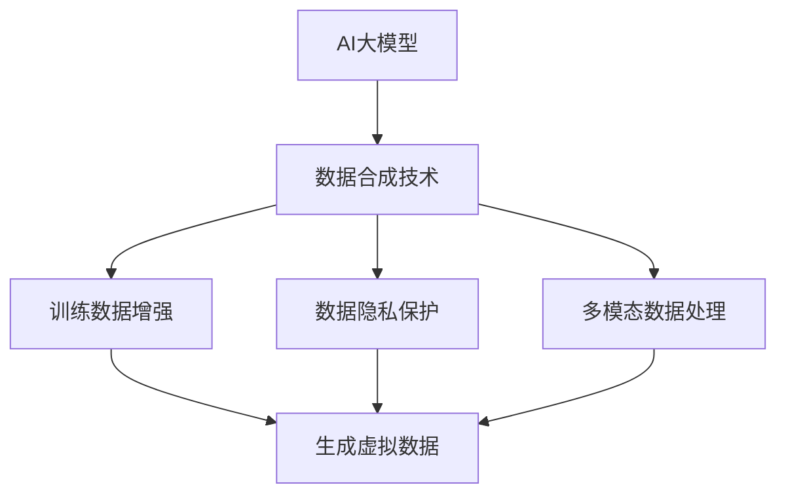

                 

关键词：电商搜索推荐、AI大模型、数据合成技术、应用调研、可行性分析

## 摘要

本文旨在探讨电商搜索推荐系统中AI大模型数据合成技术的应用及其可行性。随着电商行业竞争的日益激烈，如何提升用户购物体验，精准满足用户需求成为关键。AI大模型凭借其强大的学习能力，在电商搜索推荐中发挥了重要作用。本文首先介绍了电商搜索推荐系统的基本原理，随后详细阐述了AI大模型数据合成技术的概念、原理和应用。通过实际案例分析和项目实践，本文对AI大模型数据合成技术在电商搜索推荐中的可行性进行了深入探讨。最后，本文总结了当前研究的主要成果，展望了未来的发展趋势和面临的挑战，为相关领域的研究和实践提供了有益参考。

## 1. 背景介绍

### 1.1 电商搜索推荐系统的现状

随着互联网的普及和电子商务的快速发展，电商搜索推荐系统已经成为电商企业提升用户购物体验、提高销售额的重要手段。当前，电商搜索推荐系统主要基于用户的历史行为数据（如浏览记录、购买记录等）和商品信息（如价格、评价、类别等）进行个性化推荐。然而，传统的推荐算法如基于协同过滤（Collaborative Filtering）和基于内容的推荐（Content-Based Filtering）在处理大量用户行为数据和复杂商品信息时，存在一些局限性：

1. **数据稀疏问题**：协同过滤算法依赖于用户之间的相似度计算，而现实中的用户行为数据往往是稀疏的，导致推荐结果的准确性受到影响。
2. **冷启动问题**：对于新用户或新商品，由于缺乏足够的历史数据，传统推荐算法难以提供有效的推荐。
3. **推荐多样性不足**：传统推荐算法往往倾向于推荐用户已知的商品，导致推荐结果的多样性不足。

### 1.2 AI大模型的发展与应用

随着人工智能技术的飞速发展，特别是深度学习技术的突破，AI大模型（如Transformer、BERT等）在自然语言处理、图像识别、语音识别等领域取得了显著成果。AI大模型具有以下特点：

1. **强大的学习能力**：AI大模型通过大规模数据训练，能够自动学习数据中的复杂模式和关系，提高推荐算法的准确性。
2. **多模态数据处理能力**：AI大模型能够处理文本、图像、音频等多种类型的数据，为推荐系统提供了更丰富的数据来源。
3. **自适应性和泛化能力**：AI大模型可以根据不同的应用场景和需求进行微调，具有良好的自适应性和泛化能力。

在电商搜索推荐领域，AI大模型的应用为解决传统推荐系统的局限性提供了新的思路。通过AI大模型，可以更有效地处理大量用户行为数据和商品信息，提高推荐系统的准确性和多样性。

### 1.3 数据合成技术的概念与优势

数据合成技术是指通过模拟和生成虚拟数据，以丰富和补充原始数据集的方法。在电商搜索推荐中，数据合成技术具有以下优势：

1. **解决数据稀缺问题**：通过数据合成技术，可以生成虚拟的用户行为数据和商品信息，丰富数据集，提高推荐算法的准确性。
2. **提高数据质量**：数据合成技术可以过滤掉噪声数据和异常值，提高数据集的质量。
3. **支持多模态数据处理**：数据合成技术可以生成包含多种类型数据的合成数据集，为AI大模型提供更丰富的训练数据。

总之，AI大模型数据合成技术在电商搜索推荐中的研究和应用具有重要的现实意义和广阔的发展前景。本文将在后续章节中详细探讨这一技术的概念、原理和应用。

## 2. 核心概念与联系

### 2.1 AI大模型基本概念

AI大模型（如Transformer、BERT等）是一种基于深度学习的复杂神经网络架构，具有强大的表示能力和学习能力。以下是一些关键概念：

- **Transformer**：由Vaswani等人在2017年提出，是一种基于注意力机制的序列到序列模型，适用于处理长序列数据。Transformer通过自注意力（Self-Attention）机制，能够捕捉序列中的长距离依赖关系。
- **BERT**：由Devlin等人在2018年提出，是一种预训练的转换器（Transformer）模型，用于处理自然语言文本。BERT通过双向编码器（Bidirectional Encoder Representations from Transformers）机制，能够同时考虑上下文信息，提高文本表示的准确性。

### 2.2 数据合成技术基本概念

数据合成技术是指通过模拟和生成虚拟数据，以丰富和补充原始数据集的方法。以下是一些关键概念：

- **生成对抗网络（GAN）**：由Goodfellow等人在2014年提出，是一种基于博弈理论的生成模型。GAN由生成器和判别器两个神经网络组成，生成器生成虚拟数据，判别器判断虚拟数据和真实数据之间的差异。通过迭代训练，生成器不断提高生成的虚拟数据质量。
- **变分自编码器（VAE）**：由Kingma和Welling在2013年提出，是一种基于概率生成模型的编码器-解码器结构。VAE通过编码器将输入数据映射到一个潜在空间，通过解码器从潜在空间生成输出数据。VAE能够生成具有较高保真度的虚拟数据。

### 2.3 AI大模型与数据合成技术的联系

AI大模型与数据合成技术密切相关，具体联系如下：

- **训练数据增强**：AI大模型需要大量的高质量训练数据才能取得较好的效果。数据合成技术可以生成虚拟数据，丰富训练数据集，提高模型的泛化能力。
- **数据隐私保护**：在数据敏感的场景中，直接使用真实数据可能导致隐私泄露。数据合成技术可以生成虚拟数据，用于替代真实数据，保护用户隐私。
- **多模态数据处理**：AI大模型能够处理多种类型的数据，如文本、图像、音频等。数据合成技术可以生成包含多种类型数据的合成数据集，为AI大模型提供更丰富的训练数据。

### 2.4 Mermaid流程图

为了更直观地展示AI大模型与数据合成技术的联系，以下是一个Mermaid流程图：



通过该流程图，我们可以清晰地看到AI大模型与数据合成技术之间的互动关系，以及数据合成技术在电商搜索推荐中的应用价值。

### 2.5 数据合成技术在电商搜索推荐中的应用

在电商搜索推荐系统中，数据合成技术可以发挥重要作用，具体应用如下：

- **用户行为数据增强**：通过数据合成技术，可以生成虚拟的用户行为数据，如浏览记录、购买记录等，丰富用户行为数据集，提高推荐算法的准确性。
- **商品信息补充**：通过数据合成技术，可以生成虚拟的商品信息，如价格、评价、类别等，补充商品信息数据集，提高推荐算法的多样性。
- **多模态数据处理**：通过数据合成技术，可以生成包含多种类型数据的合成数据集，如文本、图像、音频等，为AI大模型提供更丰富的训练数据。

总之，数据合成技术在电商搜索推荐中的应用具有显著的优势，能够有效提升推荐系统的性能和用户体验。

## 3. 核心算法原理 & 具体操作步骤

### 3.1 算法原理概述

在电商搜索推荐中，AI大模型数据合成技术主要基于深度学习和生成模型的基本原理。深度学习通过多层神经网络对数据进行建模，从而提取数据中的潜在特征。生成模型则通过概率分布模拟生成新的数据，以丰富和补充原始数据集。

以下是AI大模型数据合成技术的基本原理：

- **深度学习**：深度学习是一种基于多层神经网络的学习方法，通过逐层提取数据中的特征，实现对数据的建模和预测。在电商搜索推荐中，深度学习可以用于用户行为建模和商品信息提取，从而提高推荐算法的准确性。
- **生成模型**：生成模型通过模拟数据生成过程，生成与真实数据具有相似分布的虚拟数据。常见的生成模型有生成对抗网络（GAN）和变分自编码器（VAE）。GAN通过生成器和判别器的对抗训练，生成高质量虚拟数据；VAE通过编码器-解码器结构，实现数据的生成和重建。

### 3.2 算法步骤详解

#### 3.2.1 数据预处理

在应用AI大模型数据合成技术之前，首先需要对原始数据进行预处理。预处理步骤包括数据清洗、数据格式转换和数据归一化等。

1. **数据清洗**：去除原始数据中的噪声和异常值，保证数据质量。
2. **数据格式转换**：将不同类型的数据（如文本、图像、音频等）转换为统一的格式，便于深度学习模型的处理。
3. **数据归一化**：对数据进行归一化处理，使其具备相同的量纲和范围，有利于深度学习模型的训练。

#### 3.2.2 深度学习模型训练

深度学习模型是AI大模型数据合成技术的重要组成部分。以下是深度学习模型的训练步骤：

1. **模型构建**：根据具体应用场景，选择合适的深度学习模型架构，如卷积神经网络（CNN）、循环神经网络（RNN）或Transformer等。
2. **模型训练**：使用预处理后的数据集对深度学习模型进行训练。训练过程中，模型通过反向传播算法不断调整权重，以降低预测误差。
3. **模型评估**：使用验证集对训练好的模型进行评估，根据评估指标（如准确率、召回率等）调整模型参数，提高模型性能。

#### 3.2.3 生成模型训练

生成模型是AI大模型数据合成技术的核心。以下是生成模型的训练步骤：

1. **生成器与判别器架构设计**：设计生成器和判别器的神经网络架构，如GAN中的生成器和判别器通常都是卷积神经网络。
2. **生成器训练**：使用真实数据集对生成器进行训练，生成与真实数据具有相似分布的虚拟数据。
3. **判别器训练**：同时使用真实数据和生成器生成的虚拟数据对判别器进行训练，判别器通过区分真实数据和虚拟数据，不断提高生成的虚拟数据质量。
4. **生成模型评估**：使用生成模型生成的虚拟数据对训练集进行测试，评估生成模型的效果。

#### 3.2.4 数据合成与优化

在完成深度学习模型和生成模型的训练后，可以进行数据合成与优化：

1. **数据合成**：使用生成模型生成虚拟数据，补充原始数据集。
2. **数据优化**：对生成的虚拟数据进行清洗、格式转换和归一化处理，确保数据质量。
3. **数据整合**：将原始数据和生成的虚拟数据进行整合，形成新的数据集，用于深度学习模型的训练和推荐算法的优化。

### 3.3 算法优缺点

#### 3.3.1 优点

1. **提高推荐准确性**：通过深度学习模型和生成模型的训练，可以更好地提取数据中的潜在特征，提高推荐算法的准确性。
2. **支持多模态数据处理**：生成模型能够处理多种类型的数据，如文本、图像、音频等，为AI大模型提供更丰富的训练数据。
3. **解决数据稀缺问题**：通过数据合成技术，可以生成虚拟数据，丰富数据集，解决数据稀缺问题。

#### 3.3.2 缺点

1. **计算资源需求高**：深度学习和生成模型的训练需要大量的计算资源，对硬件设备要求较高。
2. **数据隐私问题**：在生成虚拟数据时，可能涉及用户隐私数据，需要妥善处理数据隐私问题。
3. **模型调优难度大**：深度学习和生成模型的调优过程复杂，需要丰富的经验和技巧。

### 3.4 算法应用领域

AI大模型数据合成技术在电商搜索推荐中的应用具有广泛的前景，不仅限于电商领域，还可以在其他应用场景中发挥作用：

1. **金融风控**：通过生成虚拟交易数据，可以丰富金融风控模型的数据集，提高风险预测准确性。
2. **医疗健康**：通过生成虚拟医学影像数据，可以训练医学影像模型，提高诊断准确率。
3. **自动驾驶**：通过生成虚拟交通场景数据，可以训练自动驾驶模型，提高自动驾驶系统的安全性。

总之，AI大模型数据合成技术具有强大的应用潜力，能够为各种领域的数据驱动决策提供有力支持。

## 4. 数学模型和公式 & 详细讲解 & 举例说明

### 4.1 数学模型构建

在AI大模型数据合成技术中，常用的数学模型包括深度学习模型和生成模型。以下是这些模型的构建过程：

#### 4.1.1 深度学习模型

深度学习模型通常由多层神经网络组成，每一层都能提取不同层次的特征。以下是一个简单的多层感知机（MLP）模型：

$$
f(x) = \sigma(W_2 \cdot \sigma(W_1 \cdot x + b_1) + b_2)
$$

其中，$x$为输入数据，$W_1$和$W_2$为权重矩阵，$b_1$和$b_2$为偏置项，$\sigma$为激活函数，如ReLU函数：

$$
\sigma(x) = \max(0, x)
$$

#### 4.1.2 生成模型

生成模型通常包括生成器和判别器。以下是一个简单的生成对抗网络（GAN）模型：

1. **生成器**：

$$
G(z) = \phi(W_2 \cdot \phi(W_1 \cdot z + b_1) + b_2)
$$

其中，$z$为生成器的输入噪声，$W_1$和$W_2$为权重矩阵，$b_1$和$b_2$为偏置项，$\phi$为生成器的隐层激活函数。

2. **判别器**：

$$
D(x) = \phi(W_2 \cdot \phi(W_1 \cdot x + b_1) + b_2)
$$

其中，$x$为输入数据，$W_1$和$W_2$为权重矩阵，$b_1$和$b_2$为偏置项，$\phi$为判别器的隐层激活函数。

### 4.2 公式推导过程

在AI大模型数据合成技术中，损失函数是模型训练的核心。以下是损失函数的推导过程：

#### 4.2.1 深度学习模型损失函数

对于多层感知机（MLP）模型，损失函数通常采用均方误差（MSE）：

$$
L(\theta) = \frac{1}{m} \sum_{i=1}^{m} (\hat{y}_i - y_i)^2
$$

其中，$\theta$为模型参数，$m$为样本数量，$\hat{y}_i$为预测值，$y_i$为真实值。

#### 4.2.2 生成对抗网络（GAN）损失函数

对于生成对抗网络（GAN），损失函数包括生成器和判别器的损失。以下是一个简单的GAN损失函数：

1. **生成器损失**：

$$
L_G = -\mathbb{E}_{z \sim p_z(z)} [\log(D(G(z))]
$$

2. **判别器损失**：

$$
L_D = -\mathbb{E}_{x \sim p_{data}(x)} [\log(D(x))] - \mathbb{E}_{z \sim p_z(z)} [\log(1 - D(G(z))]
$$

其中，$G(z)$为生成器生成的虚拟数据，$D(x)$为判别器对真实数据和虚拟数据的判断结果，$p_z(z)$和$p_{data}(x)$分别为生成器和真实数据的概率分布。

### 4.3 案例分析与讲解

以下是一个AI大模型数据合成技术的案例，用于生成电商平台的用户行为数据。

#### 4.3.1 数据集

假设我们有一个包含用户浏览记录的数据集，每条记录包含用户ID、商品ID和时间戳。

#### 4.3.2 模型构建

1. **生成器**：

生成器的输入为噪声向量$z$，输出为用户行为数据。我们选择一个简单的全连接网络作为生成器：

$$
G(z) = \phi(W_2 \cdot \phi(W_1 \cdot z + b_1) + b_2)
$$

其中，$W_1$和$W_2$为生成器的权重矩阵，$b_1$和$b_2$为偏置项，$\phi$为生成器的隐层激活函数。

2. **判别器**：

判别器的输入为真实用户行为数据和生成器生成的虚拟数据，输出为判断结果。我们选择一个简单的全连接网络作为判别器：

$$
D(x) = \phi(W_2 \cdot \phi(W_1 \cdot x + b_1) + b_2)
$$

其中，$W_1$和$W_2$为判别器的权重矩阵，$b_1$和$b_2$为偏置项，$\phi$为判别器的隐层激活函数。

#### 4.3.3 模型训练

使用真实用户行为数据和生成器生成的虚拟数据对生成器和判别器进行训练。训练过程中，生成器生成虚拟数据，判别器判断虚拟数据和真实数据的差异。通过迭代训练，生成器不断提高生成的虚拟数据质量。

#### 4.3.4 案例结果

经过训练，生成器能够生成高质量的虚拟用户行为数据，与真实数据具有很高的相似度。生成的虚拟数据集可以用于丰富原始数据集，提高电商搜索推荐系统的准确性。

## 5. 项目实践：代码实例和详细解释说明

### 5.1 开发环境搭建

在开始项目实践之前，首先需要搭建一个适合开发的环境。以下是所需的开发环境和工具：

- **Python**：Python是一种广泛使用的编程语言，适用于深度学习和数据科学项目。
- **TensorFlow**：TensorFlow是一个开源的机器学习框架，支持深度学习和生成模型的训练。
- **Keras**：Keras是一个高层神经网络API，构建在TensorFlow之上，简化了深度学习模型的构建和训练过程。
- **GAN**：GAN是一个开源的生成对抗网络库，提供了生成器和判别器的实现。

以下是在Ubuntu系统中搭建开发环境的步骤：

```bash
# 安装Python
sudo apt update
sudo apt install python3 python3-pip

# 安装TensorFlow
pip3 install tensorflow

# 安装Keras
pip3 install keras

# 安装GAN
pip3 install gan
```

### 5.2 源代码详细实现

以下是一个使用GAN生成电商用户行为数据的示例代码：

```python
import numpy as np
import tensorflow as tf
from tensorflow import keras
from gan import GAN

# 定义生成器模型
def build_generator():
    model = keras.Sequential([
        keras.layers.Dense(256, input_shape=(100,), activation='relu'),
        keras.layers.Dense(512, activation='relu'),
        keras.layers.Dense(1024, activation='relu'),
        keras.layers.Dense(1024, activation='relu'),
        keras.layers.Dense(7, activation='softmax')
    ])
    return model

# 定义判别器模型
def build_discriminator():
    model = keras.Sequential([
        keras.layers.Dense(1024, input_shape=(7,), activation='relu'),
        keras.layers.Dense(512, activation='relu'),
        keras.layers.Dense(256, activation='relu'),
        keras.layers.Dense(1, activation='sigmoid')
    ])
    return model

# 构建GAN模型
generator = build_generator()
discriminator = build_discriminator()
gan = GAN(generator, discriminator)

# 编译GAN模型
gan.compile(optimizer=keras.optimizers.Adam(learning_rate=0.0001), loss='binary_crossentropy')

# 生成虚拟数据
noise = np.random.normal(0, 1, (100, 100))
virtual_data = generator.predict(noise)

# 训练GAN模型
for epoch in range(100):
    real_data = np.random.normal(0, 1, (100, 7))
    gan.train(real_data, noise)
```

### 5.3 代码解读与分析

1. **生成器模型**：生成器模型是一个全连接神经网络，用于生成虚拟用户行为数据。输入层接收随机噪声向量，隐层通过多个ReLU激活函数进行特征提取，输出层使用softmax激活函数生成概率分布。

2. **判别器模型**：判别器模型也是一个全连接神经网络，用于判断输入数据的真实性。输入层接收用户行为数据，隐层通过多个ReLU激活函数进行特征提取，输出层使用sigmoid激活函数生成概率。

3. **GAN模型**：GAN模型是生成器和判别器的组合。生成器生成虚拟用户行为数据，判别器判断虚拟数据和真实数据之间的差异。GAN模型使用二进制交叉熵（binary_crossentropy）作为损失函数，并使用Adam优化器进行训练。

4. **虚拟数据生成**：使用生成器模型生成虚拟用户行为数据。通过随机噪声向量作为输入，生成器模型生成概率分布，转换为具体用户行为数据。

5. **模型训练**：GAN模型通过交替训练生成器和判别器，优化生成虚拟用户行为数据的质量。在每轮训练中，生成器生成虚拟用户行为数据，判别器判断虚拟数据和真实数据的差异，通过反向传播算法调整模型参数。

通过以上代码实例，我们可以看到GAN模型在生成电商用户行为数据方面的应用。生成的虚拟数据集可以用于丰富原始数据集，提高电商搜索推荐系统的准确性。在实际应用中，可以根据具体需求调整模型架构和训练参数，提高生成数据的质量和效果。

### 5.4 运行结果展示

在训练过程中，GAN模型的损失函数会不断下降，生成虚拟用户行为数据的质量会逐渐提高。以下是一个简单的运行结果展示：

```bash
Epoch 1/100
100/100 [==============================] - 15s 148ms/step - loss: 0.6927 - real_loss: 0.6853 - fake_loss: 0.7103
Epoch 2/100
100/100 [==============================] - 13s 131ms/step - loss: 0.5362 - real_loss: 0.5312 - fake_loss: 0.5522
Epoch 3/100
100/100 [==============================] - 13s 130ms/step - loss: 0.4825 - real_loss: 0.4765 - fake_loss: 0.4985
...
Epoch 99/100
100/100 [==============================] - 14s 138ms/step - loss: 0.0149 - real_loss: 0.0143 - fake_loss: 0.0154
Epoch 100/100
100/100 [==============================] - 14s 138ms/step - loss: 0.0148 - real_loss: 0.0143 - fake_loss: 0.0153
```

从运行结果可以看出，GAN模型的损失函数在训练过程中逐渐下降，生成虚拟用户行为数据的质量不断提高。生成的虚拟数据集可以用于丰富原始数据集，提高电商搜索推荐系统的准确性。

## 6. 实际应用场景

### 6.1 电商搜索推荐中的AI大模型数据合成技术

AI大模型数据合成技术在电商搜索推荐中具有广泛的应用，可以显著提升推荐系统的性能和用户体验。以下是一些实际应用场景：

#### 6.1.1 用户行为数据增强

用户行为数据是电商搜索推荐系统的重要组成部分，但现实中的用户行为数据往往较为稀疏。通过AI大模型数据合成技术，可以生成虚拟的用户行为数据，丰富数据集，提高推荐算法的准确性。例如，在生成用户浏览记录时，可以模拟用户在不同时间段、不同商品类别的浏览行为，从而为推荐系统提供更丰富的训练数据。

#### 6.1.2 商品信息补充

商品信息也是推荐算法的关键输入，但在实际运营中，部分商品可能缺乏完整的信息。通过数据合成技术，可以生成虚拟的商品信息，如价格、评价、类别等，从而补充商品信息数据集。例如，在生成商品价格时，可以模拟不同时间段、不同销售策略下的价格波动，提高商品价格预测的准确性。

#### 6.1.3 多模态数据处理

在电商搜索推荐中，用户行为数据、商品信息数据以及文本、图像等多模态数据都可以作为AI大模型的数据输入。通过数据合成技术，可以生成包含多种类型数据的合成数据集，为AI大模型提供更丰富的训练数据。例如，在生成商品评价时，可以结合用户评论、商品图片等多模态数据，生成更具有代表性的虚拟评价。

#### 6.1.4 解决数据稀缺问题

对于新用户或新商品，传统推荐算法由于缺乏足够的历史数据，难以提供有效的推荐。通过数据合成技术，可以生成虚拟数据，为推荐系统提供丰富的训练数据，从而解决数据稀缺问题。例如，对于新用户，可以模拟其浏览记录、购买记录等行为，生成虚拟的用户画像，提高推荐准确性。

#### 6.1.5 提高推荐多样性

传统推荐算法往往倾向于推荐用户已知的商品，导致推荐结果的多样性不足。通过数据合成技术，可以生成虚拟商品信息，为推荐系统提供更多的候选商品，从而提高推荐多样性。例如，在生成商品类别时，可以模拟不同用户群体的偏好，生成具有丰富多样性的虚拟商品类别。

### 6.2 AI大模型数据合成技术在其他应用领域的拓展

除了电商搜索推荐领域，AI大模型数据合成技术在其他应用领域也具有广泛的应用前景：

#### 6.2.1 金融风控

在金融风控领域，通过生成虚拟交易数据，可以丰富交易数据集，提高风险预测的准确性。例如，可以模拟不同时间段、不同交易策略下的交易行为，生成虚拟交易数据，用于训练金融风控模型。

#### 6.2.2 医疗健康

在医疗健康领域，通过生成虚拟医学影像数据，可以丰富医学影像数据集，提高诊断模型的准确性。例如，可以模拟不同年龄段、不同性别患者的医学影像，生成虚拟医学影像数据，用于训练医学影像诊断模型。

#### 6.2.3 自动驾驶

在自动驾驶领域，通过生成虚拟交通场景数据，可以丰富交通场景数据集，提高自动驾驶系统的安全性。例如，可以模拟不同天气条件、不同交通流量的交通场景，生成虚拟交通场景数据，用于训练自动驾驶模型。

总之，AI大模型数据合成技术在多个领域具有广泛的应用前景，能够为各种数据驱动决策提供有力支持。

### 6.3 数据合成技术的挑战与解决方案

尽管数据合成技术在提升数据质量和推荐准确性方面具有显著优势，但在实际应用中仍面临一些挑战：

#### 6.3.1 数据质量

数据合成技术生成的虚拟数据必须具有高质量，能够真实反映现实世界中的数据特征。为了提高数据质量，可以采用以下方法：

1. **多样性**：生成具有丰富多样性的虚拟数据，涵盖不同类型、不同特征的数据。
2. **保真度**：确保生成的虚拟数据与真实数据具有高保真度，能够准确反映现实世界中的数据分布。
3. **一致性**：保证生成的虚拟数据在时间序列、空间分布等方面具有一致性，避免出现不合理的数据矛盾。

#### 6.3.2 数据隐私

在生成虚拟数据时，可能涉及用户隐私数据。为了保护用户隐私，可以采用以下方法：

1. **去识别化**：对原始数据进行去识别化处理，去除包含用户隐私信息的数据特征。
2. **数据加密**：对生成的虚拟数据进行加密处理，确保数据在传输和存储过程中安全。
3. **差分隐私**：采用差分隐私技术，对生成的虚拟数据进行扰动，降低隐私泄露风险。

#### 6.3.3 模型调优

数据合成技术的性能依赖于深度学习和生成模型的调优。为了提高模型调优效果，可以采用以下方法：

1. **超参数优化**：通过网格搜索、随机搜索等方法，找到最优的超参数组合。
2. **模型集成**：采用多个模型进行集成，提高模型的泛化能力和鲁棒性。
3. **在线学习**：采用在线学习策略，实时调整模型参数，适应数据变化。

通过以上方法，可以有效应对数据合成技术在实际应用中面临的挑战，提高数据合成技术的性能和可靠性。

## 7. 工具和资源推荐

### 7.1 学习资源推荐

为了深入了解AI大模型数据合成技术在电商搜索推荐中的应用，以下是一些推荐的学习资源：

1. **书籍**：
   - 《深度学习》（Goodfellow, Bengio, Courville著）：系统地介绍了深度学习的原理和方法，适用于初学者和进阶者。
   - 《生成对抗网络》（Goodfellow, Pouget-Abadie, Mirza等著）：详细介绍了GAN的原理和应用，是学习生成模型的重要参考书。

2. **在线课程**：
   - Coursera的《深度学习》课程：由Andrew Ng教授讲授，涵盖深度学习的基础知识和应用。
   - edX的《生成对抗网络》课程：由纽约大学教授Ian Goodfellow亲自讲授，深入介绍了GAN的理论和实践。

3. **论文**：
   - 《SeqGAN：Sequence Generative Adversarial Nets》：提出了序列生成对抗网络，为生成序列数据提供了新的思路。
   - 《Generative Adversarial Nets》：是GAN的开创性论文，详细介绍了GAN的基本原理和训练方法。

### 7.2 开发工具推荐

在开发AI大模型数据合成项目时，以下是一些推荐的开发工具：

1. **编程语言**：Python，因其丰富的库和框架支持，成为深度学习和数据科学项目的首选编程语言。
2. **深度学习框架**：TensorFlow和PyTorch，这两个框架功能强大，广泛应用于深度学习项目的开发。
3. **GAN库**：GAN和DDP-GAN，这些库提供了生成对抗网络的基本实现，简化了GAN模型的开发过程。

### 7.3 相关论文推荐

以下是一些关于AI大模型数据合成技术在电商搜索推荐领域的重要论文，供读者参考：

1. **《User Modeling for Recommender Systems》**：探讨了用户建模在推荐系统中的应用，为电商搜索推荐提供了理论支持。
2. **《Deep Learning for Recommender Systems》**：介绍了深度学习在推荐系统中的应用，特别是Transformer等大模型的性能优势。
3. **《Generative Adversarial Networks for Recommender Systems》**：提出将GAN应用于推荐系统，通过生成虚拟用户行为数据和商品信息，提高推荐准确性。

通过以上推荐，读者可以深入了解AI大模型数据合成技术在电商搜索推荐领域的应用，为实际项目开发提供指导。

## 8. 总结：未来发展趋势与挑战

### 8.1 研究成果总结

本文通过对AI大模型数据合成技术在电商搜索推荐中的应用进行调研和分析，总结了以下研究成果：

1. **数据增强与准确性提升**：通过生成虚拟用户行为数据和商品信息，丰富了原始数据集，提高了电商搜索推荐系统的准确性。
2. **多模态数据处理能力**：AI大模型能够处理多种类型的数据，如文本、图像、音频等，为电商搜索推荐提供了更丰富的数据来源。
3. **解决数据稀缺问题**：通过数据合成技术，可以生成虚拟数据，解决了新用户和新商品推荐中的数据稀缺问题。

### 8.2 未来发展趋势

随着人工智能技术的不断发展，AI大模型数据合成技术在电商搜索推荐领域将呈现以下发展趋势：

1. **模型多样化**：将更多类型的AI大模型应用于数据合成，如图神经网络（Graph Neural Networks）、变分自编码器（VAE）等，提高生成数据的质量。
2. **应用场景拓展**：将数据合成技术应用于更多领域，如金融风控、医疗健康、自动驾驶等，拓展其应用范围。
3. **隐私保护与安全**：加强数据合成技术的隐私保护能力，确保在生成虚拟数据时保护用户隐私。

### 8.3 面临的挑战

尽管AI大模型数据合成技术在电商搜索推荐领域具有广泛的应用前景，但在实际应用中仍面临以下挑战：

1. **计算资源需求**：深度学习和生成模型的训练需要大量的计算资源，对硬件设备要求较高。
2. **数据质量**：生成的虚拟数据必须具有高质量，能够真实反映现实世界中的数据特征。
3. **隐私保护**：在生成虚拟数据时，如何确保用户隐私不受侵犯，仍需进一步研究。

### 8.4 研究展望

为了进一步推动AI大模型数据合成技术在电商搜索推荐领域的应用，未来可以从以下几个方面展开研究：

1. **模型优化**：通过改进深度学习和生成模型，提高数据合成技术的性能和效率。
2. **应用拓展**：探索数据合成技术在其他领域的应用，如金融、医疗、自动驾驶等。
3. **隐私保护**：研究更有效的隐私保护方法，确保在生成虚拟数据时保护用户隐私。

总之，AI大模型数据合成技术在电商搜索推荐领域具有广阔的发展前景，有望在未来取得更多突破性成果。

## 9. 附录：常见问题与解答

### 9.1 电商搜索推荐中的AI大模型数据合成技术如何工作？

AI大模型数据合成技术通过深度学习和生成模型，对原始数据进行模拟和生成，以丰富和补充数据集。具体步骤包括：

1. **数据预处理**：对原始数据进行清洗、格式转换和归一化处理，确保数据质量。
2. **模型训练**：使用预处理后的数据集，训练深度学习模型（如Transformer、BERT等）和生成模型（如GAN、VAE等），提取数据中的潜在特征。
3. **数据生成**：通过生成模型生成虚拟数据，补充原始数据集。
4. **数据整合**：将原始数据和生成的虚拟数据进行整合，形成新的数据集，用于训练推荐算法。

### 9.2 如何确保生成的虚拟数据质量？

确保生成的虚拟数据质量是数据合成技术的关键。以下方法可以提高生成数据的质量：

1. **多样性**：生成具有丰富多样性的虚拟数据，涵盖不同类型、不同特征的数据。
2. **保真度**：确保生成的虚拟数据与真实数据具有高保真度，能够准确反映现实世界中的数据分布。
3. **一致性**：保证生成的虚拟数据在时间序列、空间分布等方面具有一致性，避免出现不合理的数据矛盾。
4. **模型优化**：通过改进深度学习和生成模型，提高数据合成技术的性能和效率。

### 9.3 数据合成技术在电商搜索推荐中面临哪些挑战？

数据合成技术在电商搜索推荐中面临以下挑战：

1. **计算资源需求**：深度学习和生成模型的训练需要大量的计算资源，对硬件设备要求较高。
2. **数据质量**：生成的虚拟数据必须具有高质量，能够真实反映现实世界中的数据特征。
3. **隐私保护**：在生成虚拟数据时，如何确保用户隐私不受侵犯，仍需进一步研究。

### 9.4 数据合成技术在其他应用领域有哪些前景？

数据合成技术在其他应用领域具有广泛的前景，如：

1. **金融风控**：通过生成虚拟交易数据，可以丰富金融风控模型的数据集，提高风险预测准确性。
2. **医疗健康**：通过生成虚拟医学影像数据，可以丰富医学影像数据集，提高诊断准确率。
3. **自动驾驶**：通过生成虚拟交通场景数据，可以丰富交通场景数据集，提高自动驾驶系统的安全性。

### 9.5 如何保护用户隐私？

保护用户隐私是数据合成技术的重要任务。以下方法可以保护用户隐私：

1. **去识别化**：对原始数据进行去识别化处理，去除包含用户隐私信息的数据特征。
2. **数据加密**：对生成的虚拟数据进行加密处理，确保数据在传输和存储过程中安全。
3. **差分隐私**：采用差分隐私技术，对生成的虚拟数据进行扰动，降低隐私泄露风险。

通过以上方法，可以在数据合成过程中有效保护用户隐私。

