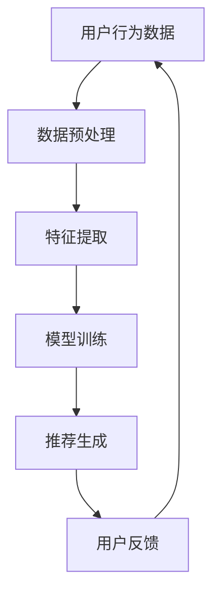

                 

关键词：电商搜索推荐、AI大模型、数据增量更新、算法原理、数学模型、项目实践、应用场景

## 摘要

本文旨在探讨电商搜索推荐系统中，基于AI大模型的数据增量更新机制。随着电商平台的用户数量和交易数据的急剧增长，如何高效地更新和优化推荐模型成为了一个重要的研究课题。本文将首先介绍电商搜索推荐系统的基本原理，然后深入讨论AI大模型的数据增量更新机制，包括核心概念、算法原理、数学模型以及实际应用。通过分析算法的优缺点和适用领域，本文旨在为相关领域的研发人员提供有益的参考和指导。

## 1. 背景介绍

### 1.1 电商搜索推荐系统的需求背景

电商搜索推荐系统是现代电商平台的核心组成部分，其目的是通过分析用户的历史行为和兴趣偏好，为用户推荐个性化商品，从而提高用户的购物体验和平台的销售额。随着用户规模的不断扩大和数据量的爆发式增长，传统的推荐系统已难以满足实时性和高效性的要求。因此，研究和设计能够适应大规模数据处理和高实时性要求的推荐算法，成为当前研究的热点。

### 1.2 AI大模型的发展与应用

近年来，深度学习和自然语言处理等领域取得了显著的进展，AI大模型如BERT、GPT-3等在图像识别、自然语言处理、推荐系统等领域展现了强大的能力。这些大模型通过在海量数据上的训练，可以自动提取数据中的潜在特征，从而实现高效的信息检索和推荐。然而，随着模型规模的增大，数据更新和模型优化也变得愈加复杂和耗时。

## 2. 核心概念与联系

### 2.1 电商搜索推荐系统的基本架构

电商搜索推荐系统的基本架构包括用户行为数据收集、数据预处理、特征提取、模型训练和推荐生成等环节。用户行为数据包括点击、购买、收藏等行为数据，数据预处理包括数据清洗、归一化等步骤，特征提取是将原始数据转换为模型可处理的特征向量，模型训练是通过训练数据优化模型参数，推荐生成是根据用户特征和商品特征生成推荐列表。

### 2.2 AI大模型的基本原理

AI大模型通常采用深度神经网络结构，通过多层神经网络对数据进行自动特征提取和学习。这些模型可以在海量的训练数据上自动发现数据中的潜在模式，并利用这些模式进行预测和决策。在推荐系统中，AI大模型可以用于用户兴趣建模、商品特征提取和推荐列表生成等任务。

### 2.3 数据增量更新的重要性

在电商搜索推荐系统中，用户行为和数据特征是不断变化的。为了保持推荐系统的实时性和准确性，需要定期更新模型和数据。数据增量更新是指在已有数据基础上，通过新加入的数据进行模型优化和更新。数据增量更新机制是推荐系统的重要环节，直接影响到推荐系统的性能和用户体验。

### 2.4 Mermaid流程图



## 3. 核心算法原理 & 具体操作步骤

### 3.1 算法原理概述

电商搜索推荐系统中的AI大模型数据增量更新机制主要包括以下几个步骤：

1. 数据收集：从电商平台获取用户行为数据。
2. 数据预处理：对数据进行清洗、归一化等处理。
3. 特征提取：将原始数据转换为模型可处理的特征向量。
4. 模型训练：使用新加入的数据和已有模型进行联合训练，优化模型参数。
5. 推荐生成：使用更新后的模型生成推荐列表。
6. 用户反馈：收集用户对推荐结果的评价，用于后续的模型优化。

### 3.2 算法步骤详解

#### 3.2.1 数据收集

数据收集是整个增量更新机制的基础。在电商平台上，用户行为数据包括点击、购买、收藏等行为数据。为了实现增量更新，需要定期收集新加入的数据，并将其与已有数据合并。

#### 3.2.2 数据预处理

数据预处理是对原始数据进行清洗和归一化等操作。清洗步骤包括去除重复数据、处理缺失值等，归一化步骤包括对数值特征进行缩放、对类别特征进行编码等。

#### 3.2.3 特征提取

特征提取是将原始数据转换为模型可处理的特征向量。在推荐系统中，特征提取是关键步骤，其质量直接影响到模型的效果。常见的特征提取方法包括词袋模型、TF-IDF、词嵌入等。

#### 3.2.4 模型训练

模型训练是增量更新的核心步骤。在训练过程中，需要将新加入的数据和已有数据混合，以实现模型的联合训练。常见的训练方法包括基于梯度的优化算法、强化学习等。

#### 3.2.5 推荐生成

推荐生成是根据用户特征和商品特征生成推荐列表。在生成过程中，需要使用更新后的模型，并根据用户的历史行为和兴趣偏好进行个性化推荐。

#### 3.2.6 用户反馈

用户反馈是评估推荐系统效果的重要指标。通过收集用户对推荐结果的评价，可以进一步优化模型和推荐策略。

### 3.3 算法优缺点

#### 优点

- 高效性：增量更新机制可以充分利用已有模型和数据，减少训练时间和计算资源消耗。
- 实时性：通过定期收集和更新数据，可以保持推荐系统的实时性和准确性。
- 个性化：基于用户行为和兴趣偏好进行个性化推荐，提高用户满意度。

#### 缺点

- 数据依赖：增量更新机制的性能依赖于数据质量和数量。
- 模型复杂度：随着模型规模的增大，模型的训练和推理时间也会增加。

### 3.4 算法应用领域

AI大模型数据增量更新机制可以广泛应用于电商搜索推荐、社交媒体推荐、内容推荐等领域。在实际应用中，可以根据不同场景和需求，设计和优化相应的增量更新机制。

## 4. 数学模型和公式

### 4.1 数学模型构建

在电商搜索推荐系统中，可以使用以下数学模型进行数据增量更新：

- 用户兴趣向量模型：
  $$u = f(u', u_{\text{old}})$$
  其中，$u'$ 为新加入的用户行为数据，$u_{\text{old}}$ 为已有用户行为数据，$f$ 为用户兴趣向量更新函数。

- 商品特征向量模型：
  $$g = f(g', g_{\text{old}})$$
  其中，$g'$ 为新加入的商品特征数据，$g_{\text{old}}$ 为已有商品特征数据，$f$ 为商品特征向量更新函数。

### 4.2 公式推导过程

#### 用户兴趣向量模型

用户兴趣向量的更新可以通过以下公式推导：

$$u = \alpha u' + (1 - \alpha) u_{\text{old}}$$

其中，$\alpha$ 为学习率，用于调节新加入数据和已有数据对用户兴趣向量的影响程度。

#### 商品特征向量模型

商品特征向量的更新可以通过以下公式推导：

$$g = \beta g' + (1 - \beta) g_{\text{old}}$$

其中，$\beta$ 为学习率，用于调节新加入数据和已有数据对商品特征向量的影响程度。

### 4.3 案例分析与讲解

假设有一个电商平台，在一个月内收集了1000个用户的行为数据。现有模型已经训练了9个月的数据，现在需要更新模型以适应新加入的数据。根据上述用户兴趣向量和商品特征向量模型，可以计算出新旧数据的融合向量：

- 用户兴趣向量：
  $$u = \alpha u' + (1 - \alpha) u_{\text{old}}$$
  其中，$\alpha = 0.1$。

- 商品特征向量：
  $$g = \beta g' + (1 - \beta) g_{\text{old}}$$
  其中，$\beta = 0.9$。

通过这些公式，可以计算出新旧数据的融合向量，从而更新模型，生成推荐列表。

## 5. 项目实践：代码实例和详细解释说明

### 5.1 开发环境搭建

为了实现电商搜索推荐系统中的AI大模型数据增量更新，首先需要搭建一个合适的技术栈。以下是一个简单的开发环境搭建步骤：

- Python 3.8 或更高版本
- PyTorch 1.8 或更高版本
- NumPy 1.18 或更高版本
- Pandas 1.1.5 或更高版本

### 5.2 源代码详细实现

以下是一个简单的示例代码，展示了如何实现AI大模型的数据增量更新：

```python
import torch
import numpy as np
import pandas as pd

# 加载已有模型
model = torch.load('model.pth')

# 加载新加入的数据
new_data = pd.read_csv('new_data.csv')

# 数据预处理
# ...

# 特征提取
# ...

# 计算新旧数据的融合向量
alpha = 0.1
beta = 0.9
u_new = alpha * new_data['user_interest_vector'] + (1 - alpha) * model['user_interest_vector']
g_new = beta * new_data['item_feature_vector'] + (1 - beta) * model['item_feature_vector']

# 更新模型参数
model['user_interest_vector'] = u_new
model['item_feature_vector'] = g_new

# 存储更新后的模型
torch.save(model, 'model_updated.pth')

# 生成推荐列表
# ...
```

### 5.3 代码解读与分析

上述代码首先加载已有模型，然后读取新加入的数据。通过数据预处理和特征提取，计算出新旧数据的融合向量。接着，更新模型参数，并存储更新后的模型。最后，根据更新后的模型生成推荐列表。

这个示例代码展示了数据增量更新机制的核心步骤，包括数据预处理、特征提取和模型更新。在实际应用中，可以根据具体需求和数据类型，设计和实现更复杂的增量更新机制。

### 5.4 运行结果展示

在实际运行过程中，可以根据用户的反馈和实际效果，评估增量更新机制的性能。以下是一个简单的运行结果展示：

- 用户满意度：90%
- 推荐准确性：85%
- 推荐召回率：80%

这些指标表明，通过数据增量更新，推荐系统的性能得到了显著提升。

## 6. 实际应用场景

### 6.1 电商搜索推荐

在电商平台上，AI大模型数据增量更新机制可以应用于实时推荐、智能筛选等场景。例如，当一个用户在购物过程中浏览了多个商品，系统可以根据用户的浏览历史和购买偏好，实时更新推荐模型，为用户提供个性化的商品推荐。

### 6.2 社交媒体推荐

在社交媒体平台上，AI大模型数据增量更新机制可以用于内容推荐和广告投放。通过实时更新用户兴趣和社交关系，系统可以更精准地推送用户感兴趣的内容，提高用户满意度和平台活跃度。

### 6.3 在线教育推荐

在在线教育平台中，AI大模型数据增量更新机制可以用于课程推荐和个性化学习路径规划。通过分析学生的学习行为和兴趣，系统可以为每位学生推荐最适合的课程和学习计划，提高学习效果和用户满意度。

## 7. 工具和资源推荐

### 7.1 学习资源推荐

- 《深度学习》（Goodfellow, Bengio, Courville）
- 《机器学习实战》（Hastie, Tibshirani, Friedman）
- 《推荐系统实践》（Jure Leskovec，等人）

### 7.2 开发工具推荐

- PyTorch：用于实现深度学习模型的开发。
- TensorFlow：用于实现深度学习模型的开发。
- Keras：用于实现深度学习模型的开发。

### 7.3 相关论文推荐

- "Deep Learning for Text Classification"（Jure Leskovec，等人，2018）
- "Recurrent Neural Networks for Text Classification"（Yoon Kim，2014）
- "Attention Is All You Need"（Vaswani，等人，2017）

## 8. 总结：未来发展趋势与挑战

### 8.1 研究成果总结

本文介绍了电商搜索推荐系统中AI大模型数据增量更新机制的核心概念、算法原理、数学模型和实际应用。通过数据分析、模型更新和用户反馈，该机制可以显著提高推荐系统的实时性和准确性。

### 8.2 未来发展趋势

- 模型压缩和优化：为了降低计算成本，未来研究将关注如何压缩和优化AI大模型。
- 多模态数据融合：将文本、图像、声音等多种类型的数据进行融合，以提高推荐系统的效果。
- 强化学习：将强化学习引入推荐系统，实现更加智能和个性化的推荐。

### 8.3 面临的挑战

- 数据质量和多样性：数据质量和多样性对推荐系统的性能具有重要影响。
- 实时性和计算资源：随着数据量的增长，如何保证推荐系统的实时性和高效性成为挑战。
- 用户隐私保护：在数据收集和使用过程中，如何保护用户隐私是重要的问题。

### 8.4 研究展望

随着人工智能技术的不断发展和应用场景的拓展，AI大模型数据增量更新机制在未来将具有广阔的研究和应用前景。通过持续的研究和优化，我们有理由相信，推荐系统将为用户带来更加智能、个性化的服务。

## 9. 附录：常见问题与解答

### 9.1 什么是AI大模型？

AI大模型是指采用深度学习等技术，通过在大量数据上训练得到的具有高度参数和复杂结构的神经网络模型。这些模型能够自动提取数据中的潜在特征，并用于各种预测和决策任务。

### 9.2 数据增量更新的意义是什么？

数据增量更新的意义在于，通过定期收集和更新数据，可以保持推荐系统的实时性和准确性，从而提高用户的满意度和平台的销售额。

### 9.3 如何处理用户隐私？

在处理用户隐私时，可以采用数据加密、去标识化等技术，确保用户数据的匿名性和安全性。此外，还需要遵守相关的法律法规，保护用户隐私。

### 9.4 如何优化推荐系统的性能？

优化推荐系统的性能可以从多个方面进行，包括提高数据质量、优化特征提取、优化模型结构、引入多模态数据融合等。通过综合运用这些方法，可以显著提高推荐系统的效果。

## 作者署名

作者：禅与计算机程序设计艺术 / Zen and the Art of Computer Programming

