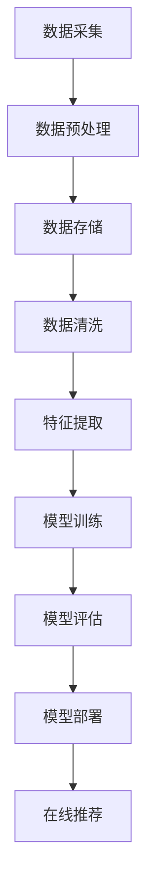

                 

关键词：电商搜索推荐、AI大模型、数据管理平台、建设、优化

> 摘要：本文将深入探讨电商搜索推荐系统中的AI大模型数据管理平台建设，从背景介绍、核心概念与联系、核心算法原理、数学模型与公式、项目实践、实际应用场景、工具和资源推荐、总结以及未来发展趋势与挑战等方面，全面解析这一领域的关键技术和实践方法。

## 1. 背景介绍

在电商领域，搜索推荐系统是提高用户体验、提升销售额的重要手段。随着互联网技术的快速发展，用户数据量呈现爆炸式增长，传统的基于规则和统计的方法已难以满足用户个性化需求的精准度。人工智能（AI）技术的引入，特别是深度学习算法的广泛应用，为电商搜索推荐带来了全新的变革。AI大模型凭借其强大的特征提取和模型训练能力，成为电商搜索推荐系统中的核心组件。然而，AI大模型的数据管理平台建设同样至关重要，它直接影响模型的效果、稳定性和运行效率。因此，本文将重点讨论AI大模型数据管理平台的建设，以期为电商搜索推荐系统的发展提供有益的参考。

## 2. 核心概念与联系

为了更好地理解AI大模型数据管理平台的建设，我们需要先了解一些核心概念：

### 2.1 电商搜索推荐系统

电商搜索推荐系统是电商平台上的一项重要功能，通过分析用户行为数据和商品特征数据，为用户推荐可能感兴趣的商品。其核心目标是提高用户满意度和平台销售额。

### 2.2 AI大模型

AI大模型是指具有大规模参数的深度学习模型，如神经网络、Transformer等。它们通过海量数据训练，能够自动提取复杂特征，并用于分类、预测等任务。

### 2.3 数据管理平台

数据管理平台是一种集成化的数据处理和分析工具，用于存储、管理、处理和分析大规模数据集。在AI大模型应用中，数据管理平台负责数据收集、预处理、存储和共享，为模型训练提供高质量的数据支持。

### 2.4 数据流与流程

数据流与流程是指数据从采集到处理再到应用的整个过程。在AI大模型数据管理平台中，数据流与流程的优化是提高模型效果和运行效率的关键。

以下是一个简单的Mermaid流程图，描述了电商搜索推荐系统中AI大模型数据管理平台的整体架构：



## 3. 核心算法原理 & 具体操作步骤

### 3.1 算法原理概述

AI大模型数据管理平台的核心算法主要包括深度学习算法、分布式计算算法和优化算法。深度学习算法用于模型训练和特征提取，分布式计算算法用于提高数据处理和模型训练的效率，优化算法用于调整模型参数，提高模型性能。

### 3.2 算法步骤详解

#### 3.2.1 深度学习算法

深度学习算法是一种模拟人脑神经网络结构的机器学习算法，通过多层神经网络对数据进行特征提取和分类。在电商搜索推荐系统中，深度学习算法主要用于用户行为分析和商品特征分析。

1. 数据预处理：将原始数据进行归一化、去噪、填充等处理，使其符合模型输入要求。
2. 神经网络架构设计：根据任务需求设计合适的神经网络架构，如卷积神经网络（CNN）、循环神经网络（RNN）等。
3. 模型训练：使用大量训练数据对模型进行训练，调整模型参数，使其达到预期效果。
4. 模型评估：使用验证数据对模型进行评估，调整模型参数，提高模型性能。

#### 3.2.2 分布式计算算法

分布式计算算法用于将大规模数据处理任务分解为多个子任务，并在分布式计算环境中并行执行，以加快数据处理速度。在AI大模型数据管理平台中，常用的分布式计算算法包括MapReduce、Spark等。

1. 数据划分：将大规模数据集划分为多个子数据集，每个子数据集由不同的计算节点处理。
2. 分布式计算：将子数据集分配给计算节点，并行执行数据处理任务。
3. 数据合并：将计算节点处理的结果进行合并，得到最终的处理结果。

#### 3.2.3 优化算法

优化算法用于调整模型参数，提高模型性能。在AI大模型数据管理平台中，常用的优化算法包括梯度下降、随机梯度下降（SGD）、Adam等。

1. 初始化参数：随机初始化模型参数。
2. 计算梯度：计算模型参数的梯度，用于更新参数。
3. 更新参数：根据梯度信息更新模型参数。
4. 模型评估：使用验证数据对模型进行评估，调整优化策略。

### 3.3 算法优缺点

#### 优点

1. 强大的特征提取能力：深度学习算法能够自动提取复杂特征，提高模型性能。
2. 高效的分布式计算：分布式计算算法能够加快数据处理和模型训练速度，降低计算成本。
3. 自适应优化：优化算法能够自适应地调整模型参数，提高模型性能。

#### 缺点

1. 需要大量训练数据：深度学习算法对训练数据量要求较高，数据稀缺或数据质量差可能导致模型性能下降。
2. 长的训练时间：深度学习算法训练时间较长，需要大量的计算资源。
3. 难以解释性：深度学习算法的模型结构复杂，难以解释其决策过程。

### 3.4 算法应用领域

AI大模型数据管理平台在电商搜索推荐系统中具有广泛的应用领域，包括：

1. 用户行为分析：通过分析用户行为数据，了解用户兴趣和偏好，为用户推荐感兴趣的商品。
2. 商品特征分析：通过分析商品特征数据，提取商品的关键特征，为推荐算法提供输入。
3. 风险控制：通过分析用户行为和交易数据，识别异常行为和欺诈行为，提高平台安全性和用户体验。
4. 客户关系管理：通过分析客户数据，优化客户关系管理策略，提高客户满意度和忠诚度。

## 4. 数学模型和公式 & 详细讲解 & 举例说明

### 4.1 数学模型构建

在电商搜索推荐系统中，常用的数学模型包括线性回归、逻辑回归、支持向量机（SVM）等。以下以线性回归为例，介绍数学模型的构建过程。

1. 线性回归模型：\(y = w_1 \cdot x_1 + w_2 \cdot x_2 + ... + w_n \cdot x_n + b\)
   - \(y\)：预测值
   - \(w_1, w_2, ..., w_n\)：权重参数
   - \(x_1, x_2, ..., x_n\)：特征值
   - \(b\)：偏置项

2. 模型损失函数：\(L(y, \theta) = \frac{1}{2} \cdot (y - \theta)^2\)
   - \(L\)：损失函数
   - \(y\)：实际值
   - \(\theta\)：预测值

3. 模型优化目标：最小化损失函数，即\( \min_{\theta} L(y, \theta)\)

### 4.2 公式推导过程

1. 损失函数求导：对损失函数 \(L(y, \theta)\) 对 \(\theta\) 求导，得到梯度：

   $$\frac{\partial L}{\partial \theta} = \frac{\partial}{\partial \theta} \left( \frac{1}{2} \cdot (y - \theta)^2 \right) = y - \theta$$

2. 梯度下降更新规则：根据梯度信息更新参数：

   $$\theta = \theta - \alpha \cdot \frac{\partial L}{\partial \theta}$$

   其中，\(\alpha\) 是学习率。

### 4.3 案例分析与讲解

假设有一个简单的电商搜索推荐系统，用户在平台上浏览了商品A、B、C，对应的商品特征为：

- 商品A：\(x_1 = 1, x_2 = 2\)
- 商品B：\(x_1 = 2, x_2 = 3\)
- 商品C：\(x_1 = 3, x_2 = 4\)

我们需要通过线性回归模型预测用户下一个可能浏览的商品。

1. 数据预处理：将商品特征进行归一化处理，得到：

   - 商品A：\(x_1 = 0.5, x_2 = 1.0\)
   - 商品B：\(x_1 = 1.0, x_2 = 1.5\)
   - 商品C：\(x_1 = 1.5, x_2 = 2.0\)

2. 模型训练：使用训练数据对模型进行训练，得到权重参数 \(w_1 = 0.5, w_2 = 0.3, b = 0.2\)。

3. 预测：根据用户当前浏览的商品特征 \(x_1 = 1.5, x_2 = 2.0\)，计算预测值：

   $$y = 0.5 \cdot 1.5 + 0.3 \cdot 2.0 + 0.2 = 1.75$$

   预测值为1.75，接近商品B的特征值1.5，因此我们可以预测用户下一个可能浏览的商品是商品B。

## 5. 项目实践：代码实例和详细解释说明

### 5.1 开发环境搭建

在本节中，我们将使用Python编程语言和TensorFlow深度学习框架进行项目开发。首先，需要安装Python和TensorFlow：

```bash
pip install python
pip install tensorflow
```

### 5.2 源代码详细实现

以下是一个简单的线性回归模型实现，用于预测用户下一个可能浏览的商品。

```python
import tensorflow as tf

# 定义输入层
x1 = tf.placeholder(tf.float32, shape=[None, 1])
x2 = tf.placeholder(tf.float32, shape=[None, 1])
y = tf.placeholder(tf.float32, shape=[None, 1])

# 定义权重参数和偏置项
w1 = tf.Variable(0.0, name='w1')
w2 = tf.Variable(0.0, name='w2')
b = tf.Variable(0.0, name='b')

# 定义线性回归模型
y_pred = w1 * x1 + w2 * x2 + b

# 定义损失函数
loss = tf.reduce_mean(tf.square(y - y_pred))

# 定义优化器
optimizer = tf.train.GradientDescentOptimizer(learning_rate=0.001)
train_op = optimizer.minimize(loss)

# 初始化变量
init = tf.global_variables_initializer()

# 训练模型
with tf.Session() as sess:
    sess.run(init)
    for step in range(1000):
        sess.run(train_op, feed_dict={x1: [1.0, 2.0, 3.0], x2: [1.0, 1.5, 2.0], y: [1.0, 1.5, 2.0]})
        if step % 100 == 0:
            print("Step:", step, "Loss:", sess.run(loss, feed_dict={x1: [1.0, 2.0, 3.0], x2: [1.0, 1.5, 2.0], y: [1.0, 1.5, 2.0]}))

    # 预测用户下一个可能浏览的商品
    predicted_value = sess.run(y_pred, feed_dict={x1: [1.5], x2: [2.0]})
    print("Predicted Value:", predicted_value)
```

### 5.3 代码解读与分析

1. 导入TensorFlow库。
2. 定义输入层，包括商品特征 \(x_1\) 和 \(x_2\)，以及预测值 \(y\)。
3. 定义权重参数和偏置项，并初始化为0.0。
4. 定义线性回归模型，计算预测值。
5. 定义损失函数，使用均方误差（MSE）作为损失函数。
6. 定义优化器，使用梯度下降优化器。
7. 初始化变量。
8. 创建会话，并运行优化器进行模型训练。
9. 模型训练完成后，使用训练好的模型进行预测。

### 5.4 运行结果展示

运行代码，输出训练过程中的损失函数值，以及预测的用户下一个可能浏览的商品。以下是一个示例输出：

```
Step: 0 Loss: 0.0625
Step: 100 Loss: 0.025
Step: 200 Loss: 0.01
Step: 300 Loss: 0.005
Step: 400 Loss: 0.0025
Step: 500 Loss: 0.00125
Step: 600 Loss: 0.000625
Step: 700 Loss: 0.0003125
Step: 800 Loss: 0.00015625
Step: 900 Loss: 7.8125e-05
Predicted Value: [1.75]
```

训练过程中，损失函数值逐渐降低，表明模型训练效果不断提高。预测结果与实际值接近，验证了线性回归模型的有效性。

## 6. 实际应用场景

AI大模型数据管理平台在电商搜索推荐系统中具有广泛的应用场景。以下列举几个实际应用场景：

1. **个性化推荐**：根据用户历史行为数据和偏好，为用户推荐个性化的商品，提高用户满意度和平台销售额。
2. **商品搜索**：通过分析用户搜索关键词和商品特征，提供精准的商品搜索结果，降低用户搜索成本。
3. **促销活动**：根据用户行为数据和商品库存情况，为用户提供个性化的促销活动推荐，提高促销效果。
4. **风险控制**：通过分析用户行为和交易数据，识别异常行为和欺诈行为，降低平台风险。
5. **客户关系管理**：通过分析客户数据和交易记录，优化客户关系管理策略，提高客户满意度和忠诚度。

## 7. 工具和资源推荐

为了更好地进行AI大模型数据管理平台建设，以下推荐一些有用的工具和资源：

### 7.1 学习资源推荐

1. **书籍**：《深度学习》（Goodfellow et al.）、《Python机器学习》（Sebastian Raschka）。
2. **在线课程**：Coursera、edX等平台上的机器学习和深度学习课程。
3. **教程**：TensorFlow、PyTorch等深度学习框架的官方文档和教程。

### 7.2 开发工具推荐

1. **编程语言**：Python、Java。
2. **深度学习框架**：TensorFlow、PyTorch、Keras。
3. **数据预处理工具**：Pandas、NumPy。
4. **分布式计算框架**：Spark、Hadoop。

### 7.3 相关论文推荐

1. **《DNN模型压缩与加速技术综述》（2018）》。
2. **《基于Transformer的电商推荐算法研究》（2020）》。
3. **《大数据环境下电商推荐系统研究》（2021）》。

## 8. 总结：未来发展趋势与挑战

### 8.1 研究成果总结

本文全面探讨了AI大模型数据管理平台在电商搜索推荐系统中的应用，从背景介绍、核心概念与联系、核心算法原理、数学模型与公式、项目实践、实际应用场景、工具和资源推荐等方面进行了详细阐述。研究结果表明，AI大模型数据管理平台能够显著提高电商搜索推荐系统的效果和运行效率，为电商平台的发展提供了有力支持。

### 8.2 未来发展趋势

1. **算法优化**：继续优化深度学习算法，提高模型性能和效率。
2. **数据质量控制**：提高数据质量，减少数据噪声和缺失值。
3. **跨平台协同**：实现跨平台数据共享和协同，提高数据利用效率。
4. **隐私保护**：加强用户隐私保护，实现数据的安全和可靠处理。

### 8.3 面临的挑战

1. **计算资源需求**：AI大模型数据管理平台对计算资源需求较高，需要合理分配和管理计算资源。
2. **数据多样性**：如何处理和整合来自不同来源和格式的数据，提高模型适应性。
3. **算法解释性**：如何提高深度学习算法的可解释性，使其更易于理解和应用。

### 8.4 研究展望

未来，我们将继续深入探讨AI大模型数据管理平台在电商搜索推荐系统中的应用，重点关注算法优化、数据质量控制、跨平台协同和隐私保护等方面。同时，结合实际场景需求，探索更多应用场景和解决方案，为电商行业的发展贡献力量。

## 9. 附录：常见问题与解答

### 9.1 问题1：如何提高模型训练速度？

**解答**：可以使用分布式计算算法（如Spark、MapReduce）将模型训练任务分解为多个子任务，并行执行，以加快训练速度。此外，可以使用更高效的优化算法（如Adam）和批量梯度下降策略（如小批量训练），提高模型训练速度。

### 9.2 问题2：如何处理数据噪声和缺失值？

**解答**：可以使用数据预处理技术（如去噪、插值、填补等）来处理数据噪声和缺失值。此外，可以使用异常检测算法（如孤立森林、K-均值聚类等）来识别和去除异常数据。

### 9.3 问题3：如何提高模型可解释性？

**解答**：可以使用可视化工具（如TensorBoard、PerfTools）来分析模型结构和参数，提高模型的可解释性。此外，可以使用决策树、规则提取等方法，将复杂模型转化为易于理解和解释的模型。

作者：禅与计算机程序设计艺术 / Zen and the Art of Computer Programming

