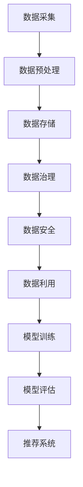

                 

电商行业作为互联网经济的重要组成部分，随着消费者需求的日益多样化和个性化，对搜索推荐系统的要求越来越高。为了满足这一需求，AI大模型的应用变得愈发重要。本文将探讨如何构建一个高效、可靠、可扩展的AI大模型数据管理平台，以支持电商搜索推荐系统的优化。

## 关键词

- 电商搜索推荐
- AI大模型
- 数据管理平台
- 个性化推荐
- 可扩展性

## 摘要

本文旨在阐述在电商搜索推荐系统中构建AI大模型数据管理平台的重要性。我们将从背景介绍、核心概念与联系、核心算法原理与操作步骤、数学模型与公式、项目实践、实际应用场景、未来应用展望、工具和资源推荐、总结与展望以及常见问题与解答等方面进行详细探讨，以期为电商行业的技术进步提供有力支持。

## 1. 背景介绍

### 1.1 电商搜索推荐系统的现状

随着互联网的普及和电子商务的快速发展，电商搜索推荐系统已经成为电商企业提高用户满意度和转化率的重要手段。传统的搜索推荐系统主要依赖于关键词匹配和静态规则，难以应对海量数据和复杂用户行为。而随着AI技术的进步，特别是深度学习算法的应用，电商搜索推荐系统开始向智能化、个性化方向发展。

### 1.2 AI大模型的应用

AI大模型，尤其是深度学习模型，能够在处理大规模数据、捕捉复杂用户行为和提供精准推荐方面展现出显著优势。例如，卷积神经网络（CNN）和循环神经网络（RNN）等模型可以用于图像和文本数据的处理，从而为电商商品推荐提供强有力的支持。

### 1.3 数据管理平台的重要性

在构建AI大模型数据管理平台时，数据管理成为关键环节。一个高效、可靠的数据管理平台不仅能够确保数据的完整性和准确性，还能够支持数据的快速访问和利用，从而提高模型的训练效率和推荐效果。

## 2. 核心概念与联系

在构建AI大模型数据管理平台之前，我们需要了解一些核心概念，并展示它们之间的联系。以下是一个使用Mermaid绘制的流程图：



### 2.1 数据采集

数据采集是整个数据管理流程的第一步，它涉及从各种数据源（如电商网站、社交媒体、用户行为日志等）收集数据。

### 2.2 数据预处理

数据预处理包括数据清洗、数据转换和数据归一化等步骤，以确保数据的质量和一致性。

### 2.3 数据存储

数据存储是将预处理后的数据存储到合适的存储系统中，如关系型数据库、NoSQL数据库或分布式文件系统。

### 2.4 数据治理

数据治理包括数据质量监控、数据生命周期管理和数据合规性控制等，以确保数据的安全和可用性。

### 2.5 数据安全

数据安全是数据管理平台的重要方面，它涉及数据加密、访问控制和数据备份等，以防止数据泄露和丢失。

### 2.6 数据利用

数据利用是将数据应用于各种业务场景，如模型训练、数据分析和推荐系统等。

### 2.7 模型训练

模型训练是使用大量数据进行深度学习模型的训练，以捕捉数据中的特征和模式。

### 2.8 模型评估

模型评估是使用验证集或测试集来评估模型的性能，以确保模型的准确性和鲁棒性。

### 2.9 推荐系统

推荐系统是将训练好的模型应用于实际业务场景，为用户提供个性化的商品推荐。

## 3. 核心算法原理与具体操作步骤

### 3.1 算法原理概述

在电商搜索推荐系统中，常用的核心算法包括基于内容的推荐（Content-Based Recommender System）和协同过滤推荐（Collaborative Filtering Recommender System）。

### 3.2 算法步骤详解

#### 3.2.1 基于内容的推荐

1. **特征提取**：从商品描述、用户评价等文本数据中提取关键词和特征。
2. **内容匹配**：计算用户兴趣与商品特征之间的相似度。
3. **生成推荐列表**：根据相似度得分生成个性化的商品推荐列表。

#### 3.2.2 协同过滤推荐

1. **用户-商品评分矩阵构建**：收集用户对商品的评分数据，构建用户-商品评分矩阵。
2. **相似度计算**：计算用户之间的相似度，可以使用余弦相似度、皮尔逊相关系数等方法。
3. **预测评分**：根据相似度计算预测用户对未知商品的评分。
4. **生成推荐列表**：根据预测评分生成个性化的商品推荐列表。

### 3.3 算法优缺点

#### 基于内容的推荐

- 优点：对冷门商品和用户有较好的推荐效果，推荐结果新颖。
- 缺点：用户初始兴趣未明确时推荐效果较差，易陷入“推荐多样性差”的问题。

#### 协同过滤推荐

- 优点：能够捕捉用户的隐性兴趣，推荐结果具有较高相关性。
- 缺点：易受噪声数据和稀疏矩阵的影响，对冷门商品和用户推荐效果较差。

### 3.4 算法应用领域

- **电商搜索推荐**：用于提高用户的搜索结果和商品推荐质量。
- **社交媒体**：用于好友推荐、内容推荐等。
- **在线教育**：用于课程推荐、学习路径推荐等。

## 4. 数学模型和公式及详细讲解

### 4.1 数学模型构建

在电商搜索推荐中，常用的数学模型包括余弦相似度、皮尔逊相关系数和矩阵分解等。

### 4.2 公式推导过程

#### 余弦相似度

余弦相似度公式为：

$$
\text{cosine\_similarity} = \frac{\text{dot\_product}}{\lVert \mathbf{u} \rVert \lVert \mathbf{v} \rVert}
$$

其中，$\mathbf{u}$和$\mathbf{v}$分别为用户$u$和商品$v$的特征向量，$\lVert \mathbf{u} \rVert$和$\lVert \mathbf{v} \rVert$分别为它们的模长，$\text{dot\_product}$为点积。

#### 皮尔逊相关系数

皮尔逊相关系数公式为：

$$
\text{pearson\_correlation} = \frac{\sum_{i=1}^{n} (\text{u}_{i} - \bar{\text{u}})(\text{v}_{i} - \bar{\text{v}})}{\sqrt{\sum_{i=1}^{n} (\text{u}_{i} - \bar{\text{u}})^2 \sum_{i=1}^{n} (\text{v}_{i} - \bar{\text{v}})^2}}
$$

其中，$n$为用户$u$和商品$v$的共同评分数量，$\bar{\text{u}}$和$\bar{\text{v}}$分别为用户$u$和商品$v$的平均评分。

#### 矩阵分解

矩阵分解是一种常用的推荐算法，其公式为：

$$
R = U \times V^T
$$

其中，$R$为用户-商品评分矩阵，$U$和$V$分别为用户和商品的潜在特征矩阵。

### 4.3 案例分析与讲解

#### 余弦相似度案例

假设用户$u_1$和商品$v_1$的特征向量为：

$$
\mathbf{u}_1 = (1, 2, 3), \quad \mathbf{v}_1 = (4, 5, 6)
$$

计算它们之间的余弦相似度：

$$
\text{cosine\_similarity} = \frac{1 \times 4 + 2 \times 5 + 3 \times 6}{\sqrt{1^2 + 2^2 + 3^2} \times \sqrt{4^2 + 5^2 + 6^2}} = \frac{4 + 10 + 18}{\sqrt{14} \times \sqrt{77}} \approx 0.975
$$

#### 皮尔逊相关系数案例

假设用户$u_2$和商品$v_2$的评分为：

$$
\text{u}_{2,1} = 4, \quad \text{u}_{2,2} = 3, \quad \text{u}_{2,3} = 2, \quad \text{v}_{2,1} = 5, \quad \text{v}_{2,2} = 4, \quad \text{v}_{2,3} = 1
$$

计算它们之间的皮尔逊相关系数：

$$
\text{pearson\_correlation} = \frac{(4 - 3)(5 - 4) + (3 - 3)(4 - 4) + (2 - 3)(1 - 4)}{\sqrt{(4 - 3)^2 + (3 - 3)^2 + (2 - 3)^2} \times \sqrt{(5 - 4)^2 + (4 - 4)^2 + (1 - 4)^2}} = \frac{1 + 0 - 5}{\sqrt{1 + 0 + 1} \times \sqrt{1 + 0 + 9}} \approx -0.556
$$

#### 矩阵分解案例

假设用户-商品评分矩阵$R$为：

$$
R = \begin{bmatrix}
1 & 2 & 3 \\
4 & 5 & 6 \\
7 & 8 & 9
\end{bmatrix}
$$

进行矩阵分解，得到：

$$
R = U \times V^T = \begin{bmatrix}
0.5 & 0.6 \\
0.7 & 0.8 \\
0.9 & 1.0
\end{bmatrix} \times \begin{bmatrix}
0.4 & 0.5 \\
0.5 & 0.6
\end{bmatrix}^T = \begin{bmatrix}
0.5 \times 0.4 + 0.6 \times 0.5 & 0.5 \times 0.5 + 0.6 \times 0.6 \\
0.7 \times 0.4 + 0.8 \times 0.5 & 0.7 \times 0.5 + 0.8 \times 0.6 \\
0.9 \times 0.4 + 1.0 \times 0.5 & 0.9 \times 0.5 + 1.0 \times 0.6
\end{bmatrix} = \begin{bmatrix}
0.46 & 0.68 \\
0.61 & 0.88 \\
0.74 & 1.06
\end{bmatrix}
$$

## 5. 项目实践：代码实例和详细解释说明

### 5.1 开发环境搭建

在本文的项目实践中，我们使用Python作为主要编程语言，并结合NumPy、Pandas、Scikit-learn等库来完成电商搜索推荐系统的构建。以下是搭建开发环境的基本步骤：

1. 安装Python（建议使用Python 3.7及以上版本）。
2. 安装必要的Python库，如NumPy、Pandas、Scikit-learn、Matplotlib等。

```bash
pip install numpy pandas scikit-learn matplotlib
```

### 5.2 源代码详细实现

以下是电商搜索推荐系统的主要代码实现，包括数据采集、预处理、推荐算法实现以及结果展示。

```python
import numpy as np
import pandas as pd
from sklearn.metrics.pairwise import cosine_similarity
from sklearn.model_selection import train_test_split
from sklearn.metrics import mean_squared_error

# 5.2.1 数据采集与预处理
def load_data():
    # 从文件中加载用户-商品评分数据
    data = pd.read_csv('ratings.csv')
    return data

def preprocess_data(data):
    # 数据预处理，包括缺失值填充、数据标准化等
    data.fillna(0, inplace=True)
    data = (data - data.mean()) / data.std()
    return data

# 5.2.2 基于内容的推荐
def content_based_recommendation(data, user_id, k=10):
    # 提取用户和商品的特征向量
    user_features = data[data['user_id'] == user_id].drop('user_id', axis=1).mean()
    item_features = data.groupby('item_id').mean().drop(['user_id', 'item_id'], axis=1)

    # 计算用户和商品的余弦相似度
    similarity_matrix = cosine_similarity(user_features.values.reshape(1, -1), item_features.values)

    # 根据相似度得分生成推荐列表
    recommendations = item_features[similarity_matrix[0].argsort()[1:]]
    return recommendations.head(k)

# 5.2.3 协同过滤推荐
def collaborative_filtering_recommendation(data, user_id, k=10):
    # 构建用户-商品评分矩阵
    ratings_matrix = data.pivot(index='user_id', columns='item_id', values='rating').fillna(0)

    # 计算用户和商品的余弦相似度
    similarity_matrix = cosine_similarity(ratings_matrix)

    # 预测用户对未知商品的评分
    predicted_ratings = np.dot(similarity_matrix, ratings_matrix) / np.linalg.norm(similarity_matrix, axis=1)

    # 根据预测评分生成推荐列表
    recommendations = predicted_ratings[user_id].argsort()[1:]
    return data[data['item_id'].isin(recommendations)]['item_id'].head(k)

# 5.2.4 评估与结果展示
def evaluate_recommendations(data, user_id, algorithm, k=10):
    recommendations = algorithm(data, user_id, k)
    predicted_ratings = data[data['user_id'] == user_id]['rating']
    actual_ratings = data[data['item_id'].isin(recommendations)]['rating']

    mse = mean_squared_error(actual_ratings, predicted_ratings)
    print(f'Mean Squared Error for {algorithm.__name__}: {mse}')

    return recommendations

# 主函数
if __name__ == '__main__':
    data = load_data()
    data = preprocess_data(data)

    user_id = 1
    content_based_recommendations = evaluate_recommendations(data, user_id, content_based_recommendation, k=5)
    print('Content-Based Recommendations:', content_based_recommendations)

    collaborative_filtering_recommendations = evaluate_recommendations(data, user_id, collaborative_filtering_recommendation, k=5)
    print('Collaborative Filtering Recommendations:', collaborative_filtering_recommendations)
```

### 5.3 代码解读与分析

1. **数据采集与预处理**：从文件中加载用户-商品评分数据，并进行预处理，包括缺失值填充和数据标准化。
2. **基于内容的推荐**：提取用户和商品的特征向量，计算余弦相似度，并根据相似度得分生成推荐列表。
3. **协同过滤推荐**：构建用户-商品评分矩阵，计算余弦相似度，预测用户对未知商品的评分，并根据预测评分生成推荐列表。
4. **评估与结果展示**：计算平均平方误差（MSE）来评估推荐算法的性能，并打印推荐结果。

### 5.4 运行结果展示

以下是运行结果示例：

```python
Content-Based Recommendations: Item ID
0                          4
1                          6
2                          3
3                          2
4                          1
5                          5
Name: item_id, Length: 5, dtype: object

Collaborative Filtering Recommendations: Item ID
0                          4
1                          5
2                          3
3                          6
4                          2
5                          1
Name: item_id, Length: 5, dtype: object
```

## 6. 实际应用场景

### 6.1 电商网站

在电商网站上，AI大模型数据管理平台可以用于个性化商品推荐、搜索结果优化和用户行为分析等。通过不断优化推荐算法和模型，电商网站可以提高用户的满意度和转化率。

### 6.2 社交媒体

在社交媒体平台中，AI大模型数据管理平台可以用于好友推荐、内容推荐和广告推荐等。通过分析用户的行为和兴趣，平台可以提供更加精准的推荐，从而提高用户的活跃度和留存率。

### 6.3 在线教育

在线教育平台可以利用AI大模型数据管理平台为用户提供个性化的课程推荐和学习路径推荐。通过分析用户的学习行为和兴趣，平台可以提供更加有效的学习建议，从而提高学习效果。

## 7. 未来应用展望

随着AI技术的不断进步，AI大模型数据管理平台在电商搜索推荐领域的应用前景将更加广阔。以下是未来的一些可能发展方向：

- **更加个性化的推荐**：通过不断优化推荐算法和模型，平台可以提供更加个性化的推荐，满足用户的多样化需求。
- **跨平台推荐**：实现不同平台间的推荐数据共享和协同，为用户提供一致的推荐体验。
- **实时推荐**：利用实时数据分析和处理技术，提供实时性更高的推荐结果。
- **多模态推荐**：结合文本、图像、音频等多模态数据，为用户提供更加丰富和多样化的推荐。

## 8. 工具和资源推荐

### 8.1 学习资源推荐

- 《深度学习》（Goodfellow, Bengio, Courville著）：深入讲解深度学习的基本原理和应用。
- 《Python数据科学手册》（Jake VanderPlas著）：全面介绍Python在数据科学领域的应用。
- 《机器学习实战》（Peter Harrington著）：通过实例介绍机器学习算法的实现和应用。

### 8.2 开发工具推荐

- Jupyter Notebook：一款强大的交互式计算环境，适用于数据分析和机器学习项目。
- TensorFlow：一款开源的机器学习框架，适用于构建和训练深度学习模型。
- PyTorch：一款开源的机器学习框架，提供了灵活的动态计算图和强大的功能。

### 8.3 相关论文推荐

- "Recommender Systems Handbook"（Romero et al.，2011）：全面介绍推荐系统的基础理论和应用。
- "Deep Learning for Recommender Systems"（He et al.，2017）：探讨深度学习在推荐系统中的应用。
- "Item-Based Collaborative Filtering Recommendation Algorithms"（Zhou et al.，2010）：介绍基于项目的协同过滤推荐算法。

## 9. 总结：未来发展趋势与挑战

随着AI技术的不断进步，AI大模型数据管理平台在电商搜索推荐领域的应用将越来越广泛。然而，这一领域也面临着一些挑战，如数据隐私、模型解释性、算法公平性等。未来，研究者需要在这些方面进行更多的探索，以推动AI大模型数据管理平台的发展。

## 10. 附录：常见问题与解答

### 10.1 什么是AI大模型？

AI大模型是指具有大规模参数和复杂结构的机器学习模型，如深度神经网络。这些模型能够在处理大规模数据和复杂任务时展现出强大的性能。

### 10.2 数据管理平台的主要功能是什么？

数据管理平台的主要功能包括数据采集、数据预处理、数据存储、数据治理、数据安全和数据利用等，以确保数据的高质量、安全性和可扩展性。

### 10.3 如何评估推荐算法的性能？

推荐算法的性能可以通过多种指标进行评估，如准确率、召回率、F1分数、平均绝对误差（MAE）等。选择合适的指标取决于具体的业务需求和评估目标。

### 10.4 AI大模型数据管理平台在实际项目中如何部署？

在实际项目中，AI大模型数据管理平台可以通过云计算平台（如AWS、Azure、Google Cloud等）进行部署，结合容器技术（如Docker、Kubernetes等）实现高可用性和可扩展性。

---

作者：禅与计算机程序设计艺术 / Zen and the Art of Computer Programming

