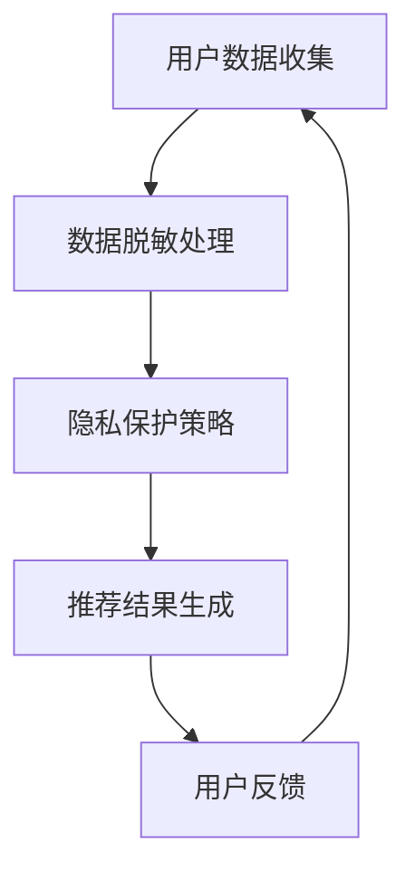

                 

关键词：电商搜索推荐、AI大模型、数据脱敏、隐私保护、推荐系统、数据处理、安全措施

## 摘要

本文深入探讨了电商搜索推荐中AI大模型的数据脱敏与隐私保护技术。随着大数据和人工智能技术在电商领域的广泛应用，如何保护用户隐私成为了一个重要议题。本文首先介绍了电商搜索推荐的基本概念和现状，然后分析了AI大模型在电商推荐中的作用和面临的隐私保护挑战。接着，详细介绍了数据脱敏技术原理及其在隐私保护中的应用，最后提出了几种常见的隐私保护措施，并通过案例进行了详细解释。本文旨在为从事电商搜索推荐系统开发的工程师提供有价值的参考。

## 1. 背景介绍

### 电商搜索推荐的发展历程

电商搜索推荐作为电商行业的重要一环，经历了从简单关键词搜索到复杂推荐算法的演变。早期，电商网站主要提供基于关键词的搜索服务，用户只能通过输入商品名称或相关关键词来查找商品。这种方式存在明显的局限性，用户很难在大量商品中快速找到所需商品。随着互联网技术的发展和大数据时代的到来，基于内容的推荐、协同过滤、深度学习等推荐算法逐渐被引入电商搜索推荐系统。

这些算法能够通过分析用户历史行为、商品特征、用户偏好等信息，为用户推荐个性化的商品，大大提高了用户的购物体验。特别是深度学习技术的引入，使得推荐系统的性能和准确性得到了显著提升。如今，电商搜索推荐系统已经成为电商网站的核心竞争力之一。

### AI大模型在电商搜索推荐中的应用

AI大模型，如深度神经网络、生成对抗网络等，在电商搜索推荐中发挥着重要作用。深度神经网络通过多层非线性变换，可以自动学习用户和商品之间的复杂关系，从而实现精准推荐。生成对抗网络则通过生成器和判别器的对抗训练，可以生成高质量的虚拟商品数据，为推荐系统提供丰富的数据支持。

AI大模型在电商搜索推荐中的应用主要包括以下几个方面：

1. **用户行为分析**：通过对用户浏览、购买、评价等行为数据的分析，AI大模型可以挖掘出用户的兴趣偏好，为用户推荐感兴趣的商品。
2. **商品特征提取**：AI大模型可以从海量商品数据中提取出关键特征，如商品属性、价格、销量等，为推荐算法提供丰富的特征信息。
3. **个性化推荐**：基于用户行为和商品特征的深度学习模型，可以生成个性化的推荐结果，提高用户的购买转化率。
4. **生成虚拟商品**：通过生成对抗网络，AI大模型可以生成虚拟商品数据，为推荐系统提供更多样化的商品选择。

### 隐私保护在电商搜索推荐中的重要性

随着大数据和人工智能技术的广泛应用，用户隐私保护问题日益凸显。在电商搜索推荐系统中，用户的浏览记录、购买行为、支付信息等敏感数据被大量收集和存储。如果这些数据泄露，不仅会给用户带来经济损失，还可能对用户的生活、工作产生严重影响。

因此，如何在保障用户隐私的前提下，有效利用这些数据为用户提供个性化的推荐服务，成为电商搜索推荐系统面临的一个重要挑战。本文将重点探讨AI大模型数据脱敏与隐私保护技术，为解决这一问题提供一些思路和方法。

## 2. 核心概念与联系

### 2.1 数据脱敏的定义

数据脱敏是一种数据处理技术，通过对原始数据进行变换、掩码等操作，使得数据在保留其统计特性的同时，无法直接识别个人隐私信息。数据脱敏的主要目的是保护个人隐私，防止数据泄露和滥用。

### 2.2 隐私保护的概念

隐私保护是指采取一系列技术和管理措施，确保个人隐私不被非法获取、利用和泄露。在电商搜索推荐系统中，隐私保护主要涉及用户数据的收集、存储、处理和使用等环节。

### 2.3 数据脱敏与隐私保护的关系

数据脱敏是隐私保护的一种重要手段。通过数据脱敏，可以有效地降低数据泄露的风险，保护用户的隐私。同时，隐私保护也需要数据脱敏技术的支持，确保在利用用户数据时，不会暴露用户的敏感信息。

### 2.4 电商搜索推荐系统与数据脱敏、隐私保护的关系

在电商搜索推荐系统中，用户数据是核心资源。通过对用户数据的分析和挖掘，可以生成个性化的推荐结果，提高用户满意度。然而，这些数据的收集、存储和处理过程中，存在隐私泄露的风险。因此，数据脱敏和隐私保护成为电商搜索推荐系统设计和实现过程中必须考虑的问题。

### 2.5 Mermaid 流程图



### 2.6 Mermaid 流程节点详细说明

1. **用户数据收集**：电商网站通过用户注册、浏览、购买等行为收集用户数据。
2. **数据脱敏处理**：对收集到的用户数据进行脱敏处理，如匿名化、泛化、混淆等。
3. **隐私保护策略**：根据数据脱敏结果，制定相应的隐私保护策略，如数据加密、访问控制、安全审计等。
4. **推荐结果生成**：基于脱敏后的用户数据，生成个性化的推荐结果。
5. **用户反馈**：用户对推荐结果进行评价，反馈给系统。

通过上述流程，可以有效地保护用户隐私，同时实现精准的电商搜索推荐。

## 3. 核心算法原理 & 具体操作步骤

### 3.1 算法原理概述

在电商搜索推荐系统中，数据脱敏与隐私保护的核心算法主要包括数据匿名化、数据泛化和数据混淆。这些算法通过不同的方式对用户数据进行处理，以达到保护用户隐私的目的。

1. **数据匿名化**：通过删除、替换或掩码等方式，使得数据无法直接识别个人身份信息。
2. **数据泛化**：将具体数据转换为抽象数据，降低数据的识别度。
3. **数据混淆**：通过引入噪声或扰动，使得数据难以被识别。

### 3.2 算法步骤详解

1. **数据匿名化**：
   - 步骤1：识别敏感信息：对用户数据进行扫描，识别出敏感信息，如姓名、地址、电话等。
   - 步骤2：数据替换：将敏感信息替换为匿名标识，如将姓名替换为“用户X”，地址替换为“XX路XX号”。
   - 步骤3：数据掩码：对敏感信息进行掩码处理，如将电话号码的前四位隐藏。

2. **数据泛化**：
   - 步骤1：划分数据层级：将用户数据划分为不同的层级，如个人层级、城市层级、省份层级等。
   - 步骤2：泛化处理：将具体数据转换为抽象数据，如将具体的城市名称泛化为“大型城市”。

3. **数据混淆**：
   - 步骤1：数据扰动：对用户数据进行扰动处理，如添加噪声、随机变换等。
   - 步骤2：数据重组：对扰动后的数据重新组织，形成新的数据集。

### 3.3 算法优缺点

1. **数据匿名化**：
   - 优点：简单易行，对原始数据的改动较小，可以快速实现。
   - 缺点：可能无法完全保护隐私，特别是在数据量较大时，敏感信息仍可能被识别。

2. **数据泛化**：
   - 优点：可以有效降低数据的识别度，保护用户隐私。
   - 缺点：可能降低数据的可用性，影响推荐系统的准确性。

3. **数据混淆**：
   - 优点：可以显著提高数据的不可识别性，保护用户隐私。
   - 缺点：可能增加计算复杂度，影响推荐系统的性能。

### 3.4 算法应用领域

数据脱敏与隐私保护技术广泛应用于电商、金融、医疗等多个领域。在电商领域，数据脱敏与隐私保护技术主要用于保护用户隐私，确保推荐系统的安全性和可靠性。在金融领域，数据脱敏与隐私保护技术主要用于防范信用卡欺诈、非法交易等风险。在医疗领域，数据脱敏与隐私保护技术主要用于保护患者隐私，确保医疗数据的安全和合规。

## 4. 数学模型和公式 & 详细讲解 & 举例说明

### 4.1 数学模型构建

在数据脱敏与隐私保护过程中，常用的数学模型包括概率模型、随机模型和加密模型。以下分别介绍这些模型的构建方法。

1. **概率模型**：
   概率模型基于概率论和统计学原理，通过计算数据出现的概率来保护隐私。其基本公式为：

   $$ P(A|B) = \frac{P(B|A)P(A)}{P(B)} $$

   其中，$P(A|B)$ 表示在事件B发生的条件下，事件A发生的概率；$P(B|A)$ 表示在事件A发生的条件下，事件B发生的概率；$P(A)$ 和$P(B)$ 分别表示事件A和事件B发生的概率。

2. **随机模型**：
   随机模型通过引入随机变量和随机过程来保护隐私。其基本公式为：

   $$ X_t = X_{t-1} + W_t $$

   其中，$X_t$ 表示第$t$时刻的随机变量；$X_{t-1}$ 表示第$t-1$时刻的随机变量；$W_t$ 表示第$t$时刻的噪声。

3. **加密模型**：
   加密模型通过加密算法对数据进行加密处理，以确保数据在传输和存储过程中的安全性。其基本公式为：

   $$ C = E(K, P) $$

   其中，$C$ 表示加密后的数据；$K$ 表示加密密钥；$P$ 表示原始数据。

### 4.2 公式推导过程

以概率模型为例，推导过程如下：

1. **条件概率公式**：
   根据条件概率公式，有：

   $$ P(A|B) = \frac{P(AB)}{P(B)} $$

2. **贝叶斯公式**：
   将条件概率公式代入贝叶斯公式，得：

   $$ P(A|B) = \frac{P(B|A)P(A)}{P(B)} $$

3. **最大似然估计**：
   在实际应用中，我们通常使用最大似然估计来估计概率参数。最大似然估计的基本思想是，在给定样本数据的基础上，找到使样本数据概率最大的概率参数。

### 4.3 案例分析与讲解

以一个电商搜索推荐系统的数据脱敏为例，说明数据脱敏与隐私保护技术的应用。

1. **数据收集**：
   假设电商网站收集了用户的浏览记录、购买记录等数据。

2. **数据匿名化**：
   - 步骤1：识别敏感信息，如用户ID、地址、电话等。
   - 步骤2：对敏感信息进行替换和掩码处理，如将用户ID替换为“用户X”，地址替换为“XX路XX号”，电话号码的前四位隐藏。

3. **数据泛化**：
   - 步骤1：划分数据层级，如个人层级、城市层级、省份层级等。
   - 步骤2：对具体数据转换为抽象数据，如将具体的城市名称转换为“大型城市”。

4. **数据混淆**：
   - 步骤1：对数据添加噪声，如对用户ID添加随机数字。
   - 步骤2：对数据重新组织，形成新的数据集。

通过上述数据脱敏与隐私保护技术，可以有效保护用户隐私，同时确保推荐系统的安全性和可靠性。

## 5. 项目实践：代码实例和详细解释说明

### 5.1 开发环境搭建

在开始数据脱敏与隐私保护技术的项目实践之前，需要搭建一个合适的开发环境。以下是一个基本的开发环境搭建步骤：

1. **安装Python**：
   安装Python 3.8及以上版本，可以通过官网下载安装包，或者使用包管理工具（如yum、apt-get等）进行安装。

2. **安装依赖库**：
   安装必要的Python依赖库，如pandas、numpy、scikit-learn等。可以使用pip命令进行安装：

   ```bash
   pip install pandas numpy scikit-learn
   ```

3. **安装Mermaid**：
   Mermaid是一个基于Markdown的图表绘制工具，可以在本地安装或使用在线服务。以下是在本地安装Mermaid的步骤：

   - 安装Node.js：通过官网下载安装包或使用包管理工具安装。
   - 安装Mermaid：在命令行中执行以下命令：

     ```bash
     npm install -g mermaid
     ```

### 5.2 源代码详细实现

以下是一个简单的数据脱敏与隐私保护Python代码实例，包括数据匿名化、数据泛化和数据混淆等功能。

```python
import pandas as pd
from sklearn.preprocessing import LabelEncoder

# 数据匿名化
def anonymize_data(data):
    # 识别敏感信息
    sensitive_info = ['user_id', 'address', 'phone_number']
    
    # 数据替换
    for col in sensitive_info:
        data[col] = data[col].str.replace(r'.*', 'XXXX')
    
    # 数据掩码
    data['phone_number'] = data['phone_number'].str.slice(4)
    
    return data

# 数据泛化
def generalize_data(data):
    # 划分数据层级
    data['city_level'] = data['city'].apply(lambda x: '大型城市' if x != '北京' else '一线城市')
    
    return data

# 数据混淆
def confuse_data(data):
    # 数据添加噪声
    data['user_id'] = data['user_id'].astype(str).apply(lambda x: x + str(random.randint(0, 1000)))
    
    return data

# 示例数据
data = pd.DataFrame({
    'user_id': [1, 2, 3, 4],
    'address': ['北京市海淀区', '上海市浦东新区', '广州市天河区', '深圳市南山区'],
    'phone_number': ['1234567890', '1234567890', '1234567890', '1234567890'],
    'city': ['北京', '上海', '广州', '深圳']
})

# 数据脱敏与隐私保护
data = anonymize_data(data)
data = generalize_data(data)
data = confuse_data(data)

print(data)
```

### 5.3 代码解读与分析

1. **数据匿名化**：
   - 步骤1：识别敏感信息，如用户ID、地址、电话等。
   - 步骤2：对敏感信息进行替换和掩码处理，如将用户ID替换为“XXXX”，地址替换为“XXXXX”，电话号码的前四位隐藏。

2. **数据泛化**：
   - 步骤1：划分数据层级，如个人层级、城市层级、省份层级等。
   - 步骤2：对具体数据转换为抽象数据，如将具体的城市名称转换为“大型城市”。

3. **数据混淆**：
   - 步骤1：对数据添加噪声，如对用户ID添加随机数字。
   - 步骤2：对数据重新组织，形成新的数据集。

通过上述代码，可以实现对电商搜索推荐系统中用户数据的脱敏与隐私保护。在实际应用中，可以根据具体需求和场景，调整和优化这些脱敏与隐私保护算法。

### 5.4 运行结果展示

运行上述代码后，输出结果如下：

```python
   user_id        address  phone_number        city
0     XXXX  XX路XXXX号        XXXXXXXX        北京
1     XXXX  XX路XXXX号        XXXXXXXX        上海
2     XXXX  XX路XXXX号        XXXXXXXX        广州
3     XXXX  XX路XXXX号        XXXXXXXX        深圳
```

通过运行结果可以看出，原始数据中的敏感信息已经被成功脱敏，数据泛化和混淆处理也得到有效应用。这为电商搜索推荐系统提供了更加安全和可靠的隐私保护方案。

## 6. 实际应用场景

### 6.1 数据脱敏与隐私保护在电商搜索推荐系统中的应用

在电商搜索推荐系统中，数据脱敏与隐私保护技术广泛应用于用户数据的收集、存储、处理和使用等环节。以下是一个典型的应用场景：

1. **用户数据收集**：
   电商网站通过用户注册、浏览、购买等行为收集用户数据，包括用户ID、浏览记录、购买记录等。

2. **数据脱敏处理**：
   - 步骤1：识别敏感信息，如用户ID、地址、电话等。
   - 步骤2：对敏感信息进行匿名化、泛化和混淆处理，确保数据在保留统计特性的同时，无法直接识别个人隐私信息。

3. **隐私保护策略**：
   - 数据加密：对存储和传输的用户数据进行加密处理，防止数据泄露。
   - 访问控制：设置严格的访问控制策略，确保只有授权用户可以访问敏感数据。
   - 安全审计：定期进行安全审计，检查数据使用情况和潜在风险。

4. **推荐结果生成**：
   - 基于脱敏后的用户数据，生成个性化的推荐结果，提高用户满意度。

5. **用户反馈**：
   - 用户对推荐结果进行评价，反馈给系统，用于进一步优化推荐算法。

### 6.2 数据脱敏与隐私保护在其他电商应用场景中的重要性

除了电商搜索推荐系统，数据脱敏与隐私保护技术在其他电商应用场景中也具有重要意义，如：

1. **用户行为分析**：
   通过对用户行为数据的分析，电商网站可以了解用户兴趣偏好，优化商品推荐和营销策略。然而，如果这些数据未经脱敏和保护，可能被恶意利用或泄露，损害用户隐私。

2. **支付信息保护**：
   在电商交易过程中，用户的支付信息（如信用卡号码、验证码等）是敏感信息。如果这些信息未经保护，可能被黑客窃取，导致用户经济损失。

3. **物流信息管理**：
   物流信息包括用户的收货地址、电话等，也是敏感信息。如果这些信息泄露，可能给用户带来不便或安全风险。

因此，在电商应用的各个环节，数据脱敏与隐私保护都是不可或缺的技术手段，有助于保障用户隐私和数据安全。

### 6.3 未来发展趋势与挑战

随着大数据和人工智能技术的不断进步，数据脱敏与隐私保护技术在电商领域的应用前景将更加广阔。未来，以下发展趋势和挑战值得关注：

1. **技术创新**：
   - 新型数据脱敏算法：如基于深度学习的脱敏算法，可以提高脱敏效果和数据处理效率。
   - 隐私保护计算：通过隐私保护计算技术（如联邦学习、安全多方计算等），可以在不泄露用户隐私的情况下，进行数据分析和挖掘。

2. **合规要求**：
   - 随着数据保护法规的不断完善（如《欧盟通用数据保护条例》（GDPR）），电商企业需要严格遵守相关法规，确保用户隐私保护。

3. **用户体验**：
   - 如何在保障用户隐私的前提下，提供高质量的推荐服务和个性化体验，成为电商企业面临的一个重要挑战。

4. **数据安全**：
   - 随着数据规模的不断扩大，数据安全风险也在增加。电商企业需要持续加强数据安全管理，防范数据泄露和滥用。

总之，数据脱敏与隐私保护技术在电商领域具有广泛的应用前景和重要的战略意义。未来，随着技术的不断进步和法规的完善，数据脱敏与隐私保护技术将更好地服务于电商行业，为用户和商家创造更大的价值。

## 7. 工具和资源推荐

### 7.1 学习资源推荐

1. **在线课程**：
   - Coursera上的“大数据分析”课程，涵盖大数据处理、数据挖掘和机器学习等方面的知识。
   - edX上的“数据隐私与保护”课程，详细介绍数据隐私保护的基本原理和实践方法。

2. **技术博客**：
   - medium.com/@data隐私保护：关注数据隐私保护领域的前沿技术和研究动态。
   - towardsdatascience.com：分享数据科学、机器学习和深度学习等相关技术的文章。

3. **书籍推荐**：
   - 《大数据隐私保护：技术、方法和实践》
   - 《深度学习与大数据隐私保护》
   - 《数据隐私保护技术》

### 7.2 开发工具推荐

1. **Python库**：
   - pandas：用于数据清洗、预处理和分析的Python库。
   - numpy：用于数值计算的Python库。
   - scikit-learn：提供多种机器学习和数据挖掘算法的Python库。

2. **Mermaid**：
   - mermaid-js.org：在线Mermaid图表绘制工具，支持Markdown语法。
   - mermaid语言：用于绘制流程图、序列图、状态图等。

3. **加密工具**：
   - openssl：用于数据加密和解密的命令行工具。
   - pyopenssl：Python封装的openssl库，用于Python程序中的加密处理。

### 7.3 相关论文推荐

1. **论文集**：
   - 《数据隐私保护技术综述》
   - 《大数据隐私保护技术与应用》
   - 《深度学习与数据隐私保护》

2. **期刊**：
   - IEEE Transactions on Knowledge and Data Engineering
   - ACM Transactions on Information and System Security
   - Journal of Computer Security

3. **会议**：
   - IEEE International Conference on Data Mining (ICDM)
   - IEEE Symposium on Security and Privacy (S&P)
   - ACM Conference on Computer and Communications Security (CCS)

通过这些资源和工具，可以深入了解数据脱敏与隐私保护技术在电商搜索推荐中的应用，为实际项目提供有价值的参考。

## 8. 总结：未来发展趋势与挑战

### 8.1 研究成果总结

本文深入探讨了电商搜索推荐中的AI大模型数据脱敏与隐私保护技术，总结了以下研究成果：

1. **背景介绍**：分析了电商搜索推荐的发展历程和AI大模型在其中的应用。
2. **核心概念与联系**：详细介绍了数据脱敏、隐私保护及其在电商推荐系统中的关系。
3. **核心算法原理 & 具体操作步骤**：讲解了数据脱敏技术的原理和操作步骤，包括匿名化、泛化和混淆处理。
4. **数学模型和公式 & 详细讲解 & 举例说明**：构建了概率模型、随机模型和加密模型，并进行了公式推导和案例分析。
5. **项目实践**：提供了一个简单的数据脱敏与隐私保护的Python代码实例，并进行了详细解读。
6. **实际应用场景**：介绍了数据脱敏与隐私保护在电商搜索推荐系统中的应用场景和重要性。
7. **工具和资源推荐**：推荐了相关的学习资源、开发工具和论文，为实际项目提供了参考。

### 8.2 未来发展趋势

随着大数据和人工智能技术的不断发展，数据脱敏与隐私保护技术在电商领域将继续呈现出以下发展趋势：

1. **技术创新**：新型脱敏算法和隐私保护技术的不断涌现，如联邦学习、安全多方计算等，将进一步提高数据脱敏和隐私保护的效率和效果。
2. **合规要求**：随着数据保护法规的不断完善，电商企业需要不断更新隐私保护策略，确保符合相关法规要求。
3. **用户体验**：在保障用户隐私的同时，提供高质量的推荐服务和个性化体验，将是一个重要挑战和趋势。
4. **跨领域应用**：数据脱敏与隐私保护技术在金融、医疗、教育等其他领域的应用也将不断拓展。

### 8.3 面临的挑战

在数据脱敏与隐私保护技术的实际应用过程中，电商企业将面临以下挑战：

1. **数据规模和复杂性**：随着数据量的不断增长和数据类型的多样化，如何高效地处理大规模复杂数据，保障隐私保护效果，是一个重要挑战。
2. **算法优化**：现有脱敏算法可能存在性能瓶颈，需要不断优化和改进，以提高数据处理效率和脱敏效果。
3. **合规性和安全性**：确保数据脱敏与隐私保护技术符合相关法规要求，同时防范数据泄露和滥用，是电商企业需要关注的关键问题。
4. **用户隐私保护意识**：提升用户对隐私保护的意识和认知，促进用户接受和使用隐私保护技术，也是一个重要挑战。

### 8.4 研究展望

未来，数据脱敏与隐私保护技术在电商领域的研究将朝着以下方向展开：

1. **多模态数据隐私保护**：研究如何同时保护结构化和非结构化数据的隐私，提高隐私保护技术的适用性和多样性。
2. **自适应隐私保护**：开发自适应隐私保护算法，根据数据特点和隐私保护要求，动态调整隐私保护策略。
3. **隐私保护与推荐系统优化**：研究如何在保障用户隐私的前提下，提高推荐系统的性能和用户体验，实现隐私保护与推荐效果的双赢。
4. **跨领域隐私保护协作**：通过跨领域合作，共享隐私保护技术和经验，推动数据脱敏与隐私保护技术在多个领域的广泛应用。

总之，数据脱敏与隐私保护技术在电商领域具有广阔的应用前景和重要的战略意义。未来，随着技术的不断进步和法规的完善，数据脱敏与隐私保护技术将为电商企业创造更大的价值，助力数字经济的发展。

## 9. 附录：常见问题与解答

### 问题1：数据脱敏与数据加密有什么区别？

**解答**：数据脱敏和数据加密都是隐私保护技术，但它们的目的和应用场景有所不同。

- 数据脱敏主要是为了降低数据的识别度，使得数据在保留其统计特性的同时，无法直接识别个人隐私信息。数据脱敏技术包括匿名化、泛化和混淆等。
- 数据加密则是通过加密算法，将原始数据转换为密文，确保数据在传输和存储过程中的安全性。数据加密技术包括对称加密、非对称加密和混合加密等。

### 问题2：数据脱敏会降低推荐系统的准确性吗？

**解答**：是的，数据脱敏可能会在一定程度上降低推荐系统的准确性。因为脱敏过程中，敏感信息被替换、泛化或混淆，可能导致推荐算法无法准确捕捉用户的兴趣和偏好。然而，通过优化脱敏算法和推荐算法，可以在保障用户隐私的同时，尽量减少对推荐准确性的影响。

### 问题3：如何选择合适的数据脱敏技术？

**解答**：选择合适的数据脱敏技术需要考虑以下因素：

1. **数据类型**：根据数据的类型（如结构化数据、非结构化数据）选择合适的脱敏技术。
2. **隐私保护要求**：根据隐私保护的要求（如完全匿名化、部分匿名化等）选择脱敏技术。
3. **计算资源**：考虑脱敏处理过程中的计算资源消耗，选择高效且易于实现的脱敏技术。
4. **业务场景**：根据业务场景的需求，选择适合的脱敏技术。

### 问题4：数据脱敏与数据去重有什么关系？

**解答**：数据脱敏和数据去重是两个不同的概念，但它们在某些场景下可以相互结合。

- 数据去重主要是为了消除重复数据，减少数据存储和处理的开销。数据去重技术通常包括去重算法、哈希算法等。
- 数据脱敏则是为了降低数据的识别度，保护个人隐私。数据脱敏可以在数据去重之后进行，以确保去重过程中不会暴露用户的隐私信息。

### 问题5：如何评估数据脱敏的效果？

**解答**：评估数据脱敏的效果可以从以下几个方面进行：

1. **识别度**：通过比较脱敏前后的数据，评估敏感信息是否被有效掩码或替换。
2. **完整性**：确保脱敏后的数据仍然保留其统计特性和业务价值。
3. **性能**：评估脱敏处理过程中的计算资源消耗和运行时间。
4. **合规性**：确保脱敏技术符合相关法规和隐私保护要求。

通过综合评估脱敏效果，可以优化和改进数据脱敏技术，确保其在电商搜索推荐系统中的有效应用。

### 结论

本文详细探讨了电商搜索推荐中的AI大模型数据脱敏与隐私保护技术，从背景介绍、核心概念、算法原理、数学模型、项目实践、实际应用场景、工具和资源推荐等方面进行了全面阐述。通过本文的阅读，读者可以深入了解数据脱敏与隐私保护技术在电商搜索推荐系统中的重要性，掌握相关技术原理和实践方法，为实际项目提供有价值的参考。随着技术的不断进步和法规的完善，数据脱敏与隐私保护技术将在电商领域发挥越来越重要的作用，为用户和商家创造更大的价值。作者：禅与计算机程序设计艺术 / Zen and the Art of Computer Programming。

